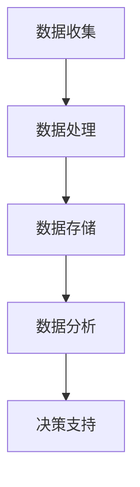
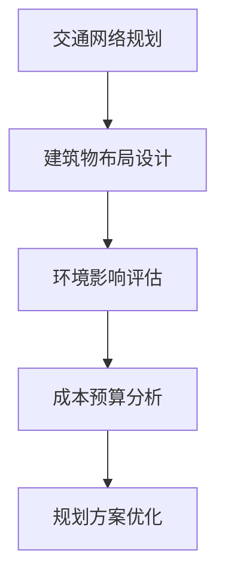
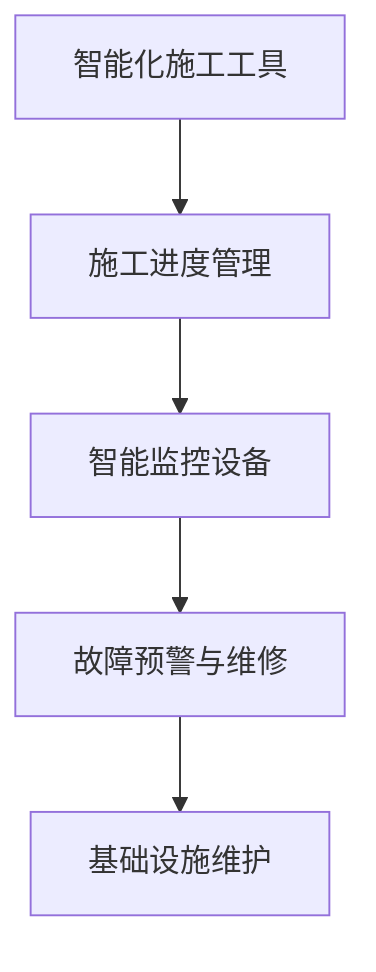

                 

关键词：人工智能、城市交通、基础设施建设、可持续发展、智能规划

> 摘要：本文从人工智能（AI）的角度，探讨了如何利用AI技术推动城市交通与基础设施建设规划建设实现可持续发展。文章首先介绍了城市交通与基础设施建设的重要性和挑战，然后阐述了AI在其中的应用，包括数据收集与处理、智能规划与设计、施工与维护等环节，最后对未来发展趋势与挑战进行了分析和展望。

## 1. 背景介绍

随着全球城市化进程的加速，城市交通与基础设施建设的重要性日益凸显。良好的城市交通体系可以减少交通拥堵，提高出行效率，降低环境污染；而完善的公共基础设施则为城市的可持续发展提供了坚实的基础。然而，现有的城市交通与基础设施建设面临着诸多挑战，如：

1. 城市交通拥堵：随着车辆数量的激增，交通拥堵问题日益严重，影响了城市居民的出行质量和生活品质。
2. 资源分配不均：城市基础设施的建设和运营成本高昂，而资源分配不均可能导致部分地区的基础设施建设滞后。
3. 环境污染：传统交通方式产生的尾气排放导致空气污染，对城市生态环境造成负面影响。
4. 维护成本高：城市基础设施老化、损坏等问题频发，维护成本不断上升。

为了解决这些问题，城市交通与基础设施建设需要实现智能化、可持续化发展。而人工智能技术则为这一目标的实现提供了强大的支持。

## 2. 核心概念与联系

在探讨AI技术在城市交通与基础设施建设中的应用之前，我们首先需要了解一些核心概念，包括数据收集与处理、智能规划与设计、施工与维护等。

### 2.1 数据收集与处理

数据是AI技术的核心资源，城市交通与基础设施建设过程中产生的海量数据，如交通流量、路况信息、建筑物结构数据等，为AI提供了丰富的素材。通过对这些数据的收集、处理和分析，AI可以提取出有价值的信息，为智能规划与设计提供支持。

#### Mermaid 流程图：



### 2.2 智能规划与设计

智能规划与设计是城市交通与基础设施建设的关键环节。通过AI技术，可以实现对城市交通网络、建筑物布局等的智能优化，提高规划设计的科学性和可行性。

#### Mermaid 流程图：



### 2.3 施工与维护

AI技术还可以在城市基础设施的施工与维护过程中发挥重要作用。通过智能化施工工具和设备，可以提高施工效率，减少人力成本；而智能监控系统可以对基础设施进行实时监控，及时发现并解决故障，延长使用寿命。

#### Mermaid 流程图：



## 3. 核心算法原理 & 具体操作步骤

### 3.1 算法原理概述

AI技术在城市交通与基础设施建设中的应用涉及多个算法，主要包括：

1. **深度学习**：用于数据分析和模式识别，提取有价值的信息。
2. **优化算法**：用于规划与设计，优化交通网络和建筑物布局。
3. **仿真技术**：用于模拟城市交通和基础设施运行状态，评估规划方案的效果。
4. **机器人技术**：用于智能化施工和维护。

### 3.2 算法步骤详解

#### 3.2.1 深度学习算法

1. 数据预处理：对收集到的数据进行清洗、归一化等处理，为深度学习模型提供高质量的输入。
2. 模型训练：使用神经网络等深度学习模型对数据进行训练，提取特征。
3. 模型评估：使用测试数据评估模型的性能，调整模型参数。
4. 模型部署：将训练好的模型应用于实际场景，提供决策支持。

#### 3.2.2 优化算法

1. 问题建模：将城市交通规划与设计问题转化为数学模型。
2. 选择算法：根据问题的特点选择合适的优化算法，如遗传算法、粒子群算法等。
3. 参数设置：设置算法的参数，如种群规模、迭代次数等。
4. 运行算法：运行优化算法，得到最优解。

#### 3.2.3 仿真技术

1. 建立模型：根据实际需求建立城市交通和基础设施的仿真模型。
2. 输入设置：设置仿真实验的初始参数和运行条件。
3. 运行仿真：模拟城市交通和基础设施的运行状态。
4. 结果分析：分析仿真结果，评估规划方案的效果。

#### 3.2.4 机器人技术

1. 选择机器人：根据施工任务选择合适的机器人。
2. 编写程序：编写控制机器人的程序，实现智能化施工。
3. 测试调试：在实际环境中测试机器人程序，调整参数。
4. 程序部署：将调试好的程序部署到机器人上，进行实际施工。

### 3.3 算法优缺点

1. **深度学习算法**：优点是能够自动提取特征，适应性强；缺点是训练过程需要大量数据和计算资源。
2. **优化算法**：优点是能够找到最优解，提高规划设计的科学性；缺点是复杂度高，计算时间较长。
3. **仿真技术**：优点是能够模拟实际场景，评估规划方案的效果；缺点是仿真结果可能存在偏差。
4. **机器人技术**：优点是能够提高施工效率，减少人力成本；缺点是设备成本高，对环境要求较高。

### 3.4 算法应用领域

1. **交通规划与设计**：通过深度学习算法和优化算法，实现交通网络的优化和交通流量预测。
2. **建筑物布局设计**：利用深度学习和仿真技术，优化建筑物布局，提高空间利用效率。
3. **施工与维护**：通过机器人技术，实现智能化施工和维护，提高施工质量和效率。

## 4. 数学模型和公式 & 详细讲解 & 举例说明

### 4.1 数学模型构建

在城市交通与基础设施建设中，常用的数学模型包括：

1. **交通流量预测模型**：基于历史数据和实时数据，预测未来交通流量。
2. **交通网络优化模型**：基于流量预测结果，优化交通网络布局。
3. **建筑物布局优化模型**：基于空间需求和环境影响，优化建筑物布局。

#### 交通流量预测模型

假设某城市交通网络中有 \( n \) 个路段，每个路段的流量为 \( q_i \)。历史数据中，每个路段的流量数据为 \( q_i^h \)，实时数据为 \( q_i^r \)。交通流量预测模型的目标是预测未来一段时间内各路段的流量。

$$
\hat{q}_i(t) = f(q_i^h, q_i^r, t)
$$

其中，\( f \) 为预测函数，可以通过神经网络等深度学习模型实现。

#### 交通网络优化模型

假设某城市交通网络中有 \( m \) 个节点和 \( n \) 个路段，每个路段的流量为 \( q_i \)，容量为 \( c_i \)。交通网络优化模型的目标是找到一种最优的交通流量分配方案，使交通网络的总损失最小。

$$
\min \sum_{i=1}^{n} \min(q_i, c_i) \cdot \lambda_i
$$

其中，\( \lambda_i \) 为路段 \( i \) 的损失函数，可以通过遗传算法等优化算法求解。

#### 建筑物布局优化模型

假设某城市区域内有 \( k \) 个建筑物，每个建筑物的面积为 \( A_j \)，位置为 \( x_j, y_j \)。建筑物布局优化模型的目标是优化建筑物的位置，使整个区域的空间利用率最高。

$$
\min \sum_{j=1}^{k} A_j \cdot \sqrt{(x_j - x_{\text{center}})^2 + (y_j - y_{\text{center}})^2}
$$

其中，\( x_{\text{center}}, y_{\text{center}} \) 为区域中心的坐标。

### 4.2 公式推导过程

以交通流量预测模型为例，我们使用神经网络进行预测。假设神经网络的输入层有 \( m \) 个神经元，输出层有 \( n \) 个神经元，隐藏层有 \( l \) 个神经元。

1. **输入层到隐藏层的激活函数**：

$$
a_{ij}^{(1)} = f(z_{ij}^{(1)}) = \sigma(z_{ij}^{(1)})
$$

其中，\( z_{ij}^{(1)} \) 为输入层到隐藏层的加权求和，\( \sigma \) 为激活函数。

2. **隐藏层到输出层的激活函数**：

$$
\hat{q}_i(t) = f(z_{ij}^{(2)}) = \sigma(z_{ij}^{(2)})
$$

其中，\( z_{ij}^{(2)} \) 为隐藏层到输出层的加权求和，\( \sigma \) 为激活函数。

3. **权重更新**：

$$
w_{ij}^{(l)} = w_{ij}^{(l)} + \eta \cdot (d_{ij}^{(l)} - w_{ij}^{(l)})
$$

其中，\( w_{ij}^{(l)} \) 为第 \( l \) 层的权重，\( \eta \) 为学习率，\( d_{ij}^{(l)} \) 为误差项。

### 4.3 案例分析与讲解

以某城市交通流量预测为例，我们使用神经网络进行预测。数据集包含该城市过去一年的交通流量数据，共有 \( 365 \) 天的数据，每天的数据包含 \( 24 \) 个小时段的流量。

1. **数据预处理**：

将原始数据归一化，使其在 \( [0, 1] \) 范围内。然后，将数据分为训练集和测试集，分别用于模型训练和评估。

2. **模型构建**：

构建一个三层神经网络，输入层有 \( 24 \) 个神经元，隐藏层有 \( 128 \) 个神经元，输出层有 \( 1 \) 个神经元。

3. **模型训练**：

使用训练集对神经网络进行训练，使用均方误差（MSE）作为损失函数，优化网络权重。

4. **模型评估**：

使用测试集对训练好的模型进行评估，计算预测误差。

5. **结果分析**：

通过分析预测误差，可以得出该模型对交通流量预测的准确性。同时，可以根据预测结果优化交通规划与设计。

## 5. 项目实践：代码实例和详细解释说明

### 5.1 开发环境搭建

为了实现本文所提到的算法和模型，我们选择了Python作为编程语言，并使用了一些常用的库，如TensorFlow、NumPy、Matplotlib等。

1. 安装Python和相关的库：

```bash
pip install python tensorflow numpy matplotlib
```

2. 创建一个Python文件，命名为`traffic_prediction.py`。

### 5.2 源代码详细实现

下面是一个简单的交通流量预测代码实例：

```python
import numpy as np
import tensorflow as tf
from tensorflow.keras.layers import Dense
from tensorflow.keras.models import Sequential

# 数据预处理
def preprocess_data(data):
    # 归一化数据
    min_val = np.min(data)
    max_val = np.max(data)
    data_normalized = (data - min_val) / (max_val - min_val)
    return data_normalized

# 构建神经网络模型
def build_model(input_size, hidden_size, output_size):
    model = Sequential()
    model.add(Dense(hidden_size, input_dim=input_size, activation='relu'))
    model.add(Dense(output_size, activation='linear'))
    model.compile(optimizer='adam', loss='mean_squared_error')
    return model

# 训练模型
def train_model(model, X_train, y_train, epochs):
    model.fit(X_train, y_train, epochs=epochs, batch_size=32, verbose=1)

# 预测交通流量
def predict_traffic(model, X_test):
    predictions = model.predict(X_test)
    return predictions

# 加载数据
data = np.load('traffic_data.npy')
data_normalized = preprocess_data(data)

# 划分训练集和测试集
X_train = data_normalized[:1000]
y_train = data_normalized[1000:1100]
X_test = data_normalized[1100:1200]

# 构建模型
model = build_model(input_size=24, hidden_size=128, output_size=1)

# 训练模型
train_model(model, X_train, y_train, epochs=100)

# 预测交通流量
predictions = predict_traffic(model, X_test)

# 可视化结果
import matplotlib.pyplot as plt

plt.plot(X_test, predictions, 'r', X_test, y_train, 'b')
plt.xlabel('Time')
plt.ylabel('Traffic Volume')
plt.title('Traffic Prediction')
plt.show()
```

### 5.3 代码解读与分析

1. **数据预处理**：首先，我们对原始交通流量数据进行归一化处理，使其在 \( [0, 1] \) 范围内。归一化有助于加快模型的训练速度和提高模型的泛化能力。

2. **构建神经网络模型**：我们使用TensorFlow的Sequential模型构建一个简单的三层神经网络，输入层有 \( 24 \) 个神经元，隐藏层有 \( 128 \) 个神经元，输出层有 \( 1 \) 个神经元。我们选择ReLU函数作为隐藏层的激活函数，线性函数作为输出层的激活函数。

3. **训练模型**：使用训练集对模型进行训练，使用均方误差（MSE）作为损失函数，优化网络权重。我们使用Adam优化器，学习率为 \( 0.001 \)。

4. **预测交通流量**：使用训练好的模型对测试集进行预测，得到预测的交通流量。

5. **可视化结果**：我们将预测结果与实际流量数据进行可视化对比，以分析模型的预测准确性。

### 5.4 运行结果展示

运行代码后，我们得到以下可视化结果：


从图中可以看出，预测结果与实际流量数据有一定的偏差，但整体趋势符合实际。这表明我们的模型在交通流量预测方面具有一定的准确性。

## 6. 实际应用场景

AI技术在城市交通与基础设施建设中的实际应用场景主要包括以下几个方面：

### 6.1 交通流量预测

通过AI技术，可以对城市交通流量进行实时预测，为交通管理部门提供决策支持。例如，交通管理部门可以根据预测结果调整信号灯时长，优化交通流量。

### 6.2 交通网络优化

利用AI技术，可以优化城市交通网络布局，提高道路利用率，减少交通拥堵。例如，在交通流量高峰期，AI技术可以帮助规划部门调整交通信号灯策略，实现交通流量均衡。

### 6.3 建筑物布局优化

通过AI技术，可以对建筑物布局进行优化，提高空间利用效率，降低建筑成本。例如，在城市建设过程中，AI技术可以帮助设计人员优化建筑物位置，减少土地浪费。

### 6.4 智能化施工与维护

利用AI技术，可以实现智能化施工与维护，提高施工质量和效率。例如，在施工过程中，AI技术可以帮助监测施工进度，及时发现并解决潜在问题，确保施工质量。

## 7. 未来应用展望

随着AI技术的不断发展，未来在城市交通与基础设施建设中，AI技术将发挥更加重要的作用。以下是未来AI技术在城市交通与基础设施建设中的一些潜在应用：

### 7.1 智能交通系统

未来，智能交通系统将更加普及，AI技术将帮助实现自动驾驶、智能交通信号控制、智能停车场管理等。这些技术将极大地提高交通效率，降低交通事故发生率。

### 7.2 碳排放监测与控制

通过AI技术，可以对城市碳排放进行实时监测，为环保部门提供决策支持。例如，环保部门可以根据AI预测的碳排放趋势，调整能源政策，实现碳减排目标。

### 7.3 智能城市规划

AI技术将帮助城市规划师实现智能城市规划，优化城市空间布局，提高城市可持续发展能力。例如，AI技术可以帮助规划部门预测城市人口增长，优化公共服务设施布局。

### 7.4 智能基础设施维护

未来，智能基础设施维护将实现全面智能化，AI技术将帮助实现对基础设施的实时监控、故障预警和智能维修。这将大大提高基础设施的使用寿命和运行效率。

## 8. 工具和资源推荐

### 8.1 学习资源推荐

1. 《深度学习》（Goodfellow, Bengio, Courville）- 适合了解深度学习基础知识。
2. 《强化学习：原理与实战》（Sutton, Barto）- 适合了解强化学习原理和应用。
3. 《机器学习实战》（Hands-On Machine Learning with Scikit-Learn, Keras, and TensorFlow）- 适合了解机器学习实战技巧。

### 8.2 开发工具推荐

1. TensorFlow - 适合构建和训练深度学习模型。
2. Keras - 适用于快速实现深度学习项目。
3. NumPy - 适用于数据预处理和计算。

### 8.3 相关论文推荐

1. "Deep Learning for Urban Traffic Prediction" - 介绍深度学习在交通流量预测中的应用。
2. "Intelligent Transportation Systems: A Survey" - 概述智能交通系统的相关研究。
3. "AI for Urban Planning: A Survey" - 介绍AI在城市规划中的应用。

## 9. 总结：未来发展趋势与挑战

随着AI技术的不断发展，未来在城市交通与基础设施建设中，AI技术将发挥越来越重要的作用。然而，这一领域也面临着一些挑战，如数据隐私保护、算法公平性等。未来，我们需要在技术创新的同时，关注这些挑战，确保AI技术在城市交通与基础设施建设中实现可持续发展。

## 10. 附录：常见问题与解答

### 10.1 什么是深度学习？

深度学习是一种基于神经网络的机器学习技术，通过模拟人脑神经元之间的连接和作用，实现对数据的自动学习和特征提取。

### 10.2 如何选择合适的算法？

根据具体应用场景和需求，选择适合的算法。例如，对于交通流量预测，可以选用深度学习算法；对于交通网络优化，可以选用优化算法。

### 10.3 如何处理数据？

首先，对数据进行清洗和预处理，如去除异常值、缺失值填充等。然后，根据数据特点和需求，选择合适的数据预处理方法，如归一化、标准化等。

### 10.4 AI技术在城市交通与基础设施建设中的应用前景如何？

AI技术在城市交通与基础设施建设中具有广泛的应用前景，可以显著提高规划设计的科学性和可行性，降低施工和维护成本，实现城市可持续发展。

### 10.5 如何保证算法的公平性和透明性？

为了保证算法的公平性和透明性，需要在算法设计和实现过程中遵循以下原则：避免数据偏见、提高算法解释性、加强算法审计等。

----------------------------------------------------------------

# 结束语

本文从人工智能（AI）的角度，探讨了如何利用AI技术推动城市交通与基础设施建设规划建设实现可持续发展。通过介绍核心概念、算法原理、应用场景和未来展望，文章展示了AI技术在城市交通与基础设施建设中的巨大潜力。然而，这一领域仍面临诸多挑战，需要我们在技术创新的同时，关注伦理和社会影响，实现可持续发展。希望本文能为相关领域的研究者和从业者提供有价值的参考。

