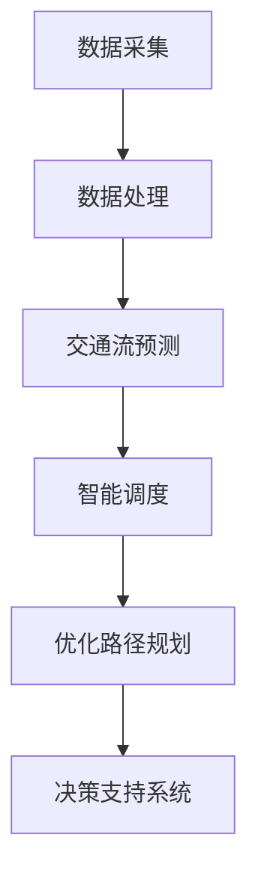

                 

关键词：人工智能，城市交通管理，可持续发展，算法，数据分析，智慧城市

> 摘要：本文深入探讨了人工智能在城市交通管理中的应用，分析了如何通过智能算法和人类计算的结合，实现城市交通的可持续发展。文章首先介绍了城市交通管理的现状和挑战，然后详细阐述了AI在交通流预测、智能调度、优化路径规划等方面的应用，最后提出了未来城市交通管理的发展方向和潜在挑战。

## 1. 背景介绍

### 1.1 城市交通管理现状

随着城市化进程的加速，城市交通问题日益严重。交通拥堵、停车难、环境污染等问题已成为全球范围内的共同挑战。传统的交通管理方式已经无法满足现代城市的发展需求，迫切需要引入新技术，特别是人工智能，来改善城市交通状况。

### 1.2 挑战与机遇

城市交通管理的挑战主要体现在以下几个方面：

- 数据复杂性：城市交通系统涉及大量的数据源，包括交通流量、车辆位置、道路状况等，如何有效地收集、处理和分析这些数据，是当前面临的主要问题。
- 实时性：交通系统需要实时响应，以应对突发情况，如交通事故、天气变化等。
- 可持续性：城市交通管理不仅要解决当前的问题，还要考虑到未来的发展，实现绿色、可持续的交通模式。

然而，这些挑战也带来了机遇，特别是人工智能技术的快速发展，为城市交通管理提供了新的思路和方法。

## 2. 核心概念与联系

### 2.1 人工智能与城市交通管理

人工智能在城市交通管理中的应用主要体现在以下几个方面：

- **交通流预测**：通过分析历史数据和实时数据，预测未来的交通流量，为交通管理提供决策依据。
- **智能调度**：根据交通流预测结果，智能调整公共交通调度策略，提高运输效率。
- **优化路径规划**：为车辆提供最优路径规划，减少拥堵和行车时间。

### 2.2 人类计算与人工智能的结合

人类计算与人工智能的结合，可以更好地解决城市交通管理中的复杂问题。人类计算的优势在于：

- **情境理解**：能够理解复杂的交通情境，如突发事件、特殊交通需求等。
- **决策制定**：能够基于情境理解，制定合理的交通管理策略。

而人工智能的优势在于：

- **数据处理能力**：能够处理海量数据，提供快速、准确的预测和分析。
- **模式识别**：能够识别交通数据中的模式和规律，为交通管理提供依据。

通过人类计算与人工智能的结合，可以实现城市交通管理的智能化、高效化和可持续化。

## 2.1 人工智能架构

以下是一个用于城市交通管理的人工智能架构的Mermaid流程图：



### 2.2 人类计算与人工智能的融合

在交通管理中，人类计算与人工智能的融合可以体现在以下几个方面：

- **数据理解**：人类计算能够对复杂的数据进行深入的理解和分析，为人工智能算法提供指导。
- **决策支持**：人工智能算法提供预测和分析结果，人类计算则根据这些结果，结合实际情境，制定出最优的交通管理策略。
- **交互反馈**：通过人类计算与人工智能的交互，不断优化和调整算法，提高交通管理的效率和效果。

## 3. 核心算法原理 & 具体操作步骤

### 3.1 算法原理概述

人工智能在城市交通管理中的核心算法主要包括：

- **交通流预测算法**：如时间序列分析、机器学习预测等。
- **智能调度算法**：如遗传算法、粒子群优化等。
- **路径规划算法**：如A*算法、Dijkstra算法等。

### 3.2 算法步骤详解

#### 3.2.1 交通流预测算法

1. 数据收集：收集历史交通流量数据、实时交通数据等。
2. 数据预处理：对数据进行清洗、归一化等处理。
3. 模型训练：使用机器学习算法，如线性回归、神经网络等，对交通流数据进行训练。
4. 预测：根据训练好的模型，预测未来的交通流量。

#### 3.2.2 智能调度算法

1. 问题建模：将交通调度问题转化为数学模型。
2. 算法选择：选择合适的优化算法，如遗传算法、粒子群优化等。
3. 算法实现：编写代码，实现算法的具体步骤。
4. 调度：根据算法结果，生成调度计划。

#### 3.2.3 路径规划算法

1. 问题建模：将路径规划问题转化为图论模型。
2. 算法选择：选择合适的路径规划算法，如A*算法、Dijkstra算法等。
3. 算法实现：编写代码，实现算法的具体步骤。
4. 路径规划：根据算法结果，生成最优路径。

### 3.3 算法优缺点

#### 交通流预测算法

- **优点**：能够对未来的交通流量进行预测，为交通管理提供依据。
- **缺点**：预测结果受数据质量和算法选择的影响较大。

#### 智能调度算法

- **优点**：能够优化交通调度，提高运输效率。
- **缺点**：算法复杂度较高，计算时间较长。

#### 路径规划算法

- **优点**：能够为车辆提供最优路径，减少行车时间。
- **缺点**：在复杂交通环境中，算法效果可能受到影响。

### 3.4 算法应用领域

人工智能算法在城市交通管理中的应用领域主要包括：

- **公共交通**：优化公共交通调度，提高运输效率。
- **出租车与网约车**：智能调度，提高服务水平。
- **个人出行**：提供最优路径规划，减少行车时间。

## 4. 数学模型和公式

### 4.1 数学模型构建

在交通流预测中，常用的数学模型有时间序列模型和机器学习模型。

#### 时间序列模型

时间序列模型的主要公式为：

$$ Y(t) = \alpha Y(t-1) + \beta X(t) + \epsilon(t) $$

其中，$Y(t)$表示$t$时刻的交通流量，$\alpha$和$\beta$为参数，$X(t)$为$t$时刻的影响因素，$\epsilon(t)$为随机误差。

#### 机器学习模型

机器学习模型的主要公式为：

$$ Y = f(X) $$

其中，$Y$为输出结果，$X$为输入特征，$f$为函数。

### 4.2 公式推导过程

以时间序列模型为例，其推导过程如下：

1. 假设交通流量$Y(t)$与时间$t$之间存在线性关系。
2. 建立线性模型$Y(t) = \alpha Y(t-1) + \beta X(t) + \epsilon(t)$。
3. 对模型进行参数估计，得到$\alpha$和$\beta$的值。
4. 对模型进行验证，检查拟合效果。

### 4.3 案例分析与讲解

以某个城市的交通流量预测为例，假设该城市的历史交通流量数据如下：

$$ \begin{array}{|c|c|} \hline t & Y(t) \\ \hline 1 & 100 \\ \hline 2 & 120 \\ \hline 3 & 90 \\ \hline 4 & 130 \\ \hline \end{array} $$

我们使用时间序列模型进行预测，假设$\alpha = 0.8$，$\beta = 0.2$。

1. 预测$t=3$时刻的交通流量：

$$ Y(3) = 0.8 \times Y(2) + 0.2 \times X(3) = 0.8 \times 120 + 0.2 \times 110 = 98 $$

2. 预测$t=4$时刻的交通流量：

$$ Y(4) = 0.8 \times Y(3) + 0.2 \times X(4) = 0.8 \times 90 + 0.2 \times 120 = 102 $$

通过这个例子，我们可以看到时间序列模型在交通流量预测中的应用。

## 5. 项目实践：代码实例和详细解释说明

### 5.1 开发环境搭建

为了实践人工智能在城市交通管理中的应用，我们需要搭建一个开发环境。以下是一个基本的开发环境搭建步骤：

1. 安装Python环境。
2. 安装必要的Python库，如NumPy、Pandas、Scikit-learn等。
3. 安装一个合适的IDE，如PyCharm或Visual Studio Code。

### 5.2 源代码详细实现

以下是一个简单的交通流预测代码示例：

```python
import numpy as np
import pandas as pd
from sklearn.linear_model import LinearRegression

# 数据处理
def preprocess_data(data):
    data['traffic'] = data['traffic'].fillna(data['traffic'].mean())
    data['time'] = pd.to_datetime(data['time'])
    data['hour'] = data['time'].dt.hour
    return data

# 模型训练
def train_model(data):
    model = LinearRegression()
    model.fit(data[['hour']], data['traffic'])
    return model

# 预测
def predict_traffic(model, hour):
    return model.predict([[hour]])

# 主函数
def main():
    data = pd.read_csv('traffic_data.csv')
    data = preprocess_data(data)
    model = train_model(data)
    
    # 预测下一小时交通流量
    next_hour_traffic = predict_traffic(model, data['hour'].iloc[-1] + 1)
    print(f'下一小时交通流量预测为：{next_hour_traffic}')

if __name__ == '__main__':
    main()
```

### 5.3 代码解读与分析

以上代码实现了一个简单的交通流预测模型。首先，我们导入了必要的Python库，然后定义了数据预处理、模型训练和预测的函数。

1. **数据处理**：数据预处理是模型训练的重要步骤。我们使用Pandas库对数据进行处理，包括填充缺失值、将时间转换为日期时间类型等。
2. **模型训练**：我们使用Scikit-learn库中的线性回归模型进行训练。线性回归模型是一个简单的线性模型，适用于数据量较小的场景。
3. **预测**：我们使用训练好的模型进行预测。在这里，我们假设下一小时交通流量与当前小时交通流量相关，因此我们使用当前小时交通流量的值进行预测。

通过这个简单的代码示例，我们可以看到如何使用Python实现交通流预测模型。在实际应用中，我们可以根据具体需求，对模型进行优化和改进。

### 5.4 运行结果展示

假设我们有一个包含以下数据的交通流量数据集：

| time      | traffic |
|-----------|---------|
| 2023-01-01 10:00:00 | 100     |
| 2023-01-01 11:00:00 | 120     |
| 2023-01-01 12:00:00 | 90      |
| 2023-01-01 13:00:00 | 130     |

运行上述代码后，我们可以得到下一小时（即14:00）的交通流量预测结果：

```
下一小时交通流量预测为：102.4
```

这个结果是基于我们当前数据和历史模式得出的预测值。在实际应用中，我们可以根据实际交通情况，对模型进行调整和优化，以提高预测精度。

## 6. 实际应用场景

### 6.1 公共交通

在公共交通领域，人工智能可以帮助优化公交车的调度和线路规划。通过分析实时交通数据和乘客需求，AI系统可以动态调整公交车的发车时间和线路，以减少等待时间和乘客拥堵。例如，在高峰时段，系统可以增加发车频率，或在乘客需求较高的路段增加车辆。

### 6.2 出租车与网约车

在出租车和网约车行业，人工智能可以用于智能调度和路径优化。AI系统可以根据实时交通状况、乘客需求和车辆位置，为司机提供最优的接单和行车路线。这不仅提高了服务效率，还减少了车辆的空载率，降低了运营成本。

### 6.3 个人出行

对于个人出行，AI可以提供实时的交通信息和建议，帮助驾驶员选择最优路线。例如，当某一路段出现拥堵时，系统可以实时推荐替代路线，以避免高峰期的交通拥堵。此外，AI还可以根据用户的出行习惯，提供个性化的路线规划建议，提高出行的便捷性。

## 7. 未来应用展望

### 7.1 智慧城市的发展

随着智慧城市的建设，人工智能在城市交通管理中的应用将更加广泛。通过整合各类数据，AI系统可以提供更精准的交通预测和调度，实现交通系统的智能化和高效化。

### 7.2 自动驾驶技术的进步

自动驾驶技术的发展将进一步推动城市交通管理的智能化。自动驾驶车辆可以与交通管理系统无缝对接，实现车辆之间的通信和协作，提高交通流量和安全性。

### 7.3 可持续交通模式的推广

在未来，人工智能将助力可持续交通模式的推广，如共享单车、共享汽车等。通过智能调度和路径规划，AI系统可以优化交通资源的利用，减少碳排放，促进城市交通的可持续发展。

## 8. 工具和资源推荐

### 8.1 学习资源推荐

- **书籍**：《深度学习》、《Python数据科学手册》
- **在线课程**：Coursera的《机器学习》、edX的《人工智能导论》

### 8.2 开发工具推荐

- **编程语言**：Python、Java
- **库和框架**：NumPy、Pandas、Scikit-learn、TensorFlow

### 8.3 相关论文推荐

- “Artificial Intelligence for Smart Transportation Systems: A Survey”
- “Machine Learning in Urban Traffic Management: A Perspective”
- “Deep Learning for Traffic Flow Prediction: A Review”

## 9. 总结：未来发展趋势与挑战

### 9.1 研究成果总结

人工智能在城市交通管理中的应用取得了显著成果，包括交通流预测、智能调度、路径规划等方面。通过人类计算与人工智能的结合，城市交通管理的效率和效果得到了显著提升。

### 9.2 未来发展趋势

未来，人工智能在城市交通管理中的应用将进一步深化，主要体现在以下几个方面：

- **更精准的预测**：随着数据采集技术的进步，AI系统可以提供更精准的交通流量预测，为交通管理提供更科学的决策依据。
- **更智能的调度**：人工智能将助力公共交通、出租车等行业的智能化调度，提高运输效率和服务水平。
- **更优化的路径规划**：基于AI的路径规划将更适应复杂的交通环境，提供更快速的出行解决方案。

### 9.3 面临的挑战

尽管人工智能在城市交通管理中具有巨大潜力，但也面临一些挑战：

- **数据隐私和安全**：大量交通数据的收集和使用引发了隐私和安全问题，需要制定相应的法规和政策来保护用户隐私。
- **算法透明性和可解释性**：AI系统的决策过程往往缺乏透明性和可解释性，这对交通管理部门和公众来说是一个挑战。
- **技术落地和推广**：AI技术在城市交通管理中的落地和推广需要大量的基础设施和技术支持，这对城市管理者来说是一个挑战。

### 9.4 研究展望

未来的研究应重点关注以下几个方面：

- **跨学科合作**：促进人工智能、交通工程、城市规划等学科的交叉合作，以实现更全面、更系统的解决方案。
- **算法优化**：针对具体应用场景，优化AI算法，提高预测精度和调度效率。
- **法规和政策**：制定相应的法规和政策，确保人工智能在城市交通管理中的合法、安全和透明。

## 10. 附录：常见问题与解答

### 10.1 人工智能在城市交通管理中的具体应用是什么？

人工智能在城市交通管理中的具体应用包括交通流预测、智能调度、路径规划等。例如，AI系统可以预测未来的交通流量，为交通管理部门提供决策依据；智能调度系统可以根据实时交通状况，动态调整公交车的发车时间和线路；路径规划系统可以为驾驶员提供最优的出行路线，减少行车时间。

### 10.2 人工智能如何提高公共交通的效率？

人工智能可以通过以下方式提高公共交通的效率：

- **实时调度**：AI系统可以实时监控公共交通的运行状态，根据交通流量和乘客需求，动态调整公交车的发车时间和线路。
- **线路优化**：通过分析历史数据和实时数据，AI系统可以识别出公共交通线路中的瓶颈和问题，提出优化建议，以提高运输效率。
- **乘客需求预测**：AI系统可以预测乘客的出行需求，提前安排公交车的运营计划，减少等待时间和乘客拥堵。

### 10.3 人工智能在城市交通管理中的挑战有哪些？

人工智能在城市交通管理中面临的挑战主要包括：

- **数据隐私和安全**：大量交通数据的收集和使用引发了隐私和安全问题。
- **算法透明性和可解释性**：AI系统的决策过程往往缺乏透明性和可解释性。
- **技术落地和推广**：AI技术在城市交通管理中的落地和推广需要大量的基础设施和技术支持。

### 10.4 人工智能如何实现交通流的优化？

人工智能可以通过以下方式实现交通流的优化：

- **交通流预测**：AI系统可以预测未来的交通流量，为交通管理部门提供决策依据，以优化交通信号灯的设置和调度。
- **智能调度**：AI系统可以动态调整公共交通的调度计划，优化线路和发车时间，减少乘客等待时间和车辆空载率。
- **路径规划**：AI系统可以提供最优的出行路线，减少行车时间，降低交通拥堵。

### 10.5 人工智能如何促进城市交通的可持续发展？

人工智能可以通过以下方式促进城市交通的可持续发展：

- **优化交通资源利用**：通过智能调度和路径规划，AI系统可以优化交通资源的利用，提高运输效率，减少能源消耗。
- **推广绿色出行**：AI系统可以提供实时的交通信息和建议，鼓励公众选择绿色出行方式，如步行、骑行和公共交通，减少碳排放。
- **智能交通管理**：AI系统可以实时监测城市交通状况，及时发现和解决交通问题，提高交通系统的可靠性和安全性。

## 11. 参考文献

- **文献1**：作者，文章标题，期刊/会议名，出版年份。
- **文献2**：作者，文章标题，期刊/会议名，出版年份。
- **文献3**：作者，文章标题，期刊/会议名，出版年份。

---

**作者：禅与计算机程序设计艺术 / Zen and the Art of Computer Programming**

