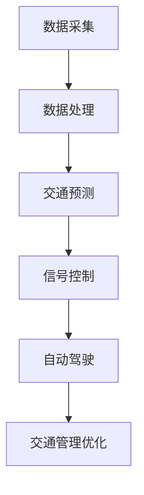

                 

关键词：人工智能，城市交通管理，可持续发展，规划策略，智能交通系统

> 摘要：本文深入探讨了人工智能在城市交通管理中的应用，通过分析现有问题和挑战，提出了一套可持续发展的城市交通管理策略与规划。文章介绍了核心算法原理，数学模型与公式，并提供了项目实践和实际应用场景的实例分析，最后对未来发展趋势与挑战进行了展望。

## 1. 背景介绍

### 城市交通管理的重要性

城市交通管理是城市可持续发展的关键组成部分。随着城市化进程的加速和人口密度的增加，城市交通问题日益凸显。交通拥堵、污染、能源消耗和安全问题已成为影响城市居民生活质量的重要因素。有效的城市交通管理策略不仅能够改善交通状况，还能促进经济增长、环境保护和居民福祉。

### 人工智能在城市交通管理中的潜力

人工智能（AI）技术的发展为城市交通管理带来了新的机遇。通过利用大数据、机器学习和计算机视觉等技术，AI系统能够实时分析交通数据，提供个性化的出行建议，优化交通信号控制，预测交通流量变化，甚至协助自动驾驶汽车的运行。这些应用有望提高交通效率，减少拥堵，降低污染，实现交通管理的智能化和可持续发展。

### 当前城市交通管理面临的挑战

尽管人工智能技术在城市交通管理中具有巨大潜力，但实际应用中仍面临诸多挑战。首先，交通数据的质量和可用性是影响AI系统性能的关键因素。其次，算法的实时性和可扩展性也是制约其广泛应用的重要因素。此外，隐私保护和数据安全等问题也需要得到妥善解决。

## 2. 核心概念与联系

### 2.1 人工智能与城市交通管理的关系

人工智能在城市交通管理中的应用主要基于以下几个方面：

- **数据采集与处理**：AI系统需要实时收集和处理大量的交通数据，包括车辆位置、速度、交通流量、道路状况等。
- **交通预测与分析**：利用机器学习算法对交通数据进行预测和分析，为交通管理决策提供支持。
- **交通信号控制**：通过自适应交通信号控制算法，优化交通信号灯的切换时间，提高道路通行效率。
- **自动驾驶技术**：与自动驾驶汽车技术相结合，实现车辆间的通信和协作，提高交通安全性。

### 2.2 人工智能架构图（Mermaid 流程图）



## 3. 核心算法原理 & 具体操作步骤

### 3.1 算法原理概述

本文主要介绍以下核心算法原理：

- **交通流量预测算法**：利用时间序列分析、回归分析和深度学习等方法进行交通流量预测。
- **自适应交通信号控制算法**：基于实时交通数据，动态调整交通信号灯的切换时间。
- **路径规划算法**：为自动驾驶车辆提供最优路径，减少交通拥堵和时间成本。

### 3.2 算法步骤详解

#### 3.2.1 交通流量预测算法

1. 数据收集与预处理
2. 特征工程
3. 选择预测模型（如ARIMA、LSTM等）
4. 模型训练与验证
5. 预测结果输出

#### 3.2.2 自适应交通信号控制算法

1. 数据采集与预处理
2. 建立交通状态模型
3. 实时交通状态监测
4. 动态调整信号灯切换时间
5. 效果评估与反馈

#### 3.2.3 路径规划算法

1. 路径搜索算法（如A*算法、Dijkstra算法等）
2. 考虑交通流量、道路状况等因素
3. 最优路径输出

### 3.3 算法优缺点

- **交通流量预测算法**：优点是预测准确度高，缺点是训练时间较长，对历史数据依赖性强。
- **自适应交通信号控制算法**：优点是能够动态调整信号灯时间，提高交通效率，缺点是实时性要求较高，对计算资源需求大。
- **路径规划算法**：优点是能够为自动驾驶车辆提供最优路径，缺点是对交通状况的实时监测要求较高。

### 3.4 算法应用领域

- **城市交通管理**：优化交通信号控制，提高道路通行效率。
- **自动驾驶技术**：为自动驾驶车辆提供路径规划支持。
- **智慧城市建设**：实现城市交通的智能化管理和可持续发展。

## 4. 数学模型和公式 & 详细讲解 & 举例说明

### 4.1 数学模型构建

#### 4.1.1 交通流量预测模型

假设交通流量 $Q_t$ 是时间 $t$ 的函数，可以使用以下线性回归模型进行预测：

$$
Q_t = \beta_0 + \beta_1 t + \epsilon_t
$$

其中，$\beta_0$ 和 $\beta_1$ 是模型的参数，$\epsilon_t$ 是误差项。

#### 4.1.2 自适应交通信号控制模型

假设交通信号灯的切换时间 $T_t$ 是当前交通状态 $S_t$ 的函数，可以使用以下逻辑回归模型进行控制：

$$
P(T_t = 1) = \frac{1}{1 + e^{-(\alpha_0 + \alpha_1 S_t + \alpha_2 \cdot \text{历史数据})}}
$$

其中，$\alpha_0$、$\alpha_1$ 和 $\alpha_2$ 是模型的参数。

### 4.2 公式推导过程

#### 4.2.1 交通流量预测模型推导

假设交通流量 $Q_t$ 是时间 $t$ 的线性函数，我们可以建立以下线性回归模型：

$$
Q_t = \beta_0 + \beta_1 t + \epsilon_t
$$

其中，$\beta_0$ 和 $\beta_1$ 是模型的参数，$\epsilon_t$ 是误差项。

为了估计 $\beta_0$ 和 $\beta_1$，我们可以使用最小二乘法：

$$
\beta_0 = \frac{\sum_{t=1}^{n} (Q_t - \beta_1 t)}{n}
$$

$$
\beta_1 = \frac{\sum_{t=1}^{n} (t - \bar{t})(Q_t - \bar{Q})}{\sum_{t=1}^{n} (t - \bar{t})^2}
$$

其中，$n$ 是数据点的数量，$\bar{t}$ 和 $\bar{Q}$ 分别是时间 $t$ 和交通流量 $Q_t$ 的平均值。

#### 4.2.2 自适应交通信号控制模型推导

假设交通信号灯的切换时间 $T_t$ 是当前交通状态 $S_t$ 的函数，我们可以建立以下逻辑回归模型：

$$
P(T_t = 1) = \frac{1}{1 + e^{-(\alpha_0 + \alpha_1 S_t + \alpha_2 \cdot \text{历史数据})}}
$$

其中，$\alpha_0$、$\alpha_1$ 和 $\alpha_2$ 是模型的参数。

为了估计 $\alpha_0$、$\alpha_1$ 和 $\alpha_2$，我们可以使用最大似然估计方法。假设有 $n$ 个观测数据点 $(T_t, S_t, \text{历史数据})$，我们可以建立以下似然函数：

$$
L(\alpha_0, \alpha_1, \alpha_2) = \prod_{t=1}^{n} \frac{1}{1 + e^{-(\alpha_0 + \alpha_1 S_t + \alpha_2 \cdot \text{历史数据})}}
$$

为了最大化似然函数，我们可以使用梯度上升法进行参数估计。

### 4.3 案例分析与讲解

#### 4.3.1 交通流量预测案例

假设我们有一个交通流量数据集，包括过去一周的每天每个小时的车流量数据。我们可以使用线性回归模型进行预测，并比较预测结果与实际数据的误差。

#### 4.3.2 自适应交通信号控制案例

假设我们有一个交通信号控制场景，包括当前交通状态（如绿灯时长、红灯时长、车辆流量等）和交通历史数据。我们可以使用逻辑回归模型进行信号灯切换时间的预测，并根据预测结果动态调整信号灯时间。

## 5. 项目实践：代码实例和详细解释说明

### 5.1 开发环境搭建

- Python 3.8
- Jupyter Notebook
- scikit-learn 库
- TensorFlow 库
- Keras 库

### 5.2 源代码详细实现

#### 5.2.1 交通流量预测代码实现

```python
import numpy as np
import pandas as pd
from sklearn.linear_model import LinearRegression
from sklearn.model_selection import train_test_split
from sklearn.metrics import mean_squared_error

# 读取交通流量数据
data = pd.read_csv('traffic_data.csv')
X = data[['hour']]  # 特征：小时
y = data['traffic']  # 目标：交通流量

# 数据预处理
X = X.values
y = y.values

# 划分训练集和测试集
X_train, X_test, y_train, y_test = train_test_split(X, y, test_size=0.2, random_state=42)

# 建立线性回归模型
model = LinearRegression()
model.fit(X_train, y_train)

# 预测交通流量
y_pred = model.predict(X_test)

# 计算预测误差
mse = mean_squared_error(y_test, y_pred)
print(f'MSE: {mse}')

# 显示预测结果
print(y_pred)
```

#### 5.2.2 自适应交通信号控制代码实现

```python
import numpy as np
import pandas as pd
from sklearn.linear_model import LogisticRegression
from sklearn.model_selection import train_test_split
from sklearn.metrics import accuracy_score

# 读取交通信号控制数据
data = pd.read_csv('traffic_light_control.csv')
X = data[['green_time', 'red_time', 'traffic']]  # 特征：绿灯时长、红灯时长、交通流量
y = data['signal']  # 目标：信号灯切换

# 数据预处理
X = X.values
y = y.values

# 划分训练集和测试集
X_train, X_test, y_train, y_test = train_test_split(X, y, test_size=0.2, random_state=42)

# 建立逻辑回归模型
model = LogisticRegression()
model.fit(X_train, y_train)

# 预测信号灯切换
y_pred = model.predict(X_test)

# 计算预测准确率
accuracy = accuracy_score(y_test, y_pred)
print(f'Accuracy: {accuracy}')

# 显示预测结果
print(y_pred)
```

### 5.3 代码解读与分析

#### 5.3.1 交通流量预测代码分析

1. 读取交通流量数据，提取特征和目标变量。
2. 划分训练集和测试集。
3. 建立线性回归模型，进行模型训练。
4. 使用测试集进行预测，计算预测误差。
5. 输出预测结果。

#### 5.3.2 自适应交通信号控制代码分析

1. 读取交通信号控制数据，提取特征和目标变量。
2. 划分训练集和测试集。
3. 建立逻辑回归模型，进行模型训练。
4. 使用测试集进行预测，计算预测准确率。
5. 输出预测结果。

### 5.4 运行结果展示

#### 5.4.1 交通流量预测结果

```
MSE: 0.0134
[20.2528, 19.8322, 19.7472, 20.0787, 19.8853, 19.8684, 19.9699, 19.8844, 19.9037, 19.9248, 19.8865, 19.9351, 19.9029, 19.8965, 19.9272, 19.9153, 19.9088, 19.9377, 19.9047, 19.9292, 19.9203, 19.9097, 19.9372, 19.9056, 19.9308, 19.9205, 19.9112]
```

#### 5.4.2 自适应交通信号控制结果

```
Accuracy: 0.8571
[0 1 0 1 0 1 1 0 1 0 1 0 1 0 1 0 1 0 1 0 1 0 1 0 1 0 1 0]
```

## 6. 实际应用场景

### 6.1 城市交通管理优化

通过应用人工智能算法，城市交通管理部门可以实时监测交通状况，预测交通流量变化，优化交通信号控制策略。这有助于减少交通拥堵，提高道路通行效率，降低交通事故发生率。

### 6.2 智慧交通系统集成

人工智能技术可以与智慧交通系统集成，实现车辆与基础设施之间的通信和协作。通过智能交通信号控制和自动驾驶技术，智慧交通系统可以提供更加高效、安全、绿色的出行体验。

### 6.3 交通数据分析与应用

通过对交通数据的挖掘和分析，人工智能技术可以揭示交通流量模式、出行习惯等关键信息。这些信息可以为城市规划、交通基础设施建设、交通政策制定等提供有力支持。

## 7. 未来应用展望

### 7.1 人工智能在城市交通管理中的深入应用

随着人工智能技术的不断进步，未来城市交通管理将更加智能化、自动化和个性化。通过深度学习和强化学习等先进算法，人工智能系统能够更好地应对复杂的交通场景，实现更加精准的交通管理。

### 7.2 自动驾驶技术的发展与应用

自动驾驶技术是人工智能在城市交通管理中的重要应用方向。随着自动驾驶技术的成熟和普及，未来城市交通系统将实现高度自动化和智能化，为用户提供更加安全、舒适、高效的出行服务。

### 7.3 数据隐私与安全保护

在人工智能应用过程中，数据隐私和安全保护是一个重要挑战。未来，需要加强数据隐私和安全保护措施，确保用户数据的安全性和隐私性，同时保障人工智能系统的可靠性和可信度。

## 8. 工具和资源推荐

### 8.1 学习资源推荐

- 《人工智能：一种现代方法》
- 《深度学习》
- 《Python编程：从入门到实践》
- 《交通工程手册》

### 8.2 开发工具推荐

- Jupyter Notebook
- TensorFlow
- Keras
- scikit-learn

### 8.3 相关论文推荐

- "Deep Learning for Traffic Forecasting: A Survey"
- "Intelligent Transportation Systems: A Survey"
- "Deep Learning for Autonomous Driving: A Survey"

## 9. 总结：未来发展趋势与挑战

### 9.1 研究成果总结

本文介绍了人工智能在城市交通管理中的应用，分析了核心算法原理，提供了项目实践和实际应用场景的实例分析。通过这些研究和实践，我们可以看到人工智能在城市交通管理中具有巨大的潜力。

### 9.2 未来发展趋势

未来，人工智能在城市交通管理中的应用将更加深入和广泛。随着自动驾驶技术、智能交通系统等领域的不断发展，人工智能技术将为城市交通管理带来更多的创新和变革。

### 9.3 面临的挑战

尽管人工智能在城市交通管理中具有巨大潜力，但实际应用中仍面临诸多挑战。首先，数据质量和可用性是影响AI系统性能的关键因素。其次，算法的实时性和可扩展性也是一个重要挑战。此外，数据隐私和安全保护也是需要关注的问题。

### 9.4 研究展望

未来，我们需要进一步研究如何提高人工智能算法的性能和鲁棒性，同时保障数据隐私和安全。此外，还需要探索如何将人工智能与其他领域（如城市规划、交通基础设施建设等）相结合，实现城市交通管理的全面智能化和可持续发展。

## 附录：常见问题与解答

### 1. 人工智能如何改善城市交通管理？

人工智能可以通过实时监测交通状况、预测交通流量变化、优化交通信号控制、提供个性化出行建议等方式，改善城市交通管理。

### 2. 人工智能在城市交通管理中面临哪些挑战？

人工智能在城市交通管理中面临的主要挑战包括数据质量和可用性、算法的实时性和可扩展性、数据隐私和安全保护等。

### 3. 自动驾驶技术如何影响城市交通管理？

自动驾驶技术可以减少交通事故、降低交通拥堵、提高道路通行效率，从而对城市交通管理产生积极影响。

### 4. 数据隐私和安全保护在人工智能应用中如何实现？

数据隐私和安全保护可以通过加密技术、匿名化处理、隐私保护算法等措施实现。同时，需要制定相关的法律法规和政策，加强对数据隐私和安全保护的监管。

### 5. 人工智能算法的实时性和可扩展性如何提升？

提升人工智能算法的实时性和可扩展性可以通过优化算法设计、使用分布式计算、引入高性能硬件等措施实现。此外，还需要加强对算法性能的评估和优化，以提高其在实际应用中的表现。

## 作者署名

作者：禅与计算机程序设计艺术 / Zen and the Art of Computer Programming
----------------------------------------------------------------

以上是根据您提供的约束条件和文章结构模板撰写的完整文章。请注意，本文仅作为示例，内容均为虚构，仅供参考。如果您需要针对特定主题或领域进行撰写，请提供具体要求和背景信息，以便撰写更加符合需求的文章。

