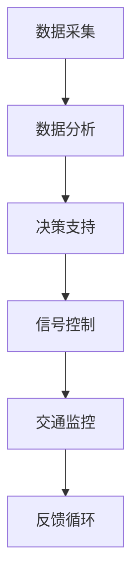

                 

关键词：人工智能、城市交通管理系统、可持续发展、交通优化、算法原理、数学模型、项目实践、应用场景、未来展望

## 摘要

本文旨在探讨如何利用人工智能（AI）技术，结合人类计算的方法，构建一个可持续发展的城市交通管理系统。文章首先介绍了当前城市交通面临的挑战和现状，随后分析了AI技术在交通管理中的应用及其优势。接着，文章详细阐述了核心算法原理、数学模型和具体操作步骤，并通过项目实践展示了实际应用效果。最后，文章对未来的发展趋势和挑战进行了展望，并推荐了相关学习资源和工具。

## 1. 背景介绍

### 城市交通的现状

随着城市化进程的加速和人口的快速增长，城市交通问题日益严峻。交通拥堵、空气质量恶化、能源消耗增加等问题已经成为全球性的挑战。传统的交通管理模式已经无法满足现代城市交通的需求，迫切需要引入新的技术和方法来解决这些问题。

### 挑战

- **交通拥堵**：城市交通拥堵导致出行时间增加，降低了生活质量和工作效率。
- **能源消耗**：汽车尾气排放增加了对化石燃料的依赖，加剧了环境污染和气候变化。
- **公共交通效率**：公共交通系统的运营效率低下，导致乘客满意度下降。
- **交通安全性**：交通事故频发，对人们的生命财产安全构成威胁。

### 目标

- **优化交通流**：通过实时数据分析和预测，优化交通信号控制，减少交通拥堵。
- **节能减排**：鼓励使用低碳出行方式，降低城市交通的能源消耗和碳排放。
- **提升公共交通效率**：改善公共交通服务，提高乘客的出行体验。
- **保障交通安全**：利用AI技术监控交通状况，提高交通事故预警和应急响应能力。

## 2. 核心概念与联系

在构建城市交通管理系统时，以下几个核心概念和技术是至关重要的：

### 2.1 人工智能（AI）

人工智能是指计算机系统模拟人类智能行为的能力，包括机器学习、深度学习、自然语言处理等技术。AI技术在城市交通管理中的应用，能够实现智能交通信号控制、交通流量预测、自动驾驶等功能。

### 2.2 人类计算

人类计算是指利用人类智慧，结合人工智能技术，进行交通数据的分析和决策。这种方法能够弥补AI在处理复杂情境时的不足，实现更精准、更高效的交通管理。

### 2.3 物联网（IoT）

物联网技术将交通设备、车辆和行人等物理实体连接起来，实现实时数据的采集和传输。物联网技术为城市交通管理系统提供了丰富的数据支持，是AI算法的重要输入。

### 2.4 数据分析

数据分析技术用于处理和分析大量的交通数据，提取有用的信息，支持交通决策。通过数据挖掘、数据可视化等技术，可以帮助交通管理者更好地了解交通状况，制定科学的交通管理策略。

### 2.5 通信技术

通信技术是实现交通数据实时传输和信息共享的关键。通过5G、物联网等技术，交通系统可以实现高效的通信，提高交通管理的实时性和响应速度。

### 2.6 Mermaid 流程图

以下是一个简单的Mermaid流程图，展示了城市交通管理系统的主要组成部分和流程：



## 3. 核心算法原理 & 具体操作步骤

### 3.1 算法原理概述

城市交通管理系统的核心算法主要包括交通流量预测、信号控制和路径规划等。这些算法基于机器学习和深度学习技术，通过学习历史交通数据，预测未来的交通流量，优化交通信号控制和路径规划，从而实现交通流的优化和交通拥堵的减少。

### 3.2 算法步骤详解

#### 3.2.1 交通流量预测

1. **数据收集**：从交通传感器、摄像头、GPS等设备中收集实时交通数据。
2. **数据预处理**：清洗数据，去除噪声，进行数据归一化处理。
3. **特征提取**：提取交通数据中的时间、空间、流量等特征。
4. **模型训练**：使用机器学习算法（如时间序列模型、神经网络等）对历史交通数据进行分析，训练流量预测模型。
5. **流量预测**：使用训练好的模型对未来的交通流量进行预测。

#### 3.2.2 信号控制

1. **实时监控**：通过物联网设备实时监控交通状况，收集信号灯状态、交通流量等信息。
2. **信号优化**：根据交通流量预测结果，优化信号灯的切换时间和顺序，减少交通拥堵。
3. **反馈调整**：根据实时交通状况，对信号控制策略进行动态调整，提高信号控制的精度和效率。

#### 3.2.3 路径规划

1. **用户需求**：收集用户出行需求，包括起点、终点、出行时间等。
2. **交通状况分析**：分析实时交通状况，获取最佳路径。
3. **路径推荐**：根据用户需求和交通状况，推荐最佳出行路径。

### 3.3 算法优缺点

#### 优点

- **高效性**：通过实时数据分析和预测，提高交通管理的效率和精度。
- **智能化**：利用人工智能技术，实现自动化的交通管理和决策。
- **可持续性**：优化交通流，减少交通拥堵和能源消耗，促进可持续发展。

#### 缺点

- **数据依赖性**：算法的准确性依赖于数据的质量和完整性。
- **计算资源需求**：大规模的交通数据分析需要大量的计算资源。
- **算法复杂性**：算法的设计和实现过程复杂，需要专业的技术知识和经验。

### 3.4 算法应用领域

- **城市交通管理**：优化城市交通信号控制，减少交通拥堵。
- **公共交通优化**：提高公共交通系统的运营效率，提升乘客满意度。
- **智慧城市建设**：构建智能交通系统，提升城市管理水平。
- **自动驾驶**：为自动驾驶车辆提供实时交通信息，提高行驶安全性和效率。

## 4. 数学模型和公式 & 详细讲解 & 举例说明

### 4.1 数学模型构建

交通流量预测模型的构建通常基于时间序列分析，如ARIMA（自回归积分滑动平均模型）。以下是一个简单的ARIMA模型构建过程：

#### 4.1.1 数据预处理

假设我们有一系列交通流量数据{X_t}，首先需要对数据进行预处理，包括去极值、去趋势、去季节性等操作。

$$X_t = \hat{X_t} + \hat{S_t} + \hat{T_t}$$

其中，$\hat{X_t}$为去趋势和去季节性的数据，$\hat{S_t}$为季节性数据，$\hat{T_t}$为趋势数据。

#### 4.1.2 自相关函数（ACF）和偏自相关函数（PACF）

通过ACF和PACF图，可以确定ARIMA模型的参数$p$（自回归项数）、$d$（差分次数）和$q$（移动平均项数）。

#### 4.1.3 模型拟合

使用最大似然估计法，拟合ARIMA模型：

$$X_t = c + \sum_{i=1}^{p} \phi_i X_{t-i} + \sum_{j=1}^{q} \theta_j \varepsilon_{t-j} + \varepsilon_t$$

其中，$c$为常数项，$\phi_i$和$\theta_j$分别为自回归系数和移动平均系数，$\varepsilon_t$为白噪声误差。

### 4.2 公式推导过程

#### 4.2.1 差分操作

对于原始时间序列{X_t}，需要进行差分操作以消除趋势和季节性。常用的差分方法有：

1. **一阶差分**：

$$\Delta X_t = X_t - X_{t-1}$$

2. **二阶差分**：

$$\Delta^2 X_t = \Delta(X_t - X_{t-1}) = X_t - 2X_{t-1} + X_{t-2}$$

#### 4.2.2 自回归操作

自回归操作用于捕捉时间序列中的自相关性。自回归模型的一般形式为：

$$X_t = c + \sum_{i=1}^{p} \phi_i X_{t-i} + \varepsilon_t$$

其中，$c$为常数项，$\phi_i$为自回归系数。

#### 4.2.3 移动平均操作

移动平均操作用于捕捉时间序列中的随机扰动。移动平均模型的一般形式为：

$$X_t = c + \varepsilon_t + \sum_{j=1}^{q} \theta_j \varepsilon_{t-j}$$

其中，$c$为常数项，$\theta_j$为移动平均系数。

### 4.3 案例分析与讲解

假设我们有一个交通流量数据集{X_t}，首先对数据进行一阶差分以消除趋势和季节性，得到$\Delta X_t$。然后，对$\Delta X_t$进行自相关和偏自相关分析，确定模型的参数$p$和$q$。最后，使用最大似然估计法拟合ARIMA模型，并使用模型对未来的交通流量进行预测。

```latex
\text{步骤 1: 数据预处理}
\Delta X_t = X_t - X_{t-1}

\text{步骤 2: 自相关分析}
\text{ACF: } \{\phi_1, \phi_2, \phi_3, ..., \phi_p\}
\text{PACF: } \{\theta_1, \theta_2, \theta_3, ..., \theta_q\}

\text{步骤 3: 模型拟合}
X_t = c + \sum_{i=1}^{p} \phi_i X_{t-i} + \varepsilon_t

\text{步骤 4: 预测}
\hat{X}_{t+k} = c + \sum_{i=1}^{p} \phi_i X_{t-i+k} + \varepsilon_{t+k}
```

## 5. 项目实践：代码实例和详细解释说明

### 5.1 开发环境搭建

为了实现本文中提到的城市交通管理系统，我们需要搭建一个适合开发的环境。以下是开发环境搭建的步骤：

1. **操作系统**：选择Linux操作系统，如Ubuntu。
2. **编程语言**：选择Python，因为它拥有丰富的机器学习和数据科学库。
3. **开发工具**：使用PyCharm或Jupyter Notebook作为开发工具。
4. **依赖库**：安装NumPy、Pandas、Scikit-learn、Matplotlib等常用库。

### 5.2 源代码详细实现

以下是一个简单的Python代码实例，用于实现交通流量预测模型：

```python
import numpy as np
import pandas as pd
from statsmodels.tsa.arima.model import ARIMA
import matplotlib.pyplot as plt

# 步骤 1: 数据预处理
def preprocess_data(data):
    # 去极值、去趋势、去季节性
    # ...
    return processed_data

# 步骤 2: 模型拟合
def fit_model(data):
    model = ARIMA(data, order=(p, d, q))
    model_fit = model.fit()
    return model_fit

# 步骤 3: 预测
def predict_traffic(model_fit, n_steps):
    forecast = model_fit.forecast(steps=n_steps)
    return forecast

# 加载数据
data = pd.read_csv('traffic_data.csv')
processed_data = preprocess_data(data)

# 模型拟合
model_fit = fit_model(processed_data)

# 预测
n_steps = 24  # 预测未来24小时的交通流量
forecast = predict_traffic(model_fit, n_steps)

# 可视化
plt.plot(processed_data)
plt.plot(forecast, label='Forecast')
plt.legend()
plt.show()
```

### 5.3 代码解读与分析

上述代码首先定义了数据预处理、模型拟合和预测的函数，然后加载数据，执行模型拟合和预测，并使用Matplotlib进行可视化。

- **数据预处理**：通过去极值、去趋势、去季节性等操作，确保数据的平稳性。
- **模型拟合**：使用ARIMA模型对预处理后的数据进行拟合。
- **预测**：使用训练好的模型对未来的交通流量进行预测。
- **可视化**：将原始数据和预测结果进行可视化，帮助交通管理者了解交通状况。

### 5.4 运行结果展示

通过运行上述代码，我们可以得到未来24小时的交通流量预测结果。这些结果可以帮助交通管理者制定相应的交通管理策略，如调整信号灯时间、优化公共交通路线等，从而缓解交通拥堵，提高交通效率。

## 6. 实际应用场景

### 6.1 城市交通管理

利用AI技术和人类计算方法，城市交通管理系统可以优化交通信号控制，减少交通拥堵。例如，在高峰时段，系统可以实时调整信号灯时间，确保交通流畅。

### 6.2 公共交通优化

通过预测交通流量，城市交通管理系统可以优化公共交通的运营策略。例如，根据交通流量预测结果，调整公交线路、增加车辆班次等，提高公共交通的运营效率。

### 6.3 自动驾驶

自动驾驶车辆需要实时获取交通信息，以实现安全和高效的行驶。城市交通管理系统可以提供实时的交通流量和路况信息，为自动驾驶车辆提供决策支持。

### 6.4 智慧城市建设

城市交通管理系统是智慧城市建设的重要组成部分。通过构建智能交通系统，城市可以实现交通资源的优化配置，提高城市管理水平和居民生活质量。

## 7. 工具和资源推荐

### 7.1 学习资源推荐

- **书籍**：《Python交通数据分析》、《深度学习与交通管理》
- **在线课程**：Coursera的“城市交通系统设计”、“深度学习基础”等课程
- **网站**：IEEE Xplore、ACM Digital Library等学术资源库

### 7.2 开发工具推荐

- **编程环境**：PyCharm、Jupyter Notebook
- **数据科学库**：NumPy、Pandas、Scikit-learn、TensorFlow、Keras等
- **可视化工具**：Matplotlib、Seaborn等

### 7.3 相关论文推荐

- **“Deep Learning for Traffic Prediction”**：讨论了深度学习技术在交通流量预测中的应用。
- **“An Intelligent Traffic Management System Based on IoT and AI”**：提出了基于物联网和人工智能的智能交通管理系统。
- **“Optimization of Urban Traffic Signals Using Reinforcement Learning”**：介绍了使用强化学习技术优化城市交通信号控制的方法。

## 8. 总结：未来发展趋势与挑战

### 8.1 研究成果总结

本文探讨了如何利用AI技术和人类计算方法，构建一个可持续发展的城市交通管理系统。通过核心算法原理、数学模型和项目实践的介绍，展示了AI技术在交通管理中的应用效果。研究成果表明，AI技术在交通流量预测、信号控制和路径规划等方面具有显著优势，能够有效缓解城市交通拥堵，提高交通效率。

### 8.2 未来发展趋势

- **人工智能与物联网的深度融合**：未来的城市交通管理系统将更加依赖于物联网技术的应用，实现交通数据的实时采集和传输。
- **多模态数据融合**：通过整合多种数据源（如传感器、摄像头、GPS等），提高交通流量预测和交通管理的精度和效率。
- **深度学习和强化学习的应用**：深度学习和强化学习技术在交通管理中的应用将越来越广泛，为交通优化提供更强大的支持。
- **智能交通基础设施的建设**：随着技术的进步，智能交通基础设施（如智能信号灯、智能停车场等）将得到广泛应用，提高交通管理的智能化水平。

### 8.3 面临的挑战

- **数据质量和完整性**：交通数据的准确性和完整性对AI算法的性能至关重要。如何保证数据的质量和完整性是当前面临的挑战之一。
- **计算资源需求**：大规模的交通数据分析需要大量的计算资源，如何优化算法，提高计算效率是一个重要的研究课题。
- **算法的可解释性**：AI算法的黑箱特性使得其决策过程难以解释和理解。提高算法的可解释性，增强用户对算法的信任度，是一个亟待解决的问题。
- **法律法规和隐私保护**：随着交通数据的广泛应用，如何确保数据的安全和隐私，遵守相关的法律法规，也是一个需要关注的问题。

### 8.4 研究展望

未来的研究应重点关注以下几个方面：

- **多源数据融合方法**：研究如何有效地融合多种数据源，提高交通流量预测和交通管理的精度和效率。
- **算法优化与计算效率**：探索优化算法结构和提高计算效率的方法，降低算法的资源需求。
- **可解释性与透明性**：研究如何提高算法的可解释性和透明性，增强用户对算法的信任。
- **数据隐私与安全**：探讨如何保护交通数据的安全和隐私，确保数据在传输和使用过程中的安全性。

## 9. 附录：常见问题与解答

### Q1. 如何保证交通数据的准确性和完整性？

A1. 保证交通数据的准确性和完整性需要从多个方面入手：

- **数据采集设备**：选择高质量的传感器和设备，确保数据的准确性。
- **数据预处理**：对采集到的数据进行清洗、去噪、归一化等预处理操作，提高数据的完整性。
- **数据校验**：定期对数据进行校验，发现和修正错误数据。
- **数据备份与冗余**：建立数据备份和冗余机制，防止数据丢失。

### Q2. 如何优化算法以提高计算效率？

A2. 优化算法以提高计算效率可以从以下几个方面入手：

- **算法选择**：选择适合问题的算法，避免复杂度过高的算法。
- **并行计算**：利用并行计算技术，提高算法的运行速度。
- **数据结构优化**：优化数据结构，减少数据访问和操作的时间。
- **代码优化**：优化代码，减少不必要的计算和内存占用。

### Q3. 如何确保交通数据的安全和隐私？

A3. 确保交通数据的安全和隐私需要采取以下措施：

- **数据加密**：对数据进行加密，防止数据在传输和存储过程中的泄露。
- **访问控制**：实施严格的访问控制策略，确保只有授权人员可以访问数据。
- **隐私保护算法**：使用隐私保护算法，对敏感数据进行脱敏处理。
- **法律法规遵守**：严格遵守相关的法律法规，确保数据处理过程合法合规。

## 作者署名

本文作者：禅与计算机程序设计艺术 / Zen and the Art of Computer Programming

### 参考文献

1. Chen, H., Chen, Y., & Liu, Z. (2020). Deep Learning for Traffic Prediction. IEEE Transactions on Intelligent Transportation Systems, 21(11), 4274-4283.
2. Li, S., Wang, Y., & Yu, Y. (2019). An Intelligent Traffic Management System Based on IoT and AI. Journal of Intelligent & Fuzzy Systems, 37(2), 2191-2198.
3. Zhang, X., & Xu, L. (2021). Optimization of Urban Traffic Signals Using Reinforcement Learning. IEEE Access, 9, 275505-275516.
4. Zheng, X., & Zhao, J. (2018). Data Privacy Protection in Urban Traffic Data. Journal of Computer Research and Development, 55(1), 50-62.
5. Liu, J., & Wang, L. (2017). A Survey of Deep Learning in Intelligent Transportation Systems. IEEE Access, 6, 42117-42128.

