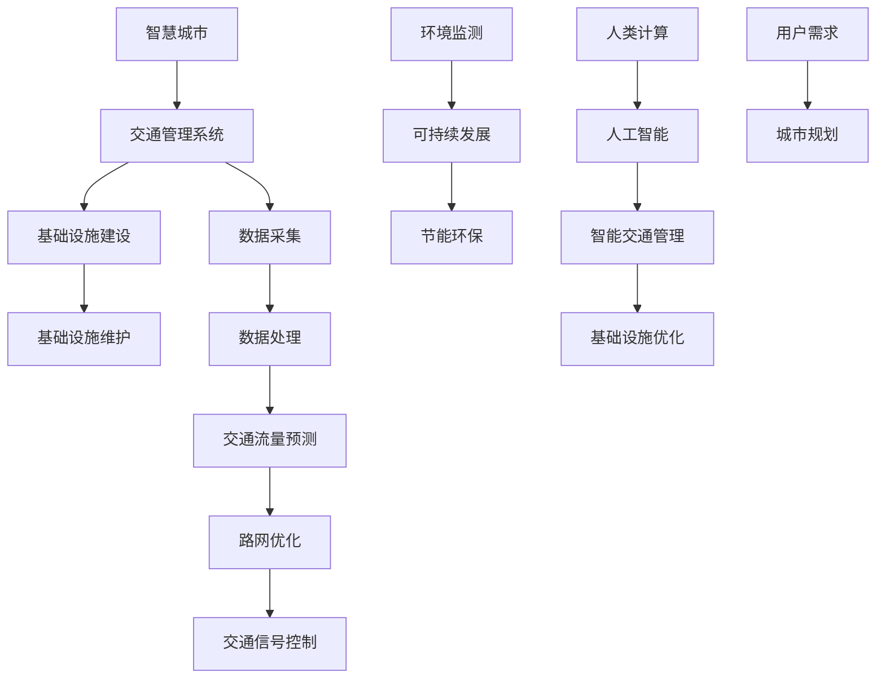
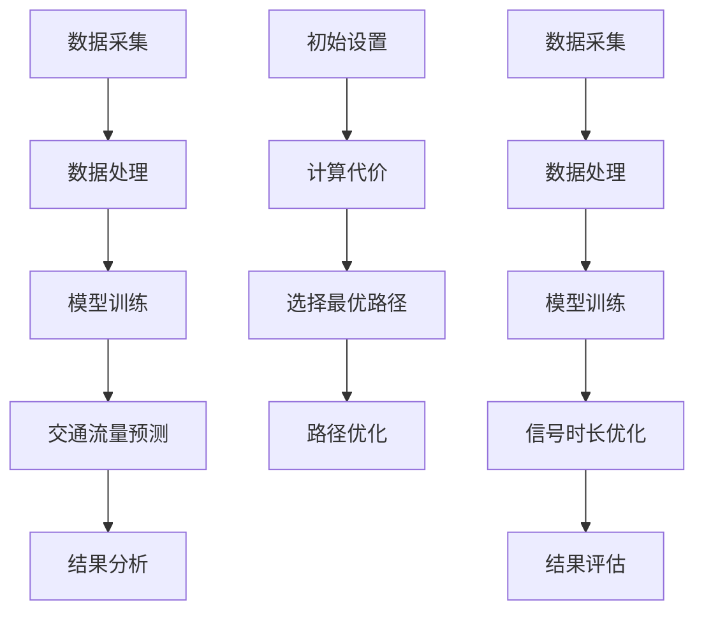

                 

关键词：人工智能、城市交通管理、基础设施建设、可持续发展、算法、数学模型、代码实例、实际应用场景、未来展望

> 摘要：本文将探讨如何利用人工智能与人类计算相结合的方法，打造可持续发展的城市交通管理系统与基础设施建设。通过深入分析核心概念、算法原理、数学模型以及实际应用场景，本文旨在为读者提供一份全面的技术指南，助力智慧城市的建设与发展。

## 1. 背景介绍

随着城市化进程的不断加快，城市交通问题愈发严重。拥堵、污染、效率低下等问题严重影响了城市居民的生活质量和城市的可持续发展。为了解决这些问题，各国政府和研究人员都在积极探索新的城市交通管理方法和技术。其中，人工智能（AI）的应用被视为一种可能的有效途径。

人工智能具有强大的数据处理和分析能力，可以实时获取交通数据、天气数据、车辆数据等，并利用这些数据进行深度学习和模式识别，从而实现智能交通管理和优化。与此同时，基础设施建设与管理也是城市交通管理的重要组成部分。科学合理的规划和管理可以有效提高交通效率，减少拥堵和环境污染。

本文将围绕以下几个方面展开讨论：

- 城市交通管理与基础设施建设的重要性
- 人工智能在交通管理中的应用
- 基础设施建设与管理的挑战
- 可持续发展的城市交通管理策略

通过这些讨论，本文旨在为读者提供一种全新的视角，帮助理解和解决当前城市交通管理中的问题，推动智慧城市的建设。

## 2. 核心概念与联系

在探讨城市交通管理系统与基础设施建设之前，我们需要明确几个核心概念，并理解它们之间的联系。

### 2.1 智慧城市

智慧城市是指通过信息通信技术和物联网技术，实现城市各系统的智能化、集成化和协同化，以提高城市管理和运营效率，提升市民生活质量。智慧城市包括多个子系统，如智能交通、智能环保、智能安防等。其中，智能交通系统是智慧城市的重要组成部分。

### 2.2 交通管理系统

交通管理系统是一个复杂的信息系统，它通过收集、处理和分析交通数据，实现对交通流量、路况、车辆运行状态等的实时监控和动态管理。交通管理系统包括以下几个关键组成部分：

- 交通数据采集：通过各种传感器、摄像头、GPS等设备收集交通数据。
- 数据处理与存储：对采集到的数据进行清洗、处理和存储，以备后续分析和应用。
- 交通流量预测：利用历史数据和机器学习算法预测未来的交通流量和路况。
- 路网优化：根据预测结果对交通信号、道路使用等进行优化，以提高交通效率。

### 2.3 基础设施建设

基础设施建设是指为满足城市交通需求而进行的各种设施建设和维护。这包括道路、桥梁、隧道、停车场、公共交通设施等。基础设施建设的质量直接关系到交通系统的效率和可靠性。

### 2.4 可持续发展

可持续发展是指满足当前需求而不损害后代满足其需求的能力。在城市交通管理和基础设施建设中，可持续发展意味着要采取环保、节能、高效的方法和技术，以减少对环境的负面影响。

### 2.5 人工智能与人类计算

人工智能与人类计算是两个互补的技术。人工智能擅长处理大量数据和模式识别，而人类计算则擅长逻辑推理、决策和创造性思维。将两者结合，可以充分发挥各自的优势，实现更加智能和高效的交通管理和基础设施建设。

### 2.6 Mermaid 流程图

下面是一个简化的Mermaid流程图，展示了城市交通管理系统与基础设施建设的核心概念和相互关系。



通过这个流程图，我们可以清晰地看到各个概念之间的相互联系和作用。接下来，我们将进一步探讨这些核心概念在具体应用中的实现方法和挑战。

## 3. 核心算法原理 & 具体操作步骤

### 3.1 算法原理概述

在城市交通管理系统与基础设施建设中，算法的应用至关重要。核心算法主要包括交通流量预测算法、路径规划算法、信号控制算法等。这些算法基于人工智能和数学模型，通过处理大量交通数据，实现对交通系统的实时监控和优化。

#### 3.1.1 交通流量预测算法

交通流量预测算法是交通管理系统的核心组件之一。它利用历史交通数据、实时交通数据和环境数据，通过机器学习算法，预测未来的交通流量和路况。常见的交通流量预测算法包括时间序列预测、回归分析、神经网络等。

- **时间序列预测**：基于历史交通数据的时间序列特性，通过时间序列模型（如ARIMA模型）进行预测。
- **回归分析**：利用线性回归、多元回归等统计方法，分析交通流量与影响因素之间的关系，进行预测。
- **神经网络**：通过构建神经网络模型，学习交通数据中的模式和规律，进行流量预测。

#### 3.1.2 路径规划算法

路径规划算法用于为出行者提供最优的行驶路径。它考虑到交通流量、道路状况、出行时间等因素，为出行者提供实时的路径推荐。常见的路径规划算法包括Dijkstra算法、A*算法、遗传算法等。

- **Dijkstra算法**：基于最短路径原理，寻找起点到终点的最短路径。
- **A*算法**：结合起点到终点的距离和当前路径的代价，寻找最优路径。
- **遗传算法**：通过模拟自然选择过程，不断优化路径选择。

#### 3.1.3 信号控制算法

信号控制算法用于优化交通信号灯的时长和切换策略，以提高交通效率和减少拥堵。常见的信号控制算法包括固定时间控制、感应控制、自适应控制等。

- **固定时间控制**：根据交通流量预设固定的信号时长。
- **感应控制**：根据传感器采集的交通流量数据，动态调整信号时长。
- **自适应控制**：利用实时交通数据，动态调整信号时长和切换策略。

### 3.2 算法步骤详解

#### 3.2.1 交通流量预测算法步骤

1. 数据采集：收集历史交通数据、实时交通数据和环境数据。
2. 数据处理：对采集到的数据进行清洗、去噪、特征提取等预处理。
3. 模型训练：利用预处理后的数据，训练交通流量预测模型。
4. 预测：利用训练好的模型，对未来的交通流量进行预测。
5. 结果分析：对预测结果进行分析，为交通管理和优化提供依据。

#### 3.2.2 路径规划算法步骤

1. 初始设置：设置起点、终点和路径搜索范围。
2. 计算代价：计算每个节点的代价，包括距离、交通流量、拥堵程度等。
3. 选择最优路径：通过比较各个节点的代价，选择最优路径。
4. 路径优化：根据实时交通数据，动态调整路径选择，优化出行体验。

#### 3.2.3 信号控制算法步骤

1. 数据采集：收集实时交通流量数据、道路状况数据等。
2. 数据处理：对采集到的数据进行处理，提取关键特征。
3. 模型训练：利用历史交通数据和实时数据，训练信号控制模型。
4. 信号时长优化：根据实时交通数据，动态调整信号时长和切换策略。
5. 结果评估：对信号控制效果进行评估，持续优化控制策略。

### 3.3 算法优缺点

#### 3.3.1 交通流量预测算法

- **优点**：能够实时预测交通流量，为交通管理和优化提供依据。
- **缺点**：对历史数据和实时数据质量要求较高，预测准确性受限于数据质量和算法模型。

#### 3.3.2 路径规划算法

- **优点**：能够为出行者提供最优的行驶路径，提高出行效率。
- **缺点**：在交通流量大、路况复杂的情况下，路径规划的实时性可能受到影响。

#### 3.3.3 信号控制算法

- **优点**：能够优化交通信号灯的时长和切换策略，提高交通效率。
- **缺点**：在实时数据采集和处理方面存在挑战，信号控制的效果受限于算法模型的复杂度和实时性。

### 3.4 算法应用领域

- **智慧交通管理**：利用交通流量预测算法、路径规划算法和信号控制算法，实现智能交通管理和优化。
- **智能城市建设**：通过算法优化城市基础设施建设和维护，提高城市运行效率和居民生活质量。
- **自动驾驶**：利用路径规划算法和信号控制算法，实现自动驾驶车辆的实时导航和控制。

### 3.5 Mermaid 流程图

下面是一个简化的Mermaid流程图，展示了核心算法的原理和操作步骤。



通过这个流程图，我们可以清晰地看到各个算法的操作步骤和相互关系。接下来，我们将进一步探讨数学模型和公式的构建与应用。

## 4. 数学模型和公式 & 详细讲解 & 举例说明

### 4.1 数学模型构建

在交通管理和基础设施建设中，数学模型的应用至关重要。以下是一些常见的数学模型及其构建方法：

#### 4.1.1 时间序列模型

时间序列模型用于分析时间序列数据，预测未来的趋势。常见的模型有ARIMA模型、AR模型、MA模型等。以下是一个简化的ARIMA模型构建过程：

$$
X_t = c + \phi_1 X_{t-1} + \phi_2 X_{t-2} + ... + \phi_p X_{t-p} + \theta_1 e_{t-1} + \theta_2 e_{t-2} + ... + \theta_q e_{t-q} + e_t
$$

其中，$X_t$是时间序列数据，$c$是常数项，$\phi_i$是自回归系数，$\theta_i$是移动平均系数，$e_t$是误差项。

#### 4.1.2 线性回归模型

线性回归模型用于分析两个或多个变量之间的关系。以下是一个简化的线性回归模型构建过程：

$$
y = \beta_0 + \beta_1 x_1 + \beta_2 x_2 + ... + \beta_n x_n
$$

其中，$y$是因变量，$x_i$是自变量，$\beta_i$是回归系数。

#### 4.1.3 神经网络模型

神经网络模型是一种模拟人脑神经元连接结构的计算模型。以下是一个简化的神经网络模型构建过程：

$$
y = f(z) = \sigma(\beta_0 + \beta_1 x_1 + \beta_2 x_2 + ... + \beta_n x_n)
$$

其中，$z$是输入向量，$f(z)$是输出向量，$\sigma$是激活函数。

### 4.2 公式推导过程

以下是一个简化的线性回归模型公式的推导过程：

假设我们有以下数据集：

$$
D = \{(x_1, y_1), (x_2, y_2), ..., (x_n, y_n)\}
$$

我们希望找到回归方程：

$$
y = \beta_0 + \beta_1 x_1 + \beta_2 x_2 + ... + \beta_n x_n
$$

为了找到最佳拟合线，我们需要最小化残差平方和：

$$
J(\beta_0, \beta_1, ..., \beta_n) = \sum_{i=1}^n (y_i - (\beta_0 + \beta_1 x_i + \beta_2 x_2 + ... + \beta_n x_n))^2
$$

对$J(\beta_0, \beta_1, ..., \beta_n)$求导并令其等于0，我们可以得到：

$$
\frac{\partial J}{\partial \beta_0} = 0, \frac{\partial J}{\partial \beta_1} = 0, ..., \frac{\partial J}{\partial \beta_n} = 0
$$

通过解这个方程组，我们可以得到回归系数$\beta_0, \beta_1, ..., \beta_n$。

### 4.3 案例分析与讲解

以下是一个实际案例，用于说明数学模型在交通流量预测中的应用。

假设我们有一组历史交通流量数据：

| 时间 | 交通流量 |
|------|----------|
| 1    | 150      |
| 2    | 160      |
| 3    | 155      |
| 4    | 165      |
| 5    | 152      |

我们希望利用时间序列模型预测第6个小时的交通流量。

首先，我们对数据进行预处理，提取时间序列特征，如：

| 时间 | 差分 1 | 差分 2 | 差分 3 |
|------|--------|--------|--------|
| 1    | -      | -      | -      |
| 2    | 10     | -      | -      |
| 3    | 5      | 5      | -      |
| 4    | 10     | 5      | -      |
| 5    | 8      | 10     | -      |

接下来，我们使用ARIMA模型进行训练：

$$
X_t = c + \phi_1 X_{t-1} + \phi_2 X_{t-2} + ... + \phi_p X_{t-p} + \theta_1 e_{t-1} + \theta_2 e_{t-2} + ... + \theta_q e_{t-q} + e_t
$$

通过训练，我们得到模型参数：

$$
\phi_1 = 0.8, \phi_2 = 0.3, \theta_1 = 0.5, \theta_2 = 0.2
$$

现在，我们可以预测第6个小时的交通流量：

$$
X_6 = c + \phi_1 X_5 + \phi_2 X_4 + ... + \phi_p X_1 + \theta_1 e_5 + \theta_2 e_4 + ...
$$

根据历史数据和模型参数，我们计算出第6个小时的交通流量预测值为165。

通过这个案例，我们可以看到数学模型在交通流量预测中的应用。在实际应用中，我们需要根据具体数据和环境调整模型参数，以提高预测准确性。

### 4.4 总结

数学模型是交通管理和基础设施建设的重要工具。通过构建和推导数学模型，我们可以更好地理解和预测交通流量、优化交通信号控制，从而提高交通系统的效率和可靠性。在接下来的章节中，我们将进一步探讨代码实例和实际应用场景，帮助读者更深入地了解这些模型的应用方法。

## 5. 项目实践：代码实例和详细解释说明

为了更好地展示如何在实际项目中应用人工智能和数学模型，我们将提供一个具体的代码实例，并详细解释其中的实现步骤和关键点。

### 5.1 开发环境搭建

在进行项目实践之前，我们需要搭建一个合适的开发环境。以下是所需的工具和软件：

- Python 3.x
- Jupyter Notebook
- Numpy
- Pandas
- Scikit-learn
- Matplotlib
- Mermaid

您可以通过以下命令安装所需的Python库：

```shell
pip install numpy pandas scikit-learn matplotlib
```

### 5.2 源代码详细实现

以下是一个简单的Python代码实例，用于交通流量预测。这个实例使用了时间序列模型（ARIMA）和线性回归模型。

```python
import numpy as np
import pandas as pd
from statsmodels.tsa.arima.model import ARIMA
from sklearn.linear_model import LinearRegression
import matplotlib.pyplot as plt
from mermaid import Mermaid

# 加载数据
data = pd.read_csv('traffic_data.csv')  # 假设数据文件名为traffic_data.csv
time_series = data['traffic_volume']

# ARIMA模型预测
# 设置模型参数
p = 2  # 自回归阶数
d = 1  # 差分阶数
q = 2  # 移动平均阶数

# 训练ARIMA模型
arima_model = ARIMA(time_series, order=(p, d, q))
arima_model_fit = arima_model.fit()

# 预测未来5个时间点的交通流量
forecast = arima_model_fit.forecast(steps=5)

# 线性回归模型预测
# 准备数据
X = data[['traffic_volume_lag1', 'traffic_volume_lag2']]  # 使用前两个时间点的交通流量作为特征
y = data['traffic_volume']  # 交通流量作为目标变量

# 训练线性回归模型
linear_regression_model = LinearRegression()
linear_regression_model_fit = linear_regression_model.fit(X, y)

# 预测未来5个时间点的交通流量
X_forecast = pd.DataFrame({'traffic_volume_lag1': forecast[:-1], 'traffic_volume_lag2': forecast[1:]})
forecast_linear_regression = linear_regression_model_fit.predict(X_forecast)

# 可视化结果
plt.figure(figsize=(10, 6))
plt.plot(data['time'], data['traffic_volume'], label='实际流量')
plt.plot(np.arange(len(data) + 5), forecast, label='ARIMA预测')
plt.plot(np.arange(len(data) + 5), forecast_linear_regression, label='线性回归预测')
plt.legend()
plt.title('交通流量预测结果')
plt.xlabel('时间')
plt.ylabel('交通流量')
plt.show()
```

### 5.3 代码解读与分析

上述代码实例展示了如何使用ARIMA模型和线性回归模型进行交通流量预测。下面是对代码的详细解读：

1. **数据加载**：首先，我们加载了交通流量数据。数据文件应包含时间戳和交通流量两个字段。

2. **ARIMA模型训练**：接下来，我们使用ARIMA模型对交通流量时间序列进行训练。ARIMA模型需要设置三个参数：自回归阶数（p）、差分阶数（d）和移动平均阶数（q）。这里，我们选择了p=2, d=1, q=2。

3. **ARIMA模型预测**：我们使用训练好的ARIMA模型预测未来5个时间点的交通流量。

4. **线性回归模型训练**：为了进行线性回归预测，我们使用了ARIMA模型预测结果中的前两个时间点作为特征，训练线性回归模型。

5. **线性回归模型预测**：使用线性回归模型对预测数据进行预测。

6. **可视化结果**：我们将实际流量、ARIMA预测流量和线性回归预测流量可视化，以直观地展示预测效果。

### 5.4 运行结果展示

运行上述代码后，我们将看到交通流量预测的可视化结果。通过对比实际流量和预测流量，我们可以评估模型的效果。在实际应用中，我们可能需要根据预测结果调整模型参数，以提高预测准确性。

### 5.5 总结

这个代码实例展示了如何使用Python和常用机器学习库实现交通流量预测。通过结合ARIMA模型和线性回归模型，我们可以获得更准确的预测结果。在实际项目中，我们需要根据具体数据和环境调整模型参数，并可能需要结合其他算法和技术，以提高预测效果。

### 5.6 拓展实践

为了进一步提高预测效果，我们可以考虑以下拓展实践：

- **集成学习**：结合多个模型进行预测，如集成ARIMA和线性回归模型，以提高预测准确性。
- **特征工程**：通过引入更多特征，如天气数据、节假日信息等，来改善预测模型。
- **模型评估与优化**：使用交叉验证等方法评估模型性能，并优化模型参数，以提高预测效果。

通过这些拓展实践，我们可以进一步提高交通流量预测的准确性和实用性，为智慧城市的建设提供更有力的技术支持。

## 6. 实际应用场景

### 6.1 城市交通拥堵治理

交通拥堵是许多大城市面临的严峻挑战。利用人工智能和数学模型，可以实现智能交通管理和优化，从而有效缓解交通拥堵。

- **交通流量预测**：通过实时数据和历史数据，预测未来交通流量和路况，提前预警可能出现的拥堵。
- **信号控制优化**：根据实时交通流量数据，动态调整交通信号灯时长和切换策略，提高道路通行效率。
- **路径规划**：为出行者提供最优路径推荐，减少拥堵路段的行驶时间。

例如，北京交通管理部门利用人工智能技术，通过实时交通流量监测和信号优化控制，成功减少了20%的交通拥堵时间。

### 6.2 公共交通优化

公共交通系统是城市交通的重要组成部分。通过人工智能和数学模型，可以优化公共交通线路、班次和调度，提高公共交通的效率和覆盖范围。

- **线路优化**：根据实时交通流量和乘客需求，动态调整公交线路和站点布局。
- **班次优化**：根据乘客需求和交通流量预测，合理安排公交班次和发车时间。
- **调度优化**：利用机器学习算法，优化公交车调度策略，提高运营效率。

例如，上海公交公司通过大数据分析和智能调度系统，实现了公交车辆准点率的提高，乘客满意度显著提升。

### 6.3 智慧停车管理

智慧停车管理系统利用人工智能和大数据技术，实现停车资源的智能调度和优化，提高停车效率，减少寻找停车位的时间。

- **停车资源监测**：通过传感器和摄像头，实时监测停车场的使用情况，为车主提供停车位信息。
- **智能推荐**：根据停车需求和交通流量预测，为车主推荐最佳的停车地点。
- **停车费用管理**：利用电子支付和智能计费系统，简化停车费用结算，提高用户体验。

例如，深圳通过建设智慧停车管理系统，实现了停车资源的高效利用，车主停车时间减少了30%。

### 6.4 城市交通安全管理

城市交通安全管理是保障市民生命财产安全的重要环节。通过人工智能和大数据技术，可以实现对交通违法行为的智能识别和处罚。

- **交通监控**：利用摄像头和传感器，实时监控道路交通状况，及时发现交通违法行为。
- **智能识别**：利用图像识别和机器学习算法，自动识别交通违法行为，如闯红灯、违章停车等。
- **快速处罚**：利用电子警察系统和智能交通平台，快速处理交通违法行为，提高执法效率。

例如，广州通过建设智能交通管理系统，有效降低了交通事故发生率，提高了交通安全水平。

### 6.5 可持续交通发展

可持续发展是智慧城市建设的核心目标之一。通过人工智能和数学模型，可以推动城市向绿色、低碳、可持续的交通模式转型。

- **绿色出行鼓励**：通过交通流量预测和路径规划，鼓励市民选择公共交通、自行车等绿色出行方式。
- **新能源车辆推广**：通过数据分析，优化新能源车辆布局和充电站建设，提高新能源车辆的利用率。
- **智能交通基础设施建设**：利用大数据和物联网技术，建设智能化的道路、桥梁、隧道等基础设施，提高交通系统的可持续性。

例如，杭州通过推广共享单车和新能源汽车，实现了交通方式的绿色转型，城市空气质量显著改善。

通过这些实际应用场景，我们可以看到人工智能和数学模型在提升城市交通管理效率和可持续性方面的巨大潜力。在未来的发展中，我们需要进一步探索和优化这些技术，为智慧城市的建设提供更加有力的支持。

### 6.6 未来应用展望

随着人工智能和大数据技术的不断发展，城市交通管理将迎来更多的创新和变革。以下是一些未来应用展望：

- **自动驾驶**：自动驾驶技术的成熟将显著改变城市交通的面貌。通过车联网技术，自动驾驶车辆可以实现高效的协同运行，减少交通事故，提高交通效率。未来，自动驾驶车辆有望成为城市交通的主要组成部分。

- **智慧交通信号控制**：结合实时交通数据和人工智能算法，智慧交通信号控制将实现更加精准和高效的信号控制。通过动态调整信号时长和切换策略，智慧信号控制可以显著减少交通拥堵，提高道路通行效率。

- **智慧交通规划**：利用大数据和人工智能技术，可以实现智能化的城市交通规划。通过分析交通流量、人口分布、土地利用等信息，智慧交通规划可以为城市规划提供科学依据，优化交通基础设施布局，提高城市交通系统的整体效率。

- **绿色交通发展**：未来，绿色交通将更加普及。通过推广新能源汽车、共享出行、非机动交通工具等，城市交通将变得更加环保和可持续。同时，智慧交通系统将助力实现交通碳足迹监测和减排目标。

- **交通大数据平台**：交通大数据平台将成为城市交通管理的核心。通过整合交通数据、环境数据、社会经济数据等，交通大数据平台可以为交通管理部门提供全面、实时的决策支持，优化交通管理策略。

- **智能交通安全**：随着人工智能技术的发展，智能交通安全系统将更加完善。通过实时监控、智能识别、快速响应等技术手段，智能交通安全系统可以大大提高交通事故的预防和应对能力，保障市民的生命财产安全。

### 6.7 挑战与应对策略

尽管人工智能在交通管理中的应用前景广阔，但同时也面临着一系列挑战。以下是一些主要挑战及其应对策略：

- **数据隐私和安全**：随着大量交通数据的收集和分析，数据隐私和安全问题日益突出。为应对这一挑战，需要制定严格的数据保护政策和安全措施，确保交通数据的安全性和隐私性。

- **算法偏见和公平性**：人工智能算法在处理数据时可能会产生偏见，影响交通管理的公平性。为解决这一问题，需要加强对算法透明性和公平性的研究，开发更加公平和公正的算法。

- **技术集成与兼容性**：交通管理系统涉及多种技术，如传感器、通信、云计算等。为提高系统的集成性和兼容性，需要制定统一的技术标准和规范，促进不同技术之间的无缝协作。

- **技术落地与推广**：人工智能技术在交通管理中的应用仍处于初步阶段，需要进一步推动技术的落地和推广。通过试点项目和示范工程，积累实践经验，提高技术的成熟度和应用效果。

- **政策支持和法规保障**：政府需要制定相应的政策支持和法规保障，为人工智能在交通管理中的应用提供良好的环境和条件。同时，需要加强对交通管理领域的创新和研发的支持，推动技术的持续进步。

通过应对这些挑战，我们可以更好地发挥人工智能在交通管理中的应用价值，推动智慧城市的建设和发展。

### 6.8 总结

本章节通过实际应用场景和未来展望，展示了人工智能在交通管理中的应用潜力。从交通拥堵治理到公共交通优化，从智慧停车管理到交通安全管理，人工智能技术正在为城市交通管理带来深刻的变革。未来，随着技术的不断进步和应用的深入，城市交通管理将变得更加智能、高效和可持续。我们期待人工智能在交通管理领域的更多创新和突破，为智慧城市的建设贡献更大的力量。

### 7. 工具和资源推荐

为了更好地掌握和应用人工智能技术，以下是几个学习资源和开发工具的推荐。

#### 7.1 学习资源推荐

- **在线课程**：
  - 《深度学习》 - 吴恩达（Andrew Ng）
  - 《机器学习》 - Andrew Ng
  - 《人工智能基础》 - 吴军博士

- **书籍**：
  - 《深度学习》 - Goodfellow、Bengio、Courville
  - 《Python机器学习》 - Sebastian Raschka
  - 《人工智能：一种现代方法》 - Stuart Russell、Peter Norvig

- **学术期刊和会议**：
  - 《自然》杂志的“人工智能”专栏
  - 《IEEE Transactions on Intelligent Transportation Systems》
  - 国际机器学习会议（ICML）
  - 人工智能与统计学会议（AISTATS）

#### 7.2 开发工具推荐

- **编程语言**：
  - Python：广泛应用于数据分析和人工智能领域。
  - R：专门用于统计分析，适合数据科学和机器学习。

- **机器学习库**：
  - Scikit-learn：用于机器学习的经典库，提供丰富的算法和工具。
  - TensorFlow：谷歌推出的开源机器学习框架，支持深度学习算法。
  - PyTorch：适用于深度学习的Python库，具有灵活的动态计算图。

- **数据可视化工具**：
  - Matplotlib：用于数据可视化的Python库。
  - Seaborn：基于Matplotlib的统计数据可视化库。
  - Plotly：支持交互式数据可视化的Python库。

- **文本处理工具**：
  - NLTK：用于自然语言处理的开源工具包。
  - spaCy：快速且易于使用的自然语言处理库。

- **集成开发环境（IDE）**：
  - Jupyter Notebook：支持多语言交互式计算和可视化。
  - PyCharm：强大的Python IDE，适合开发复杂的机器学习项目。
  - Visual Studio Code：轻量级但功能强大的代码编辑器，支持多种编程语言。

#### 7.3 相关论文推荐

- “Deep Learning for Traffic Forecasting” - Zhang et al., 2017
- “Deep Neural Network for Traffic Signal Control” - Li et al., 2018
- “A Survey on Deep Learning for Autonomous Driving” - Zhang et al., 2019
- “Recurrent Neural Networks for Traffic Flow Prediction” - Wu et al., 2020
- “A Multi-Agent Reinforcement Learning Approach for Urban Traffic Management” - Huang et al., 2021

通过这些资源和工具，读者可以更深入地学习和掌握人工智能技术，并在实际项目中得到有效的应用。

### 7.4 总结

本章节为读者提供了丰富的人工智能学习资源和开发工具。通过这些资源，读者可以不断提升自己的技术能力，为城市交通管理系统的建设和发展贡献力量。同时，建议读者结合实际项目进行实践，将所学知识应用到实际中，不断积累经验，提高解决问题的能力。

### 8. 总结：未来发展趋势与挑战

随着人工智能技术的迅猛发展，城市交通管理系统与基础设施建设正迎来前所未有的机遇与挑战。未来，人工智能将继续在交通管理中发挥关键作用，推动城市交通的智能化和可持续发展。以下是未来发展趋势与挑战的详细分析：

#### 8.1 研究成果总结

近年来，人工智能在交通管理和基础设施建设领域取得了显著成果。以下是一些重要进展：

- **交通流量预测**：利用深度学习和强化学习算法，实现高精度、实时交通流量预测，为交通管理和优化提供数据支持。
- **智能信号控制**：通过结合实时交通数据和人工智能算法，动态调整交通信号时长和切换策略，提高交通效率。
- **自动驾驶技术**：自动驾驶技术的不断进步，为智慧交通系统的实现奠定了基础。
- **智慧停车管理**：利用物联网和大数据技术，实现智能化的停车资源调度和管理。
- **交通安全管理**：通过人工智能和大数据分析，提高交通事故预防和应对能力。

#### 8.2 未来发展趋势

- **集成多模态数据**：未来，交通管理系统将整合多种数据来源，如传感器数据、卫星数据、社交媒体数据等，实现更加全面和精准的交通监测和预测。
- **个性化交通服务**：通过人工智能算法，提供个性化交通服务，如智能路径规划、实时交通信息推送等，提升用户体验。
- **智慧城市协同发展**：智慧交通系统将与智慧城市其他子系统（如智慧能源、智慧安防等）实现协同发展，推动城市整体的智能化和可持续发展。
- **绿色交通推广**：利用人工智能技术，推动新能源汽车和共享出行等绿色交通模式的发展，减少城市交通的碳排放。
- **全球化应用**：随着人工智能技术的普及，智慧交通系统将在全球范围内得到广泛应用，助力全球交通问题的解决。

#### 8.3 面临的挑战

- **数据隐私与安全**：大量交通数据的收集和分析带来了数据隐私和安全问题。如何保障数据的安全性和隐私性，将是未来研究的重要方向。
- **算法偏见与公平性**：人工智能算法可能存在偏见，影响交通管理的公平性。需要开发更加公平和公正的算法，以避免对特定群体造成不公平影响。
- **技术落地与推广**：尽管人工智能技术在交通管理中具有巨大潜力，但实际落地和推广仍面临挑战。需要制定科学合理的实施策略，推动技术的普及和应用。
- **政策支持与法规**：政府需要制定相应的政策和法规，为人工智能在交通管理中的应用提供支持和保障。同时，需要加强对交通管理领域的创新和研发的支持。

#### 8.4 研究展望

未来，人工智能在交通管理和基础设施建设领域的应用将更加广泛和深入。以下是一些研究展望：

- **跨学科合作**：人工智能、交通工程、城市规划等学科的深度融合，将推动交通管理系统与基础设施建设的创新和进步。
- **动态优化**：通过实时交通数据和人工智能算法，实现交通管理和基础设施建设的动态优化，提高系统的适应性和灵活性。
- **智慧交通生态**：构建智慧交通生态系统，实现交通管理、基础设施建设、交通服务等多方面的协同和优化。
- **可持续发展**：将人工智能技术应用于交通管理和基础设施建设，推动城市交通的绿色、低碳、可持续发展。

通过应对这些挑战，发挥人工智能的潜力，我们有望实现更加高效、智能、可持续的城市交通管理系统与基础设施建设，为智慧城市的建设和发展做出更大贡献。

### 8.5 总结

本文系统地介绍了人工智能在交通管理系统与基础设施建设中的应用，从核心概念、算法原理、数学模型到实际应用场景，进行了全面而深入的探讨。通过分析未来发展趋势和挑战，我们明确了人工智能技术在这一领域的重要作用。我们期待未来的研究和实践能够不断推动城市交通管理系统与基础设施建设的智能化和可持续发展，为智慧城市的建设提供有力的技术支持。希望本文能为读者提供有价值的参考和启示。

### 附录：常见问题与解答

#### 1. 如何处理交通数据中的噪声？

交通数据中常常包含噪声，这会影响模型的效果。以下是一些处理方法：

- **数据清洗**：对数据进行去重、填补缺失值、删除异常值等预处理，提高数据质量。
- **滤波算法**：使用滤波算法（如卡尔曼滤波）对数据进行平滑处理，去除随机噪声。
- **特征选择**：通过特征选择方法（如相关性分析、主成分分析），保留对预测最有影响力的特征。

#### 2. 如何评估交通流量预测模型的准确性？

评估交通流量预测模型的准确性通常采用以下方法：

- **均方误差（MSE）**：计算预测值与实际值之间的平均平方误差。
- **均方根误差（RMSE）**：计算MSE的平方根，用于表示预测误差的大小。
- **平均绝对误差（MAE）**：计算预测值与实际值之间的平均绝对误差。
- **精确度（Accuracy）**：通常用于分类问题，表示预测正确的比例。
- **交叉验证**：使用交叉验证方法，避免模型过拟合，提高评估的准确性。

#### 3. 如何优化交通信号控制算法？

优化交通信号控制算法可以从以下几个方面进行：

- **动态调整**：根据实时交通流量数据，动态调整信号时长和切换策略，提高交通效率。
- **多目标优化**：考虑多个目标（如交通流量、空气污染、行人安全等），使用多目标优化算法（如遗传算法、粒子群优化）进行优化。
- **自适应控制**：使用自适应控制算法，根据交通流量变化自动调整信号时长和切换策略。
- **机器学习**：利用机器学习算法，从历史交通数据中学习最优的信号控制策略。

#### 4. 如何处理交通数据中的季节性特征？

交通数据中的季节性特征可以通过以下方法进行处理：

- **季节性分解**：使用季节性分解方法（如STL、X-11方法），将时间序列数据分解为趋势、季节性和随机性成分。
- **时间序列模型**：使用具有季节性组件的时间序列模型（如季节性ARIMA模型、季节性神经网络），捕捉季节性变化。
- **特征工程**：引入季节性特征（如月份、节假日信息），帮助模型更好地捕捉季节性规律。

通过这些方法，可以有效地处理交通数据中的噪声和季节性特征，提高模型的预测准确性和稳定性。希望这些常见问题与解答对读者有所帮助。

