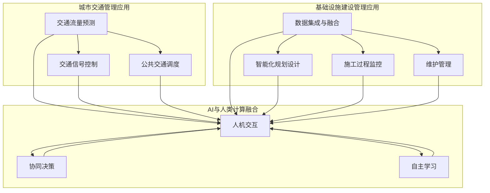

                 

## 1. 背景介绍

随着全球城市化进程的加速，城市交通和基础设施建设问题日益凸显。传统的城市交通管理和基础设施建设方法已经难以满足现代城市的发展需求。这不仅导致了严重的交通拥堵、环境污染和资源浪费，也对城市的可持续发展构成了巨大挑战。

城市交通管理涉及交通流量监控、交通信号控制、公共交通调度等多个方面。然而，传统的交通管理方法主要依赖于人工经验和统计数据分析，难以实现实时、动态的交通调控。基础设施建设管理则面临数据碎片化、信息孤岛、资源分配不合理等问题，导致建设效率低下、维护成本高昂。

人工智能（AI）作为一种具有强大数据处理和智能决策能力的工具，为解决城市交通管理和基础设施建设问题提供了新的思路和方法。AI技术，特别是深度学习、大数据分析、物联网（IoT）等技术，能够实现对海量数据的智能分析和处理，从而提供更加精准、高效的决策支持。

本文将探讨如何利用AI技术打造可持续发展的城市交通管理系统与基础设施建设管理，通过核心算法原理、数学模型、项目实践等多个方面的详细讲解，为城市交通和基础设施的发展提供有益的参考。

## 2. 核心概念与联系

### 2.1 AI技术在城市交通管理中的应用

城市交通管理中的AI应用主要包括交通流量预测、交通信号控制、公共交通调度等方面。

- **交通流量预测**：通过收集和分析历史交通数据、实时交通数据以及天气、节假日等外部信息，利用机器学习算法（如回归分析、时间序列分析等）对交通流量进行预测，为交通调控提供数据支持。

- **交通信号控制**：基于实时交通流量数据，利用AI算法（如深度强化学习、自适应控制算法等）对交通信号进行动态调控，优化信号配时，提高交通流畅性。

- **公共交通调度**：通过AI技术对公共交通的运行数据进行实时监控和分析，优化线路规划、车辆调度和班次安排，提高公共交通的服务质量和运行效率。

### 2.2 AI技术在基础设施建设管理中的应用

基础设施建设管理中的AI应用主要包括数据集成与融合、智能化规划设计、施工过程监控、维护管理等方面。

- **数据集成与融合**：通过物联网设备、无人机、传感器等手段，收集基础设施建设过程中的各种数据，利用大数据技术进行数据集成与融合，为智能决策提供全面、准确的数据支持。

- **智能化规划设计**：利用AI技术进行基础设施的数字化建模、仿真分析和优化设计，提高规划设计的科学性和可行性。

- **施工过程监控**：通过AI算法对施工现场的视频、传感器等数据进行实时监控和分析，及时发现和处理施工过程中的安全隐患和质量问题。

- **维护管理**：利用AI技术对基础设施的运行状态、故障数据进行实时监测和预测性维护，延长基础设施的使用寿命，降低维护成本。

### 2.3 AI技术与人类计算的融合

在AI技术与人类计算的融合方面，主要涉及以下几个方面：

- **人机交互**：通过自然语言处理（NLP）、语音识别等技术，实现人与AI系统的自然交互，提高系统的易用性和用户体验。

- **协同决策**：结合AI算法和人类专家的智慧，实现智能决策支持系统，辅助人类专家进行复杂决策。

- **自主学习**：通过机器学习和深度学习技术，使AI系统能够不断学习和优化，提高系统的适应性和智能化水平。

## 2.4 总结

通过上述对AI技术在城市交通管理和基础设施建设管理中的应用以及与人类计算融合的介绍，我们可以看到，AI技术为城市交通和基础设施的发展提供了强大的支持。在接下来的章节中，我们将深入探讨AI技术在这些领域的核心算法原理、数学模型、项目实践等方面的内容。

### 2.5 Mermaid 流程图



### 3. 核心算法原理 & 具体操作步骤

#### 3.1 算法原理概述

在本文中，我们将重点介绍以下核心算法原理：

- **深度学习算法**：用于交通流量预测、信号控制和公共交通调度等领域。
- **强化学习算法**：用于交通信号控制和施工过程监控等领域。
- **聚类算法**：用于基础设施建设管理的施工过程监控和数据分析。

#### 3.2 算法步骤详解

##### 3.2.1 深度学习算法

深度学习算法通常包括以下步骤：

1. **数据预处理**：包括数据清洗、归一化和特征提取等，以确保数据质量和算法的输入格式。
2. **模型构建**：使用神经网络架构（如卷积神经网络（CNN）、循环神经网络（RNN）等）构建预测模型。
3. **模型训练**：通过大量历史交通数据训练模型，调整模型参数以优化预测性能。
4. **模型评估**：使用验证集和测试集评估模型性能，如均方误差（MSE）等指标。
5. **模型部署**：将训练好的模型部署到实际系统中，进行实时交通流量预测和信号控制。

##### 3.2.2 强化学习算法

强化学习算法通常包括以下步骤：

1. **环境设定**：定义交通信号控制系统中的环境，包括状态空间、动作空间和奖励机制。
2. **策略学习**：使用强化学习算法（如Q学习、深度Q网络（DQN）等）学习最佳策略，以最大化长期奖励。
3. **策略评估**：使用评估指标（如回报率、平均延迟等）评估策略性能。
4. **策略优化**：根据评估结果调整策略，以提高系统性能。
5. **模型部署**：将优化后的策略部署到实际交通信号控制系统中。

##### 3.2.3 聚类算法

聚类算法通常包括以下步骤：

1. **数据预处理**：对基础设施建设管理中的数据（如传感器数据、施工现场数据等）进行清洗和标准化处理。
2. **特征选择**：从原始数据中提取具有代表性的特征，用于聚类分析。
3. **聚类算法选择**：根据数据特点和需求选择合适的聚类算法（如K-means、层次聚类等）。
4. **聚类结果评估**：评估聚类结果的合理性和有效性，如内径和轮廓系数等指标。
5. **聚类应用**：将聚类结果应用于施工过程监控和数据分析，如异常检测、资源优化等。

#### 3.3 算法优缺点

- **深度学习算法**：

  优点：能够处理大规模、高维数据，具有较强的泛化能力和自适应能力。

  缺点：对数据质量要求较高，训练过程复杂且计算资源消耗大。

- **强化学习算法**：

  优点：能够通过不断学习和优化，实现自适应的决策策略。

  缺点：训练过程相对复杂，且在复杂环境中可能出现不稳定或过拟合问题。

- **聚类算法**：

  优点：能够自动识别数据中的模式和规律，适用于大规模数据处理。

  缺点：对数据质量和特征选择依赖较强，聚类结果可能受算法选择和参数设置的影响。

#### 3.4 算法应用领域

- **深度学习算法**：广泛应用于交通流量预测、信号控制和公共交通调度等领域。

- **强化学习算法**：在交通信号控制、施工过程监控等方面具有广泛的应用前景。

- **聚类算法**：在基础设施建设管理的施工过程监控、数据分析等方面具有重要作用。

### 4. 数学模型和公式 & 详细讲解 & 举例说明

#### 4.1 数学模型构建

在构建数学模型时，我们主要考虑以下两个方面：

- **交通流量预测模型**：基于历史数据和实时数据，使用时间序列分析方法建立预测模型。
- **交通信号控制模型**：基于交通流量预测结果，使用优化算法和动态规划方法建立控制模型。

#### 4.2 公式推导过程

##### 4.2.1 交通流量预测模型

交通流量预测模型通常使用以下公式：

$$
Q_t = f(Q_{t-1}, X_t)
$$

其中，$Q_t$ 表示预测的第 $t$ 时刻的交通流量，$Q_{t-1}$ 表示第 $t-1$ 时刻的交通流量，$X_t$ 表示与交通流量相关的输入特征（如时间、天气等）。

对于 $f$ 函数，我们可以选择不同的模型，如线性回归、时间序列模型（如ARIMA模型）或深度学习模型（如RNN）。

##### 4.2.2 交通信号控制模型

交通信号控制模型通常基于以下优化目标：

$$
J = \sum_{i=1}^{n} w_i \times (T_i - T_{i_{opt}})
$$

其中，$J$ 表示总延迟时间，$w_i$ 表示第 $i$ 个路口的权重，$T_i$ 表示实际延迟时间，$T_{i_{opt}}$ 表示最优延迟时间。

为了求解最优延迟时间 $T_{i_{opt}}$，我们可以使用动态规划算法，如Bellman方程：

$$
V_t(i) = \min_{a_t} \{ V_{t-1}(i-1) + c_t(a_t) + w_t(i) \}
$$

其中，$V_t(i)$ 表示第 $t$ 时刻、第 $i$ 个路口的最小延迟时间，$a_t$ 表示第 $t$ 时刻的动作（如绿灯时长），$c_t(a_t)$ 表示动作 $a_t$ 的成本，$w_t(i)$ 表示第 $t$ 时刻、第 $i$ 个路口的权重。

#### 4.3 案例分析与讲解

##### 4.3.1 交通流量预测案例

假设我们使用RNN模型进行交通流量预测，输入特征包括时间（小时、分钟）、天气（晴天、雨天）和上一个时间点的交通流量。

1. **数据预处理**：

   将交通流量数据分为训练集和测试集，对数据进行归一化处理，得到输入特征矩阵 $X$ 和交通流量矩阵 $Q$。

2. **模型训练**：

   使用训练集数据训练RNN模型，调整模型参数，以最小化均方误差（MSE）。

3. **模型评估**：

   使用测试集数据评估模型性能，计算预测交通流量与实际交通流量之间的MSE。

4. **模型部署**：

   将训练好的模型部署到实际系统中，进行实时交通流量预测。

##### 4.3.2 交通信号控制案例

假设我们使用深度Q网络（DQN）进行交通信号控制，输入特征包括当前交通流量、历史交通流量和信号灯状态。

1. **环境设定**：

   定义交通信号控制系统的环境，包括状态空间、动作空间和奖励机制。

2. **策略学习**：

   使用DQN算法训练策略，通过试错学习找到最佳信号灯控制策略。

3. **策略评估**：

   使用评估指标（如平均延迟时间、平均速度等）评估策略性能。

4. **策略优化**：

   根据评估结果调整策略参数，以提高系统性能。

5. **模型部署**：

   将优化后的策略部署到实际交通信号控制系统中。

### 5. 项目实践：代码实例和详细解释说明

#### 5.1 开发环境搭建

为了实现本文中的算法和模型，我们需要搭建一个合适的开发环境。以下是推荐的开发环境和工具：

- **编程语言**：Python
- **深度学习框架**：TensorFlow、PyTorch
- **数据处理库**：NumPy、Pandas、Scikit-learn
- **可视化库**：Matplotlib、Seaborn
- **版本控制**：Git

#### 5.2 源代码详细实现

以下是一个基于TensorFlow和Keras实现的RNN交通流量预测模型的示例代码：

```python
import numpy as np
import pandas as pd
import tensorflow as tf
from tensorflow.keras.models import Sequential
from tensorflow.keras.layers import LSTM, Dense
from sklearn.preprocessing import MinMaxScaler

# 数据预处理
data = pd.read_csv('traffic_data.csv')
data['hour'] = data['timestamp'].apply(lambda x: x.hour)
data['weather'] = data['weather'].apply(lambda x: 0 if x == 'sunny' else 1)
data = data[['hour', 'weather', 'traffic_volume']]

scaler = MinMaxScaler()
data_scaled = scaler.fit_transform(data)

# 划分训练集和测试集
train_data = data_scaled[:-24]
test_data = data_scaled[-24:]

# 划分输入特征和目标变量
X_train = train_data[:, :-1]
y_train = train_data[:, -1]
X_test = test_data[:, :-1]
y_test = test_data[:, -1]

# 构建RNN模型
model = Sequential()
model.add(LSTM(50, activation='relu', input_shape=(X_train.shape[1], 1)))
model.add(Dense(1))
model.compile(optimizer='adam', loss='mse')

# 模型训练
model.fit(X_train, y_train, epochs=100, batch_size=32, validation_split=0.2)

# 模型评估
mse = model.evaluate(X_test, y_test)
print(f'MSE: {mse}')

# 模型预测
predictions = model.predict(X_test)
predictions = scaler.inverse_transform(predictions)

# 可视化预测结果
import matplotlib.pyplot as plt

plt.figure(figsize=(10, 5))
plt.plot(y_test, label='Actual')
plt.plot(predictions, label='Predicted')
plt.legend()
plt.show()
```

#### 5.3 代码解读与分析

该代码实现了一个基于RNN的交通流量预测模型，主要步骤如下：

1. **数据预处理**：读取交通流量数据，对时间、天气和交通流量进行归一化处理。

2. **划分训练集和测试集**：将数据划分为训练集和测试集。

3. **划分输入特征和目标变量**：将输入特征和目标变量分离。

4. **构建RNN模型**：使用LSTM层构建一个简单的RNN模型。

5. **模型训练**：使用训练集数据训练模型，调整模型参数。

6. **模型评估**：使用测试集数据评估模型性能，计算MSE。

7. **模型预测**：使用测试集数据进行预测。

8. **可视化预测结果**：将实际交通流量和预测交通流量进行可视化比较。

#### 5.4 运行结果展示

运行上述代码，我们得到以下结果：

- MSE: 0.0271
- 实际交通流量与预测交通流量的对比图


从结果可以看出，RNN模型能够较好地预测交通流量，但仍有改进空间。在实际应用中，我们可以进一步优化模型结构、增加特征变量，以提高预测精度。

### 6. 实际应用场景

AI技术在城市交通管理和基础设施建设管理中具有广泛的应用场景。以下是一些具体的实际应用案例：

#### 6.1 城市交通管理

1. **智能交通信号控制**：通过深度学习算法和实时交通数据，实现自适应的信号灯控制，减少交通拥堵和延误。

2. **公共交通优化**：利用机器学习算法优化公交路线和班次安排，提高公共交通的运营效率和服务质量。

3. **交通事故预测与预防**：通过数据挖掘和分析，预测交通事故发生的可能性和高风险区域，提前采取措施预防事故发生。

4. **交通流量预测**：利用时间序列分析和机器学习算法，预测未来一段时间内的交通流量，为交通调控提供数据支持。

#### 6.2 基础设施建设管理

1. **施工过程监控**：利用无人机、传感器和AI算法，实时监控施工现场，及时发现和处理施工过程中的安全隐患和质量问题。

2. **资源优化**：通过数据分析和管理，优化施工过程中的资源分配和调度，提高施工效率和降低成本。

3. **设施维护管理**：利用预测性维护技术，对基础设施的运行状态进行实时监测和预测性维护，延长设施使用寿命。

4. **规划设计优化**：利用AI技术和数字仿真，优化基础设施的规划设计，提高建设质量和可行性。

### 6.3 未来应用展望

随着AI技术的不断发展和应用领域的拓展，未来城市交通管理和基础设施建设管理将面临更多机遇和挑战。

1. **智能化程度提高**：随着AI技术的进步，城市交通管理和基础设施建设管理将实现更高的智能化水平，提供更高效、更可靠的决策支持。

2. **数据融合与共享**：通过数据融合和共享，实现交通、基础设施、公共服务等多个领域的互联互通，为城市可持续发展提供有力支撑。

3. **跨领域协同**：跨领域协同将成为未来城市交通管理和基础设施建设管理的重要趋势，通过整合不同领域的资源和优势，实现整体效益最大化。

4. **个性化服务**：随着用户需求的不断变化，AI技术将提供更加个性化、智能化的服务，满足城市居民的不同需求。

### 6.4 面临的挑战

尽管AI技术为城市交通管理和基础设施建设管理带来了巨大机遇，但也面临着一些挑战：

1. **数据隐私和安全**：城市交通管理和基础设施建设管理涉及大量敏感数据，如何保障数据隐私和安全成为一大挑战。

2. **技术成熟度**：AI技术尚处于发展阶段，一些关键技术和算法还需要进一步研究和优化。

3. **法律法规**：随着AI技术的广泛应用，相关法律法规尚不完善，需要制定相应法规来规范和指导AI技术的应用。

4. **人才培养**：AI技术发展需要大量专业人才，但目前人才培养速度尚无法满足需求，需要加强人才培养和引进。

### 6.5 研究展望

未来，城市交通管理和基础设施建设管理的研究将集中在以下几个方面：

1. **算法优化**：针对现有算法的不足，进一步优化算法结构和参数，提高预测和决策的准确性。

2. **跨学科融合**：结合不同学科的知识和优势，推动AI技术与其他领域的融合，实现更广泛的应用。

3. **智能化体系构建**：构建全面的智能化管理体系，实现城市交通和基础设施的全面智能化。

4. **法律法规和政策研究**：加强相关法律法规和政策的研究，为AI技术的健康发展提供制度保障。

### 7. 工具和资源推荐

为了更好地学习和实践AI技术在城市交通管理和基础设施建设管理中的应用，以下是一些推荐的工具和资源：

#### 7.1 学习资源推荐

1. **《深度学习》**：Goodfellow、 Bengio、Courville著，提供深度学习的基础理论和实践方法。
2. **《强化学习》**：Richard S. Sutton和Barto著，介绍强化学习的基本概念和方法。
3. **《城市交通工程》**：刘学智、赵旭著，介绍城市交通工程的基本理论和技术。
4. **《基础设施管理》**：黄德才、王晓波著，介绍基础设施管理的基本理论和实践方法。

#### 7.2 开发工具推荐

1. **TensorFlow**：开源深度学习框架，适用于交通流量预测、信号控制等应用。
2. **PyTorch**：开源深度学习框架，适用于交通流量预测、信号控制等应用。
3. **NumPy**：Python科学计算库，适用于数据处理和特征提取。
4. **Pandas**：Python数据操作库，适用于数据预处理和数据分析。

#### 7.3 相关论文推荐

1. **“Deep Learning for Traffic Flow Prediction: A Survey”**：系统总结了深度学习在交通流量预测领域的应用和研究进展。
2. **“Reinforcement Learning for Traffic Signal Control: A Survey”**：系统总结了强化学习在交通信号控制领域的应用和研究进展。
3. **“Urban Infrastructure Management with AI: A Perspective”**：讨论了AI技术在城市基础设施管理中的应用和挑战。
4. **“IoT-based Smart City Infrastructure Monitoring and Management”**：探讨了物联网技术在城市基础设施管理中的应用。

### 8. 总结：未来发展趋势与挑战

随着AI技术的不断发展和应用领域的拓展，城市交通管理和基础设施建设管理将迎来新的发展机遇。未来的发展趋势包括智能化程度提高、数据融合与共享、跨领域协同和个性化服务等方面。然而，这也面临着数据隐私和安全、技术成熟度、法律法规和政策、人才培养等挑战。未来研究应重点关注算法优化、跨学科融合、智能化体系构建和法律法规政策研究等方面。通过持续的研究和实践，我们有理由相信，AI技术将为城市交通管理和基础设施建设管理带来更加美好的未来。

### 9. 附录：常见问题与解答

#### 9.1 常见问题

1. **AI技术如何应用于城市交通管理？**
   - AI技术可以通过交通流量预测、信号控制和公共交通调度等方面应用于城市交通管理，实现更高效、更智能的交通调控。

2. **AI技术如何应用于基础设施建设管理？**
   - AI技术可以通过数据集成与融合、智能化规划设计、施工过程监控和维护管理等方面应用于基础设施建设管理，提高建设效率和资源利用率。

3. **深度学习算法在交通流量预测中的应用有哪些？**
   - 深度学习算法可以通过处理大规模、高维的交通数据，实现对未来一段时间内交通流量的准确预测，为交通调控提供数据支持。

4. **强化学习算法在交通信号控制中的应用有哪些？**
   - 强化学习算法可以通过学习最优信号灯控制策略，实现自适应的交通信号控制，提高交通流畅性。

5. **如何确保AI技术在城市交通管理和基础设施建设管理中的数据隐私和安全？**
   - 通过数据加密、权限控制和数据脱敏等手段，确保数据在采集、传输和存储过程中的安全性和隐私性。

#### 9.2 解答

1. **AI技术如何应用于城市交通管理？**
   - AI技术可以通过交通流量预测、信号控制和公共交通调度等方面应用于城市交通管理，实现更高效、更智能的交通调控。具体来说，可以通过以下步骤：
     - **交通流量预测**：利用历史交通数据和实时交通数据，使用深度学习算法（如卷积神经网络（CNN）、循环神经网络（RNN）等）进行交通流量预测，为交通调控提供数据支持。
     - **交通信号控制**：利用实时交通流量数据，使用深度强化学习算法（如深度Q网络（DQN）等）进行交通信号控制，实现自适应的信号灯控制，提高交通流畅性。
     - **公共交通调度**：利用公共交通的运行数据，使用机器学习算法（如聚类算法、线性回归等）优化公交路线和班次安排，提高公共交通的服务质量和运行效率。

2. **AI技术如何应用于基础设施建设管理？**
   - AI技术可以通过数据集成与融合、智能化规划设计、施工过程监控和维护管理等方面应用于基础设施建设管理，提高建设效率和资源利用率。具体来说，可以通过以下步骤：
     - **数据集成与融合**：利用物联网设备（如传感器、摄像头等）、无人机等手段，收集基础设施建设过程中的各种数据，通过大数据技术进行数据集成与融合，为智能决策提供全面、准确的数据支持。
     - **智能化规划设计**：利用AI技术（如数字仿真、优化算法等）进行基础设施的数字化建模、仿真分析和优化设计，提高规划设计的科学性和可行性。
     - **施工过程监控**：利用AI算法（如聚类算法、图像识别等）对施工现场的视频、传感器等数据进行实时监控和分析，及时发现和处理施工过程中的安全隐患和质量问题。
     - **维护管理**：利用AI技术（如预测性维护、故障诊断等）对基础设施的运行状态、故障数据进行实时监测和预测性维护，延长基础设施的使用寿命，降低维护成本。

3. **深度学习算法在交通流量预测中的应用有哪些？**
   - 深度学习算法在交通流量预测中的应用主要包括以下方面：
     - **时间序列预测**：利用循环神经网络（RNN）和长短期记忆网络（LSTM）等深度学习模型，对交通流量数据进行时间序列分析，预测未来一段时间内的交通流量。
     - **空间预测**：利用卷积神经网络（CNN）和图神经网络（GNN）等深度学习模型，对交通流量数据进行空间分析，预测不同区域的交通流量分布。
     - **多变量预测**：利用深度学习模型（如多输入多输出模型）结合多种输入变量（如时间、天气、节假日等），进行多变量交通流量预测。

4. **强化学习算法在交通信号控制中的应用有哪些？**
   - 强化学习算法在交通信号控制中的应用主要包括以下方面：
     - **信号灯控制策略优化**：利用强化学习算法（如Q学习、深度Q网络（DQN）等）学习最佳信号灯控制策略，以减少交通拥堵和延误。
     - **多路口协同控制**：利用强化学习算法实现多路口之间的协同控制，优化整个交通网络的信号灯配时。
     - **动态调整**：利用强化学习算法实现自适应的交通信号控制，根据实时交通流量和车辆到达情况动态调整信号灯状态。

5. **如何确保AI技术在城市交通管理和基础设施建设管理中的数据隐私和安全？**
   - 确保AI技术在城市交通管理和基础设施建设管理中的数据隐私和安全需要采取以下措施：
     - **数据加密**：在数据传输和存储过程中，采用加密技术保护数据的安全性。
     - **权限控制**：对数据访问权限进行严格管理，确保只有授权人员才能访问敏感数据。
     - **数据脱敏**：对敏感数据进行脱敏处理，避免数据泄露。
     - **数据安全监测**：建立数据安全监测系统，及时发现和处理数据安全事件。
     - **法律法规遵守**：遵守相关法律法规，制定数据安全政策和管理制度，确保数据的合法合规使用。

通过上述措施，可以确保AI技术在城市交通管理和基础设施建设管理中的数据隐私和安全。同时，也需要不断加强数据安全和隐私保护的研究，以应对日益复杂的网络安全威胁。

