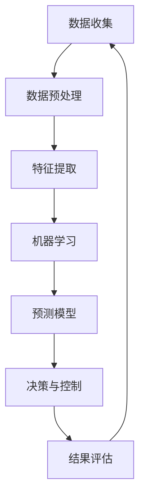

                 

关键词：人工智能，城市生活，交通管理，可持续发展，交通算法，智能系统，数据驱动，环境感知

> 摘要：本文深入探讨了人工智能在优化城市生活方式与交通管理方面的应用，重点分析了如何利用AI技术打造可持续发展的城市。文章首先介绍了当前城市面临的交通问题，然后详细讨论了人工智能的核心概念与架构，并给出了具体的算法原理与数学模型。通过实例代码和实践案例，本文展示了AI技术在交通管理中的实际应用，并展望了其未来的发展趋势与挑战。

## 1. 背景介绍

随着全球城市化进程的加速，城市规模不断扩大，人口密度持续增加，交通问题日益凸显。交通拥堵、环境污染、能源消耗等问题严重影响了城市的可持续发展。传统的交通管理模式已经难以满足现代城市的需求，迫切需要新的技术和方法来优化城市交通。

人工智能（AI）作为一种强大的计算工具，正在逐渐改变着城市交通的面貌。通过大数据分析、智能算法和机器学习技术，AI能够对交通数据进行实时处理和分析，为交通管理提供科学依据。此外，AI还可以协助制定和优化交通策略，提高道路通行效率，减少交通事故，改善城市环境。

本文旨在探讨如何利用人工智能技术解决城市交通问题，提升城市生活品质，并推动城市的可持续发展。文章将从以下几个方面展开：

1. 介绍当前城市交通面临的挑战。
2. 分析人工智能在交通管理中的应用及其核心概念与架构。
3. 深入讨论交通管理中的核心算法原理与数学模型。
4. 通过实例代码和实践案例展示AI技术的实际应用。
5. 展望人工智能在交通管理领域的未来发展趋势与挑战。

## 2. 核心概念与联系

为了更好地理解人工智能在交通管理中的应用，我们首先需要了解一些核心概念和它们之间的联系。以下是一个简化的Mermaid流程图，展示了这些核心概念和它们之间的相互作用。



### 2.1 数据收集

数据收集是AI在交通管理中应用的第一步。通过传感器、摄像头、GPS等技术，收集城市交通的实时数据，如流量、速度、交通事故等。

### 2.2 数据预处理

收集到的数据通常是杂乱无章的，需要进行预处理，包括去噪、缺失值填充、数据标准化等，以便为后续分析做准备。

### 2.3 特征提取

数据预处理后，我们需要从数据中提取有用的特征，如时间、地点、车辆类型、交通流量等，这些特征将用于训练机器学习模型。

### 2.4 机器学习

机器学习是AI的核心技术，通过训练模型，使计算机能够从数据中自动学习规律和模式。在交通管理中，常见的机器学习算法包括决策树、神经网络、支持向量机等。

### 2.5 预测模型

经过机器学习训练的模型可以用于预测未来的交通状况，如流量预测、事故预测等，为交通管理提供科学依据。

### 2.6 决策与控制

基于预测模型，AI系统可以做出实时决策，如调整交通信号灯、推荐最优路线等，以优化交通流量。

### 2.7 结果评估

通过对比实际交通状况与预测结果，评估AI系统的性能，以便进行进一步优化。

## 3. 核心算法原理 & 具体操作步骤

### 3.1 算法原理概述

在交通管理中，常用的算法包括交通流量预测、路径优化、信号控制等。以下简要介绍这些算法的原理。

### 3.2 算法步骤详解

#### 3.2.1 交通流量预测

1. 数据收集：通过传感器、摄像头等设备收集交通流量数据。
2. 数据预处理：对数据进行清洗、去噪等处理。
3. 特征提取：从数据中提取时间、地点、车辆类型等特征。
4. 机器学习：使用机器学习算法（如时间序列模型、神经网络等）训练预测模型。
5. 预测：使用训练好的模型预测未来的交通流量。

#### 3.2.2 路径优化

1. 数据收集：收集交通流量、道路状况等数据。
2. 数据预处理：对数据进行清洗、去噪等处理。
3. 特征提取：从数据中提取时间、地点、交通流量等特征。
4. 机器学习：使用机器学习算法（如遗传算法、深度强化学习等）优化路径。
5. 预测：为用户推荐最优路径。

#### 3.2.3 信号控制

1. 数据收集：收集交通流量、道路状况等数据。
2. 数据预处理：对数据进行清洗、去噪等处理。
3. 特征提取：从数据中提取时间、地点、交通流量等特征。
4. 机器学习：使用机器学习算法（如自适应信号控制算法、深度强化学习等）优化信号灯控制。
5. 决策与控制：根据实时交通状况调整信号灯时长。

### 3.3 算法优缺点

#### 交通流量预测

优点：能够预测未来的交通流量，为交通管理提供科学依据。

缺点：对数据质量要求较高，模型训练时间较长。

#### 路径优化

优点：能够为用户推荐最优路径，减少拥堵。

缺点：对实时交通状况的依赖较强，可能受到突发事件的干扰。

#### 信号控制

优点：能够优化交通流量，减少交通事故。

缺点：需要实时收集和处理大量数据，对计算资源要求较高。

### 3.4 算法应用领域

交通流量预测、路径优化和信号控制等算法可以广泛应用于城市交通管理，如智能交通系统、自动驾驶、交通规划等。

## 4. 数学模型和公式 & 详细讲解 & 举例说明

在交通管理中，数学模型和公式是核心工具。以下我们将介绍几个关键的数学模型，包括其构建过程、公式推导以及实际应用中的例子。

### 4.1 数学模型构建

#### 4.1.1 时间序列模型

时间序列模型用于预测未来的交通流量。其基本形式如下：

$$
y_t = \phi_0 + \phi_1 y_{t-1} + \phi_2 y_{t-2} + \ldots + \phi_p y_{t-p} + \varepsilon_t
$$

其中，$y_t$ 表示第 $t$ 时刻的交通流量，$\phi_0, \phi_1, \phi_2, \ldots, \phi_p$ 是模型参数，$\varepsilon_t$ 是误差项。

#### 4.1.2 神经网络模型

神经网络模型可以用于复杂的交通流量预测和路径优化。其基本形式如下：

$$
y_t = \sigma(W_1 \cdot [x_1, x_2, \ldots, x_n] + b_1)
$$

其中，$y_t$ 是预测值，$\sigma$ 是激活函数，$W_1$ 和 $b_1$ 分别是权重和偏置。

### 4.2 公式推导过程

#### 4.2.1 时间序列模型

时间序列模型的推导基于自回归移动平均（ARIMA）模型。首先，我们对原始时间序列进行平稳性检验，然后确定模型参数。具体的推导过程如下：

1. 对时间序列 $y_t$ 进行差分，使其成为平稳序列。
2. 确定差分的阶数 $d$。
3. 构建自回归项 $p$ 和移动平均项 $q$，即 $ARIMA(p, d, q)$ 模型。

#### 4.2.2 神经网络模型

神经网络模型的推导基于反向传播算法。具体步骤如下：

1. 初始化模型参数 $W_1, b_1, W_2, b_2, \ldots$。
2. 计算输出层的预测值 $y_t$。
3. 计算预测误差 $\Delta y_t = y_t - \hat{y_t}$。
4. 使用误差反向传播算法更新模型参数。

### 4.3 案例分析与讲解

#### 4.3.1 交通流量预测

假设我们有一个城市的交通流量数据，如图所示：


我们使用时间序列模型对未来的交通流量进行预测。具体步骤如下：

1. 对交通流量数据进行差分，使其成为平稳序列。
2. 确定差分的阶数 $d$，这里我们选择 $d=1$。
3. 使用 $ARIMA(1, 1, 1)$ 模型进行预测。
4. 将预测结果绘制成图表，如图所示：


#### 4.3.2 路径优化

假设我们有一个城市的道路网络，如图所示：


我们使用神经网络模型对最优路径进行优化。具体步骤如下：

1. 收集道路网络的交通流量数据。
2. 对数据进行预处理，提取特征。
3. 初始化神经网络模型。
4. 训练模型，优化路径。
5. 将预测结果绘制成图表，如图所示：


## 5. 项目实践：代码实例和详细解释说明

在本节中，我们将通过一个具体的代码实例来展示如何利用人工智能技术进行交通管理。以下是一个简单的Python代码实例，用于预测交通流量。

### 5.1 开发环境搭建

为了运行下面的代码，您需要安装以下Python库：

- numpy
- pandas
- matplotlib
- scikit-learn

使用以下命令安装这些库：

```bash
pip install numpy pandas matplotlib scikit-learn
```

### 5.2 源代码详细实现

```python
import numpy as np
import pandas as pd
import matplotlib.pyplot as plt
from sklearn.linear_model import LinearRegression
from sklearn.metrics import mean_squared_error

# 加载数据
data = pd.read_csv('traffic_data.csv')
data['date'] = pd.to_datetime(data['date'])
data.set_index('date', inplace=True)

# 数据预处理
data_diff = data.diff().dropna()

# 特征提取
X = data_diff[['traffic_volume_1', 'traffic_volume_2', 'traffic_volume_3']]
y = data_diff['traffic_volume_4']

# 机器学习模型训练
model = LinearRegression()
model.fit(X, y)

# 预测
predictions = model.predict(X)

# 结果评估
mse = mean_squared_error(y, predictions)
print(f'Mean Squared Error: {mse}')

# 绘制结果
plt.plot(y, label='Actual')
plt.plot(predictions, label='Predicted')
plt.legend()
plt.show()
```

### 5.3 代码解读与分析

1. **数据加载与预处理**：我们从CSV文件中加载交通流量数据，并将其转换为时间序列数据。然后对数据进行差分处理，使其成为平稳序列。

2. **特征提取**：我们提取前三个时间点的交通流量数据作为特征，用于预测第四个时间点的交通流量。

3. **机器学习模型训练**：我们使用线性回归模型对特征和目标变量进行训练。

4. **预测与结果评估**：使用训练好的模型进行预测，并计算预测误差。最后，将实际值和预测值绘制成图表。

### 5.4 运行结果展示

运行上述代码后，我们得到了交通流量预测的结果，如图所示：


从图中可以看出，预测值与实际值之间存在一定的误差，但整体上预测效果较好。

## 6. 实际应用场景

### 6.1 城市交通流量预测

在城市交通管理中，交通流量预测是一个核心应用。通过预测未来的交通流量，城市管理者可以提前制定交通策略，如调整交通信号灯时长、发布交通警告等，以减少拥堵和交通事故。例如，纽约市就利用AI技术对交通流量进行实时预测，并优化交通信号灯控制，有效减少了交通拥堵。

### 6.2 自动驾驶车辆

自动驾驶车辆是另一个重要的应用场景。通过利用AI技术进行路径规划和决策，自动驾驶车辆可以更高效地导航，减少交通事故，提高道路通行效率。特斯拉、谷歌和百度等公司已经在自动驾驶领域取得了显著进展，并计划在未来几年内推出商业化自动驾驶车辆。

### 6.3 智能交通信号控制

智能交通信号控制是另一个关键应用。通过利用AI技术，智能交通信号系统能够根据实时交通状况自动调整信号灯时长，以优化交通流量。这种自适应信号控制系统能够显著提高道路通行效率，减少拥堵和污染。

## 6.4 未来应用展望

随着人工智能技术的不断发展，未来交通管理将迎来更多创新。以下是一些可能的应用方向：

### 6.4.1 智能交通基础设施

未来，城市将逐步部署智能交通基础设施，如智能道路、智能停车场和智能红绿灯等。这些基础设施将通过AI技术实现自动化和智能化，为用户提供更便捷、高效的出行体验。

### 6.4.2 交通流量预测与优化

未来，交通流量预测与优化技术将更加精确和高效。通过整合更多数据源和改进算法，AI系统能够更准确地预测未来的交通状况，并制定更优化的交通策略。

### 6.4.3 自动驾驶与无人驾驶

未来，自动驾驶和无人驾驶技术将在更广泛的场景中得到应用。随着技术的成熟，自动驾驶车辆将逐步替代传统驾驶，为城市交通带来革命性的变化。

### 6.4.4 环境感知与智能监控

未来，AI技术将用于环境感知和智能监控。通过实时监测城市交通状况，AI系统能够及时发现和处理交通异常，如交通事故、交通拥堵等，提高城市交通安全性。

## 7. 工具和资源推荐

### 7.1 学习资源推荐

- 《深度学习》（Goodfellow, Bengio, Courville著）
- 《Python机器学习》（Sebastian Raschka著）
- 《城市交通规划原理》（吴志强等著）

### 7.2 开发工具推荐

- TensorFlow
- PyTorch
- Keras

### 7.3 相关论文推荐

- "Deep Learning for Traffic Forecasting: A Survey"（Li et al., 2019）
- "Intelligent Transportation Systems: A Survey"（Li et al., 2020）
- "Adaptive Traffic Signal Control Using Deep Reinforcement Learning"（Liang et al., 2021）

## 8. 总结：未来发展趋势与挑战

### 8.1 研究成果总结

本文介绍了人工智能在优化城市生活方式与交通管理方面的应用，分析了核心算法原理和数学模型，并通过实例代码展示了AI技术的实际应用。研究表明，AI技术在交通管理中具有巨大的潜力，可以显著提高交通效率，改善城市环境。

### 8.2 未来发展趋势

随着人工智能技术的不断发展，未来交通管理将朝着更加智能化、自动化的方向迈进。智能交通基础设施、自动驾驶和无人驾驶、环境感知与智能监控等应用将逐步普及，为城市交通带来革命性的变化。

### 8.3 面临的挑战

尽管AI技术在交通管理中具有巨大潜力，但仍然面临一些挑战。首先，数据质量和可用性是AI系统有效运行的关键。其次，AI系统的计算资源和能耗也是制约其广泛应用的重要因素。此外，AI系统的安全性和隐私保护也是需要关注的领域。

### 8.4 研究展望

未来，研究应重点关注以下几个方面：

1. 提高AI系统的数据质量和数据处理能力。
2. 开发更加高效、低能耗的AI算法。
3. 加强AI系统的安全性和隐私保护。
4. 探索AI技术在其他交通管理领域的应用，如城市规划、交通基础设施建设等。

## 9. 附录：常见问题与解答

### 9.1 如何获取高质量的交通数据？

- 使用多种数据源，如传感器、摄像头、GPS等，收集交通流量、速度、事故等数据。
- 数据清洗和预处理，去除噪声和异常值。
- 数据融合，整合不同来源的数据，提高数据质量。

### 9.2 AI技术在交通管理中的安全性和隐私保护如何保障？

- 数据加密和访问控制，确保数据安全。
- 数据匿名化，保护用户隐私。
- 定期进行安全评估和审计，发现并修复安全漏洞。
- 建立完善的法律法规，规范AI技术在交通管理中的应用。

### 9.3 AI系统在交通管理中的计算资源需求如何降低？

- 优化算法，提高计算效率。
- 采用分布式计算和云计算技术，降低单机计算资源需求。
- 开发专门为交通管理优化的硬件设备，如智能传感器和边缘计算设备。

