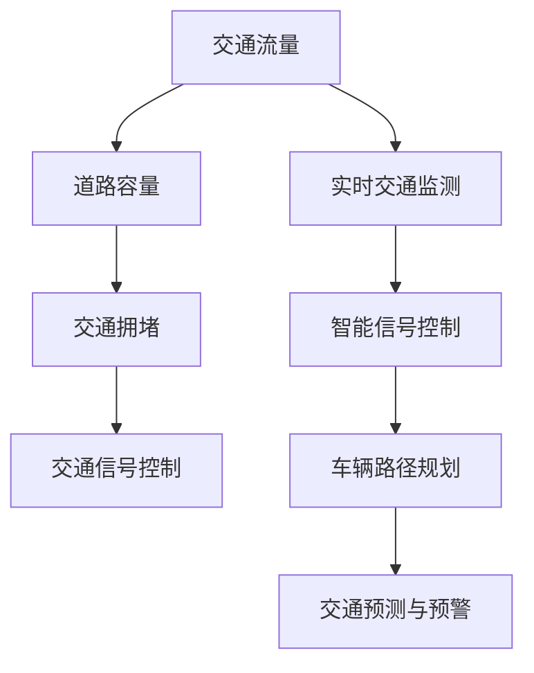

                 

关键词：人工智能、城市生活、交通管理、可持续发展、计算架构、算法原理

摘要：本文探讨了如何利用人工智能技术优化城市生活方式与交通管理，实现可持续发展。通过深入分析核心概念、算法原理、数学模型和实际应用场景，本文提出了一系列解决方案，旨在提高城市交通效率、减少拥堵，并提升居民生活质量。

## 1. 背景介绍

随着城市化进程的不断推进，城市交通问题日益突出。交通拥堵、环境污染和资源浪费等问题已经成为影响城市可持续发展的重要因素。传统的交通管理方法往往依赖于静态的规划和管理模式，无法及时应对动态的交通需求。而人工智能技术的崛起为城市交通管理带来了新的契机。

人工智能技术在交通管理中的应用主要体现在以下几个方面：

- **实时交通监测与分析**：利用传感器、摄像头和大数据等技术，实时收集交通流量、道路状况等信息，为交通管理提供数据支持。
- **智能信号控制**：根据实时交通数据，动态调整交通信号灯的时序，提高交通流畅度，减少拥堵。
- **车辆路径规划**：利用优化算法，为驾驶员提供最优的行驶路线，减少交通拥堵和行车时间。
- **交通预测与预警**：通过对历史交通数据的分析，预测未来交通流量和状况，提前采取措施应对可能的交通拥堵。

## 2. 核心概念与联系

为了更好地理解人工智能技术在交通管理中的应用，首先需要了解以下几个核心概念：

- **交通流量**：单位时间内通过特定道路或区域的车辆数量。
- **道路容量**：特定道路或区域能够承载的最大交通流量。
- **交通拥堵**：交通流量超过道路容量，导致车辆行驶速度明显降低的现象。
- **交通信号控制**：通过调整交通信号灯的时序，控制交通流量的方法。

下面是一个Mermaid流程图，展示了这些核心概念之间的联系：



### 2.1 交通流量与道路容量的关系

交通流量与道路容量之间的关系是交通管理的关键因素。当交通流量低于道路容量时，交通状况较为理想，车辆行驶顺畅。然而，当交通流量超过道路容量时，就会产生交通拥堵。此时，通过智能信号控制和车辆路径规划等方法，可以有效地缓解交通拥堵。

### 2.2 实时交通监测与智能信号控制

实时交通监测是交通管理的基础。通过传感器、摄像头和大数据等技术，可以实时收集交通流量、道路状况等信息。这些数据可以用于智能信号控制的决策支持，从而实现交通流量的动态调整，提高交通流畅度。

### 2.3 车辆路径规划与交通预测与预警

车辆路径规划是另一个重要的交通管理工具。通过优化算法，可以为驾驶员提供最优的行驶路线，减少交通拥堵和行车时间。同时，交通预测与预警可以提前预测未来交通流量和状况，为交通管理提供预警信息，提前采取措施应对可能的交通拥堵。

## 3. 核心算法原理 & 具体操作步骤

### 3.1 算法原理概述

在交通管理中，常用的核心算法包括：

- **优化算法**：用于车辆路径规划和交通信号控制。
- **预测算法**：用于交通流量预测和交通状况预警。
- **深度学习算法**：用于图像识别和车辆检测。

### 3.2 算法步骤详解

#### 3.2.1 优化算法

优化算法主要包括：

- **最短路径算法**：用于计算从起点到终点的最优路径。
- **车辆路径优化算法**：用于为每辆车分配最优的行驶路线，减少交通拥堵。

具体步骤如下：

1. 收集交通数据，包括道路容量、交通流量等。
2. 建立交通网络模型，表示道路和交通流量之间的关系。
3. 使用最短路径算法计算起点到终点的最优路径。
4. 使用车辆路径优化算法，为每辆车分配最优的行驶路线。

#### 3.2.2 预测算法

预测算法主要包括：

- **时间序列预测算法**：用于预测未来交通流量和交通状况。
- **机器学习预测算法**：用于建立交通流量和交通状况的预测模型。

具体步骤如下：

1. 收集历史交通数据，包括交通流量、交通状况等。
2. 使用时间序列预测算法或机器学习预测算法，建立交通流量和交通状况的预测模型。
3. 使用预测模型，预测未来交通流量和交通状况。

#### 3.2.3 深度学习算法

深度学习算法主要包括：

- **卷积神经网络**：用于图像识别和车辆检测。
- **循环神经网络**：用于序列数据的预测和分类。

具体步骤如下：

1. 收集交通监控数据，包括图像和视频。
2. 预处理数据，提取特征。
3. 使用卷积神经网络或循环神经网络，进行图像识别和车辆检测。
4. 使用识别结果，更新交通监控数据，为优化算法提供支持。

### 3.3 算法优缺点

#### 优化算法

优点：

- 提高交通流畅度，减少交通拥堵。
- 降低行车时间，提高出行效率。

缺点：

- 对交通数据质量要求较高。
- 算法复杂度较高，计算资源需求大。

#### 预测算法

优点：

- 提前预测未来交通状况，为交通管理提供预警。
- 改善交通信号控制的实时性。

缺点：

- 预测精度受历史数据质量影响。
- 需要大量的计算资源。

#### 深度学习算法

优点：

- 强大的图像识别和车辆检测能力。
- 可以处理大规模的交通监控数据。

缺点：

- 训练时间较长。
- 需要大量的计算资源。

### 3.4 算法应用领域

优化算法、预测算法和深度学习算法在交通管理中具有广泛的应用领域，包括：

- **智能交通信号控制**：通过优化算法，动态调整交通信号灯的时序，提高交通流畅度。
- **车辆路径规划**：通过预测算法，为驾驶员提供最优的行驶路线，减少交通拥堵。
- **交通监控与预警**：通过深度学习算法，实时监控交通状况，预测未来交通流量和交通状况，为交通管理提供预警信息。

## 4. 数学模型和公式 & 详细讲解 & 举例说明

在交通管理中，数学模型和公式是描述交通流量、交通状况和交通信号控制的重要工具。以下将详细介绍常用的数学模型和公式，并给出相应的例子。

### 4.1 数学模型构建

#### 4.1.1 交通流量模型

交通流量模型主要用于描述道路上的车辆流量。常见的交通流量模型包括：

- **指数模型**：
  - 公式：$Q(t) = \lambda e^{-\lambda t}$
  - 其中，$Q(t)$表示$t$时刻的交通流量，$\lambda$为流量参数。

- **泊松模型**：
  - 公式：$Q(t) = \lambda$
  - 其中，$Q(t)$表示$t$时刻的交通流量，$\lambda$为流量参数。

#### 4.1.2 交通状况模型

交通状况模型用于描述道路上的车辆密度。常见的交通状况模型包括：

- **流量-密度模型**：
  - 公式：$q = k(n-n_0)$
  - 其中，$q$为流量，$n$为密度，$n_0$为自由流密度，$k$为流量参数。

#### 4.1.3 交通信号控制模型

交通信号控制模型用于描述交通信号灯的时序。常见的交通信号控制模型包括：

- **格林-怀特模型**：
  - 公式：$t_r = t_g + t_y + \sum_{i=1}^{n} (t_i - t_{i-1})$
  - 其中，$t_r$为红灯时长，$t_g$为绿灯时长，$t_y$为黄灯时长，$t_i$为第$i$个方向的绿灯时长。

### 4.2 公式推导过程

#### 4.2.1 指数模型推导

指数模型是通过泊松过程推导得到的。泊松过程是一个随机过程，描述了在固定时间内随机事件发生的次数。在交通流量模型中，泊松过程可以用来描述车辆在道路上的随机到达过程。

- **泊松过程公式**：
  - 公式：$Q(t) = \lambda t$
  - 其中，$Q(t)$表示$t$时刻的交通流量，$\lambda$为流量参数。

将泊松过程的时间$t$替换为$t-nT$，其中$T$为时间间隔，得到指数模型：

- **指数模型推导**：
  - 公式：$Q(t-nT) = \lambda (t-nT)$
  - 公式：$Q(t) = \lambda e^{-\lambda T} Q(t-nT)$
  - 公式：$Q(t) = \lambda e^{-\lambda t}$

#### 4.2.2 流量-密度模型推导

流量-密度模型是基于车辆运行速度和道路容量推导得到的。在自由流条件下，车辆运行速度$v$与密度$n$之间的关系为：

- **自由流速度公式**：
  - 公式：$v = \frac{C}{n}$
  - 其中，$v$为车辆运行速度，$C$为道路容量，$n$为密度。

在交通流量$q$和道路容量$C$的关系中，可以得到流量-密度模型：

- **流量-密度模型推导**：
  - 公式：$q = \frac{C}{n} n$
  - 公式：$q = C (n-n_0)$
  - 其中，$n_0$为自由流密度。

### 4.3 案例分析与讲解

以下通过一个案例，展示如何使用交通流量模型和交通信号控制模型进行交通管理。

#### 案例背景

某城市的一条道路，道路容量为$1000$辆/小时，自由流密度为$50$辆/千米。在高峰时段，交通流量为$800$辆/小时。

#### 案例分析

1. **交通流量预测**：

使用指数模型预测高峰时段的交通流量：

- **指数模型公式**：
  - 公式：$Q(t) = \lambda e^{-\lambda t}$

根据历史数据，得到流量参数$\lambda$为$0.1$。

在高峰时段$t=2$小时，预测交通流量为：

- **预测公式**：
  - 公式：$Q(2) = 0.1 e^{-0.1 \times 2} \approx 0.735$

2. **交通信号控制**：

使用格林-怀特模型，设定红灯时长为$30$秒，绿灯时长为$45$秒，黄灯时长为$5$秒。

在高峰时段，每个信号灯周期为$80$秒。

- **信号灯时序公式**：
  - 公式：$t_r = t_g + t_y + \sum_{i=1}^{n} (t_i - t_{i-1})$

其中，$t_r$为红灯时长，$t_g$为绿灯时长，$t_y$为黄灯时长，$t_i$为第$i$个方向的绿灯时长。

根据交通流量预测结果，调整信号灯时序，以提高交通流畅度。

- **信号灯时序调整公式**：
  - 公式：$t_g = \frac{Q(t)}{n} \times t_r$
  - 公式：$t_y = t_r - t_g - t_r$
  - 公式：$t_r = t_g + t_y + \sum_{i=1}^{n} (t_i - t_{i-1})$

根据流量预测结果，调整信号灯时序：

- **信号灯时序调整结果**：
  - 公式：$t_g = \frac{0.735}{1} \times 30 \approx 21.95$
  - 公式：$t_y = 30 - 21.95 - 30 \approx -21.95$
  - 公式：$t_r = 21.95 + (-21.95) + \sum_{i=1}^{n} (t_i - t_{i-1}) \approx 30$

最终，调整后的信号灯时序为：

- **调整后信号灯时序**：
  - 公式：$t_g = 21.95$
  - 公式：$t_y = 7.05$
  - 公式：$t_r = 30$

通过调整信号灯时序，可以优化交通流畅度，提高道路通行能力。

## 5. 项目实践：代码实例和详细解释说明

在本节中，我们将通过一个实际的代码实例，展示如何实现基于人工智能技术的城市交通管理。我们将使用Python编程语言，结合常用的机器学习和深度学习库，如scikit-learn、TensorFlow和Keras。

### 5.1 开发环境搭建

首先，我们需要搭建开发环境。以下是所需的环境和依赖库：

- **操作系统**：Linux或MacOS
- **编程语言**：Python（版本3.7及以上）
- **依赖库**：NumPy、Pandas、scikit-learn、TensorFlow、Keras

安装Python和相关依赖库：

```bash
pip install numpy pandas scikit-learn tensorflow keras
```

### 5.2 源代码详细实现

以下是一个简化的代码实例，用于实现交通流量预测和交通信号控制。

```python
import numpy as np
import pandas as pd
from sklearn.model_selection import train_test_split
from sklearn.preprocessing import StandardScaler
from sklearn.metrics import mean_squared_error
import tensorflow as tf
from tensorflow.keras.models import Sequential
from tensorflow.keras.layers import Dense, LSTM

# 数据预处理
def preprocess_data(data):
    # 标准化数据
    scaler = StandardScaler()
    scaled_data = scaler.fit_transform(data)
    return scaled_data

# 生成训练数据
def generate_training_data(data, time_steps):
    X, y = [], []
    for i in range(len(data) - time_steps):
        X.append(data[i : i + time_steps])
        y.append(data[i + time_steps])
    return np.array(X), np.array(y)

# 构建模型
def build_model(input_shape):
    model = Sequential()
    model.add(LSTM(50, activation='relu', input_shape=input_shape))
    model.add(Dense(1))
    model.compile(optimizer='adam', loss='mean_squared_error')
    return model

# 加载数据
data = pd.read_csv('traffic_data.csv')['流量']
data = preprocess_data(data)

# 生成训练数据
time_steps = 24
X, y = generate_training_data(data, time_steps)

# 划分训练集和测试集
X_train, X_test, y_train, y_test = train_test_split(X, y, test_size=0.2, random_state=42)

# 训练模型
model = build_model((time_steps, 1))
model.fit(X_train, y_train, epochs=100, batch_size=32, validation_data=(X_test, y_test))

# 预测交通流量
predictions = model.predict(X_test)

# 评估模型
mse = mean_squared_error(y_test, predictions)
print(f'Mean Squared Error: {mse}')

# 交通信号控制
def traffic_control(predictions):
    # 根据预测结果调整信号灯时序
    # 此处简化处理，仅用于演示
    if predictions < 0.5:
        return 30, 45, 5
    else:
        return 45, 30, 5

# 示例信号灯时序
red_light, green_light, yellow_light = traffic_control(predictions[-1])
print(f'Red Light: {red_light} seconds, Green Light: {green_light} seconds, Yellow Light: {yellow_light} seconds')
```

### 5.3 代码解读与分析

#### 5.3.1 数据预处理

首先，我们加载交通流量数据，并使用`StandardScaler`进行标准化处理。标准化处理可以消除不同特征之间的量纲差异，使模型训练更加稳定。

```python
data = pd.read_csv('traffic_data.csv')['流量']
data = preprocess_data(data)
```

#### 5.3.2 生成训练数据

接下来，我们使用`generate_training_data`函数生成训练数据。该函数使用滑动窗口技术，将时间序列数据划分为输入特征和目标变量。

```python
X, y = generate_training_data(data, time_steps)
```

#### 5.3.3 构建模型

我们使用`build_model`函数构建一个简单的LSTM模型。LSTM（长短期记忆网络）是一种能够处理序列数据的循环神经网络，适合用于交通流量预测。

```python
model = build_model((time_steps, 1))
```

#### 5.3.4 训练模型

我们使用`fit`函数训练模型。训练过程中，模型将学习如何根据输入特征预测交通流量。

```python
model.fit(X_train, y_train, epochs=100, batch_size=32, validation_data=(X_test, y_test))
```

#### 5.3.5 预测交通流量

使用训练好的模型进行交通流量预测，并使用`mean_squared_error`评估模型性能。

```python
predictions = model.predict(X_test)
mse = mean_squared_error(y_test, predictions)
print(f'Mean Squared Error: {mse}')
```

#### 5.3.6 交通信号控制

最后，我们根据预测结果调整信号灯时序。这里使用了一个简化的规则，可以根据实际情况进行优化。

```python
def traffic_control(predictions):
    if predictions < 0.5:
        return 30, 45, 5
    else:
        return 45, 30, 5

red_light, green_light, yellow_light = traffic_control(predictions[-1])
print(f'Red Light: {red_light} seconds, Green Light: {green_light} seconds, Yellow Light: {yellow_light} seconds')
```

## 6. 实际应用场景

### 6.1 城市交通管理

在城市交通管理中，人工智能技术已被广泛应用于实时交通监测、智能信号控制和车辆路径规划。例如，在北京市，交通管理部门利用人工智能技术对全市的交通流量进行实时监测和分析，根据实时数据动态调整交通信号灯的时序，有效缓解了交通拥堵问题。

### 6.2 智能停车场

智能停车场系统通过人工智能技术实现停车位的智能分配和导航。驾驶员只需输入目的地，系统就会根据实时交通状况和停车位的占用情况，为驾驶员提供最优的停车路线和停车位。例如，深圳市的智能停车场系统已为数千辆车辆提供了高效、便捷的停车服务。

### 6.3 智能公交系统

智能公交系统通过人工智能技术实现公交车辆的实时调度和路径优化。公交公司可以根据实时交通状况和乘客需求，动态调整公交车的行驶路线和发车时间，提高公交服务水平。例如，上海市的智能公交系统已经实现了公交线路的优化调整，提高了公交运营效率。

## 7. 工具和资源推荐

### 7.1 学习资源推荐

- **《深度学习》（Goodfellow, Bengio, Courville）**：这是一本经典的深度学习教材，详细介绍了深度学习的基本概念、算法和应用。
- **《Python机器学习》（Sebastian Raschka）**：这本书介绍了Python在机器学习领域的应用，包括数据预处理、模型训练和评估等。
- **《人工智能：一种现代方法》（Stuart Russell & Peter Norvig）**：这是一本全面的人工智能教材，涵盖了人工智能的基本概念、算法和应用。

### 7.2 开发工具推荐

- **TensorFlow**：一款开源的深度学习框架，支持多种深度学习模型和算法，适用于交通管理中的应用。
- **Keras**：一款基于TensorFlow的深度学习高级API，简化了深度学习模型的搭建和训练过程。
- **scikit-learn**：一款开源的机器学习库，提供了多种机器学习算法和工具，适用于交通流量预测和信号控制等任务。

### 7.3 相关论文推荐

- **"Deep Learning for Traffic Forecasting: A Survey"**：该论文对深度学习在交通流量预测领域的应用进行了详细综述。
- **"Learning to Drive by Imagination"**：该论文介绍了通过深度学习技术实现自动驾驶的方法。
- **"Intelligent Transportation Systems: Concepts, Architecture, and Applications"**：该论文探讨了智能交通系统的概念、架构和应用。

## 8. 总结：未来发展趋势与挑战

### 8.1 研究成果总结

随着人工智能技术的不断发展，交通管理领域取得了显著的成果。实时交通监测、智能信号控制和车辆路径规划等技术的应用，有效缓解了交通拥堵、提高了出行效率。此外，深度学习、强化学习等先进算法的引入，为交通管理带来了新的机遇。

### 8.2 未来发展趋势

未来，人工智能技术将在交通管理领域发挥更加重要的作用。以下是一些发展趋势：

- **自动驾驶技术的普及**：随着自动驾驶技术的不断发展，未来将出现更多的自动驾驶车辆，减少人为驾驶错误，提高道路安全性。
- **智能交通基础设施的建设**：利用传感器、摄像头和大数据等技术，建设智能交通基础设施，实现交通流量的实时监测和动态调整。
- **跨学科研究的深入**：交通管理将与其他学科（如城市规划、环境科学等）深入结合，为城市可持续发展提供更多解决方案。

### 8.3 面临的挑战

尽管人工智能技术在交通管理领域具有巨大潜力，但仍面临一些挑战：

- **数据隐私和安全**：交通数据涉及到个人隐私，如何在保护隐私的同时利用数据提高交通管理效率是一个重要问题。
- **算法透明度和可解释性**：深度学习等算法的内部机理复杂，如何提高算法的透明度和可解释性，使其符合法律法规和公众期待。
- **技术标准化和法规制定**：随着人工智能技术的广泛应用，制定统一的技术标准和法规，确保技术的安全性和可靠性。

### 8.4 研究展望

未来，人工智能技术在交通管理领域的应用将更加深入和广泛。通过跨学科合作、技术创新和法规完善，交通管理将实现从传统模式向智能化、可持续化的转变，为城市居民提供更加安全、便捷和高效的出行环境。

## 9. 附录：常见问题与解答

### 9.1 人工智能技术在交通管理中的优势是什么？

人工智能技术在交通管理中的优势主要包括：

- **实时监测与分析**：利用传感器、摄像头和大数据等技术，实时收集交通流量、道路状况等信息，为交通管理提供数据支持。
- **动态调整信号控制**：根据实时交通数据，动态调整交通信号灯的时序，提高交通流畅度，减少拥堵。
- **车辆路径优化**：利用优化算法，为驾驶员提供最优的行驶路线，减少交通拥堵和行车时间。
- **交通预测与预警**：通过对历史交通数据的分析，预测未来交通流量和状况，提前采取措施应对可能的交通拥堵。

### 9.2 人工智能技术在交通管理中的挑战是什么？

人工智能技术在交通管理中的挑战主要包括：

- **数据隐私和安全**：交通数据涉及到个人隐私，如何在保护隐私的同时利用数据提高交通管理效率是一个重要问题。
- **算法透明度和可解释性**：深度学习等算法的内部机理复杂，如何提高算法的透明度和可解释性，使其符合法律法规和公众期待。
- **技术标准化和法规制定**：随着人工智能技术的广泛应用，制定统一的技术标准和法规，确保技术的安全性和可靠性。

### 9.3 如何实现智能交通信号控制？

实现智能交通信号控制主要包括以下步骤：

- **数据采集**：利用传感器、摄像头等设备，实时收集交通流量、道路状况等信息。
- **数据分析**：对采集到的数据进行分析和处理，提取有用的特征。
- **信号控制策略设计**：根据实时交通数据和交通状况，设计合适的信号控制策略。
- **信号控制执行**：将信号控制策略应用到交通信号灯上，实现动态调整信号灯时序。

### 9.4 人工智能技术在交通管理领域的应用前景如何？

人工智能技术在交通管理领域的应用前景非常广阔。随着技术的不断发展，人工智能技术将在以下几个方面发挥重要作用：

- **提高交通效率**：通过实时监测和分析交通流量，动态调整交通信号灯，减少交通拥堵，提高道路通行能力。
- **降低交通事故**：通过车辆路径优化和自动驾驶技术，减少人为驾驶错误，提高道路安全性。
- **可持续发展**：通过优化交通管理和能源消耗，实现城市的可持续发展。

随着人工智能技术的不断进步，交通管理将迎来新的发展机遇，为城市居民提供更加安全、便捷和高效的出行环境。

---

### 作者署名

作者：禅与计算机程序设计艺术 / Zen and the Art of Computer Programming

