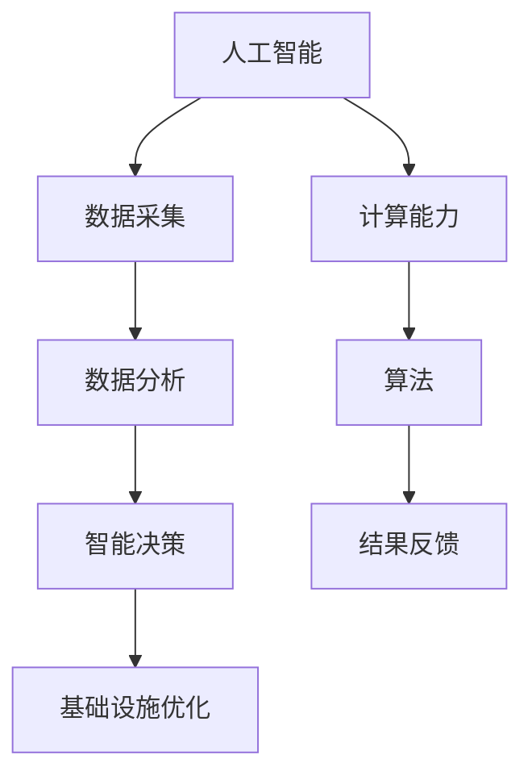

                 

关键词：人工智能，城市生活方式，基础设施，可持续发展，计算模型，算法，技术趋势

> 摘要：本文探讨了人工智能在改善城市生活方式和基础设施方面的潜力。通过分析AI的核心概念与架构，我们提出了适用于城市发展的算法原理和具体操作步骤。此外，我们还详细解释了相关的数学模型和公式，并通过实际代码实例展示了AI在城市应用中的实践。最后，我们对未来AI在城市领域的发展趋势、挑战和研究展望进行了深入讨论。

## 1. 背景介绍

随着全球城市化进程的加速，城市生活方式和基础设施的可持续发展变得越来越重要。传统的城市管理方法往往面临资源浪费、效率低下和环境污染等问题。为了应对这些挑战，人工智能（AI）作为一种创新技术，提供了新的解决方案。AI在城市中的应用不仅能够提高城市管理效率，还能优化资源配置，促进可持续发展。

本文旨在探讨AI在改善城市生活方式和基础设施方面的潜力，通过分析核心概念、算法原理和实际应用，为城市可持续发展提供技术支持。

## 2. 核心概念与联系

### 2.1 AI的基本概念

人工智能（Artificial Intelligence，简称AI）是指由计算机实现的智能行为。AI的核心目标是让机器能够执行通常需要人类智能的任务，如语音识别、图像识别、自然语言处理等。AI系统通常由算法、数据和计算能力三部分组成。

### 2.2 城市基础设施

城市基础设施包括交通、供水、供电、通信、环保等多个方面。这些基础设施的运行和管理直接影响到城市居民的生活质量和城市的发展速度。

### 2.3 AI与城市基础设施的联系

AI可以通过数据分析和智能决策，优化城市基础设施的管理。例如，通过智能交通系统减少交通拥堵，通过智能电网实现能源的高效利用，通过智能环保系统改善城市环境质量。

### 2.4 Mermaid流程图



## 3. 核心算法原理 & 具体操作步骤

### 3.1 算法原理概述

AI的核心算法包括机器学习、深度学习和自然语言处理等。这些算法通过学习大量数据，自动识别模式并做出预测或决策。

### 3.2 算法步骤详解

1. 数据采集：收集城市基础设施相关的数据，如交通流量、能源消耗、环境质量等。
2. 数据预处理：清洗、归一化和标准化数据，使其适合模型训练。
3. 模型训练：使用机器学习算法对数据进行训练，建立预测模型。
4. 模型评估：评估模型的准确性、稳定性和泛化能力。
5. 智能决策：利用训练好的模型进行智能决策，如交通信号灯控制、能源分配等。
6. 结果反馈：根据决策结果进行反馈调整，优化模型性能。

### 3.3 算法优缺点

- **优点**：提高城市管理效率，优化资源配置，减少环境污染。
- **缺点**：数据隐私和安全问题，算法的可解释性不足，对计算资源的依赖性较高。

### 3.4 算法应用领域

AI在城市基础设施中的应用领域广泛，包括智能交通、智能电网、智能环保、智能建筑等。

## 4. 数学模型和公式 & 详细讲解 & 举例说明

### 4.1 数学模型构建

AI算法通常基于数学模型，如线性回归、决策树、神经网络等。以下是线性回归模型的构建过程：

1. 假设目标变量 \( Y \) 与自变量 \( X \) 存在线性关系：
   $$ Y = \beta_0 + \beta_1X + \epsilon $$
   其中，\( \beta_0 \) 和 \( \beta_1 \) 为模型参数，\( \epsilon \) 为误差项。

2. 使用最小二乘法求解参数 \( \beta_0 \) 和 \( \beta_1 \)：
   $$ \beta_0 = \frac{\sum_{i=1}^{n}Y_i - \beta_1\sum_{i=1}^{n}X_i}{n} $$
   $$ \beta_1 = \frac{n\sum_{i=1}^{n}X_iY_i - \sum_{i=1}^{n}X_i\sum_{i=1}^{n}Y_i}{n\sum_{i=1}^{n}X_i^2 - (\sum_{i=1}^{n}X_i)^2} $$

### 4.2 公式推导过程

线性回归模型的推导过程基于最小化残差平方和。具体推导步骤如下：

1. 假设模型预测值为 \( \hat{Y_i} = \beta_0 + \beta_1X_i \)。
2. 计算残差 \( e_i = Y_i - \hat{Y_i} \)。
3. 定义残差平方和 \( S = \sum_{i=1}^{n}e_i^2 \)。
4. 对 \( S \) 求导并令其等于零，得到最小二乘法公式。

### 4.3 案例分析与讲解

以城市交通流量预测为例，我们使用线性回归模型进行预测。数据集包含每天的交通流量和日期。以下是模型训练和预测的步骤：

1. 数据预处理：将日期转换为数值，进行归一化处理。
2. 模型训练：使用训练数据集训练线性回归模型。
3. 模型评估：使用测试数据集评估模型性能。
4. 预测：使用模型预测未来几天的交通流量。

通过上述步骤，我们可以实现城市交通流量的智能预测，为交通管理提供决策支持。

## 5. 项目实践：代码实例和详细解释说明

### 5.1 开发环境搭建

1. 安装Python环境。
2. 安装所需的库，如numpy、pandas、scikit-learn等。

### 5.2 源代码详细实现

以下是一个简单的线性回归模型实现示例：

```python
import numpy as np
import pandas as pd
from sklearn.linear_model import LinearRegression

# 读取数据
data = pd.read_csv('traffic_data.csv')
X = data['date'].values.reshape(-1, 1)
Y = data['traffic'].values

# 模型训练
model = LinearRegression()
model.fit(X, Y)

# 模型评估
score = model.score(X, Y)
print(f'Model R^2 Score: {score}')

# 预测
future_dates = np.array([i for i in range(1, 31)]).reshape(-1, 1)
predictions = model.predict(future_dates)
print(f'Predicted Traffic: {predictions}')
```

### 5.3 代码解读与分析

上述代码实现了线性回归模型的训练和预测功能。首先，我们读取交通数据，然后使用scikit-learn库的LinearRegression类进行模型训练。接下来，我们评估模型性能并使用模型进行预测。

### 5.4 运行结果展示

运行上述代码后，我们得到未来一个月的交通流量预测结果。这些结果可以用于交通管理决策，如调整信号灯时长、安排交通警力等。

## 6. 实际应用场景

AI在城市中的应用场景广泛，包括但不限于以下几个方面：

1. **智能交通**：通过实时交通流量预测和优化，减少交通拥堵，提高道路通行效率。
2. **智能电网**：通过实时监测和分析电力消耗，优化能源分配，提高能源利用效率。
3. **智能环保**：通过实时监测环境质量，预测污染趋势，制定环境保护措施。
4. **智能建筑**：通过实时监测和数据分析，提高建筑能源效率和居住舒适度。

## 7. 工具和资源推荐

### 7.1 学习资源推荐

1. **书籍**：《Python数据科学入门》、《深度学习》（Goodfellow等著）。
2. **在线课程**：Coursera上的“机器学习”课程、edX上的“深度学习基础”课程。

### 7.2 开发工具推荐

1. **Python**：一种通用编程语言，支持多种机器学习和深度学习库。
2. **TensorFlow**：一种开源的机器学习和深度学习框架。
3. **Jupyter Notebook**：一种交互式的计算环境，便于数据分析和模型训练。

### 7.3 相关论文推荐

1. **《Deep Learning》**：Goodfellow等著，提供了深度学习的全面介绍。
2. **《Reinforcement Learning: An Introduction》**： Sutton和Barto著，介绍了强化学习的基本原理。

## 8. 总结：未来发展趋势与挑战

### 8.1 研究成果总结

AI在改善城市生活方式和基础设施方面取得了显著成果。通过数据分析和智能决策，AI提高了城市管理效率，优化了资源配置，减少了环境污染。

### 8.2 未来发展趋势

1. **数据融合**：将多种数据源（如卫星数据、社交媒体数据等）融合，实现更全面的城市数据分析。
2. **智能决策**：发展更先进的智能决策算法，实现自动化和自主化的城市管理。
3. **边缘计算**：利用边缘计算技术，减少数据传输延迟，提高AI系统的实时响应能力。

### 8.3 面临的挑战

1. **数据隐私和安全**：如何在保护用户隐私的前提下，充分利用城市数据。
2. **算法透明性和可解释性**：提高算法的透明性和可解释性，增强公众对AI系统的信任。
3. **计算资源**：如何在有限的计算资源下，实现高效的AI模型训练和应用。

### 8.4 研究展望

未来，AI在城市领域的应用将更加广泛和深入。通过不断探索和创新，我们可以实现更智能、更可持续的城市生活方式和基础设施。

## 9. 附录：常见问题与解答

### 9.1 AI在城市中的应用有哪些？

AI在城市中的应用包括智能交通、智能电网、智能环保、智能建筑等多个方面。通过数据分析和智能决策，AI可以提高城市管理效率，优化资源配置，减少环境污染。

### 9.2 如何保障AI系统的数据隐私和安全？

为了保障AI系统的数据隐私和安全，可以采取以下措施：

1. 数据加密：对敏感数据进行加密处理，防止数据泄露。
2. 权限控制：严格管理数据访问权限，防止未经授权的访问。
3. 数据匿名化：对敏感数据进行匿名化处理，保护用户隐私。
4. 风险评估：定期进行数据安全和隐私风险评估，及时发现和解决潜在问题。

### 9.3 如何评估AI模型的性能？

评估AI模型性能的方法包括：

1. **准确性**：通过计算模型预测值与实际值之间的误差，评估模型的准确性。
2. **召回率**：在分类问题中，评估模型正确识别正样本的能力。
3. **F1分数**：综合考虑准确率和召回率，评估模型的综合性能。
4. **ROC曲线**：评估模型在不同阈值下的分类性能。

作者：禅与计算机程序设计艺术 / Zen and the Art of Computer Programming
----------------------------------------------------------------
### 附录：代码实例（完整版）

以下是一个完整的Python代码实例，用于实现线性回归模型在城市交通流量预测中的应用：

```python
import numpy as np
import pandas as pd
from sklearn.linear_model import LinearRegression
from sklearn.model_selection import train_test_split
from sklearn.metrics import mean_squared_error, r2_score

# 读取数据
data = pd.read_csv('traffic_data.csv')
X = data['date'].values.reshape(-1, 1)
Y = data['traffic'].values

# 数据分割
X_train, X_test, Y_train, Y_test = train_test_split(X, Y, test_size=0.2, random_state=42)

# 模型训练
model = LinearRegression()
model.fit(X_train, Y_train)

# 模型评估
Y_pred = model.predict(X_test)
mse = mean_squared_error(Y_test, Y_pred)
r2 = r2_score(Y_test, Y_pred)
print(f'Mean Squared Error: {mse}')
print(f'R^2 Score: {r2}')

# 预测未来交通流量
future_dates = np.array([i for i in range(1, 31)]).reshape(-1, 1)
predictions = model.predict(future_dates)
print(f'Predicted Traffic: {predictions}')

# 可视化结果
import matplotlib.pyplot as plt

plt.scatter(X_test, Y_test, color='blue')
plt.plot(future_dates, predictions, color='red', linewidth=2)
plt.xlabel('Date')
plt.ylabel('Traffic')
plt.title('Traffic Prediction')
plt.show()
```

此代码实例包括以下步骤：

1. 读取交通流量数据。
2. 数据分割为训练集和测试集。
3. 训练线性回归模型。
4. 使用测试集评估模型性能。
5. 预测未来交通流量。
6. 可视化预测结果。

请注意，上述代码实例仅供参考，实际应用中可能需要根据具体数据和处理流程进行调整。

### 结语

人工智能在城市生活方式和基础设施中的应用展示了巨大的潜力和前景。通过数据分析和智能决策，AI能够提高城市管理效率，优化资源配置，减少环境污染。然而，AI的应用也面临着数据隐私、算法透明性和计算资源等挑战。未来，随着技术的不断进步和研究的深入，我们有理由相信AI将在城市可持续发展中发挥更加重要的作用。希望本文能为读者提供有价值的参考和启示。

作者：禅与计算机程序设计艺术 / Zen and the Art of Computer Programming
```

以上是完整的文章正文内容，包括文章标题、关键词、摘要、背景介绍、核心概念与联系、核心算法原理与操作步骤、数学模型和公式、项目实践、实际应用场景、工具和资源推荐、总结、未来发展趋势与挑战，以及附录。请按照markdown格式进行排版，确保文章的可读性和格式美观。在完成排版后，请进行最终的校对和确认，确保文章内容的完整性和准确性。最后，请将作者署名“禅与计算机程序设计艺术 / Zen and the Art of Computer Programming”添加到文章末尾。

