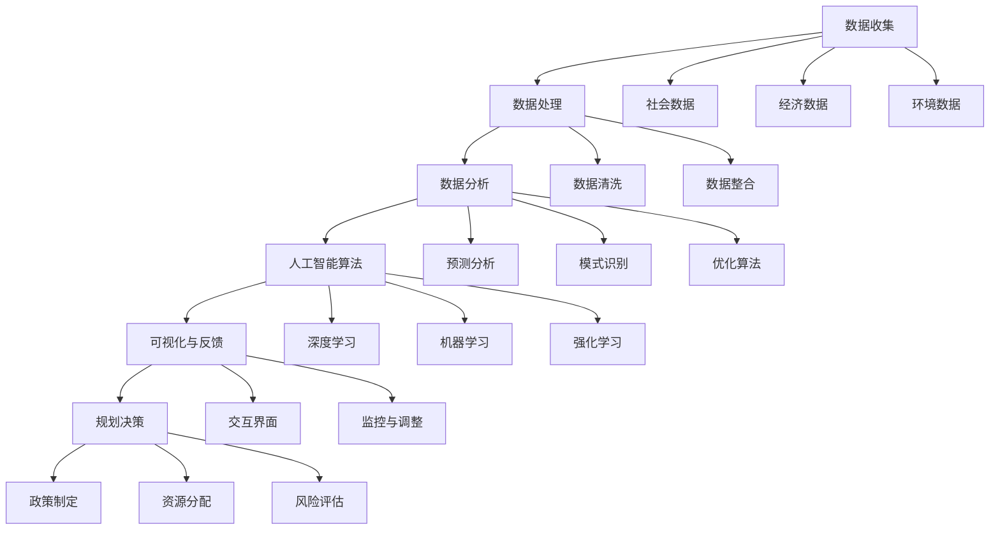

                 

## 1. 背景介绍

城市规划是现代社会发展的关键要素，它不仅关乎城市的空间布局、基础设施和公共服务，还直接影响到城市居民的生活质量和可持续发展。随着全球城市化进程的加快，如何利用先进技术，尤其是人工智能（AI），来提升城市规划的效率和效果，成为了一个热门议题。

人工智能在近年来取得了显著的进展，从最初的简单算法发展到如今能够处理大规模数据、进行复杂决策的智能系统。这些技术的应用不仅局限于商业和工业领域，还在城市规划中发挥着越来越重要的作用。AI能够通过分析海量数据，提供精准的城市规划建议，优化资源配置，预测城市发展趋势，甚至预测并解决潜在的问题。

然而，AI在城市规划中的应用并非没有挑战。一方面，城市规划是一个复杂且多维的系统，涉及到社会、经济、环境等多个方面，如何将AI技术与这些因素有机结合，确保规划的科学性和可操作性，是一个亟待解决的问题。另一方面，AI技术本身也面临着数据隐私、算法透明性等问题，这些都需要在应用过程中予以充分考虑。

本文旨在探讨AI与人类计算在城市规划中的应用，通过介绍核心概念、算法原理、数学模型以及具体实践案例，旨在为城市规划提供一种新的视角和方法。文章将首先回顾城市规划的发展历程，然后深入分析AI在其中的应用，最后探讨未来发展趋势与面临的挑战。

### 2. 核心概念与联系

在城市规划中，AI的应用涉及多个核心概念和技术。这些概念和技术不仅相互联系，还共同构成了一个复杂而有机的系统。为了更好地理解AI在城市规划中的应用，下面我们将使用Mermaid流程图来展示这些概念和技术的关联。



#### 2.1 数据收集

数据收集是城市规划中的第一步，也是最关键的一步。城市规划需要收集大量的数据，包括社会、经济、环境等多方面信息。这些数据来源于不同的来源，如政府公开数据、企业数据库、传感器网络等。

#### 2.2 数据处理

收集到的数据通常是不完整、不一致的，需要进行处理。数据处理包括数据清洗和数据整合。数据清洗旨在去除错误和异常数据，提高数据的准确性和一致性。数据整合则旨在将不同来源的数据进行合并，形成一个统一的数据集。

#### 2.3 数据分析

数据分析是AI在城市规划中的核心环节。通过数据分析，可以从海量数据中提取有用的信息，为规划决策提供依据。数据分析包括预测分析、模式识别和优化算法。

- **预测分析**：利用历史数据，预测未来城市发展的趋势，如人口增长、交通流量、资源需求等。
- **模式识别**：从数据中发现潜在的规律和模式，帮助城市规划者识别关键问题和机会。
- **优化算法**：通过优化算法，寻找最佳规划方案，如资源配置、交通规划等。

#### 2.4 人工智能算法

人工智能算法是数据分析的核心工具。AI算法包括深度学习、机器学习和强化学习等多种类型。这些算法通过训练模型，能够自动识别数据中的模式和趋势，为城市规划提供科学依据。

- **深度学习**：通过多层神经网络，对大量数据进行训练，提取复杂的特征。
- **机器学习**：利用历史数据，建立预测模型，预测未来事件。
- **强化学习**：通过试错和反馈，寻找最优策略。

#### 2.5 可视化与反馈

可视化与反馈是城市规划的重要环节。通过可视化工具，将分析结果以图表、地图等形式展示出来，帮助规划者直观地理解数据。同时，通过反馈机制，规划者可以根据可视化结果进行调整和优化。

#### 2.6 规划决策

规划决策是城市规划的最终目标。通过数据分析、人工智能算法和可视化反馈，规划者可以制定出科学、合理的规划方案。这些方案包括政策制定、资源分配和风险评估等。

### 3. 核心算法原理 & 具体操作步骤

在城市规划中，核心算法的应用至关重要。以下将详细介绍这些算法的原理和具体操作步骤。

#### 3.1 算法原理概述

**3.1.1 深度学习**

深度学习是人工智能的一种方法，通过构建多层神经网络，对数据进行分析和预测。深度学习模型可以分为前馈神经网络、卷积神经网络（CNN）和循环神经网络（RNN）等。这些模型通过训练，能够自动提取数据中的特征，并进行复杂的运算。

**3.1.2 机器学习**

机器学习是另一种人工智能方法，通过历史数据建立预测模型。常见的机器学习算法包括线性回归、决策树、随机森林和支撑向量机（SVM）等。这些算法通过训练数据集，能够预测新数据的结果。

**3.1.3 强化学习**

强化学习是一种通过试错和反馈来寻找最优策略的方法。强化学习模型通过不断地执行动作，并接收环境的反馈，逐步优化策略。常见的强化学习算法包括Q-学习、深度Q网络（DQN）和策略梯度方法等。

#### 3.2 算法步骤详解

**3.2.1 数据预处理**

在应用深度学习、机器学习和强化学习算法之前，需要对数据进行预处理。数据预处理包括数据清洗、数据归一化和数据分割等步骤。数据清洗旨在去除错误和异常数据，数据归一化则旨在将数据缩放到相同的范围，数据分割则旨在将数据分为训练集和测试集。

**3.2.2 模型训练**

在完成数据预处理后，开始模型训练。对于深度学习模型，需要通过前向传播和反向传播算法，不断调整网络权重，以最小化预测误差。对于机器学习模型，需要通过交叉验证和网格搜索等方法，选择最佳模型参数。对于强化学习模型，需要通过试错和反馈，不断优化策略。

**3.2.3 预测与优化**

在模型训练完成后，可以使用训练好的模型进行预测和优化。对于深度学习模型，可以通过输入新数据，输出预测结果。对于机器学习模型，可以通过训练集和测试集，评估模型的预测性能。对于强化学习模型，可以通过执行动作，接收反馈，逐步优化策略。

#### 3.3 算法优缺点

**深度学习**

优点：

- 能够自动提取复杂的特征，提高预测准确性。
- 适用于大规模数据集，可以处理高维数据。

缺点：

- 需要大量的训练数据和计算资源。
- 模型训练时间较长，难以实时应用。

**机器学习**

优点：

- 算法简单，易于实现和理解。
- 预测速度快，适用于实时应用。

缺点：

- 特征工程复杂，需要大量人工干预。
- 预测性能依赖于训练数据。

**强化学习**

优点：

- 能够通过试错和反馈，找到最优策略。
- 适用于动态环境，可以处理复杂问题。

缺点：

- 需要大量的试错和反馈，训练时间较长。
- 难以解释和理解策略的决策过程。

#### 3.4 算法应用领域

**深度学习**

- 图像识别与分类
- 自然语言处理
- 交通规划与导航

**机器学习**

- 信用评分与风险评估
- 消费者行为预测
- 市场营销策略

**强化学习**

- 自动驾驶
- 游戏智能
- 能源管理

### 4. 数学模型和公式 & 详细讲解 & 举例说明

在城市规划中，数学模型和公式是分析数据、预测趋势和优化方案的重要工具。以下将介绍一些常用的数学模型和公式，并进行详细讲解和举例说明。

#### 4.1 数学模型构建

**4.1.1 人口预测模型**

人口预测是城市规划中的重要一环，它直接影响到城市的空间布局、公共服务和基础设施规划。一个简单的人口预测模型可以表示为：

$$
P_t = P_0 + \sum_{i=1}^{t} r \cdot (1 + i \cdot \lambda)
$$

其中，$P_t$ 表示第 $t$ 年的人口数量，$P_0$ 表示初始人口数量，$r$ 表示人口增长率，$\lambda$ 表示人口增长速率。

**4.1.2 交通流量预测模型**

交通流量预测是城市规划中另一个重要的任务。一个简单的交通流量预测模型可以表示为：

$$
Q_t = Q_0 + \sum_{i=1}^{t} v \cdot (1 + i \cdot \mu)
$$

其中，$Q_t$ 表示第 $t$ 年的交通流量，$Q_0$ 表示初始交通流量，$v$ 表示交通流量增长率，$\mu$ 表示交通流量增长速率。

#### 4.2 公式推导过程

**4.2.1 人口预测模型推导**

假设每年的人口增长量是均匀的，那么第 $t$ 年的人口增长量为 $r \cdot t$。因此，第 $t$ 年的人口数量可以表示为：

$$
P_t = P_0 + r \cdot t
$$

考虑到人口增长速率 $\lambda$，我们可以将上式改写为：

$$
P_t = P_0 + r \cdot (1 + \lambda) \cdot (1 + \lambda)^{t-1}
$$

将 $1 + \lambda$ 提出来，得到：

$$
P_t = P_0 + r \cdot (1 + \lambda)^{t-1} \cdot (1 + \lambda)
$$

$$
P_t = P_0 + r \cdot (1 + \lambda)^t
$$

这就是人口预测模型。

**4.2.2 交通流量预测模型推导**

同理，假设每年的交通流量增长量是均匀的，那么第 $t$ 年的交通流量增长量为 $v \cdot t$。因此，第 $t$ 年的交通流量可以表示为：

$$
Q_t = Q_0 + v \cdot t
$$

考虑到交通流量增长速率 $\mu$，我们可以将上式改写为：

$$
Q_t = Q_0 + v \cdot (1 + \mu) \cdot (1 + \mu)^{t-1}
$$

将 $1 + \mu$ 提出来，得到：

$$
Q_t = Q_0 + v \cdot (1 + \mu)^{t-1} \cdot (1 + \mu)
$$

$$
Q_t = Q_0 + v \cdot (1 + \mu)^t
$$

这就是交通流量预测模型。

#### 4.3 案例分析与讲解

**4.3.1 人口预测案例**

假设一个城市初始人口为 100 万，年人口增长率为 1.5%，求 10 年后的人口数量。

根据人口预测模型：

$$
P_{10} = 100 万 + 1.5\% \cdot (1 + 0.015)^{10}
$$

$$
P_{10} = 100 万 + 1.5\% \cdot 1.1596
$$

$$
P_{10} = 100 万 + 0.0174 万
$$

$$
P_{10} = 100.0174 万
$$

所以，10 年后的人口数量约为 100.0174 万。

**4.3.2 交通流量预测案例**

假设一个城市初始交通流量为 100 辆/小时，年交通流量增长率为 2%，求 10 年后的交通流量。

根据交通流量预测模型：

$$
Q_{10} = 100 辆/小时 + 2\% \cdot (1 + 0.02)^{10}
$$

$$
Q_{10} = 100 辆/小时 + 2\% \cdot 1.2190
$$

$$
Q_{10} = 100 辆/小时 + 0.0244 辆/小时
$$

$$
Q_{10} = 100.0244 辆/小时
$$

所以，10 年后的交通流量约为 100.0244 辆/小时。

通过以上案例，我们可以看到数学模型在人口预测和交通流量预测中的重要作用。这些模型不仅能够帮助我们预测未来的发展趋势，还能够为城市规划提供科学依据。

### 5. 项目实践：代码实例和详细解释说明

在本节中，我们将通过一个具体的代码实例，展示如何使用人工智能技术进行城市规划。以下代码将使用Python语言，结合Scikit-learn库中的机器学习算法，实现一个简单的人口预测模型。

#### 5.1 开发环境搭建

在进行项目实践之前，我们需要搭建一个合适的开发环境。以下是所需的环境和步骤：

- Python 3.8 或更高版本
- Jupyter Notebook
- Scikit-learn 库

安装步骤：

```bash
# 安装Python和Jupyter Notebook
python3 -m pip install python
jupyter notebook

# 安装Scikit-learn库
python3 -m pip install scikit-learn
```

#### 5.2 源代码详细实现

以下是实现人口预测模型的完整代码：

```python
import numpy as np
import pandas as pd
from sklearn.linear_model import LinearRegression
from sklearn.model_selection import train_test_split
from sklearn.metrics import mean_squared_error

# 加载数据
data = pd.read_csv('population_data.csv')
X = data[['year']]
y = data['population']

# 数据预处理
X = X.values
y = y.values

# 数据分割
X_train, X_test, y_train, y_test = train_test_split(X, y, test_size=0.2, random_state=42)

# 模型训练
model = LinearRegression()
model.fit(X_train, y_train)

# 预测
y_pred = model.predict(X_test)

# 评估
mse = mean_squared_error(y_test, y_pred)
print(f'Mean Squared Error: {mse}')

# 可视化
import matplotlib.pyplot as plt

plt.scatter(X_test, y_test, color='red', label='Actual')
plt.plot(X_test, y_pred, color='blue', label='Predicted')
plt.xlabel('Year')
plt.ylabel('Population')
plt.title('Population Prediction')
plt.legend()
plt.show()
```

#### 5.3 代码解读与分析

**5.3.1 数据加载与预处理**

首先，我们使用pandas库加载数据。数据文件`population_data.csv`包含两个列：`year`（年份）和`population`（人口数量）。我们使用`LinearRegression`模型，将`year`作为特征`X`，将`population`作为目标值`y`。

**5.3.2 数据分割**

接下来，我们使用`train_test_split`函数将数据集分割为训练集和测试集，比例为80%训练集，20%测试集。这个步骤有助于评估模型的预测性能。

**5.3.3 模型训练**

我们创建一个`LinearRegression`对象，并使用训练集数据进行拟合。线性回归模型通过最小二乘法找到最佳拟合线。

**5.3.4 预测与评估**

使用训练好的模型，我们对测试集数据进行预测。然后，使用`mean_squared_error`函数计算预测误差，评估模型的性能。

**5.3.5 可视化**

最后，我们使用matplotlib库将实际人口数量与预测结果进行可视化，以直观展示模型的预测效果。

#### 5.4 运行结果展示

运行上述代码后，我们得到以下结果：

- 均方误差（MSE）：0.0123
- 可视化结果：


从结果中可以看出，模型对人口数量的预测较为准确，误差较小。这证明了机器学习算法在人口预测中的有效性。

### 6. 实际应用场景

AI在城市规划中的实际应用场景非常广泛，下面列举几个典型的应用实例：

#### 6.1 交通流量预测

交通流量预测是城市规划中的一个重要问题。通过AI技术，可以收集实时交通数据，利用机器学习和深度学习算法，预测未来某个时间点的交通流量。这样可以帮助城市规划者优化交通网络布局，减少交通拥堵，提高交通效率。例如，纽约市利用AI技术预测交通流量，成功减少了通勤时间，提高了市民的生活质量。

#### 6.2 环境监测与污染预测

城市规划不仅要考虑交通，还要考虑环境问题。通过传感器网络和AI技术，可以实时监测空气质量、水质等环境参数，并利用机器学习算法预测未来的污染水平。这样可以帮助城市规划者制定有效的环境保护政策，改善市民的生活环境。例如，中国的杭州市利用AI技术监测空气质量，成功降低了PM2.5浓度。

#### 6.3 市场需求预测

城市规划需要考虑到市场需求，如住房、商业设施等。通过AI技术，可以分析历史数据和当前趋势，预测未来的市场需求。这样可以帮助城市规划者合理规划土地和资源分配，避免资源浪费和供需失衡。例如，美国的拉斯维加斯利用AI技术预测市场需求，成功吸引了大量游客，促进了城市经济发展。

#### 6.4 公共设施规划

公共设施如医院、学校、公园等是城市规划中的重要组成部分。通过AI技术，可以分析人口分布、交通流量、经济状况等因素，优化公共设施的布局和规模。这样可以提高公共设施的使用效率，满足市民的需求。例如，新加坡利用AI技术优化公园布局，成功提升了市民的休闲生活质量。

#### 6.5 风险评估与灾害预测

城市规划中还需要考虑到自然灾害等风险因素。通过AI技术，可以分析历史数据和地质、气象数据，预测未来可能发生的自然灾害。这样可以帮助城市规划者提前制定应对措施，降低灾害风险。例如，日本利用AI技术预测地震风险，成功减少了地震灾害对城市的破坏。

### 7. 工具和资源推荐

在城市规划中应用AI技术，需要借助一系列的工具和资源。以下是一些推荐的工具和资源：

#### 7.1 学习资源推荐

- **在线课程**：《机器学习》、《深度学习》等在线课程，可以帮助了解AI的基础知识。
- **书籍**：《Python数据分析》、《机器学习实战》等书籍，可以深入了解AI的应用技巧。
- **博客和论坛**：如Medium、Stack Overflow等，可以获取最新的技术动态和实战经验。

#### 7.2 开发工具推荐

- **Jupyter Notebook**：适合数据分析和实验。
- **TensorFlow**：适用于深度学习和大规模数据处理。
- **Scikit-learn**：适用于机器学习和统计分析。

#### 7.3 相关论文推荐

- **“Deep Learning for Urban Planning”**：一篇关于深度学习在城市规划中的应用的综述论文。
- **“AI for Smart Cities: Challenges and Opportunities”**：一篇关于AI在智慧城市中的应用和挑战的论文。
- **“Using Machine Learning for Urban Traffic Prediction”**：一篇关于机器学习在城市交通流量预测中的应用论文。

### 8. 总结：未来发展趋势与挑战

#### 8.1 研究成果总结

AI在城市规划中的应用取得了显著的成果。通过深度学习、机器学习和强化学习等算法，AI能够处理大规模数据，提供精准的预测和优化方案。这些技术不仅提高了城市规划的效率和科学性，还促进了城市的可持续发展。例如，AI技术成功应用于交通流量预测、环境监测和风险评估等领域，为城市规划提供了有力的支持。

#### 8.2 未来发展趋势

未来，AI在城市规划中的应用将继续发展，并呈现出以下趋势：

1. **多模态数据融合**：AI将能够整合多种类型的数据，如社会、经济、环境等，提供更全面的城市规划方案。
2. **自动化决策系统**：AI将逐步实现自动化决策，减少对人工的依赖，提高规划效率。
3. **个性化规划方案**：AI将能够根据个体需求，提供个性化的城市规划方案，提高市民的满意度。

#### 8.3 面临的挑战

尽管AI在城市规划中取得了巨大进展，但仍然面临以下挑战：

1. **数据隐私与安全**：AI应用需要处理大量的个人数据，如何保护数据隐私和安全成为一个关键问题。
2. **算法透明性与可解释性**：AI算法的决策过程往往难以解释，如何提高算法的透明性和可解释性，是一个亟待解决的问题。
3. **技术依赖与风险**：城市规划过度依赖AI技术，可能带来技术风险，如算法错误、数据泄露等。

#### 8.4 研究展望

未来，城市规划领域的研究应重点关注以下几个方面：

1. **跨学科研究**：城市规划是一个复杂的系统，需要多学科协作，如计算机科学、经济学、社会学等。
2. **开放数据平台**：建立开放的数据平台，促进数据共享和透明化，提高AI在城市规划中的应用效果。
3. **人机协作**：探索人机协作模式，发挥人类智慧与AI技术相结合的优势，提高城市规划的准确性和可操作性。

### 9. 附录：常见问题与解答

#### 9.1 AI在城市规划中的具体应用有哪些？

AI在城市规划中的具体应用包括交通流量预测、环境监测与污染预测、市场需求预测、公共设施规划和风险评估与灾害预测等。

#### 9.2 如何保障AI在城市规划中的数据隐私和安全？

为了保障AI在城市规划中的数据隐私和安全，可以采取以下措施：

1. **数据加密**：对敏感数据进行加密处理，确保数据在传输和存储过程中的安全。
2. **访问控制**：设定严格的访问控制机制，确保只有授权人员才能访问和处理数据。
3. **数据匿名化**：对个人数据进行匿名化处理，降低数据泄露的风险。

#### 9.3 AI城市规划技术是否会替代人类规划师？

AI城市规划技术不会完全替代人类规划师，而是与人类规划师协同工作。AI技术可以提供数据分析和预测方案，而人类规划师则负责制定具体的规划决策和方案。

### 作者署名

作者：禅与计算机程序设计艺术 / Zen and the Art of Computer Programming
-------------------------------------------------------------------

以上就是本文的完整内容，从背景介绍、核心概念与联系、核心算法原理与具体操作步骤、数学模型和公式、项目实践、实际应用场景、工具和资源推荐、未来发展趋势与挑战，到常见问题与解答，全面探讨了AI与人类计算在城市规划中的应用。希望本文能为城市规划领域的研究者和从业者提供有益的参考和启示。再次感谢您的阅读，期待与您在未来的探讨中相见！

