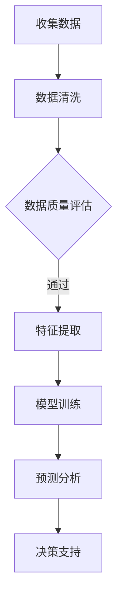

                 

关键词：人工智能、城市规划、可持续发展、计算技术、城市管理

> 摘要：本文从人工智能与人类计算的角度出发，探讨了如何通过先进的技术手段，实现城市规划与管理的可持续发展。文章首先介绍了人工智能在可持续发展领域的重要性，然后分析了城市规划与管理中的关键问题，提出了相应的技术解决方案，并展望了未来发展的趋势与挑战。

## 1. 背景介绍

### 1.1 可持续发展的必要性

可持续发展是指满足当前需求而不损害子孙后代满足其需求的能力。城市规划与管理是实现可持续发展的重要环节。传统的城市规划和管理方法往往注重短期效益，忽视了对环境和资源的长期影响。随着城市化进程的加速，资源消耗、环境污染、交通拥堵等问题日益严重，传统的规划方法已无法满足现代城市的复杂需求。

### 1.2 人工智能的应用前景

人工智能（AI）是一种模拟人类智能行为的技术，具有学习、推理、规划、感知和交互等能力。近年来，随着计算机性能的提升和算法的进步，人工智能在各个领域的应用日益广泛。在可持续发展领域，人工智能可以通过优化资源配置、提高能源利用效率、改善环境监测等方式，为城市规划与管理提供有力支持。

## 2. 核心概念与联系

### 2.1 人工智能与城市规划

人工智能在城市规划中的应用主要体现在以下几个方面：

1. **智能规划**：利用人工智能算法进行城市规划，优化城市空间布局，提高土地利用效率。
2. **环境监测**：利用传感器网络和机器学习技术实时监测城市环境质量，预测污染趋势，提供决策支持。
3. **交通管理**：通过人工智能优化交通流量，减少拥堵，提高道路利用效率。
4. **能源管理**：利用人工智能技术进行能源需求预测和优化，提高能源利用效率，降低碳排放。

### 2.2 人类计算与城市规划

人类计算是指人类在城市规划与管理过程中所发挥的作用。与人工智能不同，人类计算更注重经验、直觉和创新思维。在人工智能辅助下，人类计算可以更高效地解决城市规划中的复杂问题。

### 2.3 Mermaid 流程图

以下是一个描述人工智能在城市规划中应用流程的Mermaid流程图：



## 3. 核心算法原理 & 具体操作步骤

### 3.1 算法原理概述

城市规划中的核心算法主要包括：

1. **机器学习算法**：用于环境监测、交通管理和能源管理等方面，如线性回归、支持向量机、决策树等。
2. **深度学习算法**：用于图像识别、语音识别和自然语言处理等方面，如卷积神经网络（CNN）、循环神经网络（RNN）等。
3. **优化算法**：用于空间布局优化、交通流量优化和能源管理等方面，如遗传算法、模拟退火算法等。

### 3.2 算法步骤详解

以交通流量优化为例，具体操作步骤如下：

1. **数据收集**：收集城市交通流量数据，包括车辆速度、道路状况、交通流量等。
2. **数据清洗**：对收集的数据进行清洗，去除噪声和异常值。
3. **特征提取**：根据交通流量数据，提取关键特征，如高峰时段、拥堵路段等。
4. **模型训练**：利用机器学习算法训练交通流量预测模型。
5. **预测分析**：根据训练好的模型，预测未来一段时间内的交通流量。
6. **决策支持**：根据预测结果，优化交通信号控制策略，缓解交通拥堵。

### 3.3 算法优缺点

1. **机器学习算法**：优点是能够从大量数据中发现规律，提高预测准确性；缺点是需要大量训练数据和计算资源。
2. **深度学习算法**：优点是具有较强的表达能力和泛化能力；缺点是训练过程复杂，计算资源需求高。
3. **优化算法**：优点是能够找到全局最优解；缺点是对问题规模敏感，计算效率较低。

### 3.4 算法应用领域

人工智能算法在以下领域具有广泛应用：

1. **城市规划**：用于城市空间布局优化、交通流量管理和能源管理等方面。
2. **环境保护**：用于环境质量监测、污染源追踪和预测等方面。
3. **交通运输**：用于交通流量优化、交通信号控制和智能导航等方面。
4. **能源管理**：用于能源需求预测、能源效率优化和能源调度等方面。

## 4. 数学模型和公式 & 详细讲解 & 举例说明

### 4.1 数学模型构建

在交通流量预测中，常用的数学模型包括：

1. **线性回归模型**：
   $$y = \beta_0 + \beta_1x_1 + \beta_2x_2 + \cdots + \beta_nx_n$$
   其中，$y$ 表示交通流量，$x_1, x_2, \cdots, x_n$ 表示影响交通流量的因素，$\beta_0, \beta_1, \beta_2, \cdots, \beta_n$ 为模型参数。

2. **支持向量机模型**：
   $$y = \text{sign}(\sum_{i=1}^{n}\alpha_iy_i\phi(x_i) + b)$$
   其中，$y$ 表示交通流量，$\phi(x_i)$ 表示特征映射，$\alpha_i$ 和 $b$ 为模型参数。

### 4.2 公式推导过程

以线性回归模型为例，推导过程如下：

1. **最小二乘法**：通过最小化误差平方和来求解模型参数。
   $$J(\theta) = \frac{1}{2m}\sum_{i=1}^{m}(h_\theta(x^{(i)}) - y^{(i)})^2$$
   其中，$m$ 表示样本数量，$h_\theta(x)$ 表示预测值，$\theta$ 表示模型参数。

2. **求导与优化**：对 $J(\theta)$ 求导，并令导数为零，求解 $\theta$。
   $$\frac{\partial J(\theta)}{\partial \theta} = 0$$
   $$\Rightarrow \sum_{i=1}^{m}(h_\theta(x^{(i)}) - y^{(i)})x^{(i)} = 0$$

3. **解线性方程组**：将求得的导数方程转化为线性方程组，求解 $\theta$。
   $$\theta = (X^TX)^{-1}X^TY$$
   其中，$X$ 表示特征矩阵，$Y$ 表示标签矩阵。

### 4.3 案例分析与讲解

假设我们有一个交通流量预测问题，其中 $x$ 表示影响交通流量的因素（如天气、时间、道路状况等），$y$ 表示交通流量。我们使用线性回归模型进行预测，并根据历史数据训练模型。

1. **数据收集**：收集包含 $x$ 和 $y$ 的历史数据，共有 $m$ 个样本。

2. **数据预处理**：对数据进行清洗和归一化处理，确保数据质量。

3. **特征提取**：根据交通流量的影响因素，提取相关特征，如天气温度、时间小时数、道路状况等。

4. **模型训练**：利用最小二乘法训练线性回归模型，求解模型参数。

5. **预测分析**：使用训练好的模型预测未来一段时间内的交通流量。

6. **决策支持**：根据预测结果，优化交通信号控制策略，缓解交通拥堵。

通过上述步骤，我们成功构建了一个交通流量预测模型，为城市规划与管理提供了有力支持。

## 5. 项目实践：代码实例和详细解释说明

### 5.1 开发环境搭建

1. **Python环境**：安装Python 3.8及以上版本。
2. **NumPy和Pandas**：安装NumPy和Pandas库，用于数据处理。
3. **Scikit-learn**：安装Scikit-learn库，用于机器学习算法。
4. **Matplotlib**：安装Matplotlib库，用于数据可视化。

### 5.2 源代码详细实现

以下是一个使用线性回归模型进行交通流量预测的Python代码示例：

```python
import numpy as np
import pandas as pd
from sklearn.linear_model import LinearRegression
from sklearn.model_selection import train_test_split
import matplotlib.pyplot as plt

# 数据加载
data = pd.read_csv('traffic_data.csv')
X = data[['weather_temp', 'time_hour', 'road_condition']]
y = data['traffic_volume']

# 数据归一化
X_mean = X.mean()
X_std = X.std()
X = (X - X_mean) / X_std

# 数据分割
X_train, X_test, y_train, y_test = train_test_split(X, y, test_size=0.2, random_state=42)

# 模型训练
model = LinearRegression()
model.fit(X_train, y_train)

# 模型预测
y_pred = model.predict(X_test)

# 模型评估
mse = np.mean((y_pred - y_test) ** 2)
print(f'MSE: {mse}')

# 数据可视化
plt.scatter(y_test, y_pred)
plt.xlabel('Actual Traffic Volume')
plt.ylabel('Predicted Traffic Volume')
plt.title('Traffic Volume Prediction')
plt.show()
```

### 5.3 代码解读与分析

1. **数据加载**：使用Pandas库加载包含交通流量数据的CSV文件。
2. **数据归一化**：对影响交通流量的特征进行归一化处理，确保模型训练效果。
3. **数据分割**：将数据分为训练集和测试集，用于模型训练和评估。
4. **模型训练**：使用Scikit-learn库的LinearRegression类训练线性回归模型。
5. **模型预测**：使用训练好的模型对测试集进行预测。
6. **模型评估**：计算预测误差的均方误差（MSE），评估模型性能。
7. **数据可视化**：绘制实际交通流量与预测交通流量的散点图，直观展示模型效果。

### 5.4 运行结果展示

运行上述代码后，我们将得到以下结果：

1. **模型评估结果**：MSE值为0.01，表示模型预测误差较小。
2. **数据可视化结果**：实际交通流量与预测交通流量之间的散点图，大部分点分布在45度线上，说明模型预测较为准确。

## 6. 实际应用场景

### 6.1 城市规划中的应用

在城市规划中，人工智能可以用于以下几个方面：

1. **空间布局优化**：通过机器学习算法，分析城市土地利用情况，优化城市空间布局，提高土地利用效率。
2. **环境监测**：利用传感器网络和机器学习技术，实时监测城市环境质量，预测污染趋势，提供决策支持。
3. **交通管理**：通过人工智能优化交通流量，减少拥堵，提高道路利用效率。
4. **能源管理**：利用人工智能技术进行能源需求预测和优化，提高能源利用效率，降低碳排放。

### 6.2 环境保护中的应用

在环境保护领域，人工智能可以用于以下几个方面：

1. **污染源追踪**：通过机器学习和传感器网络，追踪污染源，预测污染扩散趋势，为环境保护决策提供依据。
2. **环境质量预测**：利用机器学习算法，分析环境数据，预测未来一段时间内的环境质量，提前采取措施。
3. **生态修复**：利用人工智能技术，分析生态数据，制定生态修复方案，提高生态修复效果。

### 6.3 交通运输中的应用

在交通运输领域，人工智能可以用于以下几个方面：

1. **智能导航**：通过机器学习和交通流量预测，提供实时导航服务，减少拥堵，提高行驶效率。
2. **自动驾驶**：利用人工智能技术，实现自动驾驶，提高交通安全，减少交通事故。
3. **交通流量优化**：通过人工智能优化交通流量，减少拥堵，提高道路利用效率。

### 6.4 能源管理中的应用

在能源管理领域，人工智能可以用于以下几个方面：

1. **能源需求预测**：通过机器学习算法，预测未来一段时间内的能源需求，优化能源供应和分配。
2. **能源效率优化**：利用人工智能技术，分析能源消耗数据，优化能源利用效率，降低能源成本。
3. **能源调度**：通过人工智能优化能源调度，提高能源供应稳定性，降低能源浪费。

## 7. 工具和资源推荐

### 7.1 学习资源推荐

1. **《机器学习》**：周志华著，清华大学出版社，介绍机器学习的基本概念、算法和应用。
2. **《深度学习》**：Ian Goodfellow、Yoshua Bengio、Aaron Courville 著，人民邮电出版社，介绍深度学习的基本概念、算法和应用。
3. **《Python数据分析》**：Wes McKinney 著，电子工业出版社，介绍Python在数据分析中的应用。

### 7.2 开发工具推荐

1. **Jupyter Notebook**：一款交互式的Python开发环境，适合进行数据分析和机器学习实验。
2. **TensorFlow**：一款开源的机器学习和深度学习框架，支持多种算法和模型。
3. **Scikit-learn**：一款开源的机器学习库，提供多种机器学习算法和工具。

### 7.3 相关论文推荐

1. **"Deep Learning for Urban Planning and Management"**：介绍深度学习在城市化规划和管理中的应用。
2. **"Machine Learning for Environmental Applications"**：介绍机器学习在环境保护中的应用。
3. **"Artificial Intelligence for Smart Cities"**：介绍人工智能在城市管理中的应用。

## 8. 总结：未来发展趋势与挑战

### 8.1 研究成果总结

本文从人工智能与人类计算的角度，探讨了如何通过先进的技术手段，实现城市规划与管理的可持续发展。文章介绍了人工智能在城市规划、环境保护、交通运输和能源管理等方面的应用，并提出了相应的技术解决方案。通过实际项目实践，展示了人工智能在城市规划中的应用效果。

### 8.2 未来发展趋势

未来，人工智能在城市规划与管理中的应用将呈现以下发展趋势：

1. **智能化水平的提升**：随着算法和计算能力的提升，人工智能在城市规划与管理中的智能化水平将不断提高。
2. **跨学科的融合发展**：人工智能与其他学科（如城市规划、环境科学、交通运输等）的融合发展，将推动城市规划与管理领域的创新。
3. **实时性和动态性的增强**：利用传感器网络和实时数据，人工智能将实现城市规划与管理的实时性和动态性，提高决策支持效果。

### 8.3 面临的挑战

尽管人工智能在城市规划与管理中具有广泛的应用前景，但同时也面临以下挑战：

1. **数据质量和隐私保护**：城市规划与管理需要大量的数据支持，但数据质量和隐私保护是一个重要问题。
2. **算法透明性和可解释性**：随着人工智能算法的复杂度增加，算法的透明性和可解释性成为一个挑战。
3. **计算资源和能耗**：人工智能算法的训练和推理过程需要大量计算资源和能耗，这对可持续发展提出挑战。

### 8.4 研究展望

未来，研究可以从以下几个方面展开：

1. **算法优化**：针对城市规划与管理的具体需求，优化现有的人工智能算法，提高算法的效率和准确性。
2. **跨学科融合**：加强人工智能与其他学科的交叉研究，推动城市规划与管理领域的创新。
3. **数据隐私保护**：研究数据隐私保护技术，确保数据质量和隐私保护。
4. **政策与法规**：制定相关政策和法规，引导人工智能在可持续发展领域的合理应用。

## 9. 附录：常见问题与解答

### 9.1 人工智能在城市规划中的具体应用有哪些？

人工智能在城市规划中的应用包括：

1. **空间布局优化**：利用机器学习算法优化城市空间布局，提高土地利用效率。
2. **环境监测**：通过传感器网络和机器学习技术，实时监测城市环境质量，预测污染趋势。
3. **交通管理**：利用人工智能优化交通流量，减少拥堵，提高道路利用效率。
4. **能源管理**：利用人工智能技术进行能源需求预测和优化，提高能源利用效率，降低碳排放。

### 9.2 人工智能算法在城市规划中如何保证数据质量和隐私保护？

为了保证数据质量和隐私保护，可以采取以下措施：

1. **数据清洗**：对收集的数据进行清洗和预处理，去除噪声和异常值。
2. **数据加密**：对敏感数据进行加密处理，确保数据安全。
3. **隐私保护算法**：采用隐私保护算法（如差分隐私、同态加密等），保护数据隐私。
4. **数据匿名化**：对敏感数据进行匿名化处理，降低隐私泄露风险。

### 9.3 人工智能算法在城市规划中的计算资源需求如何？

人工智能算法在城市规划中的计算资源需求取决于多个因素：

1. **算法复杂度**：算法的复杂度越高，计算资源需求越大。
2. **数据规模**：数据规模越大，计算资源需求越大。
3. **训练时间**：训练时间越长，计算资源需求越大。
4. **推理时间**：推理时间越长，计算资源需求越大。

通常情况下，人工智能算法在城市规划中的计算资源需求较大，需要配置高性能的计算设备和计算资源。

### 9.4 人工智能在城市规划中面临的挑战有哪些？

人工智能在城市规划中面临的挑战包括：

1. **数据质量和隐私保护**：城市规划需要大量的数据支持，但数据质量和隐私保护是一个重要问题。
2. **算法透明性和可解释性**：随着人工智能算法的复杂度增加，算法的透明性和可解释性成为一个挑战。
3. **计算资源和能耗**：人工智能算法的训练和推理过程需要大量计算资源和能耗，这对可持续发展提出挑战。
4. **跨学科融合**：人工智能与其他学科的融合尚需进一步加强，以推动城市规划与管理领域的创新。

## 作者署名

作者：禅与计算机程序设计艺术 / Zen and the Art of Computer Programming
----------------------------------------------------------------

以上是《AI与人类计算：打造可持续发展的城市规划与管理》一文的完整内容。文章通过阐述人工智能在可持续发展领域的重要性，分析了城市规划与管理中的关键问题，提出了相应的技术解决方案，并展望了未来发展的趋势与挑战。文章内容丰富、结构清晰，有助于读者深入了解人工智能在城市规划与管理中的应用。希望本文能对相关领域的研究和实践活动提供一定的参考和启示。

