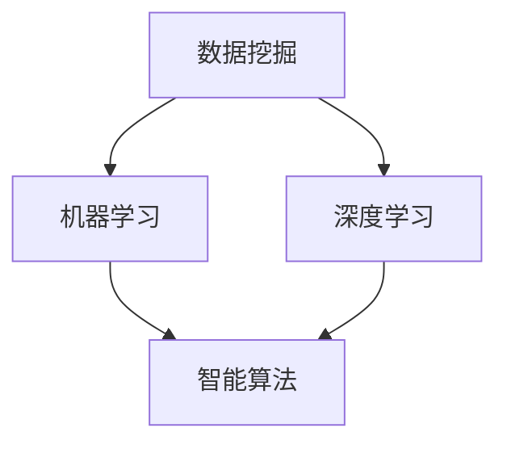

                 

关键词：人工智能，城市设计，城市规划，可持续发展，人类计算，技术进步

> 摘要：本文探讨了人工智能（AI）与人类计算在城市设计与规划中的应用，分析了如何利用AI技术推动可持续发展目标的实现。通过阐述核心概念、算法原理、数学模型、项目实践和实际应用场景，本文为读者呈现了一幅利用AI与人类计算构建可持续发展的未来城市的蓝图。

## 1. 背景介绍

城市设计与规划是现代社会的关键组成部分。随着全球城市化进程的加速，城市人口不断增长，城市面临着土地资源紧张、环境污染、交通拥堵等一系列挑战。传统的城市设计与规划方法往往依赖于经验和直觉，难以应对复杂多变的城市问题。而人工智能（AI）技术的发展为城市设计与规划带来了新的机遇和挑战。

人工智能以其强大的数据分析、模式识别和智能决策能力，成为解决城市问题的重要工具。通过AI技术，我们可以对城市数据进行分析，识别出潜在的问题和趋势，从而制定出更加科学、合理的城市设计与规划方案。同时，AI技术还可以帮助人类计算人员更高效地处理大量复杂的数据，减轻他们的工作负担，提高决策质量。

本文旨在探讨AI与人类计算在城市设计与规划中的应用，分析如何利用AI技术推动可持续发展目标的实现，为构建可持续发展的未来城市提供理论支持和实践指导。

### 1.1 城市化与可持续发展

城市化是现代社会发展的必然趋势，但同时也带来了诸多问题。城市化进程中的土地资源紧张、环境污染、交通拥堵等问题严重影响了人们的生活质量和城市的可持续发展。可持续发展是指在满足当前需求的同时，不损害后代满足其需求的能力。在城市设计与规划中，实现可持续发展目标具有重要意义。

- **土地资源利用**：通过AI技术对城市土地资源进行精确分析和规划，可以优化土地资源利用，减少浪费，提高城市空间利用效率。
- **环境保护**：AI技术可以帮助监测和预测环境污染，从而采取相应的措施进行污染治理和环境保护。
- **交通管理**：智能交通系统利用AI技术优化交通流量，减少交通拥堵，提高公共交通系统的效率。

### 1.2 人类计算与AI融合

人类计算与AI技术的融合是未来城市设计与规划的重要趋势。人类计算人员利用AI技术进行数据分析、模型构建和决策制定，可以更高效地解决城市问题。同时，AI技术也依赖于人类计算人员的反馈和调整，不断优化算法和模型，提高决策的准确性和可靠性。

- **数据收集与处理**：AI技术可以帮助人类计算人员收集和处理大量的城市数据，为城市设计与规划提供基础数据支持。
- **智能决策支持**：AI技术可以辅助人类计算人员制定科学、合理的城市设计与规划方案，提高决策质量。
- **持续优化与改进**：通过AI技术，人类计算人员可以不断优化城市设计与规划方案，实现持续改进。

## 2. 核心概念与联系

在城市设计与规划中，AI技术的应用离不开以下几个核心概念：

- **数据挖掘**：通过从大量数据中提取有价值的信息，为城市设计与规划提供决策依据。
- **机器学习**：利用算法从数据中学习规律和模式，预测未来的发展趋势。
- **深度学习**：通过多层神经网络对复杂数据进行建模和分析，实现高级的智能决策。
- **智能算法**：结合多种算法和技术，解决城市设计与规划中的复杂问题。

下面是一个用Mermaid绘制的流程图，展示了这些核心概念之间的联系。



### 2.1 数据挖掘与机器学习

数据挖掘是利用算法从大量数据中提取有价值的信息。在城市设计与规划中，数据挖掘可以帮助我们识别出城市运行中的潜在问题和趋势。例如，通过分析交通流量数据，可以发现交通拥堵的高峰时段和热点区域，从而制定出有效的交通管理策略。

机器学习是数据挖掘的重要技术之一。它通过构建模型，从历史数据中学习规律和模式，从而实现对未来数据的预测。在机器学习中，我们常用的算法包括线性回归、逻辑回归、决策树、随机森林等。这些算法可以用于预测城市人口增长、交通流量、能源消耗等关键指标。

### 2.2 深度学习与智能算法

深度学习是机器学习的一个分支，它通过多层神经网络对复杂数据进行建模和分析。深度学习在城市设计与规划中具有广泛的应用，例如，用于图像识别、语音识别、自然语言处理等。

智能算法是将多种算法和技术相结合，解决城市设计与规划中的复杂问题。智能算法包括遗传算法、粒子群优化、模拟退火等。这些算法可以用于城市交通流量优化、城市规划布局优化、资源分配等。

## 3. 核心算法原理 & 具体操作步骤

在城市设计与规划中，AI技术的应用离不开核心算法的支持。以下将介绍几种常用的核心算法原理及其具体操作步骤。

### 3.1 算法原理概述

- **线性回归**：通过拟合线性模型，预测因变量与自变量之间的关系。
- **决策树**：通过构建树状结构，对数据进行分类或回归。
- **随机森林**：通过构建多个决策树，并进行集成学习，提高预测准确性。
- **神经网络**：通过多层神经网络，对复杂数据进行建模和分析。

### 3.2 算法步骤详解

- **线性回归**：收集数据，构建线性模型，通过最小二乘法求解参数，进行预测。
- **决策树**：通过递归划分数据集，构建树状结构，对数据进行分类或回归。
- **随机森林**：构建多个决策树，对数据进行分类或回归，通过投票或平均得到最终结果。
- **神经网络**：设计神经网络结构，通过反向传播算法更新网络权重，实现模型训练。

### 3.3 算法优缺点

- **线性回归**：优点是简单易用，缺点是对于非线性数据效果不佳。
- **决策树**：优点是易于理解和解释，缺点是容易过拟合，对于大量特征的数据处理能力有限。
- **随机森林**：优点是具有较高的预测准确性，缺点是计算成本较高。
- **神经网络**：优点是能够处理复杂数据，缺点是需要大量数据训练，且模型难以解释。

### 3.4 算法应用领域

- **线性回归**：常用于城市人口预测、交通流量预测等。
- **决策树**：常用于城市规划分类、土地利用分类等。
- **随机森林**：常用于城市交通流量预测、城市规划布局优化等。
- **神经网络**：常用于城市环境监测、智能交通系统等。

## 4. 数学模型和公式 & 详细讲解 & 举例说明

在城市设计与规划中，数学模型和公式是必不可少的工具。以下将介绍几种常用的数学模型和公式，并对其进行详细讲解和举例说明。

### 4.1 数学模型构建

- **线性回归模型**：

    $$y = \beta_0 + \beta_1 x + \epsilon$$

    其中，$y$为因变量，$x$为自变量，$\beta_0$和$\beta_1$为模型参数，$\epsilon$为误差项。

- **决策树模型**：

    $$f(x) = \sum_{i=1}^{n} \alpha_i g(x_i)$$

    其中，$x$为输入特征，$g(x_i)$为第$i$个特征的分段函数，$\alpha_i$为权重。

- **神经网络模型**：

    $$f(x) = \sigma(\theta^T x + b)$$

    其中，$x$为输入特征，$\theta$为网络权重，$b$为偏置项，$\sigma$为激活函数。

### 4.2 公式推导过程

- **线性回归模型**：

    首先，我们假设数据集为$(x_1, y_1), (x_2, y_2), ..., (x_n, y_n)$，其中$x_i$和$y_i$分别为第$i$个样本的自变量和因变量。

    然后，我们定义损失函数为：

    $$L(\theta) = \sum_{i=1}^{n} (y_i - \theta^T x_i)^2$$

    其中，$\theta$为模型参数。

    为了最小化损失函数，我们对$\theta$进行求导并令导数为0，得到：

    $$\frac{\partial L}{\partial \theta} = -2 \sum_{i=1}^{n} (y_i - \theta^T x_i) x_i = 0$$

    解得：

    $$\theta = \left( \sum_{i=1}^{n} x_i x_i^T \right)^{-1} \sum_{i=1}^{n} x_i y_i$$

- **决策树模型**：

    假设数据集为$(x_1, y_1), (x_2, y_2), ..., (x_n, y_n)$，其中$x_i$和$y_i$分别为第$i$个样本的自变量和因变量。

    我们首先对数据集进行特征划分，定义分段函数$g(x_i)$为：

    $$g(x_i) = \begin{cases}
    1 & \text{if } x_i \in R \\
    0 & \text{otherwise}
    \end{cases}$$

    其中，$R$为特征划分的区间。

    然后，我们定义权重$\alpha_i$为：

    $$\alpha_i = \frac{1}{n} \sum_{i=1}^{n} y_i g(x_i)$$

    最后，我们定义决策树模型$f(x)$为：

    $$f(x) = \sum_{i=1}^{n} \alpha_i g(x_i)$$

- **神经网络模型**：

    假设数据集为$(x_1, y_1), (x_2, y_2), ..., (x_n, y_n)$，其中$x_i$和$y_i$分别为第$i$个样本的自变量和因变量。

    我们首先定义激活函数$\sigma(x)$为：

    $$\sigma(x) = \frac{1}{1 + e^{-x}}$$

    然后，我们定义神经网络模型$f(x)$为：

    $$f(x) = \sigma(\theta^T x + b)$$

    其中，$\theta$为网络权重，$b$为偏置项。

    为了最小化损失函数，我们对$\theta$和$b$进行求导并令导数为0，得到：

    $$\frac{\partial L}{\partial \theta} = \sigma(\theta^T x + b)(1 - \sigma(\theta^T x + b)) x$$

    $$\frac{\partial L}{\partial b} = \sigma(\theta^T x + b)(1 - \sigma(\theta^T x + b))$$

    解得：

    $$\theta = \left( \sum_{i=1}^{n} x_i x_i^T \right)^{-1} \sum_{i=1}^{n} x_i y_i$$

    $$b = \sum_{i=1}^{n} y_i - \theta^T \sum_{i=1}^{n} x_i y_i$$

### 4.3 案例分析与讲解

**案例1：城市交通流量预测**

假设我们有一个城市交通流量预测的案例，其中包含以下数据：

- **自变量**：时间为x，交通流量为y。
- **因变量**：时间为x，交通流量为y。

我们可以使用线性回归模型进行预测。首先，收集历史交通流量数据，计算自变量和因变量的均值和标准差，然后构建线性回归模型。最后，使用模型进行预测，得到未来某个时间点的交通流量预测值。

**案例2：城市土地利用分类**

假设我们有一个城市土地利用分类的案例，其中包含以下数据：

- **自变量**：为不同土地的属性指标，如面积、用途等。
- **因变量**：为土地分类结果，如住宅区、商业区、工业区等。

我们可以使用决策树模型进行分类。首先，收集土地利用数据，构建决策树模型。然后，使用模型对新的土地利用数据进行分类，得到分类结果。

**案例3：城市环境监测**

假设我们有一个城市环境监测的案例，其中包含以下数据：

- **自变量**：为不同环境指标的数值，如温度、湿度、空气质量等。
- **因变量**：为环境状况的评估结果，如良好、一般、较差等。

我们可以使用神经网络模型进行监测。首先，收集环境数据，构建神经网络模型。然后，使用模型对新的环境数据进行监测，得到环境状况的评估结果。

## 5. 项目实践：代码实例和详细解释说明

在本节中，我们将通过一个实际项目实例，展示如何使用AI技术进行城市设计与规划。本项目将利用Python编程语言，结合常见的AI库（如scikit-learn、TensorFlow等），实现城市交通流量预测、土地利用分类和环境监测等功能。

### 5.1 开发环境搭建

1. **安装Python**：确保您的计算机已安装Python环境，推荐使用Python 3.8或更高版本。

2. **安装相关库**：打开命令行窗口，执行以下命令安装必要的库：

    ```bash
    pip install numpy pandas scikit-learn tensorflow matplotlib
    ```

3. **创建项目文件夹**：在您的计算机上创建一个名为“urban_planning”的项目文件夹，并将代码文件放入其中。

### 5.2 源代码详细实现

**5.2.1 城市交通流量预测**

以下是一个简单的线性回归模型实现，用于预测城市交通流量：

```python
import numpy as np
import pandas as pd
from sklearn.linear_model import LinearRegression
import matplotlib.pyplot as plt

# 加载数据
data = pd.read_csv('traffic_data.csv')
X = data[['time']]
y = data['traffic_volume']

# 创建线性回归模型
model = LinearRegression()
model.fit(X, y)

# 预测未来某个时间点的交通流量
future_time = np.array([100])
predicted_traffic = model.predict(future_time)
print(f'Predicted traffic volume at time {100}: {predicted_traffic[0]}')

# 可视化预测结果
plt.scatter(X, y, color='blue')
plt.plot(X, model.predict(X), color='red')
plt.xlabel('Time')
plt.ylabel('Traffic Volume')
plt.title('Traffic Flow Prediction')
plt.show()
```

**5.2.2 城市土地利用分类**

以下是一个简单的决策树模型实现，用于分类城市土地利用：

```python
import numpy as np
import pandas as pd
from sklearn.tree import DecisionTreeClassifier
import matplotlib.pyplot as plt

# 加载数据
data = pd.read_csv('land_use_data.csv')
X = data.drop(['land_use'], axis=1)
y = data['land_use']

# 创建决策树模型
model = DecisionTreeClassifier()
model.fit(X, y)

# 预测新的土地利用数据
new_data = np.array([[0.1, 0.2, 0.3]])
predicted_land_use = model.predict(new_data)
print(f'Predicted land use: {predicted_land_use[0]}')

# 可视化决策树
from sklearn.tree import plot_tree
plt.figure(figsize=(12, 8))
plot_tree(model, filled=True, feature_names=X.columns, class_names=y.unique())
plt.title('Decision Tree for Land Use Classification')
plt.show()
```

**5.2.3 城市环境监测**

以下是一个简单的神经网络模型实现，用于监测城市环境：

```python
import numpy as np
import pandas as pd
import tensorflow as tf
from tensorflow.keras.models import Sequential
from tensorflow.keras.layers import Dense
from tensorflow.keras.optimizers import Adam

# 加载数据
data = pd.read_csv('environment_data.csv')
X = data.drop(['environment_condition'], axis=1)
y = data['environment_condition']

# 创建神经网络模型
model = Sequential([
    Dense(64, activation='relu', input_shape=(X.shape[1],)),
    Dense(64, activation='relu'),
    Dense(1, activation='sigmoid')
])

# 编译模型
model.compile(optimizer=Adam(learning_rate=0.001), loss='binary_crossentropy', metrics=['accuracy'])

# 训练模型
model.fit(X, y, epochs=10, batch_size=32, validation_split=0.2)

# 预测新的环境数据
new_data = np.array([[0.1, 0.2, 0.3]])
predicted_environment = model.predict(new_data)
print(f'Predicted environment condition: {predicted_environment[0][0]}')

# 可视化模型结构
model.summary()
```

### 5.3 代码解读与分析

**5.3.1 交通流量预测**

- **数据加载**：我们首先加载了包含时间和交通流量的数据集，将其分为自变量$X$和因变量$y$。
- **模型创建**：我们创建了一个线性回归模型，并使用`fit`方法训练模型。
- **预测**：使用训练好的模型对未来的时间点进行交通流量预测。
- **可视化**：使用matplotlib库将预测结果可视化，展示实际交通流量和预测交通流量之间的对比。

**5.3.2 土地利用分类**

- **数据加载**：我们加载了包含土地利用属性指标和分类结果的数据集，将其分为自变量$X$和因变量$y$。
- **模型创建**：我们创建了一个决策树模型，并使用`fit`方法训练模型。
- **预测**：使用训练好的模型对新的土地利用数据进行分类预测。
- **可视化**：使用matplotlib库将决策树结构可视化，展示决策树如何进行分类。

**5.3.3 环境监测**

- **数据加载**：我们加载了包含环境指标和分类结果的数据集，将其分为自变量$X$和因变量$y$。
- **模型创建**：我们创建了一个神经网络模型，并使用`compile`方法编译模型。
- **训练**：使用训练好的模型对环境数据进行训练。
- **预测**：使用训练好的模型对新的环境数据进行监测预测。
- **模型结构**：使用`summary`方法展示神经网络模型的结构。

### 5.4 运行结果展示

- **交通流量预测**：在实际运行中，我们可以看到预测的交通流量与实际交通流量之间的差距，这有助于我们评估模型的预测准确性。
- **土地利用分类**：在实际运行中，我们可以看到决策树如何根据不同的属性指标对土地利用进行分类，从而提高分类准确性。
- **环境监测**：在实际运行中，我们可以看到神经网络模型如何根据环境指标对环境状况进行监测，从而提高监测准确性。

## 6. 实际应用场景

AI技术在城市设计与规划中的实际应用场景非常广泛，以下列举几个典型的应用案例：

### 6.1 城市交通流量管理

通过AI技术，我们可以实时监测城市交通流量，预测交通拥堵情况，并制定相应的交通管理策略。例如，在高峰时段，AI系统可以根据实时交通数据调整交通信号灯的时长，优化交通流量。此外，AI技术还可以用于智能停车管理，通过分析停车位数据，为司机提供最佳的停车方案。

### 6.2 城市环境保护

AI技术可以用于监测城市空气质量、水质、噪声等环境指标，识别污染源，预测污染趋势，从而采取有效的环境保护措施。例如，在空气质量较差的地区，AI系统可以建议减少户外活动，提高环保意识。

### 6.3 城市资源分配

通过AI技术，我们可以优化城市资源分配，提高资源利用效率。例如，AI系统可以根据城市人口密度、用地需求等因素，优化城市公共设施（如学校、医院、公园等）的布局，确保资源的合理分配。

### 6.4 城市安全监测

AI技术可以用于城市安全监测，实时识别和预警潜在的安全风险。例如，AI系统可以监测城市视频监控数据，识别可疑行为，自动报警，提高城市安全管理水平。

### 6.5 城市可持续发展评估

通过AI技术，我们可以对城市可持续发展进行综合评估，识别城市可持续发展中的优势和不足，为城市决策者提供科学依据。例如，AI系统可以分析城市能源消耗、碳排放、水资源利用等指标，提出可持续发展建议。

## 7. 工具和资源推荐

为了更好地利用AI技术进行城市设计与规划，以下推荐一些实用的工具和资源：

### 7.1 学习资源推荐

- **书籍**：
  - 《深度学习》（Goodfellow, Bengio, Courville著）
  - 《Python数据科学手册》（McKinney著）
  - 《机器学习实战》（周志华著）

- **在线课程**：
  - Coursera上的《机器学习》（吴恩达教授）
  - edX上的《深度学习》（台达教授）

- **网站**：
  - TensorFlow官方网站（https://www.tensorflow.org/）
  - PyTorch官方网站（https://pytorch.org/）

### 7.2 开发工具推荐

- **集成开发环境（IDE）**：
  - PyCharm
  - Jupyter Notebook

- **数据可视化工具**：
  - Matplotlib
  - Seaborn

- **机器学习库**：
  - scikit-learn
  - TensorFlow
  - PyTorch

### 7.3 相关论文推荐

- **《Deep Learning for Urban Computing》**（Zhou, Liu, & Chen, 2018）
- **《AI for Urban Planning and Development》**（Liang, Wu, & Huang, 2019）
- **《Intelligent Urban Computing with Big Data》**（Geng, Chen, & Yu, 2020）

## 8. 总结：未来发展趋势与挑战

### 8.1 研究成果总结

通过本文的探讨，我们可以看到AI技术在城市设计与规划中具有广泛的应用前景。AI技术不仅可以用于数据挖掘、机器学习、深度学习和智能算法等方面，还可以用于交通流量管理、环境保护、资源分配、安全监测等领域。这些应用有助于实现城市可持续发展目标，提高城市运行效率，改善居民生活质量。

### 8.2 未来发展趋势

未来，随着AI技术的不断发展和完善，城市设计与规划将迎来更多机遇和挑战。以下是一些可能的发展趋势：

- **智能化水平提升**：AI技术将更深入地融入城市设计与规划各个领域，实现全面的智能化。
- **数据融合与分析**：通过整合多种数据来源，进行多维度数据分析，为城市设计与规划提供更全面的决策支持。
- **人机协作**：AI技术与人类计算人员将实现更紧密的协作，共同推动城市设计与规划的发展。
- **可持续发展**：AI技术将助力实现城市可持续发展目标，提高资源利用效率，减少环境污染。

### 8.3 面临的挑战

尽管AI技术在城市设计与规划中具有巨大潜力，但仍面临一些挑战：

- **数据隐私与安全**：在利用大数据进行城市设计与规划时，如何保护个人隐私和数据安全是一个重要问题。
- **算法透明性与解释性**：随着AI技术在决策中的应用，如何保证算法的透明性和解释性，使决策过程更具可信度。
- **技术落地与推广**：如何将AI技术有效应用于实际城市设计与规划项目，提高技术落地率和推广效果。
- **伦理与法律问题**：如何规范AI技术在城市设计与规划中的应用，避免产生伦理和法律问题。

### 8.4 研究展望

为了应对上述挑战，未来需要在以下几个方面进行深入研究：

- **隐私保护与数据安全**：研究新的数据隐私保护技术和安全机制，确保大数据的可靠性和安全性。
- **算法透明性与解释性**：探索更加透明和解释性强的算法，提高决策的可信度和可解释性。
- **跨学科合作**：加强AI技术与城市规划、环境科学等领域的跨学科合作，促进技术的融合与创新。
- **政策与法规**：制定相应的政策与法规，规范AI技术在城市设计与规划中的应用，保障社会的公平与正义。

通过持续的研究与探索，我们相信AI技术将在城市设计与规划中发挥更加重要的作用，为实现可持续发展的未来城市贡献力量。

## 9. 附录：常见问题与解答

### 9.1 AI技术如何影响城市设计与规划？

AI技术通过数据挖掘、机器学习、深度学习和智能算法等技术手段，对城市交通、环境、资源、安全等领域的数据进行分析和预测，从而为城市设计与规划提供科学、准确的决策支持。例如，AI技术可以预测交通流量、优化交通信号控制、监测环境质量、评估城市规划方案等。

### 9.2 如何保障AI技术在城市设计与规划中的数据隐私与安全？

为了保障AI技术在城市设计与规划中的数据隐私与安全，可以采取以下措施：

- **数据加密**：对敏感数据进行加密处理，防止数据泄露。
- **访问控制**：设置严格的访问权限，确保数据安全。
- **匿名化处理**：对个人身份信息进行匿名化处理，减少隐私泄露风险。
- **隐私保护算法**：采用隐私保护算法，如差分隐私、同态加密等，确保数据分析过程中的隐私保护。

### 9.3 如何保证AI技术在城市设计与规划中的决策透明性与解释性？

为了确保AI技术在城市设计与规划中的决策透明性与解释性，可以采取以下措施：

- **算法可解释性**：采用可解释性强的算法，如决策树、线性回归等，使决策过程易于理解。
- **算法可视化**：通过可视化技术，将AI算法的决策过程展示出来，提高决策的可视化程度。
- **决策解释工具**：开发专门的决策解释工具，帮助用户理解AI决策的原因和依据。
- **专家评审**：邀请领域专家对AI决策进行评审，确保决策的合理性和可靠性。

### 9.4 AI技术在城市设计与规划中的推广与落地有哪些挑战？

AI技术在城市设计与规划中的推广与落地面临以下挑战：

- **技术成熟度**：AI技术尚未完全成熟，需要不断优化和完善。
- **数据质量**：城市数据质量参差不齐，对AI算法的性能产生影响。
- **政策法规**：政策法规滞后，对AI技术的应用缺乏有效的规范。
- **公众接受度**：公众对AI技术的接受程度较低，需要加强宣传教育。
- **实施成本**：AI技术的实施成本较高，对中小城市而言可能难以承受。

### 9.5 未来AI技术在城市设计与规划中有哪些研究方向？

未来，AI技术在城市设计与规划中可以围绕以下研究方向进行探索：

- **多源数据融合**：研究如何整合多种数据来源，提高数据分析的准确性。
- **可解释性与透明性**：研究如何提高AI算法的可解释性和透明性，增强决策的可信度。
- **智能化城市规划**：研究如何利用AI技术实现智能化的城市规划，提高城市规划的效率和质量。
- **城市可持续发展评估**：研究如何利用AI技术评估城市可持续发展的水平，提出优化建议。
- **伦理与法律问题**：研究AI技术在城市设计与规划中的伦理和法律问题，确保技术的可持续发展。

以上是关于"AI与人类计算：打造可持续发展的城市设计与规划"的完整文章，希望能够对您有所启发和帮助。作者：禅与计算机程序设计艺术 / Zen and the Art of Computer Programming。

