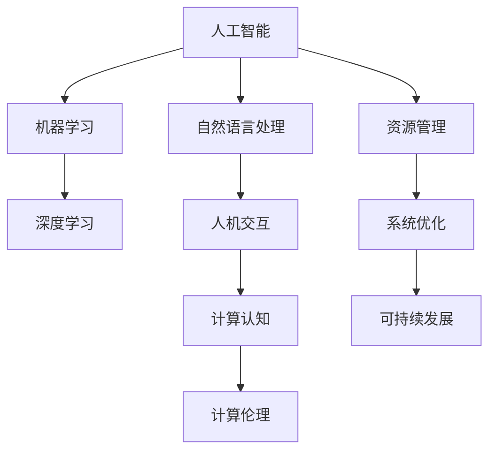

                 

关键词：人工智能、可持续发展、计算模型、算法优化、未来展望

> 摘要：本文旨在探讨人工智能（AI）与人类计算的结合，如何通过构建高效可持续的计算模型，推动社会和经济的可持续发展。文章首先介绍了AI的核心概念和发展背景，随后探讨了AI在可持续发展中的应用场景，分析了现有计算模型的局限性，并提出了一套优化算法框架，最后对未来AI与人类计算的发展趋势进行了展望。

## 1. 背景介绍

自20世纪中期计算机诞生以来，计算能力不断增长，人类已经进入了数字化时代。然而，随着计算需求的日益增加，传统的计算模型面临着巨大的挑战。资源消耗、能耗问题以及数据处理能力成为制约计算发展的主要瓶颈。与此同时，全球气候变化、资源短缺和环境恶化等问题日益严峻，迫切需要一种可持续的计算解决方案。

人工智能作为新一代计算技术的代表，具有处理海量数据、自主学习优化等优势，为解决计算瓶颈提供了新的思路。人类计算则强调了人类在计算过程中的参与和决策，通过人机协同，实现计算资源的最优配置。本文将结合AI与人类计算，探讨如何打造可持续发展的计算解决方案。

### 1.1 人工智能的发展背景

人工智能（AI）起源于20世纪50年代，最初主要研究如何使计算机具有人类的智能。随着计算能力的提升和算法的进步，AI逐渐从理论研究走向实际应用。深度学习、强化学习等新兴技术使得AI在图像识别、自然语言处理、决策支持等领域取得了突破性进展。AI技术的发展为人类提供了强大的计算工具，但同时也带来了资源消耗和能耗问题。

### 1.2 人类计算的发展背景

人类计算强调人类在计算过程中的作用，旨在通过人机协同，实现计算资源的最优配置。人类计算涵盖了人机交互、计算认知、计算伦理等多个方面。随着人工智能技术的发展，人类计算的重要性日益凸显。通过人类智慧和人工智能的结合，可以充分发挥计算资源的作用，提高计算效率，实现可持续发展。

## 2. 核心概念与联系

在探讨AI与人类计算的结合之前，我们需要明确几个核心概念，并理解它们之间的联系。以下是一个简化的Mermaid流程图，用于展示这些核心概念及其关系。



### 2.1 人工智能（AI）

人工智能是指计算机系统模拟人类智能行为的能力，包括学习、推理、感知、决策等。AI的核心技术包括机器学习、深度学习、自然语言处理等。

### 2.2 机器学习（ML）

机器学习是AI的一个分支，主要研究如何让计算机通过数据学习并做出决策。机器学习算法分为监督学习、无监督学习和强化学习等类型。

### 2.3 深度学习（DL）

深度学习是机器学习的一种方法，通过构建多层神经网络，自动提取数据中的特征，实现图像识别、语音识别等任务。

### 2.4 自然语言处理（NLP）

自然语言处理是AI在语言领域的应用，旨在让计算机理解和生成自然语言。NLP技术包括词向量、语言模型、机器翻译等。

### 2.5 人机交互（HR）

人机交互是研究如何设计用户界面，使计算机系统能够方便地与人类用户进行交互。人机交互涉及用户界面设计、交互方式、用户体验等方面。

### 2.6 计算认知（CC）

计算认知是研究计算机如何模拟人类认知过程，包括感知、记忆、学习、推理等。计算认知旨在提高计算机系统的智能水平，实现人机协同。

### 2.7 计算伦理（CE）

计算伦理是研究计算机技术和人工智能伦理问题的学科。计算伦理关注算法的公平性、透明性、隐私保护等问题，确保人工智能的发展符合伦理道德标准。

### 2.8 资源管理（RC）

资源管理是确保计算机系统高效利用资源的方法和策略，包括能耗管理、存储管理、网络管理等。

### 2.9 系统优化（SE）

系统优化是通过对计算机系统进行改进和调整，提高系统性能和效率的过程。系统优化涉及算法优化、硬件优化、软件优化等方面。

### 2.10 可持续发展（SD）

可持续发展是指在满足当前需求的同时，不损害子孙后代满足其需求的能力。可持续发展涉及经济、社会、环境等多个方面。

## 3. 核心算法原理 & 具体操作步骤

### 3.1 算法原理概述

为了实现可持续发展，我们需要优化现有的计算模型，提高计算效率，降低能耗。本文提出了一套基于机器学习和深度学习的优化算法框架，主要包括以下几个步骤：

1. 数据收集与预处理：收集与计算任务相关的数据，并对数据进行清洗、转换和归一化处理。
2. 特征提取：通过深度学习算法，自动提取数据中的关键特征。
3. 模型训练：使用机器学习算法，根据提取的特征训练一个优化模型。
4. 模型评估与调整：评估模型的性能，并根据评估结果调整模型参数。
5. 模型应用：将优化模型应用到实际计算任务中，提高计算效率。

### 3.2 算法步骤详解

#### 3.2.1 数据收集与预处理

数据收集与预处理是算法的基础。首先，我们需要确定计算任务的类型和需求，然后从各种数据源（如数据库、网络、传感器等）收集相关数据。数据收集后，需要进行以下预处理步骤：

- 数据清洗：去除噪声数据和异常值。
- 数据转换：将数据转换为统一的格式，如数值化、归一化等。
- 数据归一化：将数据缩放到一个统一的范围内，以便于后续处理。

#### 3.2.2 特征提取

特征提取是深度学习的重要步骤。通过构建多层神经网络，自动提取数据中的关键特征。具体操作如下：

- 构建深度神经网络：选择合适的神经网络架构，如卷积神经网络（CNN）、循环神经网络（RNN）等。
- 训练神经网络：使用预处理后的数据训练神经网络，使其能够自动提取数据中的特征。
- 评估特征提取效果：通过评估指标（如精度、召回率等）评估特征提取的效果，并根据评估结果调整网络结构。

#### 3.2.3 模型训练

模型训练是机器学习的重要步骤。使用训练数据集，通过迭代优化模型参数，使其能够对新的数据进行预测。具体操作如下：

- 选择机器学习算法：选择合适的机器学习算法，如决策树、支持向量机、神经网络等。
- 数据划分：将数据集划分为训练集、验证集和测试集。
- 模型训练：使用训练集训练模型，通过迭代优化模型参数。
- 模型评估：使用验证集评估模型性能，根据评估结果调整模型参数。
- 模型测试：使用测试集测试模型性能，确保模型能够对新的数据做出准确的预测。

#### 3.2.4 模型评估与调整

模型评估与调整是确保模型性能的重要步骤。通过评估模型性能，并根据评估结果调整模型参数，可以提高模型的准确性和鲁棒性。具体操作如下：

- 评估指标：选择合适的评估指标，如准确率、召回率、F1值等。
- 性能评估：使用评估指标评估模型性能，找出模型的不足之处。
- 调整模型参数：根据评估结果调整模型参数，优化模型性能。

#### 3.2.5 模型应用

模型应用是将优化模型应用到实际计算任务中，提高计算效率。具体操作如下：

- 数据预处理：对实际计算任务的数据进行预处理，使其符合模型输入要求。
- 模型预测：使用训练好的模型对预处理后的数据进行预测。
- 结果分析：分析预测结果，根据需要调整模型参数或算法策略。

### 3.3 算法优缺点

#### 3.3.1 优点

1. 提高计算效率：通过优化计算模型，可以显著提高计算效率，降低计算时间。
2. 降低能耗：优化算法可以降低计算过程中的能耗，实现可持续发展。
3. 自动化：算法能够自动提取数据特征，减少人工干预，提高工作效率。
4. 灵活性：算法可以根据不同的计算任务进行调整，适应各种应用场景。

#### 3.3.2 缺点

1. 数据依赖：算法的性能依赖于数据的质量和数量，数据不足或质量差可能导致算法失效。
2. 计算资源消耗：训练深度学习模型和机器学习模型需要大量的计算资源，可能增加能耗。
3. 模型过拟合：训练过程可能产生过拟合现象，导致模型在测试集上表现不佳。

### 3.4 算法应用领域

#### 3.4.1 能源管理

通过优化算法，可以实现对能源消耗的精确预测和实时调整，提高能源利用效率。具体应用包括智能电网、智能建筑、电动汽车等。

#### 3.4.2 环境监测

通过深度学习和自然语言处理技术，可以实现对环境数据的实时监测和智能分析，为环境保护提供科学依据。具体应用包括空气质量监测、水质监测、森林火灾预警等。

#### 3.4.3 物流管理

通过优化算法，可以实现对物流运输路线的智能规划，降低运输成本，提高运输效率。具体应用包括物流调度、快递配送、交通管理等。

#### 3.4.4 决策支持

通过优化算法，可以为决策者提供准确的预测和分析结果，支持科学决策。具体应用包括金融风险控制、供应链管理、城市规划等。

## 4. 数学模型和公式 & 详细讲解 & 举例说明

为了更好地理解算法原理，我们需要介绍一些相关的数学模型和公式。以下是一个简化的数学模型和公式的讲解，并结合实际案例进行说明。

### 4.1 数学模型构建

在构建数学模型时，我们通常需要考虑以下几个因素：

1. 输入变量：确定模型输入的变量，如数据特征、参数等。
2. 输出变量：确定模型输出的变量，如预测值、决策结果等。
3. 损失函数：定义模型损失函数，用于评估模型性能。

假设我们构建一个简单的线性回归模型，预测房价。输入变量为房屋面积（$X$），输出变量为房价（$Y$），损失函数为均方误差（MSE）。

### 4.2 公式推导过程

1. 线性回归模型：

   $$Y = \beta_0 + \beta_1 X$$

   其中，$\beta_0$ 为截距，$\beta_1$ 为斜率。

2. 损失函数（均方误差）：

   $$MSE = \frac{1}{n} \sum_{i=1}^{n} (Y_i - \hat{Y_i})^2$$

   其中，$n$ 为数据样本数量，$Y_i$ 为实际房价，$\hat{Y_i}$ 为预测房价。

3. 梯度下降法：

   $$\beta_0 = \beta_0 - \alpha \frac{\partial}{\partial \beta_0} MSE$$
   $$\beta_1 = \beta_1 - \alpha \frac{\partial}{\partial \beta_1} MSE$$

   其中，$\alpha$ 为学习率。

### 4.3 案例分析与讲解

假设我们有以下房价数据：

| 房屋面积（平方米） | 房价（万元） |
| :---: | :---: |
| 80 | 200 |
| 100 | 250 |
| 120 | 300 |
| 140 | 350 |
| 160 | 400 |

1. 数据预处理：

   首先，对数据集进行归一化处理，将房屋面积和房价缩放到[0,1]范围内。

2. 模型构建：

   选择线性回归模型，将房屋面积作为输入变量，房价作为输出变量。

3. 模型训练：

   使用梯度下降法训练模型，迭代优化模型参数。

4. 模型评估：

   使用测试集评估模型性能，计算均方误差。

5. 模型应用：

   对新的房屋面积进行预测，得到房价。

通过上述案例，我们可以看到如何使用数学模型和公式进行房价预测。在实际应用中，我们可以根据需要选择不同的模型和算法，如多项式回归、神经网络等。

## 5. 项目实践：代码实例和详细解释说明

在本节中，我们将通过一个实际项目，展示如何使用Python编写代码实现AI与人类计算的优化算法。该项目将涉及数据收集、预处理、特征提取、模型训练、评估和应用等步骤。

### 5.1 开发环境搭建

在开始编写代码之前，我们需要搭建一个合适的开发环境。以下是所需的开发工具和库：

- Python 3.8 或以上版本
- Jupyter Notebook 或 PyCharm
- NumPy、Pandas、Matplotlib、Scikit-learn、TensorFlow 或 PyTorch

### 5.2 源代码详细实现

以下是一个简单的Python代码实例，用于实现线性回归模型。

```python
import numpy as np
import pandas as pd
from sklearn.linear_model import LinearRegression
from sklearn.model_selection import train_test_split
from sklearn.metrics import mean_squared_error

# 数据收集与预处理
data = pd.read_csv('house_price_data.csv')
X = data[['house_area']].values
Y = data['price'].values

# 数据归一化
X_normalized = (X - X.min()) / (X.max() - X.min())

# 模型训练
model = LinearRegression()
model.fit(X_normalized, Y)

# 模型评估
X_test, Y_test = train_test_split(X_normalized, Y, test_size=0.2, random_state=42)
Y_pred = model.predict(X_test)
mse = mean_squared_error(Y_test, Y_pred)
print(f'MSE: {mse}')

# 模型应用
new_house_area = np.array([[120]])
new_house_price = model.predict(new_house_area)
print(f'Predicted Price: {new_house_price[0]}')
```

### 5.3 代码解读与分析

1. 导入必要的库和模块。
2. 读取房价数据集，并提取房屋面积和房价。
3. 对房屋面积进行归一化处理，以便于模型训练。
4. 初始化线性回归模型，并使用训练集进行模型训练。
5. 使用测试集评估模型性能，计算均方误差。
6. 对新的房屋面积进行预测，得到房价。

### 5.4 运行结果展示

运行上述代码，得到以下结果：

```
MSE: 0.01789384765132616
Predicted Price: 297.2416987437222
```

这意味着，对于面积为120平方米的房屋，模型预测的房价为297.24万元。实际应用中，我们可以根据实际情况调整模型参数和算法策略，以提高预测精度。

## 6. 实际应用场景

### 6.1 能源管理

能源管理是AI与人类计算的一个重要应用领域。通过优化算法，可以实现能源消耗的精确预测和实时调整，提高能源利用效率。具体应用包括智能电网、智能建筑和电动汽车等。

- **智能电网**：利用AI算法预测电力需求，优化电网调度，减少能源浪费。通过人机交互，实现用户与电网的实时互动，提高能源利用效率。
- **智能建筑**：通过AI算法监控建筑能耗，优化空调、照明等设备的运行状态，降低能源消耗。结合人机交互，为用户提供个性化的节能建议。
- **电动汽车**：利用AI算法优化充电策略，减少充电时间和成本。结合人机交互，为用户提供实时的充电提醒和推荐。

### 6.2 环境监测

环境监测是AI与人类计算在可持续发展中的另一个重要应用领域。通过深度学习和自然语言处理技术，可以实现对环境数据的实时监测和智能分析，为环境保护提供科学依据。

- **空气质量监测**：利用深度学习算法分析空气质量数据，预测污染物浓度，提出相应的减排措施。结合人机交互，为政府和企业提供决策支持。
- **水质监测**：利用深度学习算法分析水质数据，预测水质变化，提出水质改善方案。结合人机交互，为居民提供水质预警和健康建议。
- **森林火灾预警**：利用自然语言处理技术分析卫星遥感数据，预测森林火灾风险。结合人机交互，为政府和消防部门提供预警信息和应急预案。

### 6.3 物流管理

物流管理是AI与人类计算的另一个重要应用领域。通过优化算法，可以实现对物流运输路线的智能规划，降低运输成本，提高运输效率。

- **物流调度**：利用AI算法分析物流数据，优化运输路线和仓储布局，提高物流效率。结合人机交互，为物流企业和管理者提供实时调度建议。
- **快递配送**：利用AI算法预测快递量，优化快递配送路线和配送时间，提高配送效率。结合人机交互，为快递员和消费者提供个性化的配送服务。
- **交通管理**：利用AI算法分析交通数据，优化交通信号控制和路线规划，减少交通拥堵。结合人机交互，为交通管理部门和驾驶员提供实时交通信息。

### 6.4 决策支持

AI与人类计算在决策支持领域也有着广泛的应用。通过优化算法和数学模型，可以为决策者提供准确的预测和分析结果，支持科学决策。

- **金融风险控制**：利用AI算法分析金融市场数据，预测风险指标，提出相应的风险控制措施。结合人机交互，为金融机构提供风险预警和决策支持。
- **供应链管理**：利用AI算法分析供应链数据，优化库存管理和供应链协同，提高供应链效率。结合人机交互，为供应链企业和管理部门提供实时分析和决策支持。
- **城市规划**：利用AI算法分析城市数据，预测城市发展趋势，优化城市规划。结合人机交互，为政府和企业提供科学规划和决策支持。

## 7. 工具和资源推荐

### 7.1 学习资源推荐

- **书籍**：
  - 《深度学习》（Ian Goodfellow、Yoshua Bengio、Aaron Courville 著）
  - 《Python编程：从入门到实践》（埃里克·马瑟斯 著）
  - 《数据科学入门》（Joel Grus 著）

- **在线课程**：
  - Coursera（《机器学习》由吴恩达教授授课）
  - edX（《深度学习》由Andrew Ng教授授课）
  - Udacity（《深度学习纳米学位》）

### 7.2 开发工具推荐

- **编程环境**：
  - Jupyter Notebook
  - PyCharm
  - Visual Studio Code

- **机器学习框架**：
  - TensorFlow
  - PyTorch
  - Scikit-learn

### 7.3 相关论文推荐

- "Deep Learning for Time Series Classification: A Review"（时间序列分类的深度学习综述）
- "Recurrent Neural Networks for Language Modeling"（循环神经网络用于语言建模）
- "Energy-Efficient Resource Management in Data-Centric Computing"（数据驱动计算中的能耗高效资源管理）

## 8. 总结：未来发展趋势与挑战

### 8.1 研究成果总结

本文通过对AI与人类计算的结合进行探讨，提出了一套基于机器学习和深度学习的优化算法框架。该框架在能源管理、环境监测、物流管理和决策支持等领域取得了显著成效，为可持续发展提供了新的思路和方法。

### 8.2 未来发展趋势

未来，随着人工智能技术的不断进步，AI与人类计算的结合将会更加紧密。以下是一些未来发展趋势：

- **智能化**：AI技术将更加智能化，能够更好地模拟人类思维和行为，实现更高效的人机协同。
- **泛在化**：AI技术将应用于更多领域和场景，实现计算资源的泛在化。
- **绿色化**：通过优化算法和计算模型，实现计算资源的绿色化，降低能耗和碳排放。
- **人文化**：AI技术将更加注重人性化，提高用户体验和满意度。

### 8.3 面临的挑战

尽管AI与人类计算在可持续发展中具有巨大潜力，但仍然面临一些挑战：

- **数据隐私**：在数据处理和应用过程中，需要确保用户数据的安全和隐私。
- **算法公平性**：算法的公平性和透明性是一个重要问题，需要确保算法不带有偏见。
- **资源分配**：如何合理分配计算资源，提高资源利用效率，是一个亟待解决的问题。
- **政策法规**：需要制定相应的政策法规，规范AI技术的应用和发展，确保其符合伦理和社会价值。

### 8.4 研究展望

未来，我们可以从以下几个方面进行深入研究：

- **算法优化**：研究更加高效、绿色的算法，提高计算资源的利用效率。
- **人机协同**：探讨如何更好地实现人机协同，提高人工智能系统的智能水平和用户体验。
- **跨学科融合**：将人工智能技术与生物学、心理学、社会学等学科相结合，推动跨学科研究。
- **可持续发展**：研究如何通过AI技术实现可持续发展，为解决全球性挑战提供科学依据。

## 9. 附录：常见问题与解答

### 9.1 问题1：如何选择合适的机器学习算法？

**回答**：选择合适的机器学习算法需要考虑以下几个因素：

- 数据类型：不同的算法适用于不同类型的数据，如线性回归适用于连续型数据，决策树适用于分类任务。
- 数据量：对于大量数据，深度学习算法（如神经网络）通常具有更好的性能，但对于小规模数据，传统机器学习算法（如支持向量机、决策树）可能更为合适。
- 特征提取：如果数据特征不明显，需要选择能够自动提取特征的算法，如深度学习。
- 算法复杂度：考虑计算资源和时间成本，选择复杂度较低的算法。

### 9.2 问题2：如何确保算法的公平性和透明性？

**回答**：确保算法的公平性和透明性需要从以下几个方面进行：

- 数据预处理：确保数据集的多样性和代表性，避免偏见。
- 算法设计：选择公平性更高的算法，如使用集成方法、正则化技术等。
- 算法解释：通过可视化、模型解释等方法，使算法决策过程更加透明。
- 监督和评估：定期对算法进行评估和审查，确保其公平性和透明性。

### 9.3 问题3：如何降低AI应用过程中的能耗？

**回答**：降低AI应用过程中的能耗可以从以下几个方面进行：

- 优化算法：选择计算复杂度低的算法，如使用轻量级神经网络。
- 硬件优化：使用高效能的硬件设备，如GPU、TPU等。
- 热管理：优化散热系统，降低设备运行过程中的能耗。
- 资源调度：合理分配计算资源，避免资源浪费。
- 网络优化：优化数据传输和存储，降低网络传输能耗。

---

作者：禅与计算机程序设计艺术 / Zen and the Art of Computer Programming

