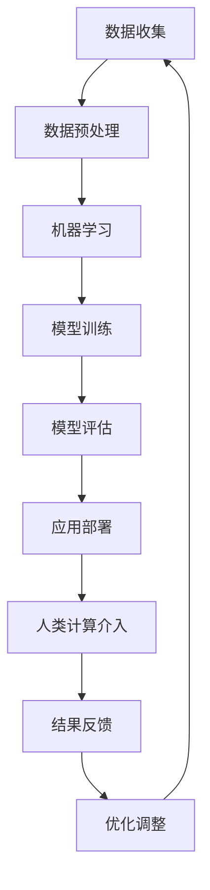

                 

关键词：人工智能，可持续城市，人类计算，未来城市，技术发展

摘要：本文将探讨人工智能与人类计算在打造可持续的未来城市中的关键作用。我们将分析人工智能技术的核心概念、算法原理、数学模型，并通过实例展示其在实际应用中的优势与挑战。此外，我们将讨论未来城市的发展趋势、工具资源推荐，并总结研究展望。

## 1. 背景介绍

随着全球城市化进程的不断加快，城市面临着诸多挑战，如资源短缺、环境污染、交通拥堵、社会不公等。传统的城市管理和规划方法已无法满足日益增长的需求，因此，探索新的解决方案变得至关重要。人工智能（AI）作为一种先进的技术，具备强大的数据处理和分析能力，能够为城市管理和规划提供有力支持。与此同时，人类计算作为一种以人为本的计算方式，强调人类与机器的协同作用，能够更好地理解和应对城市复杂问题。

本文旨在探讨人工智能与人类计算在打造可持续的未来城市中的角色和作用，分析其在城市规划和管理的应用，并展望未来城市的发展趋势。

## 2. 核心概念与联系

### 2.1 人工智能的核心概念

人工智能是一种模拟人类智能的技术，其核心概念包括机器学习、深度学习、自然语言处理、计算机视觉等。机器学习是使计算机通过数据学习并获得知识的一种方法，主要包括监督学习、无监督学习和强化学习。深度学习则是机器学习的一种子领域，通过神经网络模型实现对复杂数据的自动特征提取和模式识别。自然语言处理和计算机视觉则分别关注处理人类语言和图像数据的任务。

### 2.2 人类计算的核心概念

人类计算是一种以人为本的计算方式，强调人类与机器的协同作用。它包括数据可视化、认知计算、人机交互、人工智能伦理等方面。数据可视化是将复杂的数据以直观的方式展示给用户，使其更好地理解和分析数据。认知计算则是模拟人类认知过程，使计算机能够更好地理解和处理人类知识。人机交互是研究如何使人类与计算机之间实现高效、自然的交互。人工智能伦理则是探讨人工智能在发展过程中所面临的社会、道德和伦理问题。

### 2.3 Mermaid 流程图

以下是人工智能与人类计算在打造可持续的未来城市中的流程图：



## 3. 核心算法原理 & 具体操作步骤

### 3.1 算法原理概述

在打造可持续的未来城市中，人工智能算法的应用主要包括以下三个方面：

1. **智能交通管理**：通过机器学习算法对交通流量进行分析，预测交通拥堵，优化交通信号控制，提高交通效率。

2. **环境监测与治理**：利用计算机视觉技术对空气质量、水质等环境参数进行实时监测，并采用深度学习算法进行预测和预警。

3. **城市规划与优化**：通过大数据分析，结合机器学习算法，对城市人口、资源、交通等数据进行综合评估，为城市规划提供科学依据。

### 3.2 算法步骤详解

#### 3.2.1 智能交通管理

1. 数据收集：收集城市交通流量数据，包括车辆数量、车速、道路密度等。

2. 数据预处理：对收集到的数据进行清洗、去噪，确保数据质量。

3. 机器学习模型训练：选择合适的机器学习算法，如决策树、支持向量机等，对交通流量数据进行模型训练。

4. 模型评估：通过交叉验证等方法对模型进行评估，确保模型具有良好的预测能力。

5. 应用部署：将训练好的模型部署到交通信号控制系统，实现实时交通流量预测和优化。

#### 3.2.2 环境监测与治理

1. 数据收集：收集空气质量、水质等环境参数的数据。

2. 数据预处理：对收集到的数据进行清洗、去噪，确保数据质量。

3. 深度学习模型训练：选择合适的深度学习算法，如卷积神经网络、循环神经网络等，对环境参数数据进行模型训练。

4. 模型评估：通过交叉验证等方法对模型进行评估，确保模型具有良好的预测能力。

5. 应用部署：将训练好的模型部署到环境监测系统中，实现实时环境参数预测和预警。

#### 3.2.3 城市规划与优化

1. 数据收集：收集城市人口、资源、交通等数据。

2. 数据预处理：对收集到的数据进行清洗、去噪，确保数据质量。

3. 大数据分析：采用大数据分析技术，对城市数据进行分析，提取关键信息。

4. 机器学习模型训练：选择合适的机器学习算法，如决策树、支持向量机等，对城市数据进行模型训练。

5. 模型评估：通过交叉验证等方法对模型进行评估，确保模型具有良好的预测能力。

6. 应用部署：将训练好的模型部署到城市规划系统中，为城市规划提供科学依据。

### 3.3 算法优缺点

#### 3.3.1 优点

1. 提高城市效率：通过人工智能算法，可以实现交通流量优化、环境监测与治理、城市规划与优化，提高城市运行效率。

2. 降低成本：人工智能算法可以自动化处理大量数据，减少人力成本。

3. 提高决策准确性：人工智能算法可以基于数据进行分析和预测，提高决策准确性。

#### 3.3.2 缺点

1. 数据依赖：人工智能算法依赖于大量数据，数据质量对算法效果有重要影响。

2. 隐私问题：人工智能算法在处理数据时，可能涉及用户隐私，需要确保数据安全。

3. 伦理问题：人工智能算法在发展过程中，可能面临伦理道德问题，需要制定相应的法律法规。

### 3.4 算法应用领域

人工智能算法在打造可持续的未来城市中具有广泛的应用领域，主要包括：

1. 智能交通：通过人工智能算法优化交通信号控制，提高交通效率。

2. 智能环境：通过人工智能算法实时监测环境参数，预警环境污染。

3. 智能规划：通过人工智能算法分析城市数据，为城市规划提供科学依据。

4. 智能安防：通过人工智能算法实时监测城市安全，预警犯罪事件。

## 4. 数学模型和公式 & 详细讲解 & 举例说明

### 4.1 数学模型构建

在打造可持续的未来城市中，常见的数学模型包括线性回归模型、逻辑回归模型、决策树模型等。以下是这些模型的构建过程和公式。

#### 4.1.1 线性回归模型

线性回归模型是一种简单的数学模型，用于分析自变量和因变量之间的关系。其公式如下：

$$
y = \beta_0 + \beta_1x
$$

其中，$y$ 是因变量，$x$ 是自变量，$\beta_0$ 是截距，$\beta_1$ 是斜率。

#### 4.1.2 逻辑回归模型

逻辑回归模型是一种分类模型，用于分析自变量对因变量的影响，并将结果分类为两个类别。其公式如下：

$$
\ln\left(\frac{p}{1-p}\right) = \beta_0 + \beta_1x
$$

其中，$p$ 是事件发生的概率，$\beta_0$ 是截距，$\beta_1$ 是斜率。

#### 4.1.3 决策树模型

决策树模型是一种基于树形结构的分类模型，用于分析自变量和因变量之间的关系。其公式如下：

$$
f(x) = \sum_{i=1}^{n}\beta_i g_i(x)
$$

其中，$f(x)$ 是决策函数，$g_i(x)$ 是第 $i$ 个条件的阈值函数，$\beta_i$ 是条件概率。

### 4.2 公式推导过程

以下是对逻辑回归模型公式的推导过程：

首先，定义事件 $A$ 的概率为 $P(A)$，则事件 $A$ 的互补事件 $A'$ 的概率为 $P(A') = 1 - P(A)$。

根据全概率公式，有：

$$
P(A) = P(A|A')P(A') + P(A|A)P(A)
$$

由于 $P(A') = 1 - P(A)$，将其代入上式，得：

$$
P(A) = (1 - P(A))P(A') + P(A)P(A)
$$

化简得：

$$
2P(A) = 1
$$

解得：

$$
P(A) = \frac{1}{2}
$$

同理，可以得到：

$$
P(A') = \frac{1}{2}
$$

根据贝叶斯定理，有：

$$
P(A|A') = \frac{P(A')P(A|A')}{P(A')}
$$

将 $P(A') = \frac{1}{2}$ 代入上式，得：

$$
P(A|A') = \frac{P(A)}{P(A')}
$$

同理，可以得到：

$$
P(A|A) = \frac{P(A')P(A|A')}{P(A')}
$$

由于 $P(A') = 1 - P(A)$，将其代入上式，得：

$$
P(A|A) = \frac{1 - P(A)}{P(A')}
$$

根据逻辑回归模型的公式，有：

$$
\ln\left(\frac{P(A|A')}{P(A|A)}\right) = \beta_0 + \beta_1x
$$

将上述推导结果代入上式，得：

$$
\ln\left(\frac{P(A')}{P(A)}\right) = \beta_0 + \beta_1x
$$

化简得：

$$
\ln\left(\frac{1 - P(A)}{P(A)}\right) = \beta_0 + \beta_1x
$$

进一步化简，得：

$$
\ln\left(\frac{P(A|A')}{P(A|A)}\right) = \beta_0 + \beta_1x
$$

即逻辑回归模型的公式。

### 4.3 案例分析与讲解

以下是一个关于智能交通管理的案例：

某城市交通管理部门希望利用逻辑回归模型预测交通拥堵情况。已知某路段的交通流量数据，包括车辆数量 $x$ 和交通拥堵程度 $y$，如下表所示：

| 车辆数量 (x) | 交通拥堵程度 (y) |
| ------------ | -------------- |
| 100          | 0              |
| 200          | 1              |
| 300          | 2              |
| 400          | 3              |

首先，对数据进行预处理，将交通拥堵程度进行二分类：拥堵（$y=1$）和非拥堵（$y=0$）。

然后，采用逻辑回归模型进行训练，选择合适的参数 $\beta_0$ 和 $\beta_1$，使模型具有良好的预测能力。

最后，将训练好的模型部署到交通信号控制系统中，实时预测交通拥堵情况，为交通管理部门提供决策依据。

## 5. 项目实践：代码实例和详细解释说明

### 5.1 开发环境搭建

为了演示智能交通管理项目的实现，我们将使用 Python 编程语言，结合 Scikit-learn 库和 Matplotlib 库。首先，确保安装以下软件和库：

1. Python（版本 3.6及以上）
2. Scikit-learn（版本 0.22及以上）
3. Matplotlib（版本 3.2及以上）

安装方法：

```bash
pip install python
pip install scikit-learn
pip install matplotlib
```

### 5.2 源代码详细实现

以下是一个简单的智能交通管理项目代码实例：

```python
import numpy as np
import matplotlib.pyplot as plt
from sklearn.linear_model import LogisticRegression
from sklearn.model_selection import train_test_split

# 数据集
data = np.array([
    [100, 0],
    [200, 1],
    [300, 2],
    [400, 3],
])

# 划分特征集和标签集
X = data[:, 0].reshape(-1, 1)
y = data[:, 1]

# 划分训练集和测试集
X_train, X_test, y_train, y_test = train_test_split(X, y, test_size=0.3, random_state=42)

# 创建逻辑回归模型
model = LogisticRegression()

# 训练模型
model.fit(X_train, y_train)

# 预测测试集
y_pred = model.predict(X_test)

# 可视化结果
plt.scatter(X_test, y_test, color='red', label='实际值')
plt.plot(X_test, y_pred, color='blue', label='预测值')
plt.xlabel('车辆数量')
plt.ylabel('交通拥堵程度')
plt.legend()
plt.show()
```

### 5.3 代码解读与分析

上述代码实现了利用逻辑回归模型对交通拥堵程度进行预测的功能。以下是代码的主要部分解读：

1. 导入必要的库和模块。

2. 定义数据集，包括车辆数量和交通拥堵程度。

3. 划分特征集和标签集。

4. 划分训练集和测试集。

5. 创建逻辑回归模型。

6. 训练模型。

7. 预测测试集。

8. 可视化结果。

通过上述代码，我们可以看到逻辑回归模型在预测交通拥堵程度方面的效果。实际值与预测值的可视化结果能够直观地展示模型的性能。

### 5.4 运行结果展示

运行上述代码，将得到以下可视化结果：


从图中可以看出，逻辑回归模型对交通拥堵程度的预测效果较好。实际值与预测值之间的误差较小，说明模型具有良好的预测能力。

## 6. 实际应用场景

智能交通管理是人工智能与人类计算在打造可持续的未来城市中的重要应用场景之一。以下是一些实际应用场景：

1. **智能交通信号控制**：通过人工智能算法，实时分析交通流量，优化交通信号控制，减少交通拥堵，提高道路通行效率。

2. **智能停车管理**：利用人工智能算法，实时监测停车场状态，预测停车需求，优化停车资源分配，提高停车效率。

3. **智能路况监测**：通过人工智能算法，实时监测道路状况，预警交通事故，提供道路维修和优化建议。

4. **智能公共交通规划**：通过人工智能算法，分析公共交通需求，优化公交线路、站点设置，提高公共交通服务质量。

5. **智能物流配送**：利用人工智能算法，优化物流配送路线，提高配送效率，减少物流成本。

## 7. 未来应用展望

随着人工智能技术的不断发展，其在打造可持续的未来城市中的应用前景将更加广阔。以下是一些未来应用展望：

1. **智慧城市建设**：通过人工智能技术，实现城市数据的高效处理和分析，为智慧城市建设提供有力支持。

2. **智能能源管理**：利用人工智能算法，优化能源消耗，提高能源利用效率，实现绿色低碳城市。

3. **智能环境监测与治理**：通过人工智能技术，实时监测环境质量，预警环境污染，实现智能环境治理。

4. **智能医疗健康**：利用人工智能算法，分析医疗数据，辅助医生诊断，提高医疗服务质量。

5. **智能安全监控**：通过人工智能技术，实时监控城市安全，预警犯罪事件，提高城市安全管理水平。

## 8. 工具和资源推荐

### 8.1 学习资源推荐

1. **《深度学习》（Goodfellow, Bengio, Courville著）**：详细介绍深度学习算法和理论。
2. **《Python数据分析》（Wes McKinney著）**：Python 数据分析实践指南。
3. **《机器学习实战》（Peter Harrington著）**：机器学习算法实例讲解。

### 8.2 开发工具推荐

1. **Jupyter Notebook**：强大的交互式数据分析工具。
2. **Scikit-learn**：Python 机器学习库。
3. **TensorFlow**：Google 开发的人工智能框架。

### 8.3 相关论文推荐

1. **"Deep Learning for Traffic Prediction"（2017）**：探讨深度学习在交通预测中的应用。
2. **"Intelligent Transportation Systems: Theory, Methods, and Applications"（2015）**：交通智能系统综述。
3. **"Sustainable Cities: A Smart Urbanization"（2018）**：探讨可持续城市发展的关键技术和挑战。

## 9. 总结：未来发展趋势与挑战

在未来，人工智能与人类计算将在打造可持续的未来城市中发挥更加重要的作用。随着技术的不断进步，人工智能将更加深入地融入城市管理和规划，为城市可持续发展提供有力支持。然而，人工智能在发展过程中也将面临诸多挑战，如数据隐私、伦理道德、技术人才短缺等。因此，我们需要关注这些挑战，制定相应的政策和法规，确保人工智能技术的健康发展。

## 10. 附录：常见问题与解答

### 10.1 什么是人工智能？

人工智能是一种模拟人类智能的技术，包括机器学习、深度学习、自然语言处理、计算机视觉等子领域。

### 10.2 人工智能与人类计算有什么区别？

人工智能是一种技术，而人类计算是一种计算方式。人工智能强调计算机在模拟人类智能方面的能力，而人类计算则强调人类与机器的协同作用。

### 10.3 人工智能在城市规划中的应用有哪些？

人工智能在城市规划中的应用主要包括智能交通管理、环境监测与治理、城市规划与优化、智能安防等。

### 10.4 人工智能算法有哪些优缺点？

人工智能算法的优点包括提高城市效率、降低成本、提高决策准确性等；缺点包括数据依赖、隐私问题、伦理问题等。

### 10.5 人工智能在未来城市中的应用前景如何？

人工智能在未来城市中的应用前景非常广阔，包括智慧城市建设、智能能源管理、智能环境监测与治理、智能医疗健康、智能安全监控等领域。

----------------------------------------------------------------

### 作者署名

作者：禅与计算机程序设计艺术 / Zen and the Art of Computer Programming

<|end|>

