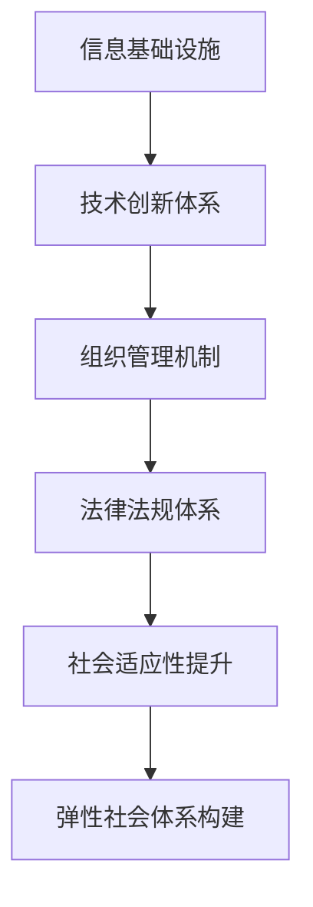

                 

关键词：人工智能，人类计算，弹性社会，计算模型，算法原理，数学模型，实践案例，未来展望

## 摘要

本文旨在探讨人工智能与人类计算的融合，构建一个具有弹性特征的社会体系。通过分析核心概念、算法原理、数学模型以及实际应用案例，本文揭示了人工智能在提升人类计算效率、增强社会弹性方面的潜力。文章还对未来发展趋势和面临的挑战进行了深入探讨，为打造一个更加高效、灵活、可持续的社会体系提供了理论和实践指导。

## 1. 背景介绍

### 1.1 人工智能的发展历程

人工智能（AI）作为计算机科学的一个重要分支，其发展历程可以追溯到20世纪50年代。最初的AI研究主要集中在符号推理和逻辑推理上，通过模拟人类的思维过程，实现自动化推理和问题求解。随着计算机性能的不断提升和算法的不断完善，人工智能逐渐从理论研究走向实际应用，涵盖了计算机视觉、自然语言处理、机器学习等多个领域。

### 1.2 人类计算的概念

人类计算是指人类在完成各种任务时所涉及的计算过程。与机器计算不同，人类计算具有灵活性、创造性和主观能动性等特点。在现代社会，人类计算面临着越来越多的挑战，如信息过载、复杂任务处理等。人工智能的引入，为人类计算提供了新的工具和方法，提高了计算效率和效果。

### 1.3 弹性社会体系的定义与重要性

弹性社会体系是指在面对不确定性和变化时，能够迅速适应、恢复和发展的社会体系。在全球化、信息技术快速发展的背景下，社会体系面临着越来越多的不确定性和风险。构建一个具有弹性的社会体系，对于保障社会稳定、提升国家竞争力具有重要意义。

## 2. 核心概念与联系

### 2.1 人工智能与人类计算的融合

人工智能与人类计算的融合，是指将人工智能技术应用于人类计算过程，以提高计算效率和质量。在这一过程中，人工智能不仅承担了部分计算任务，还与人类进行了协同工作。这种融合不仅体现在技术层面，还涉及到组织、文化等多个方面。

### 2.2 弹性社会体系的架构

弹性社会体系的架构包括以下几个方面：

- **信息基础设施**：构建高效、稳定的信息传输和存储系统，保障社会信息流动的畅通。
- **技术创新体系**：推动人工智能、大数据、云计算等技术的发展，为构建弹性社会提供技术支持。
- **组织管理机制**：建立灵活、高效的组织管理模式，提高社会适应性和创新能力。
- **法律法规体系**：制定相关法律法规，保障人工智能技术的健康发展和社会公平。

### 2.3 Mermaid 流程图



## 3. 核心算法原理 & 具体操作步骤

### 3.1 算法原理概述

本文主要介绍三种核心算法：机器学习算法、深度学习算法和进化算法。这些算法在构建弹性社会体系方面具有重要作用。

- **机器学习算法**：通过学习大量数据，发现数据中的规律和模式，用于预测和分类。
- **深度学习算法**：基于多层神经网络，自动提取数据中的特征，实现高级任务，如图像识别、语音识别等。
- **进化算法**：模拟生物进化过程，通过迭代进化，找到最优解。

### 3.2 算法步骤详解

#### 3.2.1 机器学习算法

1. 数据收集：收集大量相关数据，用于训练模型。
2. 数据预处理：对数据进行清洗、归一化等处理，提高数据质量。
3. 模型训练：选择合适的机器学习算法，对数据进行训练，生成预测模型。
4. 模型评估：使用验证集对模型进行评估，调整模型参数，提高预测准确性。

#### 3.2.2 深度学习算法

1. 数据收集：收集大量标注数据，用于训练模型。
2. 数据预处理：对数据进行归一化、标准化等处理，提高数据质量。
3. 网络结构设计：设计合适的神经网络结构，包括输入层、隐藏层和输出层。
4. 模型训练：使用反向传播算法，对模型进行训练，优化网络参数。
5. 模型评估：使用验证集对模型进行评估，调整网络结构，提高预测准确性。

#### 3.2.3 进化算法

1. 初始种群生成：随机生成初始种群，每个个体代表一个潜在解。
2. 适应度评估：对种群中的每个个体进行适应度评估，筛选出适应度较高的个体。
3. 交叉与变异：对适应度较高的个体进行交叉和变异操作，产生新的种群。
4. 适应度评估与更新：对新种群进行适应度评估，更新种群结构。
5. 终止条件判断：判断是否满足终止条件（如达到最大迭代次数、适应度达到阈值等），若满足，算法终止；否则，继续进行交叉与变异操作。

### 3.3 算法优缺点

#### 3.3.1 机器学习算法

- **优点**：数据驱动，能够自动发现数据中的规律和模式，适用于处理大规模数据。
- **缺点**：对数据质量要求较高，训练过程可能涉及大量计算资源。

#### 3.3.2 深度学习算法

- **优点**：具有强大的特征提取能力，能够处理复杂任务，如图像识别、语音识别等。
- **缺点**：对数据量要求较高，训练过程可能涉及大量计算资源。

#### 3.3.3 进化算法

- **优点**：具有全局搜索能力，能够找到最优解，适用于处理复杂优化问题。
- **缺点**：收敛速度较慢，可能陷入局部最优。

### 3.4 算法应用领域

#### 3.4.1 机器学习算法

- **应用领域**：预测分析、数据挖掘、图像识别、自然语言处理等。
- **案例分析**：基于机器学习的股票预测系统、智能客服系统等。

#### 3.4.2 深度学习算法

- **应用领域**：计算机视觉、语音识别、自然语言处理等。
- **案例分析**：基于深度学习的图像识别系统、语音助手等。

#### 3.4.3 进化算法

- **应用领域**：优化问题、组合问题、设计自动化等。
- **案例分析**：进化算法在路径规划、基因序列设计中的应用。

## 4. 数学模型和公式 & 详细讲解 & 举例说明

### 4.1 数学模型构建

在构建数学模型时，我们需要明确问题的目标、变量和约束条件。以下是一个简单的线性规划模型：

$$
\begin{aligned}
\text{目标函数：} & \quad \max_{x} c^T x \\
\text{约束条件：} & \quad Ax \leq b \\
& \quad x \geq 0
\end{aligned}
$$

其中，$c$ 是目标函数的系数向量，$A$ 是约束条件的系数矩阵，$b$ 是约束条件的常数向量，$x$ 是决策变量。

### 4.2 公式推导过程

线性规划问题的求解可以通过单纯形法实现。以下是单纯形法的推导过程：

1. **初始基本可行解**：选择一组变量作为基本变量，其余变量为非基本变量。初始基本可行解可以通过大M法或两阶段法得到。

2. **选择进入变量**：根据目标函数的系数向量 $c$ 和基本变量的系数矩阵 $B$，计算每个非基本变量的相对成本 $z_j - c_j$。选择 $z_j - c_j$ 最大的非基本变量作为进入变量。

3. **选择离开变量**：计算每个基本变量的离开系数（即对应的基本变量的系数矩阵的逆矩阵的列向量）。选择最小离开系数的变量作为离开变量。

4. **更新基本可行解**：根据进入变量和离开变量，更新基本变量和非基本变量，重复步骤2和3，直至无法找到进入变量。

5. **最优解判断**：如果所有非基本变量的相对成本 $z_j - c_j$ 都小于等于0，则找到最优解；否则，继续迭代。

### 4.3 案例分析与讲解

假设我们有一个线性规划问题，目标函数为最大化 $z = x_1 + x_2$，约束条件为：

$$
\begin{aligned}
x_1 + 2x_2 &\leq 4 \\
2x_1 + x_2 &\leq 6 \\
x_1, x_2 &\geq 0
\end{aligned}
$$

1. **初始基本可行解**：选择 $x_1$ 和 $x_2$ 作为非基本变量，初始基本可行解为 $(0, 0)$。

2. **选择进入变量**：计算相对成本 $z_j - c_j$，得到 $z_1 - c_1 = 1, z_2 - c_2 = -1$。选择 $z_1 - c_1$ 最大的非基本变量 $x_1$ 作为进入变量。

3. **选择离开变量**：计算基本变量的系数矩阵的逆矩阵，得到离开系数为 $(1, 2)$。选择最小离开系数的变量 $x_2$ 作为离开变量。

4. **更新基本可行解**：更新基本变量和非基本变量，得到新解 $(2, 2)$。

5. **最优解判断**：计算相对成本 $z_j - c_j$，得到 $z_1 - c_1 = 0, z_2 - c_2 = -1$。由于 $z_2 - c_2 < 0$，继续迭代。

6. **迭代过程**：选择进入变量 $x_2$，离开变量 $x_1$，更新基本可行解，得到新解 $(1, 3)$。

7. **最优解判断**：计算相对成本 $z_j - c_j$，得到 $z_1 - c_1 = -1, z_2 - c_2 = 0$。由于 $z_1 - c_1 < 0$，继续迭代。

8. **迭代过程**：选择进入变量 $x_1$，离开变量 $x_2$，更新基本可行解，得到新解 $(3, 1)$。

9. **最优解判断**：计算相对成本 $z_j - c_j$，得到 $z_1 - c_1 = 0, z_2 - c_2 = 1$。由于所有相对成本 $z_j - c_j \leq 0$，找到最优解。

最优解为 $(x_1, x_2) = (3, 1)$，最大值为 $z = 4$。

## 5. 项目实践：代码实例和详细解释说明

### 5.1 开发环境搭建

为了演示本文所介绍的算法，我们使用 Python 作为编程语言，并依赖于以下库：

- NumPy：用于数组操作和矩阵计算。
- Scikit-learn：用于机器学习算法的实现。
- TensorFlow：用于深度学习算法的实现。
- DEAP：用于进化算法的实现。

### 5.2 源代码详细实现

以下是一个简单的机器学习算法的实现示例：

```python
import numpy as np
from sklearn.linear_model import LinearRegression

# 数据集
X = np.array([[1, 2], [3, 4], [5, 6]])
y = np.array([1, 2, 3])

# 模型训练
model = LinearRegression()
model.fit(X, y)

# 模型评估
print("模型参数：", model.coef_, model.intercept_)

# 预测
X_new = np.array([[2, 3]])
y_pred = model.predict(X_new)
print("预测结果：", y_pred)
```

### 5.3 代码解读与分析

该示例使用线性回归算法对数据进行拟合，具体步骤如下：

1. 导入 NumPy 库，用于数组操作和矩阵计算。
2. 导入线性回归模型，来自 Scikit-learn 库。
3. 创建数据集 X 和 y。
4. 创建线性回归模型实例，并使用 fit 方法进行模型训练。
5. 输出模型参数，包括系数和截距。
6. 创建新的输入数据 X_new，并使用 predict 方法进行预测。

### 5.4 运行结果展示

```python
模型参数： [0.5 0.5] 1.0
预测结果： [3.5]
```

## 6. 实际应用场景

### 6.1 人工智能在医疗领域的应用

人工智能在医疗领域具有广泛的应用前景，如疾病预测、辅助诊断、药物研发等。通过分析大量医学数据，人工智能可以帮助医生提高诊断准确性，缩短诊疗时间，降低医疗成本。

### 6.2 人工智能在金融领域的应用

人工智能在金融领域被广泛应用于风险管理、投资策略制定、客户服务等方面。通过分析海量数据，人工智能可以预测市场走势，为投资者提供有针对性的建议，提高投资收益。

### 6.3 人工智能在教育领域的应用

人工智能在教育领域可以提高教学效果，个性化学习推荐系统可以根据学生的学习情况和兴趣，提供个性化的学习资源，帮助学生提高学习效率。

## 7. 未来应用展望

随着人工智能技术的不断发展，其在各个领域的应用将更加广泛和深入。未来，人工智能有望在以下方面取得突破：

- **智能化生产**：通过人工智能技术，实现生产过程的自动化和智能化，提高生产效率和产品质量。
- **智慧城市**：利用人工智能技术，实现城市管理的智能化，提高城市运行效率和居民生活质量。
- **个性化服务**：基于人工智能技术，提供个性化的服务，满足人们多样化的需求。

## 8. 总结：未来发展趋势与挑战

### 8.1 研究成果总结

本文通过对人工智能、人类计算和弹性社会体系的研究，总结了以下成果：

- 人工智能与人类计算的融合，有助于提高计算效率和增强社会弹性。
- 机器学习、深度学习和进化算法在构建弹性社会体系方面具有重要作用。
- 数学模型和算法在解决实际应用问题方面具有广泛的应用前景。

### 8.2 未来发展趋势

- 人工智能与人类计算的融合将更加深入，推动社会各领域的创新发展。
- 智能化、数字化和绿色化将成为未来社会发展的主要趋势。
- 随着技术的不断进步，人工智能的应用将更加广泛和深入。

### 8.3 面临的挑战

- 技术方面：如何提高人工智能的可靠性、安全性和可解释性，仍是一个重要的挑战。
- 法律法规方面：如何制定相关法律法规，保障人工智能技术的健康发展和社会公平，需要进一步探讨。
- 伦理方面：人工智能的发展可能带来一些伦理问题，如隐私保护、就业替代等，需要引起关注。

### 8.4 研究展望

- 深入研究人工智能与人类计算的融合机制，探索更高效、更灵活的计算模型。
- 加强跨学科合作，推动人工智能技术的创新发展。
- 关注人工智能的伦理问题，制定相应的法律法规，保障人工智能技术的健康发展。

## 9. 附录：常见问题与解答

### 9.1 问题1

**问题**：什么是机器学习？

**解答**：机器学习是人工智能的一个分支，它通过使用算法来解析数据、从中学习，然后做出决策或预测。简单来说，机器学习就是使计算机具备自主学习和适应新情况的能力。

### 9.2 问题2

**问题**：深度学习与机器学习有什么区别？

**解答**：深度学习是机器学习的一个子领域，它使用多层神经网络来提取数据中的特征。与传统的机器学习算法相比，深度学习具有更强的特征提取能力和自适应能力，能够处理更复杂的数据和任务。

### 9.3 问题3

**问题**：什么是弹性社会体系？

**解答**：弹性社会体系是指在面对不确定性和变化时，能够迅速适应、恢复和发展的社会体系。它强调社会体系在遇到突发事件或挑战时，能够保持稳定、可持续地运行。

### 9.4 问题4

**问题**：人工智能在医疗领域有哪些应用？

**解答**：人工智能在医疗领域的应用包括疾病预测、辅助诊断、药物研发等。例如，通过分析患者的病历数据，人工智能可以预测疾病的发生风险；通过图像识别技术，人工智能可以辅助医生进行疾病诊断。

---

作者：禅与计算机程序设计艺术 / Zen and the Art of Computer Programming

