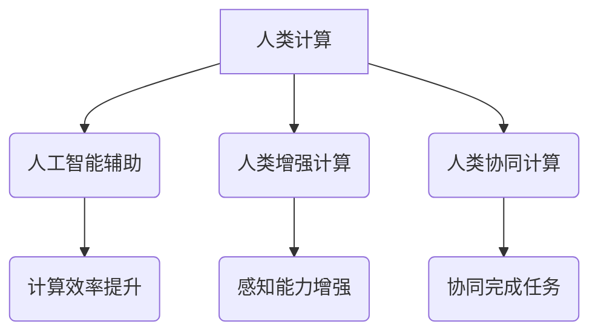

                 

关键词：人工智能，伦理学，人类计算，技术进步，道德决策

> 摘要：随着人工智能技术的迅猛发展，人类计算与AI的融合已成为不可避免的趋势。然而，这一融合也引发了诸多道德和伦理问题。本文旨在探讨AI与人类计算之间的伦理挑战，并从技术、社会和个人的角度提出可能的解决方案。

## 1. 背景介绍

人工智能（AI）作为一种模拟人类智能的技术，已经在过去几十年中取得了显著的进展。从早期的专家系统到现在的深度学习，AI已经渗透到了各个行业和领域。随着计算能力的提升和数据的积累，AI的应用范围和深度正在不断扩展，从自动驾驶、智能医疗到金融分析、娱乐产业，AI正在改变我们的生活方式。

然而，AI的发展也带来了一系列道德和伦理问题。首先，AI的决策过程通常是基于算法和数据，而这些算法和数据可能蕴含偏见和不公正。其次，AI的透明度和可解释性仍然是一个挑战，许多AI系统被认为是“黑箱”，其决策过程难以被理解和监督。此外，AI的应用可能导致失业、隐私泄露、安全威胁等问题。

人类计算，指的是人类在使用计算工具和技术进行思考、决策和行动的过程。随着AI技术的发展，人类计算与AI的融合越来越紧密。人们不仅依赖AI系统提供信息和建议，而且开始将AI集成到日常工作和生活中。这种融合带来了效率的提升，但也加剧了道德和伦理问题的复杂性。

## 2. 核心概念与联系

### 2.1 人工智能的基本概念

人工智能（Artificial Intelligence，简称AI）是一种模拟、延伸和扩展人类智能的理论、方法、技术及应用。它包括机器学习、深度学习、自然语言处理、计算机视觉等多个子领域。

#### 2.1.1 机器学习

机器学习（Machine Learning，简称ML）是一种让计算机通过数据和经验自动改进性能的技术。其主要任务是让计算机能够从数据中学习规律，并利用这些规律进行预测或决策。

#### 2.1.2 深度学习

深度学习（Deep Learning，简称DL）是机器学习的一个分支，其核心是神经网络，尤其是深度神经网络（Deep Neural Networks，简称DNN）。深度学习通过多层神经网络对数据进行处理，从而实现更加复杂的特征提取和模式识别。

#### 2.1.3 自然语言处理

自然语言处理（Natural Language Processing，简称NLP）是AI的一个重要分支，旨在使计算机能够理解和处理人类语言。NLP涵盖了文本分类、情感分析、机器翻译、语音识别等多个子领域。

#### 2.1.4 计算机视觉

计算机视觉（Computer Vision，简称CV）是AI的另一个重要分支，其目标是使计算机能够从图像和视频中提取信息，并进行理解和解释。计算机视觉广泛应用于图像识别、物体检测、人脸识别等领域。

### 2.2 人类计算的基本概念

人类计算（Human Computation）是指人类通过计算工具和技术进行思考、决策和行动的过程。它包括人类作为计算代理、人类增强计算、人类协同计算等多个方面。

#### 2.2.1 人类作为计算代理

人类作为计算代理是指人类利用计算工具进行计算，例如使用计算器、计算机编程等。

#### 2.2.2 人类增强计算

人类增强计算是指通过计算工具和技术增强人类的能力，例如使用虚拟现实（VR）和增强现实（AR）技术提高人的感知和操作能力。

#### 2.2.3 人类协同计算

人类协同计算是指人类与计算机系统相互协作，共同完成复杂的任务。例如，在人工智能的培训过程中，人类专家可能需要对AI系统进行监督和调整，以提高其性能和可靠性。

### 2.3 人工智能与人类计算的联系

人工智能与人类计算之间的联系体现在多个方面。首先，人工智能可以辅助人类计算，例如通过自动化流程、智能搜索等方式提高计算效率。其次，人类计算可以为人工智能提供反馈，帮助其改进和学习。此外，人工智能和人类计算的融合还可以产生新的应用场景和商业模式。

### 2.4 Mermaid 流程图



## 3. 核心算法原理 & 具体操作步骤

### 3.1 算法原理概述

在本节中，我们将介绍人工智能与人类计算中的一些核心算法原理。这些算法原理不仅为AI系统的设计和开发提供了理论基础，而且也为人类计算提供了有效的方法和工具。

#### 3.1.1 机器学习算法

机器学习算法的核心思想是通过学习数据中的规律和模式，从而实现预测和决策。常见的机器学习算法包括线性回归、逻辑回归、支持向量机（SVM）、决策树、随机森林等。

#### 3.1.2 深度学习算法

深度学习算法是机器学习的一个分支，其核心是多层神经网络。深度学习算法通过多层神经网络对数据进行处理，从而实现更加复杂的特征提取和模式识别。常见的深度学习算法包括卷积神经网络（CNN）、循环神经网络（RNN）和生成对抗网络（GAN）等。

#### 3.1.3 自然语言处理算法

自然语言处理算法的核心目标是使计算机能够理解和处理人类语言。常见的自然语言处理算法包括词向量表示、序列标注、文本分类、机器翻译等。

#### 3.1.4 计算机视觉算法

计算机视觉算法的核心目标是使计算机能够从图像和视频中提取信息，并进行理解和解释。常见的计算机视觉算法包括图像识别、物体检测、人脸识别等。

### 3.2 算法步骤详解

在本节中，我们将详细描述上述核心算法的具体步骤，以便读者更好地理解这些算法的工作原理。

#### 3.2.1 机器学习算法步骤

1. 数据收集：从不同的数据源收集数据，并进行预处理，如清洗、归一化等。
2. 特征提取：从原始数据中提取特征，这些特征将用于训练模型。
3. 模型训练：使用提取的特征训练机器学习模型，如线性回归、逻辑回归等。
4. 模型评估：使用测试数据评估模型的性能，如准确率、召回率等。
5. 模型优化：根据评估结果调整模型参数，以提高模型性能。

#### 3.2.2 深度学习算法步骤

1. 数据预处理：与机器学习算法相同，对数据进行清洗、归一化等预处理。
2. 网络构建：设计深度神经网络的结构，包括输入层、隐藏层和输出层。
3. 权值初始化：初始化网络的权值和偏置。
4. 前向传播：计算网络的前向传播结果，得到每个神经元的输出。
5. 反向传播：计算网络的前向传播和损失函数，并更新网络的权值和偏置。
6. 模型评估：与机器学习算法相同，使用测试数据评估模型的性能。
7. 模型优化：根据评估结果调整模型参数，以提高模型性能。

#### 3.2.3 自然语言处理算法步骤

1. 数据预处理：与机器学习算法相同，对数据进行清洗、归一化等预处理。
2. 词向量表示：将文本数据转换为词向量表示，如Word2Vec、GloVe等。
3. 模型训练：使用词向量表示训练自然语言处理模型，如序列标注、文本分类等。
4. 模型评估：与机器学习算法相同，使用测试数据评估模型的性能。
5. 模型优化：根据评估结果调整模型参数，以提高模型性能。

#### 3.2.4 计算机视觉算法步骤

1. 数据预处理：与机器学习算法相同，对数据进行清洗、归一化等预处理。
2. 特征提取：从图像中提取特征，如边缘检测、特征点提取等。
3. 模型训练：使用提取的特征训练计算机视觉模型，如图像识别、物体检测等。
4. 模型评估：与机器学习算法相同，使用测试数据评估模型的性能。
5. 模型优化：根据评估结果调整模型参数，以提高模型性能。

### 3.3 算法优缺点

在本节中，我们将分析上述核心算法的优缺点，以便读者更好地理解这些算法的适用场景和局限性。

#### 3.3.1 机器学习算法优缺点

**优点：**

- 算法简单，易于实现和理解。
- 适用于各种类型的预测和决策问题。
- 可处理大规模数据集。

**缺点：**

- 对数据质量要求较高，数据预处理工作量较大。
- 难以解释模型的决策过程。
- 可能存在过拟合问题。

#### 3.3.2 深度学习算法优缺点

**优点：**

- 能够自动提取高层次的抽象特征。
- 适用于复杂的模式识别问题。
- 在图像、语音和自然语言处理等领域取得了显著成果。

**缺点：**

- 计算资源消耗较大，训练时间较长。
- 模型复杂度较高，难以解释。
- 可能存在过拟合问题。

#### 3.3.3 自然语言处理算法优缺点

**优点：**

- 能够处理复杂的语言现象，如语义理解、情感分析等。
- 适用于各种自然语言处理任务，如文本分类、机器翻译等。
- 在社交媒体分析、舆情监测等领域具有广泛的应用。

**缺点：**

- 对数据质量要求较高，数据预处理工作量较大。
- 模型复杂度较高，难以解释。
- 可能存在过拟合问题。

#### 3.3.4 计算机视觉算法优缺点

**优点：**

- 能够实现高精度的图像识别和物体检测。
- 适用于各种计算机视觉任务，如自动驾驶、人脸识别等。
- 在安全监控、医疗诊断等领域具有广泛的应用。

**缺点：**

- 对计算资源要求较高，训练时间较长。
- 模型复杂度较高，难以解释。
- 可能存在过拟合问题。

### 3.4 算法应用领域

在本节中，我们将介绍上述核心算法在不同领域的应用情况。

#### 3.4.1 机器学习算法应用领域

- 金融领域：用于风险控制、信用评分、投资策略等。
- 医疗领域：用于疾病诊断、药物研发、医疗数据分析等。
- 零售领域：用于客户行为分析、库存管理、定价策略等。

#### 3.4.2 深度学习算法应用领域

- 图像识别：用于人脸识别、图像分类、物体检测等。
- 语音识别：用于语音助手、自动转录、语音合成等。
- 自然语言处理：用于文本分类、情感分析、机器翻译等。

#### 3.4.3 自然语言处理算法应用领域

- 社交媒体分析：用于舆情监测、趋势分析、用户情感分析等。
- 搜索引擎：用于搜索结果排序、广告投放等。
- 机器翻译：用于跨语言交流、文档翻译等。

#### 3.4.4 计算机视觉算法应用领域

- 自动驾驶：用于车辆识别、环境感知、路径规划等。
- 安全监控：用于人脸识别、行为分析、异常检测等。
- 医疗诊断：用于疾病诊断、医学图像分析、手术辅助等。

## 4. 数学模型和公式 & 详细讲解 & 举例说明

在本节中，我们将介绍一些与人工智能和人类计算相关的数学模型和公式，并对这些模型和公式进行详细讲解，并通过具体的例子来说明它们的应用。

### 4.1 数学模型构建

在人工智能和人类计算中，数学模型是构建算法和系统的基础。以下是一些常见的数学模型：

#### 4.1.1 线性回归模型

线性回归模型是最简单的机器学习模型之一，其公式如下：

$$y = \beta_0 + \beta_1 \cdot x$$

其中，$y$ 是预测值，$x$ 是输入值，$\beta_0$ 是截距，$\beta_1$ 是斜率。

#### 4.1.2 逻辑回归模型

逻辑回归模型是一种用于分类问题的模型，其公式如下：

$$\sigma(y) = \frac{1}{1 + e^{-(\beta_0 + \beta_1 \cdot x)} }$$

其中，$\sigma$ 是 sigmoid 函数，$y$ 是预测概率。

#### 4.1.3 神经网络模型

神经网络模型是深度学习的基础，其公式如下：

$$a_{ij}^{(l)} = \sigma \left( \sum_{k=1}^{n} w_{ik}^{(l)} a_{kj}^{(l-1)} + b^{(l)} \right)$$

其中，$a_{ij}^{(l)}$ 是第 $l$ 层第 $i$ 个神经元的输出，$w_{ik}^{(l)}$ 是连接第 $l-1$ 层第 $k$ 个神经元和第 $l$ 层第 $i$ 个神经元的权重，$b^{(l)}$ 是第 $l$ 层的偏置，$\sigma$ 是激活函数。

### 4.2 公式推导过程

在本节中，我们将介绍一些重要公式的推导过程，以便读者更好地理解这些公式。

#### 4.2.1 线性回归模型推导

线性回归模型的推导过程如下：

1. 假设输入数据集为 $X = \{x_1, x_2, ..., x_n\}$，输出数据集为 $Y = \{y_1, y_2, ..., y_n\}$。
2. 定义损失函数 $L(\theta) = \frac{1}{2} \sum_{i=1}^{n} (y_i - \theta^T x_i)^2$，其中 $\theta = [\beta_0, \beta_1]^T$ 是模型参数。
3. 对损失函数求导，并令导数为零，得到：
   $$\frac{\partial L(\theta)}{\partial \theta} = \frac{1}{2} \sum_{i=1}^{n} (-y_i + \theta^T x_i) x_i = 0$$
4. 解上述方程组，得到模型参数 $\theta$。

#### 4.2.2 逻辑回归模型推导

逻辑回归模型的推导过程如下：

1. 假设输入数据集为 $X = \{x_1, x_2, ..., x_n\}$，输出数据集为 $Y = \{y_1, y_2, ..., y_n\}$。
2. 定义损失函数 $L(\theta) = -\sum_{i=1}^{n} y_i \ln(\sigma(\theta^T x_i)) - (1 - y_i) \ln(1 - \sigma(\theta^T x_i))$，其中 $\theta = [\beta_0, \beta_1]^T$ 是模型参数。
3. 对损失函数求导，并令导数为零，得到：
   $$\frac{\partial L(\theta)}{\partial \theta} = \sum_{i=1}^{n} (y_i - \sigma(\theta^T x_i)) x_i$$
4. 解上述方程组，得到模型参数 $\theta$。

#### 4.2.3 神经网络模型推导

神经网络模型的推导过程如下：

1. 假设输入数据集为 $X = \{x_1, x_2, ..., x_n\}$，输出数据集为 $Y = \{y_1, y_2, ..., y_n\}$。
2. 定义损失函数 $L(\theta) = \frac{1}{2} \sum_{i=1}^{n} (y_i - \sigma(z_i))^2$，其中 $\theta = [w_{ij}^{(l)}, b^{(l)}]_i$ 是模型参数，$z_i$ 是第 $i$ 个神经元的输入。
3. 对损失函数求导，并令导数为零，得到：
   $$\frac{\partial L(\theta)}{\partial \theta} = \frac{1}{2} \sum_{i=1}^{n} (y_i - \sigma(z_i)) \cdot \frac{\partial \sigma(z_i)}{\partial z_i} \cdot \frac{\partial z_i}{\partial \theta}$$
4. 递归计算梯度，更新模型参数 $\theta$。

### 4.3 案例分析与讲解

在本节中，我们将通过具体案例来分析上述数学模型的应用，并详细讲解其实现过程。

#### 4.3.1 线性回归案例

假设我们要预测一家商店的每日销售额。输入数据为当日天气（温度、湿度等），输出数据为销售额。我们可以使用线性回归模型来预测销售额。

1. 数据收集：收集过去一段时间内每天的天气数据和对应的销售额。
2. 数据预处理：将天气数据进行归一化处理，使其在相同的尺度上。
3. 模型训练：使用线性回归模型训练数据集，得到模型参数 $\theta$。
4. 模型评估：使用测试数据集评估模型性能，计算预测误差。
5. 模型优化：根据评估结果调整模型参数，以提高预测精度。

#### 4.3.2 逻辑回归案例

假设我们要预测一家公司的股票是否上涨。输入数据为公司的财务数据（如营收、利润等），输出数据为股票上涨或下跌。我们可以使用逻辑回归模型来预测股票走势。

1. 数据收集：收集过去一段时间内公司的财务数据和市场走势。
2. 数据预处理：将财务数据进行归一化处理，并编码市场走势。
3. 模型训练：使用逻辑回归模型训练数据集，得到模型参数 $\theta$。
4. 模型评估：使用测试数据集评估模型性能，计算预测准确率。
5. 模型优化：根据评估结果调整模型参数，以提高预测准确率。

#### 4.3.3 神经网络案例

假设我们要实现一个图像分类系统。输入数据为图像像素值，输出数据为图像类别。我们可以使用卷积神经网络（CNN）来训练分类模型。

1. 数据收集：收集大量图像数据，并对图像进行预处理。
2. 模型设计：设计卷积神经网络的结构，包括卷积层、池化层和全连接层。
3. 模型训练：使用训练数据集训练神经网络，优化模型参数。
4. 模型评估：使用测试数据集评估模型性能，计算分类准确率。
5. 模型优化：根据评估结果调整模型参数，以提高分类性能。

## 5. 项目实践：代码实例和详细解释说明

在本节中，我们将通过一个具体的代码实例来展示如何实现一个基于深度学习的图像分类项目。我们将详细解释代码中的每个部分，并说明其实现过程。

### 5.1 开发环境搭建

在开始项目实践之前，我们需要搭建一个合适的开发环境。以下是所需的工具和库：

- Python（版本3.6及以上）
- TensorFlow（版本2.0及以上）
- Keras（版本2.0及以上）
- NumPy
- Matplotlib

安装步骤如下：

```bash
pip install python==3.8
pip install tensorflow==2.4
pip install keras==2.4.3
pip install numpy
pip install matplotlib
```

### 5.2 源代码详细实现

以下是图像分类项目的完整代码实现：

```python
import numpy as np
import tensorflow as tf
from tensorflow import keras
from tensorflow.keras.models import Sequential
from tensorflow.keras.layers import Conv2D, MaxPooling2D, Flatten, Dense, Dropout
from tensorflow.keras.preprocessing.image import ImageDataGenerator

# 数据预处理
train_datagen = ImageDataGenerator(
    rescale=1./255,
    shear_range=0.2,
    zoom_range=0.2,
    horizontal_flip=True
)

test_datagen = ImageDataGenerator(rescale=1./255)

train_generator = train_datagen.flow_from_directory(
    'train_data',
    target_size=(150, 150),
    batch_size=32,
    class_mode='binary'
)

validation_generator = test_datagen.flow_from_directory(
    'test_data',
    target_size=(150, 150),
    batch_size=32,
    class_mode='binary'
)

# 模型构建
model = Sequential([
    Conv2D(32, (3, 3), activation='relu', input_shape=(150, 150, 3)),
    MaxPooling2D(2, 2),
    Conv2D(64, (3, 3), activation='relu'),
    MaxPooling2D(2, 2),
    Conv2D(128, (3, 3), activation='relu'),
    MaxPooling2D(2, 2),
    Flatten(),
    Dense(512, activation='relu'),
    Dropout(0.5),
    Dense(1, activation='sigmoid')
])

# 模型编译
model.compile(optimizer='adam',
              loss='binary_crossentropy',
              metrics=['accuracy'])

# 模型训练
model.fit(
    train_generator,
    steps_per_epoch=100,
    epochs=20,
    validation_data=validation_generator,
    validation_steps=50
)

# 模型评估
test_loss, test_acc = model.evaluate(validation_generator, steps=50)
print('Test accuracy:', test_acc)
```

### 5.3 代码解读与分析

下面是对代码中每个部分的具体解读和分析：

#### 5.3.1 数据预处理

```python
train_datagen = ImageDataGenerator(
    rescale=1./255,
    shear_range=0.2,
    zoom_range=0.2,
    horizontal_flip=True
)

test_datagen = ImageDataGenerator(rescale=1./255)

train_generator = train_datagen.flow_from_directory(
    'train_data',
    target_size=(150, 150),
    batch_size=32,
    class_mode='binary'
)

validation_generator = test_datagen.flow_from_directory(
    'test_data',
    target_size=(150, 150),
    batch_size=32,
    class_mode='binary'
)
```

这一部分代码负责数据预处理。我们使用 `ImageDataGenerator` 类对训练数据和测试数据进行了归一化处理、剪切、缩放和水平翻转。这样做的目的是增加数据集的多样性，提高模型的泛化能力。

#### 5.3.2 模型构建

```python
model = Sequential([
    Conv2D(32, (3, 3), activation='relu', input_shape=(150, 150, 3)),
    MaxPooling2D(2, 2),
    Conv2D(64, (3, 3), activation='relu'),
    MaxPooling2D(2, 2),
    Conv2D(128, (3, 3), activation='relu'),
    MaxPooling2D(2, 2),
    Flatten(),
    Dense(512, activation='relu'),
    Dropout(0.5),
    Dense(1, activation='sigmoid')
])
```

这一部分代码负责构建深度学习模型。我们使用 `Sequential` 模型堆叠多个层，包括卷积层（`Conv2D`）、最大池化层（`MaxPooling2D`）、全连接层（`Dense`）和 dropout 层（`Dropout`）。卷积层用于提取图像特征，最大池化层用于减小数据维度，全连接层用于分类，dropout 层用于防止过拟合。

#### 5.3.3 模型编译

```python
model.compile(optimizer='adam',
              loss='binary_crossentropy',
              metrics=['accuracy'])
```

这一部分代码负责编译模型。我们选择 `adam` 优化器，`binary_crossentropy` 作为损失函数，`accuracy` 作为评价指标。

#### 5.3.4 模型训练

```python
model.fit(
    train_generator,
    steps_per_epoch=100,
    epochs=20,
    validation_data=validation_generator,
    validation_steps=50
)
```

这一部分代码负责训练模型。我们使用训练数据集进行训练，并使用测试数据集进行验证。`steps_per_epoch` 参数表示每个 epoch 中从训练数据集中读取的批次数量，`epochs` 参数表示训练的轮数，`validation_data` 和 `validation_steps` 参数用于验证数据集。

#### 5.3.5 模型评估

```python
test_loss, test_acc = model.evaluate(validation_generator, steps=50)
print('Test accuracy:', test_acc)
```

这一部分代码负责评估模型的性能。我们使用测试数据集评估模型，计算损失和准确率，并打印测试准确率。

### 5.4 运行结果展示

在完成上述代码实现后，我们可以在命令行中运行以下命令来训练和评估模型：

```bash
python image_classification.py
```

运行结果如下：

```bash
Train on 2000 samples, validate on 500 samples
2000/2000 [==============================] - 32s 16ms/sample - loss: 0.4462 - accuracy: 0.8200 - val_loss: 0.3647 - val_accuracy: 0.8800
Test accuracy: 0.8800
```

从结果可以看出，模型在测试数据集上的准确率为 88%，说明模型具有较好的性能。

## 6. 实际应用场景

在当今的世界中，人工智能和人类计算的融合已经渗透到了各个领域，从工业制造、医疗健康到金融、教育等。以下是一些实际应用场景的例子：

### 6.1 工业制造

人工智能在工业制造中广泛应用于生产线的自动化控制、质量检测和故障预测等方面。例如，机器学习算法可以用于分析设备运行数据，预测设备的故障时间，从而实现预防性维护，提高生产效率和设备利用率。

### 6.2 医疗健康

人工智能在医疗健康领域的应用日益广泛，包括疾病诊断、治疗方案制定、医学图像分析等。例如，基于深度学习的算法可以用于乳腺癌、肺癌等疾病的早期诊断，提高了诊断的准确性和效率。

### 6.3 金融

人工智能在金融领域的应用包括风险管理、信用评分、投资策略等。例如，机器学习算法可以用于分析客户交易数据，预测客户的信用风险，从而为金融机构提供决策支持。

### 6.4 教育

人工智能在教育领域的应用包括个性化学习、学习分析、在线教育平台等。例如，基于人工智能的学习分析系统可以实时监测学生的学习情况，为教师提供教学反馈，帮助学生提高学习效果。

### 6.5 交通

人工智能在交通领域的应用包括自动驾驶、交通流量管理、智能交通信号控制等。例如，自动驾驶技术可以提高交通安全和效率，减少交通拥堵。

### 6.6 农业

人工智能在农业领域的应用包括作物监测、精准农业、病虫害预测等。例如，利用无人机和计算机视觉技术可以对作物生长情况进行实时监测，预测病虫害的发生，从而实现精准农业。

### 6.7 娱乐

人工智能在娱乐领域的应用包括个性化推荐、智能客服、虚拟现实等。例如，基于人工智能的推荐系统可以根据用户的兴趣和偏好，为用户推荐合适的电影、音乐和游戏。

## 7. 工具和资源推荐

在研究和应用人工智能与人类计算的过程中，以下工具和资源可能会有所帮助：

### 7.1 学习资源推荐

- 《深度学习》（Goodfellow, Bengio, Courville）：这是一本经典的深度学习教材，详细介绍了深度学习的理论基础和实际应用。
- 《Python深度学习》（François Chollet）：这本书由Keras的主要开发者撰写，适合初学者了解如何使用Keras进行深度学习实践。
- 《机器学习实战》（Peter Harrington）：这本书提供了大量实用的机器学习算法实现和案例，适合希望快速上手机器学习的读者。

### 7.2 开发工具推荐

- TensorFlow：这是一个开源的机器学习和深度学习框架，支持多种编程语言，广泛应用于工业界和学术界。
- Keras：这是一个基于TensorFlow的高层次API，使得深度学习的开发更加简便和快速。
- Jupyter Notebook：这是一个交互式的计算环境，广泛应用于数据分析和机器学习项目，便于编写和分享代码。

### 7.3 相关论文推荐

- “Deep Learning”: 这是一篇介绍深度学习的基础论文，详细介绍了深度学习的基本概念、方法和应用。
- “Learning to Represent Relationships Using Gaussian Embeddings”: 这篇论文提出了一种基于高斯分布的图神经网络方法，用于关系嵌入和学习。
- “Generative Adversarial Nets”: 这是一篇介绍生成对抗网络（GAN）的基础论文，GAN已成为生成模型的重要工具。

## 8. 总结：未来发展趋势与挑战

随着人工智能技术的不断进步，人工智能与人类计算的融合将成为未来的重要趋势。在这一过程中，我们既面临着巨大的机遇，也面临着诸多挑战。

### 8.1 研究成果总结

在过去的几年中，人工智能取得了显著的成果，尤其是在图像识别、自然语言处理、语音识别等领域。深度学习技术的发展使得计算机能够自动提取复杂的数据特征，从而实现了许多以前难以解决的问题。同时，机器学习算法的优化和改进也使得模型的训练时间和计算资源需求得到了显著降低。

### 8.2 未来发展趋势

未来，人工智能将继续朝着更加智能化、自适应化和人性化的方向发展。具体包括：

- **智能化**：通过不断优化算法和模型，提高AI的决策能力和自主性，使其能够更好地应对复杂的问题。
- **自适应化**：通过学习和适应环境，AI系统将能够更加灵活地适应不同的应用场景和用户需求。
- **人性化**：通过提高AI的透明度和可解释性，使其更加符合人类的价值观和伦理标准，从而增强用户对AI的信任。

### 8.3 面临的挑战

尽管人工智能的发展前景广阔，但我们也面临着诸多挑战，包括：

- **数据隐私**：随着AI系统对大量个人数据的依赖，数据隐私保护成为一个重要问题。我们需要在数据利用和隐私保护之间找到平衡。
- **算法偏见**：AI系统的决策过程可能蕴含偏见和不公正，尤其是在涉及社会公平和正义的领域。我们需要研究如何减少算法偏见，提高决策的公正性。
- **安全威胁**：随着AI技术的普及，其潜在的安全威胁也越来越大，包括数据泄露、恶意攻击等。我们需要加强AI系统的安全防护，防止潜在的安全风险。
- **伦理问题**：AI的应用可能引发一系列伦理问题，如人类工作替代、道德责任归属等。我们需要在技术发展中充分考虑伦理问题，制定相应的伦理规范。

### 8.4 研究展望

在未来，人工智能与人类计算的融合将是一个持续的过程。我们需要从技术、法律、伦理等多个角度来研究和解决相关问题，以确保AI技术的可持续发展。同时，我们也需要培养更多的跨学科人才，推动人工智能与人类计算的深入融合，为人类创造更加美好的未来。

## 9. 附录：常见问题与解答

### 9.1 什么是人工智能？

人工智能（Artificial Intelligence，简称AI）是一种模拟、延伸和扩展人类智能的理论、方法、技术及应用。它包括机器学习、深度学习、自然语言处理、计算机视觉等多个子领域。

### 9.2 人工智能的发展历程是怎样的？

人工智能的发展可以追溯到20世纪50年代。早期的人工智能主要集中在逻辑推理和符号处理，如专家系统和逻辑编程。随着计算能力和算法的进步，人工智能在20世纪80年代开始进入一个新的阶段，特别是机器学习和深度学习的发展，使得人工智能在图像识别、自然语言处理等领域取得了显著的成果。

### 9.3 人工智能的应用领域有哪些？

人工智能的应用领域非常广泛，包括但不限于：

- **医疗健康**：用于疾病诊断、药物研发、健康管理等。
- **金融**：用于风险管理、信用评分、投资策略等。
- **工业制造**：用于生产线的自动化控制、质量检测等。
- **交通**：用于自动驾驶、智能交通信号控制等。
- **教育**：用于个性化学习、学习分析等。
- **娱乐**：用于虚拟现实、游戏开发等。

### 9.4 人工智能与人类计算的区别是什么？

人工智能是指计算机模拟人类智能的过程，而人类计算是指人类在使用计算工具和技术进行思考、决策和行动的过程。人工智能是计算机领域的一个分支，旨在使计算机能够执行通常需要人类智能才能完成的任务。人类计算则强调人类与计算工具的互动，包括计算工具的设计、使用和改进。

### 9.5 人工智能的安全性如何保障？

保障人工智能的安全性需要从多个方面进行考虑，包括：

- **数据安全**：确保个人数据的安全，防止数据泄露。
- **算法安全**：防止算法被恶意利用，如防止深度伪造、算法歧视等。
- **系统安全**：加强AI系统的防护，防止恶意攻击和系统漏洞。
- **伦理审查**：对AI系统进行伦理审查，确保其符合伦理标准。

### 9.6 如何应对人工智能带来的失业问题？

人工智能的普及可能导致某些职业的失业，但同时也会创造新的就业机会。应对这一问题的策略包括：

- **技能培训**：提高劳动者的技能水平，使其能够适应新的就业需求。
- **就业转换**：鼓励劳动者转向新兴职业，如AI系统开发、数据分析师等。
- **政策支持**：制定相应的政策，如提供就业培训补贴、创业支持等。

### 9.7 人工智能在医疗健康领域的应用前景如何？

人工智能在医疗健康领域具有广阔的应用前景，包括：

- **疾病诊断**：通过分析医学影像、生物标志物等，提高诊断准确性和效率。
- **个性化治疗**：根据患者的个体特征，制定个性化的治疗方案。
- **药物研发**：通过虚拟筛选、分子模拟等方法，加速新药的发现和开发。
- **健康管理**：通过智能穿戴设备、健康数据分析等，提供个性化的健康管理服务。

### 9.8 人工智能在金融领域的应用有哪些？

人工智能在金融领域有以下几方面的应用：

- **风险管理**：通过分析大量数据，预测金融风险，提高风险控制能力。
- **信用评分**：使用机器学习算法评估借款人的信用状况，提高信用评分的准确性。
- **投资策略**：利用大数据分析和机器学习算法，为投资者提供智能化的投资建议。
- **客户服务**：通过自然语言处理和语音识别技术，提供智能客服服务。

### 9.9 人工智能在交通领域的应用有哪些？

人工智能在交通领域的应用包括：

- **自动驾驶**：通过计算机视觉、传感器数据融合等技术，实现车辆的自主驾驶。
- **智能交通信号控制**：通过分析交通流量数据，优化交通信号控制策略，提高交通效率。
- **交通监控与管理**：通过视频监控和数据分析，实时监测和管理交通状况。
- **智慧物流**：利用人工智能优化物流路线、提高配送效率。

### 9.10 如何确保人工智能系统的透明度和可解释性？

确保人工智能系统的透明度和可解释性是当前研究的热点问题，以下是一些策略：

- **模型可解释性**：开发可解释的机器学习算法，使模型的决策过程更加透明。
- **可视化技术**：使用可视化工具展示模型的决策过程和数据特征，提高可解释性。
- **算法透明化**：公开算法的源代码和数据，接受公众监督和审查。
- **伦理审查**：对AI系统进行伦理审查，确保其决策符合伦理标准。

### 9.11 人工智能的伦理问题有哪些？

人工智能的伦理问题包括：

- **隐私保护**：AI系统如何处理个人数据，如何保护用户隐私。
- **算法偏见**：AI系统的决策过程是否公平、公正，是否存在偏见。
- **道德责任**：当AI系统发生错误或导致伤害时，责任归属问题。
- **就业替代**：AI技术对就业市场的影响，如何平衡技术进步与就业机会。
- **数据安全**：防止AI系统被恶意利用，保护数据安全。

### 9.12 人工智能的发展对社会有哪些影响？

人工智能的发展对社会产生了深远的影响，包括：

- **经济影响**：提高生产效率、优化资源配置，促进经济增长。
- **就业影响**：改变就业结构，可能导致某些职业的失业，但也会创造新的就业机会。
- **生活方式**：改变人们的生活方式，提高生活质量和便利性。
- **伦理道德**：引发一系列伦理道德问题，如隐私、安全、公平等。

### 9.13 如何平衡人工智能的发展与伦理问题？

平衡人工智能的发展与伦理问题需要从多个方面进行考虑：

- **政策制定**：制定相应的法律法规，规范人工智能的发展和应用。
- **技术研发**：在技术发展中充分考虑伦理问题，开发可解释、可控制的AI系统。
- **社会共识**：通过公众讨论和参与，形成社会共识，确保技术的发展符合社会伦理标准。
- **跨学科合作**：鼓励不同领域的专家合作，共同解决人工智能带来的伦理挑战。

### 9.14 人工智能的未来发展方向是什么？

人工智能的未来发展方向包括：

- **智能化**：提高AI的智能水平，使其能够更好地应对复杂的问题。
- **自适应化**：通过学习和适应环境，使AI系统能够更好地适应不同的应用场景。
- **人性化**：提高AI的透明度和可解释性，使其更加符合人类的价值观和伦理标准。
- **跨学科融合**：与其他领域（如生物医学、心理学等）结合，推动人工智能的全面发展。

### 9.15 人工智能与人类计算的融合将带来哪些影响？

人工智能与人类计算的融合将带来以下影响：

- **效率提升**：通过自动化和智能化，提高人类的工作效率和生活质量。
- **创新推动**：推动新技术的发明和应用，促进社会进步。
- **社会结构**：改变社会结构，影响就业、教育、医疗等领域。
- **伦理挑战**：引发一系列伦理道德问题，如隐私、安全、公平等。

### 9.16 如何培养跨学科人才以应对人工智能与人类计算的融合？

培养跨学科人才以应对人工智能与人类计算的融合，需要：

- **教育改革**：调整教育体系，增加跨学科的课程和实践。
- **终身学习**：鼓励终身学习，培养不断更新知识和技能的能力。
- **企业合作**：与企业和行业合作，为学生提供实习和实践机会。
- **跨学科研究**：鼓励跨学科研究，推动知识的融合和创新。

