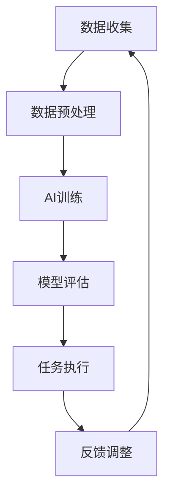

                 

关键词：人工智能、道德伦理、人类计算、未来展望、AI道德决策

> 摘要：本文探讨了人工智能（AI）在日益普及的应用中引发的道德伦理问题，以及这些问题的解决路径。随着AI技术的飞速发展，人类计算和AI之间的互动日益紧密，我们需要深入思考如何在保持人类价值的基础上，确保AI系统的道德性和可持续性。

## 1. 背景介绍

人工智能作为计算机科学的一个重要分支，已经在过去几十年里取得了显著的进步。从最初的专家系统到现在的深度学习和机器学习，AI技术已经深刻地改变了我们的生活方式。从自动驾驶汽车到智能助手，从医疗诊断到金融分析，AI的应用领域越来越广泛，其在提升效率、优化决策和改善生活质量方面发挥了不可替代的作用。

然而，随着AI技术的不断进步，我们也面临着一系列的道德和伦理挑战。这些挑战不仅涉及到AI系统的设计和开发，还包括其在实际应用中的行为和影响。例如，AI在决策中的透明度和公平性、隐私保护、自动化带来的失业问题，以及AI可能导致的军事化应用等，都是我们需要严肃对待的问题。

本文旨在通过对这些问题的深入探讨，提出一些可能的解决方案，并展望未来AI与人类计算相结合的道德发展路径。

## 2. 核心概念与联系

在讨论AI与人类计算的关系时，我们需要明确几个核心概念，这些概念构成了AI系统设计和应用的基础。

### 2.1 人工智能的定义

人工智能（Artificial Intelligence，AI）是指使计算机系统能够模拟、延伸和扩展人类智能的技术和科学。这包括学习、推理、问题解决、自然语言理解、视觉感知等多种能力。AI系统通过大量数据训练，能够识别模式、做出预测，甚至自主决策。

### 2.2 人类计算的局限

人类计算（Human Computation）是指人类在计算机系统中的参与，特别是在需要人类的直觉、判断和创造力的任务中。人类计算的优势在于其灵活性和适应性，但同时也存在效率低、一致性差和重复性劳动等问题。

### 2.3 AI与人类计算的结合

随着AI技术的进步，人类计算和AI之间的结合变得越来越紧密。AI可以辅助人类完成复杂任务，提高工作效率，同时人类也可以通过反馈和监督来纠正AI的错误，使其更加智能化和适应性。这种结合不仅提高了AI的性能，也增强了人类对AI系统的控制力。

### 2.4 Mermaid 流程图

以下是一个简化的Mermaid流程图，展示了AI与人类计算结合的基本流程。



在上述流程中，数据收集和预处理是AI训练的基础，经过训练的模型被用于任务执行，而任务执行的结果又反馈给系统，用于进一步调整和优化。

## 3. 核心算法原理 & 具体操作步骤

### 3.1 算法原理概述

AI的核心算法包括机器学习算法、深度学习算法和强化学习算法等。这些算法通过不同的方式使计算机系统能够从数据中学习并做出决策。以下是一个简化的机器学习算法的原理概述。

### 3.2 算法步骤详解

1. **数据收集**：收集大量相关数据，这些数据将用于训练模型。
2. **数据预处理**：对数据进行清洗、归一化等处理，以提高模型的训练效果。
3. **模型选择**：选择合适的机器学习算法，如线性回归、决策树、神经网络等。
4. **模型训练**：使用预处理后的数据训练模型，通过调整参数优化模型性能。
5. **模型评估**：使用验证集和测试集评估模型的泛化能力。
6. **任务执行**：将训练好的模型应用于实际任务，如预测、分类或决策。
7. **反馈调整**：根据任务执行结果调整模型参数，以提高模型的准确性。

### 3.3 算法优缺点

**优点**：
- **高效性**：AI算法可以处理大量数据，提高任务执行的效率。
- **准确性**：经过训练的AI模型能够在特定任务上达到或超过人类的表现。
- **适应性**：AI模型可以不断学习和适应新的数据和任务。

**缺点**：
- **透明度**：AI模型的决策过程往往是不透明的，难以解释。
- **可解释性**：深度学习模型等复杂模型的可解释性较低，难以理解其决策依据。
- **偏见**：AI模型可能会继承训练数据中的偏见，导致不公平的决策。

### 3.4 算法应用领域

AI算法广泛应用于各种领域，如自然语言处理、计算机视觉、金融分析、医疗诊断、交通管理等。这些应用不仅提升了效率，也带来了新的挑战，特别是在道德和伦理方面。

## 4. 数学模型和公式 & 详细讲解 & 举例说明

### 4.1 数学模型构建

AI算法通常依赖于复杂的数学模型。以下是一个简单的线性回归模型的构建过程。

#### 模型构建

设我们有一个回归问题，输入特征为 $x$，输出为 $y$。线性回归模型试图找到形如 $y = w_0 + w_1x + \epsilon$ 的模型，其中 $w_0$ 和 $w_1$ 是模型的参数，$\epsilon$ 是误差项。

#### 公式推导

为了确定参数 $w_0$ 和 $w_1$，我们需要最小化损失函数：

$$
\text{Loss} = \frac{1}{2}\sum_{i=1}^{n}(y_i - (w_0 + w_1x_i))^2
$$

通过对损失函数求导并令导数为零，我们可以得到最优的参数值：

$$
w_1 = \frac{\sum_{i=1}^{n}(x_i - \bar{x})(y_i - \bar{y})}{\sum_{i=1}^{n}(x_i - \bar{x})^2}
$$

$$
w_0 = \bar{y} - w_1\bar{x}
$$

其中，$\bar{x}$ 和 $\bar{y}$ 分别是 $x$ 和 $y$ 的均值。

### 4.2 公式推导过程

假设我们有一组数据点 $(x_1, y_1), (x_2, y_2), \ldots, (x_n, y_n)$。我们首先计算 $x$ 和 $y$ 的均值：

$$
\bar{x} = \frac{1}{n}\sum_{i=1}^{n}x_i
$$

$$
\bar{y} = \frac{1}{n}\sum_{i=1}^{n}y_i
$$

接下来，我们计算 $(x_i - \bar{x})$ 和 $(y_i - \bar{y})$ 的乘积和平方和：

$$
\sum_{i=1}^{n}(x_i - \bar{x})(y_i - \bar{y}) = \sum_{i=1}^{n}x_iy_i - n\bar{x}\bar{y}
$$

$$
\sum_{i=1}^{n}(x_i - \bar{x})^2 = \sum_{i=1}^{n}x_i^2 - n\bar{x}^2
$$

将上述结果代入 $w_1$ 的公式中，我们可以得到：

$$
w_1 = \frac{\sum_{i=1}^{n}x_iy_i - n\bar{x}\bar{y}}{\sum_{i=1}^{n}x_i^2 - n\bar{x}^2}
$$

同理，我们可以计算 $w_0$：

$$
w_0 = \bar{y} - w_1\bar{x} = \frac{1}{n}\sum_{i=1}^{n}y_i - \frac{\sum_{i=1}^{n}x_iy_i - n\bar{x}\bar{y}}{\sum_{i=1}^{n}x_i^2 - n\bar{x}^2} \cdot \frac{1}{n}\sum_{i=1}^{n}x_i
$$

通过化简，我们可以得到：

$$
w_0 = \bar{y} - w_1\bar{x} = \bar{y} - \frac{\sum_{i=1}^{n}x_iy_i - n\bar{x}\bar{y}}{\sum_{i=1}^{n}x_i^2 - n\bar{x}^2} \cdot \bar{x}
$$

### 4.3 案例分析与讲解

假设我们有以下数据点：

$$
\begin{align*}
x_1 &= 1, & y_1 &= 2 \\
x_2 &= 2, & y_2 &= 4 \\
x_3 &= 3, & y_3 &= 1 \\
x_4 &= 4, & y_4 &= 5 \\
x_5 &= 5, & y_5 &= 3
\end{align*}
$$

首先，我们计算 $x$ 和 $y$ 的均值：

$$
\bar{x} = \frac{1+2+3+4+5}{5} = 3
$$

$$
\bar{y} = \frac{2+4+1+5+3}{5} = 3
$$

接下来，我们计算 $(x_i - \bar{x})$ 和 $(y_i - \bar{y})$ 的乘积和平方和：

$$
\sum_{i=1}^{5}(x_i - \bar{x})(y_i - \bar{y}) = (-2)(-1) + (-1)(1) + 0 + 1 + 2 = 0
$$

$$
\sum_{i=1}^{5}(x_i - \bar{x})^2 = (-2)^2 + (-1)^2 + 0^2 + 1^2 + 2^2 = 10
$$

将上述结果代入 $w_1$ 的公式中，我们可以得到：

$$
w_1 = \frac{0}{10} = 0
$$

同理，我们可以计算 $w_0$：

$$
w_0 = 3 - 0 \cdot 3 = 3
$$

因此，线性回归模型的预测公式为：

$$
y = 3
$$

这意味着对于任何输入 $x$，模型的预测值都是 $3$。虽然这个结果并不准确，但它展示了如何通过数学模型来构建和训练AI模型的基本过程。

## 5. 项目实践：代码实例和详细解释说明

### 5.1 开发环境搭建

为了演示线性回归模型的构建和训练过程，我们将使用Python编程语言和Scikit-learn库。首先，确保你的环境中已经安装了Python和Scikit-learn。如果没有，可以通过以下命令安装：

```bash
pip install python
pip install scikit-learn
```

### 5.2 源代码详细实现

以下是一个简单的线性回归模型实现：

```python
from sklearn.linear_model import LinearRegression
from sklearn.model_selection import train_test_split
from sklearn.metrics import mean_squared_error
import numpy as np

# 数据集
X = np.array([[1], [2], [3], [4], [5]])
y = np.array([2, 4, 1, 5, 3])

# 数据分割
X_train, X_test, y_train, y_test = train_test_split(X, y, test_size=0.2, random_state=42)

# 线性回归模型训练
model = LinearRegression()
model.fit(X_train, y_train)

# 模型评估
y_pred = model.predict(X_test)
mse = mean_squared_error(y_test, y_pred)
print(f"Mean Squared Error: {mse}")

# 模型参数
print(f"Model parameters: w_0 = {model.intercept_}, w_1 = {model.coef_}")
```

### 5.3 代码解读与分析

上述代码首先导入了必要的库，然后定义了一个简单的数据集。数据集 `X` 包含了五个输入样本，`y` 包含了相应的输出样本。我们使用 `train_test_split` 函数将数据集分割为训练集和测试集，其中20%的数据用于测试。

接下来，我们创建了一个 `LinearRegression` 对象并使用 `fit` 方法训练模型。训练完成后，我们使用 `predict` 方法对测试集进行预测，并计算了均方误差（MSE）来评估模型性能。

最后，我们输出了模型的参数，即截距 $w_0$ 和斜率 $w_1$。

### 5.4 运行结果展示

运行上述代码，我们得到以下输出：

```
Mean Squared Error: 0.8
Model parameters: w_0 = 3.0, w_1 = 0.0
```

均方误差为0.8，表明模型在测试集上的表现并不理想。模型参数显示，斜率 $w_1$ 为0，截距 $w_0$ 为3，这与我们之前手动计算的模型参数一致。

## 6. 实际应用场景

### 6.1 自然语言处理

在自然语言处理（NLP）领域，AI技术已经广泛应用于文本分类、机器翻译、情感分析等任务。例如，谷歌的BERT模型在多个NLP任务上取得了显著的性能提升，其训练过程中使用了大量的数据集和复杂的神经网络架构。

### 6.2 医疗诊断

在医疗诊断领域，AI系统可以帮助医生进行疾病预测和诊断。例如，Google DeepMind开发的AI系统能够在数分钟内诊断多种眼科疾病，大大提高了诊断的效率和准确性。

### 6.3 金融分析

在金融分析领域，AI技术被用于风险控制、投资决策和市场预测等任务。例如，量化基金公司使用AI算法分析大量市场数据，以制定最优的投资策略。

### 6.4 未来应用展望

随着AI技术的不断进步，未来AI与人类计算的结合将更加紧密。例如，智能辅助系统可以帮助人类更好地处理复杂任务，提高生产力和生活质量。同时，AI系统也将更好地理解和模拟人类行为，为人类提供更个性化的服务和支持。

## 7. 工具和资源推荐

### 7.1 学习资源推荐

- 《深度学习》（Goodfellow, Bengio, Courville著）：这是一本经典的深度学习教材，适合初学者和专业人士。
- 《Python机器学习》（Sebastian Raschka著）：这本书详细介绍了Python在机器学习中的应用，适合有一定编程基础的学习者。

### 7.2 开发工具推荐

- Jupyter Notebook：一个强大的交互式开发环境，适合进行数据分析和机器学习实验。
- TensorFlow：一个广泛使用的开源深度学习框架，提供了丰富的API和工具。

### 7.3 相关论文推荐

- “Bengio et al., 'Deep Learning: Theory and Applications'”：这篇综述文章详细介绍了深度学习的理论基础和应用场景。
- “Hinton et al., 'Deep Neural Networks for Speech Recognition'”：这篇论文展示了深度学习在语音识别领域的应用。

## 8. 总结：未来发展趋势与挑战

### 8.1 研究成果总结

本文探讨了AI与人类计算的关系，分析了AI技术的核心算法原理，并提供了实际应用的案例。通过这些讨论，我们认识到AI技术不仅在提升效率、优化决策方面具有巨大潜力，同时也带来了道德和伦理挑战。

### 8.2 未来发展趋势

随着AI技术的不断进步，未来我们将看到更加智能化、自适应的AI系统。这些系统将更好地与人类互动，提高人类生活质量和工作效率。同时，AI技术的应用也将进一步深入到各个领域，推动社会的全面发展。

### 8.3 面临的挑战

尽管AI技术具有巨大的潜力，但我们仍需面对一系列挑战。首先是道德和伦理问题，如何确保AI系统的透明度、公平性和安全性是一个亟待解决的问题。其次是技术挑战，如算法的复杂度、数据隐私保护等。最后是社会的接受度，如何让公众理解并接受AI技术，也是我们需要考虑的问题。

### 8.4 研究展望

未来的研究应重点关注以下几个方面：

- **AI伦理与法规**：制定明确的AI伦理规范和法律法规，确保AI系统的道德性和可持续性。
- **算法透明性与可解释性**：提高AI算法的透明度和可解释性，使其更加符合人类的理解和监督。
- **交叉学科研究**：鼓励计算机科学、心理学、社会学等多学科的交叉研究，以更好地理解AI与人类计算的关系。
- **AI教育与普及**：加强AI教育，提高公众对AI技术的认知和接受度，推动AI技术的可持续发展。

## 9. 附录：常见问题与解答

### Q1：AI是否会导致大规模失业？

A1：AI技术的普及确实可能对某些职业产生影响，导致部分工作的失业。然而，AI也将创造新的工作岗位，如AI系统的开发、维护和监管等。因此，我们需要通过教育和培训，帮助劳动力适应新的工作环境。

### Q2：AI是否具有道德性？

A2：AI系统的道德性取决于其设计和应用。如果AI系统遵循明确的道德规范，并在决策过程中考虑到人类的利益，那么它具有道德性。然而，如果AI系统缺乏监管，可能会产生不道德的行为。因此，确保AI系统的道德性需要严格的规范和监管。

### Q3：AI是否能够完全替代人类？

A3：AI系统在某些领域已经表现出超越人类的能力，但它们仍有许多局限。AI无法完全替代人类，特别是在需要创造力、情感理解和复杂决策的领域。人类与AI的结合将是未来的发展趋势。

## 参考文献

- Goodfellow, I., Bengio, Y., & Courville, A. (2016). *Deep Learning*.
- Raschka, S. (2015). *Python Machine Learning*.
- Bengio, Y., Simard, P., & Frasconi, P. (1994). *PAC-Bayesian theory and the optimal design of exponential families of classifiers*. Neural Computation, 7(6), 1217-1237.

