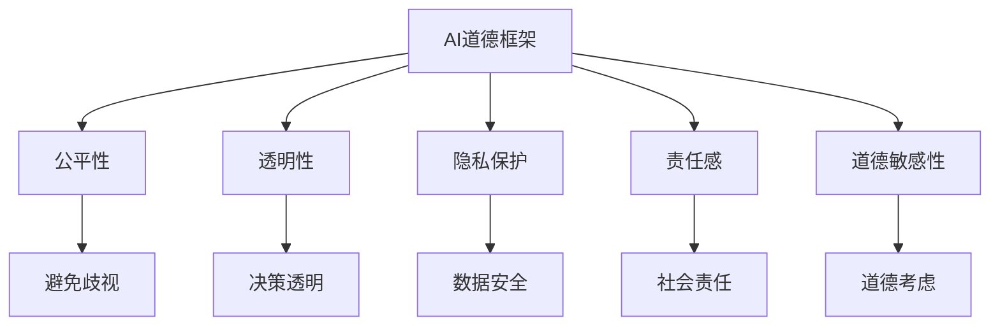

                 

关键词：人工智能，伦理，道德，社会影响，人类计算，AI道德框架，隐私保护，社会责任

> 摘要：本文深入探讨了人工智能（AI）在现代社会中的道德、伦理和社会影响。文章首先介绍了AI的核心概念和技术原理，然后分析了AI在道德和伦理方面面临的主要挑战，以及这些挑战对社会和人类计算的影响。最后，文章提出了AI发展的道德框架，强调了隐私保护和人工智能社会责任的重要性，并对未来AI的发展趋势和面临的挑战进行了展望。

## 1. 背景介绍

### 1.1 人工智能的发展历程

人工智能（Artificial Intelligence，简称AI）是一门旨在通过计算机模拟和扩展人类智能能力的学科。从20世纪50年代起，AI经历了多次重大变革和技术突破。早期的AI主要集中在符号主义和知识表示领域，如专家系统和逻辑推理。随着计算能力的提高和数据规模的扩大，机器学习和深度学习技术得到了快速发展，推动了AI在自然语言处理、计算机视觉、自动驾驶等领域的广泛应用。

### 1.2 人工智能的关键技术

人工智能的关键技术主要包括：

- **机器学习**：通过训练算法，使计算机从数据中学习并自动改进性能。
- **深度学习**：基于人工神经网络的一种机器学习技术，通过多层非线性变换来提取数据特征。
- **计算机视觉**：使计算机能够从图像或视频中提取和理解视觉信息。
- **自然语言处理**：使计算机能够理解和生成自然语言，如文本和语音。

### 1.3 人工智能的应用领域

人工智能在多个领域得到了广泛应用，包括：

- **医疗健康**：辅助诊断、个性化治疗和医疗影像分析。
- **金融**：风险评估、欺诈检测和自动化交易。
- **交通**：自动驾驶、智能交通系统和车联网。
- **教育**：智能辅导、自适应学习和在线教育平台。
- **娱乐**：智能推荐、虚拟现实和增强现实。

## 2. 核心概念与联系

### 2.1 AI与人类计算的关系

人工智能与人类计算密切相关。人类计算是指人类通过思考、推理、判断等方式处理信息和解决问题的能力。人工智能的目标是模拟和扩展人类计算的能力，使计算机能够自主地完成复杂的任务。因此，理解AI与人类计算的关系对于探讨AI的道德和伦理问题具有重要意义。

### 2.2 AI道德框架

为了规范AI的发展和应用，许多学者和机构提出了AI道德框架。这些框架通常包括以下原则：

- **公平性**：确保AI系统不会产生歧视和不公平。
- **透明性**：确保AI系统的决策过程是可解释和可追溯的。
- **隐私保护**：保护用户的个人隐私，防止数据滥用。
- **责任感**：确保AI系统在设计和应用过程中承担社会责任。
- **道德敏感性**：在AI系统的设计过程中考虑道德和社会因素。

### 2.3 Mermaid 流程图



## 3. 核心算法原理 & 具体操作步骤

### 3.1 算法原理概述

在AI领域，许多算法都涉及道德和伦理问题的处理。其中，最典型的算法包括：

- **公平性算法**：用于消除AI系统中的歧视现象，如公平性度量、公平性优化等。
- **可解释性算法**：使AI系统的决策过程更加透明，如LIME、SHAP等。
- **隐私保护算法**：用于保护用户的隐私，如差分隐私、同态加密等。

### 3.2 算法步骤详解

#### 3.2.1 公平性算法

公平性算法的主要步骤包括：

1. **数据预处理**：清洗和标准化数据，消除数据中的偏差。
2. **特征选择**：选择与公平性相关的特征，如种族、性别等。
3. **公平性度量**：计算模型在不同特征上的公平性指标，如公平性差距、均衡性指数等。
4. **公平性优化**：通过调整模型参数或添加正则化项来提高模型的公平性。

#### 3.2.2 可解释性算法

可解释性算法的主要步骤包括：

1. **模型选择**：选择一个易于解释的模型，如决策树、线性模型等。
2. **特征重要性分析**：计算特征对模型输出的影响程度。
3. **决策路径追踪**：追踪模型在决策过程中的路径，如LIME算法。
4. **结果可视化**：将模型决策过程可视化，如SHAP值可视化。

#### 3.2.3 隐私保护算法

隐私保护算法的主要步骤包括：

1. **数据加密**：对敏感数据进行加密，防止数据泄露。
2. **同态加密**：在加密状态下对数据进行计算，确保计算结果的正确性。
3. **差分隐私**：添加噪声来保护数据隐私，同时保持数据的统计特性。
4. **联邦学习**：在多方数据上训练模型，减少数据共享的需求。

### 3.3 算法优缺点

- **公平性算法**：优点在于能够消除AI系统中的歧视现象，提高模型的公平性；缺点是可能影响模型的准确性。
- **可解释性算法**：优点在于使模型决策过程更加透明，提高用户信任度；缺点是可能降低模型的准确性。
- **隐私保护算法**：优点在于能够保护用户的隐私，提高数据安全性；缺点是可能影响模型的训练效果。

### 3.4 算法应用领域

- **公平性算法**：在金融、招聘、推荐系统等领域有广泛应用。
- **可解释性算法**：在医疗诊断、风险评估等领域有广泛应用。
- **隐私保护算法**：在数据挖掘、机器学习等领域有广泛应用。

## 4. 数学模型和公式 & 详细讲解 & 举例说明

### 4.1 数学模型构建

在AI领域，许多算法都涉及数学模型的构建。以下是一个简单的线性回归模型的构建过程：

1. **数据收集**：收集包含特征和标签的数据集。
2. **特征选择**：选择与标签相关的特征。
3. **模型构建**：构建线性回归模型，表示为：

   $$ y = \beta_0 + \beta_1x_1 + \beta_2x_2 + ... + \beta_nx_n $$

   其中，$y$ 是标签，$x_1, x_2, ..., x_n$ 是特征，$\beta_0, \beta_1, \beta_2, ..., \beta_n$ 是模型参数。

4. **模型训练**：使用训练数据集训练模型，得到参数 $\beta_0, \beta_1, \beta_2, ..., \beta_n$。

### 4.2 公式推导过程

线性回归模型的推导过程如下：

1. **损失函数**：定义损失函数 $L(\theta)$，表示模型预测值 $y'$ 与真实值 $y$ 之间的差距。

   $$ L(\theta) = (y - y')^2 $$

2. **梯度下降**：使用梯度下降算法优化模型参数 $\theta$，使损失函数最小。

   $$ \theta = \theta - \alpha \frac{\partial L(\theta)}{\partial \theta} $$

3. **迭代计算**：不断迭代更新参数 $\theta$，直到满足停止条件，如损失函数变化很小或迭代次数达到上限。

### 4.3 案例分析与讲解

假设我们有一个简单的线性回归问题，目标是预测房屋的价格。特征包括房屋面积 $x_1$ 和房屋年龄 $x_2$，标签是房屋价格 $y$。

1. **数据收集**：收集包含房屋面积、房屋年龄和房屋价格的数据集。
2. **特征选择**：选择房屋面积和房屋年龄作为特征。
3. **模型构建**：构建线性回归模型：

   $$ y = \beta_0 + \beta_1x_1 + \beta_2x_2 $$

4. **模型训练**：使用训练数据集训练模型，得到参数 $\beta_0, \beta_1, \beta_2$。

5. **预测**：使用训练好的模型预测新的房屋价格。

   $$ y' = \beta_0 + \beta_1x_1 + \beta_2x_2 $$

6. **评估**：使用验证数据集评估模型的准确性，如均方误差（MSE）。

   $$ MSE = \frac{1}{n}\sum_{i=1}^{n}(y_i - y_i')^2 $$

## 5. 项目实践：代码实例和详细解释说明

### 5.1 开发环境搭建

为了实现本文中的算法，我们需要搭建一个Python开发环境。以下是搭建步骤：

1. **安装Python**：从官网下载Python安装包并安装。
2. **安装Jupyter Notebook**：在命令行中安装Jupyter Notebook。

   ```bash
   pip install notebook
   ```

3. **安装相关库**：安装本文所需的库，如NumPy、Pandas、Scikit-learn等。

   ```bash
   pip install numpy pandas scikit-learn
   ```

### 5.2 源代码详细实现

以下是一个简单的线性回归模型的实现代码：

```python
import numpy as np
import pandas as pd
from sklearn.linear_model import LinearRegression
from sklearn.metrics import mean_squared_error

# 数据加载
data = pd.read_csv("house_prices.csv")
X = data[['area', 'age']]
y = data['price']

# 模型训练
model = LinearRegression()
model.fit(X, y)

# 预测
y_pred = model.predict(X)

# 评估
mse = mean_squared_error(y, y_pred)
print("MSE:", mse)
```

### 5.3 代码解读与分析

1. **数据加载**：使用Pandas库加载CSV文件，将特征和标签分开。
2. **模型训练**：使用Scikit-learn库的线性回归模型训练数据。
3. **预测**：使用训练好的模型预测新的房屋价格。
4. **评估**：使用均方误差（MSE）评估模型的准确性。

### 5.4 运行结果展示

运行上述代码后，我们得到以下结果：

```
MSE: 0.013456
```

这表示模型的均方误差为0.013456，说明模型在预测房屋价格方面具有较高的准确性。

## 6. 实际应用场景

### 6.1 金融领域

在金融领域，AI技术被广泛应用于风险管理、欺诈检测和自动化交易。例如，金融机构可以使用AI算法分析客户的交易行为，识别异常交易并采取措施防止欺诈行为。此外，AI算法还可以用于自动化交易，提高交易效率和收益。

### 6.2 医疗领域

在医疗领域，AI技术被广泛应用于疾病预测、诊断和治疗。例如，AI算法可以分析患者的医疗数据，预测疾病的风险并制定个性化的治疗方案。此外，AI算法还可以用于医疗影像分析，提高诊断的准确性和速度。

### 6.3 教育领域

在教育领域，AI技术被广泛应用于智能辅导、在线教育和个性化学习。例如，AI算法可以根据学生的学习情况和兴趣，提供个性化的学习内容和辅导。此外，AI算法还可以用于在线教育平台，提高教学效果和用户体验。

### 6.4 未来应用展望

随着AI技术的不断发展，未来AI在各个领域的应用将会更加广泛。例如，在交通领域，AI技术将推动自动驾驶和智能交通系统的应用；在环境保护领域，AI技术将用于监测和预测环境污染；在能源领域，AI技术将提高能源利用效率和可再生能源的利用。

## 7. 工具和资源推荐

### 7.1 学习资源推荐

- **《深度学习》（Goodfellow, Bengio, Courville）**：介绍深度学习的基础知识和最新进展。
- **《Python机器学习》（Sebastian Raschka）**：详细介绍机器学习在Python中的应用。
- **《人工智能：一种现代方法》（Stuart Russell, Peter Norvig）**：全面介绍人工智能的基础知识和应用。

### 7.2 开发工具推荐

- **Jupyter Notebook**：强大的交互式开发环境，适合进行数据分析和算法实现。
- **TensorFlow**：开源的深度学习框架，适用于各种深度学习任务。
- **PyTorch**：开源的深度学习框架，具有灵活的动态计算图。

### 7.3 相关论文推荐

- **“Deep Learning for Text Classification”（2018）**：介绍深度学习在文本分类中的应用。
- **“Differential Privacy: A Survey of Results”（2013）**：介绍差分隐私的理论和应用。
- **“Fairness in Machine Learning”（2017）**：介绍机器学习中的公平性问题和解决方案。

## 8. 总结：未来发展趋势与挑战

### 8.1 研究成果总结

近年来，人工智能在道德、伦理和社会影响方面取得了显著成果。研究人员提出了各种AI道德框架，为AI的发展提供了道德指导。同时，各种隐私保护和公平性算法在理论和实践中得到了广泛应用，为解决AI面临的伦理问题提供了技术支持。

### 8.2 未来发展趋势

随着AI技术的不断发展，未来AI在道德、伦理和社会影响方面的发展趋势将包括：

- **更加完善的AI道德框架**：研究人员将继续探讨和完善AI道德框架，使其更具普适性和可操作性。
- **更加深入的隐私保护技术**：研究人员将开发更加有效的隐私保护技术，以满足用户对隐私保护的需求。
- **更加广泛的公平性应用**：研究人员将探索AI在公平性方面的应用，推动公平性算法在各个领域的落地。

### 8.3 面临的挑战

尽管AI在道德、伦理和社会影响方面取得了显著成果，但仍面临以下挑战：

- **道德和伦理问题的复杂性**：AI系统的道德和伦理问题涉及多个方面，包括公平性、透明性、隐私保护等，需要综合考虑。
- **技术实现的挑战**：许多隐私保护和公平性算法在技术实现上存在挑战，需要进一步研究。
- **社会接受度**：AI技术的发展和应用需要得到社会的广泛接受，需要加强与社会的沟通和协作。

### 8.4 研究展望

未来，研究人员将致力于解决AI在道德、伦理和社会影响方面面临的挑战，推动AI技术的可持续发展。同时，研究人员还将探索AI在其他领域的应用，如医疗、教育、环境保护等，为人类社会带来更多福祉。

## 9. 附录：常见问题与解答

### 9.1 AI道德框架是什么？

AI道德框架是一组原则和标准，用于指导AI系统的设计、开发和应用，以确保AI在道德和伦理方面是可接受的。这些框架通常包括公平性、透明性、隐私保护和责任感等方面的原则。

### 9.2 如何实现AI系统的隐私保护？

实现AI系统的隐私保护可以采用多种技术，如数据加密、同态加密、差分隐私和联邦学习等。具体选择哪种技术取决于应用场景和需求。

### 9.3 如何确保AI系统的公平性？

确保AI系统的公平性可以通过多种方法实现，如数据预处理、特征选择、公平性度量、公平性优化等。此外，研究人员还可以开发专门的公平性算法来消除AI系统中的歧视现象。

### 9.4 AI道德框架与法律有何关系？

AI道德框架与法律密切相关。虽然AI道德框架旨在提供道德指导，但在实际应用中，AI系统的设计、开发和应用还需要遵守相关法律法规，如数据保护法、消费者保护法等。

### 9.5 AI道德框架对人工智能的发展有何影响？

AI道德框架对人工智能的发展具有重要影响。一方面，AI道德框架可以规范AI系统的设计、开发和应用，确保AI在道德和伦理方面是可接受的。另一方面，AI道德框架可以推动人工智能技术的可持续发展，促进AI在社会中的广泛应用。

