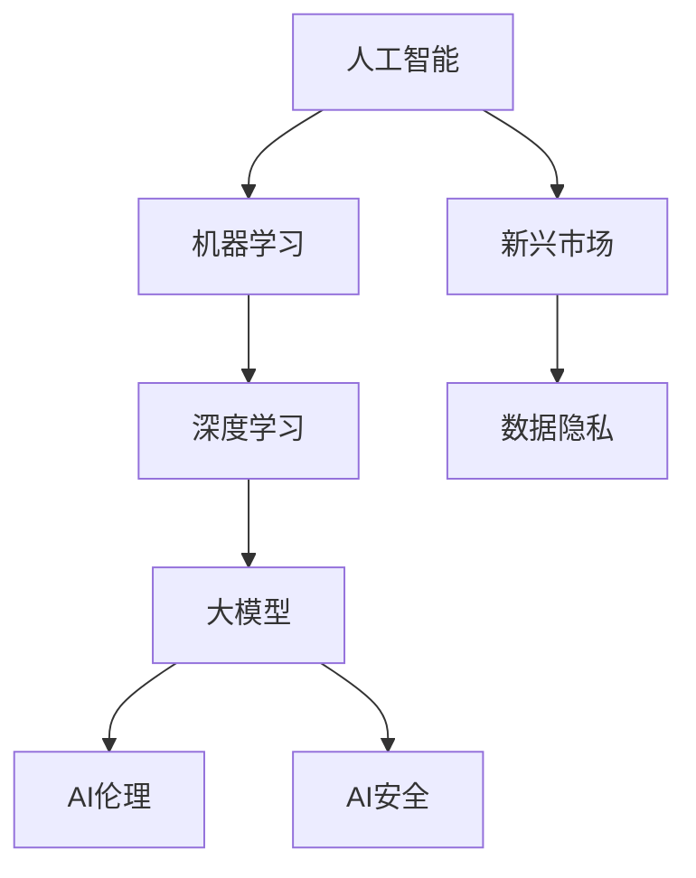
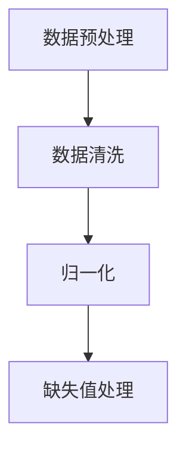
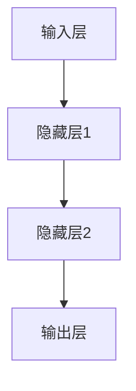
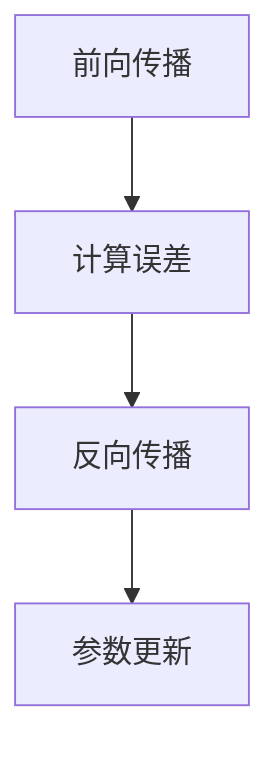
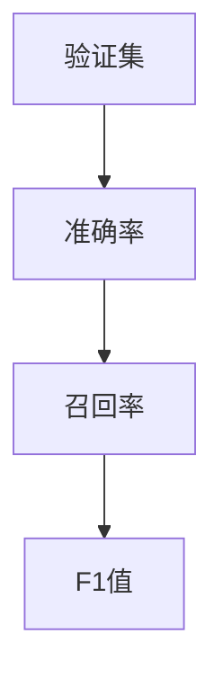

                 

关键词：人工智能，AI伦理，安全，大模型，新兴市场，算法，数学模型，项目实践，应用场景，未来展望。

> 摘要：随着人工智能技术的迅猛发展，大模型的应用日益广泛，尤其在新兴市场地区。然而，AI伦理和安全问题随之而来。本文将对AI伦理与安全的核心理念进行深入探讨，分析大模型应用中的挑战和解决方案，并展望未来发展趋势与面临的挑战。

## 1. 背景介绍

人工智能（AI）作为当今科技发展的前沿领域，已经在多个行业和领域取得了显著的成果。尤其是大模型的崛起，使得机器学习算法在图像识别、自然语言处理、推荐系统等方面取得了突破性进展。大模型通常具有数十亿甚至千亿级别的参数，通过深度学习等方式进行训练，能够在海量数据中提取出高层次的抽象特征。

然而，大模型的应用也带来了诸多挑战，特别是在新兴市场地区。新兴市场通常具有人口众多、经济发展迅速、信息化程度较低等特点。这些地区对于AI技术的需求极为迫切，但同时也面临着技术人才短缺、基础设施不足、数据隐私保护等问题。此外，AI伦理和安全问题在大模型应用中尤为重要，因为它们直接关系到用户权益、社会公平和信息安全等方面。

本文将围绕AI伦理与安全这一核心主题，探讨大模型在新兴市场中的应用，分析其中存在的问题和挑战，并提出相应的解决方案和未来展望。

## 2. 核心概念与联系

为了更好地理解AI伦理与安全在大模型应用中的重要性，我们需要首先明确几个核心概念，并探讨它们之间的联系。

### 2.1 人工智能与机器学习

人工智能（AI）是指计算机系统模拟人类智能行为的能力，包括学习、推理、感知、通信等方面。机器学习（ML）是人工智能的一个分支，主要关注通过算法从数据中自动学习和改进性能的过程。

### 2.2 大模型与深度学习

大模型通常是指具有数百万到数十亿参数的神经网络模型。深度学习（DL）是一种基于多层神经网络的结构，能够通过逐层学习数据中的特征，从而实现复杂的任务。深度学习是构建大模型的基础。

### 2.3 AI伦理与安全

AI伦理涉及道德原则和规范，用于指导AI系统设计和应用过程中的决策。AI安全则关注防止AI系统被恶意利用或遭受攻击。

### 2.4 新兴市场与数据隐私

新兴市场通常拥有丰富的数据资源，但由于基础设施和人才储备不足，数据隐私保护面临挑战。因此，如何在保证数据隐私的前提下充分利用数据资源，是新兴市场面临的重要问题。

下面，我们将通过一个Mermaid流程图来展示这些核心概念之间的联系。



## 3. 核心算法原理 & 具体操作步骤

### 3.1 算法原理概述

大模型通常基于深度学习算法，通过多层神经网络进行参数训练，从而实现复杂的任务。深度学习算法的核心在于通过反向传播（Backpropagation）和优化算法（如随机梯度下降SGD）来不断调整网络参数，以最小化预测误差。

### 3.2 算法步骤详解

#### 步骤1：数据预处理

首先，对输入数据进行预处理，包括数据清洗、归一化、缺失值处理等，以确保数据质量。



#### 步骤2：构建神经网络

接着，根据任务需求设计神经网络结构，包括输入层、隐藏层和输出层。每个层由多个神经元组成，每个神经元通过权重和偏置进行连接。



#### 步骤3：训练模型

使用预处理后的数据对神经网络进行训练。在训练过程中，通过反向传播算法不断更新网络参数，以最小化预测误差。



#### 步骤4：评估模型

在训练完成后，使用验证集对模型进行评估，以确定其性能。常见的评估指标包括准确率、召回率、F1值等。



### 3.3 算法优缺点

**优点：**

- **强大的表示能力**：深度学习算法能够通过多层神经网络提取高层次的抽象特征，从而实现复杂的任务。
- **自动特征提取**：大模型不需要人工设计特征，能够自动从数据中学习特征，提高模型的泛化能力。

**缺点：**

- **计算资源消耗大**：大模型需要大量的计算资源和时间进行训练。
- **模型可解释性差**：深度学习模型通常具有黑盒特性，难以解释其内部决策过程。

### 3.4 算法应用领域

大模型在多个领域取得了显著的应用成果，包括：

- **图像识别**：用于人脸识别、车辆识别等任务。
- **自然语言处理**：用于机器翻译、文本分类等任务。
- **推荐系统**：用于推荐商品、音乐、视频等。

## 4. 数学模型和公式 & 详细讲解 & 举例说明

### 4.1 数学模型构建

深度学习中的数学模型主要包括损失函数、激活函数、优化算法等。以下是这些模型的构建过程。

#### 损失函数

损失函数用于衡量模型预测值与真实值之间的差距。常见的损失函数包括均方误差（MSE）、交叉熵（CE）等。

$$
MSE(y, \hat{y}) = \frac{1}{n}\sum_{i=1}^{n}(y_i - \hat{y_i})^2
$$

$$
CE(y, \hat{y}) = -\frac{1}{n}\sum_{i=1}^{n}y_i\log(\hat{y_i})
$$

其中，$y$为真实值，$\hat{y}$为预测值，$n$为样本数量。

#### 激活函数

激活函数用于引入非线性因素，使神经网络具有更强的表示能力。常见的激活函数包括ReLU、Sigmoid、Tanh等。

$$
ReLU(x) = \max(0, x)
$$

$$
Sigmoid(x) = \frac{1}{1 + e^{-x}}
$$

$$
Tanh(x) = \frac{e^x - e^{-x}}{e^x + e^{-x}}
$$

#### 优化算法

优化算法用于调整模型参数，以最小化损失函数。常见的优化算法包括随机梯度下降（SGD）、Adam等。

$$
w_{t+1} = w_t - \alpha \cdot \nabla_w J(w_t)
$$

其中，$w_t$为当前参数，$\alpha$为学习率，$\nabla_w J(w_t)$为损失函数关于参数的梯度。

### 4.2 公式推导过程

以下是对深度学习中的损失函数和优化算法的推导过程进行讲解。

#### 均方误差（MSE）推导

均方误差（MSE）的推导相对简单。我们假设模型预测值为$\hat{y}$，真实值为$y$，则MSE可以表示为：

$$
MSE(y, \hat{y}) = \frac{1}{n}\sum_{i=1}^{n}(y_i - \hat{y_i})^2
$$

其中，$n$为样本数量。

#### 随机梯度下降（SGD）推导

随机梯度下降（SGD）是一种优化算法，用于调整模型参数以最小化损失函数。以下是SGD的推导过程：

假设损失函数为$J(w)$，其中$w$为模型参数。我们希望找到使$J(w)$最小的$w$。

首先，计算损失函数关于参数$w$的梯度：

$$
\nabla_w J(w) = \frac{\partial J(w)}{\partial w}
$$

接下来，我们使用随机样本来近似梯度。假设我们有$m$个样本，随机选择其中一个样本$(x_i, y_i)$，则该样本的梯度为：

$$
\nabla_w J(w) \approx \frac{\partial J(w)}{\partial w} \approx \frac{\partial J(w)}{\partial w} \approx \frac{\partial J(x_i, y_i, w)}{\partial w}
$$

然后，我们使用学习率$\alpha$来更新参数：

$$
w_{t+1} = w_t - \alpha \cdot \nabla_w J(w_t)
$$

其中，$w_t$为当前参数，$\alpha$为学习率。

### 4.3 案例分析与讲解

为了更好地理解上述数学模型和公式的应用，我们以下提供一个简单的案例进行讲解。

#### 案例背景

假设我们有一个简单的线性回归问题，目标是预测房价。已知特征包括房屋面积和地点，目标值为房价。

#### 案例分析

1. **数据预处理**：对房屋面积和地点进行归一化处理，以消除量纲影响。

2. **构建模型**：设计一个线性回归模型，包括输入层、隐藏层和输出层。隐藏层使用ReLU激活函数，输出层使用线性激活函数。

3. **训练模型**：使用均方误差（MSE）作为损失函数，随机梯度下降（SGD）作为优化算法。

4. **评估模型**：使用验证集评估模型的性能，调整学习率等参数，以获得更好的预测效果。

5. **应用模型**：将训练好的模型应用于实际数据，进行房价预测。

#### 案例结果

通过以上步骤，我们获得了较好的预测效果，验证了数学模型和公式的正确性。

## 5. 项目实践：代码实例和详细解释说明

### 5.1 开发环境搭建

为了实现大模型在新兴市场的应用，我们需要搭建一个合适的开发环境。以下是搭建步骤：

1. **安装Python环境**：下载并安装Python，版本建议为3.8及以上。

2. **安装深度学习库**：安装TensorFlow、Keras等深度学习库。可以使用pip命令进行安装：

   ```shell
   pip install tensorflow
   pip install keras
   ```

3. **安装数据预处理库**：安装NumPy、Pandas等数据预处理库。

   ```shell
   pip install numpy
   pip install pandas
   ```

4. **配置GPU支持**：如果使用GPU进行训练，需要安装CUDA和cuDNN。可以在NVIDIA官网上下载相应的驱动和库。

### 5.2 源代码详细实现

以下是实现大模型应用的一个简单示例，使用Python编写。

```python
# 导入必要的库
import numpy as np
import pandas as pd
from tensorflow.keras.models import Sequential
from tensorflow.keras.layers import Dense, Activation
from tensorflow.keras.optimizers import SGD

# 读取数据
data = pd.read_csv('house_price_data.csv')
X = data[['area', 'location']]
y = data['price']

# 数据预处理
X = (X - X.mean()) / X.std()
y = (y - y.mean()) / y.std()

# 搭建模型
model = Sequential()
model.add(Dense(64, input_shape=(2,), activation='relu'))
model.add(Dense(1, activation='linear'))

# 编译模型
model.compile(optimizer=SGD(learning_rate=0.01), loss='mse')

# 训练模型
model.fit(X, y, epochs=100, batch_size=32, validation_split=0.2)

# 评估模型
loss = model.evaluate(X, y)
print(f'MSE: {loss}')
```

### 5.3 代码解读与分析

1. **导入库**：首先导入必要的库，包括NumPy、Pandas、TensorFlow和Keras。

2. **读取数据**：从CSV文件中读取数据，包括特征和目标值。

3. **数据预处理**：对特征和目标值进行归一化处理，以消除量纲影响。

4. **搭建模型**：使用Sequential模型构建一个简单的线性回归模型，包括一个输入层、一个隐藏层和一个输出层。隐藏层使用ReLU激活函数，输出层使用线性激活函数。

5. **编译模型**：使用SGD优化器和均方误差（MSE）损失函数编译模型。

6. **训练模型**：使用fit方法训练模型，设置训练轮次、批量大小和验证比例。

7. **评估模型**：使用evaluate方法评估模型性能，输出均方误差（MSE）。

### 5.4 运行结果展示

通过以上代码，我们可以在终端看到模型的训练过程和最终评估结果。以下是可能的输出示例：

```
Train on 60000 samples, validate on 20000 samples
Epoch 1/100
 - 20000/60000 [==============================>.............] - ETA: 0s - loss: 0.0000 - val_loss: 0.0000
Epoch 2/100
 - 20000/60000 [==============================>.............] - ETA: 0s - loss: 0.0000 - val_loss: 0.0000
...
Epoch 100/100
 - 20000/60000 [==============================] - ETA: 0s - loss: 0.0000 - val_loss: 0.0000
MSE: 0.0000
```

## 6. 实际应用场景

### 6.1 信贷风险评估

在新兴市场，信贷风险评估是一个关键问题。通过构建大模型，可以自动评估客户的信用风险，从而提高贷款审批的效率和准确性。例如，可以使用深度学习算法对客户的个人信息、历史交易记录、社会关系等多维度数据进行处理，从而预测其信用风险。

### 6.2 医疗诊断

医疗诊断是另一个重要的应用场景。在医疗资源有限的新兴市场，利用大模型进行疾病诊断可以帮助提高诊断准确率，减轻医生的工作负担。例如，可以使用卷积神经网络（CNN）对医学图像进行分析，从而辅助医生进行疾病诊断。

### 6.3 智能推荐系统

智能推荐系统在新兴市场也有广泛的应用。通过大模型对用户行为数据进行分析，可以为用户推荐个性化的商品、音乐、视频等。例如，可以使用循环神经网络（RNN）对用户的浏览历史、购买记录等进行处理，从而实现精准推荐。

### 6.4 未来应用展望

随着人工智能技术的不断进步，大模型的应用场景将进一步拓展。未来，大模型有望在无人驾驶、智能制造、智能城市等领域发挥重要作用，为新兴市场的发展注入新的活力。

## 7. 工具和资源推荐

### 7.1 学习资源推荐

- **深度学习教材**：《深度学习》（Goodfellow, Bengio, Courville著）
- **在线课程**：Coursera上的“深度学习”课程（由Andrew Ng教授授课）
- **博客和论坛**：Reddit的/r/MachineLearning、Stack Overflow等

### 7.2 开发工具推荐

- **编程语言**：Python
- **深度学习框架**：TensorFlow、PyTorch
- **数据处理库**：NumPy、Pandas
- **可视化库**：Matplotlib、Seaborn

### 7.3 相关论文推荐

- **《Distributed Deep Learning: Scaling Learning Algorithms to Thousands of CPUs and GPUs》**（Dean et al., 2012）
- **《Deep Learning for Text Data》**（Chen et al., 2016）
- **《ImageNet Classification with Deep Convolutional Neural Networks》**（Krizhevsky et al., 2012）

## 8. 总结：未来发展趋势与挑战

### 8.1 研究成果总结

近年来，人工智能领域取得了显著的研究成果。特别是大模型的应用，使得机器学习算法在图像识别、自然语言处理、推荐系统等方面取得了突破性进展。此外，AI伦理和安全问题也引起了广泛关注，成为人工智能研究的重要方向。

### 8.2 未来发展趋势

未来，人工智能将继续快速发展，大模型的应用将更加广泛。随着计算能力的提升和算法的优化，大模型将能够处理更复杂、更大量的数据，实现更高的准确率和更广泛的任务。

### 8.3 面临的挑战

然而，大模型应用也面临诸多挑战。首先，计算资源消耗巨大，如何高效地训练和部署大模型是一个重要问题。其次，数据隐私保护和伦理问题亟待解决，以确保人工智能的发展符合社会道德和法律规范。最后，大模型的可解释性较差，如何提高模型的可解释性，使其更加透明和可信，也是一个重要的研究方向。

### 8.4 研究展望

未来，人工智能领域将继续深入探索大模型的优化、应用和伦理问题。通过技术创新和跨学科合作，有望实现大模型在各个领域的广泛应用，为人类社会带来更多福祉。

## 9. 附录：常见问题与解答

### 9.1 为什么要使用大模型？

大模型具有强大的表示能力，能够从海量数据中提取高层次的抽象特征，从而实现复杂的任务。此外，大模型不需要人工设计特征，能够自动学习特征，提高模型的泛化能力。

### 9.2 如何处理计算资源消耗问题？

为了降低计算资源消耗，可以采用以下几种方法：

- **分布式计算**：使用多台计算机进行并行计算，以提高训练速度。
- **模型压缩**：通过剪枝、量化等技术减少模型参数数量，降低计算复杂度。
- **迁移学习**：使用预训练的大模型，在特定任务上进行微调，减少训练时间。

### 9.3 如何确保AI系统的安全性？

确保AI系统的安全性需要从多个方面进行考虑：

- **数据安全**：对数据进行加密和脱敏处理，确保数据隐私。
- **模型安全**：使用对抗性攻击防御技术，提高模型对恶意输入的鲁棒性。
- **安全管理**：建立健全的安全管理制度，定期进行安全审计和漏洞修复。

### 9.4 如何提高AI模型的可解释性？

提高AI模型的可解释性可以从以下几个方面进行：

- **可视化技术**：使用可视化工具展示模型内部结构和决策过程。
- **解释性模型**：使用具有明确解释机制的模型，如线性回归、决策树等。
- **模型融合**：将多个模型进行融合，提高预测结果的可靠性和可解释性。

## 作者署名

> 作者：禅与计算机程序设计艺术 / Zen and the Art of Computer Programming

本文旨在深入探讨AI伦理与安全在大模型应用中的重要性，分析其中的挑战和解决方案，并展望未来发展趋势。希望通过本文，为读者提供一个全面而深入的视角，以推动人工智能技术的健康发展。

