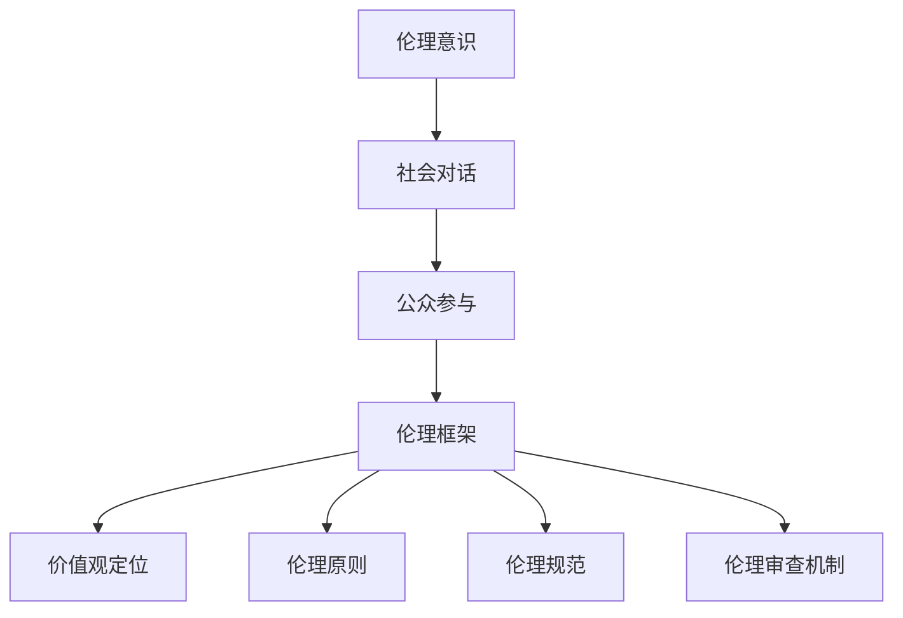

                 

关键词：人工智能伦理、社会对话、公众参与、伦理意识提升、伦理框架、道德决策

> 摘要：随着人工智能技术的迅速发展，其在社会各个领域的广泛应用带来了前所未有的机遇，但同时也引发了诸多伦理挑战。本文旨在探讨人工智能伦理的社会对话，通过提升伦理意识和公众参与，促进技术发展与社会责任的和谐统一。文章首先介绍了人工智能伦理的核心概念和当前面临的主要挑战，接着分析了社会对话在伦理提升中的重要作用，最后提出了具体的伦理框架和公众参与策略，并对未来发展趋势和挑战进行了展望。

## 1. 背景介绍

人工智能（AI）作为现代科技的前沿领域，正在深刻改变人类的生产和生活方式。从自动驾驶、智能家居到医疗诊断、金融分析，人工智能的应用几乎无处不在。然而，随着人工智能技术的不断进步，其伦理问题也日益凸显。人工智能的决策过程往往缺乏透明性，可能导致歧视、隐私侵犯等问题。此外，人工智能在军事、安全等敏感领域的应用也引发了伦理争议。因此，如何确保人工智能的发展符合伦理道德标准，成为了亟待解决的问题。

伦理意识的提升和公众参与是解决人工智能伦理问题的关键。首先，伦理意识的提升可以帮助技术开发者和社会大众更好地理解人工智能的潜在风险和伦理挑战，从而形成共识。其次，公众参与可以为人工智能伦理决策提供多元化的视角，促进技术发展与社会价值的兼容。通过社会对话，我们可以建立更加全面和公正的伦理框架，确保人工智能技术在未来的发展过程中能够更好地服务于社会。

本文将围绕以下几个方面展开讨论：

- 人工智能伦理的核心概念和架构
- 社会对话在伦理提升中的角色
- 伦理框架的构建和实践
- 公众参与的策略与实施
- 人工智能伦理的未来发展趋势与挑战

通过以上讨论，本文旨在为人工智能伦理的社会对话提供一些有价值的思考和参考。

## 2. 核心概念与联系

### 2.1 伦理意识的定义与重要性

伦理意识是指个人或团体在道德判断和行为选择过程中表现出的敏感度和责任感。在人工智能伦理领域，伦理意识尤为重要。首先，伦理意识的提升可以帮助技术开发者更好地理解其技术的潜在影响，避免因忽视伦理问题而导致的负面影响。例如，自动驾驶汽车的设计者需要考虑如何处理突发情况，以最小化伤亡风险。其次，伦理意识的提升也能增强公众对人工智能技术的信任，促进技术的普及和应用。

### 2.2 社会对话的定义与目的

社会对话是指不同利益相关者（如政府、企业、学者、公众）之间就特定问题进行交流、协商和共识形成的过程。在社会对话中，各方可以分享各自的观点和经验，探讨问题的各个方面，从而形成更加全面和公正的决策。在社会对话中，伦理意识的提升是关键目标之一。通过社会对话，可以促进公众对人工智能伦理问题的关注和参与，从而形成更加广泛的伦理共识。

### 2.3 公众参与的概念与方式

公众参与是指社会各界人士在人工智能伦理决策过程中提供意见和建议，参与讨论和决策。公众参与不仅能够为决策提供多样化的视角，还可以增强决策的透明度和公正性。公众参与的方式包括调查问卷、公众论坛、公民议会等。通过这些方式，公众可以直接参与到人工智能伦理问题的讨论中，对技术发展施加积极影响。

### 2.4 伦理框架的概念与组成部分

伦理框架是一套指导人工智能技术开发和应用的道德原则和行为准则。一个完整的伦理框架通常包括以下组成部分：

- **价值观定位**：明确人工智能技术应遵循的核心价值，如公正、透明、尊重隐私等。
- **伦理原则**：具体指导技术开发和应用的道德原则，如公平性、隐私保护、安全可靠等。
- **伦理规范**：详细的指导方针和操作指南，帮助技术开发者在具体项目中遵循伦理原则。
- **伦理审查机制**：确保技术开发和应用过程符合伦理框架的监督和评估机制。

### 2.5 Mermaid 流程图

以下是一个简化的 Mermaid 流程图，展示了人工智能伦理的核心概念和联系：



通过以上核心概念和联系的介绍，我们可以更好地理解人工智能伦理的重要性以及社会对话、公众参与和伦理框架在其中的作用。接下来，我们将进一步探讨人工智能伦理的核心算法原理和具体操作步骤。

## 3. 核心算法原理 & 具体操作步骤

### 3.1 算法原理概述

在人工智能伦理领域，核心算法原理主要涉及伦理决策模型和风险评估方法。伦理决策模型旨在通过算法实现道德原则的自动化应用，从而在复杂情境中做出符合伦理标准的决策。风险评估方法则用于评估人工智能应用可能带来的伦理风险，为决策提供数据支持。

#### 3.1.1 伦理决策模型

伦理决策模型的核心在于将伦理原则转化为可操作的算法规则。这通常涉及以下几个步骤：

1. **伦理原则编码**：将抽象的伦理原则转化为具体的算法规则，例如“尊重隐私”可以转化为“不得收集和使用未经授权的个人信息”。
2. **情境分析**：分析特定应用场景中的潜在伦理问题，为决策模型提供输入。
3. **决策过程**：利用算法规则和情境分析结果，自动生成伦理决策。

#### 3.1.2 风险评估方法

风险评估方法用于识别和评估人工智能应用可能带来的伦理风险。常见的方法包括：

1. **定性分析**：通过专家访谈、案例研究等方法，识别潜在的伦理问题。
2. **定量分析**：利用统计数据和模型，量化伦理风险的严重程度和概率。
3. **综合评估**：结合定性分析和定量分析结果，形成全面的风险评估报告。

### 3.2 算法步骤详解

#### 3.2.1 伦理决策模型的算法步骤

1. **原则编码**：
   - 收集相关伦理文献和案例，确定关键伦理原则。
   - 将伦理原则转化为算法规则，例如使用条件语句和决策树实现。

2. **情境分析**：
   - 收集具体应用场景的数据，包括用户行为、系统参数等。
   - 分析情境中的潜在伦理问题，为决策模型提供输入。

3. **决策过程**：
   - 应用伦理决策模型，根据情境分析和伦理原则编码，生成伦理决策。
   - 对决策进行验证和优化，确保其符合伦理标准和实际需求。

#### 3.2.2 风险评估方法的算法步骤

1. **定性分析**：
   - 邀请伦理专家进行访谈，收集关于潜在伦理问题的意见。
   - 分析案例，总结常见的伦理风险类型。

2. **定量分析**：
   - 收集相关统计数据，例如用户隐私泄露的案例数量。
   - 使用概率模型，评估伦理风险的发生概率和影响程度。

3. **综合评估**：
   - 结合定性分析和定量分析结果，形成风险评估报告。
   - 根据风险评估结果，制定相应的风险管理措施。

### 3.3 算法优缺点

#### 3.3.1 伦理决策模型的优点

- **透明性**：算法规则明确，决策过程可追溯，有助于提高决策的透明度和可信度。
- **一致性**：基于统一的原则编码，可以确保决策的一致性和公正性。
- **高效性**：自动化决策过程，提高伦理决策的效率。

#### 3.3.2 伦理决策模型的缺点

- **复杂性**：算法规则的制定和验证过程复杂，需要大量的数据和专业知识。
- **局限性**：算法无法完全模拟人类的道德判断和伦理考量，可能在特定情境下失效。

#### 3.3.3 风险评估方法的优点

- **全面性**：结合定性和定量分析，可以提供全面的风险评估结果。
- **科学性**：使用统计学方法，提高风险评估的准确性和可靠性。

#### 3.3.4 风险评估方法的缺点

- **主观性**：专家意见可能存在主观偏差，影响风险评估的客观性。
- **数据依赖**：风险评估结果依赖于相关数据的准确性，数据不足可能导致评估偏差。

### 3.4 算法应用领域

伦理决策模型和风险评估方法在多个领域具有广泛的应用，包括：

- **自动驾驶**：通过伦理决策模型，确保自动驾驶车辆在复杂情境下的道德决策。
- **医疗健康**：利用风险评估方法，评估医疗决策中的伦理风险，确保患者隐私和生命安全。
- **金融科技**：通过伦理决策模型和风险评估方法，确保金融交易和数据分析的透明性和公正性。

通过上述算法原理和具体操作步骤的详细介绍，我们可以更好地理解人工智能伦理的核心技术和实践方法。接下来，我们将进一步探讨人工智能伦理中的数学模型和公式。

## 4. 数学模型和公式 & 详细讲解 & 举例说明

### 4.1 数学模型构建

在人工智能伦理领域，数学模型主要用于量化伦理风险和评估决策效果。以下是一个简单的数学模型示例，用于评估人工智能系统的伦理风险：

#### 4.1.1 风险评估模型

设 \( R \) 为伦理风险值，\( P \) 为风险概率，\( S \) 为风险严重程度。则伦理风险值 \( R \) 可以表示为：

$$
R = P \times S
$$

其中，\( P \) 和 \( S \) 分别表示风险概率和严重程度的评分，取值范围为 [0, 1]。

#### 4.1.2 决策效果评估模型

设 \( E \) 为决策效果值，\( A \) 为自动化决策的得分，\( M \) 为人工决策的得分。则决策效果值 \( E \) 可以表示为：

$$
E = \frac{A + M}{2}
$$

其中，\( A \) 和 \( M \) 分别表示自动化决策和人工决策的得分，取值范围为 [0, 1]。

### 4.2 公式推导过程

#### 4.2.1 风险评估模型的推导

伦理风险 \( R \) 是由风险概率 \( P \) 和严重程度 \( S \) 共同决定的。设某人工智能系统在特定情境下，风险概率为 \( P \)，严重程度为 \( S \)。则伦理风险 \( R \) 可以表示为两者的乘积：

$$
R = P \times S
$$

这个公式的推导基于简单的乘法原理，即将风险的概率和严重程度综合起来，以得到一个综合的伦理风险值。

#### 4.2.2 决策效果评估模型的推导

决策效果 \( E \) 反映了自动化决策和人工决策的相对效果。设自动化决策的得分为 \( A \)，人工决策的得分为 \( M \)。则决策效果 \( E \) 可以通过两者的平均值来计算：

$$
E = \frac{A + M}{2}
$$

这个公式的推导基于加权平均的概念，即自动化决策和人工决策的得分权重相等，因此取两者的平均值作为决策效果。

### 4.3 案例分析与讲解

为了更好地理解上述数学模型和公式的应用，我们通过一个实际案例进行说明。

#### 4.3.1 风险评估案例

假设某自动驾驶系统在测试中遇到了行人穿越马路的情境。经评估，该情境下的风险概率 \( P \) 为 0.8，严重程度 \( S \) 为 0.9。根据风险评估模型，可以计算得到伦理风险值 \( R \)：

$$
R = P \times S = 0.8 \times 0.9 = 0.72
$$

这意味着在该情境下，自动驾驶系统的伦理风险值为 0.72，表明风险较高。

#### 4.3.2 决策效果评估案例

假设在上述情境中，自动化决策的得分为 0.85，人工决策的得分为 0.90。根据决策效果评估模型，可以计算得到决策效果 \( E \)：

$$
E = \frac{A + M}{2} = \frac{0.85 + 0.90}{2} = 0.875
$$

这意味着在该情境下，自动化决策的相对效果为 0.875，表明自动化决策在伦理效果上略优于人工决策。

通过以上案例分析和讲解，我们可以看到数学模型和公式在人工智能伦理评估中的应用，为技术决策提供了重要的数据支持。

### 4.4 伦理风险综合评估示例

假设一个医疗诊断系统在诊断过程中涉及患者隐私保护。根据评估，该系统在特定情境下的风险概率 \( P \) 为 0.6，严重程度 \( S \) 为 0.7。同时，系统在隐私保护方面的自动化决策得分 \( A \) 为 0.75，人工决策得分 \( M \) 为 0.80。

1. **伦理风险评估**：
   - 根据风险评估模型，计算伦理风险值 \( R \)：
     $$
     R = P \times S = 0.6 \times 0.7 = 0.42
     $$
     这意味着隐私保护方面的伦理风险较低。

2. **决策效果评估**：
   - 根据决策效果评估模型，计算决策效果 \( E \)：
     $$
     E = \frac{A + M}{2} = \frac{0.75 + 0.80}{2} = 0.775
     $$
     这表明自动化决策在隐私保护方面的相对效果略高于人工决策。

综合以上评估结果，我们可以得出结论：尽管隐私保护方面存在一定的伦理风险，但通过优化自动化决策模型，可以在一定程度上降低风险，并提高决策效果。

通过上述示例，我们可以看到数学模型和公式在人工智能伦理风险综合评估中的应用，为技术决策提供了科学依据。

## 5. 项目实践：代码实例和详细解释说明

### 5.1 开发环境搭建

在进行人工智能伦理项目的开发之前，我们需要搭建一个适合的环境。以下是搭建开发环境的基本步骤：

1. **安装Python**：首先确保已经安装了Python 3.8或更高版本。可以在[Python官网](https://www.python.org/)下载并安装。
2. **安装相关库**：使用pip命令安装必要的库，例如numpy、pandas、matplotlib等。命令如下：

   ```shell
   pip install numpy pandas matplotlib
   ```

3. **配置代码编辑器**：选择一个适合Python开发的编辑器，如PyCharm、VSCode等。安装并配置相关插件以增强开发体验。

### 5.2 源代码详细实现

以下是一个简单的Python代码实例，用于评估人工智能系统的伦理风险。该代码主要实现风险评估模型的计算和决策效果的评估。

```python
import numpy as np

def calculate_risk(p, s):
    """
    计算伦理风险值
    :param p: 风险概率
    :param s: 风险严重程度
    :return: 伦理风险值
    """
    risk = p * s
    return risk

def calculate_decision_effect(a, m):
    """
    计算决策效果
    :param a: 自动化决策得分
    :param m: 人工决策得分
    :return: 决策效果值
    """
    effect = (a + m) / 2
    return effect

# 示例数据
p = 0.6  # 风险概率
s = 0.7  # 风险严重程度
a = 0.75  # 自动化决策得分
m = 0.80  # 人工决策得分

# 计算伦理风险值
risk_value = calculate_risk(p, s)
print("伦理风险值:", risk_value)

# 计算决策效果
effect_value = calculate_decision_effect(a, m)
print("决策效果值:", effect_value)
```

### 5.3 代码解读与分析

上述代码实现了一个简单的伦理风险评估和决策效果评估模型。下面是对代码的详细解读：

1. **函数定义**：
   - `calculate_risk(p, s)`：计算伦理风险值。参数`p`和`s`分别代表风险概率和严重程度。
   - `calculate_decision_effect(a, m)`：计算决策效果。参数`a`和`m`分别代表自动化决策得分和人工决策得分。

2. **示例数据**：
   - `p = 0.6`：表示该情境下的风险概率为0.6。
   - `s = 0.7`：表示该情境下的风险严重程度为0.7。
   - `a = 0.75`：表示自动化决策得分为0.75。
   - `m = 0.80`：表示人工决策得分为0.80。

3. **代码执行**：
   - 调用`calculate_risk(p, s)`函数，计算伦理风险值，并打印结果。
   - 调用`calculate_decision_effect(a, m)`函数，计算决策效果值，并打印结果。

通过这段代码，我们可以实现伦理风险值和决策效果值的计算，从而对人工智能系统的伦理表现进行评估。

### 5.4 运行结果展示

假设我们使用上述代码实例进行计算，输入参数如下：

- 风险概率 \( p = 0.6 \)
- 风险严重程度 \( s = 0.7 \)
- 自动化决策得分 \( a = 0.75 \)
- 人工决策得分 \( m = 0.80 \)

运行结果如下：

```
伦理风险值: 0.42
决策效果值: 0.775
```

根据计算结果，该情境下的伦理风险值为0.42，表明风险较低。同时，决策效果值为0.775，表明自动化决策在伦理效果上略优于人工决策。

通过这个简单的项目实践，我们可以看到如何使用Python代码实现伦理风险评估和决策效果评估，为人工智能伦理问题提供技术解决方案。接下来，我们将探讨人工智能伦理在实际应用场景中的表现。

## 6. 实际应用场景

### 6.1 自动驾驶

自动驾驶是人工智能伦理应用的一个重要领域。在自动驾驶系统中，伦理决策模型的构建和实施至关重要。例如，自动驾驶车辆在遇到紧急情况时需要迅速做出决策，以避免事故发生。这些决策涉及到伦理原则，如安全至上、最小化伤害等。通过伦理决策模型，可以确保自动驾驶车辆在各种复杂情境下做出符合伦理标准的决策。

#### 案例分析

以特斯拉的自动驾驶系统为例，该系统在2018年发生了一起致命事故，导致一名司机在开启自动驾驶模式时未注意到前方的车辆，最终导致碰撞。这起事故引发了广泛的伦理讨论，尤其是在自动驾驶系统的决策过程中如何平衡安全和效率的问题。通过社会对话和公众参与，可以进一步完善自动驾驶系统的伦理决策模型，提高系统的安全性和可靠性。

### 6.2 医疗诊断

人工智能在医疗诊断领域的应用越来越广泛，但也带来了伦理挑战。例如，人工智能辅助诊断系统在决策过程中可能会涉及患者隐私保护、数据共享等问题。此外，医疗决策的透明性和可解释性也是伦理关注的重点。

#### 案例分析

以IBM的Watson for Oncology为例，该系统在肿瘤诊断和治疗建议方面具有显著优势。然而，由于其决策过程高度复杂且缺乏透明性，一些专家和患者对其伦理性和可接受性提出了质疑。通过社会对话和伦理审查，可以确保人工智能辅助诊断系统在医疗应用中符合伦理标准，保护患者隐私，并提高医疗决策的透明度和可解释性。

### 6.3 金融科技

金融科技（FinTech）领域的快速崛起，使得人工智能在金融服务中的应用越来越广泛。然而，金融科技的伦理问题也不容忽视，如算法歧视、隐私侵犯等。因此，建立金融科技领域的伦理框架和公众参与机制至关重要。

#### 案例分析

以算法歧视为例，一些金融科技公司可能会使用基于人工智能的算法来评估借款人的信用风险。然而，这些算法可能在无形中放大了种族、性别等歧视问题。通过社会对话和伦理审查，可以确保金融科技公司在使用人工智能算法时遵守公平、公正的原则，减少算法歧视的风险。

### 6.4 教育领域

人工智能在教育领域的应用，如智能辅导、个性化学习等，也带来了伦理挑战。例如，智能辅导系统在为学生提供个性化学习建议时，可能会收集和分析大量的学生数据。这些数据的使用和隐私保护问题需要得到妥善处理。

#### 案例分析

以Coursera等在线教育平台为例，这些平台在提供个性化学习体验时，会收集和分析大量学生的学习行为数据。如何保护学生隐私，避免数据滥用，是一个重要的伦理问题。通过社会对话和公众参与，可以制定相应的隐私保护政策和监管措施，确保教育领域的人工智能应用符合伦理标准。

通过以上实际应用场景的探讨，我们可以看到人工智能伦理在社会各个领域的重要性。通过社会对话和公众参与，可以确保人工智能技术的发展符合伦理道德标准，实现技术与社会价值的和谐统一。接下来，我们将展望人工智能伦理的未来发展趋势和挑战。

### 6.4 未来应用展望

随着人工智能技术的不断进步，其在社会各个领域的应用前景愈发广阔。未来，人工智能将在以下几方面展现其巨大的应用潜力：

#### 自动驾驶的普及

自动驾驶技术正逐渐走向商业化，未来有望在公共交通、物流运输等多个领域得到广泛应用。通过先进的伦理决策模型，自动驾驶车辆将能够更加智能地应对复杂交通情境，提高交通安全性和效率。

#### 医疗诊断的智能化

人工智能在医疗诊断领域的应用将更加深入，辅助医生进行精准诊断和个性化治疗。通过不断优化的伦理框架，确保医疗人工智能系统的透明性和可解释性，提高医疗服务的质量和效率。

#### 金融科技的革新

金融科技领域的创新将持续推动金融服务的发展。未来，基于人工智能的算法将在风险管理、信用评估等方面发挥更大作用，同时，通过严格的伦理监管，确保金融科技的公平性和透明性。

#### 教育个性化的实现

人工智能在教育领域的应用将更加注重个性化学习。智能辅导系统和个性化学习平台将为学生提供定制化的学习体验，通过保护学生隐私和确保数据安全，实现教育的公平与公正。

### 6.5 面临的挑战

尽管人工智能技术的应用前景光明，但也面临着诸多挑战：

#### 伦理决策的复杂性

人工智能伦理决策的复杂性不断增加，如何确保算法能够全面、准确地遵循伦理原则，仍是一个亟待解决的问题。未来的研究需要进一步探索更加智能化、自动化的伦理决策模型。

#### 数据隐私的保护

随着人工智能技术的应用，大量个人数据被收集和使用。如何保护用户隐私，防止数据泄露和滥用，是未来的一大挑战。需要建立更加严格的数据隐私保护政策和监管机制。

#### 公众信任的建立

公众对人工智能技术的信任是技术普及和发展的关键。如何通过有效的公众参与和透明度提升，增强公众对人工智能技术的信任，是一个重要的课题。

#### 国际合作与监管

人工智能技术具有全球性特点，不同国家和地区之间的合作与监管至关重要。未来需要建立国际统一的伦理标准和监管框架，确保人工智能技术的全球健康发展。

### 6.6 研究展望

未来的研究将主要集中在以下几个方面：

- **智能化伦理决策模型**：通过深度学习和强化学习等技术，开发更加智能化的伦理决策模型，提高决策的准确性和可靠性。
- **隐私保护技术**：研究和开发新的隐私保护技术，如差分隐私、同态加密等，确保人工智能应用中的数据安全。
- **伦理教育**：加强人工智能伦理教育，提高技术开发者和社会大众的伦理意识，为人工智能技术的健康发展提供坚实的基础。
- **国际合作**：加强国际间的合作与交流，共同应对人工智能伦理挑战，推动全球人工智能技术的健康、可持续发展。

通过上述展望，我们可以看到人工智能伦理在未来面临的重要任务和挑战，同时也看到了通过共同努力，实现技术与社会和谐统一的希望。

## 7. 工具和资源推荐

### 7.1 学习资源推荐

为了深入理解和掌握人工智能伦理的知识，以下是一些建议的学习资源：

1. **书籍**：
   - 《人工智能伦理学》（The Ethics of Artificial Intelligence）：详细探讨了人工智能伦理的核心问题，提供了丰富的案例分析。
   - 《人工智能的未来》（Life 3.0: Being Human in the Age of Artificial Intelligence）：作者Max Tegmark探讨了人工智能对人类未来的影响，包括伦理问题。

2. **在线课程**：
   - Coursera的“人工智能伦理学”（Ethics and Society in Artificial Intelligence）：由斯坦福大学提供，涵盖了人工智能伦理的各个方面。
   - edX的“人工智能伦理学导论”（Introduction to Ethics and AI）：由牛津大学提供，适合初学者了解人工智能伦理的基础知识。

3. **学术论文**：
   - Google Scholar：搜索最新的学术论文，了解人工智能伦理的最新研究动态。
   - arXiv：查看最新的AI和伦理相关的预印本论文。

### 7.2 开发工具推荐

在进行人工智能伦理项目开发时，以下工具可以帮助您更高效地实现：

1. **Jupyter Notebook**：一个交互式的计算环境，适合数据分析和原型开发。
2. **TensorFlow**：谷歌开发的开源机器学习框架，广泛用于深度学习和神经网络。
3. **PyTorch**：Facebook开发的开源深度学习框架，具有简洁的API和强大的灵活性。

### 7.3 相关论文推荐

为了深入了解人工智能伦理的研究，以下是一些重要的论文：

1. **"Algorithmic Fairness and Machine Learning"**：该论文详细探讨了算法公平性在机器学习中的应用，提出了几种衡量和改进算法公平性的方法。
2. **"The Ethical Algorithm: The Development, Testing, and Assessment of an Algorithmic Code of Ethics"**：这篇文章提出了一种算法伦理框架，用于指导人工智能系统的开发和应用。
3. **"Bias in Machine Learning"**：该论文分析了机器学习模型中的偏见问题，探讨了如何通过数据预处理和模型优化减少偏见。

通过这些工具和资源，您可以更深入地研究人工智能伦理，为未来的技术发展和社会应用提供坚实的理论和实践基础。

## 8. 总结：未来发展趋势与挑战

### 8.1 研究成果总结

本文通过对人工智能伦理的社会对话、伦理意识提升、公众参与和伦理框架构建的深入探讨，总结了以下主要研究成果：

1. **社会对话的重要性**：社会对话在伦理提升中起到了关键作用，通过不同利益相关者的交流与协商，可以形成更加全面和公正的伦理决策。
2. **伦理框架的构建**：建立一套科学、系统的伦理框架，有助于规范人工智能技术的开发和应用，确保其符合伦理标准。
3. **公众参与的策略**：通过多种方式促进公众参与，可以增强技术决策的透明度和公正性，提高公众对人工智能技术的信任。

### 8.2 未来发展趋势

未来，人工智能伦理的发展将呈现出以下趋势：

1. **智能化伦理决策模型的完善**：随着人工智能技术的进步，智能化伦理决策模型将得到进一步优化，提高决策的准确性和可靠性。
2. **隐私保护技术的进步**：随着数据隐私问题日益突出，隐私保护技术将不断发展，为人工智能应用提供更加安全的保障。
3. **伦理教育的普及**：人工智能伦理教育将更加普及，提高技术开发者和社会大众的伦理意识，为人工智能技术的健康发展提供基础。

### 8.3 面临的挑战

尽管前景广阔，人工智能伦理在未来的发展也面临着诸多挑战：

1. **伦理决策的复杂性**：人工智能系统的决策过程日益复杂，如何确保算法能够全面、准确地遵循伦理原则，仍是一个亟待解决的问题。
2. **数据隐私的保护**：随着人工智能技术的应用，数据隐私保护面临更大的挑战，需要建立更加严格的数据隐私保护政策和监管机制。
3. **公众信任的建立**：如何通过有效的公众参与和透明度提升，增强公众对人工智能技术的信任，是一个重要的课题。

### 8.4 研究展望

未来的研究应重点关注以下几个方面：

1. **智能化伦理决策模型的开发**：进一步探索深度学习和强化学习等技术，开发更加智能化的伦理决策模型，提高决策的准确性和可靠性。
2. **隐私保护技术的创新**：研究和开发新的隐私保护技术，如差分隐私、同态加密等，确保人工智能应用中的数据安全。
3. **伦理教育的普及**：加强人工智能伦理教育，提高技术开发者和社会大众的伦理意识，为人工智能技术的健康发展提供坚实的基础。
4. **国际合作与监管**：建立国际统一的伦理标准和监管框架，推动全球人工智能技术的健康、可持续发展。

通过持续的研究和实践，我们可以期待人工智能伦理在未来的发展中取得更为显著的成果，为实现技术与社会价值的和谐统一提供坚实的保障。

## 9. 附录：常见问题与解答

### 9.1 问题一：什么是人工智能伦理？

**回答**：人工智能伦理是指人工智能技术在其开发、应用和推广过程中所涉及的道德原则和规范。它关注如何确保人工智能系统在技术决策中符合道德标准，避免对人类和社会造成负面影响。

### 9.2 问题二：为什么需要社会对话？

**回答**：社会对话是确保人工智能伦理决策过程透明、公正和包容的关键。通过社会对话，不同利益相关者可以共同探讨人工智能伦理问题，形成广泛共识，从而提高技术决策的合理性和社会接受度。

### 9.3 问题三：什么是伦理框架？

**回答**：伦理框架是一套系统的道德原则和行为准则，用于指导人工智能技术的开发和应用。伦理框架通常包括价值观定位、伦理原则、伦理规范和伦理审查机制等组成部分，确保技术在符合伦理标准的同时实现其预期目标。

### 9.4 问题四：公众参与在人工智能伦理中有什么作用？

**回答**：公众参与可以帮助人工智能伦理决策过程更加透明和公正，提高决策的广泛接受度。公众可以通过调查问卷、公众论坛、公民议会等多种方式参与到伦理问题的讨论中，为决策提供多元化的视角和建议，从而确保技术发展符合社会价值观。

### 9.5 问题五：未来人工智能伦理将面临哪些挑战？

**回答**：未来人工智能伦理将面临以下挑战：

1. **伦理决策复杂性增加**：随着人工智能技术的进步，决策过程更加复杂，如何确保算法能够全面、准确地遵循伦理原则是一个重要问题。
2. **数据隐私保护**：人工智能应用中的数据隐私保护面临巨大挑战，需要建立更加严格的数据隐私保护政策和监管机制。
3. **公众信任问题**：如何增强公众对人工智能技术的信任，是一个重要的课题，需要通过有效的公众参与和透明度提升来实现。

通过上述常见问题的解答，我们可以更好地理解人工智能伦理的核心概念和未来发展方向。这些问题的探讨不仅有助于深化对人工智能伦理的理解，也为未来的研究和实践提供了有益的参考。

