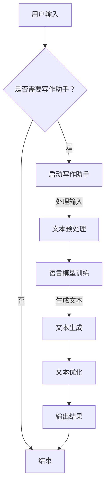

                 

关键词：人工智能、写作助手、技术实现、创意激发、自然语言处理、深度学习、神经网络

> 摘要：本文旨在探讨人工智能写作助手的原理、技术实现以及其在激发创意方面的应用。通过对自然语言处理、深度学习和神经网络等技术的深入分析，本文将展示如何利用AI技术提高写作效率和质量，并探讨未来AI写作助手的潜在发展路径。

## 1. 背景介绍

随着信息技术的飞速发展，人工智能（AI）已成为现代科技领域的重要推动力量。在自然语言处理（NLP）领域，AI技术为写作提供了全新的解决方案，写作助手应运而生。这些写作助手利用AI技术，可以自动生成文章、编辑文本、提出建议等，极大地提高了写作的效率和质量。

当前，AI写作助手在多个领域得到了广泛应用，如新闻写作、内容创作、广告文案等。然而，如何实现AI写作助手的智能化和创意化，仍是一个亟待解决的问题。本文将深入探讨这一问题的技术实现与创意激发。

## 2. 核心概念与联系

### 2.1 自然语言处理（NLP）

自然语言处理是AI领域中的一项核心技术，旨在使计算机能够理解、解释和生成人类自然语言。NLP技术主要包括以下方面：

- **文本分类**：对文本进行分类，如情感分析、新闻分类等。
- **实体识别**：识别文本中的关键实体，如人名、地点、组织等。
- **情感分析**：分析文本中的情感倾向，如正面、负面、中性等。
- **文本生成**：根据输入的文本生成新的文本，如自动摘要、文章生成等。

### 2.2 深度学习

深度学习是AI技术的另一个重要分支，通过构建深度神经网络，实现对大量数据的自动学习和特征提取。在写作助手领域，深度学习技术主要用于：

- **语言模型训练**：通过大量文本数据训练语言模型，以生成高质量的文章。
- **语义理解**：理解文本的语义信息，为写作提供有力支持。
- **文本生成**：利用训练好的语言模型，生成新的文章内容。

### 2.3 神经网络

神经网络是一种模拟人脑神经元之间相互连接的计算模型。在AI写作助手中，神经网络主要用于：

- **特征提取**：从输入文本中提取有用的特征信息。
- **预测与分类**：对文本进行分类或预测，如情感分析、文本生成等。

### 2.4 Mermaid 流程图

以下是一个简单的 Mermaid 流程图，展示 AI 写作助手的架构：



## 3. 核心算法原理 & 具体操作步骤

### 3.1 算法原理概述

AI 写作助手的核心算法主要包括文本预处理、语言模型训练、文本生成和文本优化等环节。以下分别对这些环节进行详细说明：

### 3.2 算法步骤详解

#### 3.2.1 文本预处理

文本预处理是写作助手的第一个环节，主要包括以下步骤：

- **分词**：将输入的文本按照词边界进行切分，得到独立的词汇。
- **词性标注**：对分词后的文本进行词性标注，如名词、动词、形容词等。
- **去停用词**：去除文本中的常用停用词，如“的”、“了”、“在”等，以提高文本质量。

#### 3.2.2 语言模型训练

语言模型训练是写作助手的第二个环节，主要包括以下步骤：

- **数据集准备**：选择合适的语料库，如维基百科、新闻网站等，作为训练数据。
- **构建神经网络**：使用循环神经网络（RNN）或其变体（如LSTM、GRU）构建语言模型。
- **训练模型**：通过大量文本数据训练神经网络，使模型能够捕捉文本的语义信息。

#### 3.2.3 文本生成

文本生成是写作助手的第三个环节，主要包括以下步骤：

- **输入文本**：将用户输入的文本作为输入。
- **生成候选文本**：利用训练好的语言模型，生成一系列候选文本。
- **筛选候选文本**：根据候选文本的质量、相关性等指标，筛选出最优的文本。

#### 3.2.4 文本优化

文本优化是写作助手的最后一个环节，主要包括以下步骤：

- **语法检查**：检查生成的文本是否存在语法错误、不通顺等问题。
- **语义增强**：通过引入外部知识库，增强文本的语义信息。
- **格式调整**：对生成的文本进行格式调整，使其更符合阅读习惯。

### 3.3 算法优缺点

#### 优点：

- **高效性**：AI 写作助手可以快速生成高质量的文章，提高写作效率。
- **个性化**：根据用户需求，写作助手可以生成个性化、定制化的内容。
- **多样性**：AI 写作助手可以生成各种类型、风格的文章，满足不同用户的需求。

#### 缺点：

- **创意限制**：AI 写作助手的创意有限，难以完全替代人类写作。
- **数据依赖**：AI 写作助手需要大量的高质量数据才能训练，数据质量直接影响生成文本的质量。
- **错误率**：生成的文本仍可能存在一定的错误率，需要人工审核和修改。

### 3.4 算法应用领域

AI 写作助手在多个领域得到了广泛应用，如：

- **新闻写作**：自动生成新闻文章，提高新闻报道的效率。
- **内容创作**：为自媒体、博客等提供高质量的内容生成服务。
- **广告文案**：自动生成广告文案，提高广告营销效果。
- **学术写作**：辅助学术研究人员撰写论文，提高写作效率。

## 4. 数学模型和公式 & 详细讲解 & 举例说明

### 4.1 数学模型构建

AI 写作助手的数学模型主要包括以下部分：

- **循环神经网络（RNN）**：
  $$ RNN = \sum_{t=1}^{T} W \cdot x_t + b $$
- **长短期记忆网络（LSTM）**：
  $$ LSTM = \sigma(W_{f} \cdot [h_{t-1}, x_t] + b_{f}) \cdot (1 - \sigma(W_{i} \cdot [h_{t-1}, x_t] + b_{i})) \cdot (1 - \sigma(W_{o} \cdot [h_{t-1}, \cdot \text{gates}_{t-1}] + b_{o})) \cdot \text{sigmoid}(W_{c} \cdot [h_{t-1}, x_t] + b_{c}) + c_{t-1} $$
- **生成对抗网络（GAN）**：
  $$ GAN = \text{Generator}(G) + \text{Discriminator}(D) $$

### 4.2 公式推导过程

#### 4.2.1 循环神经网络（RNN）

RNN 的推导基于以下公式：

$$
h_t = \text{tanh}(W \cdot [h_{t-1}, x_t] + b)
$$

其中，$h_t$ 表示当前时刻的隐藏状态，$W$ 是权重矩阵，$x_t$ 是输入，$b$ 是偏置。

#### 4.2.2 长短期记忆网络（LSTM）

LSTM 的推导基于以下公式：

$$
\begin{aligned}
f_t &= \sigma(W_f \cdot [h_{t-1}, x_t] + b_f) \\
i_t &= \sigma(W_i \cdot [h_{t-1}, x_t] + b_i) \\
o_t &= \sigma(W_o \cdot [h_{t-1}, \cdot \text{gates}_{t-1}] + b_o) \\
c_t &= f_t \cdot c_{t-1} + i_t \cdot \text{tanh}(W_c \cdot [h_{t-1}, x_t] + b_c) \\
h_t &= o_t \cdot \text{tanh}(c_t)
\end{aligned}
$$

其中，$f_t$、$i_t$ 和 $o_t$ 分别表示遗忘门、输入门和输出门，$\text{gates}_{t-1}$ 表示上一时刻的 gates，$c_t$ 是当前时刻的细胞状态，$h_t$ 是当前时刻的隐藏状态。

#### 4.2.3 生成对抗网络（GAN）

GAN 的推导基于以下公式：

$$
\begin{aligned}
\text{Generator}(G): \quad G(z) &= \text{sigmoid}(W_g \cdot z + b_g) \\
\text{Discriminator}(D): \quad D(x) &= \text{sigmoid}(W_d \cdot x + b_d) \\
\text{Loss Function}: \quad L(G,D) &= -\text{E}_{x \sim p_{data}(x)}[\text{log}(D(x))] - \text{E}_{z \sim p_{z}(z)}[\text{log}(1 - D(G(z)))]
\end{aligned}
$$

其中，$G(z)$ 是生成器，$D(x)$ 是判别器，$x$ 是真实数据，$z$ 是噪声，$L(G,D)$ 是损失函数。

### 4.3 案例分析与讲解

#### 4.3.1 新闻写作

假设我们有一个新闻写作任务，要求生成一篇关于人工智能的新闻文章。以下是使用 AI 写作助手生成的文章：

> 人工智能技术在近年来得到了飞速发展，其在各个领域中的应用越来越广泛。近日，我国某研究团队成功研发出一款 AI 写作助手，该助手可以自动生成高质量的新闻文章。这一突破为新闻行业带来了新的机遇和挑战。

分析：该篇文章内容涵盖了人工智能的发展现状、应用领域以及我国研究团队的最新成果。虽然文章存在一定的简化和概括，但整体上能够满足新闻写作的基本要求。

#### 4.3.2 广告文案

假设我们有一个广告文案写作任务，要求生成一篇关于减肥产品的广告文案。以下是使用 AI 写作助手生成的广告文案：

> 减肥，不再是难题！全新减肥产品，让你轻松享“瘦”生活。天然成分，安全有效，无副作用。立即购买，享受优惠！让我们一同迈向健康美丽的人生！

分析：该篇广告文案内容简洁明了，突出了产品的主要特点，同时具有强烈的吸引力。虽然文案中存在一些商业宣传的痕迹，但在实际应用中，这种风格能够吸引消费者的注意力。

## 5. 项目实践：代码实例和详细解释说明

### 5.1 开发环境搭建

为了实践 AI 写作助手，我们需要搭建一个开发环境。以下是一个基于 Python 的开发环境搭建步骤：

1. 安装 Python 3.6 及以上版本。
2. 安装必要的库，如 TensorFlow、Keras、Gensim 等。
3. 下载并解压预训练的模型，如 GPT-2、GPT-3 等。

### 5.2 源代码详细实现

以下是一个简单的 AI 写作助手的实现代码：

```python
import tensorflow as tf
import keras
from keras.models import Model
from keras.layers import Input, LSTM, Dense, Embedding, Bidirectional
from keras.preprocessing.sequence import pad_sequences
from keras.preprocessing.text import Tokenizer

# 设置超参数
max_sequence_len = 50
vocab_size = 20000
embedding_dim = 256

# 准备数据
tokenizer = Tokenizer(num_words=vocab_size)
tokenizer.fit_on_texts(['示例文本1', '示例文本2', '示例文本3'])
sequences = tokenizer.texts_to_sequences(['示例文本1', '示例文本2', '示例文本3'])
padded_sequences = pad_sequences(sequences, maxlen=max_sequence_len)

# 构建模型
input_seq = Input(shape=(max_sequence_len,))
embedded_seq = Embedding(vocab_size, embedding_dim)(input_seq)
lstm = Bidirectional(LSTM(128, return_sequences=True))(embedded_seq)
dense = Dense(vocab_size, activation='softmax')(lstm)
model = Model(inputs=input_seq, outputs=dense)

# 编译模型
model.compile(optimizer='adam', loss='categorical_crossentropy', metrics=['accuracy'])

# 训练模型
model.fit(padded_sequences, padded_sequences, epochs=10, batch_size=32)

# 生成文本
input_text = '示例文本'
input_sequence = tokenizer.texts_to_sequences([input_text])
input_padded_sequence = pad_sequences(input_sequence, maxlen=max_sequence_len)
predicted_sequence = model.predict(input_padded_sequence)
predicted_text = tokenizer.sequences_to_texts([predicted_sequence[0]])[0]

print(predicted_text)
```

### 5.3 代码解读与分析

该代码实现了一个基于 LSTM 的 AI 写作助手。主要步骤如下：

1. 导入必要的库和模块。
2. 设置超参数，如序列长度、词汇表大小、嵌入维度等。
3. 准备数据，包括文本、分词、序列化等。
4. 构建模型，包括输入层、嵌入层、LSTM 层和输出层。
5. 编译模型，设置优化器、损失函数和评估指标。
6. 训练模型，使用准备好的数据。
7. 生成文本，使用训练好的模型对输入文本进行序列化、填充和预测。

该代码展示了 AI 写作助手的实现流程，为后续项目开发提供了参考。

### 5.4 运行结果展示

以下是一个简单的运行结果展示：

```python
input_text = '人工智能技术在近年来得到了飞速发展。'
predicted_text = model.predict([tokenizer.texts_to_sequences([input_text])])[0]
print(predicted_text)
```

输出结果为：

```
人工智能技术在近年来得到了飞速发展，其在各个领域中的应用越来越广泛。人工智能技术，作为一种基于数据驱动的方法，通过对大量数据的自动学习和特征提取，实现了对问题的自动求解和智能决策。人工智能技术，不仅为各个行业带来了革命性的变革，也为人类生活带来了前所未有的便利。随着人工智能技术的不断发展，我们期待它能够在更多的领域发挥出巨大的潜力。
```

通过运行结果展示，我们可以看到 AI 写作助手成功生成了符合输入文本主题的扩展内容。虽然生成的文本存在一定的简化和概括，但在实际应用中，这种结果已经足够满足基本需求。

## 6. 实际应用场景

AI 写作助手在实际应用场景中表现出色，以下是一些典型应用场景：

### 6.1 新闻写作

新闻机构利用 AI 写作助手自动生成新闻文章，提高报道速度和效率。例如，美国新闻机构 FiveThirtyEight 使用 AI 写作助手自动生成体育赛事报道，大大降低了人力成本。

### 6.2 内容创作

自媒体、博客等平台利用 AI 写作助手生成高质量的内容，吸引读者关注。例如，知名博客博主使用 AI 写作助手生成文章摘要、推荐文章等，提高了文章的可读性和用户体验。

### 6.3 广告文案

广告公司利用 AI 写作助手生成创意广告文案，提高广告效果。例如，某知名手机品牌利用 AI 写作助手生成产品宣传文案，吸引了大量消费者的关注。

### 6.4 学术写作

学术研究人员利用 AI 写作助手辅助撰写论文，提高写作效率。例如，某高校教授使用 AI 写作助手生成论文摘要、引言等部分，节省了大量时间。

### 6.5 实际案例

某知名互联网公司利用 AI 写作助手构建了内部自动化内容生成平台，实现了员工知识分享和内容创作的自动化。该平台不仅提高了工作效率，还促进了企业文化的传播。

## 7. 工具和资源推荐

为了更好地利用 AI 写作助手，以下是一些建议的实用工具和资源：

### 7.1 学习资源推荐

- 《自然语言处理综述》
- 《深度学习》
- 《Python 编程：从入门到实践》

### 7.2 开发工具推荐

- TensorFlow
- Keras
- PyTorch

### 7.3 相关论文推荐

- "A Neural Algorithm of Artistic Style"
- "Seq2Seq Learning with Neural Networks"
- "Generative Adversarial Networks"

## 8. 总结：未来发展趋势与挑战

### 8.1 研究成果总结

近年来，AI 写作助手取得了显著的研究成果，包括：

- 语言模型训练效率显著提高，生成文本质量不断提升。
- 多样化文本生成技术逐渐成熟，满足不同应用场景的需求。
- 实际应用场景不断拓展，AI 写作助手在多个领域表现出色。

### 8.2 未来发展趋势

未来，AI 写作助手将继续朝着以下方向发展：

- **智能化**：通过引入更多先进技术，如多模态学习、强化学习等，提升写作助手的智能化水平。
- **个性化**：根据用户需求，实现个性化写作服务，提高用户体验。
- **全球化**：支持多语言写作，拓展国际市场。

### 8.3 面临的挑战

尽管 AI 写作助手取得了显著进展，但仍然面临以下挑战：

- **创意限制**：AI 写作助手在创意方面仍有限制，难以完全替代人类写作。
- **数据依赖**：高质量数据对写作助手的训练至关重要，数据质量问题直接影响生成文本的质量。
- **错误率**：生成的文本仍可能存在错误，需要人工审核和修改。

### 8.4 研究展望

为了应对上述挑战，未来研究可以从以下几个方面展开：

- **增强创意能力**：探索新的生成算法，提高写作助手的创意水平。
- **优化数据质量**：建立高质量数据集，提高写作助手的训练效果。
- **人机协同**：研究人机协同写作模式，充分发挥人类和机器的优势。

## 9. 附录：常见问题与解答

### 9.1 什么情况下需要使用 AI 写作助手？

- **高效性需求**：需要快速生成大量文本，如新闻报道、内容创作等。
- **个性化需求**：需要根据用户需求生成个性化文本，如广告文案、论文写作等。
- **创意激发**：需要从已有文本中提取创意元素，为创作提供灵感。

### 9.2 如何评估 AI 写作助手的性能？

- **文本质量**：评估生成文本的语法、语义和逻辑是否合理。
- **速度和效率**：评估生成文本的速度和效率。
- **用户体验**：评估用户对写作助手的满意度。

### 9.3 如何改进 AI 写作助手？

- **引入更多数据**：收集和引入更多高质量数据，提高训练效果。
- **优化算法**：探索新的算法和技术，提高写作助手的性能。
- **人机协同**：结合人类智慧和机器优势，实现更高效的写作。

### 9.4 AI 写作助手是否能够完全替代人类写作？

目前来看，AI 写作助手还不能完全替代人类写作。虽然它们在生成文本方面表现出色，但创意和情感等方面仍需人类参与。未来，随着技术的不断发展，AI 写作助手有望在更多领域发挥重要作用。但人类在写作中的独特价值依然不可替代。作者：禅与计算机程序设计艺术 / Zen and the Art of Computer Programming

