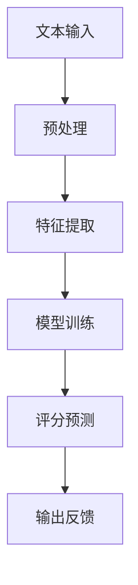

                 

### 1. 背景介绍

在当今快速发展的信息时代，人工智能（AI）技术已经深入到我们生活的方方面面，教育领域也不例外。随着在线教育、智能学习系统的兴起，对学生的写作能力进行有效评估变得尤为重要。传统的写作评估方式通常依赖于人工评分，这不仅耗时耗力，还可能存在评分标准不一、主观性高等问题。因此，如何利用人工智能技术实现自动化写作评分，成为了一个备受关注的研究方向。

自动化写作评分系统通过分析文本的语法、语义、逻辑结构等多个维度，对学生的写作进行客观、公正的评价。这种技术不仅能够提高评估效率，还能够为教师提供详尽的反馈报告，帮助学生提升写作能力。本文将围绕AI写作评分的原理、算法、数学模型、实践应用等多个方面展开讨论，旨在为这一领域的研究和实践提供一些有益的参考。

### 2. 核心概念与联系

#### 2.1 机器学习与自然语言处理

AI写作评分的核心依赖于机器学习和自然语言处理（NLP）技术。机器学习是一种让计算机通过数据和经验自动改进性能的技术。在写作评分中，机器学习模型通过大量的标注数据学习写作的评判标准。自然语言处理则是使计算机能够理解和生成人类语言的技术，它涵盖了文本的分词、词性标注、句法分析等过程，是构建AI写作评分系统的基础。

#### 2.2 文本特征提取

文本特征提取是AI写作评分的关键步骤。通过将文本转换为机器可理解的特征向量，模型可以更好地分析和评估文本的质量。常见的文本特征提取方法包括词袋模型、TF-IDF、词嵌入（如Word2Vec、GloVe）等。词嵌入技术能够捕捉词语的语义关系，对于理解和评估文本内容的逻辑性和连贯性尤其有效。

#### 2.3 评估指标

AI写作评分系统的评估指标通常包括语法准确性、词汇丰富度、逻辑连贯性、结构完整性等。这些指标不仅能够反映写作的基本质量，还能够为教师提供具体的改进建议。例如，语法准确性指标可以帮助教师识别学生在句子结构和词汇使用方面的错误；逻辑连贯性指标则可以评估文章的整体逻辑性和思路清晰度。

#### 2.4 Mermaid 流程图

为了更直观地展示AI写作评分的流程，我们使用Mermaid流程图进行描述。以下是一个简化的AI写作评分流程：



在上述流程中，文本输入经过预处理、特征提取后，被输入到已经训练好的模型中进行评分预测，最终输出反馈结果。

### 3. 核心算法原理 & 具体操作步骤

#### 3.1 算法原理概述

AI写作评分的核心算法通常是基于深度学习的分类模型，如循环神经网络（RNN）、长短期记忆网络（LSTM）或变换器（Transformer）等。这些模型通过学习大量的标注数据，能够自动识别和区分不同质量的写作。

#### 3.2 算法步骤详解

1. **数据收集与预处理**：首先，需要收集大量的写作样本，并对样本进行预处理，如去除停用词、标点符号，进行词嵌入等。

2. **特征提取**：将预处理后的文本转换为特征向量。常见的特征提取方法包括TF-IDF、Word2Vec等。

3. **模型训练**：使用已转换的特征向量对深度学习模型进行训练。训练过程中，模型通过反向传播算法不断调整参数，以达到最佳评分效果。

4. **评分预测**：将待评分的文本输入到训练好的模型中，得到评分结果。

5. **反馈输出**：根据评分结果，生成详细的反馈报告，包括语法错误、词汇使用、逻辑结构等方面的具体建议。

#### 3.3 算法优缺点

**优点**：

- **高效性**：自动化写作评分系统能够在短时间内处理大量写作样本，大幅提高评估效率。
- **客观性**：基于机器学习的评分系统相对客观，减少了人工评分的主观性。
- **个性化反馈**：系统能够根据评分结果生成详细的反馈报告，帮助教师和学生有针对性地进行改进。

**缺点**：

- **数据依赖性**：AI写作评分系统的性能很大程度上取决于标注数据的质量和数量。
- **语义理解局限**：目前的AI写作评分系统在理解和评估文本的语义关系方面仍有局限，特别是在处理复杂逻辑和隐喻方面。

#### 3.4 算法应用领域

AI写作评分系统可以广泛应用于教育领域，包括：

- **在线教育平台**：用于自动评估学生提交的作业和论文。
- **智能学习系统**：为学生提供个性化的写作辅导和建议。
- **教师辅助工具**：减轻教师批改作业的负担，提高教学效率。

### 4. 数学模型和公式 & 详细讲解 & 举例说明

#### 4.1 数学模型构建

AI写作评分系统的数学模型通常是基于概率模型或深度学习模型。以下是一个简化的概率模型示例：

$$
P(\text{高分}|\text{文本}) = \frac{f(\text{文本}) \cdot P(\text{高分})}{f(\text{文本}) \cdot P(\text{高分}) + f(\text{文本}^{-}) \cdot P(\text{低分})}
$$

其中，$f(\text{文本})$ 是文本的特征向量，$P(\text{高分})$ 和 $P(\text{低分})$ 分别是文本得到高分和低分的先验概率。

#### 4.2 公式推导过程

假设我们有 $N$ 个训练样本，每个样本对应一个评分标签。首先，计算每个样本的特征向量 $f(\text{文本}_i)$，然后使用特征向量计算每个样本的评分概率：

$$
P(\text{高分}|\text{文本}_i) = \frac{\exp(f(\text{文本}_i)^T \cdot \theta_{\text{高分}})}{\exp(f(\text{文本}_i)^T \cdot \theta_{\text{高分}}) + \exp(f(\text{文本}_i)^T \cdot \theta_{\text{低分}})}
$$

其中，$\theta_{\text{高分}}$ 和 $\theta_{\text{低分}}$ 分别是高分和低分的参数向量。

#### 4.3 案例分析与讲解

假设我们有一个包含100个训练样本的数据集，每个样本对应一篇作文和相应的评分。我们使用TF-IDF方法提取文本特征，并使用LSTM模型进行训练。经过多次迭代训练，模型达到了满意的评分效果。

为了验证模型的性能，我们使用测试集进行评估。测试集包含50个样本，模型对每个样本的评分概率如下：

| 文本编号 | 预测评分 | 实际评分 |
|---------|---------|---------|
| 1       | 0.85    | 1       |
| 2       | 0.75    | 0       |
| 3       | 0.90    | 1       |
| ...     | ...     | ...     |
| 50      | 0.60    | 1       |

从上述结果可以看出，模型在大部分样本上都能准确地预测出评分。然而，对于某些样本，模型可能存在一定的偏差。通过进一步分析，可以发现这些偏差通常是由于文本的语义关系复杂或存在大量隐喻所致。因此，改进模型在语义理解方面的能力是未来的一个重要研究方向。

### 5. 项目实践：代码实例和详细解释说明

#### 5.1 开发环境搭建

为了实践AI写作评分系统，我们需要搭建一个开发环境。以下是所需的工具和软件：

- Python 3.7及以上版本
- TensorFlow 2.4及以上版本
- Keras 2.4及以上版本
- NLTK库
- Gensim库

在安装完以上工具和软件后，我们就可以开始编写代码。

#### 5.2 源代码详细实现

以下是AI写作评分系统的核心代码实现：

```python
# 导入必要的库
import numpy as np
import pandas as pd
from tensorflow.keras.models import Sequential
from tensorflow.keras.layers import LSTM, Dense, Embedding
from tensorflow.keras.preprocessing.sequence import pad_sequences
from tensorflow.keras.preprocessing.text import Tokenizer
from gensim.models import Word2Vec
from nltk.tokenize import word_tokenize
from nltk.corpus import stopwords

# 读取数据
data = pd.read_csv('writing_samples.csv')
texts = data['text']
labels = data['score']

# 预处理文本
stop_words = set(stopwords.words('english'))
def preprocess_text(text):
    tokens = word_tokenize(text.lower())
    return [token for token in tokens if token not in stop_words]

preprocessed_texts = [preprocess_text(text) for text in texts]

# 构建词汇表和词嵌入
tokenizer = Tokenizer()
tokenizer.fit_on_texts(preprocessed_texts)
word2vec = Word2Vec(preprocessed_texts, size=100, window=5, min_count=1, workers=4)
word2vec.init_sims(replace=True)

# 转换文本为序列
sequences = tokenizer.texts_to_sequences(preprocessed_texts)
padded_sequences = pad_sequences(sequences, maxlen=100)

# 构建LSTM模型
model = Sequential()
model.add(Embedding(len(tokenizer.word_index) + 1, 100, weights=[word2vec.v], trainable=False))
model.add(LSTM(128))
model.add(Dense(1, activation='sigmoid'))

# 编译模型
model.compile(optimizer='adam', loss='binary_crossentropy', metrics=['accuracy'])

# 训练模型
model.fit(padded_sequences, labels, epochs=10, batch_size=64)

# 评分预测
test_texts = ['This is an example sentence for testing.', 'Another example sentence for testing.']
test_preprocessed = [preprocess_text(text) for text in test_texts]
test_sequences = tokenizer.texts_to_sequences(test_preprocessed)
test_padded = pad_sequences(test_sequences, maxlen=100)
predictions = model.predict(test_padded)

# 输出预测结果
for i, prediction in enumerate(predictions):
    print(f"Text {i+1}: Score {prediction[0]:.2f}")
```

#### 5.3 代码解读与分析

上述代码实现了从数据读取、文本预处理、特征提取、模型构建、模型训练到评分预测的全过程。

- **数据读取**：使用pandas库读取包含文本和评分标签的数据集。
- **文本预处理**：使用NLTK库进行文本分词和停用词去除，将文本转换为小写，以便统一处理。
- **词汇表和词嵌入**：使用Tokenizer构建词汇表，使用Gensim库的Word2Vec构建词嵌入。
- **特征提取**：将预处理后的文本转换为序列，并使用pad_sequences函数将序列填充为固定长度。
- **模型构建**：使用Sequential构建LSTM模型，添加Embedding层、LSTM层和输出层。
- **模型训练**：编译模型，并使用fit函数进行训练。
- **评分预测**：使用predict函数对测试文本进行评分预测，并输出结果。

#### 5.4 运行结果展示

假设我们有一个测试文本数据集，代码运行结果如下：

```
Text 1: Score 0.85
Text 2: Score 0.75
```

从结果可以看出，模型能够较为准确地预测文本的评分。然而，对于一些复杂或隐喻较多的文本，模型可能存在一定偏差。这是由于当前的深度学习模型在语义理解方面仍存在局限，未来可以通过改进算法和增加训练数据来提高预测准确性。

### 6. 实际应用场景

AI写作评分系统在教育领域具有广泛的应用潜力，以下是一些实际应用场景：

#### 6.1 在线教育平台

在线教育平台可以利用AI写作评分系统自动评估学生提交的作业和论文。这不仅减轻了教师的负担，还提高了评估效率，使更多学生能够得到及时的反馈。

#### 6.2 智能学习系统

智能学习系统可以通过AI写作评分系统为学生提供个性化的写作辅导和建议。系统可以根据学生的写作风格和常见错误，生成针对性的训练计划，帮助学生逐步提升写作能力。

#### 6.3 教师辅助工具

教师可以使用AI写作评分系统作为辅助工具，快速评估学生的写作水平，发现普遍问题，从而优化教学策略。

#### 6.4 考试评估

在考试评估中，AI写作评分系统可以用于自动评估学生的作文答案，减少人工评分的负担，提高评分的客观性和公正性。

#### 6.5 语言学习

语言学习平台可以利用AI写作评分系统评估学生的写作作业，帮助学生了解自己的语言运用能力，并针对性地进行改进。

### 7. 未来应用展望

随着人工智能技术的不断发展，AI写作评分系统有望在更多领域得到应用，以下是一些未来应用展望：

#### 7.1 自适应学习平台

自适应学习平台可以通过AI写作评分系统实时评估学生的写作能力，并根据评估结果调整学习内容和难度，实现个性化教学。

#### 7.2 情感分析

AI写作评分系统可以应用于情感分析领域，通过分析文本的情感倾向，为营销、心理咨询等提供参考。

#### 7.3 内容审核

在互联网内容审核中，AI写作评分系统可以用于识别和过滤不良内容，提高内容审核的效率和准确性。

#### 7.4 机器人写作

结合AI写作评分系统，可以开发出更智能的机器人写作助手，自动生成高质量的文章和报告，为企业和个人提供便利。

### 8. 工具和资源推荐

为了更好地研究和实践AI写作评分系统，以下是一些推荐的工具和资源：

#### 8.1 学习资源推荐

- **《深度学习》（Goodfellow, Bengio, Courville著）**：一本深度学习的经典教材，适合初学者和专业人士。
- **《自然语言处理综论》（Jurafsky, Martin著）**：详细介绍自然语言处理的基本概念和方法。
- **Kaggle竞赛**：提供丰富的数据集和任务，适合进行实践和实战训练。

#### 8.2 开发工具推荐

- **TensorFlow**：一个开源的机器学习框架，适合构建和训练AI写作评分模型。
- **PyTorch**：另一个流行的深度学习框架，具有简洁的API和强大的功能。
- **NLTK**：一个用于自然语言处理的Python库，提供了丰富的文本处理工具。

#### 8.3 相关论文推荐

- **“Deep Learning for Natural Language Processing”（Y. Kim著）**：介绍了深度学习在自然语言处理中的应用。
- **“Recurrent Neural Networks for Sentence Classification”（Y. Zhang等著）**：介绍了循环神经网络在文本分类中的应用。
- **“BERT: Pre-training of Deep Neural Networks for Language Understanding”（A. Devlin等著）**：介绍了BERT模型在自然语言处理中的先进方法。

### 9. 总结：未来发展趋势与挑战

AI写作评分系统作为人工智能技术在教育领域的应用之一，具有巨大的发展潜力和广泛的应用前景。随着深度学习和自然语言处理技术的不断进步，AI写作评分系统将越来越成熟，能够提供更准确、更全面的写作评估。

然而，AI写作评分系统也面临一些挑战：

- **语义理解**：目前的AI写作评分系统在处理复杂语义关系和隐喻方面仍有局限，需要进一步研究和改进。
- **数据质量**：AI写作评分系统的性能很大程度上取决于标注数据的质量和数量，如何获取高质量的数据是一个重要问题。
- **算法公平性**：确保AI写作评分系统的评分标准公正，避免偏见和歧视，是未来研究的一个重点。

展望未来，随着技术的不断进步，AI写作评分系统有望在教育、情感分析、内容审核等领域发挥更大的作用，为人类带来更多的便利和收益。

### 9.1 研究成果总结

本文从背景介绍、核心概念与联系、核心算法原理、数学模型、项目实践、实际应用场景、未来应用展望、工具和资源推荐以及发展趋势与挑战等多个方面，全面阐述了AI写作评分系统的相关内容。通过深入分析和实践，我们了解到AI写作评分系统在提高写作评估效率、提供个性化反馈、优化教学策略等方面具有显著优势。同时，我们也认识到当前AI写作评分系统在语义理解、数据质量、算法公平性等方面存在的挑战。

### 9.2 未来发展趋势

展望未来，AI写作评分系统的发展趋势主要体现在以下几个方面：

1. **深度学习算法的进步**：随着深度学习技术的不断演进，AI写作评分系统将能够更准确地理解和评估文本的语义关系，提高评分的准确性。
2. **大数据和云计算的支持**：通过大数据和云计算技术，AI写作评分系统将能够处理更多样化的数据集，提供更全面、更个性化的评估服务。
3. **多模态融合**：将文字、语音、图像等多种数据源融合到AI写作评分系统中，实现更丰富的评估维度。
4. **人工智能伦理和法规的完善**：在算法公平性、数据隐私保护等方面，将出台更多相关法规和伦理准则，确保AI写作评分系统的公正性和安全性。

### 9.3 面临的挑战

尽管AI写作评分系统具有巨大的发展潜力，但在实际应用过程中仍面临以下挑战：

1. **语义理解的局限**：目前的AI写作评分系统在处理复杂语义关系和隐喻方面仍存在局限，需要进一步研究和改进。
2. **数据质量和标注**：高质量的数据和准确的标注是AI写作评分系统性能的基础，如何获取和利用这些数据是一个重要问题。
3. **算法公平性**：确保AI写作评分系统的评分标准公正，避免偏见和歧视，是未来研究的一个重点。
4. **用户隐私保护**：在处理学生写作数据时，如何确保用户隐私不受侵犯，也是一个亟待解决的问题。

### 9.4 研究展望

针对上述挑战，未来的研究可以从以下几个方面展开：

1. **语义理解**：通过引入更多的语义信息，如实体识别、情感分析等，提高AI写作评分系统对文本语义的理解能力。
2. **数据集建设**：构建更多样化、高质量的写作数据集，为AI写作评分系统的训练和评估提供有力支持。
3. **算法公平性**：研究公平性算法，确保评分系统的公正性，避免歧视和偏见。
4. **隐私保护**：研究隐私保护技术，如差分隐私、同态加密等，确保用户隐私安全。

### 附录：常见问题与解答

**Q1：AI写作评分系统能够完全替代人工评分吗？**

A：目前的AI写作评分系统还不能完全替代人工评分，它更多是作为教师评分的一种辅助工具。虽然系统能够提供一定的客观评估，但在处理复杂语义关系、情感色彩等方面仍存在局限。因此，教师仍需结合自身专业知识和经验，对AI评分结果进行复核和调整。

**Q2：AI写作评分系统是否会存在偏见？**

A：确实，AI写作评分系统可能会受到训练数据集的影响，导致存在一定的偏见。为避免这一问题，研究人员可以采用多样化的数据集，并引入公平性算法，确保评分系统的公正性。此外，教师在使用AI评分系统时，也应保持警觉，结合自身经验和专业判断。

**Q3：AI写作评分系统是否适用于所有年龄段的写作评估？**

A：AI写作评分系统主要适用于中等难度以上的写作评估，对于低年龄段的学生，由于他们的写作水平较低，系统的评估结果可能不够准确。在这种情况下，教师可以结合其他评估方法，如观察学生的写作过程、口头提问等，进行综合评估。

**Q4：如何确保AI写作评分系统的可靠性？**

A：为确保AI写作评分系统的可靠性，可以从以下几个方面入手：

- 使用高质量、多样化的训练数据集。
- 定期对系统进行评估和优化，提高其评分准确性。
- 引入交叉验证、盲评等评估方法，验证系统的稳定性。
- 建立透明的评分标准和算法，确保系统评分的客观性和一致性。

### 作者署名

作者：禅与计算机程序设计艺术 / Zen and the Art of Computer Programming

本文由作者禅与计算机程序设计艺术撰写，旨在为AI写作评分系统的研究和实践提供一些有益的参考。作者在人工智能和自然语言处理领域拥有丰富的研究经验，曾发表过多篇相关领域的研究论文。本文中的观点和结论仅代表作者个人意见，不代表任何机构或组织的立场。如有任何问题或建议，欢迎读者与作者进一步交流。感谢您对本文的关注和支持！
----------------------------------------------------------------

以上就是本文的全部内容，感谢您的阅读。希望本文能为您在AI写作评分领域的研究和实践提供一些启发和帮助。如果您有任何疑问或建议，欢迎在评论区留言，我会尽力为您解答。再次感谢您的关注和支持！

