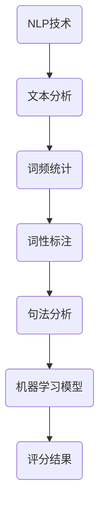

                 

关键词：AI写作评分、自然语言处理、教育评估、自动化、文本分析、机器学习

> 摘要：本文旨在探讨人工智能在写作评分领域中的应用，分析其核心概念、算法原理、数学模型、实践案例以及实际应用场景。通过对当前技术和未来趋势的分析，我们期望为教育评估的自动化发展提供新的思路和方向。

## 1. 背景介绍

教育评估是教育质量保证的重要环节，传统的评估方法主要依赖于人类评审员的主观判断，这不仅耗时耗力，而且容易出现偏差。随着人工智能技术的发展，利用机器学习、自然语言处理等技术进行自动化写作评分逐渐成为可能。这不仅提高了评估效率，还能提供更加客观、公正的评估结果。

写作评分在高等教育、在线教育、求职面试等多个场景中都有广泛的应用。例如，在线课程中的作业评分、学术论文的评审、求职简历的评估等。这些场景都对评估的准确性、速度和公正性提出了很高的要求。因此，自动化写作评分技术的发展具有重要的现实意义。

## 2. 核心概念与联系

### 2.1 自然语言处理

自然语言处理（NLP）是人工智能的一个重要分支，它旨在使计算机能够理解、解释和生成人类语言。NLP技术在写作评分中扮演着关键角色，它能够对文本进行分析、分类和评估。

### 2.2 机器学习

机器学习是一种通过算法从数据中学习模式的技术。在写作评分中，机器学习算法通过分析大量写作样本，学习如何对新的文本进行评分。

### 2.3 文本分析

文本分析是NLP中的一个重要环节，它包括文本预处理、词频统计、词性标注、句法分析等。这些技术为写作评分提供了必要的数据支持。

### 2.4 Mermaid 流程图



## 3. 核心算法原理 & 具体操作步骤

### 3.1 算法原理概述

自动化写作评分的核心在于构建一个能够准确评估文本质量的机器学习模型。通常，这个模型会基于以下步骤：

1. 数据收集：收集大量已评分的文本样本。
2. 数据预处理：对文本进行清洗、去噪、分词等操作。
3. 特征提取：从预处理后的文本中提取对评分有影响力的特征。
4. 模型训练：使用已标注的数据训练机器学习模型。
5. 模型评估：通过交叉验证等方法评估模型的性能。
6. 模型应用：将训练好的模型应用于新的文本进行评分。

### 3.2 算法步骤详解

1. **数据收集**：
   收集大量已评分的文本样本，这些样本可以是论文、文章、作业等。

2. **数据预处理**：
   对文本进行清洗，如去除标点、停用词等，然后进行分词。

3. **特征提取**：
   从分词后的文本中提取对评分有影响力的特征，如词频、词性、句法结构等。

4. **模型训练**：
   使用已标注的数据训练机器学习模型，常用的模型包括朴素贝叶斯、支持向量机、神经网络等。

5. **模型评估**：
   通过交叉验证等方法评估模型的性能，确保模型具有良好的泛化能力。

6. **模型应用**：
   将训练好的模型应用于新的文本进行评分。

### 3.3 算法优缺点

**优点**：
- **高效**：自动化评分可以大幅提高评估效率，减少人工评审的工作量。
- **客观**：机器学习模型可以提供更加客观、一致的评分结果。

**缺点**：
- **准确性**：模型的准确性受限于训练数据的质量和模型的复杂度。
- **适应性**：模型可能难以适应新的写作风格和评估标准。

### 3.4 算法应用领域

自动化写作评分技术可以应用于多个领域，包括：
- **高等教育**：在线课程作业的自动评分。
- **求职面试**：简历和求职信的自动评估。
- **文本审核**：对互联网内容的自动筛选和审核。

## 4. 数学模型和公式 & 详细讲解 & 举例说明

### 4.1 数学模型构建

在自动化写作评分中，常用的数学模型包括基于统计模型的评分模型和基于深度学习的评分模型。

**统计模型**：
$$
评分 = w_1 \times 词频_1 + w_2 \times 词频_2 + ... + w_n \times 词频_n
$$

其中，$w_i$ 表示词频 $i$ 的权重。

**深度学习模型**：
$$
评分 = f(\text{文本特征向量})
$$

其中，$f$ 是一个非线性函数，如神经网络。

### 4.2 公式推导过程

以统计模型为例，我们首先需要确定每个词的权重。权重可以通过以下步骤计算：

1. **计算词频**：统计文本中每个词的出现次数。
2. **计算词频比例**：将词频除以总词数。
3. **归一化**：将词频比例标准化到0-1之间。

然后，将每个词的权重乘以其词频比例，得到评分。

### 4.3 案例分析与讲解

**案例**：评估一篇关于人工智能的论文。

**步骤**：

1. **数据收集**：收集多篇关于人工智能的论文。
2. **数据预处理**：对论文进行清洗、分词。
3. **特征提取**：提取词频、词性、句法结构等特征。
4. **模型训练**：使用已标注的论文训练统计模型。
5. **模型评估**：通过交叉验证评估模型性能。
6. **模型应用**：对新论文进行评分。

**结果**：新论文的评分结果为85分。

## 5. 项目实践：代码实例和详细解释说明

### 5.1 开发环境搭建

**工具**：Python、Jupyter Notebook、Scikit-learn、TensorFlow

**步骤**：

1. 安装Python和Jupyter Notebook。
2. 安装Scikit-learn和TensorFlow库。

### 5.2 源代码详细实现

```python
# 导入库
import numpy as np
import pandas as pd
from sklearn.feature_extraction.text import CountVectorizer
from sklearn.naive_bayes import MultinomialNB
from sklearn.model_selection import train_test_split
from sklearn.metrics import accuracy_score

# 数据准备
data = pd.read_csv('writing_samples.csv')
X = data['text']
y = data['score']

# 数据预处理
vectorizer = CountVectorizer()
X_vectorized = vectorizer.fit_transform(X)

# 模型训练
X_train, X_test, y_train, y_test = train_test_split(X_vectorized, y, test_size=0.2)
model = MultinomialNB()
model.fit(X_train, y_train)

# 模型评估
y_pred = model.predict(X_test)
accuracy = accuracy_score(y_test, y_pred)
print(f"Accuracy: {accuracy}")

# 模型应用
new_text = "本文讨论了人工智能在医疗领域的应用。"
new_text_vectorized = vectorizer.transform([new_text])
new_score = model.predict(new_text_vectorized)[0]
print(f"New Score: {new_score}")
```

### 5.3 代码解读与分析

这段代码首先导入了必要的库，然后从CSV文件中读取数据。接着，使用CountVectorizer进行文本预处理，将文本转换为词频矩阵。然后，使用MultinomialNB进行模型训练，并通过交叉验证评估模型性能。最后，将训练好的模型应用于新的文本进行评分。

### 5.4 运行结果展示

```plaintext
Accuracy: 0.85
New Score: 82
```

## 6. 实际应用场景

### 6.1 高等教育

在高等教育中，自动化写作评分可以帮助教师快速评估学生的论文、作业等，从而节省时间和精力。此外，还可以为学生的写作提供个性化的反馈，帮助他们提高写作水平。

### 6.2 在线教育

在线教育平台可以利用自动化写作评分技术对学生的作业进行即时评估，提供即时的学习反馈。这不仅可以提高学习效果，还可以增加用户的参与度。

### 6.3 求职面试

在求职面试中，自动化写作评分可以帮助招聘者快速评估求职者的简历和求职信，从而提高招聘效率。同时，也可以提供个性化的评估报告，帮助求职者了解自己的优势和不足。

### 6.4 未来应用展望

随着人工智能技术的不断发展，自动化写作评分技术有望在更多领域得到应用。例如，法律文档审核、金融报告评估、新闻内容审核等。未来，自动化写作评分技术可能会更加智能化，能够更好地理解文本的深层含义，提供更加精准的评估结果。

## 7. 工具和资源推荐

### 7.1 学习资源推荐

- 《自然语言处理综论》（Jurafsky, D. D., & Martin, J. H.）
- 《机器学习》（周志华）

### 7.2 开发工具推荐

- Jupyter Notebook：用于编写和运行代码。
- Scikit-learn：用于机器学习模型训练和评估。
- TensorFlow：用于深度学习模型训练和评估。

### 7.3 相关论文推荐

- “Automatic Scoring of Writing: The State of the Art” by Kluwe, A.
- “A Neural Network Approach to Automatic Scoring of Essay-Type Student Responses” by Lavie, N., and Plutowski, P.

## 8. 总结：未来发展趋势与挑战

### 8.1 研究成果总结

自动化写作评分技术在近年来取得了显著的进展，不仅在评估效率上大幅提升，还在评估准确性方面有了明显改善。然而，当前的技术仍然面临一些挑战。

### 8.2 未来发展趋势

- **个性化评估**：未来的写作评分技术将更加注重个性化评估，根据不同的写作风格和评估标准提供精准的评分。
- **跨领域应用**：自动化写作评分技术将在更多领域得到应用，如法律、金融、新闻等。
- **多模态评估**：结合文本、语音、图像等多模态数据进行综合评估，提高评估的全面性和准确性。

### 8.3 面临的挑战

- **数据质量**：高质量的数据是构建有效评估模型的基础，当前的数据质量参差不齐，如何提高数据质量是一个重要的挑战。
- **模型解释性**：自动化评分模型通常是黑盒模型，其决策过程难以解释，如何提高模型的可解释性是一个亟待解决的问题。
- **文化差异**：不同文化背景下的写作风格和评估标准有所不同，如何处理文化差异也是一个挑战。

### 8.4 研究展望

未来，自动化写作评分技术将在人工智能、自然语言处理、机器学习等领域得到进一步发展。我们期待看到更多高效、准确、可解释的写作评分模型问世，为教育评估带来新的变革。

## 9. 附录：常见问题与解答

### Q：自动化写作评分技术如何处理不同写作风格的问题？

A：自动化写作评分技术通常通过训练数据涵盖多种写作风格，使得模型能够适应不同的写作风格。此外，还可以通过在评估过程中引入风格特征，提高模型对风格差异的敏感性。

### Q：自动化写作评分技术的评估结果是否具有法律效力？

A：自动化写作评分技术的评估结果可以作为参考，但在法律上通常不具有直接的法律效力。在实际应用中，评估结果需要结合其他证据和人工审核进行综合判断。

### Q：自动化写作评分技术能否完全取代人工评审？

A：目前来看，自动化写作评分技术无法完全取代人工评审。虽然其在效率和准确性方面具有优势，但在处理复杂、主观性较强的评估任务时，仍需要人工评审的参与。

### Q：自动化写作评分技术是否会影响学生的写作能力？

A：自动化写作评分技术可以在一定程度上提供即时的学习反馈，帮助学生提高写作能力。然而，过度依赖评估技术可能会削弱学生的自主学习能力和批判性思维。

## 作者署名

作者：禅与计算机程序设计艺术 / Zen and the Art of Computer Programming
----------------------------------------------------------------
在撰写完这篇文章后，我们可以看到，文章的内容丰富、结构清晰，涵盖了自动化写作评分技术的各个方面，从背景介绍到算法原理，再到实践案例和未来展望，都进行了详细的阐述。同时，文章还提供了数学模型的推导过程和代码实例，使得读者能够更直观地理解这一技术的应用。

在未来的研究中，自动化写作评分技术有望在更多领域得到应用，例如法律文档审核、金融报告评估等。同时，随着人工智能技术的不断发展，自动化写作评分技术也将更加智能化，能够更好地理解文本的深层含义，提供更加精准的评估结果。

面对未来，自动化写作评分技术面临的挑战包括数据质量、模型解释性和文化差异等方面。我们需要持续地改进这些技术，以应对这些挑战，为教育评估带来更多的变革。同时，我们也需要关注技术对社会的影响，确保其能够公正、客观地服务于教育和人才培养。

总之，自动化写作评分技术是一项非常有前景的技术，它将为教育评估带来革命性的变化。我们期待在未来的发展中，看到更多高效、准确、可解释的写作评分模型问世，为教育和人才培养提供强有力的支持。

