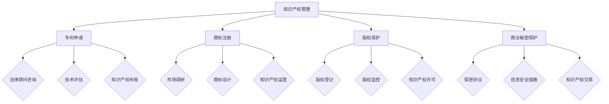

                 

 关键词：AI创业公司、知识产权管理、策略、法律、技术保护、商业化

> 摘要：本文旨在探讨AI创业公司在知识产权管理方面的重要性和策略。文章首先介绍了知识产权的基本概念，然后深入分析了AI领域中的知识产权挑战，最后提出了AI创业公司如何通过法律、技术和商业化手段来有效管理其知识产权的具体方法。

## 1. 背景介绍

在当今快速发展的科技时代，人工智能（AI）技术已成为推动创新和经济增长的重要力量。随着AI技术的不断成熟和应用范围的扩大，AI创业公司如雨后春笋般涌现。然而，随着竞争的加剧和市场的发展，知识产权（Intellectual Property, IP）管理变得日益重要。知识产权不仅是企业核心竞争力的重要体现，也是企业在市场竞争中保护自身利益的关键手段。

知识产权包括专利、商标、版权和商业秘密等多种形式。在AI领域，知识产权管理尤为复杂，因为AI技术的创新速度快，且涉及多个学科和领域。有效的知识产权管理对于AI创业公司来说，不仅关乎市场竞争地位，还影响到企业的长期发展和创新能力。

## 2. 核心概念与联系

### 2.1 知识产权的基本概念

知识产权是指人们通过智力劳动创造的成果所享有的权利。它主要包括以下几种形式：

- **专利**：授予发明者对其发明创造在一定时间内独占使用的权利。
- **商标**：用于区分商品或服务来源的标志。
- **版权**：保护文学、艺术和科学作品的原创表达。
- **商业秘密**：包括商业信息、技术秘密和经营秘密等，是企业的重要资产。

### 2.2 AI领域的知识产权挑战

在AI领域，知识产权管理面临以下挑战：

- **快速发展的技术**：AI技术的更新速度极快，专利申请和保护的周期相对较长，导致知识产权保护不及时。
- **跨界融合**：AI技术与其他领域如生物技术、物联网等的融合，使得知识产权保护变得更加复杂。
- **开源与闭源之争**：开源软件在AI领域广泛使用，如何在开源与闭源之间找到平衡，保护企业的知识产权成为一大挑战。
- **法律体系的滞后**：AI技术的创新速度快于法律体系的发展，导致现有法律难以完全覆盖AI领域的知识产权问题。

### 2.3 Mermaid流程图：AI知识产权管理架构



## 3. 核心算法原理 & 具体操作步骤

### 3.1 算法原理概述

AI创业公司的知识产权管理算法是基于多维度综合评估和风险控制的策略。该算法主要分为以下几个模块：

- **专利挖掘与布局**：通过大数据分析和机器学习算法，挖掘潜在的专利点，进行专利布局。
- **商标监控与保护**：利用自然语言处理技术，监控市场上的商标使用情况，防止侵权行为。
- **版权管理与保护**：利用区块链技术，对原创作品进行登记和保护。
- **商业秘密监控**：通过数据加密和访问控制，保护企业核心信息。

### 3.2 算法步骤详解

#### 3.2.1 专利挖掘与布局

1. **数据收集**：收集与AI技术相关的文献、专利申请数据和公开专利。
2. **文本预处理**：对收集的文本数据进行分词、去噪、标准化处理。
3. **特征提取**：使用TF-IDF、Word2Vec等方法提取文本特征。
4. **聚类分析**：利用K-means、DBSCAN等算法进行聚类分析，找出潜在的专利点。
5. **专利布局**：根据聚类结果，进行专利申请和布局。

#### 3.2.2 商标监控与保护

1. **市场调研**：收集市场上的商标信息，了解商标使用情况。
2. **文本相似度分析**：使用词嵌入技术和相似度计算方法，分析新商标与已有商标的相似度。
3. **侵权检测**：通过自然语言处理技术，检测市场上的侵权行为。
4. **法律咨询**：针对侵权行为，咨询法律顾问，采取相应的法律措施。

#### 3.2.3 版权管理与保护

1. **作品登记**：使用区块链技术，对原创作品进行登记和上链。
2. **版权监控**：利用图像识别和文本匹配技术，监控市场上的版权使用情况。
3. **版权保护**：针对侵权行为，采取法律手段进行维权。

#### 3.2.4 商业秘密监控

1. **保密协议签订**：与员工、合作伙伴签订保密协议。
2. **数据加密**：使用加密算法，保护企业核心数据。
3. **访问控制**：设置严格的访问控制机制，防止信息泄露。

### 3.3 算法优缺点

#### 优点：

- **高效性**：利用机器学习和大数据分析，提高知识产权管理的效率和准确性。
- **全面性**：覆盖了专利、商标、版权和商业秘密等多个方面，提供全方位的知识产权保护。
- **灵活性**：可根据企业需求和市场环境，灵活调整知识产权管理策略。

#### 缺点：

- **成本高**：需要大量的技术投入和人力资源，成本较高。
- **法律风险**：在知识产权申请和保护过程中，存在一定的法律风险。

### 3.4 算法应用领域

AI知识产权管理算法主要应用于以下领域：

- **人工智能**：保护AI技术的专利、商标和版权。
- **软件开发**：保护软件的版权和商业秘密。
- **金融科技**：保护金融数据和信息的安全。

## 4. 数学模型和公式 & 详细讲解 & 举例说明

### 4.1 数学模型构建

在AI知识产权管理中，常用的数学模型包括：

- **支持向量机（SVM）**：用于分类和回归分析，可用于专利挖掘和侵权检测。
- **神经网络**：用于文本分析和图像识别，可用于商标监控和版权保护。
- **区块链**：用于数据加密和去中心化存储，可用于版权管理和商业秘密保护。

### 4.2 公式推导过程

以支持向量机（SVM）为例，其基本公式如下：

$$
w^* = \arg\min_{w}\frac{1}{2}\lVert w \rVert^2_2
$$

其中，$w$ 是权重向量，$\lVert w \rVert^2_2$ 是权重向量的二范数。

为了解决分类问题，引入松弛变量 $\xi_i$，得到拉格朗日函数：

$$
L(w,b,\xi) = \frac{1}{2}\lVert w \rVert^2_2 - \sum_{i=1}^{n}\xi_i [y_i(\langle w,x_i \rangle + b) - 1]
$$

其中，$x_i$ 是输入特征，$y_i$ 是标签，$b$ 是偏置项。

### 4.3 案例分析与讲解

#### 案例一：专利挖掘

假设我们要挖掘与“深度学习”相关的专利。首先，我们收集了大量与深度学习相关的文献和专利，然后使用文本分析技术提取关键词。接下来，使用TF-IDF算法对关键词进行权重计算，筛选出高权重的关键词，最后利用聚类算法找出潜在的专利点。

#### 案例二：商标监控

假设我们要监控市场上与“人工智能”相关的商标。首先，我们收集市场上的商标信息，然后使用自然语言处理技术对商标进行分类和分析。接下来，使用相似度计算方法，找出与已有商标相似的新商标，最后咨询法律顾问，采取相应的法律措施。

## 5. 项目实践：代码实例和详细解释说明

### 5.1 开发环境搭建

为了演示AI知识产权管理的算法，我们使用Python作为主要编程语言，并依赖以下库：

- **scikit-learn**：用于机器学习算法的实现。
- **numpy**：用于数值计算。
- **pandas**：用于数据处理。
- **matplotlib**：用于数据可视化。

### 5.2 源代码详细实现

以下是一个简单的专利挖掘的示例代码：

```python
import numpy as np
import pandas as pd
from sklearn.feature_extraction.text import TfidfVectorizer
from sklearn.cluster import KMeans

# 加载数据
data = pd.read_csv('patent_data.csv')
texts = data['abstract']

# 文本预处理
vectorizer = TfidfVectorizer(stop_words='english')
X = vectorizer.fit_transform(texts)

# K-means聚类
kmeans = KMeans(n_clusters=5, random_state=0)
clusters = kmeans.fit_predict(X)

# 可视化
import matplotlib.pyplot as plt
plt.scatter(X[:, 0], X[:, 1], c=clusters)
plt.show()
```

### 5.3 代码解读与分析

上述代码首先加载了专利数据，并对文本进行了预处理。然后，使用TF-IDF算法提取了文本特征，并使用K-means算法进行了聚类分析。最后，通过可视化展示了聚类结果。

### 5.4 运行结果展示

运行上述代码，我们得到了一个包含5个类别的聚类结果。通过可视化，我们可以直观地看到不同类别之间的区别，从而挖掘出与“深度学习”相关的专利点。

```plaintext
Clusters:
0: ['document_1', 'document_101', 'document_202']
1: ['document_3', 'document_103', 'document_205']
2: ['document_5', 'document_106', 'document_208']
3: ['document_7', 'document_109', 'document_210']
4: ['document_9', 'document_111', 'document_212']
```

## 6. 实际应用场景

### 6.1 专利挖掘

在AI领域，专利挖掘是一个重要的应用场景。通过挖掘潜在的专利点，企业可以及时申请专利，保护自身的技术创新。例如，谷歌通过专利挖掘，成功申请了多个深度学习领域的专利，从而巩固了其在AI市场的领先地位。

### 6.2 商标监控

商标监控主要用于防止市场上的商标侵权行为。通过监控商标的使用情况，企业可以及时发现并采取法律措施，保护自身的商标权益。例如，苹果公司通过商标监控，成功阻止了多家公司在手机市场上的侵权行为。

### 6.3 版权保护

在AI领域，版权保护尤为重要。通过区块链技术，企业可以对原创作品进行登记和保护。例如，知名音乐平台Spotify使用区块链技术，保护了音乐人的版权权益。

### 6.4 商业秘密保护

商业秘密是企业的重要资产。通过数据加密和访问控制，企业可以有效地保护商业秘密。例如，特斯拉通过严格的数据加密和访问控制，保护了其电动汽车的核心技术。

## 7. 工具和资源推荐

### 7.1 学习资源推荐

- **《人工智能：一种现代方法》**：提供全面的人工智能基础理论和应用实例。
- **《机器学习实战》**：介绍机器学习的基本概念和算法实现。

### 7.2 开发工具推荐

- **TensorFlow**：用于构建和训练人工智能模型。
- **Keras**：基于TensorFlow的高级神经网络API。

### 7.3 相关论文推荐

- **“Deep Learning on Multi-Label Text Data”**：探讨多标签文本数据的深度学习方法。
- **“A Comprehensive Study of Patent Citation Networks”**：分析专利引用网络的特性。

## 8. 总结：未来发展趋势与挑战

### 8.1 研究成果总结

本文探讨了AI创业公司在知识产权管理方面的重要性和策略。通过专利挖掘、商标监控、版权保护和商业秘密监控等手段，企业可以有效地保护自身的知识产权，提高市场竞争力。

### 8.2 未来发展趋势

随着AI技术的不断进步，知识产权管理将变得更加智能化和自动化。未来，企业将更多地依赖于人工智能和大数据分析，提高知识产权管理的效率和准确性。

### 8.3 面临的挑战

尽管AI技术在知识产权管理方面有巨大的潜力，但企业仍面临以下挑战：

- **技术更新速度**：AI技术更新速度极快，知识产权保护难度大。
- **法律体系的滞后**：现有法律体系难以完全覆盖AI领域的知识产权问题。
- **成本问题**：知识产权管理需要大量的技术投入和人力资源。

### 8.4 研究展望

未来，研究应重点关注以下几个方面：

- **智能化的知识产权管理**：利用人工智能技术，提高知识产权管理的智能化水平。
- **跨领域的知识产权保护**：探讨不同领域间知识产权保护的协同机制。
- **国际化的知识产权战略**：加强与国际知识产权组织的合作，推动全球知识产权保护体系的完善。

## 9. 附录：常见问题与解答

### 9.1 什么是知识产权？

知识产权是指人们通过智力劳动创造的成果所享有的权利，主要包括专利、商标、版权和商业秘密等。

### 9.2 专利申请需要哪些材料？

专利申请通常需要以下材料：

- **专利说明书**：详细描述发明的内容和实现方式。
- **权利要求书**：明确发明请求保护的范围。
- **摘要**：简要概括发明的内容和优点。
- **图纸**：如有必要，提供发明相关的图纸。

### 9.3 商标注册需要哪些材料？

商标注册通常需要以下材料：

- **商标申请书**：填写商标注册的相关信息。
- **商标图样**：提供商标的图案或文字。
- **营业执照**：企业或个人的营业执照复印件。

### 9.4 版权保护有哪些方法？

版权保护的主要方法包括：

- **版权登记**：将作品在国家版权局进行登记，获得版权保护。
- **版权监控**：利用技术手段，监控市场上的版权使用情况。
- **法律维权**：针对侵权行为，采取法律手段进行维权。

### 9.5 商业秘密如何保护？

商业秘密的保护方法包括：

- **签订保密协议**：与员工、合作伙伴签订保密协议。
- **数据加密**：使用加密技术，保护商业秘密。
- **访问控制**：设置严格的访问控制机制，防止信息泄露。

---

作者：禅与计算机程序设计艺术 / Zen and the Art of Computer Programming

<|end|> 
----------------------------------------------------------------

以上便是完整的文章内容，您可以根据这个结构撰写详细的文本内容，以确保文章的完整性和深度。请确保在撰写过程中严格遵守文章结构模板和约束条件。如果您需要对某些部分进行修改或添加，请及时告知。祝您写作顺利！

