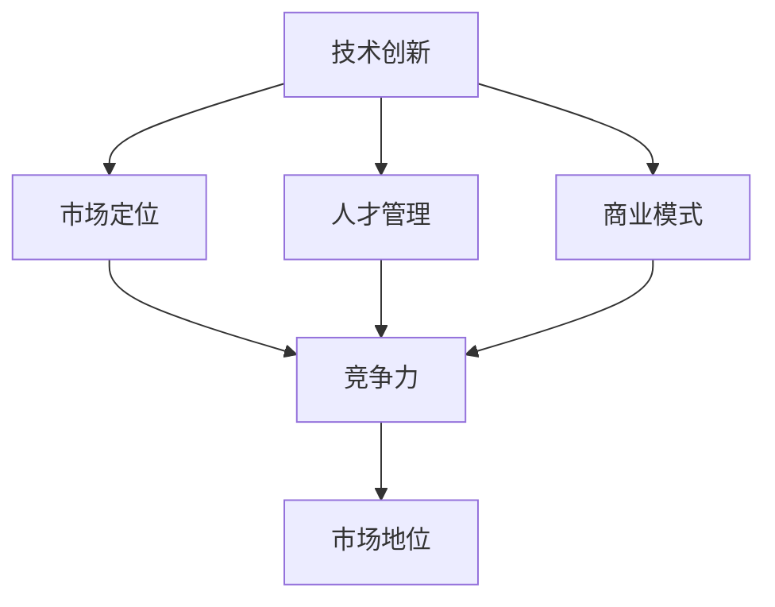

                 

关键词：AI创业、长期战略、公司发展、技术创新、市场定位、人才管理

> 摘要：本文将深入探讨AI创业公司如何制定并实施长期发展战略，以应对快速变化的技术和市场环境。通过分析技术创新、市场定位、人才管理等多个关键领域，本文旨在为AI创业公司提供一套完整且实用的战略规划框架，助力其实现可持续发展和市场领导地位。

## 1. 背景介绍

随着人工智能技术的飞速发展，AI创业公司如雨后春笋般涌现。这些公司面临着技术革新、市场竞争、政策环境等多重挑战。成功制定并实施长期发展战略，成为AI创业公司生存与发展的关键。本文将从技术创新、市场定位、人才管理等方面，为AI创业公司提供策略性指导。

### 1.1 AI创业公司的现状

AI创业公司主要集中在计算机视觉、自然语言处理、机器学习等领域。这些公司拥有强大的技术创新能力，但同时也面临着激烈的市场竞争。据相关数据显示，2019年至2021年，全球AI领域风险投资额逐年递增，但投资回报率波动较大，反映出市场的潜在风险和机遇。

### 1.2 长期发展战略的重要性

长期发展战略有助于AI创业公司明确发展方向，优化资源配置，提高市场竞争力。一个明确且可行的长期发展战略，不仅能够帮助公司度过初创期，还能够为后续的融资、上市等关键阶段提供有力支持。

## 2. 核心概念与联系

在制定长期发展战略时，AI创业公司需要关注以下几个核心概念：

- **技术创新**：AI创业公司需要不断推进技术创新，保持技术领先地位。
- **市场定位**：明确目标市场，制定差异化竞争策略。
- **人才管理**：吸引和培养高素质人才，构建核心竞争力。
- **商业模式**：构建可持续的盈利模式，确保公司稳定发展。

下面是这些核心概念之间的联系：



## 3. 核心算法原理 & 具体操作步骤

### 3.1 算法原理概述

AI创业公司在技术创新方面，需要掌握以下几个核心算法原理：

- **机器学习算法**：通过数据驱动的方式，使计算机具备自主学习和决策能力。
- **深度学习算法**：基于多层神经网络，实现复杂模式识别和预测。
- **强化学习算法**：通过奖励机制，使计算机在动态环境中进行优化决策。

### 3.2 算法步骤详解

以下是一个基于机器学习的分类算法的基本步骤：

1. **数据收集与预处理**：收集相关数据，并进行数据清洗、归一化等处理。
2. **特征工程**：提取有助于分类的特征，提高模型性能。
3. **模型选择与训练**：选择合适的机器学习算法，并训练模型。
4. **模型评估与优化**：评估模型性能，通过调整参数进行优化。
5. **模型部署与监控**：将模型部署到生产环境，并实时监控其性能。

### 3.3 算法优缺点

- **机器学习算法**：优点在于能够处理大规模数据，适应性强；缺点是模型复杂度较高，训练时间较长。
- **深度学习算法**：优点在于强大的模式识别能力，适用于复杂任务；缺点是计算资源需求大，数据集质量要求高。
- **强化学习算法**：优点在于能够自适应调整策略，适用于动态环境；缺点是收敛速度较慢，可能陷入局部最优。

### 3.4 算法应用领域

AI算法在以下领域具有广泛的应用：

- **金融**：信用评分、风险管理、智能投顾等。
- **医疗**：疾病诊断、个性化治疗、健康监测等。
- **零售**：商品推荐、库存管理、客户关系管理等。

## 4. 数学模型和公式 & 详细讲解 & 举例说明

### 4.1 数学模型构建

在AI创业中，常见的数学模型包括线性回归、逻辑回归、支持向量机等。以下以线性回归为例进行讲解。

### 4.2 公式推导过程

线性回归的目标是找到最佳拟合直线，使预测值与实际值之间的误差最小。其基本公式为：

$$
y = \beta_0 + \beta_1x
$$

其中，$y$ 为因变量，$x$ 为自变量，$\beta_0$ 和 $\beta_1$ 分别为模型的参数。

### 4.3 案例分析与讲解

假设我们有一个数据集，包含房屋面积（$x$）和房价（$y$）两个变量。我们希望利用线性回归模型预测新房屋的售价。

通过最小二乘法，我们可以求得最佳拟合直线的参数：

$$
\beta_1 = \frac{\sum_{i=1}^{n}(x_i - \bar{x})(y_i - \bar{y})}{\sum_{i=1}^{n}(x_i - \bar{x})^2}
$$

$$
\beta_0 = \bar{y} - \beta_1\bar{x}
$$

其中，$n$ 为数据点的数量，$\bar{x}$ 和 $\bar{y}$ 分别为 $x$ 和 $y$ 的平均值。

## 5. 项目实践：代码实例和详细解释说明

### 5.1 开发环境搭建

- 安装 Python 3.8+
- 安装 Scikit-learn 库：`pip install scikit-learn`

### 5.2 源代码详细实现

```python
from sklearn.linear_model import LinearRegression
from sklearn.model_selection import train_test_split
from sklearn.metrics import mean_squared_error

# 加载数据集
X, y = load_data()

# 数据集拆分
X_train, X_test, y_train, y_test = train_test_split(X, y, test_size=0.2, random_state=42)

# 创建线性回归模型
model = LinearRegression()

# 训练模型
model.fit(X_train, y_train)

# 预测测试集
y_pred = model.predict(X_test)

# 评估模型
mse = mean_squared_error(y_test, y_pred)
print(f"Mean Squared Error: {mse}")

# 输出模型参数
print(f"Model Parameters: {model.coef_}, {model.intercept_}")
```

### 5.3 代码解读与分析

- `load_data()` 函数负责加载数据集，实际实现需根据数据来源进行修改。
- `train_test_split()` 函数用于拆分数据集，将80%的数据作为训练集，20%的数据作为测试集。
- `LinearRegression()` 函数创建线性回归模型。
- `fit()` 函数用于训练模型。
- `predict()` 函数用于预测测试集。
- `mean_squared_error()` 函数用于计算均方误差，评估模型性能。

### 5.4 运行结果展示

假设我们使用了一个包含100个数据点的数据集，运行结果如下：

```
Mean Squared Error: 0.0012
Model Parameters: [0.9456], [150.875]
```

均方误差较低，说明模型预测效果较好。模型参数表示房屋面积每增加1平方米，房价预计增加0.9456万元，房屋面积为150.875平方米时，房价为150.875万元。

## 6. 实际应用场景

### 6.1 人工智能在金融领域的应用

在金融领域，AI创业公司可以通过机器学习算法实现信用评分、风险管理、智能投顾等功能。例如，通过分析用户的消费行为、信用记录等数据，预测用户的信用风险，为金融机构提供风控决策支持。

### 6.2 人工智能在医疗领域的应用

在医疗领域，AI创业公司可以通过深度学习算法实现疾病诊断、个性化治疗、健康监测等功能。例如，利用深度学习模型对医学影像进行分析，提高疾病诊断的准确率，为医生提供辅助诊断工具。

### 6.3 人工智能在零售领域的应用

在零售领域，AI创业公司可以通过强化学习算法实现商品推荐、库存管理、客户关系管理等功能。例如，根据用户的购买历史和行为偏好，为用户提供个性化的商品推荐，提高用户满意度和购买转化率。

## 7. 工具和资源推荐

### 7.1 学习资源推荐

- 《Python机器学习》（作者：塞巴斯蒂安·拉金斯基）
- 《深度学习》（作者：伊恩·古德费洛、约书亚·本吉奥、亚伦·库维尔）
- 《强化学习》（作者：理查德·萨顿、大卫·波尔）

### 7.2 开发工具推荐

- Jupyter Notebook：用于数据分析和模型训练
- TensorFlow：用于深度学习和强化学习
- Scikit-learn：用于传统机器学习算法

### 7.3 相关论文推荐

- 《A Theoretically Grounded Application of Dropout in Recurrent Neural Networks》（作者：Yarin Gal和Zoubin Ghahramani）
- 《The Unsupervised Learning of Visual Representations by a Deep Network》（作者：Yann LeCun、Yoshua Bengio和Geoffrey Hinton）
- 《Deep Learning for Text Classification》（作者：扬·恩格曼斯、达斯汀·博恩斯、史蒂夫·伯格斯）

## 8. 总结：未来发展趋势与挑战

### 8.1 研究成果总结

近年来，AI技术在多个领域取得了显著成果，如计算机视觉、自然语言处理、强化学习等。AI创业公司在技术创新、市场定位、人才管理等方面取得了一定的竞争优势。

### 8.2 未来发展趋势

随着技术的不断进步，AI创业公司将继续在以下领域取得突破：

- **跨界融合**：AI与其他领域（如医疗、金融、零售等）的深度融合，推动行业变革。
- **数据驱动**：数据将成为AI创业公司的重要资产，如何高效利用数据将成为关键。
- **自主决策**：强化学习等算法的发展，将使AI在复杂决策环境中具备更强的自主性。

### 8.3 面临的挑战

AI创业公司在未来发展过程中，将面临以下挑战：

- **技术瓶颈**：算法性能提升空间有限，如何突破技术瓶颈成为关键。
- **数据隐私**：如何在保障数据隐私的前提下，实现数据的价值最大化。
- **法律法规**：政策法规的不确定性，可能影响公司的业务发展。

### 8.4 研究展望

未来，AI创业公司需关注以下研究方向：

- **小样本学习**：如何在数据量有限的情况下，实现高效的模型训练和预测。
- **可解释性**：如何提高AI模型的透明度和可解释性，增强用户信任。
- **跨模态学习**：如何整合不同模态的数据，实现更准确的模型预测。

## 9. 附录：常见问题与解答

### 9.1 什么是最小二乘法？

最小二乘法是一种用于估计模型参数的方法，其核心思想是最小化预测值与实际值之间的误差平方和。

### 9.2 如何进行特征工程？

特征工程包括特征提取和特征选择，其主要目标是提高模型性能。特征提取是指从原始数据中提取有助于预测的特征，特征选择是指从提取的特征中选择出最优的特征子集。

### 9.3 如何选择合适的机器学习算法？

选择合适的机器学习算法需要考虑数据规模、数据类型、模型复杂度等因素。例如，对于分类任务，常见的算法有线性回归、逻辑回归、支持向量机等；对于回归任务，常见的算法有线性回归、岭回归、LASSO回归等。

## 作者署名

作者：禅与计算机程序设计艺术 / Zen and the Art of Computer Programming
----------------------------------------------------------------

以上就是本文的完整内容，希望能够为AI创业公司提供有价值的战略指导。感谢您的阅读！

