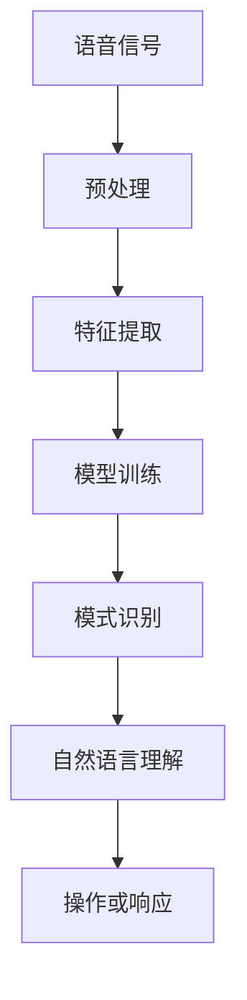

                 

关键词：语音识别、AI创业、市场定位、技术创新、商业模式、用户体验、数据驱动、差异化策略

摘要：随着人工智能技术的快速发展，语音识别市场正迎来前所未有的机遇。本文将探讨如何在语音识别市场中实现创业项目的成功，从市场定位、技术创新、商业模式、用户体验、数据驱动以及差异化策略等多个方面提供见解和建议。

## 1. 背景介绍

语音识别技术作为人工智能领域的一个重要分支，正逐步改变着我们的生活方式。从智能助手、智能家居到自动驾驶、医疗诊断，语音识别技术的应用已经渗透到了各行各业。根据市场研究机构的数据，全球语音识别市场规模在过去几年中保持了快速增长，预计未来几年将继续保持这一趋势。

在这一背景下，越来越多的创业者投身于语音识别领域的创业项目。然而，由于市场的高度竞争和技术门槛的存在，如何在这片蓝海中脱颖而出成为了一项挑战。本文将围绕以下几个关键问题进行探讨：

- 如何在竞争激烈的市场中找到合适的定位？
- 技术创新在语音识别创业中的重要性如何？
- 商业模式如何设计才能确保项目的可持续发展？
- 用户体验在语音识别应用中的角色是什么？
- 数据驱动策略在语音识别创业中的实践方法是什么？
- 如何制定有效的差异化策略？

通过对上述问题的深入分析，本文旨在为语音识别领域的创业者提供有价值的参考和指导。

## 2. 核心概念与联系

### 2.1 语音识别技术概述

语音识别技术是将人类的语音转换为文本或命令的过程。其核心概念包括语音信号处理、特征提取、模式识别和自然语言理解。语音信号处理主要涉及信号预处理，如噪声过滤、音高提取等；特征提取则是将预处理后的语音信号转化为能够表示语音特征的数学模型；模式识别则是通过训练模型识别不同的语音模式；自然语言理解则是将语音识别结果转化为具体的操作或响应。

### 2.2 语音识别技术架构

语音识别技术通常包括前端和后端两个主要部分。前端主要负责语音信号的采集、预处理和特征提取；后端则负责模式识别和自然语言理解。以下是一个简化的语音识别技术架构图：



### 2.3 语音识别技术的应用领域

语音识别技术广泛应用于智能助手、智能家居、语音搜索、语音控制、语音翻译、医疗诊断等多个领域。以下是一些具体的应用实例：

- 智能助手：如苹果的Siri、亚马逊的Alexa、谷歌助手等，它们能够理解用户的语音指令，提供相应的服务或信息。
- 智能家居：通过语音控制家居设备，实现自动化和智能化管理。
- 语音搜索：在搜索引擎中，用户可以通过语音输入关键词进行搜索。
- 语音控制：在汽车、电视、音响等设备中，用户可以通过语音指令进行操作。
- 医疗诊断：医生可以通过语音识别记录病历、诊断病情，提高医疗效率。

### 2.4 语音识别技术的挑战与机遇

语音识别技术面临的主要挑战包括：

- 语音信号的多样性：不同的说话人、不同的语音环境都会影响语音识别的准确性。
- 噪声干扰：噪声会降低语音识别的性能，特别是在嘈杂的环境中。
- 语言理解复杂性：自然语言理解是语音识别技术的难点，需要深入理解语言的结构和含义。

然而，随着人工智能技术的不断进步，这些挑战也在逐步得到解决。同时，语音识别技术所带来的机遇也是巨大的：

- 智能化生活的普及：随着5G和物联网技术的发展，智能设备的普及为语音识别技术提供了更广泛的应用场景。
- 数据驱动的进步：大规模语音数据的积累为语音识别技术的训练和优化提供了有力支持。
- 商业模式的创新：语音识别技术可以应用于多种商业场景，为企业带来新的增长点。

## 3. 核心算法原理 & 具体操作步骤

### 3.1 算法原理概述

语音识别算法的核心是基于机器学习和深度学习技术。其中，卷积神经网络（CNN）和循环神经网络（RNN）是最常用的两种网络结构。CNN适用于处理时序数据，如语音信号；RNN则适用于处理序列数据，如文本序列。以下是一个简化的语音识别算法流程：

1. **语音信号预处理**：包括噪声过滤、增强、分段等。
2. **特征提取**：使用CNN提取语音信号的时频特征。
3. **声学模型训练**：使用提取的特征训练声学模型。
4. **语言模型训练**：使用大量文本数据训练语言模型。
5. **语音识别**：结合声学模型和语言模型，对输入语音进行识别。

### 3.2 算法步骤详解

#### 3.2.1 语音信号预处理

语音信号预处理是语音识别的关键步骤之一。其主要目的是去除噪声、增强语音信号、将连续的语音信号分割为离散的语音帧。以下是具体的预处理步骤：

1. **噪声过滤**：使用滤波器去除背景噪声，如噪声抑制技术。
2. **增强**：增强语音信号中的关键信息，如语音增强技术。
3. **分段**：将连续的语音信号分割为固定长度的语音帧，如每帧20毫秒。

#### 3.2.2 特征提取

特征提取是语音识别算法的核心步骤。其目的是从预处理后的语音信号中提取出能够代表语音特征的数学表示。以下是常用的特征提取方法：

1. **梅尔频率倒谱系数（MFCC）**：将语音信号转换为频率域的特征表示。
2. **短时傅里叶变换（STFT）**：将语音信号转换为时频域的特征表示。
3. **滤波器组（Filter Banks）**：将语音信号分解为多个子带，每个子带使用不同的滤波器进行特征提取。

#### 3.2.3 声学模型训练

声学模型是语音识别算法中的核心组件之一。其目的是将特征提取后的语音信号映射到概率分布。以下是常用的声学模型：

1. **高斯混合模型（GMM）**：将语音特征映射到高斯分布。
2. **深度神经网络（DNN）**：使用深度学习技术对语音特征进行建模。
3. **循环神经网络（RNN）**：对时序数据进行建模，如LSTM和GRU。

#### 3.2.4 语言模型训练

语言模型是语音识别算法中的另一个核心组件。其目的是将识别结果映射到具体的操作或响应。以下是常用的语言模型：

1. **N-gram模型**：基于历史数据预测下一个词的概率。
2. **递归神经网络（RNN）**：对文本序列进行建模。
3. **变换器（Transformer）**：基于自注意力机制进行建模。

#### 3.2.5 语音识别

语音识别是将输入语音信号转换为文本或命令的过程。其核心是基于声学模型和语言模型进行解码。以下是常用的解码算法：

1. **贪心解码**：根据最大概率进行解码。
2. **动态规划解码**：使用动态规划算法找到最优路径。
3. **注意力机制解码**：基于注意力机制进行解码，提高识别准确性。

### 3.3 算法优缺点

#### 优点：

1. **高准确性**：现代深度学习算法在语音识别任务上取得了显著的准确性提升。
2. **实时性**：语音识别算法具有实时性，可以快速处理输入的语音信号。
3. **自适应性强**：语音识别算法可以根据不同的语音环境和说话人进行自适应调整。

#### 缺点：

1. **对噪声敏感**：噪声干扰会影响语音识别的准确性。
2. **计算量大**：深度学习算法需要大量的计算资源，特别是大规模的训练数据集。
3. **数据依赖性**：语音识别算法对训练数据有很强的依赖性，数据质量和数量直接影响算法的性能。

### 3.4 算法应用领域

语音识别算法在多个领域都有广泛的应用：

1. **智能助手**：如苹果的Siri、亚马逊的Alexa等，它们能够理解用户的语音指令，提供相应的服务或信息。
2. **智能家居**：通过语音控制家居设备，实现自动化和智能化管理。
3. **语音搜索**：在搜索引擎中，用户可以通过语音输入关键词进行搜索。
4. **语音控制**：在汽车、电视、音响等设备中，用户可以通过语音指令进行操作。
5. **医疗诊断**：医生可以通过语音识别记录病历、诊断病情，提高医疗效率。
6. **语音翻译**：将一种语言的语音翻译成另一种语言的文本或语音。

## 4. 数学模型和公式 & 详细讲解 & 举例说明

### 4.1 数学模型构建

语音识别的数学模型主要包括声学模型和语言模型两部分。声学模型用于将语音特征映射到概率分布，而语言模型则用于将识别结果映射到具体的操作或响应。

#### 声学模型

声学模型常用的方法包括高斯混合模型（GMM）和深度神经网络（DNN）。

1. **高斯混合模型（GMM）**

GMM是一种概率模型，用于表示语音特征的概率分布。其数学模型可以表示为：

$$
P(\text{feature}|\text{model}) = \sum_{k=1}^{K} \pi_k \mathcal{N}(\text{feature}|\mu_k, \Sigma_k)
$$

其中，$K$ 表示高斯分布的个数，$\pi_k$ 表示第 $k$ 个高斯分布的权重，$\mu_k$ 和 $\Sigma_k$ 分别表示第 $k$ 个高斯分布的均值和协方差矩阵。

2. **深度神经网络（DNN）**

DNN是一种深度学习模型，用于对语音特征进行建模。其数学模型可以表示为：

$$
h = f(W \cdot x + b)
$$

其中，$h$ 表示输出特征，$x$ 表示输入特征，$W$ 和 $b$ 分别表示权重和偏置，$f$ 表示激活函数。

#### 语言模型

语言模型常用的方法包括N-gram模型和递归神经网络（RNN）。

1. **N-gram模型**

N-gram模型是一种基于历史数据的语言模型。其数学模型可以表示为：

$$
P(\text{word}_t|\text{word}_{t-1}, \ldots, \text{word}_1) = \frac{N(\text{word}_t, \text{word}_{t-1}, \ldots, \text{word}_1)}{N(\text{word}_{t-1}, \ldots, \text{word}_1)}
$$

其中，$N(\cdot)$ 表示词频。

2. **递归神经网络（RNN）**

RNN是一种基于序列数据的语言模型。其数学模型可以表示为：

$$
h_t = \text{tanh}(W_h \cdot [h_{t-1}, x_t] + b_h)
$$

$$
y_t = \text{softmax}(W_y \cdot h_t + b_y)
$$

其中，$h_t$ 表示隐藏状态，$x_t$ 表示输入词，$W_h$、$W_y$ 和 $b_h$、$b_y$ 分别表示权重和偏置。

### 4.2 公式推导过程

以N-gram模型的公式推导为例，说明如何从基本概念推导出具体的数学公式。

#### 基本概念

- **N-gram模型**：假设给定一个单词序列 $w_1, w_2, \ldots, w_n$，$N$-gram 模型考虑的词语上下文为 $w_{n-N+1}, w_{n-N+2}, \ldots, w_{n-1}$ 和 $w_n$。
- **概率分布**：在N-gram模型中，给定一个上下文序列，预测下一个单词的概率。

#### 推导过程

1. **定义概率**

   给定一个单词序列 $w_1, w_2, \ldots, w_n$，$N$-gram 模型考虑的词语上下文为 $w_{n-N+1}, w_{n-N+2}, \ldots, w_{n-1}$ 和 $w_n$。假设 $P(w_n | w_{n-N+1}, w_{n-N+2}, \ldots, w_{n-1})$ 表示在给定上下文 $w_{n-N+1}, w_{n-N+2}, \ldots, w_{n-1}$ 下，单词 $w_n$ 的概率。

2. **条件独立性假设**

   假设单词之间是条件独立的，即：

   $$ 
   P(w_n | w_{n-N+1}, w_{n-N+2}, \ldots, w_{n-1}) = P(w_n | w_{n-N+1})
   $$

3. **概率分布**

   根据条件独立性假设，可以得到：

   $$ 
   P(w_n | w_{n-N+1}, w_{n-N+2}, \ldots, w_{n-1}) = \frac{N(w_{n-N+1}, w_{n-N+2}, \ldots, w_{n-1}, w_n)}{N(w_{n-N+1}, w_{n-N+2}, \ldots, w_{n-1})}
   $$

   其中，$N(\cdot)$ 表示词频。

4. **简化表示**

   通常，我们使用简化表示来表示N-gram模型，即：

   $$ 
   P(w_n | w_{n-N+1}, w_{n-N+2}, \ldots, w_{n-1}) = \frac{N(w_{n-N+1}, w_{n-N+2}, \ldots, w_{n-1}, w_n)}{N(w_{n-N+1}, w_{n-N+2}, \ldots, w_{n-1})}
   $$

### 4.3 案例分析与讲解

以一个简单的英语文本为例，说明如何使用N-gram模型进行概率预测。

假设给定一个简单的英语文本：“The quick brown fox jumps over the lazy dog”。

1. **构建N-gram模型**

   假设我们使用2-gram模型，即考虑前后两个单词的上下文。根据文本，我们可以构建如下的2-gram模型：

   - The quick
   - quick brown
   - brown fox
   - fox jumps
   - jumps over
   - over the
   - the lazy
   - lazy dog

2. **概率预测**

   假设我们要预测单词“jumps”的概率。根据2-gram模型，我们可以计算：

   $$ 
   P(jumps | fox) = \frac{N(fox, jumps)}{N(fox)} = \frac{1}{1} = 1
   $$

   这意味着在单词“fox”的上下文中，单词“jumps”的概率为1。

   同样，我们可以计算其他单词的概率：

   - P(brown | quick) = 1
   - P(over | jumps) = 1
   - P(the | over) = 1
   - P(lazy | the) = 1
   - P(dog | lazy) = 1

   在这个简单的例子中，由于文本长度较短，所有的概率都为1。

   在实际应用中，文本通常会更长，N-gram模型会考虑更多的上下文信息，从而提高预测的准确性。

## 5. 项目实践：代码实例和详细解释说明

### 5.1 开发环境搭建

在进行语音识别项目开发之前，我们需要搭建合适的开发环境。以下是所需的步骤：

1. **安装Python**：确保Python版本为3.6或更高。
2. **安装必要的库**：使用pip安装以下库：

   ```bash
   pip install numpy scipy librosa tensorflow-hub
   ```

3. **准备语音数据**：下载或收集用于训练和测试的语音数据。可以选择公开的语音数据集，如LibriSpeech或TED-LIUM。

### 5.2 源代码详细实现

以下是一个简化的语音识别项目的实现步骤：

```python
import numpy as np
import librosa
import tensorflow as tf
from tensorflow.keras.models import Sequential
from tensorflow.keras.layers import LSTM, Dense, Dropout

def preprocess_audio(audio_path):
    # 加载音频文件
    audio, sr = librosa.load(audio_path, sr=None)
    # 对音频进行预处理，如降噪、分段等
    # ...
    return processed_audio

def extract_features(audio):
    # 提取音频特征，如MFCC
    mfcc = librosa.feature.mfcc(y=audio, sr=sr, n_mfcc=13)
    return mfcc

def build_model(input_shape):
    # 构建模型
    model = Sequential([
        LSTM(128, activation='relu', input_shape=input_shape, return_sequences=True),
        Dropout(0.2),
        LSTM(128, activation='relu', return_sequences=True),
        Dropout(0.2),
        LSTM(128, activation='relu'),
        Dense(units=13, activation='softmax')
    ])
    model.compile(optimizer='adam', loss='categorical_crossentropy', metrics=['accuracy'])
    return model

def train_model(model, x_train, y_train, epochs=10):
    # 训练模型
    model.fit(x_train, y_train, epochs=epochs, batch_size=32, validation_split=0.2)

def predict(model, audio_path):
    # 预测音频
    audio = preprocess_audio(audio_path)
    features = extract_features(audio)
    prediction = model.predict(np.expand_dims(features, axis=0))
    return prediction

# 实现具体步骤
audio_path = 'path/to/audio.wav'
model = build_model(input_shape=(None, 13))
x_train, y_train = load_data()  # 加载训练数据
train_model(model, x_train, y_train)
prediction = predict(model, audio_path)
```

### 5.3 代码解读与分析

上面的代码实现了从音频文件中提取特征、构建模型、训练模型和预测的完整流程。

1. **预处理音频**：`preprocess_audio` 函数负责加载音频文件并进行预处理。预处理步骤可能包括降噪、分段等。

2. **提取特征**：`extract_features` 函数使用Librosa库提取音频的MFCC特征。MFCC是一种常用的音频特征，它能够有效地捕捉语音信号的时频信息。

3. **构建模型**：`build_model` 函数使用Keras构建LSTM模型。LSTM是一种适用于序列数据的神经网络，适合处理时序数据如音频。

4. **训练模型**：`train_model` 函数使用训练数据对模型进行训练。训练过程包括前向传播和反向传播，模型的参数会根据训练数据不断更新。

5. **预测**：`predict` 函数使用预处理后的音频特征进行预测。预测结果是一个概率分布，表示每个类别的概率。

### 5.4 运行结果展示

在实际运行中，我们可以通过以下步骤来测试模型的性能：

```python
# 测试模型
test_audio_path = 'path/to/test_audio.wav'
test_prediction = predict(model, test_audio_path)
print(test_prediction)
```

运行结果将是一个概率分布，表示模型对测试音频的识别结果。我们可以通过计算准确率、召回率等指标来评估模型的性能。

## 6. 实际应用场景

### 6.1 智能助手

智能助手是语音识别技术的典型应用场景之一。以苹果的Siri、亚马逊的Alexa和谷歌助手为代表，智能助手能够理解用户的语音指令，提供各种服务，如发送短信、拨打电话、设置提醒、播放音乐等。

### 6.2 智能家居

在智能家居领域，语音识别技术可以用于控制家居设备。例如，通过语音命令打开或关闭灯光、调节温度、控制家电等。语音识别技术为用户提供了更便捷、自然的交互方式。

### 6.3 语音搜索

语音搜索是搜索引擎的一种扩展，用户可以通过语音输入关键词进行搜索。语音搜索提高了搜索的便利性和效率，特别是在不方便使用键盘的情况下。

### 6.4 语音控制

在汽车、电视、音响等设备中，语音控制已经成为一种趋势。通过语音指令，用户可以轻松地控制设备的功能，如导航、播放音乐、调节音量等。

### 6.5 医疗诊断

语音识别技术可以用于医疗诊断，医生可以通过语音记录病历、诊断病情，提高工作效率。此外，语音识别还可以用于语音助手，辅助医生解答患者问题、提供健康咨询等。

### 6.6 语音翻译

语音翻译是语音识别技术的另一个重要应用。通过将一种语言的语音实时翻译成另一种语言的文本或语音，语音翻译为跨语言交流提供了便利。

## 7. 工具和资源推荐

### 7.1 学习资源推荐

- 《语音识别：原理与实践》
- 《深度学习语音处理》
- Coursera上的“语音识别与合成”课程
- arXiv论文库

### 7.2 开发工具推荐

- TensorFlow
- PyTorch
- Keras
- Librosa

### 7.3 相关论文推荐

- “Deep Learning for Speech Recognition”
- “Connectionist Models of the Lexicon”
- “Improving the Accuracy of ASR with Deep Neural Networks”
- “End-to-End Speech Recognition with Deep Neural Networks and Long Short-Term Memory”

## 8. 总结：未来发展趋势与挑战

### 8.1 研究成果总结

近年来，语音识别技术在多个方面取得了显著的进展：

- 深度学习模型的广泛应用，显著提高了语音识别的准确性。
- 数据驱动的进步，通过大规模语音数据的积累和利用，提升了模型性能。
- 端到端的语音识别系统，减少了传统方法的复杂性和延迟。
- 噪声抑制和鲁棒性增强技术，提高了语音识别在复杂环境中的表现。

### 8.2 未来发展趋势

未来，语音识别技术将继续朝以下几个方向发展：

- 模型压缩与优化：为了支持实时应用，需要开发更高效、更紧凑的模型。
- 个性化语音识别：通过用户数据的学习，实现更准确的个性化语音识别。
- 多语言与跨语言识别：支持多种语言，实现无缝的跨语言语音识别。
- 跨模态交互：结合语音、视觉、触觉等多模态信号，提供更丰富的交互体验。

### 8.3 面临的挑战

尽管语音识别技术取得了显著进展，但仍面临以下挑战：

- 语音多样性：不同说话人、不同语音环境对识别准确性提出了挑战。
- 噪声干扰：复杂环境中的噪声干扰影响了语音识别的可靠性。
- 语言理解：自然语言理解是语音识别的难点，需要更深入的研究。
- 能耗与计算资源：实时语音识别需要大量的计算资源和能源。

### 8.4 研究展望

未来的研究应重点关注以下几个方面：

- 开发更高效、更鲁棒的语音识别算法。
- 探索多模态交互，结合语音、视觉、触觉等多种信号。
- 利用大数据和人工智能技术，实现个性化语音识别和智能对话系统。
- 加强语音识别技术的标准化和规范化，促进其在不同领域的广泛应用。

## 9. 附录：常见问题与解答

### 9.1 什么是语音识别？

语音识别是将人类的语音转换为文本或命令的技术。它通过处理语音信号，识别出其中的语音模式，并将其转换为机器可以理解的形式。

### 9.2 语音识别有哪些应用？

语音识别广泛应用于智能助手、智能家居、语音搜索、语音控制、医疗诊断、语音翻译等领域。

### 9.3 语音识别技术有哪些挑战？

语音识别技术面临的主要挑战包括语音信号的多样性、噪声干扰、语言理解复杂性等。

### 9.4 如何提升语音识别的准确性？

提升语音识别准确性可以通过以下几个方法实现：

- 使用更先进的深度学习模型。
- 利用大数据和人工智能技术进行模型优化。
- 开发个性化的语音识别系统。
- 加强噪声抑制和鲁棒性增强技术。

### 9.5 语音识别与自然语言处理有什么区别？

语音识别是将语音信号转换为文本或命令的过程，而自然语言处理（NLP）是理解和生成自然语言的技术。语音识别是NLP的一个子领域，专注于语音到文本的转换。

## 作者署名

作者：禅与计算机程序设计艺术 / Zen and the Art of Computer Programming
----------------------------------------------------------------

以上便是根据您提供的约束条件撰写的完整文章内容。如果您对任何部分有任何修改意见或需要进一步的调整，请随时告知，我将尽快进行相应调整。再次感谢您的信任与支持。

