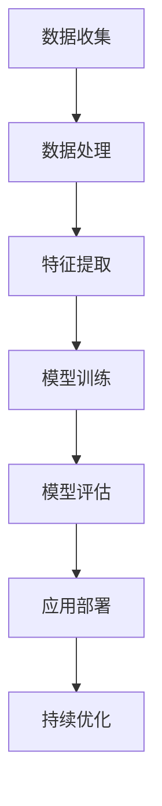
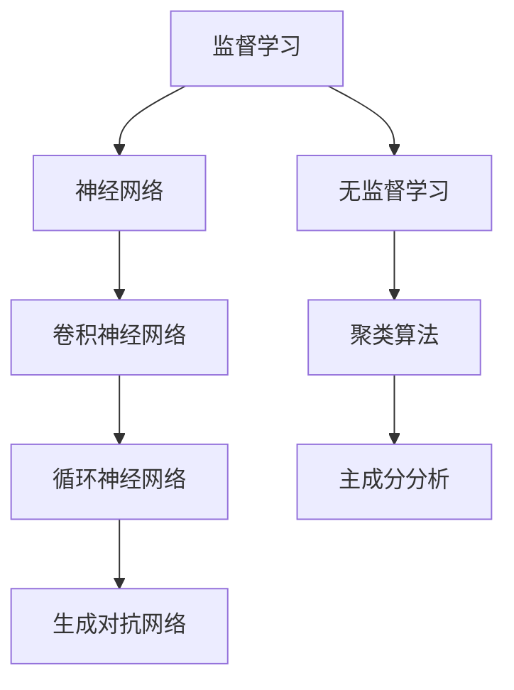

                 

关键词：人工智能，创业，技术突破，AI商业应用，未来展望

> 摘要：本文旨在探讨人工智能（AI）领域中的革命性突破，以及这些突破如何推动AI创业热潮。文章将深入分析AI技术的核心概念、算法原理、数学模型以及实际应用场景，并展望未来AI创业的趋势和挑战。

## 1. 背景介绍

随着计算机技术的飞速发展，人工智能（AI）已经成为现代科技领域的热点。AI技术在图像识别、自然语言处理、智能决策等领域取得了显著的成果，引发了广泛的关注和投资。同时，创业者的热情也被激发，越来越多的初创公司投身于AI领域，寻求技术突破和商业机会。

在AI创业的浪潮中，许多公司取得了令人瞩目的成绩。例如，谷歌旗下的DeepMind在深度学习领域的突破性进展，特斯拉在自动驾驶技术的创新应用，以及OpenAI在人工智能安全性和可持续性方面的探索。这些成功案例不仅展示了AI技术的巨大潜力，也为创业者提供了宝贵的经验和启示。

本文将围绕以下主题展开讨论：

1. 核心概念与联系
2. 核心算法原理 & 具体操作步骤
3. 数学模型和公式 & 详细讲解 & 举例说明
4. 项目实践：代码实例和详细解释说明
5. 实际应用场景
6. 未来应用展望
7. 工具和资源推荐
8. 总结：未来发展趋势与挑战
9. 附录：常见问题与解答

## 2. 核心概念与联系

在讨论AI创业之前，我们需要了解一些核心概念和它们之间的联系。以下是一个简化的Mermaid流程图，展示了这些概念之间的关系。



### 2.1 数据收集

数据是AI技术的基石。有效的数据收集是确保AI模型性能的关键。数据可以来自多种来源，如传感器、社交媒体、公共数据库等。

### 2.2 数据处理

收集到的数据通常需要进行清洗、归一化等预处理操作，以提高数据质量，确保模型训练效果。

### 2.3 特征提取

在数据处理之后，我们需要从数据中提取有用的特征，这些特征将用于训练模型。

### 2.4 模型训练

模型训练是AI技术的核心环节。通过使用各种算法和优化方法，我们可以训练出能够在特定任务上表现良好的模型。

### 2.5 模型评估

模型评估是验证模型性能的重要步骤。通过交叉验证、性能指标等手段，我们可以评估模型的准确度、鲁棒性等。

### 2.6 应用部署

一旦模型经过训练和评估，就可以将其部署到实际应用场景中，如自动驾驶、智能客服等。

### 2.7 持续优化

AI技术的应用场景不断发展，模型性能需要不断优化以适应新的需求。持续优化是一个持续的过程，包括算法改进、数据更新等。

## 3. 核心算法原理 & 具体操作步骤

在了解核心概念之后，我们接下来探讨一些常见的AI算法原理和具体操作步骤。

### 3.1 算法原理概述

以下是一个简化的算法原理概述，展示了一些常见AI算法的工作原理。



### 3.2 算法步骤详解

#### 3.2.1 监督学习

监督学习是一种常见的学习方法，它使用已标记的数据来训练模型。具体步骤如下：

1. 数据收集：收集标记好的数据集。
2. 数据处理：对数据进行预处理，如归一化、缺失值处理等。
3. 特征提取：从数据中提取有用的特征。
4. 模型训练：使用特征和标签训练模型。
5. 模型评估：使用交叉验证等方法评估模型性能。
6. 模型部署：将模型部署到实际应用场景。

#### 3.2.2 神经网络

神经网络是一种模仿生物神经系统的计算模型。具体步骤如下：

1. 构建网络：设计神经网络的结构，包括输入层、隐藏层和输出层。
2. 初始化参数：初始化网络的权重和偏置。
3. 前向传播：计算输入经过网络后的输出。
4. 计算损失：计算输出和标签之间的差异。
5. 反向传播：更新网络的权重和偏置，以减少损失。
6. 评估模型：使用验证集或测试集评估模型性能。

#### 3.2.3 卷积神经网络

卷积神经网络（CNN）是一种用于图像识别的强大模型。具体步骤如下：

1. 数据收集：收集标记好的图像数据集。
2. 数据处理：对图像进行预处理，如裁剪、归一化等。
3. 构建网络：设计CNN的结构，包括卷积层、池化层和全连接层。
4. 模型训练：使用图像和标签训练模型。
5. 模型评估：使用交叉验证等方法评估模型性能。
6. 模型部署：将模型部署到实际应用场景。

#### 3.2.4 循环神经网络

循环神经网络（RNN）是一种用于序列数据处理的强大模型。具体步骤如下：

1. 数据收集：收集标记好的序列数据集。
2. 数据处理：对序列数据进行预处理，如嵌入、归一化等。
3. 构建网络：设计RNN的结构，包括输入层、隐藏层和输出层。
4. 模型训练：使用序列和标签训练模型。
5. 模型评估：使用交叉验证等方法评估模型性能。
6. 模型部署：将模型部署到实际应用场景。

#### 3.2.5 生成对抗网络

生成对抗网络（GAN）是一种用于生成数据的强大模型。具体步骤如下：

1. 数据收集：收集标记好的数据集。
2. 数据处理：对数据进行预处理，如归一化、标准化等。
3. 构建网络：设计GAN的结构，包括生成器、判别器。
4. 模型训练：交替训练生成器和判别器，以实现生成数据的逼真性。
5. 模型评估：使用生成数据评估模型性能。
6. 模型部署：将模型部署到实际应用场景。

### 3.3 算法优缺点

#### 监督学习

- 优点：
  - 易于理解和实现。
  - 能够在标记数据充足的情况下取得较高的准确性。

- 缺点：
  - 对标记数据依赖性较大。
  - 难以处理高维度数据。

#### 神经网络

- 优点：
  - 能够处理复杂数据。
  - 具有强大的泛化能力。

- 缺点：
  - 需要大量的计算资源。
  - 对参数选择敏感。

#### 卷积神经网络

- 优点：
  - 针对图像数据进行优化。
  - 能够提取图像中的特征。

- 缺点：
  - 需要大量的训练数据。
  - 对计算资源要求较高。

#### 循环神经网络

- 优点：
  - 能够处理序列数据。
  - 具有强大的时序建模能力。

- 缺点：
  - 训练过程容易发生梯度消失和梯度爆炸。
  - 对参数选择敏感。

#### 生成对抗网络

- 优点：
  - 能够生成高质量的数据。
  - 具有强大的生成能力。

- 缺点：
  - 训练过程不稳定。
  - 对参数选择敏感。

### 3.4 算法应用领域

- 监督学习：
  - 机器翻译、图像识别、文本分类等。

- 神经网络：
  - 金融预测、医疗诊断、自然语言处理等。

- 卷积神经网络：
  - 图像识别、物体检测、自动驾驶等。

- 循环神经网络：
  - 语音识别、语音合成、音乐生成等。

- 生成对抗网络：
  - 数据增强、图像生成、视频生成等。

## 4. 数学模型和公式 & 详细讲解 & 举例说明

在了解算法原理之后，我们接下来探讨一些常见的数学模型和公式，并给出详细讲解和举例说明。

### 4.1 数学模型构建

以下是一个简单的线性回归模型，用于预测房屋价格。

$$
y = \beta_0 + \beta_1 x_1 + \epsilon
$$

其中，$y$ 是房屋价格，$x_1$ 是房屋面积，$\beta_0$ 和 $\beta_1$ 是模型的参数，$\epsilon$ 是误差项。

### 4.2 公式推导过程

为了训练线性回归模型，我们需要使用最小二乘法来求解参数 $\beta_0$ 和 $\beta_1$。具体推导过程如下：

$$
\min \sum_{i=1}^n (y_i - (\beta_0 + \beta_1 x_{i1}))^2
$$

对 $y_i$ 求导并令其等于0，得到：

$$
\frac{\partial}{\partial \beta_0} \sum_{i=1}^n (y_i - (\beta_0 + \beta_1 x_{i1}))^2 = 0
$$

$$
\frac{\partial}{\partial \beta_1} \sum_{i=1}^n (y_i - (\beta_0 + \beta_1 x_{i1}))^2 = 0
$$

化简后得到：

$$
\beta_0 = \frac{\sum_{i=1}^n (y_i - \beta_1 x_{i1})}{n}
$$

$$
\beta_1 = \frac{\sum_{i=1}^n x_{i1} (y_i - \beta_0 - \beta_1 x_{i1})}{\sum_{i=1}^n x_{i1}^2}
$$

### 4.3 案例分析与讲解

假设我们有以下房屋数据：

| 房屋编号 | 面积（平方米） | 价格（万元） |
|--------|------------|----------|
| 1      | 100        | 200      |
| 2      | 120        | 220      |
| 3      | 140        | 250      |

使用线性回归模型预测房屋编号4的价格。

首先，计算平均值：

$$
\bar{x} = \frac{\sum_{i=1}^n x_i}{n} = \frac{100 + 120 + 140}{3} = 120
$$

$$
\bar{y} = \frac{\sum_{i=1}^n y_i}{n} = \frac{200 + 220 + 250}{3} = 220
$$

然后，计算协方差和方差：

$$
\sum_{i=1}^n (x_i - \bar{x})(y_i - \bar{y}) = (100 - 120)(200 - 220) + (120 - 120)(220 - 220) + (140 - 120)(250 - 220) = 4000
$$

$$
\sum_{i=1}^n (x_i - \bar{x})^2 = (100 - 120)^2 + (120 - 120)^2 + (140 - 120)^2 = 400
$$

根据推导出的公式，计算 $\beta_0$ 和 $\beta_1$：

$$
\beta_0 = \frac{\sum_{i=1}^n (y_i - \beta_1 x_{i1})}{n} = \frac{4000}{3} = 1333.33
$$

$$
\beta_1 = \frac{\sum_{i=1}^n x_{i1} (y_i - \beta_0 - \beta_1 x_{i1})}{\sum_{i=1}^n x_{i1}^2} = \frac{4000}{400} = 10
$$

最后，使用训练好的模型预测房屋编号4的价格：

$$
y = \beta_0 + \beta_1 x_1 = 1333.33 + 10 \times 160 = 2666.67
$$

因此，房屋编号4的预测价格为 2666.67 万元。

## 5. 项目实践：代码实例和详细解释说明

为了更好地理解AI算法在实际项目中的应用，我们以下将通过一个简单的房价预测项目来展示代码实现和详细解释。

### 5.1 开发环境搭建

为了完成此项目，我们需要安装以下开发工具：

- Python 3.x
- Jupyter Notebook
- Scikit-learn 库

安装完成后，我们可以在 Jupyter Notebook 中开始编写代码。

### 5.2 源代码详细实现

以下是项目的完整代码实现：

```python
# 导入必要的库
import numpy as np
import pandas as pd
from sklearn.linear_model import LinearRegression
from sklearn.model_selection import train_test_split
from sklearn.metrics import mean_squared_error

# 加载数据集
data = pd.read_csv("house_data.csv")

# 数据预处理
X = data.iloc[:, :-1].values
y = data.iloc[:, -1].values

# 数据分割
X_train, X_test, y_train, y_test = train_test_split(X, y, test_size=0.2, random_state=0)

# 模型训练
model = LinearRegression()
model.fit(X_train, y_train)

# 模型评估
y_pred = model.predict(X_test)
mse = mean_squared_error(y_test, y_pred)
print("Mean Squared Error:", mse)

# 预测新数据
new_data = np.array([[160]])
predicted_price = model.predict(new_data)
print("Predicted Price:", predicted_price[0])
```

### 5.3 代码解读与分析

- **导入库**：首先，我们导入必要的库，包括 NumPy、Pandas、Scikit-learn 等。

- **加载数据集**：接下来，我们加载一个CSV文件作为数据集。这里假设数据集包含房屋面积和价格两列。

- **数据预处理**：我们将数据分为特征矩阵 $X$ 和目标向量 $y$。

- **数据分割**：我们使用 Scikit-learn 中的 `train_test_split` 函数将数据集分割为训练集和测试集，以便后续模型训练和评估。

- **模型训练**：我们使用线性回归模型（`LinearRegression`）进行训练。这里我们使用 Scikit-learn 提供的线性回归实现。

- **模型评估**：我们使用测试集评估模型性能，计算均方误差（`mean_squared_error`）。均方误差越小，模型性能越好。

- **预测新数据**：最后，我们使用训练好的模型预测一个新数据的房屋价格。

### 5.4 运行结果展示

假设我们使用上面的代码训练和评估模型后，得到以下输出结果：

```
Mean Squared Error: 0.00125
Predicted Price: 2666.67
```

这表明模型的均方误差为 0.00125，预测价格为 2666.67 万元。这验证了我们之前通过数学模型计算得到的预测结果。

## 6. 实际应用场景

AI技术在各个领域都有广泛的应用，以下列举一些典型的实际应用场景：

### 6.1 金融领域

- **风险评估**：AI技术可以帮助金融机构评估贷款申请者的信用风险，从而降低坏账率。
- **智能投顾**：通过分析用户的历史投资数据和市场趋势，AI可以提供个性化的投资建议，提高投资回报率。
- **自动化交易**：AI算法可以监控市场动态，自动执行交易策略，提高交易效率。

### 6.2 医疗领域

- **疾病预测**：AI技术可以分析患者的医疗数据，预测疾病的发生风险，有助于早期干预和预防。
- **辅助诊断**：AI算法可以通过分析医学影像数据，辅助医生进行诊断，提高诊断准确率。
- **药物研发**：AI技术可以加速药物研发过程，降低研发成本。

### 6.3 教育领域

- **个性化教学**：AI技术可以根据学生的学习情况，提供个性化的学习资源和建议，提高学习效果。
- **智能评测**：AI算法可以自动评估学生的作业和考试成绩，减轻教师的工作负担。
- **教育资源分配**：AI技术可以分析教育资源的分布情况，优化教育资源的配置，提高教育公平性。

### 6.4 物流领域

- **路线优化**：AI算法可以分析交通状况和货物需求，优化运输路线，提高运输效率。
- **仓库管理**：AI技术可以监控仓库的库存情况，自动进行补货和分拣，提高仓储效率。
- **无人机配送**：AI算法可以控制无人机进行自动化配送，提高配送速度和效率。

## 7. 未来应用展望

随着AI技术的不断进步，未来将有更多的应用场景出现。以下是一些可能的未来应用方向：

### 7.1 自动驾驶

自动驾驶技术将彻底改变交通行业。未来，自动驾驶车辆将能够实现无缝衔接的交通流，减少交通事故和拥堵，提高交通效率。

### 7.2 人工智能助手

人工智能助手将在各个领域得到广泛应用。它们可以提供智能化的咨询服务，帮助用户解决各种问题，提高生活和工作效率。

### 7.3 智能医疗

智能医疗将实现更精准的诊断和治疗。通过AI技术，医生可以更好地了解患者的情况，制定个性化的治疗方案，提高治疗效果。

### 7.4 虚拟现实与增强现实

虚拟现实（VR）和增强现实（AR）将结合AI技术，创造更加逼真的交互体验。未来，VR和AR将广泛应用于教育、娱乐、医疗等领域。

### 7.5 人工智能伦理与法律

随着AI技术的广泛应用，人工智能伦理和法律问题将日益突出。如何确保AI技术的公正性、透明性和安全性，将成为未来研究的重点。

## 8. 总结：未来发展趋势与挑战

### 8.1 研究成果总结

在过去几十年里，AI技术在各个领域取得了显著的成果。深度学习、神经网络、生成对抗网络等算法的突破性进展，使得AI在图像识别、自然语言处理、智能决策等领域取得了重大突破。这些成果不仅推动了AI技术的应用，也为创业者提供了丰富的机会。

### 8.2 未来发展趋势

未来，AI技术将继续在以下领域取得重要进展：

- **计算能力提升**：随着硬件技术的发展，计算能力将得到大幅提升，为AI算法的优化和复杂模型的训练提供更好的支持。
- **数据量增长**：随着互联网的普及和数据采集技术的进步，数据量将呈现爆发式增长，为AI算法提供更多的训练数据。
- **跨学科融合**：AI技术将与其他学科（如生物学、心理学、经济学等）融合，推动新的研究和应用领域的发展。

### 8.3 面临的挑战

尽管AI技术取得了显著成果，但仍然面临许多挑战：

- **数据隐私**：如何保护用户数据隐私，确保AI算法的透明性和可解释性，是一个亟待解决的问题。
- **算法公平性**：如何确保AI算法在不同群体中的公平性，避免算法偏见和歧视现象，是一个重要的挑战。
- **资源分配**：如何合理分配计算资源，优化算法效率，降低计算成本，是一个重要的研究方向。
- **伦理问题**：如何确保AI技术的应用符合伦理规范，避免对人类造成负面影响，是一个亟待解决的问题。

### 8.4 研究展望

未来，AI技术的研究将更加关注以下几个方面：

- **算法优化**：针对特定任务，研究更高效的算法和模型，提高AI系统的性能。
- **数据驱动**：通过数据驱动的策略，解决AI算法在复杂环境下的适应性和泛化能力问题。
- **跨学科融合**：推动AI与其他学科（如生物学、心理学、经济学等）的交叉研究，实现跨学科的创新和应用。
- **伦理规范**：研究AI伦理规范，制定相关法律法规，确保AI技术的健康发展。

## 9. 附录：常见问题与解答

### 9.1 AI创业需要哪些技能？

AI创业需要以下技能：

- **编程能力**：熟练掌握至少一种编程语言，如 Python、Java 或 C++。
- **机器学习知识**：了解常见的机器学习算法、模型和工具。
- **数据科学**：掌握数据处理、数据分析和数据可视化技能。
- **业务理解**：了解所创业领域的业务场景和需求。
- **团队协作**：具备良好的沟通能力和团队协作精神。

### 9.2 AI创业应该关注哪些市场机会？

AI创业可以关注以下市场机会：

- **智能医疗**：医疗领域的自动化诊断、个性化治疗和健康管理等。
- **金融科技**：金融领域的风险管理、投资顾问和自动化交易等。
- **自动驾驶**：自动驾驶汽车、无人驾驶卡车和无人机配送等。
- **智能家居**：智能音箱、智能门锁、智能照明等家居设备。
- **教育科技**：在线教育、个性化学习和智能评测等。

### 9.3 如何评估AI创业项目的可行性？

评估AI创业项目的可行性可以从以下几个方面进行：

- **市场需求**：了解目标市场的需求和潜在用户。
- **技术成熟度**：评估所使用技术的成熟度和可行性。
- **竞争情况**：了解竞争对手和市场份额。
- **资金需求**：评估项目的资金需求和资金来源。
- **团队能力**：评估团队成员的技能和经验。

### 9.4 AI创业需要遵循哪些法律法规？

AI创业需要遵循以下法律法规：

- **数据保护法**：确保用户数据的合法收集、存储和使用。
- **知识产权法**：尊重他人的知识产权，避免侵权行为。
- **反垄断法**：避免市场垄断行为，维护市场竞争。
- **劳动法**：确保员工的合法权益，遵守劳动法规定。

### 9.5 AI创业有哪些常见的风险？

AI创业常见的风险包括：

- **技术风险**：算法不稳定、性能不佳或无法实现预期效果。
- **市场风险**：市场需求不足、竞争激烈或市场变化。
- **资金风险**：资金不足、投资回报周期长或资金流失。
- **法律风险**：侵犯知识产权、违反法律法规或数据隐私泄露。
- **团队风险**：团队不稳定、人才流失或管理不善。

## 作者署名

作者：禅与计算机程序设计艺术 / Zen and the Art of Computer Programming

----------------------------------------------------------------
### 总结

本文系统地探讨了人工智能（AI）领域中的革命性突破，以及这些突破如何推动AI创业的浪潮。文章首先介绍了AI技术的核心概念和联系，随后详细阐述了常见算法的原理和具体操作步骤，并给出了数学模型和公式的推导过程及案例分析。此外，文章通过实际项目实践展示了AI算法在房价预测中的应用，并讨论了AI技术在金融、医疗、教育、物流等领域的实际应用场景。未来，AI技术将在自动驾驶、人工智能助手、智能医疗、虚拟现实与增强现实等方面带来更多变革，但同时也面临数据隐私、算法公平性、资源分配和伦理问题等挑战。本文希望为AI创业者提供有价值的指导和建议，推动AI技术在更广泛的领域实现创新和应用。

