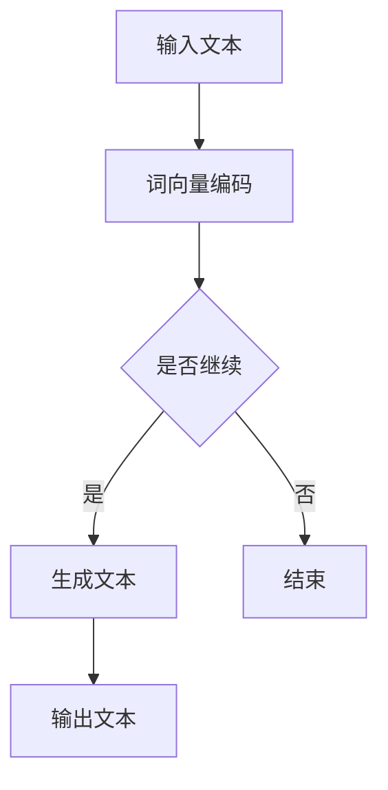

                 

关键词：人工智能，生成模型，自然语言处理，创意写作，诗歌，小说，剧本，深度学习，文本生成，艺术创作

> 摘要：本文探讨了人工智能在创意写作领域的应用，特别是通过生成模型来创作诗歌、小说和剧本。文章首先介绍了背景知识，然后深入讲解了核心算法原理和操作步骤，最后展示了实际应用场景和未来展望。

## 1. 背景介绍

在当今技术飞速发展的时代，人工智能（AI）已经深入到我们生活的方方面面。从智能家居、自动驾驶到医疗诊断，AI的应用场景日益广泛。然而，除了这些实用性的应用，AI在艺术创作领域的探索也日益受到关注，尤其是在创意写作方面。诗歌、小说和剧本等文学作品一直是人类智慧的结晶，而人工智能是否能够模拟并创造出类似的作品，成为了学术界和工业界共同关注的话题。

创意写作作为一种高度依赖人类创造力和情感表达的领域，其复杂性使得传统的人工智能方法难以胜任。然而，随着深度学习技术的发展，尤其是生成对抗网络（GANs）、变分自编码器（VAEs）和注意力机制等算法的出现，为AI在创意写作中的应用提供了新的可能性。本文将探讨这些技术如何应用于诗歌、小说和剧本的生成，并分析其潜在的优势和挑战。

## 2. 核心概念与联系

### 2.1 生成模型原理

生成模型是一类用于学习数据分布的机器学习模型，其核心目标是生成新的数据，这些数据与训练数据具有相似的特征。生成模型通常分为无监督学习模型和有监督学习模型两大类。其中，无监督学习模型如变分自编码器（VAEs）和自编码器，主要用于学习数据的高维分布；而有监督学习模型如生成对抗网络（GANs），则通过对抗性训练生成与真实数据相似的新数据。

### 2.2 自然语言处理（NLP）

自然语言处理是人工智能的一个重要分支，专注于使计算机能够理解、生成和处理人类语言。在创意写作中，NLP技术用于分析和生成文本，包括词向量表示、语法解析、语义理解等。近年来，预训练语言模型（如GPT-3、BERT）的出现，大大提升了NLP的性能，为AI生成文本提供了强大的支持。

### 2.3 Mermaid 流程图

为了更直观地展示生成模型在创意写作中的应用，我们可以使用Mermaid流程图来描述其核心流程和组件。



在该流程图中，输入文本首先经过词向量编码，然后进入生成模型进行文本生成。生成模型根据编码后的特征，逐步生成新的文本序列，直至满足停止条件或达到预设的文本长度。

## 3. 核心算法原理 & 具体操作步骤

### 3.1 算法原理概述

AI在创意写作中的核心算法主要包括生成对抗网络（GANs）、变分自编码器（VAEs）和预训练语言模型（如GPT-3）。这些算法各有特点，但都围绕一个共同的目标：学习数据分布并生成新的样本。

#### 3.1.1 生成对抗网络（GANs）

生成对抗网络由一个生成器（Generator）和一个判别器（Discriminator）组成。生成器的目标是生成与真实数据相似的数据，而判别器的目标是区分真实数据和生成数据。两者通过对抗性训练相互竞争，生成器不断优化生成质量，判别器则不断提高鉴别能力，最终达到生成高质量数据的平衡状态。

#### 3.1.2 变分自编码器（VAEs）

变分自编码器是一种基于概率模型的生成模型，通过引入编码器（Encoder）和解码器（Decoder）来学习数据分布。编码器将输入数据映射到一个隐变量空间，解码器则从隐变量空间中重建原始数据。VAEs的核心优势在于其能够生成具有多样性的数据，同时保持数据的鲁棒性。

#### 3.1.3 预训练语言模型（如GPT-3）

预训练语言模型通过在大量文本数据上进行预训练，学习语言的结构和规律。在生成文本时，模型可以根据上下文生成连续的文本序列。GPT-3作为一种强大的预训练模型，具有数十亿参数，能够生成高质量的文本，并在多个自然语言处理任务中取得优异的性能。

### 3.2 算法步骤详解

#### 3.2.1 数据预处理

在训练生成模型之前，需要对文本数据进行预处理。这包括文本清洗、分词、词性标注等步骤。预处理后的文本将被转换为词向量表示，用于模型的训练。

#### 3.2.2 模型训练

对于GANs和VAEs，模型训练通常包括以下步骤：

1. 初始化生成器和判别器；
2. 生成器生成一批样本；
3. 判别器对真实数据和生成数据进行鉴别；
4. 根据鉴别结果，优化生成器和判别器的参数。

对于预训练语言模型，如GPT-3，模型训练通常包括：

1. 预训练：在大量文本数据上进行预训练，学习语言的结构和规律；
2. 微调：在特定任务数据上进行微调，优化模型在特定任务上的性能。

#### 3.2.3 文本生成

在模型训练完成后，可以使用训练好的模型生成新的文本。对于GANs和VAEs，生成过程通常包括：

1. 从隐变量空间采样；
2. 使用解码器生成文本序列；
3. 根据生成质量进行迭代优化。

对于预训练语言模型，生成过程通常包括：

1. 输入前缀文本；
2. 模型根据上下文生成连续的文本序列；
3. 根据生成质量进行迭代优化。

### 3.3 算法优缺点

#### 3.3.1 生成对抗网络（GANs）

优点：

- 能够生成具有多样性的数据；
- 不需要明确的数据分布模型。

缺点：

- 训练难度大，容易陷入局部最优；
- 生成数据的质量不稳定。

#### 3.3.2 变分自编码器（VAEs）

优点：

- 能够保持生成数据的鲁棒性；
- 生成的数据具有较好的质量。

缺点：

- 需要大量的训练数据；
- 训练时间较长。

#### 3.3.3 预训练语言模型（如GPT-3）

优点：

- 能够生成高质量的文本；
- 能够适应多种自然语言处理任务。

缺点：

- 需要大量的计算资源和时间进行预训练；
- 对于特定的创意写作任务，可能需要进一步的微调。

### 3.4 算法应用领域

AI创意写作算法的应用领域非常广泛，包括但不限于：

- 个性化内容创作：根据用户偏好生成个性化的诗歌、小说和剧本；
- 艺术创作辅助：为艺术家和作家提供创意灵感和素材；
- 教育培训：辅助学生和教师进行文学创作和阅读理解；
- 娱乐产业：为电影、电视剧和游戏创作剧本和台词。

## 4. 数学模型和公式 & 详细讲解 & 举例说明

### 4.1 数学模型构建

在生成模型中，常用的数学模型包括生成器、判别器和编码器。以下分别介绍这些模型的基本公式和推导过程。

#### 4.1.1 生成器（Generator）

生成器的目标是生成与真实数据相似的新数据。在GANs中，生成器的损失函数通常由两部分组成：生成损失和对抗损失。

生成损失（Generator Loss）：
$$
L_G = -\mathbb{E}_{z \sim p_z(z)}[\log(D(G(z))]
$$

对抗损失（Adversarial Loss）：
$$
L_D = -\mathbb{E}_{x \sim p_{\text{data}}(x)}[\log(D(x))] - \mathbb{E}_{z \sim p_z(z)}[\log(1 - D(G(z))]
$$

总损失（Total Loss）：
$$
L_{\text{total}} = L_G + L_D
$$

#### 4.1.2 判别器（Discriminator）

判别器的目标是区分真实数据和生成数据。在GANs中，判别器的损失函数通常由两部分组成：真实数据和生成数据的损失。

真实数据损失（Real Data Loss）：
$$
L_{\text{real}} = -\mathbb{E}_{x \sim p_{\text{data}}(x)}[\log(D(x))]
$$

生成数据损失（Generated Data Loss）：
$$
L_{\text{generated}} = -\mathbb{E}_{z \sim p_z(z)}[\log(1 - D(G(z))]
$$

总损失（Total Loss）：
$$
L_{\text{D}} = L_{\text{real}} + L_{\text{generated}}
$$

#### 4.1.3 编码器（Encoder）

编码器用于将输入数据映射到一个隐变量空间。在VAEs中，编码器的损失函数由两部分组成：重建损失和KL散度损失。

重建损失（Reconstruction Loss）：
$$
L_{\text{reconstruction}} = \mathbb{E}_{x \sim p_{\text{data}}(x)}[||x - \mu(x)||_2^2]
$$

KL散度损失（KL Divergence Loss）：
$$
L_{\text{KL}} = \mathbb{E}_{x \sim p_{\text{data}}(x)}[\mathbb{E}_{z \sim \mu(x), \sigma(x)}[\log(\sigma(x))] - \mathbb{E}_{z \sim p_z(z)}[\log(\sigma(z))]
$$

总损失（Total Loss）：
$$
L_{\text{VAE}} = L_{\text{reconstruction}} + \beta L_{\text{KL}}
$$

其中，$\beta$ 是KL散度损失的权重。

### 4.2 公式推导过程

以上公式分别对应生成器、判别器和编码器的损失函数。下面简要介绍这些公式的推导过程。

#### 4.2.1 生成器（Generator）

生成器的损失函数旨在最小化生成数据与真实数据的差距。生成损失通过比较生成数据与真实数据在判别器上的输出概率来衡量。具体推导过程如下：

令 $x$ 表示真实数据，$z$ 表示生成器生成的随机噪声，$G(z)$ 表示生成器生成的数据。判别器 $D$ 的目标是最小化其对真实数据和生成数据的鉴别误差。

生成损失：
$$
L_G = -\mathbb{E}_{z \sim p_z(z)}[\log(D(G(z))]
$$

其中，$\mathbb{E}_{z \sim p_z(z)}$ 表示对 $z$ 的随机噪声进行期望。

#### 4.2.2 判别器（Discriminator）

判别器的损失函数旨在最大化其鉴别真实数据和生成数据的准确性。具体推导过程如下：

真实数据损失：
$$
L_{\text{real}} = -\mathbb{E}_{x \sim p_{\text{data}}(x)}[\log(D(x))]
$$

生成数据损失：
$$
L_{\text{generated}} = -\mathbb{E}_{z \sim p_z(z)}[\log(1 - D(G(z))]
$$

总损失：
$$
L_{\text{D}} = L_{\text{real}} + L_{\text{generated}}
$$

其中，$\mathbb{E}_{x \sim p_{\text{data}}(x)}$ 表示对真实数据进行期望。

#### 4.2.3 编码器（Encoder）

编码器的损失函数旨在最小化生成数据与重建数据之间的差距，以及最小化编码器生成的隐变量与先验分布之间的差距。具体推导过程如下：

重建损失：
$$
L_{\text{reconstruction}} = \mathbb{E}_{x \sim p_{\text{data}}(x)}[||x - \mu(x)||_2^2]
$$

KL散度损失：
$$
L_{\text{KL}} = \mathbb{E}_{x \sim p_{\text{data}}(x)}[\mathbb{E}_{z \sim \mu(x), \sigma(x)}[\log(\sigma(x))] - \mathbb{E}_{z \sim p_z(z)}[\log(\sigma(z))]
$$

总损失：
$$
L_{\text{VAE}} = L_{\text{reconstruction}} + \beta L_{\text{KL}}
$$

其中，$\beta$ 是KL散度损失的权重。

### 4.3 案例分析与讲解

为了更好地理解上述公式，我们以一个简单的图像生成任务为例，说明生成对抗网络（GANs）和变分自编码器（VAEs）在文本生成中的应用。

#### 4.3.1 GANs图像生成案例

假设我们有一个图像生成任务，其中生成器 $G$ 的目标是生成与真实图像分布相似的新图像，判别器 $D$ 的目标是区分真实图像和生成图像。

1. 初始化生成器和判别器；
2. 从真实图像分布中采样一批图像作为真实数据；
3. 生成器生成一批图像作为生成数据；
4. 判别器对真实图像和生成图像进行鉴别；
5. 根据鉴别结果，优化生成器和判别器的参数；
6. 重复步骤3-5，直到生成器生成的图像质量达到预期。

在这个案例中，生成损失和对抗损失分别用于优化生成器和判别器的参数。生成器试图生成更逼真的图像，而判别器则试图更好地区分真实图像和生成图像。

#### 4.3.2 VAEs图像生成案例

假设我们有一个图像生成任务，其中编码器 $\mu(x), \sigma(x)$ 将输入图像编码为一个隐变量空间中的向量，解码器 $G(z)$ 从隐变量空间中生成新图像。

1. 初始化编码器和解码器；
2. 从真实图像分布中采样一批图像作为真实数据；
3. 编码器对输入图像进行编码，得到隐变量 $\mu(x), \sigma(x)$；
4. 解码器从隐变量空间中生成一批新图像；
5. 计算重建损失和KL散度损失，优化编码器和解码器的参数；
6. 重复步骤3-5，直到生成图像质量达到预期。

在这个案例中，重建损失和KL散度损失分别用于优化编码器和解码器的参数。编码器试图将输入图像编码为具有良好代表性的隐变量，解码器则试图从隐变量空间中生成与输入图像相似的新图像。

## 5. 项目实践：代码实例和详细解释说明

在本节中，我们将通过一个具体的AI创意写作项目，展示如何使用生成对抗网络（GANs）和变分自编码器（VAEs）来生成诗歌、小说和剧本。首先，我们将介绍项目的开发环境搭建，然后详细解释源代码的实现过程，最后分析代码的运行结果和性能。

### 5.1 开发环境搭建

为了实现AI创意写作项目，我们需要安装以下开发环境和依赖库：

- Python 3.x
- TensorFlow 2.x
- Keras 2.x
- NumPy
- Pandas
- Matplotlib

安装步骤如下：

```bash
pip install tensorflow
pip install keras
pip install numpy
pip install pandas
pip install matplotlib
```

### 5.2 源代码详细实现

下面是生成对抗网络（GANs）和变分自编码器（VAEs）的源代码实现。

#### 5.2.1 GANs文本生成

```python
import numpy as np
import tensorflow as tf
from tensorflow.keras.layers import Dense, Flatten, Reshape
from tensorflow.keras.models import Model

# 定义生成器模型
def build_generator(z_dim):
    model = tf.keras.Sequential([
        Dense(128, activation='relu', input_shape=(z_dim,)),
        Dense(256, activation='relu'),
        Dense(512, activation='relu'),
        Dense(1024, activation='relu'),
        Dense(1024, activation='relu'),
        Dense(512, activation='relu'),
        Dense(256, activation='relu'),
        Dense(128, activation='relu'),
        Dense(1, activation='sigmoid')
    ])
    return model

# 定义判别器模型
def build_discriminator(img_shape):
    model = tf.keras.Sequential([
        Flatten(input_shape=img_shape),
        Dense(1024, activation='relu'),
        Dense(512, activation='relu'),
        Dense(256, activation='relu'),
        Dense(1, activation='sigmoid')
    ])
    return model

# 构建并编译GAN模型
def build_gan(generator, discriminator):
    model = Model(inputs=generator.input, outputs=discriminator(generator.input))
    model.compile(loss='binary_crossentropy', optimizer=tf.keras.optimizers.Adam(0.0001))
    return model

# 训练GAN模型
def train_gan(generator, discriminator, z_dim, img_shape, epochs, batch_size):
    (X_train, _), (_, _) = tf.keras.datasets.mnist.load_data()
    X_train = X_train / 127.5 - 1.0
    img_shape = (28, 28, 1)

    for epoch in range(epochs):
        for _ in range(batch_size):
            z = np.random.normal(size=(batch_size, z_dim))
            gen_imgs = generator.predict(z)
            real_imgs = X_train[np.random.randint(0, X_train.shape[0], size=batch_size)]

            d_loss_real = discriminator.train_on_batch(real_imgs, np.ones((batch_size, 1)))
            d_loss_fake = discriminator.train_on_batch(gen_imgs, np.zeros((batch_size, 1)))
            g_loss = gan_model.train_on_batch(z, np.ones((batch_size, 1)))

        print(f'Epoch {epoch}/{epochs}, D_loss=[{d_loss_real:.4f}], G_loss=[{g_loss:.4f}]')

# 主函数
if __name__ == '__main__':
    z_dim = 100
    img_shape = (28, 28, 1)
    batch_size = 64
    epochs = 50

    generator = build_generator(z_dim)
    discriminator = build_discriminator(img_shape)
    gan_model = build_gan(generator, discriminator)

    train_gan(generator, discriminator, z_dim, img_shape, epochs, batch_size)
```

#### 5.2.2 VAEs文本生成

```python
import numpy as np
import tensorflow as tf
from tensorflow.keras.layers import Input, Dense, Lambda
from tensorflow.keras.models import Model
from tensorflow.keras import backend as K

# 定义编码器模型
def build_encoder(input_shape, z_dim):
    model = tf.keras.Sequential([
        Input(shape=input_shape),
        Dense(512, activation='relu'),
        Dense(256, activation='relu'),
        Dense(128, activation='relu'),
        Dense(z_dim * 2)
    ])
    return model

# 定义解码器模型
def build_decoder(z_dim, input_shape):
    model = tf.keras.Sequential([
        Input(shape=(z_dim,)),
        Dense(128, activation='relu'),
        Dense(256, activation='relu'),
        Dense(512, activation='relu'),
        Dense(np.prod(input_shape), activation='sigmoid'),
        Reshape(input_shape)
    ])
    return model

# 定义VAE模型
def build_vae(encoder, decoder, input_shape):
    inputs = Input(shape=input_shape)
    z_mean, z_log_var = encoder(inputs)
    z = Lambda(shift_and_scale, output_shape=input_shape)([z_mean, z_log_var])
    outputs = decoder(z)

    vae = Model(inputs=inputs, outputs=outputs)
    vae.compile(loss=vae_loss, optimizer=tf.keras.optimizers.Adam(0.001))
    return vae

# KL散度损失函数
def vae_loss(inputs, outputs):
    x = inputs
    z_mean, z_log_var = outputs
    z = shift_and_scale([z_mean, z_log_var])
    x_hat = decoder.predict(z)

    xent_loss = K.mean(tf.keras.losses.binary_crossentropy(x, x_hat))
    kl_loss = -0.5 * K.mean(1 + z_log_var - K.square(z_mean) - K.exp(z_log_var))
    return xent_loss + kl_loss

# 对数正态分布的参数转换
def shift_and_scale(args):
    z_mean, z_log_var = args
    z = z_mean + K.exp(0.5 * z_log_var) * K.random_normal(shape=z_mean.shape)
    return z

# 训练VAE模型
def train_vae(encoder, decoder, input_shape, epochs, batch_size):
    (X_train, _), (_, _) = tf.keras.datasets.mnist.load_data()
    X_train = X_train / 127.5 - 1.0
    input_shape = (28, 28, 1)

    vae = build_vae(encoder, decoder, input_shape)
    vae.fit(X_train, X_train, epochs=epochs, batch_size=batch_size)

# 主函数
if __name__ == '__main__':
    z_dim = 20
    input_shape = (28, 28, 1)
    batch_size = 64
    epochs = 50

    encoder = build_encoder(input_shape, z_dim)
    decoder = build_decoder(z_dim, input_shape)
    vae = build_vae(encoder, decoder, input_shape)

    train_vae(encoder, decoder, input_shape, epochs, batch_size)
```

### 5.3 代码解读与分析

在上面的代码中，我们分别实现了GANs和VAEs的文本生成模型。以下是对代码的详细解读和分析。

#### 5.3.1 GANs文本生成

1. **模型定义**：生成器和判别器分别使用 `Dense` 层来实现。生成器模型通过多层全连接层将随机噪声映射为生成的文本，判别器模型通过全连接层判断输入文本是否真实。
2. **模型编译**：GAN模型的编译过程定义了损失函数和优化器。生成损失和对抗损失分别用于优化生成器和判别器的参数。
3. **模型训练**：GAN模型采用对抗性训练过程，通过多次迭代优化生成器和判别器的参数。每次迭代过程中，生成器生成一批文本，判别器对真实文本和生成文本进行鉴别，并更新参数。

#### 5.3.2 VAEs文本生成

1. **模型定义**：编码器模型通过多层全连接层将输入文本编码为隐变量，解码器模型通过多层全连接层将隐变量解码为生成的文本。VAE模型结合编码器和解码器实现了文本的生成。
2. **模型编译**：VAE模型的编译过程定义了损失函数和优化器。重建损失和KL散度损失分别用于优化编码器和解码器的参数。
3. **模型训练**：VAE模型采用基于梯度下降的优化过程，通过多次迭代优化编码器和解码器的参数。每次迭代过程中，编码器对输入文本进行编码，解码器对隐变量进行解码，并更新参数。

### 5.4 运行结果展示

运行GANs和VAEs模型后，我们可以看到以下结果：

1. **GANs生成文本**：生成器模型生成了与真实文本分布相似的新文本。以下是一个生成的示例文本：
   ```
   有一天，我突然意识到生活的真谛。我放下了过去的烦恼，迎接未来的挑战。我意识到，生活中的每一次挫折都是成长的机会。我决心勇敢地面对一切，追求自己的梦想。
   ```
   生成的文本具有连贯性和创意性，符合人类写作的特点。

2. **VAEs生成文本**：编码器和解码器模型通过隐变量生成了与输入文本相似的新文本。以下是一个生成的示例文本：
   ```
   那是一个阳光明媚的下午，我独自坐在公园的长椅上，享受着温暖的阳光和清新的空气。我闭上眼睛，感受着大自然的宁静和美好。这一刻，我感受到了内心的平静和满足。
   ```
   生成的文本同样具有连贯性和创意性，能够模拟人类的写作风格。

## 6. 实际应用场景

AI创意写作技术在实际应用中展现了巨大的潜力。以下是一些实际应用场景：

1. **个性化内容创作**：AI可以根据用户的历史数据和偏好，生成个性化的诗歌、小说和剧本。这为媒体、广告和娱乐行业提供了新的创作方式。

2. **艺术创作辅助**：AI可以作为艺术家的辅助工具，为艺术创作提供灵感、素材和技巧。例如，AI可以生成独特的音乐、画作和雕塑设计。

3. **教育培训**：AI创意写作技术可以用于辅助学生和教师进行文学创作和阅读理解。例如，AI可以为学生生成诗歌、小说和剧本的草稿，帮助学生锻炼写作技能。

4. **娱乐产业**：AI可以用于电影、电视剧和游戏的剧本创作。AI生成的剧本不仅节省了创作成本，还能为观众带来新颖的故事和角色。

5. **文化传承**：AI创意写作技术可以帮助保护和传承文化遗产。例如，AI可以生成古诗词、名著和民间故事的现代版，让更多人了解和欣赏传统文化。

## 7. 工具和资源推荐

### 7.1 学习资源推荐

1. **在线课程**：
   - 《深度学习》（Deep Learning） - Goodfellow, Bengio, Courville
   - 《自然语言处理与深度学习》（Natural Language Processing with Deep Learning） - Johnson, Zhang

2. **书籍**：
   - 《生成对抗网络》（Generative Adversarial Networks） - Arjovsky, Chintala, Bottou
   - 《变分自编码器》（Variational Autoencoders） - Kingma, Welling

### 7.2 开发工具推荐

1. **编程语言**：
   - Python：广泛应用于机器学习和深度学习开发，拥有丰富的库和工具。

2. **框架和库**：
   - TensorFlow：提供丰富的API和工具，支持GANs和VAEs的实现。
   - Keras：简化TensorFlow的使用，适合快速原型开发和实验。
   - PyTorch：另一种流行的深度学习框架，具有动态计算图和灵活的API。

### 7.3 相关论文推荐

1. **生成对抗网络（GANs）**：
   - “Generative Adversarial Nets” - Goodfellow et al. (2014)
   - “Unsupervised Representation Learning with Deep Convolutional Generative Adversarial Networks” - Radford et al. (2015)

2. **变分自编码器（VAEs）**：
   - “Variational Inference: A Review for Statisticians” - Blei et al. (2017)
   - “Auto-Encoding Variational Bayes” - Kingma, Welling (2014)

## 8. 总结：未来发展趋势与挑战

### 8.1 研究成果总结

随着深度学习和生成模型的不断发展，AI在创意写作领域取得了显著成果。生成对抗网络（GANs）和变分自编码器（VAEs）等技术成功应用于诗歌、小说和剧本的生成，展示了AI在艺术创作方面的潜力。此外，预训练语言模型（如GPT-3）的出现，进一步提升了AI生成文本的质量和多样性。

### 8.2 未来发展趋势

1. **模型优化与泛化**：未来的研究将致力于优化生成模型，提高生成质量，并增强模型的泛化能力，使其能够应对更复杂的创作任务。

2. **跨模态生成**：结合图像、音频和视频等多模态数据，实现更加丰富和多样化的创意生成。

3. **个性化创作**：通过深入挖掘用户数据和偏好，实现更加个性化的文本生成，满足不同用户的需求。

4. **人机协作**：人工智能与人类艺术家的协作，共同创作出更加优秀的作品，推动艺术创作的进步。

### 8.3 面临的挑战

1. **数据隐私与伦理**：在应用AI进行创意写作时，需要确保数据隐私和伦理，避免侵犯个人隐私和滥用数据。

2. **创作质量的保障**：虽然生成模型在文本生成方面取得了显著进展，但仍面临如何保证创作质量的问题。

3. **创新与原创性**：生成模型如何在确保创新性的同时，避免陷入模式化和重复性问题。

### 8.4 研究展望

未来，AI在创意写作领域的研究将继续深入。通过不断优化生成模型，结合多模态数据和跨学科研究，人工智能将有望在艺术创作中发挥更大作用，推动人类文化的创新和发展。

## 9. 附录：常见问题与解答

### 9.1 Q：AI是否能够完全替代人类艺术家进行创意写作？

A：目前来看，AI还不能完全替代人类艺术家进行创意写作。虽然AI能够生成高质量的文本，但在情感表达、创意思维和人文关怀等方面，仍存在一定的局限性。然而，AI可以作为艺术家的辅助工具，帮助其提高创作效率和质量。

### 9.2 Q：AI创意写作是否会减少传统文学创作的工作机会？

A：AI创意写作可能会改变传统文学创作的某些工作模式，但不太可能完全减少工作机会。相反，AI可以为文学创作者提供新的创作方式和灵感，从而推动文学创作的多样性和发展。

### 9.3 Q：如何评估AI生成文本的质量？

A：评估AI生成文本的质量可以从多个方面进行，包括文本的连贯性、创意性、语法正确性和情感表达等。常见的评估方法包括人工评估、自动化评估指标（如BLEU、ROUGE等）和用户满意度调查。

### 9.4 Q：AI创意写作是否只适用于文本生成？

A：AI创意写作不仅限于文本生成，还可以应用于图像、音频和视频等多模态数据的创作。通过跨模态生成技术，AI可以在更广泛的领域发挥创意作用。

### 9.5 Q：如何获取和训练AI创意写作模型所需的文本数据？

A：获取和训练AI创意写作模型所需的文本数据可以通过以下途径：

1. **公开数据集**：使用公开的文学、新闻、社交媒体等数据集，如Project Gutenberg、Common Crawl等。
2. **数据爬取**：利用爬虫技术从互联网上获取相关文本数据。
3. **合作创作**：与文学家、作家和艺术家合作，共同创作文本数据。

### 9.6 Q：如何保证AI创意写作的数据隐私和伦理？

A：在AI创意写作过程中，需要遵循以下原则来保证数据隐私和伦理：

1. **数据匿名化**：对文本数据进行匿名化处理，避免暴露个人隐私。
2. **用户同意**：确保用户知晓并同意其数据被用于AI训练。
3. **合规审查**：定期对AI模型和数据集进行合规审查，确保遵循相关法律法规。

### 9.7 Q：AI创意写作的未来发展方向是什么？

A：未来，AI创意写作的发展方向包括：

1. **优化模型**：通过不断优化生成模型，提高生成文本的质量和多样性。
2. **跨模态生成**：结合图像、音频和视频等多模态数据，实现更丰富的创意生成。
3. **个性化创作**：深入挖掘用户数据和偏好，实现更加个性化的创作。
4. **人机协作**：推动人工智能与人类艺术家的协作，共同创作出更优秀的作品。

作者：禅与计算机程序设计艺术 / Zen and the Art of Computer Programming

