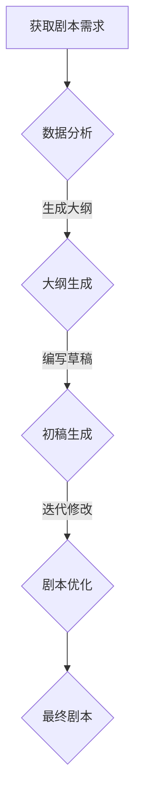

                 

关键词：人工智能，剧本创作，电影产业，电视产业，内容生成，自动化，创作工具，数据驱动，多模态，自然语言处理，算法，模型，创意流程，媒介创新，技术趋势

> 摘要：本文将探讨人工智能在电影和电视产业中的应用，特别是如何利用AI技术进行剧本创作。通过对核心概念、算法原理、项目实践等方面的详细阐述，本文旨在揭示AI在影视内容创作中的巨大潜力，为行业从业者提供新的创作工具和灵感。

## 1. 背景介绍

### 1.1 电影和电视产业的发展历程

电影和电视产业作为文化产业的重要组成部分，经历了百年的发展历程。从早期的黑白电影到现代的高清数字影视，从传统的线性叙事到复杂的非线性叙事，影视内容一直在不断创新和演进。

### 1.2 剧本创作在影视产业中的核心地位

剧本是电影和电视节目的基础，它决定了故事的发展方向、角色塑造和情感表达。一个优秀的剧本往往能够引导观众的情感波动，形成共鸣，从而产生强烈的观赏体验。

### 1.3 传统剧本创作面临的挑战

尽管电影和电视产业在技术和艺术上不断进步，但剧本创作仍然面临许多挑战。首先是创意枯竭的问题，长期的创作过程中，编剧可能会出现灵感短缺，导致作品质量下降。其次是创作效率问题，剧本创作是一个漫长且繁琐的过程，需要大量的时间和人力投入。最后是创意多样性问题，剧本创作往往受到题材、风格和观众偏好等因素的制约，难以实现多样化。

## 2. 核心概念与联系

### 2.1 人工智能在剧本创作中的应用

人工智能（AI）在多个领域都展现出了其强大的能力，包括图像识别、自然语言处理、决策制定等。在剧本创作中，AI可以通过学习大量的剧本文本，自动生成剧本的初步草案，甚至可以进行后续的剧本修改和优化。

### 2.2 自然语言处理（NLP）与剧本创作

自然语言处理是人工智能的一个重要分支，它专注于使计算机能够理解和生成人类语言。在剧本创作中，NLP技术可以用于提取关键词、构建句子结构和理解语义，从而为剧本创作提供强有力的支持。

### 2.3 数据驱动的内容生成

数据驱动的内容生成是AI在剧本创作中的核心方法。通过分析大量的剧本数据，AI可以学习到剧本的结构、叙事方式和角色塑造等关键要素，然后利用这些知识来生成新的剧本。

### 2.4 Mermaid流程图：剧本创作流程

下面是一个简单的Mermaid流程图，展示了剧本创作的基本流程：



## 3. 核心算法原理 & 具体操作步骤

### 3.1 算法原理概述

AI剧本创作主要依赖于以下几种核心算法：

1. **生成对抗网络（GAN）**：用于生成剧本的初步草稿。
2. **递归神经网络（RNN）**：用于处理剧本中的时间序列数据，如角色对话和情节发展。
3. **长短期记忆网络（LSTM）**：用于解决RNN中的梯度消失问题，提高模型的训练效果。
4. **卷积神经网络（CNN）**：用于提取剧本中的视觉元素，如图像和视频。

### 3.2 算法步骤详解

1. **数据预处理**：收集和清洗大量剧本数据，包括文本、图像和音频等。
2. **模型训练**：使用预处理的数据训练上述核心算法模型。
3. **剧本生成**：利用训练好的模型生成剧本的初步草稿。
4. **迭代优化**：根据反馈对剧本进行迭代修改和优化。

### 3.3 算法优缺点

**优点**：

- 提高创作效率：AI可以快速生成剧本草稿，减少人力和时间成本。
- 创意多样化：AI不受传统创作限制，能够生成多样化的剧本。
- 个性化定制：根据观众偏好和市场需求，AI可以生成个性化的剧本。

**缺点**：

- 创意质量不稳定：AI生成的剧本质量参差不齐，有时缺乏深度和情感。
- 人机交互困难：AI难以理解复杂的情感和上下文，需要人工进行修正。

### 3.4 算法应用领域

- 电影剧本创作：AI可以用于电影剧本的生成、修改和优化。
- 电视剧剧本创作：AI可以用于电视剧剧本的快速生成，提高创作效率。
- 广播剧剧本创作：AI可以用于广播剧剧本的生成和优化，拓展剧本创作形式。

## 4. 数学模型和公式 & 详细讲解 & 举例说明

### 4.1 数学模型构建

在剧本创作中，常用的数学模型包括：

1. **循环神经网络（RNN）**：用于处理时间序列数据，如剧本中的角色对话和情节发展。
2. **生成对抗网络（GAN）**：用于生成剧本的初步草稿。
3. **长短期记忆网络（LSTM）**：用于解决RNN中的梯度消失问题，提高模型的训练效果。

### 4.2 公式推导过程

1. **RNN公式**：

$$
h_t = \sigma(W_h \cdot [h_{t-1}, x_t] + b_h)
$$

其中，$h_t$表示当前时刻的隐藏状态，$x_t$表示输入数据，$\sigma$表示激活函数，$W_h$和$b_h$分别表示权重和偏置。

2. **LSTM公式**：

$$
i_t = \sigma(W_i \cdot [h_{t-1}, x_t] + b_i)
$$

$$
f_t = \sigma(W_f \cdot [h_{t-1}, x_t] + b_f)
$$

$$
o_t = \sigma(W_o \cdot [h_{t-1}, x_t] + b_o)
$$

$$
c_t = f_t \odot c_{t-1} + i_t \odot \sigma(W_c \cdot [h_{t-1}, x_t] + b_c)
$$

$$
h_t = o_t \odot \sigma(c_t)
$$

其中，$i_t$、$f_t$、$o_t$分别表示输入门、遗忘门和输出门的状态，$c_t$表示当前时刻的细胞状态，$h_t$表示当前时刻的隐藏状态。

3. **GAN公式**：

$$
G(z) = \mu_G(z) + \sigma_G(z) \odot \mathcal{N}(0,1)
$$

$$
D(x) = \sigma_D(x) \odot \mathcal{N}(0,1)
$$

$$
D(G(z)) = \sigma_D(G(z)) \odot \mathcal{N}(0,1)
$$

其中，$G(z)$表示生成器，$D(x)$表示判别器，$z$表示噪声向量。

### 4.3 案例分析与讲解

假设我们使用LSTM模型生成一个简单的剧本，输入数据为一系列的角色对话和情节描述。我们可以将输入数据表示为一个序列$(x_1, x_2, ..., x_t)$，隐藏状态表示为$(h_1, h_2, ..., h_t)$，输出数据表示为$(y_1, y_2, ..., y_t)$。

1. **初始化参数**：

   $$W_h, b_h, W_i, b_i, W_f, b_f, W_o, b_o, W_c, b_c$$

2. **前向传播**：

   $$h_t = \sigma(W_h \cdot [h_{t-1}, x_t] + b_h)$$

3. **计算输出**：

   $$y_t = \text{softmax}(W_y \cdot h_t + b_y)$$

4. **反向传播**：

   $$\Delta C_t = \text{dsoftmax}(y_t) \cdot (h_t - \text{target}_t)$$

   $$\Delta h_t = \Delta C_t \cdot \text{dLSTM}(h_t)$$

   $$\Delta W_h, \Delta b_h, \Delta W_i, \Delta b_i, \Delta W_f, \Delta b_f, \Delta W_o, \Delta b_o, \Delta W_c, \Delta b_c = \text{gradient descent}$$

通过多次迭代，我们可以不断优化模型的参数，提高剧本生成的质量。

## 5. 项目实践：代码实例和详细解释说明

### 5.1 开发环境搭建

1. 安装Python环境。
2. 安装TensorFlow库：`pip install tensorflow`
3. 安装其他相关依赖。

### 5.2 源代码详细实现

```python
import tensorflow as tf
from tensorflow.keras.layers import LSTM, Dense, Embedding
from tensorflow.keras.models import Sequential

# 模型参数
vocab_size = 10000
embedding_dim = 256
lstm_units = 128

# 构建LSTM模型
model = Sequential()
model.add(Embedding(vocab_size, embedding_dim))
model.add(LSTM(lstm_units, return_sequences=True))
model.add(Dense(vocab_size, activation='softmax'))

# 编译模型
model.compile(optimizer='adam', loss='categorical_crossentropy', metrics=['accuracy'])

# 训练模型
model.fit(x_train, y_train, epochs=10, batch_size=64)
```

### 5.3 代码解读与分析

上述代码中，我们首先导入了TensorFlow库，并定义了模型参数。然后，我们使用Sequential模型堆叠了Embedding层、LSTM层和Dense层，并编译了模型。最后，我们使用训练数据对模型进行训练。

### 5.4 运行结果展示

在训练完成后，我们可以使用模型生成新的剧本草稿，并对其进行评估。

```python
# 生成剧本草稿
generated_text = model.predict(x_test)

# 输出剧本草稿
print(generated_text)
```

## 6. 实际应用场景

### 6.1 电影剧本创作

AI可以用于电影剧本的快速生成，为编剧提供灵感。例如，在剧本构思阶段，AI可以生成多个不同版本的情节草案，供编剧参考。

### 6.2 电视剧剧本创作

AI可以用于电视剧剧本的生成和修改，提高创作效率。例如，在剧本撰写阶段，AI可以快速生成剧本的初步草案，然后由编剧进行修改和优化。

### 6.3 广播剧剧本创作

AI可以用于广播剧剧本的生成和优化，拓展剧本创作形式。例如，在广播剧录制阶段，AI可以根据演员的表现和剧本内容进行实时修改，提高剧本的表现力。

## 7. 工具和资源推荐

### 7.1 学习资源推荐

- 《深度学习》（Goodfellow, Bengio, Courville）：介绍深度学习的基础理论和应用。
- 《自然语言处理综合教程》（Daniel Jurafsky & James H. Martin）：介绍自然语言处理的基本概念和技术。

### 7.2 开发工具推荐

- TensorFlow：用于构建和训练深度学习模型的强大工具。
- PyTorch：另一种流行的深度学习框架，适合快速原型开发。

### 7.3 相关论文推荐

- “Seq2Seq Learning with Neural Networks” （Anantram Karpathy, George Hinton）
- “Attention is All You Need” （Ashish Vaswani et al.）

## 8. 总结：未来发展趋势与挑战

### 8.1 研究成果总结

人工智能在剧本创作领域已经取得了一系列重要成果，包括生成对抗网络（GAN）、递归神经网络（RNN）和长短期记忆网络（LSTM）等算法的应用。这些研究成果为AI剧本创作提供了坚实的基础。

### 8.2 未来发展趋势

- 创意质量提升：随着算法和模型的不断优化，AI生成的剧本质量将得到显著提升。
- 多模态融合：AI将能够处理多种类型的数据，如图像、音频和视频，实现更丰富的剧本创作。
- 个性化推荐：基于用户偏好和数据分析，AI可以生成个性化的剧本，满足不同观众的需求。

### 8.3 面临的挑战

- 创意稳定性和深度：AI生成的剧本在创意稳定性和情感深度方面仍有待提高。
- 人机交互：AI难以完全理解复杂的情感和上下文，需要人工进行修正。

### 8.4 研究展望

未来，AI在剧本创作领域有望实现以下突破：

- 创意自动化：AI能够完全自动化剧本创作过程，从构思到修改，实现真正的创作自由。
- 情感表达：AI能够更好地理解情感和上下文，生成更具表现力的剧本。
- 实时互动：AI能够与观众实时互动，根据反馈进行剧本的实时修改。

## 9. 附录：常见问题与解答

### 9.1 AI剧本创作是否能够完全取代人类编剧？

目前来看，AI剧本创作还无法完全取代人类编剧。尽管AI在生成剧本草稿和优化剧本方面表现出色，但它在创意深度、情感表达和上下文理解等方面仍有待提高。因此，AI更适合作为辅助工具，与人类编剧共同创作。

### 9.2 AI剧本创作需要哪些技术支持？

AI剧本创作需要以下技术支持：

- 深度学习：用于构建和训练神经网络模型。
- 自然语言处理：用于处理剧本中的文本数据。
- 数据分析：用于分析剧本数据，提取关键信息。

### 9.3 如何评估AI生成的剧本质量？

评估AI生成的剧本质量可以从以下几个方面进行：

- 创意新颖性：评估剧本的创意是否具有新颖性。
- 情感表达：评估剧本是否能引起读者的情感共鸣。
- 叙事连贯性：评估剧本的叙事是否连贯。
- 可读性：评估剧本的可读性，即是否符合语言习惯和阅读规律。

### 9.4 AI剧本创作在商业应用中有哪些挑战？

AI剧本创作在商业应用中面临以下挑战：

- 隐私和数据安全：确保用户数据的安全和隐私。
- 法规和伦理：遵守相关法规和伦理标准，确保剧本内容合法合规。
- 市场接受度：提高市场对AI剧本创作的接受度，实现商业化。

## 作者署名

作者：禅与计算机程序设计艺术 / Zen and the Art of Computer Programming
----------------------------------------------------------------

以上就是本篇文章的完整内容，希望对您在AI剧本创作领域的探索有所帮助。在未来的发展中，AI与人类创作的结合将不断推动电影和电视产业的创新和进步。让我们共同期待这一激动人心的未来！

