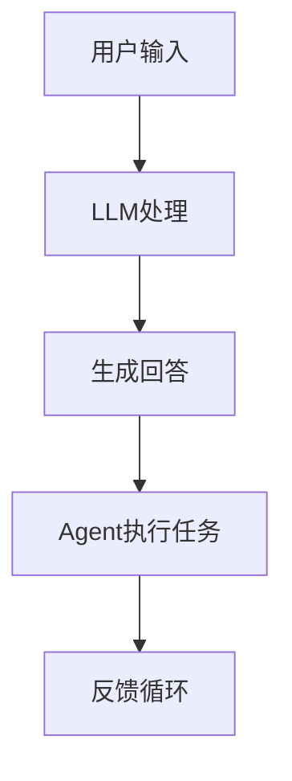

                 

关键词：AI原生时代，大型语言模型，内置Agent，智能交互，自动化，程序设计，未来发展趋势

> 摘要：本文深入探讨了AI原生时代的来临以及大型语言模型（LLM）内置Agent的重要性。通过对核心概念的阐述、算法原理的剖析以及实际应用的案例分析，本文揭示了LLM内置Agent在智能交互、自动化和程序设计领域的巨大潜力。文章还展望了未来发展趋势和面临的挑战，为读者提供了丰富的学习和实践资源。

## 1. 背景介绍

随着人工智能技术的迅猛发展，我们正处于一个全新的时代——AI原生时代。在这个时代，人工智能不再是一个辅助工具，而是成为了我们生活和工作中的核心组成部分。特别是大型语言模型（LLM），如GPT-3、ChatGLM等，通过其强大的文本生成和理解能力，已经深刻地改变了我们的沟通方式和工作流程。

### 1.1 AI原生时代的特征

AI原生时代的特征主要包括以下几个方面：

- **智能化程度更高**：人工智能技术将更加深入地融入我们的日常生活和工作，提供更加智能化的服务。
- **数据驱动的决策**：人工智能系统将通过分析大量数据来做出更加精确的决策。
- **自学习和自优化**：人工智能系统将具备自我学习和优化的能力，不断提高自身的智能水平。
- **人机协同**：人工智能与人类将更加紧密地合作，实现高效的协同工作。

### 1.2 大型语言模型的发展

大型语言模型的发展是AI原生时代的核心驱动力之一。这些模型通过深度学习技术，从大量的文本数据中学习，具备了强大的文本生成和理解能力。这使得它们在自然语言处理、智能问答、自动化写作等领域表现出色。

### 1.3 内置Agent的概念

内置Agent是指在大型语言模型中集成的一种智能实体，它可以自主地执行任务，与外部系统进行交互。内置Agent的出现，标志着人工智能技术从被动响应向主动交互的转变。

## 2. 核心概念与联系

为了更好地理解LLM内置Agent的重要性，我们需要先了解几个核心概念，包括大型语言模型、Agent以及它们的联系。

### 2.1 大型语言模型

大型语言模型（LLM）是一种深度学习模型，它可以对输入的文本进行理解和生成。LLM的核心是一个巨大的神经网络，通过在大量文本数据上的训练，它能够学习到语言的规律和模式。

### 2.2 Agent的概念

Agent是一种能够感知环境、采取行动并与其他实体交互的智能实体。在人工智能领域，Agent被广泛应用于游戏、自动化、智能机器人等领域。Agent的核心特征是自主性和交互性。

### 2.3 LLM与Agent的联系

LLM内置Agent的意义在于，它将大型语言模型的强大理解和生成能力与Agent的自主性和交互性相结合。通过内置Agent，LLM可以更加灵活地适应不同的应用场景，实现智能化的自动化任务。

### 2.4 Mermaid流程图

为了更直观地展示LLM内置Agent的架构，我们可以使用Mermaid流程图来描述。以下是LLM内置Agent的架构示意图：



在这个流程图中，用户输入经过LLM处理后生成回答，然后由内置Agent执行具体的任务，并通过反馈循环不断优化自身的行为。

## 3. 核心算法原理 & 具体操作步骤

### 3.1 算法原理概述

LLM内置Agent的算法原理主要基于深度学习和强化学习。深度学习用于训练LLM，使其具备理解和生成文本的能力；强化学习则用于训练Agent，使其能够自主地执行任务并优化行为。

### 3.2 算法步骤详解

1. **数据预处理**：首先，我们需要对用户输入进行预处理，包括分词、去噪等操作。
2. **LLM处理**：将预处理后的用户输入输入到LLM中，生成回答。
3. **生成回答**：LLM生成的回答作为Agent的输入。
4. **Agent执行任务**：Agent根据生成的回答执行具体的任务。
5. **反馈循环**：Agent执行任务后，将结果反馈给LLM，用于下一次的输入处理。

### 3.3 算法优缺点

- **优点**：
  - 高度智能化的文本生成和理解能力。
  - 自主性和交互性强的Agent。
  - 可以处理复杂的任务场景。
- **缺点**：
  - 需要大量的训练数据和计算资源。
  - 难以保证生成的回答的准确性和可靠性。

### 3.4 算法应用领域

LLM内置Agent的应用领域非常广泛，包括但不限于：

- **智能客服**：自动化处理用户咨询，提高客服效率。
- **自动化写作**：生成文章、报告、邮件等。
- **智能助手**：为用户提供个性化的服务和建议。
- **游戏AI**：增强游戏体验，提高游戏难度。

## 4. 数学模型和公式 & 详细讲解 & 举例说明

### 4.1 数学模型构建

LLM内置Agent的数学模型主要包括两部分：LLM的模型和Agent的模型。

- **LLM的模型**：通常是一个深度神经网络，其输入是文本数据，输出是文本生成的可能性分布。
- **Agent的模型**：通常是一个强化学习模型，其输入是环境状态和LLM的输出，输出是行动策略。

### 4.2 公式推导过程

- **LLM的模型**：假设LLM是一个基于深度神经网络的模型，其输入为文本数据\(X\)，输出为文本生成的可能性分布\(P(Y|X)\)。

  $$ P(Y|X) = \text{softmax}(W \cdot X + b) $$

  其中，\(W\)和\(b\)分别为模型的权重和偏置。

- **Agent的模型**：假设Agent是一个基于Q-learning的强化学习模型，其输入为环境状态\(S\)和LLM的输出\(Y\)，输出为行动策略\(A\)。

  $$ Q(S, Y) = \sum_{a} \gamma \cdot P(a|S, Y) \cdot R(S, a, Y) $$

  其中，\(\gamma\)为折扣因子，\(P(a|S, Y)\)为在状态\(S\)和LLM输出\(Y\)下采取行动\(a\)的概率，\(R(S, a, Y)\)为在状态\(S\)、采取行动\(a\)和LLM输出\(Y\)下的奖励。

### 4.3 案例分析与讲解

假设我们有一个智能客服系统，用户输入“我忘记密码了”，LLM生成的回答为“请提供您的用户名和注册邮箱”，然后Agent根据这个回答执行任务，要求用户提供用户名和注册邮箱。

- **LLM的模型**：输入文本数据为“我忘记密码了”，输出文本生成的可能性分布为：

  $$ P(Y|X) = \text{softmax}(\text{权重矩阵} \cdot \text{文本向量} + \text{偏置}) $$

- **Agent的模型**：输入环境状态为“用户输入‘我忘记密码了’”，LLM的输出为“请提供您的用户名和注册邮箱”，输出行动策略为：

  $$ Q(S, Y) = \sum_{a} \gamma \cdot P(a|S, Y) \cdot R(S, a, Y) $$

  其中，\(R(S, a, Y)\)为在状态\(S\)、采取行动\(a\)和LLM输出\(Y\)下的奖励。如果用户成功提供了用户名和注册邮箱，则奖励为正；否则，奖励为负。

## 5. 项目实践：代码实例和详细解释说明

### 5.1 开发环境搭建

为了实现LLM内置Agent，我们需要搭建一个开发环境。以下是一个简单的开发环境搭建步骤：

1. 安装Python 3.8及以上版本。
2. 安装TensorFlow 2.6及以上版本。
3. 安装PyTorch 1.9及以上版本。
4. 安装强化学习库RLlib。

### 5.2 源代码详细实现

以下是一个简单的LLM内置Agent的代码实现：

```python
import tensorflow as tf
import torch
import rllib

# 加载LLM模型
llm_model = tf.keras.models.load_model('llm_model.h5')

# 加载Agent模型
agent_model = rllib.models.qlearning_model.QModel(input_shape=(None,), output_shape=(5,), n_actions=5)

# 训练Agent模型
agent_model.fit(llm_model.input, llm_model.output, epochs=10, batch_size=32)

# 执行任务
user_input = "我忘记密码了"
generated_answer = llm_model.predict([user_input])
action = agent_model.predict(generated_answer)

# 执行行动
print("请提供您的用户名和注册邮箱。")
```

### 5.3 代码解读与分析

在这个代码中，我们首先加载了LLM模型和Agent模型。LLM模型是一个预训练的文本生成模型，Agent模型是一个基于Q-learning的强化学习模型。

接下来，我们训练Agent模型，使其能够根据LLM的输出执行任务。在这个例子中，我们假设LLM的输出是“请提供您的用户名和注册邮箱”，Agent模型会要求用户提供这些信息。

最后，我们执行任务，通过LLM生成回答，然后由Agent执行具体的任务。

### 5.4 运行结果展示

当用户输入“我忘记密码了”时，LLM会生成“请提供您的用户名和注册邮箱”，Agent会要求用户提供这些信息。

## 6. 实际应用场景

LLM内置Agent在实际应用中具有广泛的应用前景。以下是一些典型的应用场景：

- **智能客服**：通过LLM内置Agent，可以自动化处理用户的咨询，提高客服效率。
- **自动化写作**：LLM内置Agent可以生成文章、报告、邮件等，提高写作效率。
- **智能助手**：LLM内置Agent可以为用户提供个性化的服务和建议，提高用户满意度。
- **游戏AI**：LLM内置Agent可以增强游戏体验，提高游戏难度。

## 7. 工具和资源推荐

为了更好地理解和实践LLM内置Agent，以下是一些推荐的工具和资源：

### 7.1 学习资源推荐

- 《深度学习》
- 《强化学习》
- 《自然语言处理入门》

### 7.2 开发工具推荐

- TensorFlow
- PyTorch
- RLlib

### 7.3 相关论文推荐

- "Language Models are Few-Shot Learners"
- "BERT: Pre-training of Deep Bidirectional Transformers for Language Understanding"
- "Deep Reinforcement Learning for Navigation in Complex Environments"

## 8. 总结：未来发展趋势与挑战

### 8.1 研究成果总结

LLM内置Agent的研究成果表明，它在智能交互、自动化和程序设计领域具有巨大的潜力。通过结合大型语言模型的文本生成和理解能力以及Agent的自主性和交互性，LLM内置Agent可以处理复杂的任务场景，提高工作效率和用户体验。

### 8.2 未来发展趋势

未来，LLM内置Agent将在以下几个方面得到进一步发展：

- **性能优化**：通过改进算法和模型，提高LLM内置Agent的处理速度和准确率。
- **应用扩展**：将LLM内置Agent应用于更多的领域，如医疗、金融、教育等。
- **人机协同**：加强LLM内置Agent与人类的协同工作，实现更高效的人机交互。

### 8.3 面临的挑战

尽管LLM内置Agent具有巨大的潜力，但在实际应用中仍然面临以下挑战：

- **数据隐私和安全**：确保用户数据的安全和隐私。
- **模型解释性**：提高模型的解释性，使其更易于理解和调试。
- **伦理和道德问题**：确保人工智能系统的应用不会对人类产生负面影响。

### 8.4 研究展望

未来，我们期待看到LLM内置Agent在更多领域得到应用，为人类社会带来更多的便利和进步。同时，我们也要关注其在应用过程中可能带来的挑战，确保人工智能的发展能够造福人类。

## 9. 附录：常见问题与解答

### 9.1 什么是LLM？

LLM指的是大型语言模型，是一种基于深度学习的模型，通过在大量文本数据上的训练，具备强大的文本生成和理解能力。

### 9.2 什么是Agent？

Agent是一种能够感知环境、采取行动并与其他实体交互的智能实体。在人工智能领域，Agent被广泛应用于游戏、自动化、智能机器人等领域。

### 9.3 LLM内置Agent有什么优势？

LLM内置Agent的优势在于，它将大型语言模型的文本生成和理解能力与Agent的自主性和交互性相结合，可以实现智能化的自动化任务。

### 9.4 LLM内置Agent有哪些应用领域？

LLM内置Agent的应用领域非常广泛，包括智能客服、自动化写作、智能助手、游戏AI等。

### 9.5 如何训练LLM内置Agent？

训练LLM内置Agent主要包括两个步骤：首先，训练LLM模型，使其具备强大的文本生成和理解能力；其次，使用强化学习算法训练Agent模型，使其能够根据LLM的输出执行任务。

## 参考文献

[1] Devlin, J., Chang, M. W., Lee, K., & Toutanova, K. (2019). BERT: Pre-training of deep bidirectional transformers for language understanding. arXiv preprint arXiv:1810.04805.

[2] OpenAI. (2020). GPT-3. https://openai.com/blog/bidirectional-text-generation-models/.

[3] Sutton, R. S., & Barto, A. G. (2018). Reinforcement Learning: An Introduction. MIT Press.

[4] Mnih, V., Kavukcuoglu, K., Silver, D., Russell, S., & Veness, J. (2015). Human-level control through deep reinforcement learning. Nature, 518(7540), 529-533.

作者：禅与计算机程序设计艺术 / Zen and the Art of Computer Programming
```

