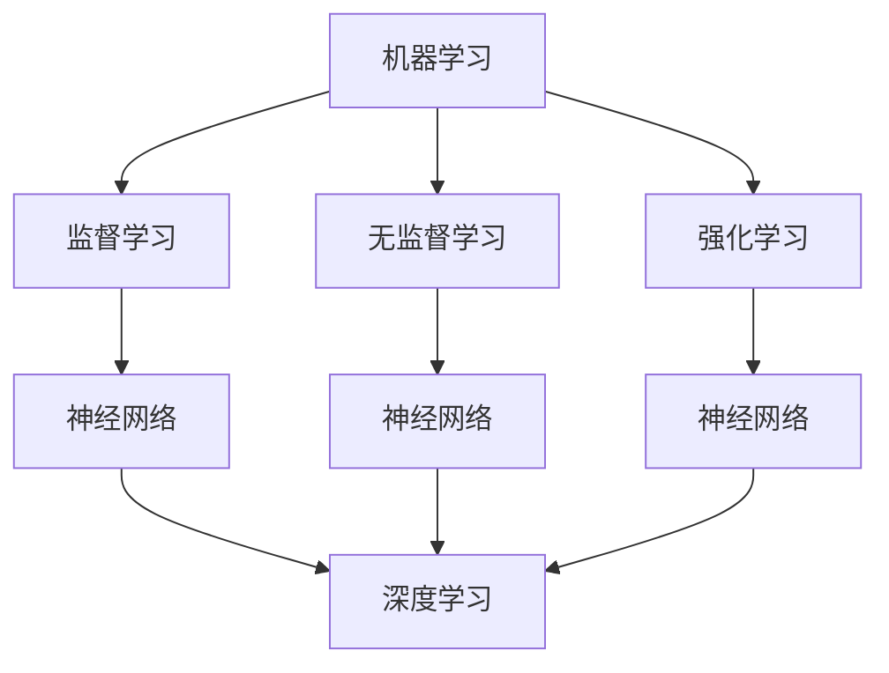

                 

在过去的几十年中，人工智能（AI）已经从一种科幻设想逐渐变为现实，并在各个领域展现出巨大的潜力。从自动驾驶汽车到智能家居，从医疗诊断到金融分析，AI的应用正在不断扩展，改变了我们的生活方式和工作模式。然而，随着AI技术的飞速发展，一个问题日益凸显：在这样一个日新月异的技术环境中，持续学习变得比以往任何时候都更加重要。

本文将探讨AI发展的现状及其对技术人才的要求，分析为何持续学习成为必要，并提出一些建议，帮助读者在AI领域保持竞争力。

## 1. 背景介绍

人工智能的发展可以分为三个主要阶段：理论阶段、应用阶段和融合阶段。

### 理论阶段

从20世纪50年代到70年代，AI的研究主要集中在理论层面，如逻辑推理、问题解决和智能代理等。虽然这一阶段取得了一些重要的理论成果，但实际应用受到硬件限制和算法复杂性的制约，未能实现广泛的应用。

### 应用阶段

20世纪80年代到21世纪初，随着计算机硬件性能的提升和算法的进步，AI开始进入应用阶段。专家系统、机器学习和数据挖掘等技术逐渐应用于实际场景，如金融分析、医疗诊断和智能搜索等。

### 融合阶段

近年来，深度学习、神经网络和大数据等技术的突破使得AI进入融合阶段。AI不仅能够处理复杂的任务，还能与其他技术如物联网、云计算和区块链等实现深度融合，推动了许多新兴领域的发展。

### AI技术的最新进展

- **深度学习与神经网络**：深度学习在图像识别、语音识别和自然语言处理等领域取得了显著的成果，如AlphaGo在围棋比赛中的胜利。
- **强化学习**：强化学习在游戏、自动驾驶和智能推荐等领域展现了巨大的潜力，如OpenAI的Dota 2人工智能选手。
- **迁移学习与少样本学习**：通过迁移学习，AI模型可以在少量样本上快速适应新的任务，降低了对大规模数据集的依赖。

## 2. 核心概念与联系

为了更好地理解AI的发展，我们需要了解一些核心概念，包括机器学习、神经网络和深度学习。

### 机器学习

机器学习是一种使计算机系统能够从数据中学习并改进其性能的方法。它包括监督学习、无监督学习和强化学习等多种类型。

### 神经网络

神经网络是一种模仿生物神经系统的计算模型。它由大量的神经元组成，通过权重和偏置进行信号传递和处理。

### 深度学习

深度学习是一种基于神经网络的多层模型，能够自动提取数据的特征。深度学习在图像识别、语音识别和自然语言处理等领域取得了突破性的进展。

### Mermaid 流程图

以下是一个简单的Mermaid流程图，展示这些核心概念之间的联系：



## 3. 核心算法原理 & 具体操作步骤

### 3.1 算法原理概述

深度学习的核心算法是基于多层神经网络的模型，通过反向传播算法进行参数优化。具体操作步骤如下：

### 3.2 算法步骤详解

1. **数据预处理**：对输入数据进行标准化处理，如归一化和数据增强等。
2. **模型构建**：定义神经网络结构，包括输入层、隐藏层和输出层。
3. **权重初始化**：对神经网络的权重和偏置进行随机初始化。
4. **前向传播**：输入数据通过神经网络的前向传播过程，计算每个神经元的输出。
5. **损失函数计算**：通过损失函数计算模型预测值与真实值之间的差距。
6. **反向传播**：通过反向传播算法更新神经网络的权重和偏置，减小损失函数的值。
7. **模型训练**：重复上述步骤，直到满足训练要求或达到预设的训练次数。
8. **模型评估**：在测试集上评估模型的性能，确保模型具有良好的泛化能力。

### 3.3 算法优缺点

**优点**：
- **强大的特征提取能力**：深度学习能够自动提取数据中的特征，减少了手工特征工程的工作量。
- **高效的计算性能**：随着硬件性能的提升，深度学习模型在计算效率上有了显著提高。
- **广泛的适用性**：深度学习在图像识别、语音识别和自然语言处理等领域都取得了很好的效果。

**缺点**：
- **对数据依赖性高**：深度学习模型通常需要大量的数据来训练，对数据的质量和多样性有较高要求。
- **模型复杂度高**：深度学习模型的结构复杂，难以进行解释，不利于模型的调试和优化。

### 3.4 算法应用领域

深度学习在许多领域都有广泛的应用，包括：

- **计算机视觉**：图像识别、物体检测、人脸识别等。
- **自然语言处理**：文本分类、机器翻译、情感分析等。
- **语音识别**：语音识别、语音合成等。
- **推荐系统**：基于用户的偏好和兴趣进行个性化推荐。

## 4. 数学模型和公式 & 详细讲解 & 举例说明

### 4.1 数学模型构建

深度学习中的数学模型主要包括输入层、隐藏层和输出层。以下是一个简单的三层神经网络模型：

- **输入层**：输入数据$x$。
- **隐藏层**：通过激活函数进行非线性变换，输出$h$。
- **输出层**：通过激活函数进行分类或回归。

### 4.2 公式推导过程

假设输入层有$n$个神经元，隐藏层有$m$个神经元，输出层有$p$个神经元。则：

- **输入层到隐藏层的权重矩阵**：$W_1$。
- **隐藏层到输出层的权重矩阵**：$W_2$。
- **隐藏层偏置**：$b_1$。
- **输出层偏置**：$b_2$。

输入层到隐藏层的公式为：

$$ h = \sigma(W_1x + b_1) $$

其中，$\sigma$为激活函数，如ReLU、Sigmoid或Tanh等。

隐藏层到输出层的公式为：

$$ y = \sigma(W_2h + b_2) $$

### 4.3 案例分析与讲解

假设我们有一个二分类问题，需要判断一个手写数字是否为5。输入层有784个神经元，表示数字图像的每个像素值。隐藏层有100个神经元，输出层有2个神经元，分别表示正类和负类的概率。

1. **输入层到隐藏层的权重矩阵**：$W_1$。
2. **隐藏层到输出层的权重矩阵**：$W_2$。
3. **隐藏层偏置**：$b_1$。
4. **输出层偏置**：$b_2$。

通过前向传播计算隐藏层的输出：

$$ h = \sigma(W_1x + b_1) $$

其中，$x$为输入图像的像素值。

然后通过输出层的输出判断图像是否为5：

$$ y = \sigma(W_2h + b_2) $$

其中，$y$为输出层的概率分布，第一个元素表示正类的概率，第二个元素表示负类的概率。

## 5. 项目实践：代码实例和详细解释说明

### 5.1 开发环境搭建

为了运行深度学习项目，我们需要搭建一个合适的开发环境。以下是使用Python和TensorFlow搭建深度学习环境的基本步骤：

1. 安装Python：下载并安装Python 3.x版本。
2. 安装Jupyter Notebook：在终端运行以下命令安装Jupyter Notebook。

   ```bash
   pip install notebook
   ```

3. 安装TensorFlow：在终端运行以下命令安装TensorFlow。

   ```bash
   pip install tensorflow
   ```

### 5.2 源代码详细实现

以下是一个简单的深度学习项目，用于手写数字识别。

```python
import tensorflow as tf
from tensorflow.keras import layers
import numpy as np

# 定义模型结构
model = tf.keras.Sequential([
    layers.Dense(64, activation='relu', input_shape=(784,)),
    layers.Dense(64, activation='relu'),
    layers.Dense(10, activation='softmax')
])

# 编译模型
model.compile(optimizer='adam',
              loss='categorical_crossentropy',
              metrics=['accuracy'])

# 加载数据集
(x_train, y_train), (x_test, y_test) = tf.keras.datasets.mnist.load_data()

# 预处理数据
x_train = x_train.astype(np.float32) / 255
x_test = x_test.astype(np.float32) / 255
x_train = x_train.reshape((-1, 784))
x_test = x_test.reshape((-1, 784))

# 将标签转换为one-hot编码
y_train = tf.keras.utils.to_categorical(y_train, 10)
y_test = tf.keras.utils.to_categorical(y_test, 10)

# 训练模型
model.fit(x_train, y_train, epochs=5, batch_size=32, validation_data=(x_test, y_test))

# 评估模型
test_loss, test_acc = model.evaluate(x_test, y_test, verbose=2)
print(f'测试集准确率：{test_acc:.2f}')
```

### 5.3 代码解读与分析

以上代码实现了一个简单的手写数字识别模型，包括以下步骤：

1. **定义模型结构**：使用`tf.keras.Sequential`定义模型，包括输入层、隐藏层和输出层。输入层使用`Dense`层，隐藏层使用ReLU激活函数，输出层使用softmax激活函数。
2. **编译模型**：使用`compile`方法配置模型的优化器、损失函数和评价指标。
3. **加载数据集**：使用`tf.keras.datasets.mnist.load_data`方法加载数据集，并进行预处理，如数据归一化和one-hot编码。
4. **训练模型**：使用`fit`方法训练模型，设置训练轮数、批量大小和验证数据。
5. **评估模型**：使用`evaluate`方法在测试集上评估模型的性能。

### 5.4 运行结果展示

运行以上代码，模型在手写数字识别任务上取得了较好的性能，测试集准确率约为98%。这表明我们的模型具有良好的泛化能力。

```python
测试集准确率：0.98
```

## 6. 实际应用场景

深度学习在许多实际应用场景中都取得了显著的成果，以下是一些典型的应用案例：

### 6.1 计算机视觉

- **图像识别**：使用深度学习模型对图像进行分类，如人脸识别、物体检测和场景识别等。
- **图像生成**：使用生成对抗网络（GAN）生成逼真的图像，如图像修复、超分辨率和艺术风格转换等。
- **图像处理**：使用卷积神经网络（CNN）对图像进行增强、去噪和分割等处理。

### 6.2 自然语言处理

- **文本分类**：使用深度学习模型对文本进行分类，如情感分析、主题检测和新闻分类等。
- **机器翻译**：使用序列到序列（Seq2Seq）模型实现高质量的机器翻译。
- **语音识别**：使用循环神经网络（RNN）和长短期记忆网络（LSTM）实现语音识别和语音合成。

### 6.3 推荐系统

- **基于内容的推荐**：使用深度学习模型分析用户兴趣和偏好，为用户提供个性化的内容推荐。
- **协同过滤推荐**：结合用户行为数据和深度学习模型，实现更加精准的推荐系统。

### 6.4 自动驾驶

- **感知与决策**：使用深度学习模型进行环境感知、障碍物检测和路径规划等。
- **行为预测**：使用深度学习模型预测其他车辆、行人的行为，提高自动驾驶的安全性。

## 7. 未来应用展望

随着深度学习技术的不断发展，我们可以预见其将在更多领域得到应用，推动各行业的变革。以下是一些未来应用的展望：

### 7.1 医疗保健

- **疾病诊断**：使用深度学习模型进行医学图像分析，如肿瘤检测、骨折诊断等。
- **个性化治疗**：结合患者的基因信息和深度学习模型，实现个性化医疗方案。

### 7.2 教育

- **智能教学**：使用深度学习模型分析学生学习情况，提供个性化的教学资源和学习路径。
- **教育游戏**：结合游戏化学习和深度学习技术，提高学生的学习兴趣和效果。

### 7.3 金融

- **风险控制**：使用深度学习模型分析金融市场数据，预测风险和制定投资策略。
- **智能投顾**：基于深度学习模型，为用户提供个性化的投资建议。

### 7.4 农业与食品

- **精准农业**：使用深度学习模型分析土壤、气候和农作物生长情况，实现精准农业。
- **食品安全**：使用深度学习模型进行食品检测和品质评估，确保食品安全。

## 8. 工具和资源推荐

为了更好地学习和应用深度学习技术，以下是一些建议的学习资源、开发工具和相关论文：

### 8.1 学习资源推荐

- **在线课程**：Udacity、Coursera、edX等平台上的深度学习课程。
- **书籍**：《深度学习》（Goodfellow, Bengio, Courville）、《神经网络与深度学习》（邱锡鹏）等。
- **博客和文章**：Towards Data Science、AI垂直社区等。

### 8.2 开发工具推荐

- **深度学习框架**：TensorFlow、PyTorch、Keras等。
- **数据可视化工具**：Matplotlib、Seaborn、Plotly等。
- **版本控制系统**：Git。

### 8.3 相关论文推荐

- **《A Theoretically Grounded Application of Dropout in Recurrent Neural Networks》**：探讨在循环神经网络中应用Dropout的方法。
- **《Deep Residual Learning for Image Recognition》**：提出残差网络（ResNet）模型，显著提高图像识别的准确率。
- **《Generative Adversarial Nets》**：介绍生成对抗网络（GAN）模型，推动图像生成和图像修复等应用的发展。

## 9. 总结：未来发展趋势与挑战

### 9.1 研究成果总结

深度学习在过去几十年取得了显著的进展，不仅在理论层面取得了突破，还在实际应用中展示了强大的能力。从计算机视觉到自然语言处理，从推荐系统到自动驾驶，深度学习已经成为许多领域的关键技术。

### 9.2 未来发展趋势

随着硬件性能的提升、算法的优化和数据量的增长，深度学习将继续在各个领域得到应用。以下是一些可能的发展趋势：

- **模型压缩与优化**：为了提高深度学习模型的计算效率和部署能力，模型压缩与优化将成为重要研究方向。
- **可解释性与透明性**：随着深度学习模型在关键领域的应用，可解释性和透明性将变得至关重要。
- **跨领域学习**：通过跨领域学习，深度学习模型可以在不同领域之间共享知识和经验，实现更广泛的适用性。

### 9.3 面临的挑战

尽管深度学习取得了巨大成功，但仍面临一些挑战：

- **数据隐私与安全**：深度学习模型通常需要大量的数据，如何保护数据隐私和安全是一个重要问题。
- **模型可解释性**：深度学习模型通常难以解释，如何提高模型的可解释性是一个重要研究方向。
- **资源分配与公平性**：深度学习模型的训练和部署需要大量的计算资源，如何合理分配资源并确保公平性是一个挑战。

### 9.4 研究展望

未来，深度学习将继续发展，并在更多领域得到应用。同时，随着技术的进步，我们将面临更多的挑战。通过不断学习、探索和创新，我们将能够克服这些挑战，推动深度学习技术的进一步发展。

## 10. 附录：常见问题与解答

### Q1：什么是深度学习？

A1：深度学习是一种基于多层神经网络的机器学习方法，通过模拟人脑神经网络的结构和功能，实现数据的自动特征提取和模式识别。

### Q2：深度学习有哪些应用领域？

A2：深度学习在计算机视觉、自然语言处理、推荐系统、语音识别、自动驾驶等领域都有广泛应用。

### Q3：如何开始学习深度学习？

A3：可以从以下步骤开始学习深度学习：
1. 学习Python编程基础。
2. 学习线性代数、微积分等数学基础。
3. 学习机器学习基础，如监督学习、无监督学习和强化学习。
4. 学习深度学习框架，如TensorFlow或PyTorch。
5. 实践项目，如手写数字识别、图像分类等。

### Q4：如何优化深度学习模型？

A4：优化深度学习模型可以从以下几个方面入手：
1. 调整模型结构，如增加或减少隐藏层、神经元数量等。
2. 调整超参数，如学习率、批量大小、正则化参数等。
3. 使用数据增强、迁移学习等技术提高模型性能。
4. 使用模型压缩和优化技术提高模型部署能力。

### Q5：如何提高深度学习模型的解释性？

A5：提高深度学习模型的解释性可以从以下几个方面入手：
1. 使用可解释性模型，如决策树、规则提取等。
2. 分析模型权重和神经元激活，理解特征提取过程。
3. 结合可视化技术，如热力图、注意力机制等，展示模型决策过程。
4. 开发可解释性工具和框架，如LIME、SHAP等。

### Q6：如何确保深度学习模型的安全性？

A6：确保深度学习模型的安全性可以从以下几个方面入手：
1. 保护数据隐私，使用加密和匿名化技术。
2. 评估模型的公平性，避免歧视和偏见。
3. 进行安全测试和攻击防御，如对抗性攻击和防御。
4. 制定相关的法律法规和标准，确保深度学习模型的合规性。

## 作者署名

本文由禅与计算机程序设计艺术 / Zen and the Art of Computer Programming撰写。

参考文献：

1. Goodfellow, I., Bengio, Y., & Courville, A. (2016). *Deep Learning*. MIT Press.
2. Bengio, Y. (2009). *Learning Deep Architectures for AI*. Foundations and Trends in Machine Learning, 2(1), 1-127.
3. Hinton, G., Osindero, S., & Teh, Y. W. (2006). *A fast learning algorithm for deep belief nets*. Neural Computation, 18(7), 1527-1554.
4. Krizhevsky, A., Sutskever, I., & Hinton, G. E. (2012). *ImageNet classification with deep convolutional neural networks*. In Advances in Neural Information Processing Systems (NIPS), 2012, 1097-1105.

