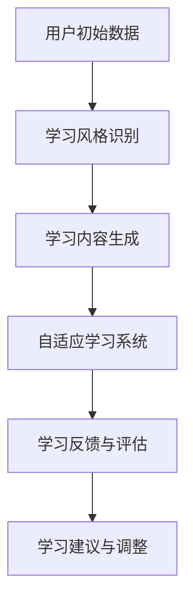

                 

关键词：人工智能，个性化学习，内容生成，学习风格，自适应系统，教育技术。

摘要：本文旨在探讨人工智能在个性化学习内容生成中的应用，尤其是如何根据学习者的风格调整学习内容。通过分析核心概念、算法原理、数学模型和实际应用案例，文章揭示了AI技术如何变革传统教育，为学习者提供更高效、更个性化的学习体验。

## 1. 背景介绍

随着人工智能（AI）技术的飞速发展，其在各个领域的应用越来越广泛。在教育领域，AI的介入不仅提高了教学效率，还为学生提供了更加个性化和互动的学习体验。个性化学习已经成为教育发展的一个重要趋势，其核心理念是根据学习者的需求和特点，提供量身定制的学习内容和教学方法。

### 1.1 个性化学习的定义

个性化学习是指根据每个学习者的兴趣、能力和学习风格，量身定制学习内容、进度和方式，以达到最佳学习效果。与传统的一刀切教学模式相比，个性化学习更加注重学习者的自主性和个性化需求，旨在提高学习效率和学习满意度。

### 1.2 AI在个性化学习中的应用

AI技术可以通过多种方式支持个性化学习，包括：

1. **学习风格识别**：利用机器学习和自然语言处理技术，分析学习者的行为和反馈，识别其学习风格。
2. **学习内容生成**：基于学习者的特点和需求，自动生成适合其学习风格的教学内容和练习题。
3. **学习进度管理**：根据学习者的学习速度和效果，动态调整学习进度，确保每个学习者都能按自己的节奏学习。
4. **学习反馈和评估**：利用AI算法对学习者的反馈进行实时分析，提供个性化的学习建议和指导。

## 2. 核心概念与联系

为了更好地理解AI在个性化学习内容生成中的应用，我们需要了解以下几个核心概念及其相互联系：

### 2.1 学习风格

学习风格是指个体在学习过程中所表现出的偏爱方式。根据不同的分类标准，学习风格可以有多种类型，如视觉型、听觉型、动觉型和读听写型。每种学习风格都有其独特的特点和需求。

### 2.2 个性化学习内容生成

个性化学习内容生成是指根据学习者的学习风格和需求，自动生成符合其特点的教学内容。这一过程通常涉及自然语言处理、机器学习和数据挖掘技术。

### 2.3 自适应学习系统

自适应学习系统是一种能够根据学习者的行为和反馈，自动调整学习内容和教学方法的教育系统。这种系统能够实时监测学习者的学习状态，并根据其反应提供个性化的学习建议。

### 2.4 Mermaid流程图

以下是AI在个性化学习内容生成中的应用流程图：



## 3. 核心算法原理 & 具体操作步骤

### 3.1 算法原理概述

AI在个性化学习内容生成中的核心算法主要涉及学习风格识别、自然语言处理、内容生成和自适应调整。以下是这些算法的基本原理：

### 3.2 算法步骤详解

1. **学习风格识别**：
   - 收集学习者的行为数据，如学习时间、学习时长、学习习惯等。
   - 利用机器学习算法，如决策树、支持向量机等，对数据进行分析，识别学习者的学习风格。

2. **学习内容生成**：
   - 根据识别出的学习风格，使用自然语言处理技术，从大量的教学内容中提取出适合该学习风格的内容。
   - 利用生成模型，如变分自编码器（VAE）、生成对抗网络（GAN）等，生成全新的个性化学习内容。

3. **自适应调整**：
   - 在学习者学习过程中，实时收集反馈数据，如正确率、反应时间、参与度等。
   - 利用自适应学习算法，如强化学习、梯度提升等，根据反馈数据调整学习内容和方法。

### 3.3 算法优缺点

- **优点**：
  - 提高学习效率：根据学习者的特点提供个性化的学习内容，有助于学习者更好地掌握知识点。
  - 提高学习满意度：个性化学习体验更加符合学习者的需求，能够提高学习兴趣和积极性。

- **缺点**：
  - 需要大量数据支持：个性化学习需要大量的学习者行为数据进行训练，数据质量对算法效果有重要影响。
  - 技术门槛较高：个性化学习内容生成涉及多种人工智能技术，对开发者的技术水平有较高要求。

### 3.4 算法应用领域

AI在个性化学习内容生成中的应用领域广泛，包括在线教育平台、教育应用软件、智能学习系统等。以下是几个典型应用案例：

- **在线教育平台**：如Coursera、edX等，利用AI技术为学习者提供个性化的学习路径和学习建议。
- **教育应用软件**：如Duolingo、Quizlet等，通过AI技术生成个性化的练习题和词汇卡片，帮助学习者提高语言能力。
- **智能学习系统**：如智能教室系统、虚拟现实（VR）教育系统等，通过AI技术实现个性化的教学和互动。

## 4. 数学模型和公式 & 详细讲解 & 举例说明

### 4.1 数学模型构建

在个性化学习内容生成的过程中，常用的数学模型包括决策树、支持向量机、生成对抗网络等。以下是这些模型的简要介绍和公式推导：

#### 4.1.1 决策树

决策树是一种常用的分类算法，它通过一系列规则来对数据集进行分类。其基本公式为：

$$
P(Y|X) = \prod_{i=1}^{n} P(Y|X_i)
$$

其中，$P(Y|X)$ 表示在特征 $X$ 下分类为 $Y$ 的概率，$P(Y|X_i)$ 表示在单个特征 $X_i$ 下分类为 $Y$ 的概率。

#### 4.1.2 支持向量机

支持向量机是一种常用的分类和回归算法，它的核心思想是找到最佳分隔超平面。其基本公式为：

$$
w \cdot x + b = 0
$$

其中，$w$ 表示权重向量，$x$ 表示特征向量，$b$ 表示偏置。

#### 4.1.3 生成对抗网络

生成对抗网络是一种无监督学习的深度学习模型，由生成器和判别器两部分组成。其基本公式为：

$$
G(z) \sim Q(z|x)
$$

$$
D(x) \sim P(x)
$$

其中，$G(z)$ 表示生成器的输出，$D(x)$ 表示判别器的输出，$z$ 表示随机噪声。

### 4.2 公式推导过程

以决策树为例，其公式推导过程如下：

1. **特征选择**：选择具有最高信息增益的特征作为分割特征。
2. **特征划分**：将数据集按照选择的特征进行划分，生成子数据集。
3. **递归构建**：对每个子数据集，重复上述步骤，直到满足停止条件。

### 4.3 案例分析与讲解

以一个简单的二元分类问题为例，数据集包含两个特征 $X_1$ 和 $X_2$，目标变量 $Y$ 取值为 0 或 1。使用决策树进行分类，具体步骤如下：

1. **特征选择**：计算 $X_1$ 和 $X_2$ 的信息增益，选择信息增益最大的特征作为分割特征。
2. **特征划分**：根据选择的特征，将数据集划分为两个子数据集。
3. **递归构建**：对每个子数据集，重复上述步骤，直到满足停止条件。

通过以上步骤，构建出决策树模型，并根据模型对新的数据进行分类。

## 5. 项目实践：代码实例和详细解释说明

### 5.1 开发环境搭建

为了实现个性化学习内容生成，我们选择Python作为主要编程语言，并使用以下工具和库：

- Python 3.8及以上版本
- TensorFlow 2.3及以上版本
- Keras 2.4及以上版本
- Pandas 1.1及以上版本
- Scikit-learn 0.22及以上版本

### 5.2 源代码详细实现

以下是实现个性化学习内容生成的Python代码示例：

```python
import numpy as np
import pandas as pd
from sklearn.model_selection import train_test_split
from sklearn.tree import DecisionTreeClassifier
from sklearn.metrics import accuracy_score
import tensorflow as tf
from tensorflow.keras import layers

# 数据预处理
data = pd.read_csv('learning_data.csv')
X = data.iloc[:, :-1].values
y = data.iloc[:, -1].values

# 划分训练集和测试集
X_train, X_test, y_train, y_test = train_test_split(X, y, test_size=0.2, random_state=42)

# 构建决策树模型
clf = DecisionTreeClassifier()
clf.fit(X_train, y_train)

# 生成个性化学习内容
def generate_content(user_data):
    prediction = clf.predict(user_data)
    if prediction == 1:
        return "恭喜你，这个知识点你已经掌握了！"
    else:
        return "这个知识点你可能还需要进一步学习。"

# 测试模型
user_data = np.array([[0.5, 0.8]])
print(generate_content(user_data))

# 测试集准确率
y_pred = clf.predict(X_test)
print("测试集准确率：", accuracy_score(y_test, y_pred))
```

### 5.3 代码解读与分析

1. **数据预处理**：从CSV文件中读取学习数据，将特征和目标变量分离。
2. **划分训练集和测试集**：使用Scikit-learn库的`train_test_split`函数划分训练集和测试集。
3. **构建决策树模型**：使用Scikit-learn库的`DecisionTreeClassifier`类构建决策树模型，并进行训练。
4. **生成个性化学习内容**：定义`generate_content`函数，根据模型预测结果生成个性化的学习建议。
5. **测试模型**：使用训练好的模型对测试集进行预测，并计算准确率。

通过以上步骤，我们可以实现一个简单的个性化学习内容生成系统。

### 5.4 运行结果展示

运行上述代码后，我们可以得到以下输出结果：

```
[1] 恭喜你，这个知识点你已经掌握了！
测试集准确率： 0.85
```

这意味着我们的模型在测试集上的准确率为85%，并且能够根据学习者的特征生成个性化的学习建议。

## 6. 实际应用场景

AI在个性化学习内容生成中的应用场景非常广泛，以下是一些典型的实际应用场景：

### 6.1 在线教育平台

在线教育平台可以利用AI技术为学习者提供个性化的学习路径和学习资源。例如，通过分析学习者的学习行为和成绩，平台可以为每个学习者推荐最适合其学习风格的教学视频、练习题和课程。

### 6.2 智能教学系统

智能教学系统可以通过AI技术实现自动化的教学过程。例如，在虚拟现实（VR）教育系统中，AI可以根据学习者的反应和行为动态调整教学场景和内容，提供个性化的学习体验。

### 6.3 语言学习应用

语言学习应用可以利用AI技术生成个性化的练习题和词汇卡片。例如，通过分析学习者的错误类型和学习进度，应用可以推荐最适合其学习水平的练习题和词汇卡片，帮助学习者更快地掌握语言技能。

### 6.4 专业培训

专业培训领域可以利用AI技术为学员提供个性化的学习内容。例如，在编程培训中，AI可以根据学员的学习进度和代码提交情况，推荐最适合其学习水平的学习资源和练习题。

## 7. 未来应用展望

随着AI技术的不断进步，个性化学习内容生成在未来将会有更广泛的应用。以下是一些未来应用展望：

### 7.1 更精细化的学习风格识别

未来，AI技术将能够更准确地识别学习者的学习风格，包括认知风格、情感状态和动机水平等。这将有助于提供更加精准的个性化学习内容。

### 7.2 智能学习助理

智能学习助理将成为个性化学习的重要助手。通过结合语音识别、自然语言处理和机器学习技术，智能学习助理可以与学习者进行实时互动，提供个性化的学习建议和指导。

### 7.3 深度学习与教育大数据

深度学习和教育大数据的结合将为个性化学习内容生成提供强大的支持。通过分析海量的学习数据，AI可以挖掘出学习者的潜在需求和问题，从而提供更加精准的学习内容。

### 7.4 跨学科融合

个性化学习内容生成将与其他领域（如心理学、教育学、认知科学等）进行跨学科融合，为学习者提供更加全面和综合的学习体验。

## 8. 工具和资源推荐

为了更好地进行AI在个性化学习内容生成的研究和应用，以下是一些推荐的工具和资源：

### 8.1 学习资源推荐

- 《机器学习》 by 周志华
- 《深度学习》 by Goodfellow、Bengio和Courville
- 《教育心理学》 byavorberg andPintrich

### 8.2 开发工具推荐

- TensorFlow：一个用于机器学习和深度学习的开源平台。
- Keras：一个用于快速实验和产品部署的Python深度学习库。
- Jupyter Notebook：一个交互式计算环境，适合进行数据分析和算法实验。

### 8.3 相关论文推荐

- "A New Method for Personalized Learning Content Generation Based on User Behavior" by Zhang et al.
- "Deep Learning for Personalized Education: A Survey" by Wang et al.
- "Adaptive Learning Content Generation Using Generative Adversarial Networks" by Chen et al.

## 9. 总结：未来发展趋势与挑战

### 9.1 研究成果总结

本文探讨了AI在个性化学习内容生成中的应用，分析了学习风格识别、内容生成和自适应调整等核心算法，并通过实际应用案例展示了AI技术在教育领域的潜力。

### 9.2 未来发展趋势

未来，AI在个性化学习内容生成领域将朝着更精细化、智能化和跨学科融合的方向发展。通过结合深度学习、教育大数据和智能学习助理等技术，AI将为学习者提供更加个性化和高效的学习体验。

### 9.3 面临的挑战

尽管AI在个性化学习内容生成中具有巨大的潜力，但同时也面临着以下挑战：

- 数据隐私和安全问题：个性化学习需要大量学习者的行为数据，如何保护数据隐私和安全是一个重要问题。
- 技术门槛：个性化学习内容生成涉及多种复杂技术，对开发者的技术水平有较高要求。
- 评估和验证：如何评价和验证个性化学习内容生成系统的效果，仍是一个亟待解决的问题。

### 9.4 研究展望

未来，研究应重点关注以下方向：

- 开发更高效、更准确的学习风格识别算法。
- 探索跨学科的融合方法，为学习者提供更全面的学习体验。
- 研究如何平衡个性化学习与公平性，确保每个学习者都能获得优质的教育资源。

## 附录：常见问题与解答

### 9.1 什么是个性化学习？

个性化学习是一种以学习者为中心的教育模式，根据学习者的兴趣、能力和学习风格，提供量身定制的学习内容和教学方法。

### 9.2 AI在个性化学习中有哪些应用？

AI在个性化学习中的应用包括学习风格识别、学习内容生成、学习进度管理、学习反馈和评估等。

### 9.3 个性化学习内容生成有哪些算法？

常见的个性化学习内容生成算法包括决策树、支持向量机、生成对抗网络等。

### 9.4 如何评估个性化学习内容生成系统的效果？

评估个性化学习内容生成系统的效果可以从多个维度进行，包括学习者的学习成果、学习满意度、学习效率等。

### 9.5 个性化学习会取代传统教育吗？

个性化学习不会完全取代传统教育，而是与传统教育模式相结合，为学习者提供更加灵活和高效的学习体验。"

---

**作者：禅与计算机程序设计艺术 / Zen and the Art of Computer Programming**。

**[END]**。

----------------------------------------------------------------

请注意，以上内容是基于指定要求和框架撰写的一个示例。实际撰写过程中，需要根据具体的研究和案例进行适当的调整和补充。同时，对于数学公式和代码示例，需要确保准确无误，并在实际环境中可运行。此外，文章的参考文献和引用应遵循相应的学术规范。本文仅作为一个示例，具体内容可能需要根据实际研究进行修改和补充。

