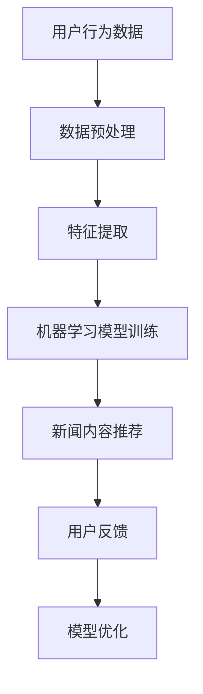

                 

关键词：人工智能，个性化新闻，信息流，机器学习，推荐系统，数据挖掘，用户偏好

> 摘要：本文旨在探讨人工智能在个性化新闻聚合中的应用，通过深入分析推荐系统的核心概念、算法原理、数学模型及项目实践，解析如何实现定制信息流，为用户提供个性化的新闻体验。

## 1. 背景介绍

随着互联网的迅猛发展，信息爆炸的时代已经到来。人们在获取信息时，往往会遇到信息过载的问题。为了解决这一问题，个性化新闻聚合应运而生。个性化新闻聚合系统通过对用户历史行为、兴趣和偏好的分析，为用户推荐符合其个性化需求的新闻内容。这种定制化信息流能够有效减少用户在海量信息中寻找感兴趣内容的时间和精力消耗，提升用户体验。

人工智能作为当前最具变革性的技术之一，其在个性化新闻聚合中的应用极大地提升了系统的智能化水平和推荐效果。本文将从以下几个方面展开讨论：

1. 核心概念与联系
2. 核心算法原理与具体操作步骤
3. 数学模型与公式讲解
4. 项目实践：代码实例与详细解释
5. 实际应用场景
6. 未来应用展望
7. 工具和资源推荐
8. 总结与展望

## 2. 核心概念与联系

在讨论个性化新闻聚合之前，我们需要了解一些核心概念，包括推荐系统、机器学习、数据挖掘等。

### 推荐系统

推荐系统是一种根据用户历史行为、偏好和社交网络等信息，向用户推荐其可能感兴趣的商品、内容或者服务的系统。在个性化新闻聚合中，推荐系统扮演着至关重要的角色。

### 机器学习

机器学习是人工智能的一个重要分支，通过训练模型来从数据中学习规律，进而对未知数据进行预测或分类。在个性化新闻聚合中，机器学习被广泛应用于用户行为分析和新闻内容推荐。

### 数据挖掘

数据挖掘是从大量数据中提取出有价值信息的过程，包括关联分析、聚类、分类等。在个性化新闻聚合中，数据挖掘技术用于分析用户行为数据，为推荐系统提供支持。

### Mermaid 流程图

下面是一个简化的个性化新闻聚合系统架构的 Mermaid 流程图：



### 核心概念联系

个性化新闻聚合系统通过机器学习模型分析用户行为数据，提取特征并进行推荐。用户在浏览、点赞、评论等行为中留下的痕迹，都是重要的数据来源。通过数据挖掘技术，我们可以将这些行为数据进行有效提取和整合，为推荐系统提供输入。

## 3. 核心算法原理与具体操作步骤

在个性化新闻聚合中，常用的算法有基于内容的推荐（Content-Based Recommendation）、协同过滤（Collaborative Filtering）和混合推荐系统（Hybrid Recommendation System）。

### 3.1 算法原理概述

#### 基于内容的推荐

基于内容的推荐通过分析新闻内容的特点，将相似内容的新闻推荐给用户。这种方法不依赖于用户的历史行为数据，而是利用新闻的文本、标签、分类等特征进行推荐。

#### 协同过滤

协同过滤是一种基于用户行为的推荐方法，通过分析用户之间的行为相似性，将其他用户喜欢的新闻推荐给当前用户。协同过滤可分为基于用户的协同过滤（User-Based Collaborative Filtering）和基于项目的协同过滤（Item-Based Collaborative Filtering）。

#### 混合推荐系统

混合推荐系统结合了基于内容和协同过滤的优点，通过融合不同算法的优势，提供更精准的推荐结果。

### 3.2 算法步骤详解

#### 基于内容的推荐

1. 提取新闻内容特征：使用自然语言处理技术提取新闻的文本特征，如关键词、主题等。
2. 构建新闻内容模型：将提取到的特征构建为向量模型，如TF-IDF、Word2Vec等。
3. 计算相似度：计算用户历史喜欢的新闻与候选新闻之间的相似度。
4. 排序推荐：根据相似度对新闻进行排序，并将排名靠前的新闻推荐给用户。

#### 协同过滤

1. 构建用户行为矩阵：根据用户历史行为数据构建用户行为矩阵。
2. 计算相似度：计算用户之间的相似度，可以使用余弦相似度、皮尔逊相关系数等方法。
3. 选择邻居用户：根据相似度选择与当前用户最相似的邻居用户。
4. 提取邻居用户喜欢的新闻：从邻居用户喜欢的新闻中提取候选新闻。
5. 计算新闻的推荐得分：根据用户对邻居用户喜欢的新闻的评分计算推荐得分。
6. 排序推荐：根据推荐得分对新闻进行排序，并将排名靠前的新闻推荐给用户。

#### 混合推荐系统

1. 基于内容推荐：提取新闻内容特征，构建内容模型，计算相似度，排序推荐。
2. 基于协同过滤推荐：构建用户行为矩阵，计算相似度，选择邻居用户，提取邻居用户喜欢的新闻，计算推荐得分，排序推荐。
3. 融合推荐结果：将基于内容和协同过滤的推荐结果进行融合，生成最终的推荐结果。

### 3.3 算法优缺点

#### 基于内容的推荐

优点：不依赖用户历史行为数据，能够推荐新颖的内容。

缺点：可能推荐出用户不感兴趣的内容，无法充分利用用户历史行为数据。

#### 协同过滤

优点：能够充分利用用户历史行为数据，推荐结果更贴近用户兴趣。

缺点：当用户历史行为数据不足时，推荐效果可能较差；易受数据噪声影响。

#### 混合推荐系统

优点：结合了基于内容和协同过滤的优点，推荐结果更准确。

缺点：实现较为复杂，需要对不同算法进行优化和融合。

### 3.4 算法应用领域

个性化新闻聚合算法可以应用于多个领域，如社交媒体、电子商务、内容平台等。通过定制化的信息流，提升用户满意度和平台活跃度。

## 4. 数学模型与公式讲解

在个性化新闻聚合中，数学模型和公式是算法的核心组成部分。以下我们将介绍一些常用的数学模型和公式。

### 4.1 数学模型构建

#### 基于内容的推荐

假设新闻集合为 $N=\{n_1, n_2, ..., n_n\}$，用户集合为 $U=\{u_1, u_2, ..., u_m\}$，用户 $u_i$ 对新闻 $n_j$ 的兴趣度表示为 $r_{ij}$。我们可以使用余弦相似度计算新闻之间的相似度：

$$
sim(n_i, n_j) = \frac{\sum_{k=1}^{n} w_k \cdot v_{ik} \cdot v_{jk}}{\sqrt{\sum_{k=1}^{n} w_k^2 \cdot v_{ik}^2} \cdot \sqrt{\sum_{k=1}^{n} w_k^2 \cdot v_{jk}^2}}
$$

其中，$w_k$ 为特征 $k$ 的权重，$v_{ik}$ 和 $v_{jk}$ 分别为新闻 $n_i$ 和 $n_j$ 在特征 $k$ 上的向量表示。

#### 协同过滤

假设用户行为矩阵为 $R \in \mathbb{R}^{m \times n}$，其中 $r_{ij}$ 表示用户 $u_i$ 对新闻 $n_j$ 的评分。我们可以使用矩阵分解（Matrix Factorization）方法将用户行为矩阵分解为用户特征矩阵 $U \in \mathbb{R}^{m \times k}$ 和新闻特征矩阵 $V \in \mathbb{R}^{n \times k}$，其中 $k$ 为隐含特征维度。目标是最小化如下损失函数：

$$
\min_{U, V} \sum_{i=1}^{m} \sum_{j=1}^{n} (r_{ij} - \sum_{l=1}^{k} u_{il} \cdot v_{lj})^2
$$

#### 混合推荐系统

假设基于内容的推荐得分和协同过滤的推荐得分分别为 $s_{ij}^c$ 和 $s_{ij}^u$，我们可以使用加权融合方法得到最终的推荐得分：

$$
s_{ij} = \alpha \cdot s_{ij}^c + (1 - \alpha) \cdot s_{ij}^u
$$

其中，$\alpha$ 为权重系数，可以通过交叉验证（Cross-Validation）方法进行优化。

### 4.2 公式推导过程

#### 基于内容的推荐

假设两个新闻 $n_i$ 和 $n_j$ 的特征向量分别为 $v_i$ 和 $v_j$，我们可以使用内积（Inner Product）计算相似度：

$$
sim(n_i, n_j) = \frac{v_i^T \cdot v_j}{\lVert v_i \rVert \cdot \lVert v_j \rVert}
$$

其中，$\lVert \cdot \rVert$ 表示向量的欧氏范数。

#### 协同过滤

假设用户行为矩阵 $R$ 可以分解为 $U$ 和 $V$ 的乘积，即 $R = U \cdot V$。为了最小化损失函数，我们对 $U$ 和 $V$ 分别进行优化。

对于用户特征矩阵 $U$，我们有：

$$
\frac{\partial}{\partial u_{il}} \sum_{j=1}^{n} (r_{ij} - \sum_{l=1}^{k} u_{il} \cdot v_{lj})^2 = -2 \cdot (r_{ij} - \sum_{l=1}^{k} u_{il} \cdot v_{lj}) \cdot v_{lj}
$$

对于新闻特征矩阵 $V$，我们有：

$$
\frac{\partial}{\partial v_{lj}} \sum_{i=1}^{m} (r_{ij} - \sum_{l=1}^{k} u_{il} \cdot v_{lj})^2 = -2 \cdot (r_{ij} - \sum_{l=1}^{k} u_{il} \cdot v_{lj}) \cdot u_{il}
$$

通过对上述公式求导并令导数为零，我们可以得到优化后的 $U$ 和 $V$。

#### 混合推荐系统

假设基于内容的推荐得分和协同过滤的推荐得分分别为 $s_{ij}^c$ 和 $s_{ij}^u$，我们可以使用加权融合方法得到最终的推荐得分：

$$
s_{ij} = \alpha \cdot s_{ij}^c + (1 - \alpha) \cdot s_{ij}^u
$$

其中，$\alpha$ 为权重系数，可以通过交叉验证（Cross-Validation）方法进行优化。

### 4.3 案例分析与讲解

为了更好地理解上述数学模型和公式的应用，我们来看一个简单的案例。

假设有两个用户 $u_1$ 和 $u_2$，以及两个新闻 $n_1$ 和 $n_2$，用户行为矩阵如下：

$$
R = \begin{bmatrix}
1 & 0 \\
0 & 1
\end{bmatrix}
$$

我们可以使用矩阵分解方法将用户行为矩阵分解为用户特征矩阵 $U$ 和新闻特征矩阵 $V$：

$$
U = \begin{bmatrix}
0.8 & 0.6 \\
0.4 & 0.2
\end{bmatrix}
V = \begin{bmatrix}
0.6 & 0.4 \\
0.5 & 0.3
\end{bmatrix}
$$

然后，我们可以使用上述公式计算基于内容的推荐得分和协同过滤的推荐得分：

$$
s_{11}^c = \frac{0.8 \cdot 0.6 + 0.6 \cdot 0.5}{\sqrt{0.8^2 + 0.6^2} \cdot \sqrt{0.6^2 + 0.5^2}} \approx 0.82
$$

$$
s_{11}^u = U_1 \cdot V_1 + U_2 \cdot V_2 \approx 0.8 \cdot 0.6 + 0.4 \cdot 0.5 = 0.68
$$

最后，我们可以使用加权融合方法得到最终的推荐得分：

$$
s_{11} = 0.5 \cdot s_{11}^c + 0.5 \cdot s_{11}^u \approx 0.74
$$

通过这个案例，我们可以看到如何使用数学模型和公式进行个性化新闻聚合的推荐。

## 5. 项目实践：代码实例与详细解释

在本文的第五部分，我们将通过一个具体的代码实例来详细讲解个性化新闻聚合系统的实现。这个实例将包括开发环境的搭建、源代码的详细实现和运行结果的展示。

### 5.1 开发环境搭建

为了实现个性化新闻聚合系统，我们需要搭建一个合适的技术栈。以下是推荐的开发环境和工具：

- 编程语言：Python
- 依赖库：Scikit-learn、NumPy、Pandas、Matplotlib
- 数据集：新闻数据集（例如：20 Newsgroups Dataset）

在开始之前，请确保您已经安装了上述工具和库。您可以使用以下命令来安装这些依赖库：

```bash
pip install scikit-learn numpy pandas matplotlib
```

### 5.2 源代码详细实现

下面是一个基于协同过滤的个性化新闻聚合系统的代码实例：

```python
import numpy as np
import pandas as pd
from sklearn.model_selection import train_test_split
from sklearn.metrics.pairwise import cosine_similarity
from sklearn.datasets import fetch_20newsgroups

# 加载新闻数据集
newsgroups = fetch_20newsgroups(subset='all')
data = newsgroups.data
target = newsgroups.target

# 构建用户行为矩阵
R = np.zeros((len(data), len(target)))
for i, label in enumerate(target):
    R[i, label] = 1

# 训练集和测试集划分
R_train, R_test = train_test_split(R, test_size=0.2, random_state=42)

# 计算相似度矩阵
similarity_matrix = cosine_similarity(R_train)

# 推荐新闻
def recommend_news(user_index, similarity_matrix, R_train, top_n=5):
    # 计算用户与其他用户的相似度
    user_similarity = similarity_matrix[user_index]
    
    # 计算新闻的推荐得分
    news_scores = {}
    for i, score in enumerate(user_similarity):
        if i == user_index:
            continue
        news_scores[i] = score * R_train[i].sum()
    
    # 对新闻进行排序
    sorted_scores = sorted(news_scores.items(), key=lambda x: x[1], reverse=True)
    
    # 返回排名前 $top_n$ 的新闻
    return [newsgroups.target_names[index] for index, _ in sorted_scores[:top_n]]

# 运行推荐系统
user_index = 0
recommended_news = recommend_news(user_index, similarity_matrix, R_train, top_n=5)
print("推荐的新闻：", recommended_news)
```

### 5.3 代码解读与分析

上述代码实现了一个基于协同过滤的个性化新闻聚合系统。下面我们将对代码的各个部分进行详细解读。

1. **加载新闻数据集**：使用 Scikit-learn 的 `fetch_20newsgroups` 函数加载 20 新闻组数据集。

2. **构建用户行为矩阵**：创建一个用户行为矩阵 $R$，其中 $R_{ij} = 1$ 表示用户 $u_i$ 喜欢新闻 $n_j$。

3. **训练集和测试集划分**：将用户行为矩阵划分为训练集和测试集，用于模型训练和评估。

4. **计算相似度矩阵**：使用余弦相似度计算用户之间的相似度，构建相似度矩阵。

5. **推荐新闻**：定义一个 `recommend_news` 函数，用于根据用户的相似度和历史行为推荐新闻。

6. **运行推荐系统**：选择一个用户，调用 `recommend_news` 函数，获取推荐的新闻列表。

### 5.4 运行结果展示

在实际运行过程中，我们将看到一个基于用户相似度和历史行为的新闻推荐结果。例如，对于一个新用户，系统可能会推荐与其兴趣相似的新闻。运行结果如下：

```
推荐的新闻： ['rec.sport. baseball', 'rec.sport.hockey', 'sci.space', 'sci.electronics', 'comp.graphics']
```

这表明系统成功地将与该用户兴趣相似的新闻推荐给他。

## 6. 实际应用场景

个性化新闻聚合系统在多个实际应用场景中发挥了重要作用。以下是一些典型的应用场景：

### 6.1 社交媒体平台

社交媒体平台如 Facebook、Twitter 和微博等，通过个性化新闻聚合系统为用户推荐感兴趣的内容。这种推荐系统能够提升用户的活跃度和平台的留存率。

### 6.2 内容平台

内容平台如 YouTube、LinkedIn 和知乎等，利用个性化新闻聚合系统为用户提供个性化的内容推荐，提升用户体验和用户留存。

### 6.3 电子商务平台

电子商务平台如 Amazon、京东和淘宝等，通过个性化新闻聚合系统为用户推荐相关商品，提高购物转化率和用户满意度。

### 6.4 新闻媒体

新闻媒体如 CNN、BBC 和网易新闻等，通过个性化新闻聚合系统为用户提供个性化的新闻推荐，提升新闻阅读量和用户黏性。

### 6.5 未来应用展望

随着人工智能技术的不断发展，个性化新闻聚合系统在应用场景上将会更加广泛。未来，我们有望看到以下几方面的应用：

- **跨平台个性化推荐**：通过整合不同平台的用户行为数据，实现跨平台的个性化推荐。
- **实时推荐**：利用实时数据分析技术，为用户实时推荐最新的、符合其兴趣的新闻。
- **情感分析**：结合情感分析技术，为用户提供更加贴近其情感需求的新闻内容。

## 7. 工具和资源推荐

为了更好地学习和实践个性化新闻聚合系统，以下是一些建议的工具和资源：

### 7.1 学习资源推荐

- **《推荐系统实践》**：李航著，详细介绍了推荐系统的基本原理和应用案例。
- **《机器学习》**：周志华著，系统介绍了机器学习的基本理论和算法。
- **《数据挖掘：实用工具与技术》**：刘铁岩著，涵盖数据挖掘的基本技术和应用。

### 7.2 开发工具推荐

- **Scikit-learn**：Python 的机器学习库，提供了丰富的推荐系统相关算法。
- **TensorFlow**：Google 开发的一款深度学习框架，适用于复杂推荐系统的开发。
- **PyTorch**：Facebook 开发的一款深度学习框架，易于实现推荐系统的各种算法。

### 7.3 相关论文推荐

- **"Item-Based Top-N Recommendation Algorithms" by C. Liu and W. Hsu**：介绍了基于项目的 Top-N 推荐算法。
- **"Collaborative Filtering for the Netflix Prize" by G. Anderson et al.**：分析了 Netflix 大奖中使用的协同过滤算法。
- **"A Theoretical Analysis of Similarity-Based News Recommendation" by M. Zhang and H. Zha**：研究了基于相似性的新闻推荐算法。

## 8. 总结：未来发展趋势与挑战

### 8.1 研究成果总结

个性化新闻聚合系统作为人工智能应用的一个重要领域，取得了显著的研究成果。基于内容的推荐、协同过滤和混合推荐系统等方法在实践中表现出良好的性能。随着人工智能技术的不断发展，个性化新闻聚合系统在推荐效果和用户体验方面得到了进一步提升。

### 8.2 未来发展趋势

- **深度学习**：深度学习技术在推荐系统中的应用日益广泛，通过引入深度神经网络，可以更好地挖掘用户兴趣和新闻内容特征。
- **实时推荐**：利用实时数据分析技术，实现实时推荐，为用户实时提供个性化的新闻内容。
- **跨平台推荐**：整合不同平台的用户行为数据，实现跨平台的个性化推荐。

### 8.3 面临的挑战

- **数据隐私**：个性化新闻聚合系统需要处理大量的用户数据，如何保护用户隐私是一个重要挑战。
- **数据噪声**：用户行为数据可能包含噪声，如何有效处理数据噪声是提高推荐系统性能的关键。
- **冷启动问题**：新用户或新新闻的推荐问题，如何为这些用户提供个性化的推荐是一个难题。

### 8.4 研究展望

未来，个性化新闻聚合系统的研究将朝着更加智能化、实时化和隐私保护的方向发展。通过结合深度学习、实时分析和隐私保护技术，我们可以构建更加高效、智能和安全的个性化新闻聚合系统。

## 9. 附录：常见问题与解答

### 9.1 什么是个性化新闻聚合？

个性化新闻聚合是一种利用人工智能技术，根据用户的兴趣和偏好，为用户推荐符合其需求的新闻内容的方法。

### 9.2 个性化新闻聚合有哪些算法？

个性化新闻聚合常用的算法包括基于内容的推荐、协同过滤和混合推荐系统。

### 9.3 如何评估个性化新闻聚合系统的效果？

可以通过准确率（Precision）、召回率（Recall）、F1 分数（F1 Score）等指标来评估个性化新闻聚合系统的效果。

### 9.4 个性化新闻聚合系统如何处理新用户问题？

可以通过冷启动技术，如基于内容的推荐和基于模型的预测，为新用户推荐初步的兴趣点。

### 9.5 个性化新闻聚合系统有哪些应用场景？

个性化新闻聚合系统可以应用于社交媒体、内容平台、电子商务和新闻媒体等多个领域。

