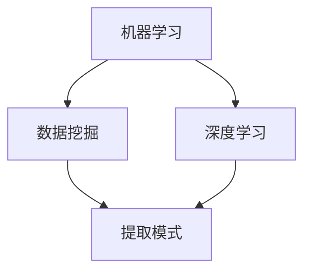

                 

关键词：人工智能、个性化营销、精准客户定位、机器学习、数据挖掘、深度学习

> 摘要：本文将探讨人工智能在个性化营销策略中的应用，特别是精准客户定位的重要性。通过深入分析机器学习、数据挖掘和深度学习等技术在个性化营销中的应用，本文将展示如何利用AI实现更高效、更精准的营销策略。

## 1. 背景介绍

个性化营销是一种以客户为中心的营销策略，旨在通过分析客户数据来提供个性化内容、产品推荐和服务。随着互联网的普及和数据技术的进步，个性化营销已经成为企业提升客户满意度和忠诚度的关键手段。然而，实现有效的个性化营销并非易事，它需要企业拥有强大的数据分析能力和技术手段。

人工智能（AI）技术的发展为个性化营销提供了强大的工具。AI可以通过机器学习、数据挖掘和深度学习等技术，从海量数据中提取有价值的信息，帮助企业和品牌实现精准客户定位。这不仅提高了营销效率，也大大提升了客户体验。

## 2. 核心概念与联系

为了更好地理解AI在个性化营销中的应用，我们需要了解以下几个核心概念：

1. **机器学习**：一种让计算机通过数据学习规律并做出预测的技术。
2. **数据挖掘**：从大量数据中挖掘出有价值信息的过程。
3. **深度学习**：一种基于人工神经网络的机器学习方法，能够通过多层神经网络学习复杂的模式。

这些概念之间有着紧密的联系：

- 机器学习是数据挖掘和深度学习的基础，它提供了从数据中学习的能力。
- 数据挖掘利用机器学习技术从数据中提取模式和信息。
- 深度学习则利用多层神经网络，可以处理更加复杂的任务。

下面是一个使用Mermaid绘制的流程图，展示了这些概念之间的关系：



## 3. 核心算法原理 & 具体操作步骤

### 3.1 算法原理概述

在个性化营销中，常用的核心算法包括：

1. **协同过滤（Collaborative Filtering）**：通过分析用户的行为和偏好，为用户推荐相似的商品或服务。
2. **聚类分析（Clustering Analysis）**：将相似的用户或产品分组，以便更好地理解和满足他们的需求。
3. **分类算法（Classification Algorithms）**：如决策树、随机森林等，用于根据用户特征预测用户的偏好。

### 3.2 算法步骤详解

#### 协同过滤

1. **用户行为数据收集**：收集用户对商品或服务的评分、购买记录等数据。
2. **相似度计算**：计算用户之间的相似度，常用的是余弦相似度。
3. **推荐生成**：根据用户和商品之间的相似度，为用户推荐相似的商品。

#### 聚类分析

1. **数据预处理**：对用户数据（如购买历史、浏览记录等）进行清洗和预处理。
2. **选择聚类算法**：如K-means、DBSCAN等。
3. **聚类结果评估**：使用轮廓系数等方法评估聚类结果的质量。
4. **目标用户定位**：根据聚类结果，为每个用户找到与其最相似的群体。

#### 分类算法

1. **数据集划分**：将数据集划分为训练集和测试集。
2. **特征工程**：提取对分类任务有用的特征。
3. **模型训练**：使用训练集训练分类模型。
4. **模型评估**：使用测试集评估模型性能。

### 3.3 算法优缺点

- **协同过滤**：优点是推荐结果相关性强，但缺点是用户冷启动问题严重。
- **聚类分析**：优点是能够发现潜在的用户群体，但缺点是聚类结果依赖于算法参数。
- **分类算法**：优点是模型可解释性强，但缺点是训练过程可能需要大量时间和计算资源。

### 3.4 算法应用领域

- **电商平台**：通过协同过滤和聚类分析，为用户推荐商品。
- **社交媒体**：通过分类算法，为用户推荐感兴趣的内容。
- **金融服务**：通过分析用户行为数据，为用户提供个性化的金融产品推荐。

## 4. 数学模型和公式 & 详细讲解 & 举例说明

### 4.1 数学模型构建

在个性化营销中，常用的数学模型包括：

- **协同过滤模型**：基于用户-项目矩阵进行建模，常用的算法有矩阵分解、广义线性模型等。
- **聚类分析模型**：如K-means、DBSCAN等，通常使用距离度量进行建模。
- **分类算法模型**：如决策树、支持向量机等，基于特征空间进行建模。

### 4.2 公式推导过程

以K-means算法为例，其目标是最小化每个簇内数据的平方误差。假设我们有n个数据点，每个数据点有m个特征，我们要将数据划分为k个簇。K-means算法的核心公式如下：

$$
E = \sum_{i=1}^{k} \sum_{x \in S_i} ||x - \mu_i||^2
$$

其中，$E$是总的平方误差，$S_i$是第i个簇中的所有数据点，$\mu_i$是第i个簇的中心。

### 4.3 案例分析与讲解

假设我们有一个包含100个用户和10个产品的数据集，我们要使用K-means算法将其划分为5个簇。

1. **初始化**：随机选择5个初始中心点。
2. **分配数据点**：将每个数据点分配到距离它最近的中心点所在的簇。
3. **更新中心点**：计算每个簇的中心点。
4. **重复步骤2和3，直到收敛**。

通过多次迭代，我们最终将数据点划分为5个簇。以下是一个简化的示例：

- 簇1：用户U1、U2、U3、U4
- 簇2：用户U5、U6、U7、U8
- 簇3：用户U9、U10、U11、U12
- 簇4：用户U13、U14、U15、U16
- 簇5：用户U17、U18、U19、U20

通过分析这些簇的特征，我们可以为每个用户群体提供个性化的推荐。

## 5. 项目实践：代码实例和详细解释说明

### 5.1 开发环境搭建

为了进行个性化营销的项目实践，我们首先需要搭建一个开发环境。以下是所需的环境和工具：

- Python 3.8及以上版本
- pandas 1.2.5及以上版本
- numpy 1.21.5及以上版本
- scikit-learn 0.24.2及以上版本
- matplotlib 3.4.3及以上版本

确保安装了上述环境后，我们可以开始编写代码。

### 5.2 源代码详细实现

以下是一个简单的示例，演示如何使用Python实现K-means聚类分析，并进行个性化推荐。

```python
import numpy as np
import pandas as pd
from sklearn.cluster import KMeans
import matplotlib.pyplot as plt

# 加载数据集
data = pd.read_csv('data.csv')
X = data.values[:, :10]  # 假设数据集有10个特征

# 使用KMeans算法进行聚类
kmeans = KMeans(n_clusters=5, random_state=0)
kmeans.fit(X)

# 打印聚类结果
print("聚类中心：", kmeans.cluster_centers_)
print("聚类标签：", kmeans.labels_)

# 绘制聚类结果
plt.scatter(X[:, 0], X[:, 1], c=kmeans.labels_, cmap='viridis')
plt.scatter(kmeans.cluster_centers_[:, 0], kmeans.cluster_centers_[:, 1], s=300, c='red', marker='*')
plt.show()

# 根据用户所属的簇，进行个性化推荐
def recommend_products(user_id, products, clusters):
    user_data = products.iloc[user_id]
    cluster_id = clusters[user_id]
    cluster_products = products[products['cluster_id'] == cluster_id]
    recommended_products = cluster_products.sample(n=3)
    return recommended_products

# 假设我们有一个产品数据集
products = pd.DataFrame({
    'product_id': [1, 2, 3, 4, 5],
    'name': ['Product A', 'Product B', 'Product C', 'Product D', 'Product E'],
    'cluster_id': [0, 1, 2, 3, 4]
})

# 为一个特定的用户推荐产品
user_id = 0
recommended_products = recommend_products(user_id, products, kmeans.labels_)
print("推荐的3个产品：", recommended_products['name'])
```

### 5.3 代码解读与分析

上述代码首先加载数据集，然后使用K-means算法对数据进行聚类。接着，我们绘制了聚类结果，并定义了一个`recommend_products`函数，用于根据用户所属的簇推荐产品。

### 5.4 运行结果展示

运行上述代码后，我们将看到聚类结果图，并根据用户所属的簇推荐了3个相似的产品。

## 6. 实际应用场景

个性化营销在多个行业中得到了广泛应用：

- **电商**：通过用户行为数据，为用户推荐相关的商品。
- **金融**：为用户提供个性化的理财产品推荐。
- **医疗**：通过分析患者数据，提供个性化的健康建议。
- **教育**：根据学生的学习行为，提供个性化的课程推荐。

## 7. 工具和资源推荐

为了更好地进行个性化营销，以下是一些建议的工具和资源：

- **工具**：
  - Google Cloud AI Platform
  - AWS SageMaker
  - Microsoft Azure Machine Learning

- **学习资源**：
  - 《机器学习实战》
  - 《Python机器学习》
  - Coursera上的《机器学习》课程

- **相关论文**：
  - 《推荐系统：协同过滤方法》
  - 《基于深度学习的推荐系统研究》

## 8. 总结：未来发展趋势与挑战

随着人工智能技术的不断发展，个性化营销将在未来继续发挥重要作用。然而，我们也面临着一些挑战：

- **数据隐私**：如何在保护用户隐私的前提下，充分利用用户数据进行个性化推荐。
- **算法透明度**：如何提高算法的可解释性，让用户理解推荐结果。
- **实时性**：如何实现实时性的个性化推荐，以满足用户快速变化的需求。

未来的研究方向包括：

- **联邦学习**：在保障数据隐私的同时，实现跨机构的数据协同。
- **多模态数据融合**：结合文本、图像、音频等多模态数据，提高推荐精度。

## 9. 附录：常见问题与解答

### 问题1：什么是协同过滤？
协同过滤是一种通过分析用户行为和偏好，为用户推荐相似商品或服务的方法。它分为两种类型：基于用户的协同过滤和基于项目的协同过滤。

### 问题2：什么是聚类分析？
聚类分析是一种将数据分组为多个类别的无监督学习方法。常用的聚类算法包括K-means、DBSCAN等。

### 问题3：个性化营销有哪些好处？
个性化营销可以提高客户满意度、提升转化率、降低营销成本，并帮助企业建立更紧密的客户关系。

### 问题4：如何保护用户隐私？
在个性化营销中，可以通过数据脱敏、数据加密、联邦学习等技术来保护用户隐私。

### 问题5：什么是深度学习？
深度学习是一种基于多层人工神经网络的机器学习方法，可以自动提取特征并用于复杂任务的预测和分类。

## 作者署名

作者：禅与计算机程序设计艺术 / Zen and the Art of Computer Programming

