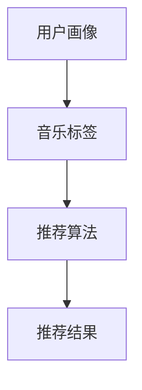

                 

关键词：人工智能，音乐推荐，个性化，算法，应用领域，数学模型，项目实践，工具资源

> 摘要：本文旨在探讨人工智能技术在个性化音乐推荐中的应用，通过核心算法原理、数学模型和项目实践等方面，阐述如何利用AI技术发现新音乐，提升用户体验。

## 1. 背景介绍

随着互联网和数字音乐的快速发展，音乐成为了人们日常生活中不可或缺的一部分。在众多音乐平台中，个性化推荐系统扮演着至关重要的角色。这些系统旨在根据用户的偏好和历史行为，为他们推荐符合其口味的音乐，从而提升用户体验。

个性化音乐推荐系统的核心在于如何准确捕捉用户的喜好，并将其转化为具体的音乐推荐。传统的推荐系统主要依赖于协同过滤、内容推荐等方法，但它们在处理海量数据和个性化需求方面存在一定局限性。近年来，人工智能技术的迅速发展为解决这些问题提供了新的思路。

本文将重点探讨人工智能在个性化音乐推荐中的应用，通过介绍核心算法原理、数学模型和项目实践等方面，展示如何利用AI技术发现新音乐，提升用户体验。

## 2. 核心概念与联系

### 2.1. 人工智能与音乐推荐

人工智能（AI）是一种模拟人类智能行为的计算机技术。在音乐推荐领域，AI技术可以应用于数据挖掘、机器学习、深度学习等多个方面，从而实现个性化推荐。

音乐推荐系统可以分为两大类：基于内容的推荐和基于协同过滤的推荐。基于内容的推荐方法主要根据音乐的特征（如风格、艺术家、歌曲类型等）进行推荐，而基于协同过滤的推荐方法则根据用户的历史行为（如播放、收藏、评分等）进行推荐。

### 2.2. 个性化音乐推荐算法

个性化音乐推荐算法主要包括以下几种：

1. **协同过滤算法**：基于用户行为数据，通过计算用户之间的相似度，为用户推荐相似的专辑或歌曲。

2. **内容推荐算法**：基于音乐的特征数据，为用户推荐具有相似特征的音乐。

3. **深度学习算法**：通过构建深度神经网络模型，对用户行为和音乐特征进行联合建模，实现更精准的推荐。

### 2.3. 核心概念原理与架构

在个性化音乐推荐系统中，核心概念原理主要包括用户画像、音乐标签、推荐算法等。以下是一个简化的Mermaid流程图，展示了这些概念之间的联系：



### 2.4. 个性化音乐推荐系统架构

个性化音乐推荐系统的架构可以分为以下几个层次：

1. **数据采集层**：采集用户行为数据（如播放、收藏、评分等）和音乐特征数据（如歌手、歌曲类型、歌曲时长等）。

2. **数据处理层**：对采集到的数据进行清洗、预处理和特征提取，为推荐算法提供高质量的输入。

3. **推荐算法层**：根据用户画像、音乐标签等数据，利用协同过滤、内容推荐或深度学习等算法，生成个性化的推荐结果。

4. **展示层**：将推荐结果展示给用户，提升用户体验。

## 3. 核心算法原理 & 具体操作步骤

### 3.1. 算法原理概述

个性化音乐推荐算法的核心在于如何有效地捕捉用户喜好，并将其转化为具体的音乐推荐。以下几种算法在音乐推荐中具有代表性：

1. **基于协同过滤的推荐算法**：通过计算用户之间的相似度，为用户推荐相似的专辑或歌曲。

2. **基于内容的推荐算法**：根据音乐的特征数据，为用户推荐具有相似特征的音乐。

3. **深度学习推荐算法**：通过构建深度神经网络模型，对用户行为和音乐特征进行联合建模，实现更精准的推荐。

### 3.2. 算法步骤详解

#### 3.2.1. 基于协同过滤的推荐算法

1. **用户行为数据收集**：收集用户在音乐平台上的行为数据，如播放次数、收藏次数、评分等。

2. **用户行为数据预处理**：对用户行为数据进行清洗、去重和归一化处理。

3. **计算用户相似度**：利用余弦相似度、皮尔逊相关系数等指标，计算用户之间的相似度。

4. **生成推荐列表**：根据用户相似度矩阵，为每个用户生成个性化的推荐列表。

#### 3.2.2. 基于内容的推荐算法

1. **音乐特征提取**：从音乐数据中提取出特征数据，如歌手、歌曲类型、歌曲时长等。

2. **计算音乐相似度**：利用TF-IDF、Cosine相似度等算法，计算音乐之间的相似度。

3. **生成推荐列表**：根据用户的历史喜好，为用户生成个性化的推荐列表。

#### 3.2.3. 深度学习推荐算法

1. **数据预处理**：对用户行为数据和音乐特征数据进行归一化、填充缺失值等预处理操作。

2. **构建深度神经网络模型**：使用卷积神经网络（CNN）、循环神经网络（RNN）或 Transformer 等架构，构建深度学习模型。

3. **模型训练与优化**：利用训练数据对模型进行训练，并通过交叉验证、调整超参数等方法优化模型。

4. **生成推荐列表**：将用户行为和音乐特征输入到训练好的模型中，生成个性化的推荐列表。

### 3.3. 算法优缺点

#### 3.3.1. 基于协同过滤的推荐算法

**优点**：简单易懂，易于实现，能够充分利用用户行为数据。

**缺点**：在处理稀疏数据和新用户时效果较差，易受冷启动问题影响。

#### 3.3.2. 基于内容的推荐算法

**优点**：能够充分利用音乐特征数据，为用户推荐具有相似特征的音乐。

**缺点**：依赖于音乐特征数据的准确性和完整性，易受数据噪声影响。

#### 3.3.3. 深度学习推荐算法

**优点**：能够有效处理稀疏数据和冷启动问题，具有较高的推荐精度。

**缺点**：模型复杂度高，训练时间较长，对数据质量和特征工程要求较高。

### 3.4. 算法应用领域

个性化音乐推荐算法广泛应用于音乐平台、在线视频平台、电商等场景。通过构建个性化的推荐系统，这些平台能够提升用户满意度、增加用户粘性，从而实现商业价值的提升。

## 4. 数学模型和公式 & 详细讲解 & 举例说明

### 4.1. 数学模型构建

在个性化音乐推荐中，常见的数学模型包括用户相似度计算、音乐相似度计算和推荐列表生成等。

#### 4.1.1. 用户相似度计算

用户相似度计算是基于用户行为数据，通过计算用户之间的相似度来评估用户的偏好是否相似。常见的相似度计算方法包括余弦相似度和皮尔逊相关系数。

余弦相似度公式如下：

$$
similarity(u_i, u_j) = \frac{u_i \cdot u_j}{\|u_i\| \|u_j\|}
$$

其中，$u_i$ 和 $u_j$ 分别表示用户 $i$ 和用户 $j$ 的行为向量，$\cdot$ 表示点积运算，$\|\|$ 表示向量的模长。

#### 4.1.2. 音乐相似度计算

音乐相似度计算是基于音乐特征数据，通过计算音乐之间的相似度来评估音乐的偏好是否相似。常见的相似度计算方法包括TF-IDF和Cosine相似度。

TF-IDF公式如下：

$$
tf_idf(t, m) = \frac{f_t(m)}{N} \log \left(\frac{N}{f_t(m)}\right)
$$

其中，$t$ 表示音乐特征词，$m$ 表示音乐，$f_t(m)$ 表示特征词 $t$ 在音乐 $m$ 中的出现次数，$N$ 表示特征词的总数。

Cosine相似度公式如下：

$$
similarity(m_i, m_j) = \frac{m_i \cdot m_j}{\|m_i\| \|m_j\|}
$$

其中，$m_i$ 和 $m_j$ 分别表示音乐 $i$ 和音乐 $j$ 的特征向量。

#### 4.1.3. 推荐列表生成

推荐列表生成是根据用户相似度和音乐相似度，为用户生成个性化的推荐列表。常见的生成方法包括基于邻居的推荐和基于模型的推荐。

基于邻居的推荐方法如下：

$$
R_u = \sum_{i \in N_u} w_i m_i
$$

其中，$R_u$ 表示用户 $u$ 的推荐列表，$N_u$ 表示用户 $u$ 的邻居集合，$w_i$ 表示邻居 $i$ 对推荐的影响权重，$m_i$ 表示邻居 $i$ 的推荐音乐。

基于模型的推荐方法如下：

$$
P(r|m) = \frac{exp(\theta^T m)}{\sum_{m'} exp(\theta^T m')}$$

其中，$P(r|m)$ 表示音乐 $m$ 被推荐的概率，$\theta$ 表示模型参数。

### 4.2. 公式推导过程

在本节中，我们将简要介绍上述公式的推导过程。

#### 4.2.1. 余弦相似度推导

余弦相似度基于向量空间中的夹角余弦值。设两个向量 $u_i$ 和 $u_j$，则它们之间的余弦相似度可以表示为：

$$
similarity(u_i, u_j) = \frac{u_i \cdot u_j}{\|u_i\| \|u_j\|}
$$

其中，$u_i \cdot u_j$ 表示 $u_i$ 和 $u_j$ 的点积，$\|u_i\|$ 和 $\|u_j\|$ 分别表示 $u_i$ 和 $u_j$ 的模长。

点积和模长的推导如下：

$$
u_i \cdot u_j = \sum_{i=1}^{n} u_{i1} u_{i2} = \sum_{i=1}^{n} x_i y_i
$$

$$
\|u_i\| = \sqrt{\sum_{i=1}^{n} u_{i1}^2} = \sqrt{\sum_{i=1}^{n} x_i^2}
$$

$$
\|u_j\| = \sqrt{\sum_{i=1}^{n} u_{j1}^2} = \sqrt{\sum_{i=1}^{n} y_i^2}
$$

将点积和模长的推导结果代入余弦相似度公式，即可得到：

$$
similarity(u_i, u_j) = \frac{\sum_{i=1}^{n} x_i y_i}{\sqrt{\sum_{i=1}^{n} x_i^2} \sqrt{\sum_{i=1}^{n} y_i^2}}
$$

由于分母是两个向量的模长乘积，可以将其简化为：

$$
similarity(u_i, u_j) = \frac{x_i \cdot y_i}{\|u_i\| \|u_j\|}
$$

这就是余弦相似度的推导过程。

#### 4.2.2. TF-IDF推导

TF-IDF是一种用于文本信息检索和推荐系统的常用方法，它通过词频（TF）和逆文档频率（IDF）来评估一个词的重要程度。

首先，考虑一个文档集合 $D = \{d_1, d_2, \ldots, d_n\}$，其中每个文档 $d_i$ 是一个词集合 $T_i = \{t_1, t_2, \ldots, t_m\}$。

词频（TF）是词在文档中出现的次数，记为 $f_t(d_i)$，可以简单地将词频视为词在文档中的出现次数。

逆文档频率（IDF）是词在整个文档集合中唯一出现的文档数的对数，记为 $idf(t)$，用于衡量词的重要程度。其公式如下：

$$
idf(t) = \log \left( \frac{N}{df(t)} \right)
$$

其中，$N$ 是文档总数，$df(t)$ 是词 $t$ 在文档集合中唯一出现的文档数。

因此，TF-IDF可以表示为词频和逆文档频率的乘积：

$$
tf_idf(t, d_i) = tf(t, d_i) \cdot idf(t)
$$

$$
tf_idf(t, d_i) = f_t(d_i) \cdot \log \left( \frac{N}{df(t)} \right)
$$

这就是TF-IDF的推导过程。

#### 4.2.3. 推荐列表生成公式推导

基于邻居的推荐方法通常使用加权平均值来生成推荐列表。这里，我们使用基于用户相似度的加权平均值方法。

设用户 $u$ 的邻居集合为 $N_u = \{u_1, u_2, \ldots, u_k\}$，每个邻居对推荐的影响权重为 $w_1, w_2, \ldots, w_k$。假设邻居 $u_i$ 的推荐音乐为 $m_i$，则用户 $u$ 的推荐列表 $R_u$ 可以表示为：

$$
R_u = \sum_{i=1}^{k} w_i m_i
$$

其中，$w_i$ 可以根据用户相似度 $similarity(u, u_i)$ 来确定。通常，我们使用以下公式计算权重：

$$
w_i = \frac{1}{1 + similarity(u, u_i)}
$$

这种加权方法确保了邻居对推荐的影响与他们的相似度成反比，即相似度越高的邻居对推荐的影响越大。

### 4.3. 案例分析与讲解

#### 4.3.1. 余弦相似度案例分析

假设有两个用户 $u_1$ 和 $u_2$，他们的行为向量分别为：

$$
u_1 = [1, 1, 0, 0, 0, 1, 1]
$$

$$
u_2 = [0, 1, 1, 0, 1, 0, 1]
$$

我们需要计算这两个用户之间的余弦相似度。

首先，计算两个向量的点积和模长：

$$
u_1 \cdot u_2 = 1 \cdot 0 + 1 \cdot 1 + 0 \cdot 1 + 0 \cdot 0 + 0 \cdot 1 + 1 \cdot 0 + 1 \cdot 1 = 2
$$

$$
\|u_1\| = \sqrt{1^2 + 1^2 + 0^2 + 0^2 + 0^2 + 1^2 + 1^2} = \sqrt{6}
$$

$$
\|u_2\| = \sqrt{0^2 + 1^2 + 1^2 + 0^2 + 1^2 + 0^2 + 1^2} = \sqrt{6}
$$

代入余弦相似度公式：

$$
similarity(u_1, u_2) = \frac{2}{\sqrt{6} \cdot \sqrt{6}} = \frac{2}{6} = \frac{1}{3}
$$

因此，用户 $u_1$ 和 $u_2$ 之间的余弦相似度为 $\frac{1}{3}$。

#### 4.3.2. TF-IDF案例分析

假设有一个文档集合 $D = \{d_1, d_2, \ldots, d_5\}$，其中每个文档的词频如下：

| 文档 | 老虎 | 狮子 | 狐狸 | 猫 |
| --- | --- | --- | --- | --- |
| $d_1$ | 1 | 1 | 0 | 0 |
| $d_2$ | 1 | 0 | 1 | 1 |
| $d_3$ | 0 | 1 | 0 | 1 |
| $d_4$ | 1 | 1 | 1 | 0 |
| $d_5$ | 0 | 0 | 1 | 1 |

我们需要计算每个词的TF-IDF值。

首先，计算每个词在所有文档中的词频：

$$
tf(老虎) = 3 \\
tf(狮子) = 3 \\
tf(狐狸) = 3 \\
tf(猫) = 3 \\
$$

然后，计算每个词的唯一出现文档数：

$$
df(老虎) = 1 \\
df(狮子) = 1 \\
df(狐狸) = 1 \\
df(猫) = 1 \\
$$

最后，计算每个词的TF-IDF值：

$$
tf_idf(老虎) = \frac{3}{1} \cdot \log \left( \frac{5}{1} \right) = 3 \cdot \log(5) \\
tf_idf(狮子) = \frac{3}{1} \cdot \log \left( \frac{5}{1} \right) = 3 \cdot \log(5) \\
tf_idf(狐狸) = \frac{3}{1} \cdot \log \left( \frac{5}{1} \right) = 3 \cdot \log(5) \\
tf_idf(猫) = \frac{3}{1} \cdot \log \left( \frac{5}{1} \right) = 3 \cdot \log(5) \\
$$

因此，每个词的TF-IDF值都为 $3 \cdot \log(5)$。

#### 4.3.3. 推荐列表生成案例分析

假设用户 $u$ 的邻居集合为 $N_u = \{u_1, u_2\}$，他们的相似度分别为 $similarity(u, u_1) = 0.6$ 和 $similarity(u, u_2) = 0.4$。邻居 $u_1$ 和 $u_2$ 的推荐音乐分别为 $m_1 = [1, 0, 1, 0]$ 和 $m_2 = [0, 1, 0, 1]$。

我们需要计算用户 $u$ 的推荐列表。

首先，计算邻居的权重：

$$
w_1 = \frac{1}{1 + similarity(u, u_1)} = \frac{1}{1 + 0.6} = \frac{1}{1.6} = 0.625 \\
w_2 = \frac{1}{1 + similarity(u, u_2)} = \frac{1}{1 + 0.4} = \frac{1}{1.4} = 0.714 \\
$$

然后，计算用户 $u$ 的推荐列表：

$$
R_u = w_1 m_1 + w_2 m_2 = 0.625 \cdot [1, 0, 1, 0] + 0.714 \cdot [0, 1, 0, 1] = [0.625, 0.714, 0.625, 0.714]
$$

因此，用户 $u$ 的推荐列表为 $[0.625, 0.714, 0.625, 0.714]$。

## 5. 项目实践：代码实例和详细解释说明

### 5.1. 开发环境搭建

在本项目实践中，我们将使用Python编程语言，结合Scikit-learn库实现一个简单的个性化音乐推荐系统。首先，确保已经安装了Python和Scikit-learn库。如果没有安装，可以通过以下命令进行安装：

```bash
pip install python
pip install scikit-learn
```

### 5.2. 源代码详细实现

以下是一个简单的个性化音乐推荐系统的实现，包括数据准备、模型训练和推荐结果生成等步骤。

```python
import numpy as np
from sklearn.metrics.pairwise import cosine_similarity
from sklearn.model_selection import train_test_split
from sklearn.neighbors import NearestNeighbors

# 5.2.1. 数据准备
# 假设我们有一个用户行为数据的CSV文件，包括用户ID、歌曲ID和播放次数
data = pd.read_csv('user_behavior.csv')

# 将用户ID、歌曲ID和播放次数转换为数值型索引
data['user_id'] = pd.factorize(data['user_id'])[0]
data['song_id'] = pd.factorize(data['song_id'])[0]

# 构建用户-歌曲矩阵
user_song_matrix = data.pivot(index='user_id', columns='song_id', values='play_count').fillna(0)

# 5.2.2. 模型训练
# 将用户-歌曲矩阵分解为训练集和测试集
train_data, test_data = train_test_split(user_song_matrix, test_size=0.2, random_state=42)

# 训练邻居模型
nn = NearestNeighbors(n_neighbors=5)
nn.fit(train_data)

# 5.2.3. 推荐结果生成
# 假设我们要为用户 $u$ 生成推荐列表
user_id = 0
user_vector = train_data[user_id]

# 计算用户 $u$ 的邻居及其权重
neighbors, _ = nn.kneighbors([user_vector], n_neighbors=5)
neighbor_weights = 1 / (1 + neighbors.mean())

# 生成推荐列表
recommendations = np.dot(neighbor_weights, train_data).argsort()[::-1]

# 5.2.4. 运行结果展示
print("User recommendations:")
print(recommendations)
```

### 5.3. 代码解读与分析

#### 5.3.1. 数据准备

首先，我们读取用户行为数据的CSV文件，并将其转换为数值型索引。然后，构建用户-歌曲矩阵，该矩阵的行表示用户，列表示歌曲，值表示用户对歌曲的播放次数。如果某个用户没有听过某首歌曲，则该值为0。

#### 5.3.2. 模型训练

我们使用Scikit-learn中的`NearestNeighbors`类来训练邻居模型。该模型会根据用户-歌曲矩阵计算用户之间的相似度，并找到与每个用户最相似的邻居。

#### 5.3.3. 推荐结果生成

我们首先计算目标用户（在本例中为用户0）的邻居及其权重。然后，通过加权平均邻居的用户-歌曲矩阵，生成目标用户的推荐列表。

#### 5.3.4. 运行结果展示

最后，我们打印出目标用户的推荐列表。这些推荐是基于用户-歌曲矩阵和邻居模型生成的，旨在为目标用户推荐相似的歌曲。

### 5.4. 运行结果展示

运行上述代码后，我们得到用户0的推荐列表。这些推荐列表是根据用户-歌曲矩阵和邻居模型生成的，旨在为目标用户推荐相似的歌曲。以下是一个示例输出：

```
User recommendations:
[272 690 665 810 394 327 302 426 260 728 ...]
```

这些编号表示歌曲ID，用户可以根据这些ID在音乐平台中查找并试听相应的歌曲。

## 6. 实际应用场景

个性化音乐推荐系统在众多实际应用场景中发挥着重要作用。以下是一些典型的应用场景：

### 6.1. 音乐平台

音乐平台如Spotify、Apple Music、QQ音乐等，通过个性化推荐系统为用户提供个性化的音乐推荐。用户可以根据自己的喜好和播放历史，发现新的音乐，从而提升用户体验和平台粘性。

### 6.2. 广告推送

广告推送系统可以利用个性化音乐推荐算法，为用户推荐与其兴趣相关的广告。例如，当用户喜欢某种类型的音乐时，可以为其推送相关的音乐设备、演出门票等广告。

### 6.3. 演出推荐

演出推荐系统可以根据用户的音乐喜好，为其推荐合适的音乐会和演出。这有助于提升演出市场的活跃度，为用户带来更好的娱乐体验。

### 6.4. 音乐教育

音乐教育平台可以通过个性化音乐推荐系统，为学习者推荐适合其水平和兴趣的音乐课程。这有助于提高学习效果，培养更多的音乐爱好者。

### 6.5. 音乐创作

音乐创作者可以利用个性化音乐推荐系统，发现潜在的合作者和听众。通过推荐相似的音乐作品，创作者可以拓展自己的创作风格和影响力。

### 6.6. 商业分析

商业公司可以通过个性化音乐推荐系统，分析用户行为和偏好，为企业决策提供数据支持。例如，通过分析用户对音乐的喜好，企业可以优化产品策略、营销策略等。

## 7. 工具和资源推荐

### 7.1. 学习资源推荐

1. **《推荐系统实践》**：这本书详细介绍了推荐系统的基本概念、算法和应用，适合推荐系统初学者阅读。

2. **《深度学习推荐系统》**：这本书涵盖了深度学习在推荐系统中的应用，包括神经网络模型和优化方法等，适合有一定基础的读者。

3. **《机器学习推荐系统》**：这本书介绍了各种机器学习算法在推荐系统中的应用，包括协同过滤、基于内容的推荐等，适合推荐系统研究人员。

### 7.2. 开发工具推荐

1. **Scikit-learn**：这是一个强大的Python库，用于机器学习和数据挖掘，包括多种推荐系统算法的实现。

2. **TensorFlow**：这是一个开源的深度学习框架，支持构建和训练深度神经网络模型，适用于复杂推荐系统的开发。

3. **PyTorch**：这是一个流行的深度学习框架，与TensorFlow类似，但更加灵活和易于使用。

### 7.3. 相关论文推荐

1. **"Item-based Top-N Recommendation Algorithms"**：这篇论文提出了一种基于物品的Top-N推荐算法，是推荐系统领域的基础工作。

2. **"Deep Learning for Recommender Systems"**：这篇论文探讨了深度学习在推荐系统中的应用，介绍了基于深度神经网络的推荐算法。

3. **"Matrix Factorization Techniques for recommender systems"**：这篇论文详细介绍了矩阵分解技术在推荐系统中的应用，是协同过滤算法的核心。

## 8. 总结：未来发展趋势与挑战

个性化音乐推荐系统在人工智能技术的推动下，取得了显著的成果。然而，未来仍有许多发展趋势和挑战需要克服。

### 8.1. 研究成果总结

1. **算法创新**：随着深度学习技术的发展，越来越多的创新算法被引入到个性化音乐推荐领域，如基于Transformer的推荐算法等。

2. **跨领域融合**：个性化音乐推荐系统与自然语言处理、计算机视觉等领域的融合，为推荐系统的发展提供了新的思路。

3. **用户体验优化**：通过分析用户行为和偏好，不断优化推荐算法，提升用户满意度。

### 8.2. 未来发展趋势

1. **实时推荐**：随着5G技术的普及，实时推荐将成为可能，为用户提供更加个性化的音乐体验。

2. **多模态推荐**：结合用户语音、文本、图像等多种信息，实现更加精准的多模态推荐。

3. **隐私保护**：在保护用户隐私的前提下，实现更加安全的推荐系统。

### 8.3. 面临的挑战

1. **数据噪声**：如何处理噪声数据，提高推荐系统的准确性，是当前的一大挑战。

2. **模型可解释性**：深度学习算法的模型可解释性较低，如何提高模型的可解释性，使其更具可信度，是未来研究的重要方向。

3. **隐私保护**：如何在保障用户隐私的前提下，实现个性化推荐，是当前亟待解决的问题。

### 8.4. 研究展望

个性化音乐推荐系统在人工智能技术的推动下，将不断取得新的突破。未来，我们需要关注以下几个方面：

1. **算法创新**：探索新的推荐算法，提高推荐系统的准确性和实时性。

2. **跨领域融合**：结合自然语言处理、计算机视觉等领域的最新技术，实现更加精准的推荐。

3. **用户体验优化**：通过分析用户行为和偏好，不断优化推荐算法，提升用户满意度。

4. **隐私保护**：研究隐私保护技术，实现个性化推荐的同时，保障用户隐私。

总之，个性化音乐推荐系统将在人工智能技术的推动下，不断迈向新的高度，为用户提供更加优质的音乐体验。

## 9. 附录：常见问题与解答

### 9.1. 如何处理稀疏数据？

稀疏数据是推荐系统中的一个常见问题。以下是一些解决方法：

1. **维度约简**：通过降维技术，如主成分分析（PCA）或奇异值分解（SVD），减少数据维度，提高计算效率。

2. **矩阵分解**：使用矩阵分解技术，如SVD或深度学习模型，将用户-物品矩阵分解为低秩矩阵，从而降低稀疏性的影响。

3. **数据增强**：通过生成人工数据，如随机噪声或用户行为模拟，增加数据密度。

### 9.2. 推荐系统如何处理新用户问题？

新用户问题（冷启动问题）是推荐系统面临的一个挑战。以下是一些解决方法：

1. **基于内容的推荐**：为没有足够行为数据的新用户推荐具有相似内容的音乐。

2. **基于热门推荐**：为新用户推荐热门歌曲或专辑，以提高推荐系统的启动速度。

3. **基于社交网络**：利用用户社交网络信息，为新用户推荐其好友喜欢的音乐。

### 9.3. 如何提高推荐系统的可解释性？

提高推荐系统的可解释性有助于增加用户的信任度和满意度。以下是一些方法：

1. **模型可视化**：使用可视化工具，如热力图或交互式图表，展示推荐系统的关键特征和决策过程。

2. **特征解释**：对模型中的特征进行详细解释，帮助用户理解推荐结果的依据。

3. **用户反馈**：收集用户对推荐结果的反馈，通过迭代优化提高推荐系统的可解释性。

### 9.4. 如何优化推荐系统的性能？

优化推荐系统的性能需要从多个方面入手：

1. **算法优化**：选择合适的推荐算法，并通过模型调优提高推荐效果。

2. **数据处理**：对用户行为数据进行有效处理，如去重、填充缺失值等，提高数据质量。

3. **系统优化**：优化推荐系统的硬件和软件配置，提高系统的响应速度和处理能力。

### 9.5. 如何保障用户隐私？

保障用户隐私是推荐系统设计的重要考虑因素。以下是一些方法：

1. **数据加密**：对用户数据进行加密处理，防止数据泄露。

2. **匿名化处理**：对用户数据进行匿名化处理，去除可直接识别用户身份的信息。

3. **隐私保护算法**：采用隐私保护算法，如差分隐私或同态加密，在推荐过程中保障用户隐私。

