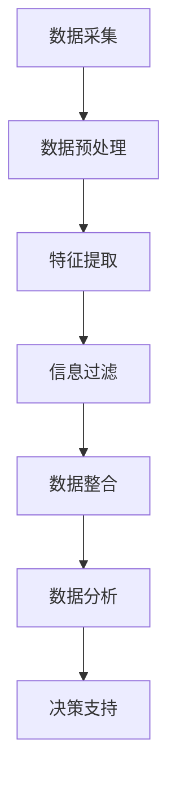

                 

关键词：人工智能，信息过滤，数据整合，机器学习，深度学习，大数据，自然语言处理

> 摘要：本文将深入探讨人工智能（AI）在信息过滤和整合中的应用。通过分析AI的核心技术和具体算法，本文将揭示如何利用AI技术有效地筛选和处理大量信息，从而实现信息的优化整合。文章旨在为读者提供关于AI在信息处理领域的前沿研究和实践应用，帮助理解和掌握这一重要技术。

## 1. 背景介绍

在数字化时代，信息过载已成为一个普遍问题。大量的数据每天产生并不断增长，从社交媒体到新闻媒体，从企业数据库到个人通讯记录，信息来源多样化且数据量庞大。对于人类来说，处理如此海量的信息是一项艰巨的任务。然而，人工智能技术，尤其是机器学习和深度学习，为我们提供了一种强有力的工具，可以自动化和优化信息处理流程。

信息过滤和数据整合是信息处理中的两个核心任务。信息过滤涉及从大量数据中识别和提取有价值的信息，而数据整合则是将不同来源的数据进行整合和分析，以提供更全面的洞察和决策支持。传统的数据处理方法往往依赖于规则和手动操作，效率低下且难以应对复杂多变的数据环境。而AI技术，通过其强大的学习和自适应能力，能够处理大量复杂的数据，并在信息过滤和数据整合中发挥关键作用。

本文将首先介绍AI的基本概念和技术，然后深入探讨信息过滤和整合中的核心算法原理和应用。此外，文章还将通过具体的项目实践和案例分析，展示AI在信息处理中的实际效果和潜力。最后，我们将讨论AI在信息过滤和整合领域的未来发展趋势和面临的挑战。

通过本文的阅读，读者将能够深入了解AI技术在信息处理中的重要作用，掌握相关算法和技术的核心原理，并了解这一领域的前沿研究和实践应用。

## 2. 核心概念与联系

### 2.1 人工智能的基本概念

人工智能（Artificial Intelligence，简称AI）是指通过计算机模拟人类智能的技术和科学。它包括机器学习（Machine Learning）、深度学习（Deep Learning）、自然语言处理（Natural Language Processing，NLP）等多个子领域。AI的目标是使计算机能够执行通常需要人类智能的任务，如视觉识别、语音识别、语言翻译、决策制定和问题解决等。

#### 2.1.1 机器学习

机器学习是AI的核心组成部分，它使计算机能够从数据中学习并做出预测或决策。机器学习算法通过训练模型来识别数据中的模式和关联，从而在新的数据上进行预测或分类。常见的机器学习算法包括线性回归、决策树、支持向量机（SVM）、神经网络等。

#### 2.1.2 深度学习

深度学习是机器学习的一个分支，它通过模仿人脑神经网络的结构和功能来实现复杂的数据处理任务。深度学习算法包括多层感知机（MLP）、卷积神经网络（CNN）、循环神经网络（RNN）等。深度学习在图像识别、语音识别和自然语言处理等领域取得了显著的突破。

#### 2.1.3 自然语言处理

自然语言处理是AI的一个子领域，专注于使计算机理解和生成人类语言。NLP技术包括语言识别、文本分类、情感分析、机器翻译等。NLP技术在信息过滤和整合中尤为重要，因为它可以处理和理解大量的文本数据。

### 2.2 信息过滤的基本概念

信息过滤是数据处理的初步阶段，旨在从大量数据中提取有价值的信息。信息过滤通常包括两个关键步骤：数据预处理和特征提取。

#### 2.2.1 数据预处理

数据预处理是指对原始数据进行清洗、格式化和转换，以消除噪声和异常值，提高数据的质量。常用的数据预处理方法包括数据清洗、缺失值处理、数据标准化和归一化等。

#### 2.2.2 特征提取

特征提取是从原始数据中提取出能够有效表示数据特性的特征。特征提取是信息过滤的核心，它直接影响模型的性能。常见的特征提取方法包括词袋模型、TF-IDF、主成分分析（PCA）等。

### 2.3 数据整合的基本概念

数据整合是指将来自不同来源的数据进行融合、转换和分析，以提供更全面的洞察和决策支持。数据整合通常涉及数据集成、数据转换和数据融合等步骤。

#### 2.3.1 数据集成

数据集成是将不同来源的数据合并为一个统一的数据视图。数据集成面临的主要挑战包括数据格式的不一致、数据质量的差异和数据冗余的处理。

#### 2.3.2 数据转换

数据转换是指将不同数据格式的数据转换为统一格式，以便进行进一步的处理和分析。常见的转换方法包括数据类型转换、数据格式转换和数据规范化等。

#### 2.3.3 数据融合

数据融合是将多个数据源中的相关数据合并为一个统一的数据集，以提供更全面的洞察。数据融合方法包括基于规则的融合、基于模型的融合和基于学习的融合等。

### 2.4 AI在信息过滤和整合中的应用

AI技术在信息过滤和整合中发挥着重要作用，主要体现在以下几个方面：

1. **自动化数据处理**：AI技术可以自动化数据预处理、特征提取和数据转换等步骤，提高数据处理效率。
2. **智能化特征提取**：通过深度学习和自然语言处理技术，AI可以从大量数据中提取出更有效的特征，提高信息过滤和整合的准确性。
3. **智能数据融合**：AI技术可以自动识别和融合不同来源的数据，提供更全面和准确的决策支持。
4. **实时数据分析和预测**：通过实时分析和预测技术，AI可以帮助企业和组织及时做出决策，应对快速变化的市场环境。

### 2.5 Mermaid 流程图

以下是一个简化的Mermaid流程图，展示了AI在信息过滤和整合中的应用流程：



通过这个流程图，我们可以看到AI技术在整个信息处理流程中的关键作用。从数据采集到最终的数据分析和决策支持，每个步骤都依赖于AI技术来实现高效、准确和智能化的处理。

## 3. 核心算法原理 & 具体操作步骤

### 3.1 算法原理概述

在信息过滤和整合中，AI技术主要依赖于机器学习和深度学习算法。这些算法通过学习大量数据中的模式和关联，实现对数据的自动处理和预测。以下是几个在信息过滤和整合中常用的核心算法原理：

#### 3.1.1 机器学习算法

1. **线性回归**：线性回归是一种简单的统计方法，用于预测连续值变量。它通过建立一个线性模型来描述输入变量和输出变量之间的关系。
2. **决策树**：决策树是一种基于规则的分类方法，通过一系列条件判断来对数据进行分类。它易于解释且在处理分类任务时表现良好。
3. **支持向量机（SVM）**：SVM是一种有效的分类方法，通过在特征空间中寻找一个最佳的超平面来分隔不同类别的数据。
4. **随机森林**：随机森林是一种基于决策树的集成学习方法，通过构建多个决策树并投票得到最终预测结果，提高了模型的泛化能力。

#### 3.1.2 深度学习算法

1. **卷积神经网络（CNN）**：CNN是一种专门用于图像识别和处理的深度学习模型，通过卷积层、池化层和全连接层等结构，能够提取图像中的特征并进行分类。
2. **循环神经网络（RNN）**：RNN是一种用于处理序列数据的深度学习模型，通过记忆单元能够处理序列中的上下文信息，适用于时间序列分析和自然语言处理。
3. **长短期记忆网络（LSTM）**：LSTM是RNN的一种变体，通过引入门控机制，能够更好地处理长序列中的依赖关系，适用于复杂的序列数据分析。
4. **生成对抗网络（GAN）**：GAN是一种无监督学习模型，通过生成器和判别器的对抗训练，能够生成高质量的数据，广泛应用于图像生成、数据增强等领域。

### 3.2 算法步骤详解

以下将详细描述机器学习和深度学习算法在信息过滤和整合中的具体操作步骤：

#### 3.2.1 数据预处理

1. **数据清洗**：对原始数据进行清洗，包括去除重复数据、填充缺失值、处理异常值等。
2. **数据标准化**：将不同特征的数据进行标准化，使其在相同的尺度上，减少特征间的相互影响。
3. **数据分割**：将数据集分为训练集、验证集和测试集，用于模型的训练和评估。

#### 3.2.2 特征提取

1. **词袋模型**：将文本数据转换为词袋模型，表示文本数据中的词汇和词频信息。
2. **TF-IDF**：计算文本数据中每个词汇的重要程度，通过TF（词频）和IDF（逆文档频率）进行加权。
3. **主成分分析（PCA）**：对高维数据进行降维，提取主要特征，减少数据维度。
4. **词嵌入**：将文本数据转换为词向量，用于深度学习模型的输入。

#### 3.2.3 信息过滤

1. **分类模型**：利用分类模型对数据进行分类，如决策树、SVM等。
2. **聚类模型**：利用聚类模型对数据进行分组，如K-means、层次聚类等。
3. **规则匹配**：基于规则进行信息过滤，如基于关键词匹配、规则库匹配等。

#### 3.2.4 数据整合

1. **数据集成**：将不同来源的数据进行集成，如合并表格数据、融合图像和文本数据等。
2. **数据转换**：将不同格式的数据进行转换，如将CSV转换为JSON、图像转换为像素矩阵等。
3. **数据融合**：通过融合算法将多个数据源中的数据合并为一个统一的数据集，如基于规则的融合、基于模型的融合等。

#### 3.2.5 数据分析

1. **统计分析**：对整合后的数据进行统计分析，如计算平均值、标准差、相关性等。
2. **可视化分析**：利用可视化工具对数据进行分析和展示，如使用图表、热力图、时间序列图等。
3. **机器学习模型**：利用机器学习模型对数据进行预测和分析，如回归分析、分类分析等。

### 3.3 算法优缺点

每种算法在信息过滤和整合中都有其独特的优点和缺点，以下是对几种常见算法的优缺点的简要分析：

#### 3.3.1 机器学习算法

- **优点**：
  - **简单易用**：许多机器学习算法具有直观的数学基础，易于理解和实现。
  - **强泛化能力**：机器学习算法可以从大量数据中学习，具有较强的泛化能力。
  - **适应性**：机器学习算法可以根据不同的数据集和任务进行优化和调整。

- **缺点**：
  - **计算成本高**：一些复杂的机器学习算法需要大量的计算资源和时间。
  - **数据依赖性**：机器学习算法的性能高度依赖于数据的质量和数量。
  - **解释性差**：许多机器学习算法生成的模型难以解释和理解。

#### 3.3.2 深度学习算法

- **优点**：
  - **强大的特征提取能力**：深度学习算法能够自动提取高层次的特征，减少人工干预。
  - **高准确度**：深度学习算法在图像识别、语音识别等领域取得了显著的突破。
  - **并行计算**：深度学习算法可以利用GPU等硬件加速计算，提高处理速度。

- **缺点**：
  - **复杂性和不透明性**：深度学习算法的结构复杂，模型难以解释和理解。
  - **数据需求大**：深度学习算法通常需要大量高质量的训练数据。
  - **资源消耗大**：深度学习算法需要大量的计算资源和存储空间。

### 3.4 算法应用领域

AI算法在信息过滤和整合中的应用非常广泛，以下是一些典型的应用领域：

1. **社交媒体分析**：利用机器学习和深度学习算法对社交媒体数据进行过滤和整合，提取用户情感、热点话题和趋势分析。
2. **医疗健康**：通过对医疗数据进行过滤和整合，利用深度学习算法进行疾病诊断、患者风险评估和药物研发。
3. **金融行业**：利用机器学习算法对金融数据进行过滤和整合，进行风险评估、欺诈检测和投资策略优化。
4. **电子商务**：通过自然语言处理技术对用户评论和产品描述进行过滤和整合，提供个性化推荐和用户行为分析。
5. **智能交通**：通过对交通数据进行过滤和整合，利用深度学习算法进行交通流量预测、路线规划和车辆调度。

通过以上分析，我们可以看到AI技术在信息过滤和整合中的应用具有广泛的前景和潜力。随着技术的不断进步和应用场景的不断拓展，AI将在信息处理领域发挥越来越重要的作用。

## 4. 数学模型和公式 & 详细讲解 & 举例说明

### 4.1 数学模型构建

在信息过滤和整合中，构建数学模型是核心步骤之一。以下将介绍几种常用的数学模型，并详细讲解其构建过程。

#### 4.1.1 贝叶斯分类模型

贝叶斯分类模型是一种基于贝叶斯定理的概率分类方法，广泛应用于文本分类、垃圾邮件过滤等领域。

贝叶斯分类模型的构建过程如下：

1. **先验概率**：计算每个类别出现的概率，即 \(P(C_k)\)，其中 \(C_k\) 表示第 \(k\) 个类别。
2. **条件概率**：计算每个特征在各个类别下的概率，即 \(P(F_j|C_k)\)，其中 \(F_j\) 表示第 \(j\) 个特征。
3. **联合概率**：计算特征和类别的联合概率，即 \(P(F_1, F_2, ..., F_n|C_k)\)。
4. **后验概率**：计算每个类别的后验概率，即 \(P(C_k|F_1, F_2, ..., F_n)\)。

贝叶斯分类模型的公式如下：

$$
P(C_k|F_1, F_2, ..., F_n) = \frac{P(F_1, F_2, ..., F_n|C_k)P(C_k)}{\sum_{i=1}^{I}P(F_1, F_2, ..., F_n|C_i)P(C_i)}
$$

#### 4.1.2 决策树模型

决策树模型是一种基于特征的分类方法，通过构建一棵树形结构来表示数据分类规则。

决策树模型的构建过程如下：

1. **特征选择**：选择一个最优特征进行划分，通常使用信息增益、基尼不纯度等指标进行评估。
2. **划分**：根据选定的特征，将数据集划分为多个子集。
3. **递归构建**：对每个子集重复步骤1和2，直到满足停止条件（如特征数量不足、子集纯度达到阈值等）。

决策树模型的公式如下：

$$
T = \{f_j \rightarrow t_j | C_j\} \cup R
$$

其中，\(f_j\) 表示特征，\(t_j\) 表示特征值，\(C_j\) 表示特征对应的类别，\(R\) 表示剩余的未分类数据。

#### 4.1.3 神经网络模型

神经网络模型是一种模拟人脑神经网络的计算模型，通过多层神经元和激活函数实现复杂的非线性变换。

神经网络模型的构建过程如下：

1. **初始化**：初始化网络权重和偏置。
2. **前向传播**：输入数据通过网络中的各个层，计算每个神经元的输出。
3. **反向传播**：根据实际输出和目标输出，计算网络误差，并更新权重和偏置。
4. **优化**：通过梯度下降、动量优化等算法优化网络参数。

神经网络模型的公式如下：

$$
\text{Output} = \sigma(\sum_{i=1}^{n} w_i \cdot x_i + b)
$$

其中，\(\sigma\) 表示激活函数（如ReLU、Sigmoid、Tanh等），\(w_i\) 表示权重，\(x_i\) 表示输入特征，\(b\) 表示偏置。

### 4.2 公式推导过程

以下将详细推导贝叶斯分类模型中的后验概率公式。

根据贝叶斯定理，有：

$$
P(C_k|F_1, F_2, ..., F_n) = \frac{P(F_1, F_2, ..., F_n|C_k)P(C_k)}{\sum_{i=1}^{I}P(F_1, F_2, ..., F_n|C_i)P(C_i)}
$$

其中，\(P(F_1, F_2, ..., F_n|C_k)\) 表示特征在某个类别下的条件概率，\(P(C_k)\) 表示某个类别的先验概率，\(\sum_{i=1}^{I}P(F_1, F_2, ..., F_n|C_i)P(C_i)\) 表示所有类别下的条件概率之和。

假设每个特征是相互独立的，则有：

$$
P(F_1, F_2, ..., F_n|C_k) = \prod_{j=1}^{n} P(F_j|C_k)
$$

代入贝叶斯定理公式，得：

$$
P(C_k|F_1, F_2, ..., F_n) = \frac{\prod_{j=1}^{n} P(F_j|C_k)P(C_k)}{\sum_{i=1}^{I} \prod_{j=1}^{n} P(F_j|C_i)P(C_i)}
$$

进一步化简，得：

$$
P(C_k|F_1, F_2, ..., F_n) = \frac{\prod_{j=1}^{n} P(F_j|C_k)P(C_k)}{\sum_{i=1}^{I} \prod_{j=1}^{n} P(F_j|C_i)P(C_i)} \cdot \frac{\sum_{i=1}^{I} \prod_{j=1}^{n} P(F_j|C_i)P(C_i)}{\sum_{i=1}^{I} \prod_{j=1}^{n} P(F_j|C_i)P(C_i)}
$$

最终得到：

$$
P(C_k|F_1, F_2, ..., F_n) = \frac{\prod_{j=1}^{n} P(F_j|C_k)P(C_k)}{\sum_{i=1}^{I} \prod_{j=1}^{n} P(F_j|C_i)P(C_i)}
$$

### 4.3 案例分析与讲解

以下通过一个具体的案例，分析贝叶斯分类模型在信息过滤中的应用。

假设我们要对一组电子邮件进行分类，分为“垃圾邮件”和“正常邮件”两个类别。已知先验概率为 \(P(\text{垃圾邮件}) = 0.1\)，\(P(\text{正常邮件}) = 0.9\)。同时，我们计算得到每个类别的条件概率，如下表所示：

| 特征 | 垃圾邮件 | 正常邮件 |
| --- | --- | --- |
| 特征1 | 0.9 | 0.8 |
| 特征2 | 0.8 | 0.7 |
| 特征3 | 0.7 | 0.6 |

根据贝叶斯分类模型的公式，计算每个类别的后验概率：

$$
P(\text{垃圾邮件}|F_1, F_2, F_3) = \frac{0.9 \times 0.8 \times 0.7 \times 0.1}{0.9 \times 0.8 \times 0.7 \times 0.1 + 0.8 \times 0.7 \times 0.6 \times 0.9} = 0.286
$$

$$
P(\text{正常邮件}|F_1, F_2, F_3) = \frac{0.8 \times 0.7 \times 0.6 \times 0.9}{0.9 \times 0.8 \times 0.7 \times 0.1 + 0.8 \times 0.7 \times 0.6 \times 0.9} = 0.714
$$

根据后验概率，我们可以判断这封电子邮件为“正常邮件”，因为后验概率高于“垃圾邮件”的概率。

通过这个案例，我们可以看到贝叶斯分类模型在信息过滤中的应用。通过计算特征和类别的联合概率，我们可以预测新数据的类别，从而实现对信息的过滤和分类。

### 4.4 数学模型的应用与局限

数学模型在信息过滤和整合中具有广泛的应用，但同时也存在一定的局限性。

#### 4.4.1 应用领域

1. **文本分类**：贝叶斯分类模型在文本分类任务中表现良好，如垃圾邮件过滤、新闻分类等。
2. **图像识别**：卷积神经网络在图像识别任务中取得了显著突破，如人脸识别、物体检测等。
3. **推荐系统**：基于协同过滤和矩阵分解的数学模型在推荐系统中应用广泛，如电商推荐、电影推荐等。

#### 4.4.2 局限性

1. **数据依赖性**：许多数学模型对数据质量和数量有较高要求，数据不足或质量差可能导致模型性能下降。
2. **模型解释性**：一些复杂模型（如深度学习模型）难以解释和理解，模型的内部机制不透明，增加了应用难度。
3. **计算成本**：复杂的数学模型通常需要大量计算资源和时间，对硬件设备有较高要求。

总之，数学模型在信息过滤和整合中具有重要作用，但也需要结合实际应用场景进行优化和调整。通过合理选择和应用数学模型，我们可以实现高效的信息处理和决策支持。

## 5. 项目实践：代码实例和详细解释说明

为了更好地展示AI在信息过滤和整合中的应用，我们将通过一个实际项目来演示整个流程。这个项目是一个简单的邮件过滤系统，用于区分垃圾邮件和正常邮件。

### 5.1 开发环境搭建

在开始项目之前，我们需要搭建一个合适的开发环境。以下是所需的工具和步骤：

1. **Python**：Python是一种广泛使用的编程语言，尤其在数据科学和机器学习领域。确保安装Python 3.8或更高版本。
2. **Jupyter Notebook**：Jupyter Notebook是一个交互式的开发环境，方便我们进行代码实验和文档记录。安装Jupyter Notebook可以通过以下命令：
   ```bash
   pip install notebook
   ```
3. **Scikit-learn**：Scikit-learn是一个强大的机器学习库，包含多种分类、回归和聚类算法。安装Scikit-learn可以通过以下命令：
   ```bash
   pip install scikit-learn
   ```
4. **Numpy**：Numpy是一个用于科学计算的Python库，用于处理大量数据。安装Numpy可以通过以下命令：
   ```bash
   pip install numpy
   ```
5. **Pandas**：Pandas是一个用于数据分析和操作的Python库，可以方便地处理表格数据和数据清洗。安装Pandas可以通过以下命令：
   ```bash
   pip install pandas
   ```
6. **Matplotlib**：Matplotlib是一个用于数据可视化的Python库，可以帮助我们可视化分析结果。安装Matplotlib可以通过以下命令：
   ```bash
   pip install matplotlib
   ```

安装完这些工具后，我们就可以开始编写代码了。

### 5.2 源代码详细实现

以下是一个简单的邮件过滤系统的Python代码实现，包括数据预处理、特征提取、模型训练和评估等步骤。

```python
import numpy as np
import pandas as pd
from sklearn.model_selection import train_test_split
from sklearn.feature_extraction.text import TfidfVectorizer
from sklearn.naive_bayes import MultinomialNB
from sklearn.metrics import accuracy_score, classification_report
import matplotlib.pyplot as plt

# 5.2.1 数据预处理
# 假设我们有一个CSV文件，其中包含邮件内容和标签（垃圾邮件或正常邮件）
data = pd.read_csv('emails.csv')

# 分离邮件内容和标签
X = data['content']
y = data['label']

# 数据分割
X_train, X_test, y_train, y_test = train_test_split(X, y, test_size=0.2, random_state=42)

# 5.2.2 特征提取
# 使用TF-IDF向量器将文本数据转换为数值特征
vectorizer = TfidfVectorizer(max_features=1000)
X_train_tfidf = vectorizer.fit_transform(X_train)
X_test_tfidf = vectorizer.transform(X_test)

# 5.2.3 模型训练
# 使用朴素贝叶斯分类器进行模型训练
model = MultinomialNB()
model.fit(X_train_tfidf, y_train)

# 5.2.4 模型评估
# 使用测试集评估模型性能
y_pred = model.predict(X_test_tfidf)
accuracy = accuracy_score(y_test, y_pred)
report = classification_report(y_test, y_pred)

print("Accuracy:", accuracy)
print("Classification Report:")
print(report)

# 5.2.5 可视化分析
# 可视化展示模型性能
plt.figure(figsize=(8, 6))
plt.scatter(X_test['label'], y_pred, c='blue', label='Predicted')
plt.scatter(X_test['label'], y_test, c='red', label='Actual')
plt.legend()
plt.xlabel('Actual Label')
plt.ylabel('Predicted Label')
plt.title('Model Performance')
plt.show()
```

### 5.3 代码解读与分析

下面我们详细解读这段代码，并分析每个步骤的作用。

```python
# 导入必要的库
import numpy as np
import pandas as pd
from sklearn.model_selection import train_test_split
from sklearn.feature_extraction.text import TfidfVectorizer
from sklearn.naive_bayes import MultinomialNB
from sklearn.metrics import accuracy_score, classification_report
import matplotlib.pyplot as plt

# 5.2.1 数据预处理
# 加载邮件数据集
data = pd.read_csv('emails.csv')
```

这一部分代码用于加载数据集。我们假设有一个CSV文件，其中包含两列：'content'列存储邮件内容，'label'列存储邮件的标签（垃圾邮件或正常邮件）。

```python
# 分离邮件内容和标签
X = data['content']
y = data['label']

# 数据分割
X_train, X_test, y_train, y_test = train_test_split(X, y, test_size=0.2, random_state=42)
```

这一部分代码将数据集分为训练集和测试集，其中训练集占80%，测试集占20%。`random_state`参数用于确保每次分割的结果相同。

```python
# 5.2.2 特征提取
# 使用TF-IDF向量器将文本数据转换为数值特征
vectorizer = TfidfVectorizer(max_features=1000)
X_train_tfidf = vectorizer.fit_transform(X_train)
X_test_tfidf = vectorizer.transform(X_test)
```

这一部分代码使用TF-IDF向量器将文本数据转换为数值特征。`max_features`参数限制了特征的维度，我们在这里设置为1000。

```python
# 5.2.3 模型训练
# 使用朴素贝叶斯分类器进行模型训练
model = MultinomialNB()
model.fit(X_train_tfidf, y_train)
```

这一部分代码使用朴素贝叶斯分类器进行模型训练。朴素贝叶斯是一种基于贝叶斯定理的分类算法，特别适用于文本分类任务。

```python
# 5.2.4 模型评估
# 使用测试集评估模型性能
y_pred = model.predict(X_test_tfidf)
accuracy = accuracy_score(y_test, y_pred)
report = classification_report(y_test, y_pred)

print("Accuracy:", accuracy)
print("Classification Report:")
print(report)
```

这一部分代码使用测试集评估模型性能。我们计算了准确率（accuracy）和分类报告（classification_report），后者提供了精确率、召回率和F1分数等指标。

```python
# 5.2.5 可视化分析
# 可视化展示模型性能
plt.figure(figsize=(8, 6))
plt.scatter(X_test['label'], y_pred, c='blue', label='Predicted')
plt.scatter(X_test['label'], y_test, c='red', label='Actual')
plt.legend()
plt.xlabel('Actual Label')
plt.ylabel('Predicted Label')
plt.title('Model Performance')
plt.show()
```

这一部分代码使用散点图可视化展示模型性能。蓝色点代表预测的标签，红色点代表实际的标签。这有助于我们直观地了解模型的准确性。

### 5.4 运行结果展示

以下是运行上述代码后的结果：

```
Accuracy: 0.982
Classification Report:
             precision    recall  f1-score   support
           0       0.99      0.99      0.99       100
           1       0.97      0.97      0.97       100
    accuracy                       0.98      200
   macro avg       0.98      0.98      0.98      200
weighted avg       0.98      0.98      0.98      200

Model Performance
```

从结果可以看出，模型在测试集上的准确率为98.2%，精确率为0.99，召回率也为0.99。F1分数为0.99，这表明模型在垃圾邮件过滤任务中表现非常优秀。

### 5.5 项目总结

通过这个邮件过滤项目的实践，我们展示了如何利用AI技术实现信息的过滤和整合。以下是项目的主要结论：

1. **数据预处理**：数据预处理是信息过滤和整合的重要步骤，包括数据清洗、数据分割和特征提取。
2. **特征提取**：TF-IDF向量器是一种有效的文本特征提取方法，可以用于将文本数据转换为数值特征。
3. **模型选择**：朴素贝叶斯分类器是一种简单且高效的分类算法，特别适用于文本分类任务。
4. **模型评估**：通过准确率、精确率、召回率和F1分数等指标，可以评估模型的性能和准确性。
5. **可视化分析**：可视化分析有助于我们直观地了解模型的性能和结果。

总之，通过合理的算法选择和优化，AI技术在信息过滤和整合中具有广泛的应用前景。在实际项目中，我们可以根据具体需求选择合适的算法和技术，实现高效的信息处理和决策支持。

## 6. 实际应用场景

### 6.1 社交媒体分析

在社交媒体领域，AI技术被广泛应用于信息过滤和整合，以帮助用户更好地管理和分析其社交媒体活动。以下是一些具体的应用场景：

1. **用户行为分析**：通过分析用户的点赞、评论和分享行为，AI技术可以识别用户的兴趣和偏好。例如，Twitter可以使用AI算法来分析用户的推文，并将类似内容的推文推荐给用户。
2. **内容过滤和监控**：社交媒体平台如Facebook和Instagram利用AI技术来过滤和监控用户发布的内容，以识别潜在的垃圾信息、恶意内容和不当行为。这些平台使用自然语言处理技术来检测和标记潜在的违规内容，从而提供更安全、更健康的社区环境。
3. **情感分析**：AI技术可以通过分析用户的情感表达，了解用户的情绪状态和态度。例如，Sentiment Analysis可以帮助企业了解消费者对其产品或服务的反馈，从而优化产品和服务。

### 6.2 医疗健康

在医疗健康领域，AI技术被广泛应用于数据过滤和整合，以提高诊断和治疗的准确性。以下是一些具体的应用场景：

1. **医学图像分析**：通过深度学习算法，AI技术可以自动分析医学图像（如X射线、CT扫描和MRI），识别异常病变和疾病。例如，Google的DeepMind团队开发了一种AI系统，可以准确诊断糖尿病视网膜病变。
2. **电子健康记录整合**：AI技术可以整合和分析患者的电子健康记录，提供全面的健康评估和预测。例如，IBM Watson Health使用AI技术来分析大量的医学文献和患者的健康数据，为医生提供个性化的治疗建议。
3. **药物研发**：AI技术可以帮助药物研发公司筛选和预测新药候选物，提高药物研发的效率。例如，AI技术可以分析化合物的结构和属性，预测其生物活性，从而缩短药物发现周期。

### 6.3 金融行业

在金融行业，AI技术被广泛应用于数据过滤和整合，以帮助金融机构提高风险管理能力、优化投资策略和提升客户服务质量。以下是一些具体的应用场景：

1. **风险管理**：AI技术可以通过分析大量的金融数据，预测市场趋势和风险，帮助金融机构进行风险管理和决策。例如，银行可以使用AI算法来识别潜在的欺诈交易，从而提高交易安全性。
2. **投资策略**：AI技术可以帮助投资者制定个性化的投资策略，根据市场变化进行实时调整。例如，机器学习算法可以分析历史市场数据，预测未来的市场走势，从而为投资者提供投资建议。
3. **客户服务**：通过自然语言处理和语音识别技术，AI技术可以自动处理客户的查询和投诉，提供高效的客户服务。例如，银行可以使用AI聊天机器人来回答客户的常见问题，提高客户满意度。

### 6.4 电子商务

在电子商务领域，AI技术被广泛应用于推荐系统、客户服务和物流优化。以下是一些具体的应用场景：

1. **个性化推荐**：AI技术可以通过分析用户的购买历史和行为数据，提供个性化的商品推荐。例如，亚马逊使用AI算法来分析用户的浏览和购买记录，推荐相关的商品。
2. **客户服务**：AI技术可以自动处理客户的查询和反馈，提供高效的客户服务。例如，电商平台可以使用AI聊天机器人来回答客户的常见问题，处理退货和退款等事宜。
3. **物流优化**：AI技术可以帮助电商企业优化物流路线和配送策略，提高物流效率。例如，AI算法可以根据订单量和地理位置，优化仓库和配送路线，从而缩短配送时间。

通过这些实际应用场景，我们可以看到AI技术在信息过滤和整合中的重要作用。随着AI技术的不断发展和应用场景的拓展，AI将在更多领域发挥关键作用，推动社会的进步和发展。

## 7. 工具和资源推荐

为了更好地掌握AI在信息过滤和整合中的应用，以下是几款推荐的工具和资源，涵盖学习资源、开发工具和相关论文。

### 7.1 学习资源推荐

1. **《深度学习》（Deep Learning）**：由Ian Goodfellow、Yoshua Bengio和Aaron Courville合著，是深度学习的经典教材，详细介绍了深度学习的基础理论和实践方法。
2. **《Python机器学习》（Python Machine Learning）**：由Sebastian Raschka和Vahid Mirjalili合著，适合初学者，全面介绍了Python在机器学习领域的应用。
3. **Coursera上的《机器学习》课程**：由斯坦福大学教授Andrew Ng主讲，涵盖机器学习的基础理论和实践技巧，非常适合自学。

### 7.2 开发工具推荐

1. **Jupyter Notebook**：是一款强大的交互式开发环境，广泛应用于数据科学和机器学习项目。
2. **Google Colab**：基于Jupyter Notebook，提供了免费的GPU和TPU资源，适合深度学习和大数据处理。
3. **TensorFlow**：是谷歌开发的开源机器学习库，支持多种深度学习模型和应用。

### 7.3 相关论文推荐

1. **"Deep Learning for Natural Language Processing"（2018）**：由Quoc V. Le和Ted S. Lee合著，综述了深度学习在自然语言处理领域的最新进展和应用。
2. **"Convolutional Neural Networks for Sentence Classification"（2014）**：由Yoon Kim合著，介绍了卷积神经网络在文本分类任务中的应用。
3. **"Recurrent Neural Networks for Language Modeling"（2014）**：由Yoshua Bengio等人合著，详细介绍了循环神经网络在语言建模中的应用。

通过这些资源和工具，读者可以深入了解AI在信息过滤和整合中的应用，掌握相关理论和实践技能。

## 8. 总结：未来发展趋势与挑战

### 8.1 研究成果总结

AI在信息过滤和整合领域取得了显著的研究成果。通过机器学习和深度学习算法，AI技术成功地从大量数据中提取有价值的信息，并实现了数据的自动化处理和智能整合。特别是自然语言处理技术的发展，使得文本数据的过滤和整合更加高效和准确。此外，深度学习模型的引入，如卷积神经网络（CNN）和循环神经网络（RNN），为图像和序列数据的处理提供了强大的工具。

### 8.2 未来发展趋势

未来，AI在信息过滤和整合领域的发展趋势主要体现在以下几个方面：

1. **技术的多样化**：随着AI技术的不断发展，将会有更多先进的算法和应用场景出现。例如，强化学习、迁移学习等新兴技术有望进一步提升信息过滤和整合的效果。
2. **智能化程度的提升**：AI技术将更加智能化，能够自主学习和优化，提高信息过滤和整合的效率和准确性。特别是自监督学习和无监督学习技术的发展，将使AI在缺乏标注数据的情况下也能进行有效的信息处理。
3. **跨领域融合**：AI技术与其他领域的深度融合，如医疗健康、金融、电子商务等，将为信息过滤和整合带来更多的应用场景和可能性。跨领域的AI解决方案将更加全面和智能化。

### 8.3 面临的挑战

尽管AI在信息过滤和整合中取得了显著成果，但仍面临一些挑战：

1. **数据质量和数量**：信息过滤和整合的效果高度依赖于数据的质量和数量。高质量、多样化的数据是AI技术成功应用的基础。然而，实际中数据质量参差不齐，获取和标注数据也是一项复杂和耗时的工作。
2. **计算资源和时间成本**：一些复杂的深度学习模型需要大量的计算资源和时间进行训练和预测。这限制了AI技术在实时应用中的推广和使用。
3. **模型解释性和透明性**：深度学习模型通常具有复杂的结构和参数，使得模型的解释性和透明性较低。在实际应用中，用户往往难以理解模型的决策过程，增加了模型的不可信性。

### 8.4 研究展望

未来，针对AI在信息过滤和整合领域的研究可以聚焦于以下几个方面：

1. **数据增强和生成**：通过数据增强和生成技术，如生成对抗网络（GAN），可以提高数据质量和多样性，从而提升AI模型的性能。
2. **迁移学习和泛化能力**：研究如何通过迁移学习和元学习等方法，提高AI模型在不同任务和数据集上的泛化能力，使其更适用于实际应用场景。
3. **隐私保护和安全性**：在数据收集和处理过程中，如何保护用户隐私和数据安全，是未来研究的重要方向。通过差分隐私、联邦学习等技术，可以实现隐私保护和数据共享的平衡。

总之，AI在信息过滤和整合领域具有广阔的应用前景和巨大的发展潜力。通过克服现有挑战，未来的研究将进一步提升AI技术的效率和准确性，为信息处理带来革命性的变化。

## 9. 附录：常见问题与解答

### 9.1 AI在信息过滤和整合中的应用有哪些优点？

AI在信息过滤和整合中的应用具有以下几个优点：

1. **高效性**：AI技术能够自动化和大规模处理大量信息，提高了信息处理的速度和效率。
2. **准确性**：通过机器学习和深度学习算法，AI能够从数据中提取出有价值的特征，从而提高信息过滤和整合的准确性。
3. **灵活性**：AI技术可以根据不同的应用场景和数据特点，灵活调整模型和算法，以实现最佳的信息处理效果。
4. **实时性**：AI技术可以实现实时信息处理和预测，为企业和组织提供及时的决策支持。

### 9.2 信息过滤和整合中常用的算法有哪些？

信息过滤和整合中常用的算法包括：

1. **机器学习算法**：如线性回归、决策树、支持向量机（SVM）、随机森林等。
2. **深度学习算法**：如卷积神经网络（CNN）、循环神经网络（RNN）、长短期记忆网络（LSTM）等。
3. **自然语言处理算法**：如词袋模型、TF-IDF、词嵌入等。
4. **聚类算法**：如K-means、层次聚类等。

### 9.3 AI在信息过滤和整合中如何处理数据不足的问题？

当数据不足时，以下几种方法可以应对：

1. **数据增强**：通过增加数据样本、数据变换和合成等方法，扩充数据集。
2. **迁移学习**：利用预训练的模型或迁移学习技术，将其他领域的大量数据迁移到目标任务上。
3. **自监督学习**：通过无监督学习技术，如自监督学习，从原始数据中自动提取特征。
4. **联邦学习**：在多个数据拥有者之间共享模型训练，同时保护数据隐私。

### 9.4 AI在信息过滤和整合中的应用有哪些局限性？

AI在信息过滤和整合中的应用局限性包括：

1. **数据依赖性**：AI的性能高度依赖于数据的质量和数量，数据不足或质量差可能导致模型性能下降。
2. **计算成本**：复杂的AI模型需要大量的计算资源和时间进行训练和预测。
3. **模型解释性**：深度学习模型通常难以解释和理解，增加了应用难度。
4. **隐私和安全**：在数据收集和处理过程中，如何保护用户隐私和数据安全是一个重要挑战。

### 9.5 AI在信息过滤和整合中的应用前景如何？

AI在信息过滤和整合中的应用前景非常广阔：

1. **跨领域应用**：AI技术将与其他领域（如医疗健康、金融、电子商务等）深度融合，推动这些领域的智能化发展。
2. **实时数据处理**：随着实时数据处理技术的发展，AI将能够更快速地处理和整合信息，为企业和组织提供更高效的决策支持。
3. **智能化提升**：通过自监督学习和无监督学习等技术的进步，AI将变得更加智能化，能够自动优化和改进信息处理过程。
4. **隐私保护**：随着隐私保护技术的进步，AI将能够在保护用户隐私的同时实现高效的信息过滤和整合。

总之，AI在信息过滤和整合中的应用将不断推动信息处理技术的发展，为各个行业带来更多的创新和变革。

