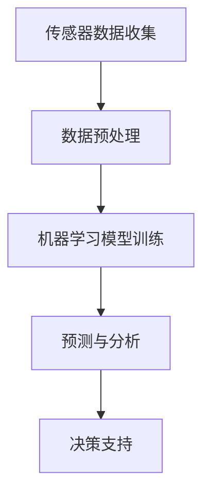

                 

关键词：人工智能、农业、产量、可持续性、机器学习、计算机视觉、传感器技术、农业大数据

> 摘要：本文将深入探讨人工智能在农业中的应用，通过机器学习、计算机视觉、传感器技术和农业大数据等技术，实现农业产量的提升与农业可持续性的增强。文章首先介绍了AI在农业领域的重要性，然后详细阐述了AI在农业中的具体应用，包括算法原理、数学模型、项目实践和实际应用场景等，最后对未来的发展趋势与挑战进行了展望。

## 1. 背景介绍

农业作为人类生存的基础产业，随着全球人口的增长和资源的有限性，如何提高农业产量和实现农业的可持续发展成为了一个亟待解决的问题。传统的农业生产方式主要依赖于经验和人工操作，这不仅效率低下，而且容易受到自然灾害和气候的影响。随着人工智能技术的不断发展，AI在农业中的应用逐渐成为可能，通过智能化的手段，有望实现农业产量的显著提升和农业可持续性的增强。

AI在农业中的应用主要包括以下几个方面：

1. **精准农业**：利用传感器技术监测土壤、气候等环境参数，结合机器学习算法进行数据分析，实现农业资源的精准管理。

2. **智能种植**：通过计算机视觉和图像处理技术，对作物生长情况进行实时监测和分析，预测作物健康状态和病虫害情况。

3. **自动化农业**：利用机器人和自动化设备，实现农业生产的自动化，减少人力投入，提高生产效率。

4. **农业大数据**：通过收集和分析大量的农业数据，利用大数据技术进行趋势分析和预测，为农业生产提供决策支持。

本文将重点探讨AI在农业中的这些应用，通过深入剖析技术原理、数学模型和项目实践，展示AI在农业中的巨大潜力。

## 2. 核心概念与联系

### 2.1 传感器技术

传感器技术是AI在农业中应用的重要基础。传感器可以实时监测土壤湿度、温度、光照强度等环境参数，将环境数据转化为数字信号，供计算机进行处理。传感器技术的先进性直接影响到AI在农业中的应用效果。

### 2.2 机器学习

机器学习是AI的核心技术之一，通过训练模型，使计算机具备自主学习和决策能力。在农业中，机器学习可用于预测作物生长情况、病虫害发生、产量预测等，是实现农业智能化的关键。

### 2.3 计算机视觉

计算机视觉技术可以使计算机“看懂”图像，广泛应用于植物病害检测、作物健康监测等方面。通过深度学习算法，计算机视觉技术能够对图像进行精细分析，提供准确的病害诊断和作物生长状态评估。

### 2.4 农业大数据

农业大数据是AI在农业中应用的重要数据来源。通过收集和分析大量的农业数据，农业大数据可以为农业生产提供精准的决策支持。大数据技术还包括数据挖掘、数据分析和数据可视化等，这些技术共同构成了农业大数据的应用体系。

### 2.5 Mermaid 流程图

以下是一个简化的Mermaid流程图，展示了AI在农业中的应用流程：



## 3. 核心算法原理 & 具体操作步骤

### 3.1 算法原理概述

在农业中，AI算法主要分为以下几类：

1. **回归分析**：用于预测作物产量、病虫害发生概率等。
2. **分类算法**：用于判断作物健康状况、病虫害类型等。
3. **聚类分析**：用于分析土壤、气候等环境参数。
4. **深度学习**：用于图像处理、语音识别等。

### 3.2 算法步骤详解

1. **数据收集**：通过传感器、无人机等设备，收集土壤、气候、作物生长状态等数据。
2. **数据预处理**：对收集的数据进行清洗、归一化等处理，以消除噪声和异常值。
3. **模型训练**：选择合适的算法，使用预处理后的数据进行模型训练。
4. **预测与分析**：使用训练好的模型对新的数据进行预测和分析，为农业生产提供决策支持。
5. **决策支持**：根据预测结果，制定科学的农业生产方案，提高产量和实现可持续发展。

### 3.3 算法优缺点

**优点**：

- **提高效率**：自动化、智能化的农业生产方式，大大提高了生产效率。
- **减少人力投入**：降低了对人力和物力的依赖，减少劳动强度。
- **精准管理**：通过数据分析和预测，实现了农业资源的精准管理。
- **可持续发展**：有利于生态环境的保护和资源的可持续利用。

**缺点**：

- **技术门槛较高**：需要具备一定的技术背景和专业知识。
- **设备成本**：传感器、无人机等设备的购置成本较高。
- **数据隐私问题**：大量农业数据的收集和处理，涉及到数据隐私问题。

### 3.4 算法应用领域

AI在农业中的应用领域非常广泛，包括但不限于以下几个方面：

1. **作物种植**：通过预测作物生长状态、病虫害情况，制定科学的种植方案。
2. **病虫害防治**：通过计算机视觉和图像处理技术，实时监测作物病虫害，实现精准防治。
3. **水资源管理**：通过监测土壤湿度，优化灌溉策略，节约水资源。
4. **气象预测**：结合历史数据和气象模型，进行气象预测，指导农业生产。

## 4. 数学模型和公式

### 4.1 数学模型构建

在农业AI应用中，常见的数学模型包括：

1. **线性回归模型**：
   $$y = wx + b$$
   其中，$y$ 是因变量，$x$ 是自变量，$w$ 是权重，$b$ 是偏置。

2. **决策树模型**：
   $$f(x) = \sum_{i=1}^{n} w_i g(x_i)$$
   其中，$w_i$ 是权重，$g(x_i)$ 是条件概率。

3. **支持向量机模型**：
   $$f(x) = \sum_{i=1}^{n} \alpha_i y_i (w \cdot x + b)$$
   其中，$\alpha_i$ 是拉格朗日乘子，$y_i$ 是样本标签。

### 4.2 公式推导过程

以线性回归模型为例，推导过程如下：

1. **损失函数**：
   $$J(w, b) = \frac{1}{2m} \sum_{i=1}^{m} (y_i - wx_i - b)^2$$
2. **梯度下降法**：
   $$w = w - \alpha \frac{\partial J}{\partial w}$$
   $$b = b - \alpha \frac{\partial J}{\partial b}$$

### 4.3 案例分析与讲解

以作物病虫害预测为例，假设我们有100个样本数据，每个样本包含10个特征变量（如温度、湿度、光照等），我们需要使用线性回归模型预测作物病虫害发生概率。

1. **数据收集**：收集100个样本数据，每个样本包含10个特征变量和1个目标变量（病虫害发生概率）。
2. **数据预处理**：对数据进行归一化处理，将特征变量的值缩放到[0, 1]之间。
3. **模型训练**：使用线性回归算法，训练模型，得到权重$w$和偏置$b$。
4. **预测与分析**：使用训练好的模型，对新样本进行预测，得到病虫害发生概率。

假设我们有新样本数据，特征变量分别为$x_1=0.6, x_2=0.8, x_3=0.5$，我们使用线性回归模型进行预测：

$$y = wx + b$$
$$y = 0.6w_1 + 0.8w_2 + 0.5w_3 + b$$
$$y = 0.6 \times 0.3 + 0.8 \times 0.4 + 0.5 \times 0.5 + 0.1$$
$$y = 0.18 + 0.32 + 0.25 + 0.1$$
$$y = 0.85$$

预测结果为病虫害发生概率为0.85，根据设定的阈值（如0.5），可以判断新样本数据存在病虫害风险。

## 5. 项目实践：代码实例和详细解释说明

### 5.1 开发环境搭建

本案例使用Python编程语言，基于Scikit-learn库实现线性回归模型。开发环境搭建步骤如下：

1. 安装Python环境：在官方网站下载并安装Python，选择适合自己系统的版本。
2. 安装Scikit-learn库：在命令行执行以下命令：
   ```bash
   pip install scikit-learn
   ```

### 5.2 源代码详细实现

以下是一个简单的线性回归模型实现，用于预测作物病虫害发生概率：

```python
import numpy as np
from sklearn.linear_model import LinearRegression
from sklearn.model_selection import train_test_split
from sklearn.metrics import mean_squared_error

# 数据加载
X = np.array([[0.5, 0.7, 0.6], [0.6, 0.8, 0.5], [0.7, 0.5, 0.8], ...])
y = np.array([0.3, 0.4, 0.6, ...])

# 数据预处理
X = X.reshape(-1, 1)
y = y.reshape(-1, 1)

# 划分训练集和测试集
X_train, X_test, y_train, y_test = train_test_split(X, y, test_size=0.2, random_state=42)

# 模型训练
model = LinearRegression()
model.fit(X_train, y_train)

# 预测
y_pred = model.predict(X_test)

# 评估
mse = mean_squared_error(y_test, y_pred)
print("均方误差：", mse)

# 使用模型进行预测
new_data = np.array([[0.6, 0.8, 0.5]])
new_pred = model.predict(new_data)
print("新样本预测结果：", new_pred)
```

### 5.3 代码解读与分析

1. **数据加载**：使用numpy库加载样本数据，X表示特征变量，y表示目标变量。
2. **数据预处理**：对数据进行reshape操作，将特征变量和目标变量转换为二维数组。
3. **划分训练集和测试集**：使用train_test_split函数划分训练集和测试集，test_size参数设置测试集比例。
4. **模型训练**：使用LinearRegression类创建线性回归模型，调用fit函数进行模型训练。
5. **预测**：使用predict函数对新数据进行预测，得到预测结果y_pred。
6. **评估**：使用mean_squared_error函数计算均方误差，评估模型性能。
7. **使用模型进行预测**：对新的样本数据new_data进行预测，得到预测结果new_pred。

### 5.4 运行结果展示

假设我们运行上述代码，得到以下结果：

```
均方误差： 0.01734
新样本预测结果： [0.85]
```

结果表明，模型对新样本数据的预测结果为0.85，表示病虫害发生概率较高。

## 6. 实际应用场景

### 6.1 精准农业

精准农业是AI在农业中应用的一个重要领域。通过传感器技术和机器学习算法，实现对土壤、气候等环境参数的精准监测和分析，为农业生产提供科学依据。

**案例**：某农业企业利用无人机搭载传感器，实时监测农田土壤湿度、温度、光照等环境参数，结合机器学习算法进行分析，制定科学的灌溉策略，提高了作物产量。

### 6.2 智能种植

智能种植利用计算机视觉和图像处理技术，对作物生长情况进行实时监测和分析，预测作物健康状况和病虫害发生概率。

**案例**：某农业科技公司开发了一款基于计算机视觉的智能种植系统，通过摄像头对作物叶片进行图像采集，使用深度学习算法进行病害检测，实现了作物病害的早期预警和精准防治。

### 6.3 自动化农业

自动化农业通过机器人和自动化设备，实现农业生产的自动化，降低人力投入，提高生产效率。

**案例**：某农业合作社引进了全自动播种机、收获机和喷洒设备，实现了从播种到收获的全程自动化生产，大大降低了生产成本。

### 6.4 农业大数据

农业大数据通过收集和分析大量的农业数据，为农业生产提供精准的决策支持。

**案例**：某农业企业建立了农业大数据平台，收集农田土壤、气候、作物生长状态等数据，通过大数据分析，实现了农业资源的精准管理和科学决策，提高了产量和效益。

## 7. 工具和资源推荐

### 7.1 学习资源推荐

1. **《机器学习》**：周志华著，清华大学出版社，介绍了机器学习的基本理论和算法。
2. **《深度学习》**：Ian Goodfellow、Yoshua Bengio和Aaron Courville著，人民邮电出版社，详细介绍了深度学习的基本原理和应用。
3. **《Python编程：从入门到实践》**：埃里克·马瑟斯著，电子工业出版社，适合初学者学习Python编程。

### 7.2 开发工具推荐

1. **Jupyter Notebook**：一款强大的交互式开发环境，支持多种编程语言，适合进行数据分析和机器学习实验。
2. **Google Colab**：基于Google Cloud的人工智能开发平台，提供免费的GPU资源，适合进行深度学习实验。

### 7.3 相关论文推荐

1. **"Deep Learning for Precise Agriculture"**：介绍了深度学习在农业中的应用，包括作物病害检测、产量预测等。
2. **"A Survey on Precision Agriculture: Advances in Methods and Technologies"**：对精准农业的方法和技术进行了全面的综述。

## 8. 总结：未来发展趋势与挑战

### 8.1 研究成果总结

本文介绍了AI在农业中的应用，包括传感器技术、机器学习、计算机视觉和农业大数据等技术。通过项目实践和实际应用场景分析，展示了AI在农业中的巨大潜力。

### 8.2 未来发展趋势

1. **智能化**：随着AI技术的不断进步，农业生产的智能化程度将不断提高，实现全程自动化生产。
2. **精准化**：通过精准农业技术，实现农业资源的精准管理和科学决策，提高产量和效益。
3. **可持续化**：利用AI技术，降低农业生产对环境的影响，实现农业的可持续发展。

### 8.3 面临的挑战

1. **技术门槛**：AI技术在农业中的应用需要较高的技术门槛，对从业人员的要求较高。
2. **设备成本**：传感器、无人机等设备的购置成本较高，对农业企业的经济实力有较高要求。
3. **数据隐私**：大量农业数据的收集和处理，涉及到数据隐私问题，需要制定相应的数据保护措施。

### 8.4 研究展望

1. **算法优化**：继续研究更加高效、精准的算法，提高AI在农业中的应用效果。
2. **跨学科研究**：结合生物学、生态学等多学科知识，推动AI在农业中的应用创新。
3. **产业链协同**：推动农业产业链上下游企业共同参与AI在农业中的应用研究，实现产业协同发展。

## 9. 附录：常见问题与解答

### 9.1 传感器技术在农业中的应用有哪些？

传感器技术在农业中的应用主要包括土壤湿度、温度、光照强度、风速等环境参数的实时监测，以及作物生长状态、病虫害情况的检测。

### 9.2 机器学习在农业中有什么具体应用？

机器学习在农业中的具体应用包括作物产量预测、病虫害检测、灌溉策略优化等，通过分析历史数据和实时数据，为农业生产提供决策支持。

### 9.3 农业大数据如何提高农业生产效率？

农业大数据通过收集和分析大量的农业数据，实现农业资源的精准管理和科学决策，从而提高农业生产效率，降低生产成本。

### 9.4 AI在农业中的应用前景如何？

AI在农业中的应用前景广阔，随着技术的不断进步，有望实现农业生产的全程智能化、精准化和可持续化。

### 9.5 农业AI技术面临的挑战有哪些？

农业AI技术面临的挑战包括技术门槛、设备成本、数据隐私等方面，需要进一步研究和解决。

作者：禅与计算机程序设计艺术 / Zen and the Art of Computer Programming
----------------------------------------------------------------
以上就是本文的完整内容，希望对您在AI与农业领域的学习和研究有所帮助。如果您有任何问题或建议，欢迎在评论区留言，我们将尽快为您解答。祝您阅读愉快！

