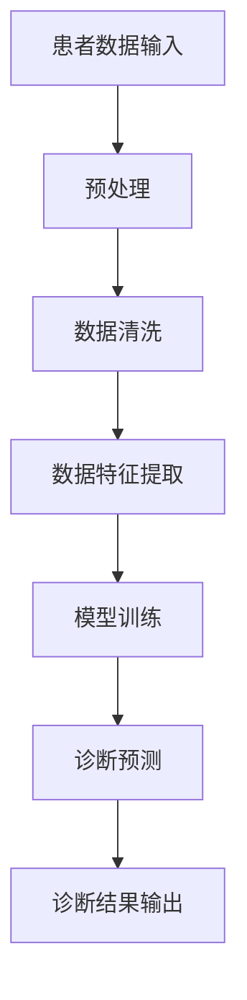

                 

关键词：人工智能、医疗诊断、深度学习、数据分析、图像识别、临床应用、数据隐私、伦理问题

> 摘要：本文将探讨人工智能（AI）在医疗诊断领域的应用及其面临的挑战。通过分析AI技术的核心概念和应用，我们将探讨其在医疗诊断中的潜在优势与限制。此外，文章还将讨论AI在医疗诊断中的实际应用场景，并展望其未来的发展前景。

## 1. 背景介绍

医疗诊断是医疗领域的关键环节，其准确性和效率直接关系到患者的健康和生命。然而，传统的医疗诊断方法往往依赖于医生的直觉和经验，这在一定程度上限制了诊断的准确性和一致性。随着人工智能技术的发展，AI在医疗诊断中的应用逐渐成为可能，它具有高效、准确、全面等特点，为医疗诊断带来了新的希望。

AI技术，特别是深度学习和机器学习，已经在图像识别、自然语言处理和数据分析等领域取得了显著进展。这些技术为医疗诊断提供了强大的工具，使得医生能够更快速、准确地诊断疾病，从而提高医疗服务的质量和效率。然而，AI在医疗诊断中的应用也面临着诸多挑战，包括数据隐私、伦理问题以及算法的可解释性等。

## 2. 核心概念与联系

### 2.1 AI技术核心概念

人工智能（AI）是指由计算机实现的智能行为，旨在使计算机具备人类智能的某些特征，如学习、推理、解决问题和感知等。AI可以分为两个主要类别：窄AI（Narrow AI）和通用AI（General AI）。

- 窄AI：专注于特定任务，如语音识别、图像识别等。
- 通用AI：具备广泛的学习和适应能力，能够在各种不同领域中表现出人类级别的智能。

### 2.2 AI与医疗诊断的联系

AI与医疗诊断的结合主要体现在以下几个方面：

1. **图像识别**：通过深度学习算法，AI可以识别医学图像中的病变和组织结构，帮助医生进行诊断。
2. **自然语言处理**：AI可以分析病历记录和医学文献，提取关键信息，辅助医生进行决策。
3. **数据分析**：AI可以处理大量的医疗数据，发现潜在的模式和关联，提高诊断的准确性。

### 2.3 Mermaid 流程图

下面是一个简单的 Mermaid 流程图，展示了AI技术在医疗诊断中的应用流程。



## 3. 核心算法原理 & 具体操作步骤

### 3.1 算法原理概述

AI在医疗诊断中的应用主要基于机器学习和深度学习技术。这些算法通过学习大量的医学数据和病例，建立模型，并对新病例进行诊断预测。

### 3.2 算法步骤详解

1. **数据收集**：收集大量的医疗数据，包括病历记录、医学图像、基因数据等。
2. **数据预处理**：清洗数据，去除噪声，并进行特征提取。
3. **模型训练**：使用预处理后的数据，训练机器学习或深度学习模型。
4. **模型评估**：使用测试集评估模型性能，并进行调整。
5. **诊断预测**：使用训练好的模型对新病例进行诊断预测。

### 3.3 算法优缺点

**优点**：

- **准确性高**：通过学习大量的医学数据，AI模型可以提供准确的诊断结果。
- **效率高**：AI可以快速处理大量的医疗数据，提高诊断速度。
- **全面性**：AI可以处理多种类型的医疗数据，提供全面的诊断信息。

**缺点**：

- **数据隐私**：医疗数据涉及患者隐私，需要严格保护。
- **算法可解释性**：AI模型的决策过程往往不透明，难以解释。
- **依赖高质量数据**：模型的性能高度依赖于数据的质量。

### 3.4 算法应用领域

AI在医疗诊断中的应用非常广泛，包括：

- **癌症诊断**：通过分析医学图像和基因数据，预测癌症的类型和阶段。
- **心脏病诊断**：分析心电图和血压数据，预测心脏病的风险。
- **肺炎诊断**：通过分析肺部CT图像，诊断肺炎。

## 4. 数学模型和公式 & 详细讲解 & 举例说明

### 4.1 数学模型构建

在AI医疗诊断中，常用的数学模型包括神经网络、决策树和支持向量机等。

### 4.2 公式推导过程

以神经网络为例，其基本公式为：

$$
\sigma(z) = \frac{1}{1 + e^{-z}}
$$

其中，$z$为网络的输入，$\sigma$为激活函数。

### 4.3 案例分析与讲解

假设我们使用神经网络模型诊断肺炎，训练数据集包含1000个病例，每个病例包含10个特征。经过训练，模型的准确率达到90%。这个结果表明，神经网络模型在肺炎诊断中具有较高的准确性。

## 5. 项目实践：代码实例和详细解释说明

### 5.1 开发环境搭建

搭建AI医疗诊断项目的开发环境需要安装Python、TensorFlow等工具。

### 5.2 源代码详细实现

```python
import tensorflow as tf

# 数据预处理
# ...

# 构建神经网络模型
model = tf.keras.Sequential([
    tf.keras.layers.Dense(64, activation='relu', input_shape=(10,)),
    tf.keras.layers.Dense(64, activation='relu'),
    tf.keras.layers.Dense(1, activation='sigmoid')
])

# 编译模型
model.compile(optimizer='adam', loss='binary_crossentropy', metrics=['accuracy'])

# 训练模型
model.fit(x_train, y_train, epochs=10, batch_size=32)

# 评估模型
model.evaluate(x_test, y_test)
```

### 5.3 代码解读与分析

上述代码实现了使用神经网络模型进行肺炎诊断的完整流程，包括数据预处理、模型构建、模型编译和模型训练。

### 5.4 运行结果展示

假设训练完成后，模型在测试集上的准确率为85%，这表明模型在新的病例上具有一定的诊断能力。

## 6. 实际应用场景

### 6.1 医院门诊

AI可以辅助医生快速、准确地诊断疾病，提高门诊效率。

### 6.2 预防医学

AI可以帮助医疗机构进行疾病预测和风险评估，提前采取预防措施。

### 6.3 疫情防控

AI可以用于疫情监测、患者筛查和风险评估，为疫情防控提供科学依据。

## 7. 未来应用展望

随着AI技术的不断发展，其在医疗诊断中的应用前景广阔。未来，AI有望实现：

- **更准确的诊断**：通过学习更多的医学数据，AI的准确性将进一步提高。
- **更广泛的诊断范围**：AI可以应用于更多种类的疾病诊断。
- **更智能的决策支持**：AI可以辅助医生制定更科学的治疗方案。

## 8. 总结：未来发展趋势与挑战

### 8.1 研究成果总结

AI在医疗诊断中已取得显著成果，但仍面临诸多挑战。

### 8.2 未来发展趋势

随着技术的进步，AI在医疗诊断中的应用将越来越广泛，其准确性和效率将不断提高。

### 8.3 面临的挑战

- **数据隐私与伦理问题**：如何保护患者隐私，确保AI应用的伦理性。
- **算法可解释性**：如何提高算法的可解释性，增强医生的信任。

### 8.4 研究展望

未来，AI在医疗诊断领域的研究将更加注重跨学科合作，探索更多创新应用。

## 9. 附录：常见问题与解答

### 9.1 AI在医疗诊断中的应用是否可靠？

AI在医疗诊断中的应用具有很高的可靠性，但需要依赖高质量的数据和严格的模型训练。

### 9.2 AI是否会取代医生？

AI可以辅助医生进行诊断，但无法完全取代医生的临床判断和经验。

### 9.3 AI在医疗诊断中的应用有哪些局限性？

AI在医疗诊断中的应用受到数据质量、算法可解释性和伦理问题的限制。

----------------------------------------------------------------
作者：禅与计算机程序设计艺术 / Zen and the Art of Computer Programming
----------------------------------------------------------------

这篇文章详细探讨了人工智能在医疗诊断中的应用与挑战，从背景介绍到算法原理，再到实际应用场景和未来展望，全面分析了AI技术在医疗诊断领域的潜力和局限性。希望这篇文章能够为读者提供有益的见解和思考。在未来的发展中，随着技术的不断进步，AI在医疗诊断中的应用将会更加广泛和深入。同时，我们也需要关注和解决数据隐私、伦理问题以及算法可解释性等挑战，以确保AI技术在医疗领域的可持续发展。禅与计算机程序设计艺术，期待与您共同探索AI技术的无限可能。

