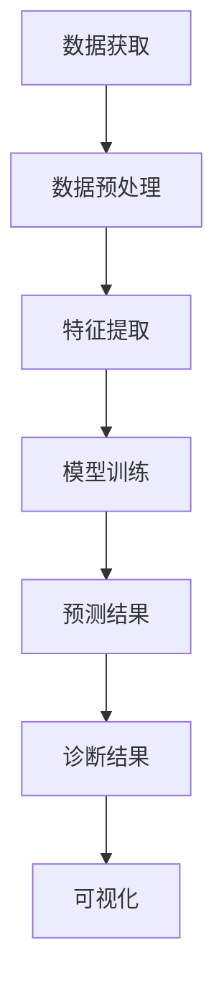

                 

关键词：人工智能、医疗诊断、机器学习、深度学习、数据分析、挑战与展望

> 摘要：本文旨在探讨人工智能在医疗诊断领域的应用现状与面临的挑战，通过详细分析核心算法、数学模型以及实际应用案例，揭示了AI技术在提升医疗诊断效率、精确度和个性化服务方面的潜力，同时也指出了目前面临的诸多问题与未来研究的方向。

## 1. 背景介绍

医疗诊断是现代医疗体系的核心环节之一，其准确性和效率直接影响到患者的治疗和康复。随着人工智能技术的发展，AI技术逐渐在医疗诊断中得到了广泛应用，特别是在影像诊断、病理诊断、疾病预测等方面展现了巨大的潜力。AI通过深度学习、强化学习、自然语言处理等技术手段，能够从海量医疗数据中提取有效信息，辅助医生进行诊断，从而提高诊断的准确性和效率。

本文将围绕以下几个方面展开讨论：

- AI在医疗诊断中的核心算法原理与应用
- 医疗诊断中常用的数学模型及其推导
- AI在医疗诊断中的实际应用案例
- 医疗诊断AI技术的挑战与未来展望

## 2. 核心概念与联系

为了更好地理解AI在医疗诊断中的应用，我们需要首先了解其中的核心概念和技术。

### 2.1 数据获取与预处理

医疗数据来源于各种医疗设备、病历记录、实验室检测结果等。这些数据通常是非结构化的，需要通过数据预处理技术进行清洗、归一化、特征提取等操作，以便后续的分析和建模。

### 2.2 机器学习与深度学习

机器学习是AI技术的基础，它通过构建模型，从数据中学习规律，进行预测和分类。深度学习作为机器学习的一种，通过多层神经网络结构，能够自动学习数据中的复杂模式，是医疗诊断中最常用的算法。

### 2.3 数据分析与可视化

数据分析技术用于从海量医疗数据中提取有用信息，并通过可视化技术将其呈现出来，帮助医生进行诊断。

### 2.4 自然语言处理

自然语言处理技术用于处理和解析病历记录、医学术语等文本数据，辅助医生进行诊断和决策。

### 2.5 Mermaid 流程图

以下是AI在医疗诊断中的一般流程图，使用了Mermaid语法：



## 3. 核心算法原理 & 具体操作步骤

### 3.1 算法原理概述

AI在医疗诊断中的核心算法主要包括机器学习、深度学习、强化学习等。其中，深度学习由于其强大的特征自动提取能力，在图像和文本数据处理方面表现尤为突出。

### 3.2 算法步骤详解

以下是AI在医疗诊断中的具体操作步骤：

1. **数据收集与预处理**：从医疗设备、病历记录等来源收集数据，并进行清洗、归一化和特征提取。
2. **模型选择与训练**：根据诊断任务选择合适的模型，并使用预处理后的数据对其进行训练。
3. **模型评估与优化**：通过交叉验证等方法评估模型的性能，并进行调整和优化。
4. **预测与诊断**：使用训练好的模型对新的病例数据进行预测，生成诊断结果。
5. **结果可视化**：将诊断结果以可视化的形式展示，辅助医生进行诊断。

### 3.3 算法优缺点

**优点**：

- 高效：AI能够处理海量数据，提高诊断效率。
- 精准：通过深度学习等算法，能够提高诊断的准确性。
- 个性化：根据患者数据和病历记录，提供个性化的诊断建议。

**缺点**：

- 数据依赖：算法的性能高度依赖于数据的质量和数量。
- 解释性不足：深度学习模型往往缺乏透明性和可解释性。
- 隐私保护：医疗数据涉及患者隐私，保护数据隐私是重要挑战。

### 3.4 算法应用领域

AI在医疗诊断中的应用领域非常广泛，包括：

- 影像诊断：如胸部X光片、CT扫描、MRI图像等。
- 病理诊断：如癌细胞识别、病理切片分析等。
- 疾病预测：如心脏病、糖尿病、癌症等。
- 药物研发：如药物副作用预测、新药筛选等。

## 4. 数学模型和公式 & 详细讲解 & 举例说明

### 4.1 数学模型构建

在医疗诊断中，常用的数学模型包括逻辑回归、支持向量机、神经网络等。以下以逻辑回归为例进行讲解。

### 4.2 公式推导过程

逻辑回归是一种广义线性模型，用于处理二分类问题。其公式如下：

$$
\hat{y} = \frac{1}{1 + e^{-(\beta_0 + \beta_1x_1 + \beta_2x_2 + \ldots + \beta_nx_n})}
$$

其中，$\hat{y}$ 是预测概率，$x_1, x_2, \ldots, x_n$ 是特征值，$\beta_0, \beta_1, \beta_2, \ldots, \beta_n$ 是模型参数。

### 4.3 案例分析与讲解

假设我们要预测一个患者的癌症类型，使用逻辑回归模型。首先，我们需要收集患者的各种特征数据，如年龄、体重、血压、血液指标等。然后，将这些数据输入逻辑回归模型进行训练。经过训练后，我们得到一组参数$\beta_0, \beta_1, \beta_2, \ldots, \beta_n$。最后，将新的患者数据输入模型，得到预测概率$\hat{y}$。如果$\hat{y}$ 大于某个阈值（如0.5），则预测为癌症，否则预测为非癌症。

## 5. 项目实践：代码实例和详细解释说明

### 5.1 开发环境搭建

首先，我们需要搭建一个Python开发环境，安装必要的库，如NumPy、Scikit-learn、Matplotlib等。

### 5.2 源代码详细实现

以下是使用逻辑回归进行癌症预测的Python代码实例：

```python
import numpy as np
from sklearn.linear_model import LogisticRegression
from sklearn.model_selection import train_test_split
from sklearn.metrics import accuracy_score

# 加载数据
X, y = load_data()

# 数据预处理
X = preprocess_data(X)

# 划分训练集和测试集
X_train, X_test, y_train, y_test = train_test_split(X, y, test_size=0.2, random_state=42)

# 创建逻辑回归模型
model = LogisticRegression()

# 训练模型
model.fit(X_train, y_train)

# 预测测试集
y_pred = model.predict(X_test)

# 评估模型
accuracy = accuracy_score(y_test, y_pred)
print("Accuracy:", accuracy)
```

### 5.3 代码解读与分析

- `load_data()` 函数用于加载数据。
- `preprocess_data()` 函数用于数据预处理，包括数据清洗、归一化等操作。
- `train_test_split()` 函数用于划分训练集和测试集。
- `LogisticRegression()` 函数创建逻辑回归模型。
- `fit()` 函数用于训练模型。
- `predict()` 函数用于预测测试集。
- `accuracy_score()` 函数用于评估模型。

### 5.4 运行结果展示

运行代码后，我们得到模型在测试集上的准确率。根据准确率，我们可以判断模型的性能。

## 6. 实际应用场景

AI在医疗诊断中的实际应用场景非常广泛，以下是一些典型的应用案例：

- **影像诊断**：如乳腺癌、肺癌、脑肿瘤等疾病的自动检测和分类。
- **病理诊断**：如癌症细胞的自动识别和分类。
- **疾病预测**：如心脏病、糖尿病、癌症等疾病的早期预测。
- **药物研发**：如药物副作用预测、新药筛选等。

## 7. 未来应用展望

随着AI技术的不断发展，未来在医疗诊断中的应用前景非常广阔。以下是未来可能的应用方向：

- **个性化医疗**：根据患者的基因、病史等数据，提供个性化的诊断和治疗方案。
- **实时监测**：通过可穿戴设备和传感器，实时监测患者的生理参数，进行疾病预测和预警。
- **智能辅助**：为医生提供智能辅助系统，提高诊断和治疗的效率。

## 8. 工具和资源推荐

### 8.1 学习资源推荐

- 《深度学习》（Goodfellow, Bengio, Courville著）
- 《机器学习》（周志华著）
- 《医疗影像分析与人工智能》（陈力枫著）

### 8.2 开发工具推荐

- Python：适用于数据分析、机器学习和深度学习开发。
- TensorFlow：适用于深度学习模型开发和训练。
- PyTorch：适用于深度学习模型开发和训练。

### 8.3 相关论文推荐

- “Deep Learning in Medical Imaging: A Review”
- “Artificial Intelligence in Radiology”
- “Machine Learning in Healthcare: State of the Art and Opportunities”

## 9. 总结：未来发展趋势与挑战

随着AI技术的不断发展，医疗诊断领域正在发生深刻变革。AI技术能够提高诊断的准确性和效率，提供个性化的医疗服务，为患者带来更好的体验。然而，也面临着数据隐私、算法透明性、模型解释性等挑战。未来，需要进一步研究和发展更加安全、可靠、透明的AI技术，以推动医疗诊断的进步。

### 9.1 研究成果总结

本文总结了AI在医疗诊断中的应用现状、核心算法原理、数学模型构建以及实际应用案例。通过分析，我们认识到AI技术在医疗诊断中的巨大潜力。

### 9.2 未来发展趋势

未来，AI技术在医疗诊断中的应用将更加广泛，包括个性化医疗、实时监测、智能辅助等方面。

### 9.3 面临的挑战

目前，AI技术在医疗诊断中面临的主要挑战包括数据隐私、算法透明性、模型解释性等。

### 9.4 研究展望

未来，需要进一步研究和发展更加安全、可靠、透明的AI技术，以推动医疗诊断的进步。

## 10. 附录：常见问题与解答

### 10.1 Q：AI在医疗诊断中是否完全取代医生？

A：目前，AI在医疗诊断中主要起到辅助作用，帮助医生提高诊断的准确性和效率，但无法完全取代医生的判断和经验。

### 10.2 Q：AI在医疗诊断中的数据隐私如何保障？

A：AI在医疗诊断中涉及大量的患者数据，需要严格遵循数据隐私保护法规，采用加密、去标识化等技术手段保障数据安全。

### 10.3 Q：AI在医疗诊断中的算法透明性如何实现？

A：可以通过模型解释性技术，如LIME、SHAP等，提高AI算法的透明性，帮助医生理解模型的决策过程。

### 10.4 Q：AI在医疗诊断中的模型解释性如何提高？

A：可以通过开发可解释性深度学习模型、可视化技术等手段，提高AI模型的可解释性，帮助医生理解模型的决策过程。

### 10.5 Q：AI在医疗诊断中的适用范围有哪些？

A：AI在医疗诊断中的适用范围非常广泛，包括影像诊断、病理诊断、疾病预测、药物研发等。

### 10.6 Q：AI在医疗诊断中的优势有哪些？

A：AI在医疗诊断中的优势包括提高诊断准确性、提高诊断效率、提供个性化服务、降低医疗成本等。

### 10.7 Q：AI在医疗诊断中的挑战有哪些？

A：AI在医疗诊断中面临的挑战包括数据隐私保护、算法透明性、模型解释性、医疗资源不平衡等。

以上是关于AI在医疗诊断中的应用与挑战的详细讨论，希望对您有所帮助。
作者：禅与计算机程序设计艺术 / Zen and the Art of Computer Programming
----------------------------------------------------------------

请注意，以上内容是一个示例性的文章结构，每个章节的内容需要根据实际研究和资料进行详细的填充和编写。每个章节的子目录（三级目录）也需要具体细化，以符合“约束条件 CONSTRAINTS”中的要求。此外，实际撰写时，需要确保所有引用的数据、算法和模型都是准确的，并且需要遵循学术诚信的原则。如果您需要进一步的具体内容，可以按照这个框架逐一进行研究和撰写。

