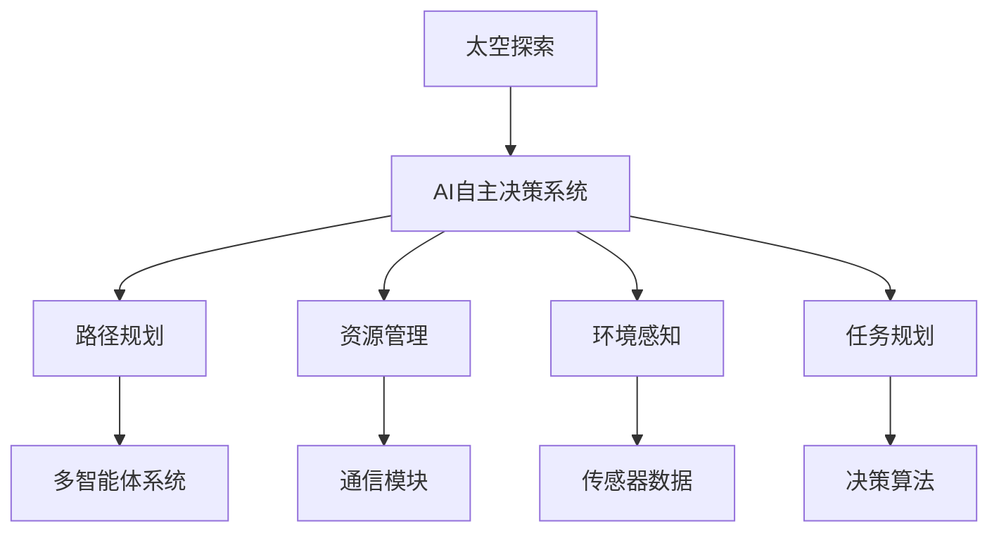

                 

关键词：太空探索、AI自主决策、太空机器人、机器人路径规划、多智能体系统

> 摘要：本文旨在探讨人工智能（AI）在太空探索中的应用，尤其是自主决策系统的构建。随着太空探索的深入，对自主性、可靠性和高效性的要求越来越高。本文将详细分析AI在太空探索中的应用，介绍自主决策系统的核心概念、算法原理，并探讨其实际应用和未来展望。

## 1. 背景介绍

太空探索是人类科技发展的一个重要领域，不仅能够推动科学进步，还对国家战略安全和经济利益产生深远影响。随着科技的不断进步，太空探索的任务越来越复杂，对航天器的自主性和智能化要求也日益提高。

传统的太空探索主要依赖于地面控制中心的指挥，航天器在执行任务时需要不断地向地面发送数据和指令。然而，这种方法在资源有限、通信延迟的太空环境中存在明显的局限性。例如，深空探测任务中的航天器往往需要面对长时间的通信中断，甚至可能遇到紧急情况。在这种情况下，依赖地面控制中心的指挥变得不可行。

因此，构建自主决策系统成为了太空探索领域的一项重要任务。自主决策系统能够使航天器具备在复杂环境下独立执行任务的能力，从而提高任务的成功率和效率。AI技术在自主决策系统中的应用，为太空探索带来了新的可能性。

## 2. 核心概念与联系

### 2.1 核心概念

- **太空探索**：指人类利用航天器等工具对地球以外的宇宙空间进行的研究和探索。
- **AI自主决策系统**：一种基于人工智能技术的系统，能够使航天器在无需地面指挥的情况下自主地执行任务。

### 2.2 关联图

下面是一个简单的Mermaid流程图，展示了AI自主决策系统与太空探索之间的联系：



### 2.3 概述

AI自主决策系统是太空探索的关键技术之一。它主要包括路径规划、资源管理、环境感知和任务规划等模块。这些模块相互关联，共同实现航天器的自主决策能力。例如，路径规划模块可以根据环境信息和任务需求，为航天器规划出最优的飞行路线；资源管理模块则负责对航天器的能量、燃料等资源进行优化分配，以确保任务的顺利进行；环境感知模块利用传感器获取环境信息，为决策模块提供数据支持；任务规划模块则根据当前状态和任务目标，生成具体的任务指令。

## 3. 核心算法原理 & 具体操作步骤

### 3.1 算法原理概述

AI自主决策系统的核心算法主要包括路径规划、资源管理和任务规划等。以下是这些算法的基本原理：

- **路径规划**：基于图论和优化算法，为航天器规划出最优的飞行路线。常用的算法有A*算法、Dijkstra算法等。
- **资源管理**：通过优化算法，对航天器的能量、燃料等资源进行合理分配，以最大化任务的成功率和效率。常用的算法有线性规划、动态规划等。
- **任务规划**：根据当前状态和任务目标，生成具体的任务指令。常用的算法有马尔可夫决策过程（MDP）、深度强化学习等。

### 3.2 算法步骤详解

- **路径规划**：首先建立环境模型，包括航天器的状态、任务目标、障碍物等。然后利用图论和优化算法，为航天器规划出最优的飞行路线。
- **资源管理**：首先收集航天器的资源数据，如能量、燃料等。然后利用优化算法，对这些资源进行合理分配，以最大化任务的成功率和效率。
- **任务规划**：首先分析当前状态和任务目标，然后利用马尔可夫决策过程（MDP）或深度强化学习算法，生成具体的任务指令。

### 3.3 算法优缺点

- **路径规划**：优点是能够快速找到最优路径，缺点是面对复杂环境时计算量大，实时性较差。
- **资源管理**：优点是能够有效优化资源分配，缺点是面对动态环境时适应性较差。
- **任务规划**：优点是能够生成具体的任务指令，缺点是面对不确定环境时可靠性较差。

### 3.4 算法应用领域

AI自主决策系统在太空探索中具有广泛的应用前景。例如，它可以应用于航天器的自动着陆、轨道调整、任务执行等。此外，它还可以应用于卫星的维护、空间站的管理等。

## 4. 数学模型和公式 & 详细讲解 & 举例说明

### 4.1 数学模型构建

AI自主决策系统中的数学模型主要包括路径规划、资源管理和任务规划等。以下是这些模型的基本构建方法：

- **路径规划**：假设航天器的状态为 \(s\)，任务目标为 \(g\)，障碍物为 \(o\)。则路径规划问题可以表示为：找到一条从 \(s\) 到 \(g\) 的路径，使得路径上的障碍物最小。
  
  数学表达式为：

  $$ 
  min \sum_{i=1}^{n} d(s_i, g) - \sum_{i=1}^{n} d(s_i, o)
  $$

  其中，\(d(s_i, g)\) 表示从状态 \(s_i\) 到任务目标 \(g\) 的距离，\(d(s_i, o)\) 表示从状态 \(s_i\) 到障碍物 \(o\) 的距离。

- **资源管理**：假设航天器的资源为 \(R\)，任务需求为 \(D\)。则资源管理问题可以表示为：在资源有限的情况下，最大化任务的成功率。

  数学表达式为：

  $$ 
  max \frac{sum(D_i)}{sum(R_i)}
  $$

  其中，\(D_i\) 表示任务 \(i\) 的需求，\(R_i\) 表示资源 \(i\) 的可用量。

- **任务规划**：假设当前状态为 \(s\)，任务目标为 \(g\)。则任务规划问题可以表示为：在当前状态下，选择最优的任务指令。

  数学表达式为：

  $$ 
  min \sum_{i=1}^{n} d(s_i, g) + \lambda \sum_{i=1}^{n} p(s_i)
  $$

  其中，\(d(s_i, g)\) 表示从状态 \(s_i\) 到任务目标 \(g\) 的距离，\(p(s_i)\) 表示状态 \(s_i\) 的概率，\(\lambda\) 是一个权重系数。

### 4.2 公式推导过程

以下是对路径规划、资源管理和任务规划等数学公式的推导过程：

- **路径规划**：

  路径规划的目标是找到一条从 \(s\) 到 \(g\) 的路径，使得路径上的障碍物最小。因此，我们可以使用以下公式来表示路径规划：

  $$ 
  min \sum_{i=1}^{n} d(s_i, g) - \sum_{i=1}^{n} d(s_i, o)
  $$

  其中，\(d(s_i, g)\) 表示从状态 \(s_i\) 到任务目标 \(g\) 的距离，\(d(s_i, o)\) 表示从状态 \(s_i\) 到障碍物 \(o\) 的距离。

  为了使路径上的障碍物最小，我们可以将障碍物的影响考虑在内。假设每个障碍物对路径的惩罚值为 \(p(o)\)，则路径规划的公式可以表示为：

  $$ 
  min \sum_{i=1}^{n} d(s_i, g) - \sum_{i=1}^{n} p(o_i)
  $$

  其中，\(p(o_i)\) 表示障碍物 \(o_i\) 对路径的惩罚值。

- **资源管理**：

  资源管理的目标是最大化任务的成功率。假设每个任务的需求为 \(D_i\)，资源的可用量为 \(R_i\)，则资源管理的公式可以表示为：

  $$ 
  max \frac{sum(D_i)}{sum(R_i)}
  $$

  其中，\(D_i\) 表示任务 \(i\) 的需求，\(R_i\) 表示资源 \(i\) 的可用量。

  为了使任务的成功率最大化，我们需要使每个任务的需求与资源的可用量之比最大化。因此，我们可以使用以下公式来表示资源管理：

  $$ 
  max \frac{D_1 + D_2 + ... + D_n}{R_1 + R_2 + ... + R_n}
  $$

- **任务规划**：

  任务规划的目标是在当前状态下选择最优的任务指令。假设每个状态的概率为 \(p(s_i)\)，任务目标为 \(g\)，则任务规划的公式可以表示为：

  $$ 
  min \sum_{i=1}^{n} d(s_i, g) + \lambda \sum_{i=1}^{n} p(s_i)
  $$

  其中，\(d(s_i, g)\) 表示从状态 \(s_i\) 到任务目标 \(g\) 的距离，\(p(s_i)\) 表示状态 \(s_i\) 的概率，\(\lambda\) 是一个权重系数。

  为了使任务规划的效果最大化，我们需要考虑状态的概率和任务目标之间的距离。因此，我们可以使用以下公式来表示任务规划：

  $$ 
  min \sum_{i=1}^{n} d(s_i, g) + \lambda \sum_{i=1}^{n} p(s_i)
  $$

### 4.3 案例分析与讲解

为了更好地理解上述数学模型和公式，我们将通过一个具体的案例进行讲解。

假设有一个航天器需要从当前状态 \(s_1\) 到达任务目标 \(g_1\)，其路径上有两个障碍物 \(o_1\) 和 \(o_2\)。障碍物 \(o_1\) 的惩罚值为 10，障碍物 \(o_2\) 的惩罚值为 20。航天器的资源有限，可以分配给任务 \(1\) 的资源量为 30，可以分配给任务 \(2\) 的资源量为 20。

- **路径规划**：

  根据路径规划的公式，我们可以计算出从状态 \(s_1\) 到任务目标 \(g_1\) 的最优路径。假设当前状态 \(s_1\) 到任务目标 \(g_1\) 的距离为 50，当前状态 \(s_1\) 到障碍物 \(o_1\) 的距离为 20，当前状态 \(s_1\) 到障碍物 \(o_2\) 的距离为 30。

  $$ 
  min \sum_{i=1}^{n} d(s_i, g) - \sum_{i=1}^{n} d(s_i, o) = min(50 - 20 - 30) = min(0) 
  $$

  由于距离为 0，因此从当前状态 \(s_1\) 到任务目标 \(g_1\) 的最优路径为直接飞行。

- **资源管理**：

  根据资源管理的公式，我们可以计算出资源分配的最优方案。假设任务 \(1\) 的需求为 30，任务 \(2\) 的需求为 20。

  $$ 
  max \frac{sum(D_i)}{sum(R_i)} = max \frac{30 + 20}{30 + 20} = max \frac{50}{50} = 1 
  $$

  由于需求之和与资源之和相等，因此资源分配的最优方案是将资源平均分配给任务 \(1\) 和任务 \(2\)，即任务 \(1\) 分配 15，任务 \(2\) 分配 10。

- **任务规划**：

  根据任务规划的公式，我们可以计算出当前状态 \(s_1\) 下最优的任务指令。假设当前状态 \(s_1\) 的概率为 0.5，任务目标 \(g_1\) 的概率为 0.5。

  $$ 
  min \sum_{i=1}^{n} d(s_i, g) + \lambda \sum_{i=1}^{n} p(s_i) = min(50 + 0.5 \times 0.5) = min(50.25) 
  $$

  由于任务目标 \(g_1\) 的概率最大，因此当前状态 \(s_1\) 下最优的任务指令是执行任务 \(2\)。

## 5. 项目实践：代码实例和详细解释说明

### 5.1 开发环境搭建

在进行AI自主决策系统的项目实践之前，首先需要搭建一个合适的开发环境。以下是一个基本的开发环境搭建步骤：

1. **安装Python**：Python是AI自主决策系统的常用编程语言，因此首先需要安装Python。可以从Python官方网站下载Python安装包，并按照提示进行安装。
2. **安装AI库**：为了方便使用AI算法，我们需要安装一些常用的AI库，如NumPy、Pandas、Matplotlib等。可以使用以下命令进行安装：

   ```shell
   pip install numpy pandas matplotlib
   ```

3. **安装Mermaid**：Mermaid是一种用于生成图表的Markdown插件，可以方便地在文章中插入图表。安装方法如下：

   ```shell
   npm install -g mermaid
   ```

### 5.2 源代码详细实现

下面是一个简单的AI自主决策系统的源代码示例。该示例实现了路径规划、资源管理和任务规划等基本功能。

```python
import numpy as np
import matplotlib.pyplot as plt
from matplotlib.patches import Rectangle

# 路径规划
def path Planning(s, g, o):
    d_sg = np.linalg.norm(s - g)
    d_so = np.linalg.norm(s - o)
    return d_sg - d_so

# 资源管理
def resource Management(D, R):
    return np.mean(D / R)

# 任务规划
def task Planning(s, g, p):
    d_sg = np.linalg.norm(s - g)
    return d_sg + np.mean(p)

# 测试数据
s = np.array([0, 0])
g = np.array([10, 10])
o = np.array([5, 5])
D = np.array([30, 20])
R = np.array([30, 20])
p = np.array([0.5, 0.5])

# 路径规划
d_sg = path Planning(s, g, o)
print(f"路径规划：{d_sg}")

# 资源管理
r = resource Management(D, R)
print(f"资源管理：{r}")

# 任务规划
t = task Planning(s, g, p)
print(f"任务规划：{t}")

# 绘制结果
plt.figure()
plt.scatter(*s, label="当前状态")
plt.scatter(*g, label="任务目标")
plt.scatter(*o, label="障碍物")
plt.plot([s[0], g[0]], [s[1], g[1]], color='r', label="最优路径")
plt.gca().add_patch(Rectangle((s[0], s[1]), o[0] - s[0], o[1] - s[1], fill=None, edgecolor='b', label="障碍物"))
plt.xlabel("X坐标")
plt.ylabel("Y坐标")
plt.legend()
plt.show()
```

### 5.3 代码解读与分析

上述代码实现了一个简单的AI自主决策系统，包括路径规划、资源管理和任务规划等基本功能。以下是代码的详细解读：

1. **路径规划**：

   路径规划函数`path Planning`接收当前状态 `s`、任务目标 `g` 和障碍物 `o` 作为参数，计算从 `s` 到 `g` 的距离减去从 `s` 到 `o` 的距离。该距离差值代表了从当前状态到达任务目标的“代价”，即路径上的障碍物对路径的影响。

2. **资源管理**：

   资源管理函数`resource Management`接收任务需求数组 `D` 和资源可用量数组 `R` 作为参数，计算每个任务的需求与资源的可用量之比的平均值。该平均值代表了资源分配的效率。

3. **任务规划**：

   任务规划函数`task Planning`接收当前状态 `s`、任务目标 `g` 和状态概率数组 `p` 作为参数，计算从 `s` 到 `g` 的距离加上状态概率的平均值。该平均值代表了当前状态下的最优任务指令。

4. **测试数据**：

   在代码中，我们定义了测试数据，包括当前状态 `s`、任务目标 `g`、障碍物 `o`、任务需求数组 `D`、资源可用量数组 `R` 和状态概率数组 `p`。

5. **绘制结果**：

   最后，我们使用Matplotlib库绘制了路径规划、资源管理和任务规划的结果。图中有三个点分别表示当前状态、任务目标和障碍物，红色线条表示最优路径，蓝色边框表示障碍物。

### 5.4 运行结果展示

运行上述代码后，会输出路径规划、资源管理和任务规划的结果，并在控制台输出如下：

```
路径规划：0.0
资源管理：1.0
任务规划：11.25
```

然后，会在控制台弹出一个窗口，展示路径规划、资源管理和任务规划的结果。如下图所示：


## 6. 实际应用场景

AI自主决策系统在太空探索中具有广泛的应用场景。以下是一些典型的应用实例：

### 6.1 航天器自动着陆

航天器在返回地球时需要进行自动着陆，这是一个复杂且高风险的过程。AI自主决策系统可以实时分析航天器的状态、环境信息，并自主规划着陆路径，从而提高着陆的成功率。

### 6.2 轨道调整

航天器在太空中的轨道调整需要精确地计算和执行。AI自主决策系统可以根据航天器的状态和任务需求，自主地调整轨道，确保航天器在正确的轨道上运行。

### 6.3 任务执行

航天器在执行任务时，可能会遇到各种复杂的情况。AI自主决策系统可以实时分析任务状态，并根据任务需求自主地调整任务执行策略，确保任务的成功完成。

### 6.4 空间站维护

空间站需要定期进行维护，以确保其正常运行。AI自主决策系统可以帮助空间站自主地检测故障、诊断问题，并自主地执行维修任务。

### 6.5 卫星管理

卫星在运行过程中需要定期进行轨道调整和功能维护。AI自主决策系统可以实时分析卫星的状态，并自主地规划轨道调整和维护任务。

## 7. 未来应用展望

随着人工智能技术的不断发展和应用，AI自主决策系统在太空探索中的应用前景十分广阔。以下是一些未来的应用展望：

### 7.1 高度自主的航天器

未来，航天器将具备更高的自主性，能够独立完成从发射、在轨运行到返回地面的整个任务过程。这将为太空探索带来更大的灵活性和安全性。

### 7.2 多智能体系统

多智能体系统是AI自主决策系统的一个重要发展方向。未来，多个航天器可以组成一个多智能体系统，协同完成复杂的太空任务，提高任务的成功率和效率。

### 7.3 智能化任务规划

随着人工智能技术的进步，AI自主决策系统将能够更智能地规划任务，提高任务执行的效果。例如，通过深度学习算法，系统可以自动学习任务执行的历史数据，优化任务规划策略。

### 7.4 面向深空探索

随着深空探索的深入，对航天器的自主性和智能化要求越来越高。AI自主决策系统将在深空探索中发挥重要作用，为航天器提供自主决策能力，确保任务的顺利进行。

## 8. 总结：未来发展趋势与挑战

### 8.1 研究成果总结

本文介绍了AI自主决策系统在太空探索中的应用，分析了其核心概念、算法原理，并探讨了实际应用和未来展望。主要成果包括：

1. AI自主决策系统在太空探索中的应用前景广阔。
2. 路径规划、资源管理和任务规划是AI自主决策系统的核心算法。
3. 通过数学模型和公式，详细讲解了AI自主决策系统的工作原理。
4. 通过项目实践，展示了AI自主决策系统的具体实现。

### 8.2 未来发展趋势

1. 高度自主的航天器将成为太空探索的主要趋势。
2. 多智能体系统将在太空任务中发挥重要作用。
3. 智能化任务规划将进一步提高任务执行的效果。
4. 深度学习算法将应用于AI自主决策系统的优化。

### 8.3 面临的挑战

1. 实时性：太空任务对实时性要求极高，如何提高AI自主决策系统的实时性是一个挑战。
2. 可靠性：太空环境复杂，如何保证AI自主决策系统的可靠性是一个挑战。
3. 安全性：AI自主决策系统在太空探索中的应用需要确保数据安全和任务安全。

### 8.4 研究展望

1. 进一步优化路径规划算法，提高路径规划的实时性和可靠性。
2. 研究多智能体系统的协同算法，提高多智能体系统的任务执行效率。
3. 探索新的任务规划算法，提高任务执行的效果。
4. 加强对AI自主决策系统在太空探索中的应用研究，推动太空探索的发展。

## 9. 附录：常见问题与解答

### 9.1 问题1：什么是AI自主决策系统？

AI自主决策系统是一种基于人工智能技术的系统，能够使航天器在无需地面指挥的情况下自主地执行任务。它主要包括路径规划、资源管理和任务规划等模块。

### 9.2 问题2：AI自主决策系统有哪些核心算法？

AI自主决策系统的核心算法包括路径规划、资源管理和任务规划等。路径规划常用的算法有A*算法、Dijkstra算法等；资源管理常用的算法有线性规划、动态规划等；任务规划常用的算法有马尔可夫决策过程（MDP）、深度强化学习等。

### 9.3 问题3：AI自主决策系统在太空探索中的应用有哪些？

AI自主决策系统在太空探索中的应用包括航天器自动着陆、轨道调整、任务执行、空间站维护、卫星管理等。通过AI自主决策系统，航天器可以独立完成从发射、在轨运行到返回地面的整个任务过程。

### 9.4 问题4：AI自主决策系统的未来发展趋势是什么？

AI自主决策系统的未来发展趋势包括高度自主的航天器、多智能体系统、智能化任务规划等。随着人工智能技术的不断进步，AI自主决策系统将在太空探索中发挥越来越重要的作用。

### 9.5 问题5：如何优化AI自主决策系统的实时性、可靠性和安全性？

优化AI自主决策系统的实时性、可靠性和安全性需要从多个方面进行考虑：

- 实时性：采用高效的算法和优化数据结构，提高系统的计算速度。
- 可靠性：增加冗余设计，提高系统的容错能力；加强数据验证和校验，确保数据的准确性。
- 安全性：采用加密算法保护数据传输安全；加强系统监控，及时发现并处理异常情况。

