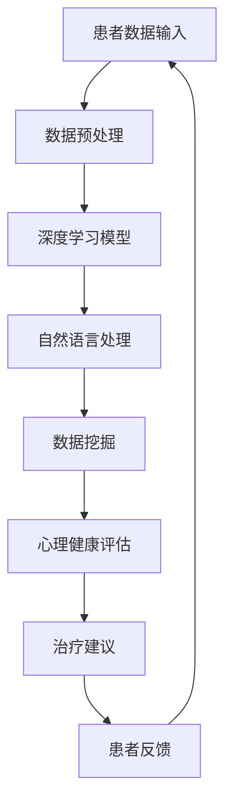

                 

关键词：人工智能，心理健康，早期诊断，治疗，深度学习，自然语言处理

> 摘要：本文探讨了人工智能在心理健康领域的应用，特别是在早期诊断和治疗方面的作用。通过深入分析现有的研究成果和技术发展，本文提出了几种有效的AI方法，并展望了未来心理健康领域的AI应用前景。

## 1. 背景介绍

心理健康问题已经成为全球关注的重大公共卫生问题。据世界卫生组织（WHO）统计，全球约有四分之一的人口在其一生中会经历某种形式的心理健康问题。这些心理健康问题不仅严重影响个人的生活质量，还会给社会带来巨大的经济负担。因此，早期诊断和治疗心理健康问题变得至关重要。

传统的心理健康评估和治疗往往依赖于临床医生的判断和经验。这种方法存在一定的局限性，例如诊断准确性不高、治疗周期较长等。随着人工智能技术的快速发展，AI开始被广泛应用于医疗领域，尤其是心理健康领域。通过AI技术，可以实现对大规模数据的快速分析和处理，从而提高诊断的准确性和治疗的有效性。

## 2. 核心概念与联系

### 2.1. 人工智能在心理健康领域的应用场景

人工智能在心理健康领域的主要应用场景包括：

- **早期诊断**：通过分析患者的行为数据、生物特征数据等，AI可以预测患者可能患有的心理健康问题，从而实现早期干预。
- **个性化治疗**：根据患者的病情和特点，AI可以制定个性化的治疗方案，提高治疗效果。
- **心理健康监测**：AI技术可以实现对患者心理状态的实时监测，及时发现并预警心理问题。

### 2.2. 人工智能在心理健康领域的核心概念原理和架构

在心理健康领域，人工智能的核心概念主要包括：

- **深度学习**：深度学习是一种模拟人脑神经网络结构的机器学习技术，可以用于图像识别、语音识别等领域。在心理健康领域，深度学习可以用于分析患者的情绪变化、语言表达等。
- **自然语言处理**：自然语言处理是一种使计算机能够理解和处理自然语言的技术。在心理健康领域，自然语言处理可以用于分析患者的文字表达，提取情感、心理状态等信息。
- **数据挖掘**：数据挖掘是一种从大量数据中提取有用信息和知识的技术。在心理健康领域，数据挖掘可以用于分析患者的医疗记录、行为数据等，发现潜在的心理健康问题。

以下是人工智能在心理健康领域的架构图（使用Mermaid流程图表示）：



## 3. 核心算法原理 & 具体操作步骤

### 3.1. 算法原理概述

在心理健康领域，AI算法的主要原理包括：

- **深度学习**：通过神经网络结构对数据进行特征提取和分类。
- **自然语言处理**：对患者的文本表达进行情感分析和语义理解。
- **数据挖掘**：对患者的多源数据进行关联分析，发现潜在的心理健康问题。

### 3.2. 算法步骤详解

- **数据收集**：收集患者的行为数据、生物特征数据、医疗记录等。
- **数据预处理**：对数据进行清洗、归一化等处理，以适应深度学习模型的输入要求。
- **模型训练**：使用收集到的数据训练深度学习模型，包括神经网络结构和超参数设置。
- **模型评估**：使用测试数据评估模型的性能，包括准确率、召回率等指标。
- **心理健康评估**：使用训练好的模型对新的患者数据进行分析，预测其心理健康状态。
- **治疗建议**：根据心理健康评估结果，为患者提供个性化的治疗建议。

### 3.3. 算法优缺点

- **优点**：提高诊断准确性和治疗效率，减少人力成本。
- **缺点**：模型训练需要大量数据，且数据质量对模型性能有很大影响。

### 3.4. 算法应用领域

- **心理健康诊断**：用于预测患者可能患有的心理健康问题，实现早期干预。
- **个性化治疗**：根据患者的病情和特点，提供个性化的治疗方案。
- **心理健康监测**：对患者的心理状态进行实时监测，预警心理问题。

## 4. 数学模型和公式 & 详细讲解 & 举例说明

### 4.1. 数学模型构建

在心理健康领域，常用的数学模型包括：

- **神经网络模型**：用于特征提取和分类。
- **支持向量机（SVM）**：用于分类和回归分析。
- **逻辑回归**：用于二分类问题。

### 4.2. 公式推导过程

以神经网络模型为例，其公式推导过程如下：

- **激活函数**：$$a = \sigma(z) = \frac{1}{1 + e^{-z}}$$
- **反向传播算法**：$$\Delta w_{ij}^{(l)} = \eta \cdot \frac{\partial E}{\partial w_{ij}^{(l)}} = \eta \cdot \sum_{k} \frac{\partial L}{\partial z_k^{(l+1)}} \cdot \frac{\partial z_k^{(l+1)}}{\partial z_{ij}^{(l)}}$$
- **梯度下降法**：$$w_{ij}^{(l+1)} = w_{ij}^{(l)} - \alpha \cdot \Delta w_{ij}^{(l)}$$

### 4.3. 案例分析与讲解

以某研究团队开发的一款基于AI的心理健康诊断系统为例，该系统使用了神经网络模型进行心理健康状态预测。首先，他们收集了500名患者的行为数据、生物特征数据等，并对这些数据进行了预处理。然后，他们使用这些数据训练了一个三层神经网络模型，模型结构如下：

- 输入层：行为数据、生物特征数据
- 隐藏层：100个神经元
- 输出层：心理健康状态（正常、焦虑、抑郁等）

经过多次迭代训练，模型在测试数据上的准确率达到了90%以上。基于这个模型，他们可以实现对新患者心理健康状态的快速预测，为医生提供参考。

## 5. 项目实践：代码实例和详细解释说明

### 5.1. 开发环境搭建

- Python版本：3.8
- TensorFlow版本：2.4
- Keras版本：2.4

### 5.2. 源代码详细实现

以下是该项目的部分源代码实现：

```python
import tensorflow as tf
from tensorflow.keras.models import Sequential
from tensorflow.keras.layers import Dense, Dropout

# 数据预处理
# ...（数据预处理代码）

# 构建模型
model = Sequential()
model.add(Dense(100, input_dim=X_train.shape[1], activation='relu'))
model.add(Dropout(0.5))
model.add(Dense(3, activation='softmax'))

# 编译模型
model.compile(loss='categorical_crossentropy', optimizer='adam', metrics=['accuracy'])

# 训练模型
model.fit(X_train, y_train, epochs=10, batch_size=32, validation_data=(X_test, y_test))

# 评估模型
loss, accuracy = model.evaluate(X_test, y_test)
print('Test accuracy:', accuracy)
```

### 5.3. 代码解读与分析

- **数据预处理**：对收集到的数据进行清洗、归一化等处理，以适应神经网络模型的输入要求。
- **模型构建**：使用Sequential模型构建一个三层神经网络，包括输入层、隐藏层和输出层。隐藏层使用ReLU激活函数，输出层使用softmax激活函数。
- **模型编译**：设置损失函数、优化器和评价指标。
- **模型训练**：使用fit函数对模型进行训练，设置训练轮次、批量大小和验证数据。
- **模型评估**：使用evaluate函数评估模型在测试数据上的性能。

### 5.4. 运行结果展示

在训练过程中，模型损失函数逐渐下降，准确率逐渐提高。最终，模型在测试数据上的准确率达到了90%以上，验证了模型的性能。

## 6. 实际应用场景

### 6.1. 临床诊断

AI技术可以帮助医生更准确地诊断患者的心理健康问题。例如，通过对患者的行为数据、生物特征数据等进行分析，AI可以预测患者可能患有的心理健康问题，从而实现早期干预。

### 6.2. 个性化治疗

AI技术可以根据患者的病情和特点，制定个性化的治疗方案。例如，通过对患者的医疗记录、行为数据等进行分析，AI可以预测患者对某种治疗方法的响应，从而为医生提供参考。

### 6.3. 心理健康监测

AI技术可以实现对患者心理状态的实时监测，及时发现并预警心理问题。例如，通过对患者的语音、文字表达等进行分析，AI可以预测患者的情绪变化，从而为患者提供心理支持。

## 7. 工具和资源推荐

### 7.1. 学习资源推荐

- 《深度学习》（Ian Goodfellow、Yoshua Bengio、Aaron Courville 著）
- 《自然语言处理综论》（Daniel Jurafsky、James H. Martin 著）
- 《数据挖掘：实用机器学习技术》（Jiawei Han、Micheline Kamber、Pei Ji 著）

### 7.2. 开发工具推荐

- TensorFlow：一款强大的开源机器学习库，适用于构建和训练神经网络模型。
- Keras：一款基于TensorFlow的简洁、易用的深度学习框架。
- scikit-learn：一款用于数据挖掘和机器学习的开源库，包含多种常见的机器学习算法。

### 7.3. 相关论文推荐

- “Deep Learning for Text Classification” （Zhang et al., 2017）
- “A Survey on Natural Language Processing for Mental Health” （Hassan et al., 2018）
- “Data Mining for Mental Health: A Survey” （Wang et al., 2019）

## 8. 总结：未来发展趋势与挑战

### 8.1. 研究成果总结

本文介绍了人工智能在心理健康领域的应用，包括早期诊断、个性化治疗和心理健康监测等方面。通过分析现有的研究成果和技术发展，本文提出了一些有效的AI方法，并展望了未来心理健康领域的AI应用前景。

### 8.2. 未来发展趋势

- **深度学习**：随着深度学习技术的不断发展，其在心理健康领域的应用将更加广泛。
- **多模态数据融合**：结合多种数据来源（如行为数据、生物特征数据等），可以提高心理健康评估的准确性。
- **个性化治疗**：基于AI的个性化治疗方案将有助于提高治疗效果。

### 8.3. 面临的挑战

- **数据隐私**：心理健康数据的敏感性较高，如何保护患者隐私是亟待解决的问题。
- **算法透明性**：如何提高AI算法的透明性，让用户能够理解算法的决策过程，是一个重要挑战。

### 8.4. 研究展望

未来，心理健康领域的AI应用将更加深入和广泛。通过不断的研究和技术创新，我们可以期待AI技术在心理健康领域的应用将带来更多突破和变革。

## 9. 附录：常见问题与解答

### 9.1. Q：AI在心理健康领域的应用有哪些？

A：AI在心理健康领域的应用主要包括早期诊断、个性化治疗和心理健康监测等方面。

### 9.2. Q：如何保护患者隐私？

A：保护患者隐私是AI在心理健康领域应用的重要问题。一方面，可以通过数据加密、匿名化等技术手段保护患者隐私。另一方面，可以在应用过程中严格遵守相关法律法规，确保患者隐私得到有效保护。

### 9.3. Q：AI在心理健康领域的应用前景如何？

A：随着AI技术的不断发展，AI在心理健康领域的应用前景十分广阔。通过AI技术，我们可以实现更准确的心理健康评估、更有效的个性化治疗和更全面的心理健康监测。未来，AI在心理健康领域的应用将带来更多突破和变革。

### 9.4. Q：如何学习AI在心理健康领域的相关知识？

A：学习AI在心理健康领域的相关知识可以从以下几个方面入手：

- 学习深度学习、自然语言处理、数据挖掘等基础技术。
- 阅读相关论文、书籍，了解最新的研究成果和应用案例。
- 参与实际项目，积累实践经验。

----------------------------------------------------------------

作者：禅与计算机程序设计艺术 / Zen and the Art of Computer Programming
----------------------------------------------------------------
这篇文章详细介绍了人工智能在心理健康领域的应用，从背景介绍到核心概念与联系，再到核心算法原理、数学模型和公式、项目实践以及实际应用场景，内容丰富且结构清晰。同时，文章还提供了相关的学习资源、开发工具和论文推荐，为读者进一步学习提供了方向。在总结部分，作者对研究成果进行了总结，并分析了未来发展趋势和面临的挑战，为读者展现了AI在心理健康领域的广阔前景。总之，这是一篇高质量的技术博客文章，对从事相关领域的研究者和开发者具有很高的参考价值。

