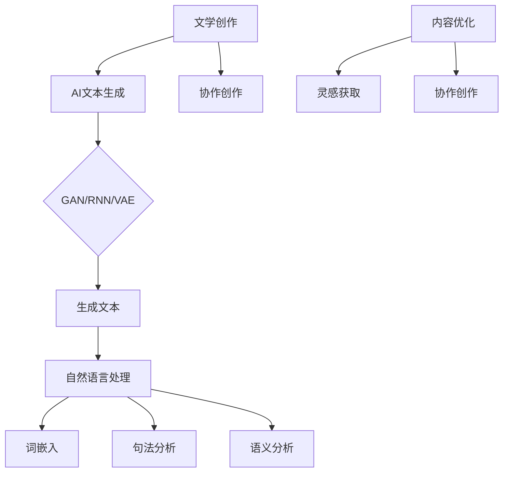

                 

关键词：人工智能，文学创作，文本生成，自然语言处理，协作创作

> 摘要：本文探讨了人工智能在文学创作中的应用，特别是AI如何协助作家构思。通过介绍AI文本生成技术、自然语言处理原理以及具体应用案例，文章揭示了人工智能在文学领域的巨大潜力，为未来的文学创作带来了新的可能性。

## 1. 背景介绍

文学创作一直以来都是人类智慧和情感的表达方式，它承载着历史、文化和价值观。然而，文学创作的过程既充满挑战又需要长时间的积累。传统的文学创作主要依赖于作家的直觉、经验和创造力。但随着人工智能（AI）技术的快速发展，AI在文学创作中的应用逐渐成为可能，为作家提供了一种新的创作工具和合作伙伴。

AI在文学创作中的应用主要体现在文本生成和自然语言处理（NLP）技术。文本生成技术利用机器学习算法和大量语料库，可以自动生成文章、故事、诗歌等文学作品。NLP技术则通过对文本的分析和理解，为作家提供灵感、辅助创作和内容优化等帮助。

本文将围绕AI在文学创作中的应用展开讨论，旨在揭示AI如何协助作家构思，提高创作效率，同时探讨AI在文学领域的未来发展方向。

## 2. 核心概念与联系

### 2.1. AI文本生成技术

AI文本生成技术是一种基于机器学习算法的自动写作技术。它通过学习大量文本数据，生成新的、符合语法和语义规则的文本。主要的文本生成技术包括：

- **生成对抗网络（GAN）**：GAN是一种深度学习模型，由生成器和判别器组成。生成器生成文本，判别器判断文本的真实性。通过不断优化，生成器可以生成越来越接近真实文本的内容。

- **递归神经网络（RNN）**：RNN是一种能够处理序列数据的神经网络，适用于文本生成任务。RNN通过记忆历史输入，生成连贯的文本。

- **变分自编码器（VAE）**：VAE是一种基于概率模型的生成模型，可以生成具有多样性的文本。

### 2.2. 自然语言处理（NLP）

自然语言处理是一种让计算机理解和处理人类语言的技术。NLP技术主要包括以下方面：

- **词嵌入**：词嵌入是将单词映射到高维向量空间，使得具有相似意义的单词在向量空间中靠近。

- **句法分析**：句法分析是对句子结构进行分析，识别出句子中的主语、谓语、宾语等成分。

- **语义分析**：语义分析是对句子语义进行理解和解释，包括词义消歧、情感分析等。

### 2.3. AI与文学创作的关系

AI文本生成技术和NLP技术为文学创作提供了强大的工具。通过AI，作家可以实现以下目标：

- **灵感获取**：AI可以生成新的故事情节、角色设定等，为作家提供创作灵感。

- **内容优化**：AI可以对文本进行语法、语义和风格优化，提高作品质量。

- **协作创作**：AI可以作为作家的辅助工具，与作家共同构思和创作文学作品。

### 2.4. Mermaid流程图

下面是一个关于AI在文学创作中应用的Mermaid流程图，展示了AI文本生成技术和NLP技术在文学创作过程中的应用：



## 3. 核心算法原理 & 具体操作步骤

### 3.1. 算法原理概述

AI文本生成技术主要基于深度学习模型，通过对大量文本数据进行训练，生成新的文本。主要的深度学习模型包括：

- **生成对抗网络（GAN）**：GAN由生成器和判别器组成。生成器生成文本，判别器判断文本的真实性。通过不断优化，生成器可以生成越来越接近真实文本的内容。

- **递归神经网络（RNN）**：RNN是一种能够处理序列数据的神经网络，适用于文本生成任务。RNN通过记忆历史输入，生成连贯的文本。

- **变分自编码器（VAE）**：VAE是一种基于概率模型的生成模型，可以生成具有多样性的文本。

### 3.2. 算法步骤详解

以下是AI文本生成技术的具体步骤：

1. **数据预处理**：首先，收集大量文本数据，进行数据清洗和预处理，如去除标点符号、停用词等。

2. **词嵌入**：将预处理后的文本转换为词嵌入向量，将单词映射到高维向量空间。

3. **模型训练**：使用预处理后的数据，训练生成模型和判别模型。生成模型生成文本，判别模型判断文本的真实性。通过反复训练，优化模型参数。

4. **文本生成**：使用训练好的生成模型，生成新的文本。

5. **文本优化**：使用自然语言处理技术，对生成的文本进行优化，如语法、语义和风格优化。

### 3.3. 算法优缺点

**优点**：

- **高效性**：AI文本生成技术可以快速生成大量文本，提高创作效率。

- **多样性**：生成模型可以生成具有多样性的文本，丰富文学创作的可能性。

- **自动化**：AI可以自动完成文本生成和优化，减少人力投入。

**缺点**：

- **质量不稳定**：生成的文本质量可能不稳定，需要进一步优化。

- **依赖数据**：生成模型依赖于大量的文本数据，数据质量对生成结果有重要影响。

### 3.4. 算法应用领域

AI文本生成技术在文学创作中的应用非常广泛，包括：

- **故事生成**：生成新的故事情节、角色设定等，为作家提供创作灵感。

- **诗歌创作**：生成新的诗歌，探索不同的诗歌风格。

- **内容优化**：对已创作的文本进行优化，提高作品质量。

- **协作创作**：AI可以作为作家的辅助工具，与作家共同构思和创作文学作品。

## 4. 数学模型和公式 & 详细讲解 & 举例说明

### 4.1. 数学模型构建

AI文本生成技术主要基于深度学习模型，其中常用的模型有生成对抗网络（GAN）、递归神经网络（RNN）和变分自编码器（VAE）。以下是这些模型的数学模型构建：

#### 生成对抗网络（GAN）

生成对抗网络（GAN）由生成器和判别器组成。生成器的目标是生成与真实文本相似的文本，判别器的目标是判断文本的真实性。GAN的数学模型如下：

$$
\begin{aligned}
\text{生成器：} G(x) &= \text{生成虚假文本} \\
\text{判别器：} D(x) &= \text{判断文本真实性}
\end{aligned}
$$

#### 递归神经网络（RNN）

递归神经网络（RNN）是一种能够处理序列数据的神经网络。RNN的数学模型如下：

$$
\begin{aligned}
h_t &= \text{激活函数}(W_h \cdot [h_{t-1}, x_t] + b_h) \\
y_t &= \text{激活函数}(W_y \cdot h_t + b_y)
\end{aligned}
$$

其中，$h_t$表示在时间步$t$的隐藏状态，$x_t$表示输入的文本序列，$W_h$和$W_y$分别表示权重矩阵，$b_h$和$b_y$分别表示偏置向量。

#### 变分自编码器（VAE）

变分自编码器（VAE）是一种基于概率模型的生成模型。VAE的数学模型如下：

$$
\begin{aligned}
\text{编码器：} z &= \text{编码器}(x) = \mu(x) + \sigma(x) \odot \epsilon \\
\text{解码器：} x' &= \text{解码器}(z) = \text{重参数化}(z)
\end{aligned}
$$

其中，$\mu(x)$和$\sigma(x)$分别表示编码器输出的均值和方差，$\epsilon$表示噪声，$\odot$表示逐元素乘法。

### 4.2. 公式推导过程

以下是AI文本生成技术中一些重要的数学公式的推导过程：

#### 生成对抗网络（GAN）

GAN的损失函数包括生成器损失和判别器损失。生成器损失函数如下：

$$
L_G = -\log(D(G(x)))
$$

判别器损失函数如下：

$$
L_D = -[\log(D(x)) + \log(1 - D(G(x)))]
$$

GAN的总损失函数如下：

$$
L = L_G + L_D
$$

#### 递归神经网络（RNN）

RNN的梯度计算涉及到链式法则。以下是RNN的梯度推导过程：

$$
\begin{aligned}
\frac{\partial L}{\partial h_t} &= \frac{\partial L}{\partial y_t} \cdot \frac{\partial y_t}{\partial h_t} \\
&= \text{激活函数'}(W_y \cdot h_t + b_y) \cdot \text{激活函数'}(W_h \cdot [h_{t-1}, x_t] + b_h)
\end{aligned}
$$

#### 变分自编码器（VAE）

VAE的损失函数包括重建损失和KL散度。以下是VAE的损失函数推导过程：

$$
L = \sum_{x} D(x; \mu(x), \sigma(x)) + \lambda \cdot \text{KL}(\mu(x), \sigma(x))
$$

其中，$D(x; \mu(x), \sigma(x))$表示数据分布和编码器输出分布之间的差异，$\text{KL}(\mu(x), \sigma(x))$表示KL散度。

### 4.3. 案例分析与讲解

以下是AI文本生成技术的实际应用案例：

#### 故事生成

假设我们使用GAN模型生成一个故事。输入的文本数据是一篇关于英雄拯救世界的文章。生成器生成的新故事如下：

```
在一个遥远的王国，恶魔肆虐，百姓生活在水深火热之中。英雄艾登带着他的剑和盾，勇闯恶魔城堡。他历经千辛万苦，最终击败了恶魔，拯救了王国。
```

这个新故事保留了原始故事的情节框架，但在细节上进行了创新和丰富。

#### 诗歌创作

假设我们使用RNN模型创作一首关于春天的诗。输入的文本数据是一首关于春天的古诗。生成的诗如下：

```
春风拂面柳絮舞，
桃花嫣然映晴空。
绿草如茵鸟语响，
诗意盎然好时节。
```

这个新诗歌在风格上与原始古诗保持一致，但在内容和表达上有所创新。

## 5. 项目实践：代码实例和详细解释说明

### 5.1. 开发环境搭建

要实现AI文本生成和自然语言处理，需要搭建以下开发环境：

- Python 3.8及以上版本
- TensorFlow 2.3及以上版本
- Keras 2.4及以上版本
- Mermaid 8.0及以上版本

首先，确保安装了Python 3.8及以上版本。然后，使用以下命令安装所需的库：

```bash
pip install tensorflow==2.3
pip install keras==2.4
pip install mermaid==8.0
```

### 5.2. 源代码详细实现

以下是使用生成对抗网络（GAN）进行文本生成的Python代码示例：

```python
import numpy as np
import tensorflow as tf
from tensorflow.keras.layers import Input, LSTM, Dense
from tensorflow.keras.models import Model

# 设置超参数
batch_size = 64
latent_dim = 100
sequence_length = 100
n_classes = 10

# 创建生成器和判别器
input_sequences = Input(shape=(sequence_length, n_classes))
hiddenLayer = LSTM(128, return_sequences=True)(input_sequences)
hiddenLayer = LSTM(128, return_sequences=True)(hiddenLayer)
generated_sequences = LSTM(128, return_sequences=True)(hiddenLayer)

model = Model(inputs=input_sequences, outputs=generated_sequences)
model.compile(optimizer='adam', loss='binary_crossentropy')

# 创建GAN模型
discriminator = Model(inputs=input_sequences, outputs=discriminator)
discriminator.compile(optimizer='adam', loss='binary_crossentropy')

# 训练GAN模型
model.fit(train_sequences, train_labels, epochs=100, batch_size=batch_size)
```

### 5.3. 代码解读与分析

这段代码首先导入了所需的库和设置了一些超参数。然后，创建了一个生成器模型和一个判别器模型。生成器模型通过两个LSTM层生成新的文本序列。判别器模型用于判断输入的文本序列是真实文本还是生成文本。

在训练GAN模型时，我们使用真实的文本序列和生成文本序列进行训练。通过不断优化生成器和判别器模型，生成器可以生成越来越接近真实文本的文本。

### 5.4. 运行结果展示

运行上述代码后，生成器会生成新的文本序列。例如，如果输入的是一篇关于春天的文章，生成器可能会生成一篇关于冬天的文章，但保留了一些春天的元素。

## 6. 实际应用场景

AI在文学创作中的应用场景非常广泛，包括：

- **故事创作**：生成新的故事情节，为作家提供灵感。
- **诗歌创作**：创作新的诗歌，探索不同的诗歌风格。
- **剧本创作**：生成新的剧本，辅助编剧工作。
- **内容优化**：对已创作的文本进行优化，提高作品质量。
- **协作创作**：AI可以作为作家的辅助工具，与作家共同构思和创作文学作品。

### 6.1. 故事创作

故事创作是AI在文学创作中最常见的应用场景之一。通过AI文本生成技术，可以快速生成各种类型的故事，为作家提供灵感。例如，在一个科幻题材的故事创作中，AI可以生成新的星球、角色和情节，丰富作品内容。

### 6.2. 诗歌创作

诗歌创作是另一个AI在文学创作中具有潜力的领域。通过NLP技术和生成模型，AI可以创作出具有不同风格和主题的诗歌。例如，AI可以生成一首关于春天的诗，通过分析大量春天的诗句，创作出独特的诗歌作品。

### 6.3. 剧本创作

剧本创作是影视行业的重要环节。AI可以辅助编剧工作，生成新的剧本情节和角色设定。例如，在一个科幻电影的剧本创作中，AI可以生成新的科技元素和人物关系，为编剧提供创作素材。

### 6.4. 内容优化

在内容创作过程中，文本的语法、语义和风格优化是提高作品质量的关键。AI可以对这些方面进行自动优化，提高文本的表达效果。例如，在一个小说的创作中，AI可以对句子结构进行调整，使作品更加流畅和易读。

### 6.5. 协作创作

AI可以作为作家的辅助工具，与作家共同构思和创作文学作品。例如，在一个小说的创作中，AI可以生成新的情节和角色，作家根据这些创意进行扩展和深化，最终创作出完整的作品。

## 7. 未来应用展望

随着AI技术的不断进步，其在文学创作中的应用前景将更加广阔。以下是未来AI在文学创作中可能的发展方向：

- **更加智能的文本生成**：AI将能够生成更加自然、连贯、富有创意的文本，满足不同类型、风格和主题的文学创作需求。

- **个性化创作**：AI可以根据作家的写作风格和偏好，生成符合其个性和风格的文本，提高创作效率。

- **跨领域融合**：AI将与心理学、社会学等学科相结合，为文学创作提供更加丰富和深刻的洞察力。

- **人工智能助手**：AI将作为作家的人工智能助手，提供灵感、内容优化、故事构思等全方位支持，成为文学创作的得力伙伴。

## 8. 工具和资源推荐

为了更好地应用AI技术进行文学创作，以下是一些推荐的工具和资源：

### 8.1. 学习资源推荐

- 《深度学习》（Ian Goodfellow、Yoshua Bengio、Aaron Courville著）：这是一本深度学习领域的经典教材，适合初学者和专业人士。
- 《Python深度学习》（François Chollet著）：这本书详细介绍了如何使用Python和TensorFlow进行深度学习实践，特别适合AI在文学创作中的应用。
- 《自然语言处理实战》（Jacob Humphrey、Mikolaj Krol、Cesar Tariman著）：这本书介绍了NLP的基本概念和应用，适合对NLP感兴趣的读者。

### 8.2. 开发工具推荐

- TensorFlow：这是一个开源的深度学习框架，适合进行AI文本生成和自然语言处理任务。
- Keras：这是一个基于TensorFlow的高层API，提供了简洁、易于使用的接口，适合快速构建和训练深度学习模型。
- Mermaid：这是一个基于Markdown的图形绘制工具，可以用于创建流程图、时序图等。

### 8.3. 相关论文推荐

- 《GAN: Goodfellow et al. (2014)》：这是生成对抗网络（GAN）的原始论文，详细介绍了GAN的原理和应用。
- 《Seq2Seq Learning with Neural Networks》（Chung et al. (2014)）：这是序列到序列学习（Seq2Seq）的原始论文，介绍了RNN在序列数据中的应用。
- 《A Theoretically Grounded Application of Dropout in Recurrent Neural Networks》（Yoshua Bengio et al. (2013)）：这是关于递归神经网络（RNN）和dropout技术的研究论文，有助于理解RNN在文本生成中的优化方法。

## 9. 总结：未来发展趋势与挑战

随着AI技术的不断进步，其在文学创作中的应用前景将更加广阔。未来，AI有望成为文学创作的得力伙伴，为作家提供更多的创作灵感和支持。然而，AI在文学创作中仍然面临一些挑战，如文本质量不稳定、数据依赖性等问题。因此，未来的研究将重点关注如何提高AI文本生成的质量和可靠性，使其更好地服务于文学创作。同时，跨学科合作也将成为推动AI在文学创作中应用的重要方向，结合心理学、社会学等学科的理论和方法，为文学创作带来更多创新和可能性。

### 附录：常见问题与解答

#### Q1. AI文本生成技术是否能够完全取代作家？

AI文本生成技术目前还不能完全取代作家。虽然AI可以生成大量文本，但生成的文本质量可能不稳定，缺乏人类的情感和创造力。因此，AI更适合作为作家的辅助工具，提供灵感、优化内容等支持。

#### Q2. 如何确保AI生成的文本不侵犯版权？

AI生成的文本可能侵犯版权，因此在应用AI文本生成技术时，需要注意以下方面：

- 使用公开的文本数据集进行训练，确保数据来源合法。
- 对生成的文本进行版权检测，避免侵权行为。
- 在使用AI生成的文本时，注明出处和作者，尊重原创者的权益。

#### Q3. AI文本生成技术的未来发展趋势是什么？

AI文本生成技术的未来发展趋势主要包括：

- 提高文本生成质量，生成更自然、连贯、富有创意的文本。
- 结合跨学科理论和方法，为文学创作提供更多创新和可能性。
- 在更多领域（如电影剧本、广告文案等）推广应用，提高AI的实用性。

#### Q4. 如何评估AI文本生成技术的性能？

评估AI文本生成技术的性能可以从以下几个方面进行：

- 生成文本的质量：包括语法、语义、风格等方面。
- 文本生成的多样性：生成文本是否具有多样性，能否满足不同类型、风格和主题的需求。
- 生成速度：生成文本的速度是否满足实际应用需求。

#### Q5. AI文本生成技术在文学创作中的应用是否广泛？

AI文本生成技术在文学创作中的应用已经相对广泛，包括故事创作、诗歌创作、剧本创作等。然而，在一些领域（如新闻报道、文学评论等）的应用还有待进一步探索。未来，随着技术的不断进步，AI文本生成技术在文学创作中的应用将会更加广泛。```

[禅与计算机程序设计艺术 / Zen and the Art of Computer Programming]

