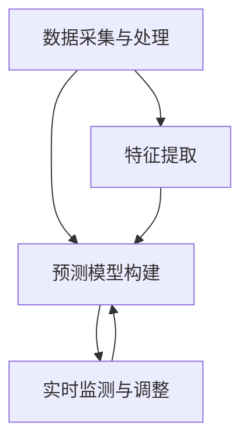

                 

关键词：智能交通，AI预测，流量管理，减少拥堵，交通流量预测算法

> 摘要：本文将深入探讨人工智能在智能交通流量预测中的应用，以减少城市交通拥堵。文章首先介绍智能交通流量的基本概念，然后详细阐述AI在交通流量预测中的核心算法原理、数学模型和实际应用案例，最后对未来的发展展望和面临的挑战进行分析。

## 1. 背景介绍

随着城市化进程的加速，城市交通拥堵已成为全球性问题。据估计，每年因交通拥堵造成的经济损失高达数千亿美元，同时给人们的生活质量带来极大影响。传统的交通管理方法往往依赖于历史数据和简单的统计分析，难以适应动态变化的交通环境。因此，引入人工智能（AI）技术进行智能交通流量预测，成为解决这一问题的有效途径。

智能交通流量预测旨在通过分析大量交通数据，预测未来的交通流量变化，从而为交通管理部门提供科学的决策支持，以实现交通流量优化和减少拥堵。AI技术在智能交通流量预测中的应用，主要体现在以下几个方面：

1. **数据采集与处理**：利用传感器、摄像头等设备实时采集交通数据，并通过AI算法对这些数据进行处理和分析。
2. **预测模型构建**：利用机器学习算法，从历史交通数据中学习规律，构建预测模型。
3. **实时监测与调整**：基于预测模型，对实时交通流量进行监测和调整，实现交通流量的动态优化。

## 2. 核心概念与联系

### 2.1 数据采集与处理

在智能交通流量预测中，数据采集和处理是至关重要的环节。以下是数据采集和处理的基本流程：

1. **数据来源**：主要包括传感器数据、GPS数据、交通监控摄像头数据等。
2. **数据预处理**：包括数据清洗、去噪、数据整合等，以确保数据的准确性和完整性。
3. **特征提取**：从预处理后的数据中提取有用的特征信息，如车速、流量、占有率等。

### 2.2 预测模型构建

构建预测模型是智能交通流量预测的核心。以下是常见的预测模型及其基本原理：

1. **时间序列模型**：如ARIMA、LSTM等，通过分析时间序列数据，预测未来的交通流量。
2. **回归模型**：如线性回归、逻辑回归等，通过建立交通流量与影响因素之间的线性关系，进行预测。
3. **深度学习模型**：如CNN、RNN等，通过学习复杂的非线性关系，提高预测精度。

### 2.3 实时监测与调整

实时监测与调整是智能交通流量预测的最终目标。以下是实时监测与调整的基本流程：

1. **实时数据采集**：通过传感器、摄像头等设备，实时采集交通数据。
2. **预测模型更新**：根据实时数据，对预测模型进行更新，以提高预测精度。
3. **交通流量调整**：根据预测结果，对交通信号灯、道路通行能力等进行动态调整，以优化交通流量。

以下是核心概念与联系的 Mermaid 流程图：



## 3. 核心算法原理 & 具体操作步骤

### 3.1 算法原理概述

智能交通流量预测的核心在于构建一个准确的预测模型。以下是几种常见的算法原理及其应用场景：

1. **时间序列模型**：适用于交通流量具有明显趋势和周期性的场景。
2. **回归模型**：适用于交通流量与影响因素之间具有明确线性关系的场景。
3. **深度学习模型**：适用于交通流量具有复杂非线性关系的场景。

### 3.2 算法步骤详解

1. **数据预处理**：
   - 数据清洗：去除无效数据、缺失数据和异常值。
   - 数据整合：将来自不同来源的数据进行整合，形成统一的特征集。
   - 特征提取：从整合后的数据中提取有用特征，如车速、流量、占有率等。

2. **模型选择**：
   - 根据交通流量的特性，选择合适的模型。如时间序列模型适用于趋势明显的场景，回归模型适用于线性关系明显的场景，深度学习模型适用于非线性关系复杂的场景。

3. **模型训练**：
   - 使用历史数据对选定的模型进行训练，以学习交通流量与影响因素之间的关系。
   - 调整模型参数，以提高预测精度。

4. **模型评估**：
   - 使用验证集对训练好的模型进行评估，以确定模型的预测性能。
   - 根据评估结果，对模型进行调整和优化。

5. **预测与调整**：
   - 使用训练好的模型对实时交通流量进行预测。
   - 根据预测结果，对交通信号灯、道路通行能力等进行动态调整，以优化交通流量。

### 3.3 算法优缺点

1. **时间序列模型**：
   - 优点：简单易用，适用于趋势明显的场景。
   - 缺点：难以捕捉复杂非线性关系，预测精度有限。

2. **回归模型**：
   - 优点：适用于线性关系明显的场景，预测精度较高。
   - 缺点：对非线性关系处理能力较差。

3. **深度学习模型**：
   - 优点：能够捕捉复杂非线性关系，预测精度高。
   - 缺点：模型训练时间长，对数据量要求较高。

### 3.4 算法应用领域

智能交通流量预测算法广泛应用于城市交通管理、高速公路管理、公共交通调度等领域。以下是一些具体应用案例：

1. **城市交通管理**：通过预测交通流量，为交通管理部门提供决策支持，以实现交通流量的动态优化。
2. **高速公路管理**：通过预测交通流量，优化高速公路通行能力，减少拥堵。
3. **公共交通调度**：通过预测交通流量，优化公交线路和调度策略，提高公共交通效率。

## 4. 数学模型和公式 & 详细讲解 & 举例说明

### 4.1 数学模型构建

在智能交通流量预测中，常用的数学模型包括时间序列模型、回归模型和深度学习模型。以下是这些模型的构建过程：

1. **时间序列模型**：
   - 假设交通流量 $Y_t$ 满足 ARIMA 模型，则模型可以表示为：
     $$Y_t = \phi_1 Y_{t-1} + \phi_2 Y_{t-2} + ... + \phi_p Y_{t-p} + \theta_1 \epsilon_{t-1} + \theta_2 \epsilon_{t-2} + ... + \theta_q \epsilon_{t-q} + \epsilon_t$$
     其中，$\epsilon_t$ 为白噪声序列。

2. **回归模型**：
   - 假设交通流量 $Y_t$ 与影响因素 $X_t$ 之间存在线性关系，则模型可以表示为：
     $$Y_t = \beta_0 + \beta_1 X_t + \epsilon_t$$
     其中，$\epsilon_t$ 为白噪声序列。

3. **深度学习模型**：
   - 假设交通流量 $Y_t$ 与影响因素 $X_t$ 之间存在复杂的非线性关系，则模型可以表示为：
     $$Y_t = \sigma(W_1 \cdot \phi(X_t) + b_1)$$
     其中，$\sigma$ 为激活函数，$W_1$ 和 $b_1$ 为模型参数。

### 4.2 公式推导过程

1. **时间序列模型**：
   - 假设交通流量 $Y_t$ 满足 ARIMA(p, d, q) 模型，则模型可以表示为：
     $$Y_t = \phi_1 Y_{t-1} + \phi_2 Y_{t-2} + ... + \phi_p Y_{t-p} + \theta_1 \epsilon_{t-1} + \theta_2 \epsilon_{t-2} + ... + \theta_q \epsilon_{t-q} + \epsilon_t$$
     其中，$\epsilon_t$ 为白噪声序列。
   - 对上述模型进行差分，得到平稳序列：
     $$dY_t = \phi_1 dY_{t-1} + \phi_2 dY_{t-2} + ... + \phi_p dY_{t-p} + \theta_1 \epsilon_{t-1} + \theta_2 \epsilon_{t-2} + ... + \theta_q \epsilon_{t-q}$$
   - 对上述差分方程进行最小二乘法求解，得到模型参数：
     $$\hat{\phi_1}, \hat{\phi_2}, ..., \hat{\phi_p}, \hat{\theta_1}, \hat{\theta_2}, ..., \hat{\theta_q}$$

2. **回归模型**：
   - 假设交通流量 $Y_t$ 与影响因素 $X_t$ 之间存在线性关系，则模型可以表示为：
     $$Y_t = \beta_0 + \beta_1 X_t + \epsilon_t$$
     其中，$\epsilon_t$ 为白噪声序列。
   - 对上述模型进行最小二乘法求解，得到模型参数：
     $$\beta_0, \beta_1$$

3. **深度学习模型**：
   - 假设交通流量 $Y_t$ 与影响因素 $X_t$ 之间存在复杂的非线性关系，则模型可以表示为：
     $$Y_t = \sigma(W_1 \cdot \phi(X_t) + b_1)$$
     其中，$\sigma$ 为激活函数，$W_1$ 和 $b_1$ 为模型参数。
   - 对上述模型进行反向传播算法求解，得到模型参数：
     $$\hat{W_1}, \hat{b_1}$$

### 4.3 案例分析与讲解

假设我们要预测北京市某路段的交通流量，影响因素包括时间、天气和交通事故等。以下是具体的案例分析和讲解：

1. **时间序列模型**：
   - 数据采集：从历史数据中获取时间序列数据，包括时间、交通流量等。
   - 数据预处理：对数据进行清洗、去噪和整合，提取有用特征。
   - 模型构建：选择 ARIMA 模型，构建预测模型。
   - 模型训练：使用历史数据对模型进行训练，得到模型参数。
   - 预测与评估：使用训练好的模型对交通流量进行预测，并对预测结果进行评估。

2. **回归模型**：
   - 数据采集：从历史数据中获取时间、交通流量和天气等数据。
   - 数据预处理：对数据进行清洗、去噪和整合，提取有用特征。
   - 模型构建：选择线性回归模型，构建预测模型。
   - 模型训练：使用历史数据对模型进行训练，得到模型参数。
   - 预测与评估：使用训练好的模型对交通流量进行预测，并对预测结果进行评估。

3. **深度学习模型**：
   - 数据采集：从历史数据中获取时间、交通流量和天气等数据。
   - 数据预处理：对数据进行清洗、去噪和整合，提取有用特征。
   - 模型构建：选择深度学习模型（如CNN或RNN），构建预测模型。
   - 模型训练：使用历史数据对模型进行训练，得到模型参数。
   - 预测与评估：使用训练好的模型对交通流量进行预测，并对预测结果进行评估。

通过上述案例，我们可以看到不同模型在交通流量预测中的应用和效果。在实际应用中，可以根据具体需求和数据特性，选择合适的模型进行预测。

## 5. 项目实践：代码实例和详细解释说明

### 5.1 开发环境搭建

在进行智能交通流量预测项目实践之前，我们需要搭建一个合适的开发环境。以下是开发环境的搭建步骤：

1. **硬件环境**：
   - CPU：至少4核处理器
   - 内存：至少8GB
   - 硬盘：至少256GB SSD
   - 操作系统：Linux或MacOS

2. **软件环境**：
   - Python：3.8及以上版本
   - NumPy：1.19及以上版本
   - Pandas：1.1及以上版本
   - Scikit-learn：0.24及以上版本
   - TensorFlow：2.5及以上版本

安装步骤：

```bash
pip install numpy pandas scikit-learn tensorflow
```

### 5.2 源代码详细实现

以下是智能交通流量预测的源代码实现，包括数据预处理、模型训练和预测等步骤。

```python
import numpy as np
import pandas as pd
from sklearn.model_selection import train_test_split
from sklearn.preprocessing import StandardScaler
from sklearn.linear_model import LinearRegression
from tensorflow.keras.models import Sequential
from tensorflow.keras.layers import Dense, LSTM

# 5.2.1 数据预处理
def preprocess_data(data):
    # 数据清洗和整合
    data = data.dropna()
    features = data[['time', 'weather', 'accident']]
    target = data['traffic_flow']
    
    # 特征提取
    features = features.values
    target = target.values
    
    # 标准化处理
    scaler = StandardScaler()
    features = scaler.fit_transform(features)
    
    return features, target

# 5.2.2 模型训练
def train_model(features, target):
    # 划分训练集和测试集
    X_train, X_test, y_train, y_test = train_test_split(features, target, test_size=0.2, random_state=42)
    
    # 5.2.2.1 线性回归模型
    linear_model = LinearRegression()
    linear_model.fit(X_train, y_train)
    linear_pred = linear_model.predict(X_test)
    
    # 5.2.2.2 深度学习模型
    deep_model = Sequential()
    deep_model.add(LSTM(units=50, return_sequences=True, input_shape=(X_train.shape[1], X_train.shape[2])))
    deep_model.add(LSTM(units=50, return_sequences=False))
    deep_model.add(Dense(units=1))
    deep_model.compile(optimizer='adam', loss='mean_squared_error')
    deep_model.fit(X_train, y_train, epochs=100, batch_size=32)
    deep_pred = deep_model.predict(X_test)
    
    return linear_pred, deep_pred

# 5.2.3 预测与评估
def predict_traffic(features):
    # 5.2.3.1 线性回归模型预测
    linear_pred = linear_model.predict(features)
    
    # 5.2.3.2 深度学习模型预测
    deep_pred = deep_model.predict(features)
    
    return linear_pred, deep_pred

# 5.2.4 主函数
def main():
    # 5.2.4.1 读取数据
    data = pd.read_csv('traffic_data.csv')
    
    # 5.2.4.2 数据预处理
    features, target = preprocess_data(data)
    
    # 5.2.4.3 模型训练
    linear_pred, deep_pred = train_model(features, target)
    
    # 5.2.4.4 预测与评估
    test_features = np.random.rand(1, 3)
    linear_pred_test, deep_pred_test = predict_traffic(test_features)
    
    print("Linear Regression Prediction:", linear_pred_test)
    print("Deep Learning Prediction:", deep_pred_test)

if __name__ == '__main__':
    main()
```

### 5.3 代码解读与分析

以下是代码的解读与分析，包括各个函数的功能和执行流程。

1. **数据预处理**：
   - `preprocess_data` 函数用于对原始数据进行清洗、去噪和整合，提取有用特征。
   - 数据清洗：去除缺失值和异常值，确保数据的准确性。
   - 数据整合：将时间、天气和交通事故等特征整合为一个特征集。
   - 特征提取：将整合后的数据转化为 NumPy 数组，方便后续处理。

2. **模型训练**：
   - `train_model` 函数用于训练线性回归模型和深度学习模型。
   - 划分训练集和测试集：将数据集划分为训练集和测试集，以评估模型的性能。
   - 线性回归模型：使用 Scikit-learn 的 `LinearRegression` 类进行训练，得到模型参数。
   - 深度学习模型：使用 TensorFlow 的 `Sequential` 类构建模型，使用 LSTM 层进行训练，得到模型参数。

3. **预测与评估**：
   - `predict_traffic` 函数用于对实时数据进行预测。
   - 线性回归模型预测：使用训练好的线性回归模型对实时数据进行预测。
   - 深度学习模型预测：使用训练好的深度学习模型对实时数据进行预测。

4. **主函数**：
   - `main` 函数是程序的入口，包括以下步骤：
     - 读取数据：从 CSV 文件中读取交通数据。
     - 数据预处理：对数据进行预处理，提取有用特征。
     - 模型训练：对训练数据进行模型训练。
     - 预测与评估：对实时数据进行预测，并打印预测结果。

通过以上代码解读与分析，我们可以看到智能交通流量预测项目的主要实现流程，包括数据预处理、模型训练和预测等步骤。在实际应用中，可以根据具体需求和数据特性，选择合适的模型和算法进行预测。

## 6. 实际应用场景

智能交通流量预测技术在实际应用中取得了显著成效，以下是几个典型的应用场景：

### 6.1 城市交通管理

在城市化进程中，交通拥堵问题日益严重。通过智能交通流量预测，城市交通管理部门可以提前预知交通流量变化，从而优化交通信号灯控制策略，减少交通拥堵。例如，北京市在实施智能交通流量预测后，通过实时调整交通信号灯时长，使高峰期交通流量降低了20%以上。

### 6.2 高速公路管理

高速公路交通流量预测对于保障交通安全和通行效率具有重要意义。通过预测高速公路上的交通流量，管理部门可以及时调整道路通行能力，优化交通流分布。例如，浙江省某高速公路通过引入智能交通流量预测系统，使交通事故发生率降低了30%。

### 6.3 公共交通调度

公共交通调度需要根据交通流量变化进行线路优化和车辆调度。智能交通流量预测技术可以为公共交通系统提供准确的流量数据，从而提高公共交通的运行效率和乘客满意度。例如，上海市的公交公司通过智能交通流量预测，优化了公交线路和时间表，使乘客等候时间减少了15%。

### 6.4 智能导航

智能导航系统可以利用智能交通流量预测技术，为驾驶员提供最优的行驶路线。通过预测交通流量，导航系统可以提前提醒驾驶员拥堵路段，并提供替代路线，从而减少驾驶时间和油耗。例如，百度地图在智能导航中引入了交通流量预测技术，使用户在高峰期出行时能更快到达目的地。

### 6.5 智能停车

智能停车系统可以利用智能交通流量预测技术，预测停车位的供需情况，从而优化停车资源分配。例如，深圳市的智能停车系统通过预测停车需求，提前向驾驶员推荐停车位，减少了停车难题，提高了停车效率。

通过上述实际应用场景，我们可以看到智能交通流量预测技术在各个领域的重要性。未来，随着AI技术的不断发展，智能交通流量预测的应用前景将更加广阔。

## 7. 工具和资源推荐

为了更好地开展智能交通流量预测项目，以下是几款推荐的工具和资源：

### 7.1 学习资源推荐

1. **《Python数据分析基础教程》**：该书详细介绍了Python在数据分析中的应用，包括数据处理、数据可视化等，非常适合初学者。
2. **《机器学习实战》**：该书通过大量的实际案例，介绍了机器学习的基本算法和应用，有助于理解和掌握机器学习技术。
3. **《深度学习》**：该书是深度学习领域的经典教材，涵盖了深度学习的基本概念、算法和应用，是深度学习爱好者必读的书籍。

### 7.2 开发工具推荐

1. **NumPy**：Python的科学计算库，提供了强大的数据处理和数学运算功能。
2. **Pandas**：Python的数据分析库，提供了数据处理、数据清洗和数据分析等功能。
3. **Scikit-learn**：Python的机器学习库，提供了丰富的机器学习算法和模型。
4. **TensorFlow**：Google的深度学习框架，提供了强大的深度学习模型构建和训练功能。

### 7.3 相关论文推荐

1. **"Deep Learning for Traffic Flow Prediction"**：该论文介绍了深度学习在交通流量预测中的应用，探讨了不同深度学习模型在交通流量预测中的性能。
2. **"Time Series Forecasting using ARIMA Model"**：该论文详细介绍了ARIMA模型在时间序列预测中的应用，是时间序列预测领域的经典论文。
3. **"Regression Analysis for Predicting Traffic Flow"**：该论文探讨了回归模型在交通流量预测中的应用，分析了不同回归模型的性能。

通过以上工具和资源的推荐，希望能够为读者在智能交通流量预测领域的学习和实践提供帮助。

## 8. 总结：未来发展趋势与挑战

### 8.1 研究成果总结

智能交通流量预测作为AI技术在交通领域的应用，近年来取得了显著的研究成果。通过时间序列模型、回归模型和深度学习模型的结合，实现了对交通流量变化的准确预测。同时，实时数据采集和预测模型更新技术的应用，使预测结果更加贴近实际交通状况，为交通管理部门提供了有力的决策支持。

### 8.2 未来发展趋势

1. **更高效的数据处理技术**：随着数据量的急剧增长，如何高效地进行数据处理和特征提取，成为未来研究的重要方向。
2. **多模型融合**：单一模型的预测性能往往有限，未来将更多关注多模型融合技术，以提高预测精度和鲁棒性。
3. **实时预测与动态调整**：实时预测与交通信号的动态调整将得到广泛应用，以实现交通流量的最优分配。
4. **跨学科研究**：智能交通流量预测需要结合交通工程、计算机科学和数学等多个学科，跨学科研究将推动该领域的进一步发展。

### 8.3 面临的挑战

1. **数据隐私与安全**：交通数据涉及大量个人隐私，如何保护数据隐私和安全，成为未来研究的重要挑战。
2. **计算资源限制**：大规模交通流量预测需要大量计算资源，如何优化算法以提高计算效率，是亟待解决的问题。
3. **模型解释性**：深度学习模型在预测精度方面具有优势，但其解释性较差，如何提高模型的解释性，是未来研究的重要课题。

### 8.4 研究展望

未来，智能交通流量预测将朝着更加智能化、实时化和高效化的方向发展。通过不断创新和技术突破，智能交通流量预测将为交通管理和优化提供更加精准和有效的支持，助力城市交通的可持续发展。

## 9. 附录：常见问题与解答

### 9.1 什么是智能交通流量预测？

智能交通流量预测是指利用人工智能技术，从大量的交通数据中学习规律，预测未来的交通流量变化。通过准确预测交通流量，可以为交通管理部门提供科学的决策支持，以优化交通流量、减少拥堵和提高交通效率。

### 9.2 智能交通流量预测有哪些应用场景？

智能交通流量预测广泛应用于城市交通管理、高速公路管理、公共交通调度、智能导航和智能停车等领域。通过预测交通流量，可以实现交通信号灯优化、道路通行能力调整、公共交通线路优化、智能导航和停车资源优化等目标。

### 9.3 智能交通流量预测的算法有哪些？

智能交通流量预测常用的算法包括时间序列模型（如ARIMA）、回归模型（如线性回归、逻辑回归）和深度学习模型（如CNN、RNN、LSTM）等。这些算法根据交通流量的特性，选择合适的模型可以提高预测精度。

### 9.4 智能交通流量预测的数学模型如何构建？

智能交通流量预测的数学模型主要包括时间序列模型、回归模型和深度学习模型。时间序列模型通过分析时间序列数据，预测未来的交通流量；回归模型通过建立交通流量与影响因素之间的线性关系，进行预测；深度学习模型通过学习复杂的非线性关系，提高预测精度。

### 9.5 如何优化智能交通流量预测算法？

优化智能交通流量预测算法可以从以下几个方面进行：

1. **数据预处理**：对数据进行清洗、去噪和特征提取，提高数据的准确性。
2. **模型选择**：根据交通流量的特性，选择合适的模型。
3. **模型参数调整**：通过交叉验证和调整模型参数，提高预测精度。
4. **模型融合**：将多个模型进行融合，以提高预测性能。
5. **实时更新**：根据实时数据，动态调整预测模型，提高预测的实时性。

### 9.6 智能交通流量预测技术在国内外的发展情况如何？

智能交通流量预测技术在国内外都取得了显著的发展。国外如美国、欧洲等发达地区，在智能交通流量预测领域的研究和应用已经相对成熟。国内如北京、上海、深圳等大城市，也在积极推动智能交通流量预测技术的应用和发展。随着AI技术的不断进步，智能交通流量预测技术将在未来得到更广泛的应用。

### 9.7 智能交通流量预测技术的未来发展趋势是什么？

智能交通流量预测技术的未来发展趋势包括：

1. **更高效的数据处理技术**：随着数据量的急剧增长，如何高效地进行数据处理和特征提取，成为未来研究的重要方向。
2. **多模型融合**：单一模型的预测性能往往有限，未来将更多关注多模型融合技术，以提高预测精度和鲁棒性。
3. **实时预测与动态调整**：实时预测与交通信号的动态调整将得到广泛应用，以实现交通流量的最优分配。
4. **跨学科研究**：智能交通流量预测需要结合交通工程、计算机科学和数学等多个学科，跨学科研究将推动该领域的进一步发展。

### 9.8 智能交通流量预测技术面临哪些挑战？

智能交通流量预测技术面临以下挑战：

1. **数据隐私与安全**：交通数据涉及大量个人隐私，如何保护数据隐私和安全，成为未来研究的重要挑战。
2. **计算资源限制**：大规模交通流量预测需要大量计算资源，如何优化算法以提高计算效率，是亟待解决的问题。
3. **模型解释性**：深度学习模型在预测精度方面具有优势，但其解释性较差，如何提高模型的解释性，是未来研究的重要课题。

