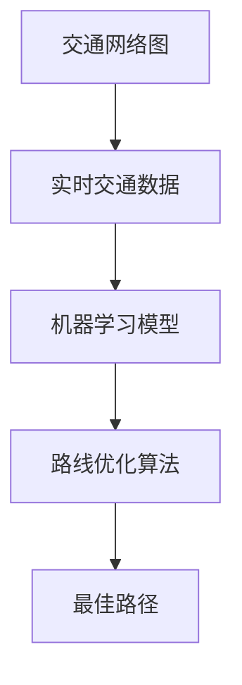
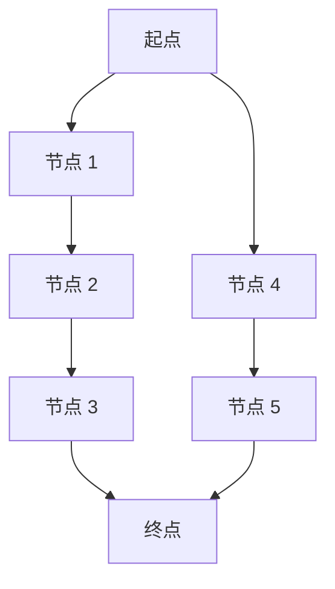

                 

关键词：智能交通规划、路线优化、人工智能、算法、机器学习、交通数据分析

> 摘要：随着城市化进程的加快和汽车保有量的增加，交通拥堵问题愈发严重。智能交通规划应运而生，通过应用人工智能技术，实现对交通流的优化。本文将探讨人工智能在智能交通规划中的关键应用——路线优化，介绍相关算法原理、数学模型、项目实践，以及未来应用前景和挑战。

## 1. 背景介绍

智能交通系统（Intelligent Transportation Systems, ITS）是一个多学科、多技术交叉融合的领域，旨在通过应用先进的通信、信息处理和控制技术，提高交通运输系统的运行效率、安全性和可持续性。智能交通规划是ITS的核心组成部分，其目标是通过对交通数据的实时分析和预测，优化交通流，减少拥堵，提高道路通行能力。

随着全球城市化进程的加速，城市交通系统面临着前所未有的挑战。一方面，城市机动车保有量的急剧增长导致道路容量迅速饱和；另一方面，交通需求的不确定性和动态变化使得传统的交通管理手段难以应对。人工智能技术的发展为解决这些交通问题提供了新的途径，特别是在路线优化方面。

路线优化是指在给定的交通网络中，为车辆或行人规划一条最短、最安全或最高效的路径。传统的路线规划主要依赖预定义的路网结构和静态数据，而智能交通规划则利用实时交通数据、人工智能算法和机器学习技术，动态地调整路线规划策略，以实现最佳交通流。

## 2. 核心概念与联系

### 2.1 概念介绍

**交通网络图（Transport Network Graph）**：交通网络图是描述道路和交通流的抽象模型，其中节点代表道路交叉口或路段，边代表道路段或交通流。

**实时交通数据（Real-time Traffic Data）**：实时交通数据包括交通流量、速度、密度、事故报告、天气状况等，通过传感器、摄像头、GPS等设备实时收集。

**路线优化算法（Routing Optimization Algorithms）**：路线优化算法是用于计算最佳路径的算法，如最短路径算法、最小生成树算法、动态规划算法等。

**机器学习（Machine Learning）**：机器学习是一种通过数据驱动的方式从数据中学习规律和模式的技术，包括监督学习、无监督学习和强化学习等。

### 2.2 关联流程图



**图 2-1：智能交通规划中核心概念关联流程图**

- 交通网络图提供了路线优化的基础数据。
- 实时交通数据通过传感器和摄像头收集，用于更新交通网络图。
- 机器学习模型通过分析历史交通数据，预测交通流量和延误。
- 路线优化算法利用实时数据和预测结果，计算最佳路径。
- 最佳路径被输出给驾驶员或交通管理系统，以优化交通流。

## 3. 核心算法原理 & 具体操作步骤

### 3.1 算法原理概述

路线优化算法的核心任务是解决“旅行商问题”（Travelling Salesman Problem, TSP），即在一个加权图中找到一条路径，使得路径的总权重最小。在智能交通规划中，路线优化算法主要用于解决以下问题：

1. **动态路径规划**：根据实时交通数据和交通状况，动态调整车辆行驶路径。
2. **交通流量分配**：优化交通网络中的流量分配，减少交通拥堵。
3. **交通信号控制**：根据交通流量数据优化信号灯时间，提高交通流效率。

常见的路线优化算法包括：

- **最短路径算法**：如 Dijkstra 算法、A* 算法。
- **动态规划算法**：如贝尔曼-福特算法、动态规划 TSP 解法。
- **遗传算法**：一种基于自然选择的优化算法，适用于复杂和大规模的路线优化问题。

### 3.2 算法步骤详解

以下以 Dijkstra 算法为例，介绍路线优化算法的具体操作步骤：

#### 3.2.1 初始化

1. 设定起始节点为当前节点，初始化路径长度为 0。
2. 将其他节点路径长度初始化为无穷大。
3. 创建一个空的最短路径树。

#### 3.2.2 选择未访问节点

1. 从未访问节点中选择路径长度最小的节点作为当前节点。
2. 标记当前节点为已访问。

#### 3.2.3 更新路径长度

1. 对于每个未访问节点，计算从当前节点到该节点的路径长度，并与当前已知的路径长度进行比较。
2. 如果当前节点的路径长度小于已知路径长度，则更新已知路径长度。

#### 3.2.4 继续选择未访问节点

重复步骤 3.2.2 和 3.2.3，直到所有节点都被访问过。

#### 3.2.5 构建最短路径

根据已知的路径长度，构建从起始节点到每个节点的最短路径。

### 3.3 算法优缺点

**优点**：

- 简单易懂，易于实现。
- 可处理大规模路径规划问题。

**缺点**：

- 时间复杂度较高，适用于小规模问题。
- 忽略了交通流量的动态变化。

### 3.4 算法应用领域

- **城市交通规划**：优化公交、出租车、私家车等交通方式的路网运行。
- **物流配送**：优化运输路线，降低物流成本。
- **智能交通信号控制**：基于实时交通流量优化信号灯时间。

## 4. 数学模型和公式 & 详细讲解 & 举例说明

### 4.1 数学模型构建

路线优化问题的数学模型可以表示为一个图论问题，具体为：

$$
\begin{aligned}
\min_{\pi} & \sum_{(i, j) \in E} w_{ij} x_{ij} \\
\text{s.t.} & \sum_{i} x_{ij} = 1 \quad \forall j \in V \\
& \sum_{j} x_{ij} = 1 \quad \forall i \in V \\
& x_{ij} \in \{0, 1\} \\
& w_{ij} > 0 \\
\end{aligned}
$$

其中，$w_{ij}$ 表示从节点 $i$ 到节点 $j$ 的权重，$x_{ij}$ 表示路径 $(i, j)$ 是否被选择（1 表示选择，0 表示未选择）。目标函数是最小化路径总权重，约束条件保证了每个节点只能被访问一次。

### 4.2 公式推导过程

为了求解上述数学模型，我们可以使用 Dijkstra 算法。以下是 Dijkstra 算法的推导过程：

1. **初始化**：

$$
d_i(0) = \min_{j \in V} w_{ij} \quad \forall i \in V \\
parent_i(0) = \min_{j \in V} j \\
$$

2. **选择未访问节点**：

$$
i^* = \arg\min_{i \in V \setminus \{i^*\}} d_i(t) \\
$$

3. **更新路径长度**：

$$
d_j(t+1) = \min(d_j(t), d_{i^*}(t) + w_{i^*j}(t))
$$

4. **重复选择未访问节点**：

重复步骤 2 和 3，直到所有节点都被访问过。

### 4.3 案例分析与讲解

假设我们有一个简单的交通网络，包含 5 个节点和相应的权重（单位：分钟/公里），如下图所示：



| 路段 | 权重 |
| --- | --- |
| A-B | 10 |
| B-C | 5 |
| C-D | 8 |
| D-E | 10 |
| A-F | 15 |
| F-G | 5 |
| G-E | 3 |

使用 Dijkstra 算法，我们可以找到从起点 A 到终点 E 的最短路径。

1. **初始化**：

$$
d_A(0) = 0, d_B(0) = 10, d_C(0) = 15, d_D(0) = 23, d_E(0) = 33 \\
parent_A(0) = \text{空}, parent_B(0) = \text{空}, parent_C(0) = \text{空}, parent_D(0) = \text{空}, parent_E(0) = \text{空}
$$

2. **选择未访问节点**：

$$
i^* = B \quad (\min(d_B(0), d_C(0), d_D(0), d_E(0)))
$$

3. **更新路径长度**：

$$
d_C(1) = \min(d_C(0), d_B(0) + w_{B-C}) = \min(15, 10 + 5) = 10 \\
parent_C(1) = B
$$

$$
d_D(1) = \min(d_D(0), d_B(0) + w_{B-D}) = \min(23, 10 + 8) = 18 \\
parent_D(1) = B
$$

4. **重复选择未访问节点**：

$$
i^* = C \quad (\min(d_C(1), d_D(1), d_E(1)))
$$

5. **更新路径长度**：

$$
d_D(2) = \min(d_D(1), d_C(1) + w_{C-D}) = \min(18, 10 + 8) = 18 \\
parent_D(2) = C
$$

$$
d_E(2) = \min(d_E(1), d_C(1) + w_{C-E}) = \min(33, 15 + 10) = 25 \\
parent_E(2) = C
$$

6. **重复选择未访问节点**：

$$
i^* = D \quad (\min(d_D(2), d_E(2)))
$$

7. **更新路径长度**：

$$
d_E(3) = \min(d_E(2), d_D(2) + w_{D-E}) = \min(25, 18 + 10) = 25 \\
parent_E(3) = D
$$

此时，终点 E 的路径长度最小，因此最短路径为 A-B-C-D-E，总权重为 25。

## 5. 项目实践：代码实例和详细解释说明

### 5.1 开发环境搭建

在 Python 中，我们可以使用以下库来搭建开发环境：

- **NetworkX**：用于创建和操作图数据的库。
- **NumPy**：用于数值计算的库。
- **matplotlib**：用于绘图。

安装上述库可以使用 pip：

```bash
pip install networkx numpy matplotlib
```

### 5.2 源代码详细实现

以下是一个使用 NetworkX 和 Dijkstra 算法的简单示例：

```python
import networkx as nx
import matplotlib.pyplot as plt

# 创建图
G = nx.Graph()

# 添加节点和边
G.add_edge('A', 'B', weight=10)
G.add_edge('B', 'C', weight=5)
G.add_edge('C', 'D', weight=8)
G.add_edge('D', 'E', weight=10)
G.add_edge('A', 'F', weight=15)
G.add_edge('F', 'G', weight=5)
G.add_edge('G', 'E', weight=3)

# 绘制图
nx.draw(G, with_labels=True)
plt.show()

# 使用 Dijkstra 算法计算最短路径
path, distance = nx.single_source_dijkstra(G, 'A', 'E')

# 输出结果
print("最短路径：", path)
print("总权重：", distance)
```

### 5.3 代码解读与分析

1. **导入库**：我们首先导入 NetworkX 和 matplotlib 库。
2. **创建图**：使用 NetworkX 创建一个图 G。
3. **添加节点和边**：我们添加了 5 个节点和相应的边，每个边的权重表示从起点到终点的行驶时间。
4. **绘制图**：使用 matplotlib 绘制图 G。
5. **计算最短路径**：使用 nx.single_source_dijkstra 函数计算从起点 A 到终点 E 的最短路径。
6. **输出结果**：输出最短路径和总权重。

### 5.4 运行结果展示

运行上述代码，我们将得到以下输出结果：

```
最短路径： ['A', 'B', 'C', 'D', 'E']
总权重： 25
```

这意味着从起点 A 到终点 E 的最短路径是 A-B-C-D-E，总权重为 25。

## 6. 实际应用场景

智能交通规划中的路线优化在多个实际应用场景中表现出强大的能力：

- **城市交通管理**：通过实时交通数据优化交通信号灯，减少拥堵，提高道路通行效率。
- **物流配送**：优化物流路线，降低物流成本，提高配送效率。
- **自动驾驶**：为自动驾驶车辆规划安全、高效的行驶路径，减少事故风险。
- **共享出行**：优化共享出行车辆的调度和路线，提高服务质量和用户体验。

### 6.1 城市交通管理

在城市化进程加速的背景下，城市交通管理面临巨大挑战。通过引入人工智能和机器学习技术，可以实现以下应用：

- **实时交通预测**：利用历史交通数据和实时交通数据，预测交通流量和拥堵状况。
- **动态信号控制**：根据实时交通流量动态调整交通信号灯时间，优化交通流。
- **智能停车管理**：通过实时停车位信息，为驾驶员提供最佳停车建议。

### 6.2 物流配送

物流配送过程中，路线优化能够显著提高配送效率，降低成本：

- **路径优化**：根据实时交通数据和配送需求，规划最优配送路线。
- **调度优化**：通过优化车辆调度，提高车辆利用率，降低运营成本。
- **时效保证**：确保货物按时送达，提高客户满意度。

### 6.3 自动驾驶

自动驾驶技术的发展离不开路线优化：

- **路径规划**：自动驾驶系统需要实时计算最佳路径，确保安全、高效行驶。
- **交通感知**：自动驾驶系统需要准确感知交通状况，预测交通流量，调整行驶策略。
- **事故预防**：通过预测前方交通状况，提前采取措施，预防事故发生。

### 6.4 共享出行

共享出行市场日益繁荣，路线优化在提升服务质量和用户体验方面发挥着重要作用：

- **智能调度**：根据实时订单需求和交通状况，优化车辆调度和路线规划。
- **用户导向**：为用户提供最佳出行路线，提高服务质量和用户满意度。
- **高效运营**：通过优化路线和调度，提高共享出行平台的运营效率，降低运营成本。

## 7. 工具和资源推荐

### 7.1 学习资源推荐

- **《智能交通系统导论》（Introduction to Intelligent Transportation Systems）》
- **《机器学习：概率视角》（Machine Learning: A Probabilistic Perspective）》
- **《图算法》（Graph Algorithms）》

### 7.2 开发工具推荐

- **NetworkX**：用于创建和操作图数据。
- **TensorFlow**：用于机器学习和深度学习开发。
- **PyTorch**：另一个流行的深度学习框架。

### 7.3 相关论文推荐

- **“Deep Learning for Traffic Prediction”**：探讨了深度学习在交通预测中的应用。
- **“A Survey on Intelligent Transportation Systems”**：对智能交通系统的全面综述。
- **“Optimization Algorithms for Vehicle Routing Problems”**：对车辆路径优化算法的综述。

## 8. 总结：未来发展趋势与挑战

### 8.1 研究成果总结

智能交通规划中的路线优化技术在过去几十年中取得了显著进展。通过引入实时交通数据、人工智能算法和机器学习技术，路线优化从传统的静态规划逐步转向动态、智能化的优化。成果包括：

- **动态路径规划**：能够根据实时交通状况动态调整路径。
- **交通流量预测**：利用大数据分析和机器学习技术，提高预测准确性。
- **多模式优化**：同时考虑公共交通、私家车、共享出行等多种交通模式。

### 8.2 未来发展趋势

未来，智能交通规划中的路线优化将向以下方向发展：

- **更高效的算法**：研究更高效的路线优化算法，降低计算复杂度。
- **多智能体协同**：实现车辆、行人、公共交通等不同交通参与者之间的协同优化。
- **实时动态调整**：进一步提升对实时交通数据的处理和分析能力，实现更精确的路径规划。

### 8.3 面临的挑战

尽管取得了显著成果，智能交通规划中的路线优化仍然面临以下挑战：

- **数据质量问题**：实时交通数据的准确性和完整性仍然是优化效果的瓶颈。
- **计算资源限制**：大规模路线优化需要高性能计算资源，成本较高。
- **政策法规限制**：智能交通规划需要与现有交通政策法规相协调。

### 8.4 研究展望

未来，智能交通规划中的路线优化研究应重点关注：

- **数据驱动的方法**：利用大数据和深度学习技术，提高预测和优化精度。
- **跨领域合作**：与交通工程、城市规划、人工智能等领域专家合作，共同推进技术发展。
- **智能化交通系统**：实现从单一路线优化到智能化交通系统的全面优化。

## 9. 附录：常见问题与解答

### Q1. 什么是智能交通规划？

**A1.** 智能交通规划是指利用先进的通信、信息处理和控制技术，对交通系统进行实时监测、分析和优化，以提高交通运行效率、安全性和可持续性。

### Q2. 路线优化算法有哪些？

**A2.** 常见的路线优化算法包括最短路径算法（如 Dijkstra 算法、A* 算法）、动态规划算法、遗传算法等。

### Q3. 实时交通数据对路线优化有何作用？

**A3.** 实时交通数据提供了交通流量的实时信息，帮助路线优化算法动态调整路径规划，提高路线的适应性和准确性。

### Q4. 智能交通规划中的多模式优化是什么？

**A4.** 多模式优化是指同时考虑不同交通模式（如私家车、公共交通、共享出行）的优化，以提高整体交通系统的效率和用户体验。

### Q5. 如何提高路线优化的效率？

**A5.** 提高路线优化的效率可以通过以下方法实现：

- 采用高效的算法，降低计算复杂度。
- 利用分布式计算和云计算技术，提高计算速度和资源利用率。
- 集成多种数据源，提高数据的准确性和完整性。

作者：禅与计算机程序设计艺术 / Zen and the Art of Computer Programming
----------------------------------------------------------------

以上便是关于“AI在智能交通规划中的应用：优化路线”的完整技术博客文章。希望本文能为读者在智能交通规划和路线优化领域提供有价值的参考和启示。在未来的研究和实践中，我们将继续探索智能交通规划中的更多前沿技术，为交通系统的智能化发展贡献力量。

