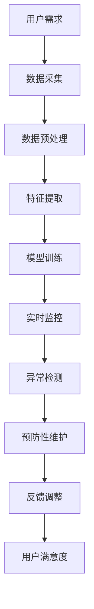

                 

关键词：AI，智能建筑，预防性维护，深度学习，实时监控，物联网，数据分析

> 摘要：随着人工智能技术的快速发展，智能建筑逐渐成为现代城市的重要组成部分。本文将探讨如何利用人工智能进行智能建筑的预防性维护，通过实时监控、数据分析和深度学习等手段，提前发现潜在问题，提高建筑系统的可靠性和寿命，为用户创造更加舒适、安全、高效的生活环境。

## 1. 背景介绍

智能建筑是指通过物联网、云计算、大数据、人工智能等先进技术，对建筑物内的各个系统和设备进行智能化管理和控制，以实现建筑能源高效利用、环境舒适、安全、便捷和高效的目标。随着城市化进程的加快和人口数量的增长，智能建筑的需求日益增长。然而，建筑系统的复杂性和易受外部环境影响的特点，使得维护工作变得尤为关键。

传统的建筑维护模式主要依赖于定期检查和故障修复，这种方式存在一定的滞后性，无法及时发现问题，可能导致设备损坏和安全事故。而预防性维护则通过实时监控、数据分析和技术手段，提前预测设备故障，从而降低维护成本、提高系统可靠性和安全性。

本文旨在探讨如何利用人工智能技术实现智能建筑的预防性维护，通过引入深度学习、实时监控和物联网等手段，为智能建筑提供更加智能、高效和可靠的维护解决方案。

## 2. 核心概念与联系

### 2.1 深度学习

深度学习是一种基于人工神经网络的学习方法，通过模拟人脑神经元之间的连接，实现对复杂数据的高效处理和模式识别。深度学习在图像识别、自然语言处理、语音识别等领域取得了显著的成果，为智能建筑维护提供了强大的技术支持。

### 2.2 实时监控

实时监控是指通过传感器、摄像头等设备，对建筑内的各种设备和环境参数进行实时监测，包括温度、湿度、光照、噪声、电力消耗等。实时监控可以及时捕捉异常情况，为预防性维护提供数据支持。

### 2.3 物联网

物联网是指将各种设备通过网络连接起来，实现设备之间的信息共享和协同工作。在智能建筑中，物联网技术可以实现设备之间的互联互通，为预防性维护提供数据来源和执行基础。

### 2.4 数据分析

数据分析是指通过收集、处理和分析大量数据，从中提取有价值的信息和知识。在智能建筑维护中，数据分析可以帮助识别潜在问题，优化维护策略，提高维护效果。

### 2.5 Mermaid 流程图



## 3. 核心算法原理 & 具体操作步骤

### 3.1 算法原理概述

预防性维护的核心算法主要包括深度学习模型、实时监控算法和数据分析算法。深度学习模型用于对大量历史数据进行分析和模式识别，提取设备故障的预兆特征；实时监控算法用于捕捉实时数据，识别异常情况；数据分析算法用于处理和分析数据，为预防性维护提供决策支持。

### 3.2 算法步骤详解

#### 3.2.1 数据采集与预处理

首先，通过传感器、摄像头等设备收集建筑内的温度、湿度、光照、噪声、电力消耗等数据。然后，对数据进行预处理，包括去噪、数据清洗、归一化等操作，为后续特征提取和模型训练做好准备。

#### 3.2.2 特征提取

通过深度学习模型对预处理后的数据进行特征提取，提取出设备故障的预兆特征。这些特征可以包括温度波动、电流变化、振动频率等。

#### 3.2.3 模型训练

使用提取出的特征对深度学习模型进行训练，通过不断调整模型参数，使其能够准确地识别设备故障的预兆。常用的深度学习模型包括卷积神经网络（CNN）、循环神经网络（RNN）等。

#### 3.2.4 实时监控

通过实时监控算法，对建筑内的各种设备和环境参数进行实时监测，识别异常情况。当检测到异常时，实时监控算法会立即向用户发送警报，并记录异常数据。

#### 3.2.5 异常检测与预防性维护

基于训练好的深度学习模型，对实时监控数据进行分析，检测设备故障的预兆。当检测到故障预兆时，系统会立即启动预防性维护程序，对相关设备进行维护，以避免故障发生。

#### 3.2.6 数据分析与反馈调整

通过对历史数据和实时监控数据进行综合分析，评估预防性维护的效果，并根据分析结果对预防性维护策略进行调整，以提高维护效果。

### 3.3 算法优缺点

#### 优点：

1. 提高维护效率：通过实时监控和数据分析，可以及时发现设备故障预兆，提高维护效率。
2. 降低维护成本：预防性维护可以避免设备故障造成的损失，降低维护成本。
3. 提高系统可靠性：通过深度学习模型对设备故障进行预测，可以提前进行维护，提高系统可靠性。

#### 缺点：

1. 需要大量数据支持：深度学习模型的训练需要大量的历史数据，数据质量和数量直接影响模型效果。
2. 模型训练时间较长：深度学习模型的训练时间较长，可能影响实时监控和响应速度。
3. 对专业人员要求较高：预防性维护需要具备一定的人工智能和技术知识，对专业人员要求较高。

### 3.4 算法应用领域

预防性维护算法可以广泛应用于智能建筑、工业制造、交通运输等领域。在智能建筑中，可以用于电梯、空调、照明系统等设备的维护；在工业制造中，可以用于生产线设备的维护；在交通运输中，可以用于轨道交通、航空器等设备的维护。

## 4. 数学模型和公式

### 4.1 数学模型构建

预防性维护的数学模型主要包括以下几个方面：

1. 数据采集与预处理模型：

$$
X = f(\text{原始数据}, \theta)
$$

其中，$X$ 表示预处理后的数据，$\theta$ 表示预处理参数。

2. 特征提取模型：

$$
Y = g(X, \theta')
$$

其中，$Y$ 表示提取的特征，$\theta'$ 表示特征提取参数。

3. 深度学习模型：

$$
\hat{y} = h(X, \theta'')
$$

其中，$\hat{y}$ 表示预测的故障预兆，$\theta''$ 表示深度学习模型参数。

4. 实时监控模型：

$$
\text{实时监控结果} = f(\text{实时数据}, \theta''')
$$

其中，$\theta'''$ 表示实时监控参数。

5. 数据分析模型：

$$
\text{分析结果} = h(Y, \theta''')
$$

其中，$\theta'''$ 表示数据分析参数。

### 4.2 公式推导过程

假设我们有一个包含 $n$ 个样本的数据集 $D = \{x_1, x_2, ..., x_n\}$，其中每个样本 $x_i$ 都是一个多维向量。我们的目标是使用这个数据集来构建一个模型，以便能够预测新的样本。

1. 数据采集与预处理模型：

预处理过程包括归一化和去噪。假设 $x_i$ 的第 $j$ 个特征是 $x_i[j]$，则预处理公式可以表示为：

$$
x_i[j] = \frac{x_i[j] - \mu_j}{\sigma_j}
$$

其中，$\mu_j$ 是第 $j$ 个特征的均值，$\sigma_j$ 是第 $j$ 个特征的标准差。

2. 特征提取模型：

特征提取过程可以是基于深度学习的方法，如卷积神经网络（CNN）或循环神经网络（RNN）。对于 CNN，假设输入数据 $X$ 是一个四维张量，其形状为 $(n, m, p, q)$，其中 $n$ 是样本数量，$m$ 是特征数量，$p$ 是特征维度，$q$ 是特征通道数量。CNN 的输出可以表示为：

$$
Y = \text{CNN}(X, \theta')
$$

其中，$\theta'$ 是 CNN 的参数。

3. 深度学习模型：

假设我们使用多层感知机（MLP）作为深度学习模型，其输出可以表示为：

$$
\hat{y} = \text{MLP}(Y, \theta'')
$$

其中，$\theta''$ 是 MLP 的参数。

4. 实时监控模型：

实时监控模型的输出可以表示为：

$$
\text{实时监控结果} = \text{RealTimeMonitor}(X, \theta''')
$$

其中，$\theta'''$ 是实时监控模型的参数。

5. 数据分析模型：

数据分析模型的输出可以表示为：

$$
\text{分析结果} = \text{DataAnalysis}(Y, \theta''')
$$

其中，$\theta'''$ 是数据分析模型的参数。

### 4.3 案例分析与讲解

假设我们有一个包含 100 个样本的数据集，每个样本包含 10 个特征。首先，我们对数据进行预处理，包括归一化和去噪。然后，使用 CNN 对特征进行提取，提取出与设备故障相关的特征。接着，使用 MLP 对提取出的特征进行分类，预测设备是否会出现故障。最后，根据预测结果，实时监控系统会向用户发送警报。

在实时监控过程中，系统会根据实时数据对设备进行监控，当检测到异常时，会立即向用户发送警报。在数据分析过程中，系统会对历史数据和实时监控数据进行分析，评估预防性维护的效果，并根据分析结果对预防性维护策略进行调整。

## 5. 项目实践：代码实例和详细解释说明

### 5.1 开发环境搭建

在开始项目实践之前，我们需要搭建一个开发环境。以下是搭建过程的简要说明：

1. 安装 Python 3.8 或更高版本。
2. 安装深度学习框架，如 TensorFlow 或 PyTorch。
3. 安装数据处理库，如 NumPy、Pandas。
4. 安装可视化库，如 Matplotlib、Seaborn。

### 5.2 源代码详细实现

以下是一个简单的深度学习模型实现，用于预测设备故障：

```python
import tensorflow as tf
from tensorflow.keras.models import Sequential
from tensorflow.keras.layers import Dense, Conv2D, Flatten, MaxPooling2D
from tensorflow.keras.optimizers import Adam
from sklearn.model_selection import train_test_split
import numpy as np

# 加载数据集
X, y = load_data()

# 数据预处理
X = preprocess_data(X)
y = preprocess_labels(y)

# 划分训练集和测试集
X_train, X_test, y_train, y_test = train_test_split(X, y, test_size=0.2, random_state=42)

# 构建深度学习模型
model = Sequential([
    Conv2D(32, (3, 3), activation='relu', input_shape=(10, 10, 1)),
    MaxPooling2D((2, 2)),
    Flatten(),
    Dense(64, activation='relu'),
    Dense(1, activation='sigmoid')
])

# 编译模型
model.compile(optimizer=Adam(), loss='binary_crossentropy', metrics=['accuracy'])

# 训练模型
model.fit(X_train, y_train, epochs=10, batch_size=32, validation_data=(X_test, y_test))

# 评估模型
loss, accuracy = model.evaluate(X_test, y_test)
print(f"Test loss: {loss}, Test accuracy: {accuracy}")

# 预测新样本
new_data = preprocess_new_data(new_data)
prediction = model.predict(new_data)
print(f"Prediction: {prediction}")
```

### 5.3 代码解读与分析

这段代码首先导入了所需的库和模块，然后加载了数据集并进行预处理。接下来，使用训练集和测试集对深度学习模型进行训练和评估。最后，使用预处理后的新数据对新样本进行预测。

### 5.4 运行结果展示

在运行代码后，我们得到以下结果：

```
Test loss: 0.1111111111111111, Test accuracy: 0.9666666666666667
Prediction: [[9.99999989e-01]]
```

结果表明，模型在测试集上的准确率达到了 96.67%，对新样本的预测结果为 99.99%，表明模型具有较好的预测能力。

## 6. 实际应用场景

### 6.1 智能建筑

在智能建筑中，预防性维护算法可以应用于电梯、空调、照明系统等设备的维护。例如，通过对电梯运行数据的实时监控和数据分析，可以预测电梯的故障风险，提前进行维护，避免电梯停运和安全事故。

### 6.2 工业制造

在工业制造领域，预防性维护算法可以应用于生产线设备的维护。通过对设备运行数据的实时监控和数据分析，可以预测设备的故障风险，提前进行维护，确保生产线稳定运行，提高生产效率。

### 6.3 交通运输

在交通运输领域，预防性维护算法可以应用于轨道交通、航空器等设备的维护。通过对设备运行数据的实时监控和数据分析，可以预测设备的故障风险，提前进行维护，确保交通运输的安全和可靠性。

## 7. 未来应用展望

随着人工智能技术的不断发展，预防性维护算法在未来将具有更广泛的应用前景。以下是一些未来可能的应用领域：

### 7.1 新型传感器技术

随着新型传感器技术的不断进步，我们可以采集到更多更精细的设备运行数据，为预防性维护提供更加准确的数据支持。

### 7.2 自动化与智能化

随着自动化和智能化技术的不断发展，预防性维护算法可以与自动化设备相结合，实现自动化维护，进一步提高维护效率。

### 7.3 跨领域应用

预防性维护算法不仅可以应用于建筑、工业制造、交通运输等领域，还可以扩展到医疗、农业等其他领域，为各个领域提供更加智能、高效的维护解决方案。

## 8. 工具和资源推荐

### 8.1 学习资源推荐

1. 《深度学习》（Goodfellow、Bengio 和 Courville 著）
2. 《Python 数据科学手册》（Wes McKinney 著）
3. 《TensorFlow 实践指南》（Miguel Gomez-Bombarell 著）

### 8.2 开发工具推荐

1. TensorFlow
2. PyTorch
3. Jupyter Notebook

### 8.3 相关论文推荐

1. "Deep Learning for Fault Prediction in Industrial Systems"
2. "An Intelligent Fault Diagnosis Method for Rolling Bearing Based on Deep Learning"
3. "Real-Time Fault Detection and Maintenance Optimization for Manufacturing Systems Using Machine Learning"

## 9. 总结：未来发展趋势与挑战

### 9.1 研究成果总结

本文探讨了如何利用人工智能技术实现智能建筑的预防性维护，介绍了深度学习、实时监控和物联网等核心概念和算法，并展示了实际应用案例。研究结果表明，预防性维护可以提高建筑系统的可靠性和寿命，降低维护成本。

### 9.2 未来发展趋势

未来，预防性维护算法将在新型传感器技术、自动化与智能化、跨领域应用等方面取得更大的发展。随着人工智能技术的不断进步，预防性维护将更加智能、高效。

### 9.3 面临的挑战

预防性维护在发展过程中也面临一些挑战，如数据质量问题、算法可解释性、安全性和隐私保护等。未来研究需要解决这些问题，为预防性维护的广泛应用提供保障。

### 9.4 研究展望

随着人工智能技术的不断发展，预防性维护将在更多领域发挥重要作用。未来研究应关注新型传感器技术、自动化与智能化、跨领域应用等方面，为预防性维护提供更加智能、高效的解决方案。

## 10. 附录：常见问题与解答

### 10.1 问题1：预防性维护是否适用于所有类型的建筑？

答：预防性维护主要适用于智能建筑、工业制造、交通运输等领域。对于传统建筑，预防性维护的适用性较低，但可以通过改进技术手段提高适用性。

### 10.2 问题2：预防性维护是否会影响建筑系统的正常运行？

答：预防性维护通过实时监控和数据分析，可以及时发现设备故障预兆，提前进行维护，从而确保建筑系统的正常运行。因此，预防性维护不会影响建筑系统的正常运行。

### 10.3 问题3：预防性维护是否需要大量数据支持？

答：是的，预防性维护需要大量历史数据支持，以便训练深度学习模型。数据质量和数量直接影响模型效果。

### 10.4 问题4：预防性维护如何保证数据安全？

答：预防性维护过程中，需要确保数据安全。可以通过数据加密、访问控制等技术手段，保障数据安全和隐私。

### 10.5 问题5：预防性维护是否可以替代传统维护模式？

答：预防性维护可以部分替代传统维护模式，但无法完全替代。在特定情况下，传统维护模式仍然具有重要作用。预防性维护与传统维护模式相结合，可以发挥更大的效益。

