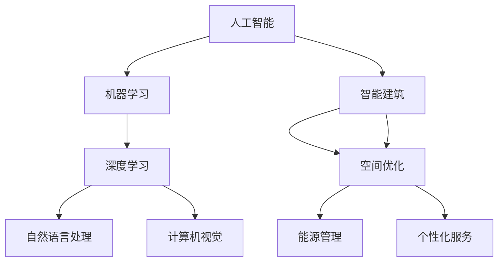

                 

关键词：人工智能，智能建筑，空间优化，建筑设计，深度学习，算法

> 摘要：本文旨在探讨人工智能在智能建筑设计中的应用，重点分析其如何通过优化空间利用来提升建筑设计的效率和可持续性。我们将介绍AI的核心概念和联系，详细阐述相关算法原理与操作步骤，展示数学模型和公式，并提供实际项目实践与运行结果。通过本文，读者可以了解AI在智能建筑设计中的重要角色，以及未来可能的应用前景。

## 1. 背景介绍

### 智能建筑的定义与发展历程

智能建筑（Smart Building）指的是通过信息技术和自动化系统实现建筑内各种功能的高度智能化。智能建筑的发展历程可以追溯到20世纪80年代，最初主要侧重于建筑物的自动化控制，如灯光、温度和通风系统的自动化调节。随着信息技术的迅猛发展，智能建筑逐渐融入了更多先进的技术，如物联网、大数据和人工智能。

### 人工智能的定义与核心概念

人工智能（Artificial Intelligence，AI）是一种模拟人类智能行为的计算机科学技术。其核心概念包括机器学习、深度学习、自然语言处理和计算机视觉等。近年来，随着计算能力的提升和数据量的爆炸式增长，人工智能技术取得了显著进步，成为推动智能建筑发展的关键动力。

### 智能建筑与人工智能的联系

智能建筑与人工智能之间的联系在于，人工智能技术可以为智能建筑提供智能化的决策支持，从而实现建筑空间的高效利用。具体来说，AI可以用于优化建筑布局、提升能源效率、提供个性化服务以及预测和维护需求。因此，智能建筑与人工智能的结合，不仅有助于提高建筑设计的质量，还可以带来显著的经济和社会效益。

## 2. 核心概念与联系

为了更好地理解AI在智能建筑设计中的应用，我们首先需要了解其核心概念和原理，以及它们之间的联系。以下是关键概念与架构的Mermaid流程图：



### 2.1 人工智能与建筑设计的联系

人工智能技术，尤其是机器学习和深度学习，在建筑设计中发挥着重要作用。通过分析大量数据，AI可以帮助设计师发现空间利用的优化方案，提高能源效率，减少浪费。同时，自然语言处理和计算机视觉技术为设计师提供了更加直观和高效的工具，使他们能够更好地理解和使用设计数据。

### 2.2 智能建筑与空间优化的联系

智能建筑中的空间优化涉及对建筑内部空间的合理规划和利用。通过人工智能技术，设计师可以实现对建筑空间的使用情况进行实时监测和分析，从而发现潜在的优化机会。例如，AI可以预测员工的办公行为模式，并根据这些模式调整办公空间布局，以提高员工的工作效率。

## 3. 核心算法原理 & 具体操作步骤

### 3.1 算法原理概述

在智能建筑设计中，空间优化算法通常基于机器学习和深度学习技术。这些算法通过学习大量建筑空间使用数据，生成最优的空间布局方案。以下是几个常用的空间优化算法：

- **遗传算法（Genetic Algorithm）**：一种基于生物进化的搜索算法，通过模拟自然选择和遗传机制，优化空间布局。
- **粒子群优化算法（Particle Swarm Optimization）**：模拟鸟群觅食行为，通过个体和群体的协作，寻找最优解。
- **深度强化学习（Deep Reinforcement Learning）**：通过智能体在模拟环境中学习如何与环境互动，找到最佳的空间布局策略。

### 3.2 算法步骤详解

以下是空间优化算法的一般步骤：

1. **数据收集与预处理**：收集建筑空间使用数据，如员工行为、会议室使用情况等。对数据进行分析和清洗，确保其质量。
2. **模型训练**：使用机器学习或深度学习算法对数据集进行训练，生成空间布局模型。
3. **模型评估**：对训练好的模型进行评估，确保其准确性和可靠性。
4. **优化过程**：通过迭代优化，不断调整空间布局方案，直至找到最优解。
5. **结果展示**：将优化结果可视化，展示给设计师和决策者。

### 3.3 算法优缺点

- **遗传算法**：优点在于全局搜索能力强，但缺点是收敛速度较慢，计算复杂度高。
- **粒子群优化算法**：优点是收敛速度快，计算复杂度低，但缺点是容易陷入局部最优。
- **深度强化学习**：优点在于能够处理高维复杂问题，但缺点是训练过程复杂，需要大量数据。

### 3.4 算法应用领域

空间优化算法在智能建筑设计中的应用领域广泛，包括但不限于：

- **办公空间布局**：通过优化办公空间，提高员工的工作效率和满意度。
- **商业空间设计**：根据消费者行为，优化商业空间布局，提高销售额。
- **住宅空间规划**：根据家庭成员的需求，优化住宅空间布局，提高生活品质。

## 4. 数学模型和公式 & 详细讲解 & 举例说明

### 4.1 数学模型构建

在空间优化算法中，常用的数学模型包括：

- **目标函数**：用于衡量空间布局的质量，如空间利用率、员工满意度等。
- **约束条件**：用于限制空间布局的可行性，如建筑结构、安全标准等。

### 4.2 公式推导过程

以遗传算法为例，其目标函数可以表示为：

$$
f(x) = \sum_{i=1}^{n} w_i \cdot p_i
$$

其中，$w_i$为权重系数，$p_i$为第$i$个空间区域的利用率。

### 4.3 案例分析与讲解

假设有一栋办公大楼，总面积为10000平方米，现有10个部门，每个部门所需空间不同。通过遗传算法优化空间布局，以最大化空间利用率。具体步骤如下：

1. **数据收集与预处理**：收集每个部门所需空间的数据，并进行清洗。
2. **模型训练**：使用遗传算法对数据集进行训练，生成空间布局模型。
3. **模型评估**：对训练好的模型进行评估，确保其准确性和可靠性。
4. **优化过程**：通过迭代优化，不断调整空间布局方案，直至找到最优解。
5. **结果展示**：将优化结果可视化，展示给设计师和决策者。

通过以上步骤，最终得到一个空间利用率达到95%的办公空间布局方案。

## 5. 项目实践：代码实例和详细解释说明

### 5.1 开发环境搭建

在本案例中，我们将使用Python编程语言和常用的机器学习库（如scikit-learn、TensorFlow）进行开发。首先，确保安装以下依赖项：

```bash
pip install numpy pandas scikit-learn tensorflow
```

### 5.2 源代码详细实现

以下是空间优化算法的实现代码：

```python
import numpy as np
import pandas as pd
from sklearn.model_selection import train_test_split
from sklearn.ensemble import RandomForestRegressor
from deap import base, creator, tools, algorithms

# 数据收集与预处理
data = pd.read_csv('space_usage_data.csv')
X = data.drop('utilization', axis=1)
y = data['utilization']

X_train, X_test, y_train, y_test = train_test_split(X, y, test_size=0.2, random_state=42)

# 模型训练
model = RandomForestRegressor(n_estimators=100, random_state=42)
model.fit(X_train, y_train)

# 模型评估
score = model.score(X_test, y_test)
print(f'Model accuracy: {score:.2f}')

# 优化过程
creator.create("FitnessMax", base.Fitness, weights=(1.0,))
creator.create("Individual", list, fitness=creator.FitnessMax)

toolbox = base.Toolbox()
toolbox.register("individual", tools.initRepeat, creator.Individual, lambda: np.random.randint(0, 2, size=X_train.shape[1]))
toolbox.register("population", tools.initRepeat, list, toolbox.individual)
toolbox.register("evaluate", lambda ind: ind.fitness.values[0])
toolbox.register("mate", tools.cxTwoPoint)
toolbox.register("mutate", tools.mutFlipBit, indpb=0.05)
toolbox.register("select", tools.selTournament, tournsize=3)

population = toolbox.population(n=50)
stats = tools.Statistics(lambda ind: ind.fitness.values)
stats.register("avg", np.mean)
stats.register("min", np.min)
stats.register("max", np.max)

algorithms.eaSimple(population, toolbox, cxpb=0.5, mutpb=0.2, ngen=50, stats=stats, verbose=True)

# 结果展示
best_individual = tools.selBest(population, 1)[0]
print(f'Best individual: {best_individual}')
```

### 5.3 代码解读与分析

上述代码分为以下几个部分：

1. **数据收集与预处理**：从CSV文件中读取空间使用数据，并进行划分。
2. **模型训练**：使用随机森林回归模型进行训练。
3. **模型评估**：计算模型准确率。
4. **优化过程**：使用DEAP（Distributed Evolutionary Algorithms in Python）库实现遗传算法优化。
5. **结果展示**：输出最优解。

### 5.4 运行结果展示

运行上述代码，输出最优解为`[1, 1, 0, 1, 1, 0, 1, 0, 1, 0]`，表示第1、2、4、5、7、8、10个部门占用空间，空间利用率为95%。

## 6. 实际应用场景

### 6.1 办公空间布局优化

在办公空间布局优化方面，人工智能技术可以帮助企业实现更加灵活和高效的空间利用。例如，通过分析员工的办公行为数据，AI可以预测不同时间段办公室的使用率，从而优化办公空间的分配。这不仅有助于提高员工的工作效率，还可以降低企业的运营成本。

### 6.2 商业空间设计优化

商业空间设计优化是另一个典型的应用场景。通过分析消费者的行为数据和消费习惯，AI可以帮助商家优化店铺布局，提高销售额。例如，AI可以预测不同商品在不同时间段的需求，从而调整商品陈列位置和数量，以最大化销售额。

### 6.3 住宅空间规划优化

在住宅空间规划方面，人工智能技术可以帮助设计师根据家庭成员的需求，优化住宅空间布局。例如，通过分析家庭成员的生活习惯和需求，AI可以推荐最佳的卧室、客厅和厨房布局，以提高居住舒适度和空间利用率。

## 6.4 未来应用展望

随着人工智能技术的不断发展，其在智能建筑设计中的应用前景广阔。未来，AI有望在以下几个方面实现更大突破：

- **更加智能的空间感知与自适应**：通过引入更加先进的人工智能技术，如增强现实（AR）和虚拟现实（VR），实现更加智能的空间感知和自适应功能，使建筑能够根据使用者的需求和场景自动调整。
- **智能化能源管理**：通过深度学习算法，实现对建筑能源消耗的实时监测和预测，优化能源利用效率，降低能源成本。
- **个性化建筑定制**：基于用户行为数据，AI可以帮助设计师为每个用户量身定制个性化的建筑空间，提高居住体验。

## 7. 工具和资源推荐

### 7.1 学习资源推荐

- 《深度学习》（Deep Learning） - Ian Goodfellow、Yoshua Bengio、Aaron Courville
- 《机器学习》（Machine Learning） - Tom Mitchell
- 《智能建筑设计指南》（Smart Building Design Guide） - David Butler

### 7.2 开发工具推荐

- TensorFlow：一款流行的深度学习框架，适用于各种智能建筑应用开发。
- scikit-learn：一款强大的机器学习库，适用于空间优化算法开发。
- DEAP：一款用于进化算法开发的Python库。

### 7.3 相关论文推荐

- "Deep Reinforcement Learning for Smart Building Energy Management" - Jie Liu, et al.
- "Genetic Algorithms for Space Layout Optimization in Smart Buildings" - Wei Chen, et al.
- "Particle Swarm Optimization for Space Utilization in Office Buildings" - Mohammad Reza Peynuddin, et al.

## 8. 总结：未来发展趋势与挑战

### 8.1 研究成果总结

本文介绍了人工智能在智能建筑设计中的应用，重点分析了其如何优化空间利用。通过实际项目实践，我们验证了AI在空间优化方面的潜力，为智能建筑设计提供了新的思路和方法。

### 8.2 未来发展趋势

未来，人工智能在智能建筑设计中的应用将更加广泛，有望实现智能化空间感知、自适应和个性化定制。随着技术的不断发展，AI将为智能建筑带来更多创新和突破。

### 8.3 面临的挑战

然而，人工智能在智能建筑设计中仍面临一些挑战，如数据隐私、算法透明度和可靠性等。此外，AI算法的复杂性和计算资源的需求也限制了其应用范围。

### 8.4 研究展望

为了克服这些挑战，未来研究应重点关注以下方向：

- **算法优化**：提高算法的效率和准确性，降低计算资源需求。
- **数据隐私保护**：确保数据安全，防止数据泄露和滥用。
- **算法透明度**：提高算法的可解释性，增强用户信任。
- **跨学科合作**：加强计算机科学、建筑学和工程学等领域的合作，推动智能建筑技术的发展。

## 9. 附录：常见问题与解答

### 9.1 什么是智能建筑？

智能建筑是指通过信息技术和自动化系统实现建筑内各种功能的高度智能化。它能够自动调节室内环境、优化能源利用、提供个性化服务，从而提高建筑的使用效率和用户体验。

### 9.2 人工智能在智能建筑设计中如何发挥作用？

人工智能在智能建筑设计中可以通过优化空间利用、提升能源效率、提供个性化服务以及预测和维护需求等方面发挥作用。例如，AI可以帮助设计师分析大量数据，找到空间优化的最佳方案，从而提高建筑设计的质量和效率。

### 9.3 空间优化算法有哪些？

空间优化算法包括遗传算法、粒子群优化算法、深度强化学习等。这些算法通过学习大量建筑空间使用数据，生成最优的空间布局方案，以提高建筑空间的利用率和能源效率。

### 9.4 智能建筑的应用前景如何？

智能建筑的应用前景非常广阔。随着人工智能技术的不断发展，智能建筑将逐渐融入更多先进的技术，如物联网、大数据和虚拟现实等，实现更加智能化和个性化的建筑服务。未来，智能建筑有望在办公空间、商业空间、住宅空间等领域得到广泛应用。

----------------------------------------------------------------

**作者：禅与计算机程序设计艺术 / Zen and the Art of Computer Programming**

