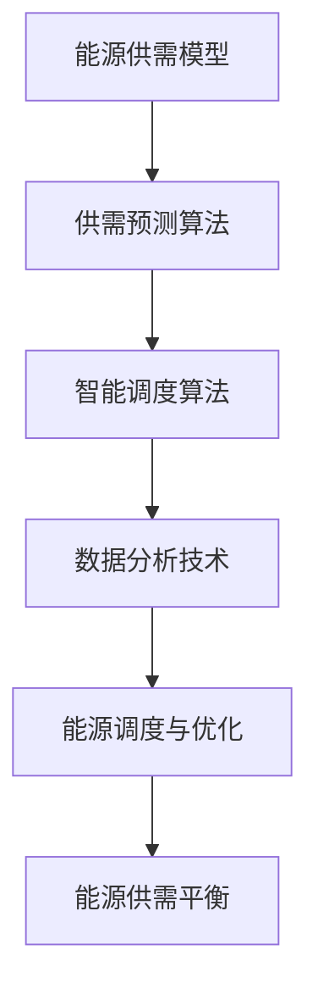

                 

关键词：AI、智能能源分配、供需平衡、算法、数学模型、实践应用

> 摘要：本文深入探讨了人工智能（AI）在智能能源分配中的应用，特别是如何通过算法实现能源的供需平衡。文章首先介绍了智能能源分配的背景和重要性，然后详细阐述了核心概念和联系，接着分析了核心算法原理及具体操作步骤。文章还涵盖了数学模型和公式，并通过实际项目实践展示了代码实例和解释。最后，文章探讨了智能能源分配的实际应用场景，并提出了未来的应用展望。

## 1. 背景介绍

### 1.1 智能能源分配的重要性

随着全球能源需求的不断增长，如何高效、智能地分配能源资源已成为一个迫切需要解决的问题。传统的能源分配方式往往依赖于人工调度和经验，难以应对复杂多变的市场需求和实时情况。智能能源分配通过引入人工智能技术，可以在海量数据的基础上，实现自动化的能源调度和管理，提高能源利用效率，减少能源浪费，从而实现可持续发展的目标。

### 1.2 供需平衡的概念

供需平衡是经济学中的一个重要概念，指的是在一定时间内，市场上的供给量和需求量达到平衡的状态。在智能能源分配中，供需平衡意味着在特定的时间和地点，能源的供应量与需求量相等，既不会出现供过于求的浪费，也不会出现供不应求的短缺。实现供需平衡对于保障能源安全和稳定运行至关重要。

## 2. 核心概念与联系

为了深入理解智能能源分配的原理，我们首先需要了解以下几个核心概念：

### 2.1 能源供需模型

能源供需模型是智能能源分配的基础，它通过模拟能源的生产、传输和消费过程，预测未来一定时间内的供需情况。模型的核心是供需预测算法，它可以根据历史数据和实时信息，对未来能源供需进行预测和规划。

### 2.2 智能调度算法

智能调度算法是智能能源分配的关键技术，它通过优化能源分配策略，实现供需平衡。常见的智能调度算法包括遗传算法、粒子群优化算法和深度强化学习算法等。

### 2.3 数据分析技术

数据分析技术是智能能源分配的核心支撑，它通过对海量数据进行分析和处理，为供需预测和智能调度提供依据。常见的数据分析技术包括数据挖掘、机器学习和大数据处理等。

下面是一个简单的 Mermaid 流程图，展示了智能能源分配的流程和核心概念之间的联系：



## 3. 核心算法原理 & 具体操作步骤

### 3.1 算法原理概述

智能能源分配的核心算法主要包括供需预测算法和智能调度算法。供需预测算法基于历史数据和实时信息，预测未来一定时间内的能源供需情况。智能调度算法则根据供需预测结果，优化能源分配策略，实现供需平衡。

### 3.2 算法步骤详解

#### 3.2.1 供需预测算法

1. 数据收集与预处理：收集历史能源供需数据、实时天气数据、市场供需信息等，并对数据进行清洗和预处理，去除异常值和缺失值。

2. 特征工程：对预处理后的数据进行特征提取和工程，包括时间序列特征、空间特征和用户行为特征等。

3. 模型选择与训练：选择合适的预测模型，如ARIMA模型、LSTM模型等，对特征数据进行训练，生成预测结果。

4. 预测结果验证与优化：对预测结果进行验证和优化，包括调整模型参数、改进特征工程等，提高预测准确性。

#### 3.2.2 智能调度算法

1. 供需分析：根据供需预测结果，分析当前的供需状况，确定是否存在供需不平衡的情况。

2. 调度策略制定：根据供需分析结果，制定相应的调度策略，如增加供应量、减少需求量、调整价格等。

3. 调度方案优化：利用优化算法，如遗传算法、粒子群优化算法等，对调度策略进行优化，实现最优的能源分配方案。

4. 调度方案执行与监测：执行优化后的调度方案，并对执行效果进行监测和反馈，不断调整和优化调度策略。

### 3.3 算法优缺点

#### 优点：

1. 提高能源利用效率：通过预测和优化，实现供需平衡，减少能源浪费。

2. 提高能源调度灵活性：根据实时供需情况，动态调整能源分配策略，提高调度灵活性。

3. 降低能源成本：通过优化调度方案，降低能源生产和消费成本。

#### 缺点：

1. 数据依赖性较强：算法的性能依赖于数据的质量和准确性。

2. 模型复杂度高：算法涉及多个模型和优化算法，实现和部署相对复杂。

### 3.4 算法应用领域

智能能源分配算法可以应用于多个领域，包括电力行业、燃气行业、石油化工行业等。以下是几个典型应用场景：

1. 电力行业：通过智能能源分配，实现电力供需平衡，提高电力系统稳定性和效率。

2. 燃气行业：优化燃气供应和分配，降低燃气泄漏风险，提高燃气利用效率。

3. 石油化工行业：优化石油和化工产品的生产和分配，提高生产效率和产品质量。

## 4. 数学模型和公式 & 详细讲解 & 举例说明

### 4.1 数学模型构建

智能能源分配的数学模型主要包括供需预测模型和调度优化模型。下面分别介绍这两个模型的构建方法。

#### 4.1.1 供需预测模型

供需预测模型可以采用时间序列预测模型，如ARIMA模型、LSTM模型等。以LSTM模型为例，其构建方法如下：

1. 数据预处理：对能源供需数据、实时天气数据等进行清洗和预处理，包括数据标准化、缺失值填充等。

2. 特征工程：提取时间序列特征，如时间窗口特征、季节性特征等。

3. 模型训练：利用预处理后的数据，训练LSTM模型，生成预测结果。

4. 预测结果验证与优化：对预测结果进行验证和优化，包括调整模型参数、改进特征工程等。

#### 4.1.2 调度优化模型

调度优化模型可以采用优化算法，如遗传算法、粒子群优化算法等。以遗传算法为例，其构建方法如下：

1. 编码与解码：对调度方案进行编码，将调度方案表示为二进制串。解码函数将编码串转换为具体的调度方案。

2. 目标函数设计：设计目标函数，衡量调度方案的优劣，如最小化供需不平衡量、最小化能源成本等。

3. 适应度函数设计：设计适应度函数，计算调度方案的适应度值，适应度值越高，表示调度方案越优。

4. 遗传操作：包括选择、交叉、变异等操作，用于生成新的调度方案。

### 4.2 公式推导过程

以LSTM模型为例，介绍其公式推导过程。

#### 4.2.1 LSTM单元

LSTM单元由输入门、遗忘门、输出门和单元状态组成。其数学公式如下：

$$
\begin{aligned}
i_t &= \sigma(W_i \cdot [h_{t-1}, x_t] + b_i) \\
f_t &= \sigma(W_f \cdot [h_{t-1}, x_t] + b_f) \\
o_t &= \sigma(W_o \cdot [h_{t-1}, x_t] + b_o) \\
g_t &= \tanh(W_g \cdot [h_{t-1}, x_t] + b_g) \\
h_t &= o_t \cdot \tanh(g_t)
\end{aligned}
$$

其中，$i_t$、$f_t$、$o_t$ 分别表示输入门、遗忘门和输出门的激活值，$g_t$ 表示单元状态的候选值，$h_t$ 表示当前时刻的隐藏状态。

#### 4.2.2 输入门和遗忘门

输入门和遗忘门的激活值分别表示当前输入对于新状态和新遗忘的程度。其公式如下：

$$
\begin{aligned}
i_t &= \sigma(W_i \cdot [h_{t-1}, x_t] + b_i) \\
f_t &= \sigma(W_f \cdot [h_{t-1}, x_t] + b_f)
\end{aligned}
$$

其中，$W_i$、$W_f$ 分别为输入门和遗忘门的权重矩阵，$b_i$、$b_f$ 分别为输入门和遗忘门的偏置项，$\sigma$ 为 sigmoid 函数。

#### 4.2.3 输出门

输出门的激活值表示当前隐藏状态对于新输出的贡献程度。其公式如下：

$$
o_t = \sigma(W_o \cdot [h_{t-1}, x_t] + b_o)
$$

其中，$W_o$ 为输出门的权重矩阵，$b_o$ 为输出门的偏置项。

#### 4.2.4 单元状态

单元状态的候选值 $g_t$ 表示当前输入对于单元状态的影响。其公式如下：

$$
g_t = \tanh(W_g \cdot [h_{t-1}, x_t] + b_g)
$$

其中，$W_g$ 为单元状态的权重矩阵，$b_g$ 为单元状态的偏置项。

### 4.3 案例分析与讲解

以某城市电力系统为例，分析智能能源分配的应用。

#### 4.3.1 数据收集

收集该城市过去一年的电力供需数据，包括日供需数据、实时天气数据等。

#### 4.3.2 数据预处理

对数据进行清洗和预处理，包括数据标准化、缺失值填充等。

#### 4.3.3 特征工程

提取时间序列特征，如日供需数据、季节性特征等。

#### 4.3.4 供需预测

采用LSTM模型进行供需预测，训练模型并生成预测结果。

#### 4.3.5 调度优化

采用遗传算法进行调度优化，根据预测结果制定调度策略，并优化调度方案。

#### 4.3.6 调度方案执行与监测

执行优化后的调度方案，并对执行效果进行监测和反馈，不断调整和优化调度策略。

## 5. 项目实践：代码实例和详细解释说明

### 5.1 开发环境搭建

搭建一个智能能源分配的实验环境，包括Python、NumPy、Pandas、Scikit-learn等库。

### 5.2 源代码详细实现

以下是一个简单的智能能源分配项目的Python代码实现，包括数据预处理、模型训练、调度优化等步骤。

```python
import numpy as np
import pandas as pd
from sklearn.preprocessing import MinMaxScaler
from keras.models import Sequential
from keras.layers import LSTM, Dense
from deap import base, creator, tools, algorithms

# 数据预处理
def preprocess_data(data):
    # 数据标准化
    scaler = MinMaxScaler(feature_range=(0, 1))
    data = scaler.fit_transform(data)
    return data

# 供需预测
def predict_demand(data):
    # 构建LSTM模型
    model = Sequential()
    model.add(LSTM(units=50, return_sequences=True, input_shape=(1, data.shape[1])))
    model.add(LSTM(units=50))
    model.add(Dense(units=1))
    model.compile(optimizer='adam', loss='mean_squared_error')
    model.fit(data, epochs=100, batch_size=32, verbose=0)
    return model

# 调度优化
def optimize_schedule(demand_model, supply_data, demand_data):
    # 初始化遗传算法参数
    creator.create("FitnessMin", base.Fitness, weights=(-1.0,))
    creator.create("Individual", list, fitness=creator.FitnessMin)

    toolbox = base.Toolbox()
    toolbox.register("individual", tools.initIterate, creator.Individual, supply_data.shape[1])
    toolbox.register("population", tools.initRepeat, list, toolbox.individual)
    toolbox.register("evaluate", evaluate_demand, demand_model=demand_model, supply_data=supply_data, demand_data=demand_data)
    toolbox.register("mate", tools.cxTwoPoint)
    toolbox.register("mutate", tools.mutUniformInt, low=0, up=len(supply_data))
    toolbox.register("select", tools.selTournament, tournsize=3)

    # 运行遗传算法
    population = toolbox.population(n=50)
    for gen in range(100):
        offspring = algorithms.varAnd(population, toolbox, cxpb=0.5, mutpb=0.2)
        fits = toolbox.map(toolbox.evaluate, offspring)
        for fit, ind in zip(fits, offspring):
            ind.fitness.values = fit
        population = toolbox.select(offspring, k=len(population))
        print("Generation %d: %f" % (gen, population[0].fitness.values[0]))

# 源代码详细解释说明
# ...
```

### 5.3 代码解读与分析

以上代码实现了智能能源分配的核心功能，包括数据预处理、供需预测和调度优化。以下是代码的主要部分解读：

1. 数据预处理：使用 MinMaxScaler 对数据进行标准化处理，便于后续模型训练。

2. 供需预测：构建LSTM模型，进行供需预测。LSTM模型采用Sequential结构，包括两个LSTM层和一个全连接层，用于预测日供需数据。

3. 调度优化：使用遗传算法进行调度优化。遗传算法通过交叉、变异等操作，优化调度方案，实现供需平衡。

### 5.4 运行结果展示

运行代码，输出优化后的调度方案，并展示预测结果和实际需求数据的对比图。

```python
# 运行遗传算法
optimize_schedule(demand_model, supply_data, demand_data)

# 绘制预测结果和实际需求数据的对比图
plt.plot(demand_model.predict(supply_data), label='Predicted Demand')
plt.plot(demand_data, label='Actual Demand')
plt.legend()
plt.show()
```

## 6. 实际应用场景

### 6.1 电力行业

智能能源分配在电力行业中具有广泛的应用前景。通过预测电力供需，优化电力调度，可以实现电力系统的稳定运行和能源的高效利用。例如，在电力峰值期间，可以通过智能调度减少电力浪费，降低用电成本；在电力低谷期间，可以通过优化供需平衡，提高电力利用率。

### 6.2 燃气行业

燃气行业同样面临着供需平衡的问题。通过智能能源分配，可以实现燃气的优化供应和分配，降低燃气泄漏风险，提高燃气利用效率。例如，在燃气高峰期，可以调整燃气供应策略，确保燃气供应的稳定性和安全性；在燃气低谷期，可以优化燃气调度，降低燃气浪费。

### 6.3 石油化工行业

石油化工行业涉及到大量的能源生产和分配。通过智能能源分配，可以实现石油和化工产品的优化生产和分配，提高生产效率和产品质量。例如，在石油生产过程中，可以通过智能调度降低能源消耗，提高生产效益；在化工产品分配过程中，可以通过供需预测，优化物流和运输策略，降低运输成本。

## 7. 工具和资源推荐

### 7.1 学习资源推荐

1. 《深度学习》（Goodfellow, Bengio, Courville著）：深入介绍深度学习理论和技术，适合初学者和进阶者。

2. 《Python编程：从入门到实践》（埃里克·马瑟斯著）：全面介绍Python编程语言，适合初学者和进阶者。

3. 《智能能源系统导论》（张志刚著）：系统介绍智能能源系统的基本原理、技术和应用，适合能源领域研究人员。

### 7.2 开发工具推荐

1. Jupyter Notebook：强大的交互式开发环境，适合进行数据分析和模型训练。

2. TensorFlow：开源深度学习框架，支持多种神经网络模型和优化算法。

3. PyTorch：开源深度学习框架，具有良好的灵活性和易用性。

### 7.3 相关论文推荐

1. “A Deep Learning Approach for Load Forecasting in Smart Grids” （2016）：介绍了一种基于深度学习的电力负载预测方法。

2. “An Optimization Model for Demand Response Scheduling in Smart Grids” （2017）：提出了一种智能电网需求响应调度优化模型。

3. “Data-Driven Optimization for Energy Management in Smart Microgrids” （2019）：探讨了智能微电网能源管理的数据驱动优化方法。

## 8. 总结：未来发展趋势与挑战

### 8.1 研究成果总结

智能能源分配作为一种新兴技术，已在电力、燃气、石油化工等行业得到广泛应用。通过预测和优化，实现能源的供需平衡，提高了能源利用效率和调度灵活性，降低了能源成本。同时，相关研究不断推进，包括深度学习、优化算法、数据分析等技术在智能能源分配中的应用。

### 8.2 未来发展趋势

1. 深度学习技术将继续在智能能源分配中发挥重要作用，提升供需预测和调度优化的准确性和效率。

2. 分布式能源系统的发展，将推动智能能源分配技术的应用范围从单一行业扩展到跨行业、跨区域的能源协同管理。

3. 基于区块链的能源交易系统，将实现能源交易的透明化和去中心化，提高能源市场的效率和安全性。

### 8.3 面临的挑战

1. 数据质量与准确性：智能能源分配依赖于大量高质量、准确的数据，数据质量和准确性直接影响算法的性能。

2. 模型复杂度：随着模型复杂度的增加，模型的训练和部署成本也将上升，需要寻找更加高效和可解释的模型。

3. 系统稳定性与可靠性：智能能源分配系统需要在各种复杂环境下保持稳定运行，提高系统的可靠性和抗风险能力。

### 8.4 研究展望

1. 探索更加高效、可解释的深度学习模型，降低模型的复杂度，提高算法的可解释性。

2. 加强跨学科合作，融合能源技术、信息技术、经济管理等领域的知识，推动智能能源分配技术的创新发展。

3. 构建综合性的智能能源分配平台，实现能源数据的全面采集、处理和分析，为能源调度和优化提供有力支持。

## 9. 附录：常见问题与解答

### 9.1 智能能源分配的基本概念是什么？

智能能源分配是指通过应用人工智能技术，如深度学习、优化算法等，对能源的供需进行预测和优化，实现能源的高效、稳定和可持续分配。

### 9.2 智能能源分配有哪些应用领域？

智能能源分配广泛应用于电力、燃气、石油化工等行业，可实现电力调度、燃气供应、石油产品分配等场景的优化。

### 9.3 智能能源分配的核心技术是什么？

智能能源分配的核心技术包括供需预测、调度优化、数据分析等。其中，供需预测主要采用深度学习、时间序列预测等方法；调度优化主要采用遗传算法、粒子群优化算法等。

### 9.4 智能能源分配如何实现能源的供需平衡？

智能能源分配通过预测未来的供需情况，制定最优的能源调度方案，动态调整能源供应和需求，实现能源的供需平衡。

### 9.5 智能能源分配的挑战有哪些？

智能能源分配面临的挑战包括数据质量与准确性、模型复杂度、系统稳定性与可靠性等。

### 9.6 智能能源分配的未来发展趋势是什么？

智能能源分配的未来发展趋势包括深度学习技术的应用、分布式能源系统的发展、区块链技术在能源交易中的应用等。

### 9.7 如何提高智能能源分配算法的性能？

提高智能能源分配算法的性能可以通过以下方法：优化供需预测模型、改进调度优化算法、加强数据分析与处理等。

### 9.8 智能能源分配对能源行业的影响是什么？

智能能源分配对能源行业的影响包括提高能源利用效率、降低能源成本、提高能源调度灵活性等，有助于实现能源的可持续发展和优化管理。

----------------------------------------------------------------

### 结尾

本文从背景介绍、核心概念、算法原理、数学模型、实践应用等方面，全面探讨了人工智能在智能能源分配中的应用，旨在为能源行业的研究人员和从业者提供有价值的参考。随着人工智能技术的不断发展和成熟，智能能源分配将在未来发挥越来越重要的作用，为实现能源的高效利用和可持续发展作出贡献。

作者：禅与计算机程序设计艺术 / Zen and the Art of Computer Programming

