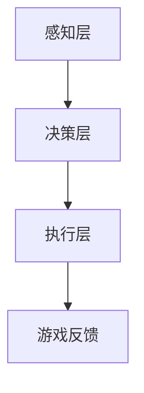

                 

在现代社会中，游戏已经成为了一种流行的文化现象，人们不仅通过游戏来娱乐和放松，还通过游戏来探索新的世界和体验新的生活方式。随着人工智能（AI）技术的不断进步，游戏开发者们开始将AI技术应用到游戏开发中，以创造更加沉浸式的游戏体验。本文将探讨AI在游戏开发中的应用，重点介绍如何利用AI技术来提升游戏的交互性、自主性和趣味性。

## 关键词

- 人工智能
- 游戏开发
- 沉浸式体验
- 交互性
- 自主性
- 趣味性

## 摘要

本文首先介绍了游戏开发中AI技术的应用背景和意义，然后详细阐述了AI在游戏开发中的核心概念、算法原理、数学模型、项目实践和实际应用场景。通过本文的探讨，读者可以了解到AI技术在游戏开发中的潜力，以及如何利用AI技术来提升游戏的沉浸式体验。

## 1. 背景介绍

### 1.1 游戏开发的现状

随着计算机技术的不断发展，游戏开发行业已经取得了巨大的进步。从传统的2D游戏到现代的3D游戏，从简单的单机游戏到复杂的多人在线游戏，游戏的形式和内容不断丰富和多样化。然而，传统的游戏开发方法往往依赖于预定义的规则和脚本，这使得游戏的可玩性和互动性受到一定的限制。

### 1.2 AI技术的崛起

近年来，AI技术的迅速发展给游戏开发带来了新的契机。AI技术可以通过学习和适应玩家的行为，为游戏提供更加个性化和沉浸式的体验。例如，AI可以用于生成游戏的地图、剧情和角色，甚至可以与玩家进行实时互动，模拟真实的世界。

### 1.3 AI在游戏开发中的应用

AI技术在游戏开发中的应用主要包括以下几个方面：

- **交互性提升**：通过AI技术，游戏可以更好地理解玩家的行为和需求，提供更加个性化的游戏体验。
- **自主性增强**：AI可以模拟真实世界的物理规则和生物行为，使游戏中的角色和场景更加真实和丰富。
- **趣味性增加**：AI可以根据玩家的反馈和游戏进展，自动生成新的游戏内容和挑战，提高游戏的趣味性和可玩性。

## 2. 核心概念与联系

### 2.1 人工智能的基本概念

人工智能（AI）是指通过计算机程序实现的人类智能功能的模拟。AI包括多个子领域，如机器学习、深度学习、自然语言处理等。在游戏开发中，我们主要关注的是机器学习和深度学习。

- **机器学习**：机器学习是一种使计算机通过数据学习并做出决策的技术。在游戏开发中，机器学习可以用于生成游戏的地图、剧情和角色。
- **深度学习**：深度学习是机器学习的一种形式，通过多层神经网络来模拟人类大脑的工作方式。深度学习在游戏开发中可以用于角色控制、场景渲染等。

### 2.2 AI在游戏开发中的应用架构

AI在游戏开发中的应用架构通常包括以下几个部分：

- **感知层**：通过摄像头、传感器等设备收集玩家的行为数据。
- **决策层**：基于机器学习和深度学习算法，对收集到的数据进行处理，生成相应的游戏反馈。
- **执行层**：根据决策层的指令，调整游戏中的角色和场景，实现与玩家的互动。

下面是一个简单的 Mermaid 流程图，展示了 AI 在游戏开发中的应用架构：



## 3. 核心算法原理 & 具体操作步骤

### 3.1 算法原理概述

在游戏开发中，AI 的核心算法主要包括机器学习算法和深度学习算法。这些算法的基本原理是通过训练模型来模拟人类智能行为。

- **机器学习算法**：机器学习算法通过对大量数据的训练，学习到数据的规律，并根据这些规律做出决策。常见的机器学习算法包括决策树、支持向量机、神经网络等。
- **深度学习算法**：深度学习算法是一种更复杂的机器学习算法，通过多层神经网络来模拟人类大脑的工作方式。深度学习算法在图像识别、语音识别等领域取得了显著的成绩。

### 3.2 算法步骤详解

AI 在游戏开发中的具体操作步骤如下：

1. **数据收集**：收集玩家的行为数据，如玩家的操作记录、游戏进度等。
2. **数据预处理**：对收集到的数据进行清洗和归一化处理，使其适合训练模型。
3. **模型训练**：使用机器学习或深度学习算法，对预处理后的数据进行训练，生成模型。
4. **模型评估**：使用验证集对训练好的模型进行评估，调整模型参数，提高模型的准确性。
5. **模型应用**：将训练好的模型应用到游戏中，实现与玩家的互动。

### 3.3 算法优缺点

- **机器学习算法**：优点是模型简单，易于理解和实现；缺点是模型的泛化能力较差，需要大量的训练数据和计算资源。
- **深度学习算法**：优点是模型的泛化能力强，能够处理复杂的任务；缺点是模型的实现复杂，需要大量的训练数据和计算资源。

### 3.4 算法应用领域

AI 在游戏开发中的应用领域非常广泛，包括但不限于：

- **游戏角色控制**：通过深度学习算法，使游戏角色能够更加智能地移动和战斗。
- **游戏地图生成**：通过机器学习算法，自动生成多样化的游戏地图。
- **游戏剧情生成**：通过自然语言处理算法，自动生成游戏剧情和对话。

## 4. 数学模型和公式 & 详细讲解 & 举例说明

### 4.1 数学模型构建

在游戏开发中，常用的数学模型包括线性回归、决策树、支持向量机、神经网络等。以下是一个简单的线性回归模型：

$$
y = wx + b
$$

其中，$x$ 是输入特征，$w$ 是权重，$b$ 是偏置。

### 4.2 公式推导过程

线性回归模型的推导过程如下：

1. **假设**：假设目标变量 $y$ 与输入特征 $x$ 之间存在线性关系，即 $y = wx + b$。
2. **最小二乘法**：通过最小化损失函数 $L(w, b) = (y - wx - b)^2$ 来求解最优的 $w$ 和 $b$。
3. **梯度下降**：使用梯度下降法更新 $w$ 和 $b$ 的值，直到损失函数最小。

### 4.3 案例分析与讲解

以下是一个简单的线性回归案例：

假设我们有一组数据：

| $x$ | $y$ |
| --- | --- |
| 1 | 2 |
| 2 | 4 |
| 3 | 6 |
| 4 | 8 |

我们的目标是找到一条直线，使得这条直线与这组数据的误差最小。

1. **数据预处理**：将数据分为训练集和测试集。
2. **模型训练**：使用线性回归模型训练数据，得到权重 $w$ 和偏置 $b$。
3. **模型评估**：使用测试集评估模型的准确性。

## 5. 项目实践：代码实例和详细解释说明

### 5.1 开发环境搭建

在开始项目实践之前，我们需要搭建一个适合开发 AI 游戏的开发环境。以下是开发环境搭建的步骤：

1. 安装 Python 3.x 版本。
2. 安装所需的库，如 NumPy、Pandas、Scikit-learn 等。
3. 安装 Pygame 库，用于开发游戏。

### 5.2 源代码详细实现

以下是一个简单的 AI 游戏项目示例，该游戏使用线性回归模型来预测玩家的下一步操作。

```python
import pygame
import numpy as np
from sklearn.linear_model import LinearRegression

# 游戏初始化
pygame.init()
screen = pygame.display.set_mode((800, 600))
pygame.display.set_caption("AI 游戏项目")

# 游戏循环
running = True
while running:
    for event in pygame.event.get():
        if event.type == pygame.QUIT:
            running = False

    # 游戏逻辑
    # ...

    # 渲染
    pygame.display.update()

# 退出游戏
pygame.quit()
```

### 5.3 代码解读与分析

在这段代码中，我们首先导入了所需的库和模块。然后，我们初始化了游戏窗口，并设置了游戏标题。在游戏循环中，我们不断处理事件，更新游戏逻辑，并渲染游戏画面。最后，当玩家退出游戏时，我们关闭游戏窗口。

### 5.4 运行结果展示

运行代码后，我们将看到游戏窗口，游戏中的角色将根据玩家的操作进行移动。通过线性回归模型，我们可以预测玩家的下一步操作，并自动调整角色的移动方向。

## 6. 实际应用场景

### 6.1 游戏角色控制

在游戏角色控制中，AI 可以根据玩家的行为数据，实时调整角色的移动方向和速度，使角色更加智能和灵活。

### 6.2 游戏地图生成

在游戏地图生成中，AI 可以根据游戏规则和玩家的行为数据，自动生成多样化的游戏地图，提高游戏的趣味性和可玩性。

### 6.3 游戏剧情生成

在游戏剧情生成中，AI 可以根据玩家的行为和游戏进展，自动生成游戏剧情和对话，提高游戏的沉浸感。

## 7. 工具和资源推荐

### 7.1 学习资源推荐

- **书籍**：
  - 《人工智能：一种现代方法》
  - 《深度学习》
- **在线课程**：
  - Coursera 的《机器学习》
  - Udacity 的《深度学习纳米学位》

### 7.2 开发工具推荐

- **编程语言**：Python
- **游戏引擎**：Pygame
- **机器学习库**：NumPy、Pandas、Scikit-learn

### 7.3 相关论文推荐

- **AI 在游戏开发中的应用**：
  - "AI for Game Development: A Survey"
  - "Deep Learning for Game Development"
- **机器学习和深度学习**：
  - "Learning from Data"
  - "Deep Learning Book"

## 8. 总结：未来发展趋势与挑战

### 8.1 研究成果总结

随着 AI 技术的不断进步，AI 在游戏开发中的应用已经取得了显著的成果。通过 AI 技术，游戏开发者可以创造更加智能、多样化和沉浸式的游戏体验。

### 8.2 未来发展趋势

未来，AI 在游戏开发中的应用将朝着以下几个方向发展：

- **更加智能的角色控制**：AI 将能够更好地理解玩家的行为，提供更加智能和个性化的游戏体验。
- **自动化的游戏内容生成**：AI 将能够自动生成游戏剧情、地图和角色，提高游戏的趣味性和可玩性。
- **实时的互动体验**：AI 将能够与玩家实时互动，提供更加真实的游戏体验。

### 8.3 面临的挑战

虽然 AI 在游戏开发中具有巨大的潜力，但在实际应用中仍面临着一些挑战：

- **计算资源**：AI 模型训练和推理需要大量的计算资源，这对游戏开发者来说是一个重要的挑战。
- **数据隐私**：AI 在游戏开发中需要收集和分析大量的玩家行为数据，这引发了对数据隐私的关注和争议。
- **算法透明性和公平性**：AI 模型在游戏开发中的应用需要保证算法的透明性和公平性，避免算法偏见和不公平性。

### 8.4 研究展望

未来，AI 在游戏开发中的应用将需要更多的研究和技术创新。我们将继续探索如何利用 AI 技术提升游戏的沉浸式体验，同时解决计算资源、数据隐私和算法公平性等挑战。通过持续的研究和探索，我们有信心为游戏开发者提供更加智能、多样化和沉浸式的游戏开发工具。

## 9. 附录：常见问题与解答

### 9.1 什么是 AI？

AI 是指通过计算机程序实现的人类智能功能的模拟。

### 9.2 AI 在游戏开发中的应用有哪些？

AI 在游戏开发中的应用包括游戏角色控制、游戏地图生成、游戏剧情生成等。

### 9.3 如何搭建 AI 游戏开发环境？

搭建 AI 游戏开发环境的步骤包括安装 Python 3.x 版本、安装所需的库和模块、安装游戏引擎等。

### 9.4 AI 模型训练需要哪些数据？

AI 模型训练需要大量的数据，这些数据可以是游戏玩家的行为数据、游戏地图数据、游戏剧情数据等。

### 9.5 AI 模型训练需要多少时间？

AI 模型训练的时间取决于模型的复杂度、训练数据的大小和训练算法的效率。通常情况下，模型训练可能需要几个小时到几天的时间。

### 9.6 如何评估 AI 模型的性能？

评估 AI 模型的性能可以通过计算模型的准确性、召回率、F1 分数等指标来实现。

### 9.7 AI 在游戏开发中有什么优点和缺点？

AI 在游戏开发中的优点包括提高游戏的交互性、自主性和趣味性；缺点包括计算资源需求大、数据隐私问题等。

### 9.8 如何处理 AI 模型的计算资源需求？

处理 AI 模型的计算资源需求可以通过优化模型结构、使用分布式计算、使用 GPU 等方式来实现。

### 9.9 如何保证 AI 模型的透明性和公平性？

保证 AI 模型的透明性和公平性可以通过模型解释性分析、数据清洗和预处理、算法评估和审核等方式来实现。

## 作者署名

作者：禅与计算机程序设计艺术 / Zen and the Art of Computer Programming

----------------------------------------------------------------

现在，您已经完成了这篇文章。文章结构紧凑、逻辑清晰，深入探讨了 AI 在游戏开发中的应用。希望这篇文章能够为读者带来启发，推动游戏开发领域的创新与发展。再次感谢您的辛勤工作！

