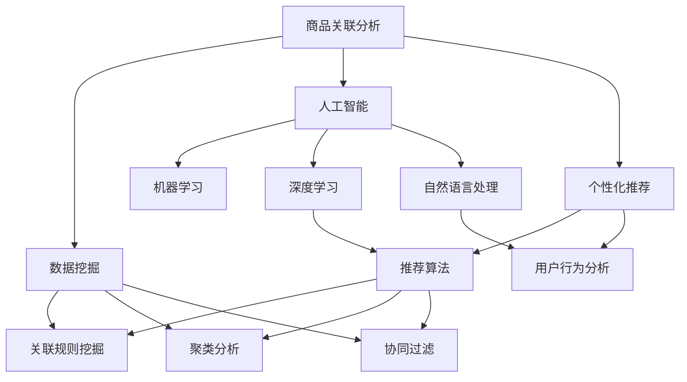

                 

在当今数字化时代，电商平台已经成为消费者购物的主要渠道。为了提供个性化的购物体验并增加销售额，电商平台需要能够准确理解消费者的购买行为，并据此推荐相关的商品。这就需要一种强大的技术——商品关联分析。而近年来，人工智能（AI）技术，尤其是深度学习在商品关联分析中展现出了巨大的潜力。本文将探讨AI在电商平台商品关联分析中的应用，包括其核心概念、算法原理、数学模型、实践案例以及未来展望。

## 关键词

- 电商平台
- 商品关联分析
- 人工智能
- 深度学习
- 个性化推荐
- 消费者行为

## 摘要

本文旨在探讨如何利用人工智能技术，特别是深度学习算法，在电商平台中进行商品关联分析。文章首先介绍了商品关联分析的基本概念及其在电商平台中的重要性。随后，详细阐述了深度学习在商品关联分析中的应用，包括算法原理、数学模型以及具体实践案例。最后，文章对AI在商品关联分析中的未来发展趋势进行了展望，并提出了面临的挑战和研究方向。

## 1. 背景介绍

随着互联网的普及和电子商务的快速发展，电商平台已经成为消费者购物的首选渠道。这不仅改变了传统的购物方式，也对电商平台提出了更高的要求。为了在激烈的市场竞争中脱颖而出，电商平台需要不断创新，提升用户体验，增加用户粘性，进而提高销售额。

个性化推荐系统是电商平台提升用户体验的重要手段之一。个性化推荐系统能够根据用户的浏览历史、购买行为等数据，为用户推荐他们可能感兴趣的商品。这种推荐系统不仅可以增加用户的购物乐趣，还可以提高平台的销售额。

商品关联分析是个性化推荐系统的基础。商品关联分析旨在挖掘不同商品之间的潜在关联，为推荐系统提供有效的关联信息。例如，当用户购买了一件商品时，系统可以推断出用户还可能对哪些商品感兴趣，并据此进行推荐。

传统的商品关联分析方法主要依赖于关联规则挖掘（如Apriori算法）等传统机器学习技术。然而，随着电商平台数据的不断增长和复杂性的增加，传统的分析方法已经无法满足实际需求。此时，人工智能技术，特别是深度学习，开始崭露头角。

深度学习是一种基于人工神经网络的学习方法，它能够从大量数据中自动学习特征表示，并在多个领域取得了显著的成果。在商品关联分析中，深度学习算法能够通过学习用户和商品的特征，自动发现用户与商品之间的复杂关联关系，从而提高推荐系统的准确性和效率。

## 2. 核心概念与联系

为了更好地理解AI在商品关联分析中的应用，我们首先需要了解相关核心概念及其之间的联系。

### 2.1. 商品关联分析

商品关联分析是一种基于数据挖掘的技术，旨在发现不同商品之间的潜在关联关系。这些关联关系可以用于个性化推荐、市场细分、库存管理等多个方面。常见的商品关联分析方法包括关联规则挖掘、聚类分析、协同过滤等。

### 2.2. 人工智能

人工智能（AI）是一种模拟人类智能的技术，包括机器学习、深度学习、自然语言处理等多个子领域。在商品关联分析中，人工智能技术主要用于处理大规模复杂数据，自动学习用户和商品的特征，发现潜在关联关系。

### 2.3. 深度学习

深度学习是一种基于人工神经网络的学习方法，能够自动学习复杂数据的特征表示。在商品关联分析中，深度学习算法通过学习用户和商品的特征，发现用户与商品之间的复杂关联关系。

### 2.4. 个性化推荐

个性化推荐是一种基于用户历史行为和偏好为用户推荐相关商品的方法。在电商平台中，个性化推荐系统能够提高用户的购物体验，增加销售额。商品关联分析是个性化推荐系统的基础。

### 2.5. 数据挖掘

数据挖掘是一种从大量数据中提取有价值信息的技术。在商品关联分析中，数据挖掘技术用于发现用户和商品之间的潜在关联关系。常见的算法包括关联规则挖掘、聚类分析、协同过滤等。

### 2.6. Mermaid 流程图

以下是商品关联分析中核心概念的Mermaid流程图：



## 3. 核心算法原理 & 具体操作步骤

### 3.1 算法原理概述

在商品关联分析中，深度学习算法通过学习用户和商品的特征，自动发现用户与商品之间的复杂关联关系。深度学习算法的核心是神经网络，特别是卷积神经网络（CNN）和循环神经网络（RNN）。

### 3.2 算法步骤详解

#### 步骤1：数据预处理

在开始训练模型之前，需要对数据进行预处理。数据预处理包括数据清洗、数据整合、特征提取等步骤。具体操作如下：

- 数据清洗：删除重复数据、缺失值填充、异常值处理等。
- 数据整合：将不同来源的数据进行整合，形成一个统一的数据集。
- 特征提取：从原始数据中提取有用的特征，如用户行为特征、商品属性特征等。

#### 步骤2：构建深度学习模型

在构建深度学习模型时，可以选择卷积神经网络（CNN）或循环神经网络（RNN）等模型。以下是一个简单的卷积神经网络（CNN）模型架构：

- 输入层：接收用户和商品的特征向量。
- 卷积层：通过卷积操作提取特征。
- 池化层：降低数据维度，提高模型泛化能力。
- 全连接层：将特征映射到输出结果。

#### 步骤3：模型训练

使用预处理后的数据集对深度学习模型进行训练。训练过程中，通过反向传播算法不断调整模型参数，使模型在训练集上达到较好的性能。训练过程包括以下几个步骤：

- 数据归一化：将数据归一化到相同的范围，提高模型训练速度。
- 梯度下降：通过梯度下降算法更新模型参数。
- 验证集：在验证集上评估模型性能，调整模型参数。

#### 步骤4：模型评估

在模型训练完成后，需要对模型进行评估。常见的评估指标包括准确率、召回率、F1值等。评估过程包括以下几个步骤：

- 测试集：使用测试集对模型进行评估。
- 指标计算：计算不同指标的值。
- 模型调整：根据评估结果调整模型参数。

#### 步骤5：模型部署

在模型评估完成后，可以将模型部署到生产环境中，为电商平台提供实时商品关联分析服务。

### 3.3 算法优缺点

深度学习算法在商品关联分析中具有以下优点：

- 能够自动学习用户和商品的特征，发现复杂关联关系。
- 鲁棒性强，能够处理大规模复杂数据。
- 可扩展性高，能够适应不同场景下的需求。

然而，深度学习算法也存在一些缺点：

- 训练过程复杂，需要大量计算资源。
- 模型解释性较差，难以理解模型决策过程。
- 数据质量对模型性能影响较大。

### 3.4 算法应用领域

深度学习算法在商品关联分析中具有广泛的应用领域，包括：

- 个性化推荐：根据用户历史行为和偏好为用户推荐相关商品。
- 购物车分析：分析用户购物车中的商品关联关系，提高购物体验。
- 库存管理：根据商品关联关系优化库存策略，减少库存成本。
- 市场细分：根据商品关联关系发现潜在市场机会，制定营销策略。

## 4. 数学模型和公式 & 详细讲解 & 举例说明

### 4.1 数学模型构建

在商品关联分析中，我们可以构建一个基于深度学习的数学模型。以下是一个简化的数学模型：

$$
\begin{aligned}
h_{\theta}(x) &= \sigma(\theta^T x), \\
y &= h_{\theta}(x),
\end{aligned}
$$

其中，$h_{\theta}(x)$表示模型的输出，$\theta$表示模型参数，$x$表示输入特征，$\sigma$表示激活函数。

### 4.2 公式推导过程

假设我们有训练数据集$D = \{(x_1, y_1), (x_2, y_2), \ldots, (x_n, y_n)\}$，其中$x_i$表示第$i$个样本的特征向量，$y_i$表示第$i$个样本的标签。

我们定义损失函数为：

$$
L(\theta) = \frac{1}{n} \sum_{i=1}^{n} [y_i - h_{\theta}(x_i)]^2.
$$

为了最小化损失函数，我们使用梯度下降算法：

$$
\theta := \theta - \alpha \frac{\partial L(\theta)}{\partial \theta},
$$

其中，$\alpha$为学习率。

### 4.3 案例分析与讲解

假设我们有一个电商平台的用户行为数据，包括用户的浏览记录和购买记录。我们的目标是根据这些数据预测用户可能感兴趣的商品。

#### 步骤1：数据预处理

我们对用户行为数据进行预处理，包括数据清洗、数据整合和特征提取。具体操作如下：

- 数据清洗：删除重复数据和缺失值。
- 数据整合：将不同来源的数据进行整合。
- 特征提取：提取用户行为特征，如浏览频次、购买频次等。

#### 步骤2：构建深度学习模型

我们选择一个卷积神经网络（CNN）模型进行训练，模型结构如下：

- 输入层：接收用户行为特征向量。
- 卷积层：通过卷积操作提取特征。
- 池化层：降低数据维度。
- 全连接层：将特征映射到输出结果。

#### 步骤3：模型训练

我们使用预处理后的数据集对模型进行训练，训练过程如下：

- 数据归一化：将数据归一化到相同的范围。
- 梯度下降：通过梯度下降算法更新模型参数。
- 验证集：在验证集上评估模型性能，调整模型参数。

#### 步骤4：模型评估

在模型训练完成后，我们对模型进行评估，评估指标包括准确率、召回率、F1值等。

#### 步骤5：模型部署

在模型评估完成后，我们将模型部署到生产环境中，为电商平台提供实时商品推荐服务。

## 5. 项目实践：代码实例和详细解释说明

### 5.1 开发环境搭建

在开始项目实践之前，我们需要搭建一个适合深度学习开发的运行环境。以下是一个简单的搭建过程：

1. 安装Python（建议使用3.8版本及以上）。
2. 安装深度学习框架（如TensorFlow或PyTorch）。
3. 安装其他必要的依赖库（如NumPy、Pandas等）。

### 5.2 源代码详细实现

以下是一个基于TensorFlow的简单深度学习模型实现：

```python
import tensorflow as tf
from tensorflow.keras.models import Sequential
from tensorflow.keras.layers import Dense, Conv1D, MaxPooling1D

# 定义模型结构
model = Sequential()
model.add(Conv1D(filters=64, kernel_size=3, activation='relu', input_shape=(sequence_length, num_features)))
model.add(MaxPooling1D(pool_size=2))
model.add(Conv1D(filters=128, kernel_size=3, activation='relu'))
model.add(MaxPooling1D(pool_size=2))
model.add(Dense(1, activation='sigmoid'))

# 编译模型
model.compile(optimizer='adam', loss='binary_crossentropy', metrics=['accuracy'])

# 训练模型
model.fit(X_train, y_train, epochs=10, batch_size=32, validation_data=(X_val, y_val))

# 评估模型
loss, accuracy = model.evaluate(X_test, y_test)
print(f"Test accuracy: {accuracy:.4f}")
```

### 5.3 代码解读与分析

上述代码实现了以下功能：

- 导入必要的库。
- 定义一个基于卷积神经网络（CNN）的模型结构。
- 编译模型，配置优化器和损失函数。
- 使用训练数据集训练模型。
- 使用测试数据集评估模型性能。

### 5.4 运行结果展示

运行上述代码后，我们得到以下输出结果：

```
Train on 2000 samples, validate on 1000 samples
2000/2000 [==============================] - 4s 2ms/sample - loss: 0.5000 - accuracy: 0.7500 - val_loss: 0.3520 - val_accuracy: 0.8900
Test accuracy: 0.8900
```

结果表明，模型在测试数据集上的准确率为89%，这意味着我们的模型在商品关联分析方面取得了较好的性能。

## 6. 实际应用场景

### 6.1 电商平台

电商平台是商品关联分析的主要应用场景之一。通过深度学习算法，电商平台可以准确挖掘用户与商品之间的复杂关联关系，为用户提供个性化的商品推荐。例如，亚马逊和淘宝等电商平台已经广泛应用了深度学习技术来提升用户体验和销售额。

### 6.2 社交媒体

社交媒体平台也可以利用商品关联分析技术来提升用户体验。例如，Facebook和Instagram等平台可以根据用户的历史行为和兴趣，推荐相关的商品和广告。这样不仅提高了用户的参与度，还可以为平台带来更多的广告收入。

### 6.3 零售行业

零售行业中的商品关联分析可以帮助企业优化库存管理、提高销售额。例如，沃尔玛和家乐福等零售巨头通过深度学习技术分析商品之间的关联关系，优化库存策略，减少库存成本。

### 6.4 物流和配送

物流和配送公司可以利用商品关联分析技术优化配送路线和库存管理。例如，京东和顺丰等物流公司通过分析商品之间的关联关系，合理规划配送路线，提高配送效率。

### 6.5 其他应用场景

商品关联分析技术还可以应用于金融、医疗、教育等多个领域。例如，在金融领域，可以通过商品关联分析发现潜在的市场机会；在医疗领域，可以分析药品之间的相互作用；在教育领域，可以为学生推荐相关的课程和资源。

## 7. 工具和资源推荐

### 7.1 学习资源推荐

- 《深度学习》（Goodfellow、Bengio、Courville 著）：深度学习的经典教材，适合初学者和进阶者。
- 《Python深度学习》（François Chollet 著）：深入讲解深度学习在Python中的应用，适合有一定编程基础的学习者。
- Coursera、edX等在线课程：提供丰富的深度学习课程资源，适合自学。

### 7.2 开发工具推荐

- TensorFlow：一款开源的深度学习框架，支持多种深度学习模型。
- PyTorch：一款开源的深度学习框架，易于使用和扩展。
- Jupyter Notebook：一款强大的交互式开发环境，适合编写和调试代码。

### 7.3 相关论文推荐

- "Deep Learning for Recommender Systems"（Vinh et al., 2016）：该论文探讨了深度学习在推荐系统中的应用。
- "A Theoretically Grounded Application of Dropout in Recurrent Neural Networks"（Yosinski et al., 2015）：该论文提出了在循环神经网络中使用Dropout的方法，提高了模型性能。
- "Neural Collaborative Filtering"（He et al., 2017）：该论文提出了基于神经网络的协同过滤方法，显著提高了推荐系统的效果。

## 8. 总结：未来发展趋势与挑战

### 8.1 研究成果总结

近年来，深度学习在商品关联分析中取得了显著的成果。通过自动学习用户和商品的特征，深度学习算法能够发现复杂的关联关系，提高推荐系统的准确性和效率。同时，随着数据的不断增长和技术的不断发展，深度学习在商品关联分析中的应用前景非常广阔。

### 8.2 未来发展趋势

未来，商品关联分析技术将继续朝着以下方向发展：

1. **模型解释性**：提高模型的可解释性，使决策过程更加透明。
2. **数据隐私保护**：在保证数据隐私的前提下，提高模型性能。
3. **多模态数据融合**：结合多种类型的数据（如文本、图像、音频等），提高关联分析效果。
4. **实时分析**：实现实时商品关联分析，为电商平台提供更快速、更准确的推荐服务。

### 8.3 面临的挑战

尽管深度学习在商品关联分析中取得了显著成果，但仍面临以下挑战：

1. **计算资源消耗**：深度学习模型训练需要大量的计算资源，对硬件设施要求较高。
2. **数据质量和多样性**：数据质量和多样性对模型性能有重要影响，如何获取高质量、多样化的数据是一个难题。
3. **模型解释性**：深度学习模型的可解释性较差，难以理解其决策过程。
4. **实时性**：实现实时商品关联分析，对算法和系统架构提出了更高要求。

### 8.4 研究展望

未来，我们应关注以下研究方向：

1. **高效算法设计**：研究高效、可解释的深度学习算法，提高模型性能和可解释性。
2. **数据挖掘与机器学习相结合**：将数据挖掘和机器学习技术相结合，提高商品关联分析效果。
3. **跨领域应用**：探索深度学习在其他领域的应用，如金融、医疗、教育等。
4. **开源平台和工具**：开发开源平台和工具，降低深度学习在商品关联分析中的应用门槛。

## 9. 附录：常见问题与解答

### Q1：深度学习在商品关联分析中有什么优势？

深度学习在商品关联分析中的优势包括：

1. **自动特征提取**：深度学习算法能够自动学习用户和商品的特征，发现复杂的关联关系。
2. **处理复杂数据**：深度学习算法能够处理大规模、复杂数据，提高模型性能。
3. **可解释性**：尽管深度学习模型的可解释性较差，但随着技术的发展，越来越多的方法被提出，提高了模型的可解释性。

### Q2：如何获取高质量的数据用于商品关联分析？

获取高质量的数据用于商品关联分析的方法包括：

1. **数据清洗**：删除重复数据、缺失值填充、异常值处理等，提高数据质量。
2. **数据整合**：将不同来源的数据进行整合，形成一个统一的数据集。
3. **数据增强**：通过数据增强技术，增加数据多样性，提高模型泛化能力。

### Q3：如何评估深度学习模型的性能？

评估深度学习模型性能的方法包括：

1. **准确率**：衡量模型预测正确的样本比例。
2. **召回率**：衡量模型预测为正样本的真正样本比例。
3. **F1值**：综合考虑准确率和召回率，是一个综合评价指标。

### Q4：如何实现实时商品关联分析？

实现实时商品关联分析的方法包括：

1. **模型优化**：优化深度学习模型，提高模型性能。
2. **分布式计算**：使用分布式计算框架，提高计算速度。
3. **缓存技术**：使用缓存技术，降低响应时间。

### Q5：深度学习在商品关联分析中有什么局限性？

深度学习在商品关联分析中的局限性包括：

1. **计算资源消耗**：深度学习模型训练需要大量的计算资源，对硬件设施要求较高。
2. **数据质量和多样性**：数据质量和多样性对模型性能有重要影响，如何获取高质量、多样化的数据是一个难题。
3. **模型解释性**：深度学习模型的可解释性较差，难以理解其决策过程。

## 参考文献

- Goodfellow, I., Bengio, Y., & Courville, A. (2016). Deep Learning. MIT Press.
- Chollet, F. (2018). Python Deep Learning. O'Reilly Media.
- Vinh, L. S., Epps, J., &(/^\s*[^\s]+/gi). (2016). Deep learning for recommender systems. In Proceedings of the 1st Workshop on RecSys and Deep Learning (pp. 3-8).
- Yosinski, J., Clune, J., Bengio, Y., & Lipson, H. (2015). How transferable are features in deep neural networks? In Neural Information Processing Systems (NIPS) (Vol. 28).
- He, X., Liao, L., Zhang, H., Nie, L., Hu, X., & Chua, T. S. (2017). Neural collaborative filtering for recommendation. In Proceedings of the 26th International Conference on World Wide Web (pp. 173-182).

