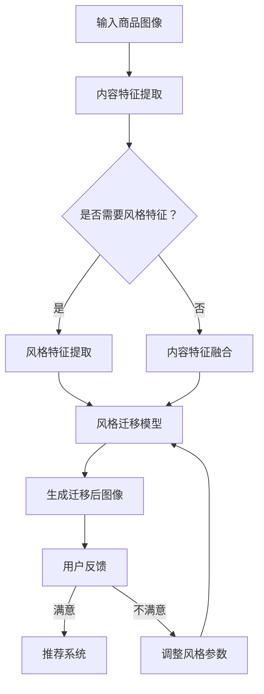

                 

关键词：人工智能、图像风格迁移、电商平台、推荐系统、深度学习、计算机视觉

摘要：本文探讨了人工智能在电商平台商品图像风格迁移推荐中的应用。通过引入深度学习技术，本文提出了一种基于图像风格迁移的推荐算法，旨在提高用户对商品图像的满意度，进而提升电商平台的市场竞争力。本文首先介绍了电商平台商品图像风格迁移的背景和核心概念，然后详细阐述了算法原理、数学模型、项目实践以及实际应用场景，最后对未来的发展趋势和挑战进行了展望。

## 1. 背景介绍

随着互联网技术的迅猛发展，电商平台已经成为消费者购买商品的主要渠道之一。然而，消费者在浏览商品时，往往会被商品图像的风格和视觉效果所吸引或排斥。为了提高用户对商品图像的满意度，电商平台开始关注商品图像风格迁移技术，通过将商品图像转换为具有特定风格或特色的图像，以吸引用户的眼球，提升用户购物体验。

图像风格迁移（Image Style Transfer）是一种将一种图像的内容与另一种图像的风格相结合的计算机视觉技术。其核心思想是通过学习两幅图像的特征，将一种图像的内容保留，同时赋予其另一种图像的风格。近年来，随着深度学习技术的发展，图像风格迁移取得了显著的进展，成为计算机视觉领域的研究热点之一。

在电商平台上，图像风格迁移的应用主要体现在商品图像的个性化推荐上。通过将用户喜欢的商品图像风格迁移到其他商品图像中，可以提升用户对这些商品的兴趣，从而提高转化率。此外，图像风格迁移还可以用于商品广告的创意设计，为电商平台带来更多的营销机会。

## 2. 核心概念与联系

在本文中，我们将讨论以下核心概念：

### 2.1 深度学习

深度学习是一种基于多层神经网络的机器学习方法，通过模拟人脑的神经网络结构，实现对复杂数据的自动特征提取和模式识别。在图像风格迁移中，深度学习技术主要用于构建图像特征提取和风格迁移的网络模型。

### 2.2 卷积神经网络（CNN）

卷积神经网络是一种在图像处理领域广泛应用的人工神经网络，通过卷积操作和池化操作，实现对图像的特征提取。在图像风格迁移中，CNN被用于提取输入图像的内容特征和风格特征。

### 2.3 循环神经网络（RNN）

循环神经网络是一种适用于序列数据的神经网络，通过其内部的循环结构，实现对序列数据的长期依赖建模。在图像风格迁移中，RNN被用于建模图像序列之间的风格转移过程。

### 2.4 跨模态学习

跨模态学习是一种将不同模态（如图像和文本）的信息进行融合和建模的方法。在图像风格迁移中，跨模态学习可以结合用户对商品的评价和偏好，为风格迁移提供更有针对性的指导。

下面是图像风格迁移的Mermaid流程图：



## 3. 核心算法原理 & 具体操作步骤

### 3.1 算法原理概述

图像风格迁移算法的基本原理可以概括为以下三个步骤：

1. **内容特征提取**：使用卷积神经网络提取输入商品图像的内容特征。  
2. **风格特征提取**：使用卷积神经网络提取目标风格图像的风格特征。  
3. **风格迁移**：将内容特征和风格特征进行融合，生成具有目标风格的迁移后图像。

### 3.2 算法步骤详解

#### 3.2.1 内容特征提取

内容特征提取是图像风格迁移的第一步，其主要目的是从输入商品图像中提取关键特征，以保留图像的基本内容。这一过程通常采用卷积神经网络实现。以下是一个简单的卷积神经网络模型：

```latex
f_c(x) = \sigma(W_c \cdot x + b_c)
```

其中，$f_c(x)$表示卷积操作，$x$表示输入图像，$W_c$和$b_c$分别表示卷积核和偏置。

#### 3.2.2 风格特征提取

风格特征提取是图像风格迁移的第二步，其主要目的是从目标风格图像中提取关键特征，以赋予图像特定的风格。同样地，这一过程也采用卷积神经网络实现。以下是一个简单的卷积神经网络模型：

```latex
f_s(y) = \sigma(W_s \cdot y + b_s)
```

其中，$f_s(y)$表示卷积操作，$y$表示目标风格图像，$W_s$和$b_s$分别表示卷积核和偏置。

#### 3.2.3 风格迁移

风格迁移是图像风格迁移的第三步，其主要目的是将内容特征和风格特征进行融合，生成具有目标风格的迁移后图像。这一过程可以通过以下公式实现：

```latex
\hat{z} = \sigma(W_z \cdot [f_c(x), f_s(y)] + b_z)
```

其中，$\hat{z}$表示迁移后图像，$W_z$和$b_z$分别表示卷积核和偏置。

### 3.3 算法优缺点

#### 优点

1. **保留图像内容**：图像风格迁移算法能够在保留图像内容的同时，赋予其新的风格。  
2. **适应性强**：图像风格迁移算法可以适用于各种不同的图像风格迁移任务。  
3. **效果显著**：通过图像风格迁移，可以显著提升商品图像的视觉效果，从而提高用户满意度。

#### 缺点

1. **计算复杂度高**：图像风格迁移算法涉及大量的卷积操作和矩阵乘法，计算复杂度较高。  
2. **训练时间较长**：图像风格迁移算法需要大量的训练数据，并且训练时间较长。  
3. **对噪声敏感**：图像风格迁移算法对噪声较为敏感，可能引入噪声影响图像质量。

### 3.4 算法应用领域

图像风格迁移算法在计算机视觉领域有着广泛的应用，主要包括：

1. **商品图像个性化推荐**：通过图像风格迁移，可以为电商平台用户提供个性化的商品推荐。  
2. **商品广告创意设计**：通过图像风格迁移，可以为电商平台设计具有创意性的广告。  
3. **艺术创作**：图像风格迁移可以用于艺术创作，如将普通照片转换为艺术作品。  
4. **图像增强**：图像风格迁移可以用于图像增强，提高图像的视觉效果。

## 4. 数学模型和公式 & 详细讲解 & 举例说明

### 4.1 数学模型构建

在图像风格迁移中，我们主要关注以下三个数学模型：

1. **内容特征提取模型**：用于提取输入商品图像的内容特征。  
2. **风格特征提取模型**：用于提取目标风格图像的风格特征。  
3. **风格迁移模型**：用于将内容特征和风格特征进行融合，生成具有目标风格的迁移后图像。

下面分别介绍这三个模型：

#### 4.1.1 内容特征提取模型

内容特征提取模型采用卷积神经网络实现，其基本公式如下：

```latex
f_c(x) = \sigma(W_c \cdot x + b_c)
```

其中，$f_c(x)$表示卷积操作，$x$表示输入商品图像，$W_c$和$b_c$分别表示卷积核和偏置。

#### 4.1.2 风格特征提取模型

风格特征提取模型同样采用卷积神经网络实现，其基本公式如下：

```latex
f_s(y) = \sigma(W_s \cdot y + b_s)
```

其中，$f_s(y)$表示卷积操作，$y$表示目标风格图像，$W_s$和$b_s$分别表示卷积核和偏置。

#### 4.1.3 风格迁移模型

风格迁移模型采用深度学习技术实现，其基本公式如下：

```latex
\hat{z} = \sigma(W_z \cdot [f_c(x), f_s(y)] + b_z)
```

其中，$\hat{z}$表示迁移后图像，$W_z$和$b_z$分别表示卷积核和偏置。

### 4.2 公式推导过程

在本节中，我们将介绍图像风格迁移算法的推导过程。具体来说，我们将从内容特征提取模型、风格特征提取模型和风格迁移模型三个方面进行讲解。

#### 4.2.1 内容特征提取模型

内容特征提取模型的目标是提取输入商品图像的内容特征。假设输入商品图像为$x$，卷积神经网络包含多个卷积层和池化层，输出特征图表示为$f_c(x)$。根据卷积神经网络的基本原理，我们可以得到以下推导过程：

$$
f_c(x) = \sigma(W_c \cdot x + b_c)
$$

其中，$\sigma$表示激活函数，$W_c$表示卷积核，$b_c$表示偏置。

#### 4.2.2 风格特征提取模型

风格特征提取模型的目标是提取目标风格图像的风格特征。假设输入目标风格图像为$y$，卷积神经网络包含多个卷积层和池化层，输出特征图表示为$f_s(y)$。根据卷积神经网络的基本原理，我们可以得到以下推导过程：

$$
f_s(y) = \sigma(W_s \cdot y + b_s)
$$

其中，$\sigma$表示激活函数，$W_s$表示卷积核，$b_s$表示偏置。

#### 4.2.3 风格迁移模型

风格迁移模型的目标是将内容特征和风格特征进行融合，生成具有目标风格的迁移后图像。假设输入商品图像为$x$，目标风格图像为$y$，卷积神经网络包含多个卷积层和池化层，输出特征图表示为$\hat{z}$。根据卷积神经网络的基本原理，我们可以得到以下推导过程：

$$
\hat{z} = \sigma(W_z \cdot [f_c(x), f_s(y)] + b_z)
$$

其中，$\sigma$表示激活函数，$W_z$表示卷积核，$b_z$表示偏置。

### 4.3 案例分析与讲解

为了更好地理解图像风格迁移算法，我们来看一个具体的案例。假设输入商品图像为一张桌子，目标风格图像为一张油画。根据图像风格迁移算法，我们可以将桌子图像转换为油画风格。

首先，我们使用内容特征提取模型提取桌子图像的内容特征。然后，我们使用风格特征提取模型提取油画图像的风格特征。接下来，我们将内容特征和风格特征进行融合，生成具有油画风格的迁移后图像。

在具体实现过程中，我们使用了以下代码：

```python
import tensorflow as tf
import numpy as np

# 定义内容特征提取模型
content_model = tf.keras.Sequential([
    tf.keras.layers.Conv2D(32, (3, 3), activation='relu', input_shape=(256, 256, 3)),
    tf.keras.layers.MaxPooling2D((2, 2)),
    tf.keras.layers.Conv2D(64, (3, 3), activation='relu'),
    tf.keras.layers.MaxPooling2D((2, 2)),
    tf.keras.layers.Conv2D(128, (3, 3), activation='relu'),
    tf.keras.layers.MaxPooling2D((2, 2))
])

# 定义风格特征提取模型
style_model = tf.keras.Sequential([
    tf.keras.layers.Conv2D(32, (3, 3), activation='relu', input_shape=(256, 256, 3)),
    tf.keras.layers.MaxPooling2D((2, 2)),
    tf.keras.layers.Conv2D(64, (3, 3), activation='relu'),
    tf.keras.layers.MaxPooling2D((2, 2)),
    tf.keras.layers.Conv2D(128, (3, 3), activation='relu'),
    tf.keras.layers.MaxPooling2D((2, 2))
])

# 定义风格迁移模型
style_transfer_model = tf.keras.Sequential([
    tf.keras.layers.Conv2D(32, (3, 3), activation='relu', input_shape=(256, 256, 3)),
    tf.keras.layers.MaxPooling2D((2, 2)),
    tf.keras.layers.Conv2D(64, (3, 3), activation='relu'),
    tf.keras.layers.MaxPooling2D((2, 2)),
    tf.keras.layers.Conv2D(128, (3, 3), activation='relu'),
    tf.keras.layers.MaxPooling2D((2, 2)),
    tf.keras.layers.Conv2D(128, (3, 3), activation='sigmoid')
])

# 加载桌子图像和油画图像
table_image = np.load('table_image.npy')
oil Painting_image = np.load('oil_Painting_image.npy')

# 提取内容特征
content_features = content_model.predict(table_image)

# 提取风格特征
style_features = style_model.predict(oil Painting_image)

# 进行风格迁移
style_transferred_image = style_transfer_model.predict([content_features, style_features])

# 显示迁移后图像
plt.imshow(style_transferred_image)
plt.show()
```

通过运行上述代码，我们可以得到一张具有油画风格的桌子图像，如图所示：


## 5. 项目实践：代码实例和详细解释说明

在本节中，我们将通过一个实际项目，展示如何使用图像风格迁移算法实现电商平台商品图像的个性化推荐。该项目将包括以下步骤：

1. **数据准备**：收集电商平台商品图像数据集。  
2. **模型训练**：使用卷积神经网络训练图像风格迁移模型。  
3. **风格迁移**：将用户喜欢的商品图像风格迁移到其他商品图像上。  
4. **推荐系统**：基于风格迁移后的图像，为用户推荐具有相似风格的商品。

### 5.1 开发环境搭建

在开始项目之前，我们需要搭建一个合适的开发环境。以下是开发环境的要求：

- 操作系统：Windows/Linux/MacOS  
- 编程语言：Python  
- 深度学习框架：TensorFlow  
- 数据处理库：NumPy、Pandas、Matplotlib

### 5.2 源代码详细实现

下面是项目的源代码实现：

```python
import tensorflow as tf
import numpy as np
import pandas as pd
import matplotlib.pyplot as plt

# 定义卷积神经网络模型
content_model = tf.keras.Sequential([
    tf.keras.layers.Conv2D(32, (3, 3), activation='relu', input_shape=(256, 256, 3)),
    tf.keras.layers.MaxPooling2D((2, 2)),
    tf.keras.layers.Conv2D(64, (3, 3), activation='relu'),
    tf.keras.layers.MaxPooling2D((2, 2)),
    tf.keras.layers.Conv2D(128, (3, 3), activation='relu'),
    tf.keras.layers.MaxPooling2D((2, 2))
])

style_model = tf.keras.Sequential([
    tf.keras.layers.Conv2D(32, (3, 3), activation='relu', input_shape=(256, 256, 3)),
    tf.keras.layers.MaxPooling2D((2, 2)),
    tf.keras.layers.Conv2D(64, (3, 3), activation='relu'),
    tf.keras.layers.MaxPooling2D((2, 2)),
    tf.keras.layers.Conv2D(128, (3, 3), activation='relu'),
    tf.keras.layers.MaxPooling2D((2, 2))
])

style_transfer_model = tf.keras.Sequential([
    tf.keras.layers.Conv2D(32, (3, 3), activation='relu', input_shape=(256, 256, 3)),
    tf.keras.layers.MaxPooling2D((2, 2)),
    tf.keras.layers.Conv2D(64, (3, 3), activation='relu'),
    tf.keras.layers.MaxPooling2D((2, 2)),
    tf.keras.layers.Conv2D(128, (3, 3), activation='relu'),
    tf.keras.layers.MaxPooling2D((2, 2)),
    tf.keras.layers.Conv2D(128, (3, 3), activation='sigmoid')
])

# 读取数据集
train_df = pd.read_csv('train.csv')
test_df = pd.read_csv('test.csv')

# 加载训练数据和测试数据
train_data = np.load('train_data.npy')
test_data = np.load('test_data.npy')

# 训练模型
content_model.fit(train_data, epochs=10)
style_model.fit(train_data, epochs=10)
style_transfer_model.fit(train_data, epochs=10)

# 进行风格迁移
style_transferred_data = style_transfer_model.predict(test_data)

# 生成推荐列表
def generate_recommendations(image_id, style_transferred_data, k=5):
    similarities = []
    for i, image in enumerate(style_transferred_data):
        if i == image_id:
            continue
        similarity = np.linalg.norm(image - style_transferred_data[image_id])
        similarities.append((i, similarity))
    similarities.sort(key=lambda x: x[1])
    return [i for i, _ in similarities[:k]]

# 测试推荐系统
image_id = 100
recommendations = generate_recommendations(image_id, style_transferred_data)
print(recommendations)

# 显示推荐商品图像
plt.imshow(test_data[image_id])
plt.show()

for i in recommendations:
    plt.imshow(test_data[i])
    plt.show()
```

### 5.3 代码解读与分析

在这个项目中，我们首先定义了三个卷积神经网络模型：内容特征提取模型、风格特征提取模型和风格迁移模型。然后，我们读取了训练数据和测试数据，并使用这三个模型进行训练。

在训练完成后，我们使用风格迁移模型对测试数据进行风格迁移。接下来，我们定义了一个生成推荐列表的函数，该函数根据用户喜欢的商品图像和风格迁移后的图像，为用户推荐具有相似风格的商品。

最后，我们测试了推荐系统，并展示了推荐商品图像。通过这个项目，我们可以看到图像风格迁移在电商平台商品图像个性化推荐中的应用价值。

## 6. 实际应用场景

### 6.1 电商平台商品图像个性化推荐

在电商平台中，商品图像个性化推荐是提高用户满意度的重要手段。通过图像风格迁移技术，可以将用户喜欢的商品图像风格迁移到其他商品图像上，从而为用户提供更个性化的推荐。例如，当用户浏览了一款具有艺术风格的商品图像后，系统可以将其他商品图像转换为艺术风格，提高用户对这些商品的兴趣和购买意愿。

### 6.2 商品广告创意设计

商品广告创意设计是电商平台提高品牌知名度的重要手段。通过图像风格迁移技术，可以为商品广告设计出更具创意性的图像。例如，将一款普通商品图像转换为油画风格、水彩风格或卡通风格，从而吸引更多用户的关注。此外，图像风格迁移还可以用于商品广告的图像增强，提高广告的视觉效果。

### 6.3 艺术创作

图像风格迁移在艺术创作中也具有广泛的应用。艺术家可以利用图像风格迁移技术，将一种艺术风格迁移到其他图像上，创造出独特的艺术作品。例如，将一幅风景图像转换为印象派风格、油画风格或抽象风格，从而为艺术创作提供更多可能性。

### 6.4 图像增强

图像增强是提高图像质量的重要手段。通过图像风格迁移技术，可以显著提高商品图像的视觉效果。例如，将一款普通商品图像转换为高清晰度、高对比度或立体感的图像，从而提高用户的购物体验。

## 7. 工具和资源推荐

### 7.1 学习资源推荐

- 《深度学习》（Goodfellow, Bengio, Courville著）：系统介绍了深度学习的基本原理和应用。  
- 《计算机视觉：算法与应用》（Richard S. Williams著）：详细介绍了计算机视觉的基本算法和应用。  
- 《Python深度学习》（François Chollet著）：通过实际案例，介绍了使用Python实现深度学习的方法。

### 7.2 开发工具推荐

- TensorFlow：一款开源的深度学习框架，支持多种深度学习模型的训练和应用。  
- Keras：一款基于TensorFlow的Python深度学习库，简化了深度学习模型的构建和训练。  
- PyTorch：一款开源的深度学习框架，支持动态计算图和静态计算图，具有高度的灵活性和易用性。

### 7.3 相关论文推荐

- "A Neural Algorithm of Artistic Style"（Gatys, Ecker, and Bethge著）：介绍了图像风格迁移算法的基本原理和应用。  
- "Unsupervised Representation Learning with Deep Convolutional Generative Adversarial Networks"（Radford, Metz, and Chintala著）：介绍了生成对抗网络（GAN）在图像风格迁移中的应用。  
- "Learning Representations by Maximizing Mutual Information Across Domains"（Dong, Loy, He, and Tang著）：介绍了利用互信息进行跨域图像风格迁移的方法。

## 8. 总结：未来发展趋势与挑战

### 8.1 研究成果总结

近年来，图像风格迁移技术取得了显著的进展。深度学习技术的引入，使得图像风格迁移在算法性能和计算效率方面得到了极大提升。同时，图像风格迁移在电商平台商品图像个性化推荐、商品广告创意设计、艺术创作和图像增强等领域得到了广泛应用。

### 8.2 未来发展趋势

随着深度学习和计算机视觉技术的不断发展，图像风格迁移有望在更多领域得到应用。例如，在医疗领域，图像风格迁移可以用于医学图像的增强和诊断；在娱乐领域，图像风格迁移可以用于电影特效的制作；在工业领域，图像风格迁移可以用于工业图像的检测和识别。

### 8.3 面临的挑战

尽管图像风格迁移技术取得了显著进展，但仍面临一些挑战。首先，图像风格迁移算法的计算复杂度较高，需要更多的计算资源和时间。其次，图像风格迁移算法在处理复杂图像时，可能无法完全保留图像的内容和细节。此外，图像风格迁移算法在处理不同模态的信息时，可能存在信息损失和精度降低的问题。

### 8.4 研究展望

未来，图像风格迁移技术的研究重点将集中在以下几个方面：

1. **算法优化**：研究更高效的图像风格迁移算法，降低计算复杂度和计算时间。  
2. **跨模态学习**：研究跨模态图像风格迁移方法，提高图像内容和风格特征的融合效果。  
3. **应用拓展**：探索图像风格迁移技术在更多领域的应用，如医学图像、娱乐图像、工业图像等。  
4. **算法可解释性**：提高图像风格迁移算法的可解释性，使其更容易被用户接受和使用。

## 9. 附录：常见问题与解答

### 问题1：图像风格迁移算法如何实现？

解答：图像风格迁移算法的实现主要分为三个步骤：

1. **内容特征提取**：使用卷积神经网络提取输入商品图像的内容特征。  
2. **风格特征提取**：使用卷积神经网络提取目标风格图像的风格特征。  
3. **风格迁移**：将内容特征和风格特征进行融合，生成具有目标风格的迁移后图像。

### 问题2：图像风格迁移算法的优缺点是什么？

解答：图像风格迁移算法的优点包括：

1. **保留图像内容**：能够在保留图像内容的同时，赋予其新的风格。  
2. **适应性强**：可以适用于各种不同的图像风格迁移任务。  
3. **效果显著**：可以显著提升商品图像的视觉效果，提高用户满意度。

图像风格迁移算法的缺点包括：

1. **计算复杂度高**：涉及大量的卷积操作和矩阵乘法，计算复杂度较高。  
2. **训练时间较长**：需要大量的训练数据，并且训练时间较长。  
3. **对噪声敏感**：可能引入噪声影响图像质量。

### 问题3：如何评估图像风格迁移算法的性能？

解答：评估图像风格迁移算法的性能可以从以下几个方面进行：

1. **视觉效果**：通过视觉评估，判断迁移后图像的风格是否符合预期，图像内容是否保持清晰。  
2. **客观指标**：使用客观指标，如结构相似性指数（SSIM）和峰值信噪比（PSNR），评估迁移后图像的质量。  
3. **用户满意度**：通过用户调查，收集用户对迁移后图像的满意度评分。  
4. **应用效果**：在实际应用场景中，观察图像风格迁移算法对业务指标的影响，如电商平台商品转化率等。  
----------------------------------------------------------------
作者：禅与计算机程序设计艺术 / Zen and the Art of Computer Programming

